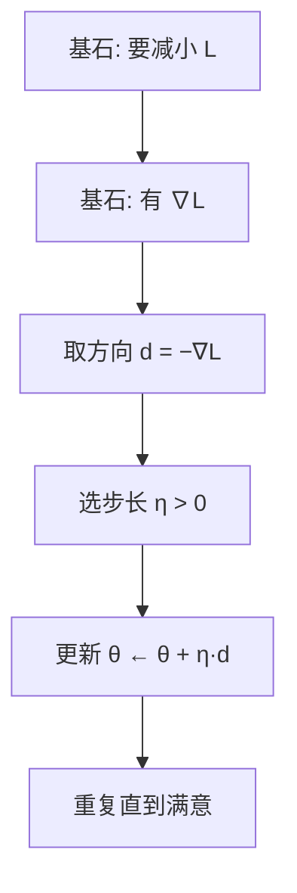
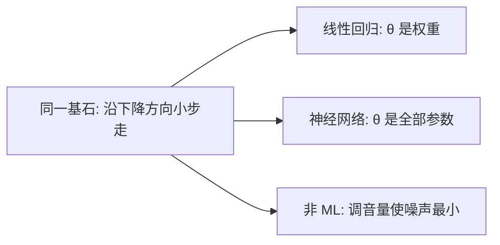
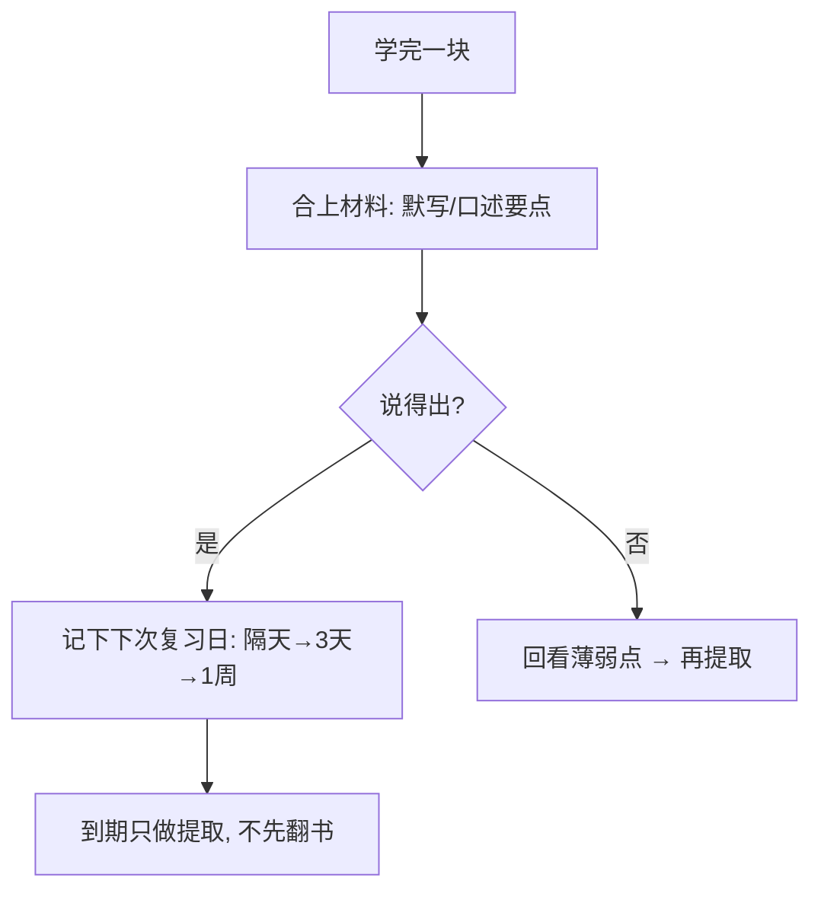
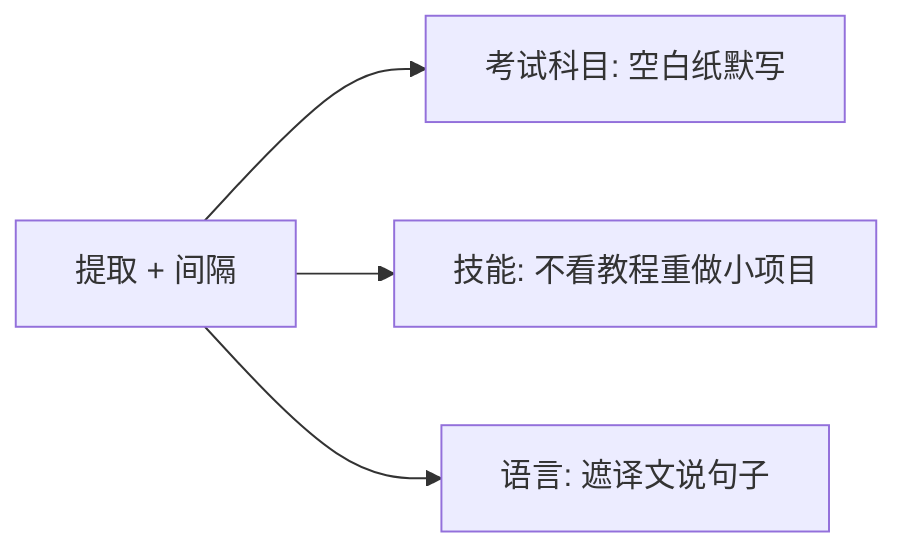

# 风格参考示例

Agent 对齐 **视觉密度与五阶段节奏**。勿机械复用主题；按用户主题重新推导。

---

## 示例 A（技术向）：为什么用梯度下降？

### 阶段 1 — 定界问题

| 项 | 内容 |
|----|------|
| 目标 | 理解「最小化损失」时为何常用梯度下降 |
| 成功标准 | 能画出一步更新，并说明学习率在干什么 |
| 已知 | 有可微损失 \(L(\theta)\) |
| In scope | 一阶方法直觉、一步更新公式 |
| Out of scope | 二阶方法推导、Adam 细节、收敛证明 |


### 阶段 2 — 拆到基石

| 常见假设 | 质疑 | 基石 |
|----------|------|------|
| 「优化 = 试很多随机参数」 | 高维不可穷举 | 需要 **方向信息**，不能纯盲搜 |
| 「直接求 L 的全局解析解」 | 多数模型无闭式解 | 接受 **迭代局部改进** |
| 「随便走一步就行」 | 上坡会变差 | 沿 **下降方向** 走 |
| 「方向随便估」 | 估错会发散 | 可微时，**负梯度** 是最陡下降方向 |

**基石列表**

1. 目标是使标量损失 \(L(\theta)\) 变小。
2. \(L\) 对 \(\theta\) 可微时，梯度 \(\nabla L\) 指向上升最快方向。
3. 因此 \(-\nabla L\) 是局部最陡下降方向。
4. 小步长 \(\eta\) 保证「方向对了也不会一步跨过谷底太远」（一阶近似有效区）。

```text
        结论: θ ← θ − η∇L
           ↑
    中层: 沿 −∇L 走一小步
           ↑
  基石: 可微 + 梯度几何 + 局部近似
```

### 阶段 3 — 自底向上重建



| | 类比做法 | 第一性原理做法 |
|--|----------|----------------|
| 起点 | 「教程都写了 GD」 | 从「减小 L + 可微」推出更新 |
| 风险 | 背公式用错学习率 | 知道 η 是「敢走多远」 |

### 阶段 4 — 推广应用



1. **神经网络**：基石不变；表象变成「参数极多、用反向传播算 ∇L」。
2. **一维调参**：同一逻辑——试探导数符号，往损失降的一侧挪。

### 阶段 5 — 检验

**费曼**：想让分数（损失）变小；坡度告诉你往哪边上坡，就反着走一小步，反复走。

| 问题 | 意图 |
|------|------|
| η 极大时会发生什么？ | 检验「局部近似 / 步长」基石 |
| 若 L 不可微，GD 直接套会怎样？ | 检验「可微」前提 |
| 为何常写 −∇L 而不是 +∇L？ | 检验方向基石 |

### 一页速览

- 基石：减 L、可微、−∇L 下降、η 控步
- 总图：见阶段 3 流程图
- 迁移：任何「可微目标 + 要变小」都可同一骨架

---

## 示例 B（通用向）：如何有效复习？

### 阶段 1 — 定界问题

| 项 | 内容 |
|----|------|
| 目标 | 从原理设计复习策略，而非抄「别人的打卡表」 |
| 成功标准 | 能说明为何间隔 + 主动提取优于纯重读 |
| In scope | 记忆巩固的基本机制与可操作习惯 |
| Out of scope | 具体 App、学科大纲 |

### 阶段 2 — 拆到基石

| 常见假设 | 质疑 | 基石 |
|----------|------|------|
| 「多看几遍就会」 | 再认 ≠ 提取 | 会用 = 能 **主动提取** |
| 「当天熬夜刷完最牢」 | 巩固需要时间 | 记忆随时间 **衰减**，需间隔强化 |
| 「标记了等于学会了」 | 标记是再认 | 难度适中的提取强化连接 |
| 「越轻松越好」 | 无努力无痕迹 | 合意困难（desirable difficulty）促进保持 |

**基石列表**

1. 学习目标是 **以后能提取**，不是当下眼熟。
2. 记忆痕迹会 **遗忘**。
3. **主动提取** 比被动重读更能强化痕迹。
4. **间隔重复** 在将忘未忘时复习，效率更高。

```text
        有效复习策略
            ↑
   提取练习 + 间隔安排
            ↑
  基石: 提取目标 / 遗忘曲线 / 合意困难
```

### 阶段 3 — 自底向上重建



| | 类比做法 | 第一性原理做法 |
|--|----------|----------------|
| 动作 | 反复划线重读 | 先测后看、间隔排期 |
| 反馈 | 「我觉得我会了」 | 提取失败处 = 真正该补的 |

### 阶段 4 — 推广应用



1. **编程**：隔天不看旧代码，重写函数；卡住再对照。
2. **演讲**：隔几天只凭提纲复述，而非重听录像全程。

### 阶段 5 — 检验

**费曼**：脑子会忘；与其反复看，不如定期逼自己想起来，想不起来再补。

| 问题 | 意图 |
|------|------|
| 为何「当天连看十遍」往往不如「隔天默写一遍」？ | 间隔 + 提取 |
| 开卷划重点算不算好的提取练习？ | 再认 vs 提取 |
| 若完全不难、次次满分，策略要怎么调？ | 合意困难 |

### 一页速览

- 基石：为提取而学、会忘、主动提取、间隔强化
- 总图：见阶段 3
- 迁移：凡「以后要用」的技能，都用提取+间隔，不靠重看

---

## Agent 自检清单（写完一轮后）

- [ ] 五阶段标题齐全（或符合 partial-run）
- [ ] 每阶段至少一种图/表
- [ ] 基石 3–7 条，且推导只用这些基石
- [ ] ≥2 个迁移场景
- [ ] 有检验问题 + 一页速览
