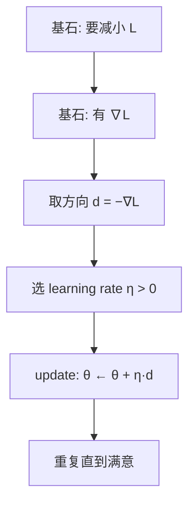
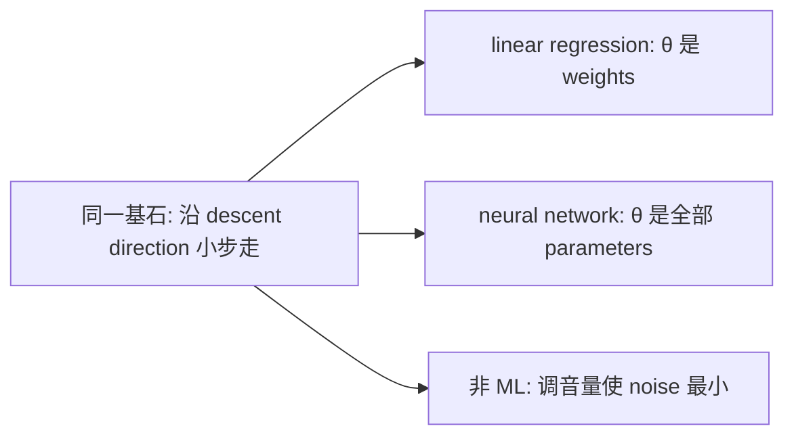
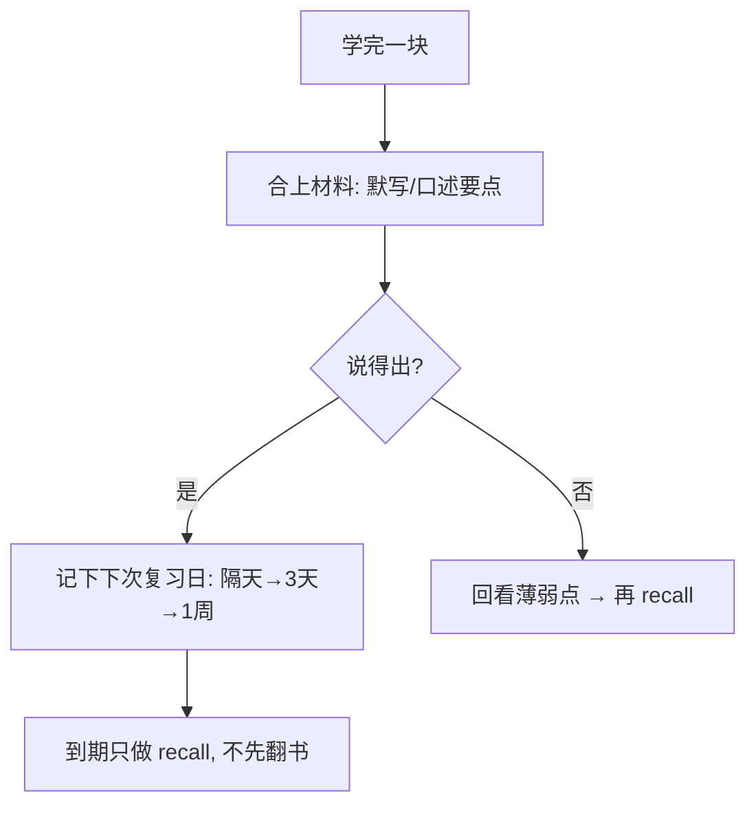
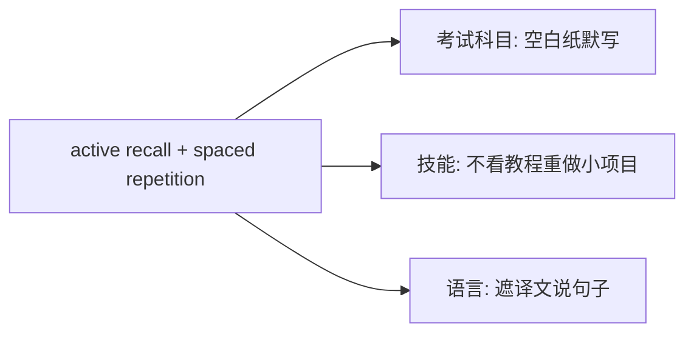

# 风格参考示例

Agent 对齐 **视觉密度、五阶段节奏与术语格式**。勿机械复用主题；按用户主题重新推导。

**术语提醒**（与 `SKILL.md` 一致）：
- 专业术语优先 **英文**：`gradient`、`loss`、learning rate \(\eta\)
- 写中文术语时必须 **中文 [English]**：梯度下降 [gradient descent]
- 日常叙述仍用中文

---

## 示例 A（技术向）：为什么用 gradient descent？

### 阶段 1 — 定界问题

| 项 | 内容 |
|----|------|
| 目标 | 理解「最小化 loss」时为何常用 gradient descent |
| 成功标准 | 能画出一步 update，并说明 learning rate 在干什么 |
| 已知 | 有可微 loss \(L(\theta)\) |
| In scope | first-order method 直觉、一步 update 公式 |
| Out of scope | second-order method 推导、Adam 细节、convergence proof |


### 阶段 2 — 拆到基石

| 常见假设 [assumption] | 质疑 | 基石 |
|----------|------|------|
| 「optimization = 试很多随机参数」 | 高维不可穷举 | 需要 **direction 信息**，不能纯盲搜 |
| 「直接求 L 的 global closed-form solution」 | 多数模型无 closed-form | 接受 **iterative local improvement** |
| 「随便走一步就行」 | 上坡会变差 | 沿 **descent direction** 走 |
| 「方向随便估」 | 估错会 diverge | 可微时，**negative gradient** 是最陡下降方向 |

**基石列表**

1. 目标是使标量 loss \(L(\theta)\) 变小。
2. \(L\) 对 \(\theta\) 可微时，gradient \(\nabla L\) 指向 ascent 最快方向。
3. 因此 \(-\nabla L\) 是局部最陡 descent direction。
4. 小 learning rate \(\eta\) 保证「方向对了也不会一步跨过谷底太远」（first-order approximation 有效区）。

```text
        结论: θ ← θ − η∇L
           ↑
    中层: 沿 −∇L 走一小步
           ↑
  基石: differentiable + gradient geometry + local approximation
```

### 阶段 3 — 自底向上重建



| | 类比做法 [analogical] | 第一性原理做法 [first principles] |
|--|----------|----------------|
| 起点 | 「教程都写了 GD」 | 从「减小 L + differentiable」推出 update |
| 风险 | 背公式用错 learning rate | 知道 \(\eta\) 是「敢走多远」 |

### 阶段 4 — 推广应用（迁移 [transfer]）



1. **neural network**：基石不变；表象变成「parameters 极多、用 backpropagation 算 \(\nabla L\)」。
2. **一维调参**：同一逻辑——试探 derivative 符号，往 loss 降的一侧挪。

### 阶段 5 — 检验

**费曼 [Feynman technique]**：想让分数（loss）变小；坡度（gradient）告诉你往哪边上坡，就反着走一小步，反复走。

| 问题 | 意图 |
|------|------|
| \(\eta\) 极大时会发生什么？ | 检验「local approximation / step size」基石 |
| 若 \(L\) 不可微，直接套 GD 会怎样？ | 检验「differentiable」前提 |
| 为何常写 \(-\nabla L\) 而不是 \(+\nabla L\)？ | 检验 direction 基石 |

### 一页速览

- 基石：减 \(L\)、differentiable、\(-\nabla L\) descent、\(\eta\) 控步
- 总图：见阶段 3 flowchart
- 迁移 [transfer]：任何「可微 objective + 要变小」都可同一骨架

---

## 示例 B（通用向）：如何有效复习？

### 阶段 1 — 定界问题

| 项 | 内容 |
|----|------|
| 目标 | 从原理设计复习策略，而非抄「别人的打卡表」 |
| 成功标准 | 能说明为何 spaced repetition + active recall 优于纯重读 |
| In scope | 记忆巩固的基本机制与可操作习惯 |
| Out of scope | 具体 App、学科大纲 |

### 阶段 2 — 拆到基石

| 常见假设 [assumption] | 质疑 | 基石 |
|----------|------|------|
| 「多看几遍就会」 | recognition ≠ retrieval | 会用 = 能 **active recall** |
| 「当天熬夜刷完最牢」 | consolidation 需要时间 | 记忆随时间 **decay**，需间隔强化 |
| 「标记了等于学会了」 | 标记是 recognition | 难度适中的 retrieval 强化连接 |
| 「越轻松越好」 | 无努力无痕迹 | 合意困难 [desirable difficulty] 促进 retention |

**基石列表**

1. 学习目标是 **以后能 retrieval**，不是当下眼熟。
2. 记忆痕迹会 **forgetting / decay**。
3. **active recall** 比被动重读更能强化痕迹。
4. **spaced repetition** 在将忘未忘时复习，效率更高。

```text
        有效复习策略
            ↑
   active recall + spaced schedule
            ↑
  基石: retrieval goal / forgetting curve / desirable difficulty
```

### 阶段 3 — 自底向上重建



| | 类比做法 | 第一性原理做法 |
|--|----------|----------------|
| 动作 | 反复划线重读 | 先测后看、spaced schedule |
| 反馈 | 「我觉得我会了」 | recall 失败处 = 真正该补的 |

### 阶段 4 — 推广应用



1. **编程**：隔天不看旧代码，重写函数；卡住再对照。
2. **演讲**：隔几天只凭提纲复述，而非重听录像全程。

### 阶段 5 — 检验

**费曼 [Feynman technique]**：脑子会忘；与其反复看，不如定期逼自己想起来，想不起来再补。

| 问题 | 意图 |
|------|------|
| 为何「当天连看十遍」往往不如「隔天默写一遍」？ | spaced repetition + recall |
| 开卷划重点算不算好的 active recall？ | recognition vs retrieval |
| 若完全不难、次次满分，策略要怎么调？ | desirable difficulty |

### 一页速览

- 基石：为 retrieval 而学、会 forget、active recall、spaced reinforcement
- 总图：见阶段 3
- 迁移：凡「以后要用」的技能，都用 recall + spacing，不靠重看

---

## Agent 自检清单（写完一轮后）

- [ ] 五阶段标题齐全（或符合 partial-run）
- [ ] 每阶段至少一种图/表
- [ ] 基石 3–7 条，且推导只用这些基石
- [ ] ≥2 个迁移场景
- [ ] 有检验问题 + 一页速览
- [ ] 专业术语为英文，或中文后附 `[English]`（全文含图/表）
