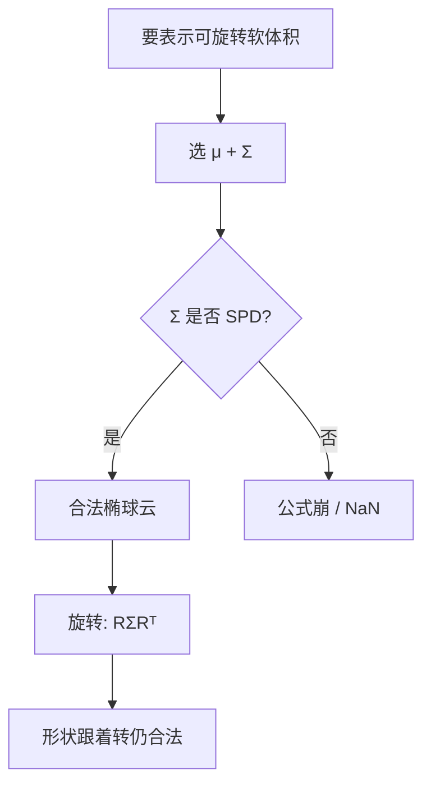
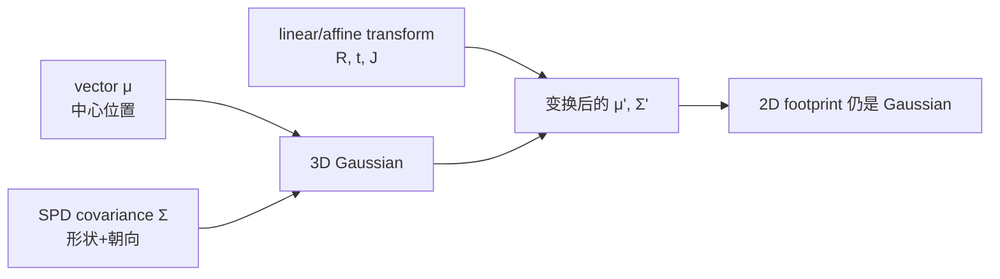
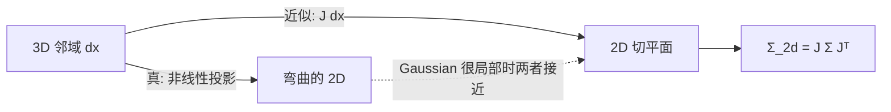
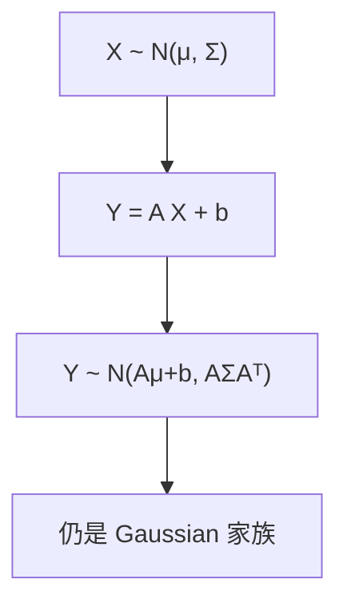

# 第 0 章：工欲善其事——数学概念是如何被「逼」出来的？

**本章核心问题**：当你打开 3D Gaussian Splatting（3DGS）的代码，屏幕上全是 matrix、gradient、covariance、Jacobian……这些东西不是为了考试而存在的抽象符号。它们是工程师在具体工程压力下，**被迫发明、被迫精炼**出来的工具。

如果你要从零重新发明 3DGS，你会需要哪些数学？**为什么必须是这些，而不是别的？**

读完本章，你应该能做到三件事：

1. 听到 `Σ`、`J`、`∇`、Mahalanobis distance 时，不再「看到公式就吓退」，而是能用白话讲出它们在解决什么问题。
2. 对每个重要概念，知道它的 **English name**、它被什么问题逼出来、它为什么在 3DGS 里几乎不可避免。
3. 能跑通最小 PyTorch 例子，亲手验证「linear transform 后 Gaussian 还是 Gaussian」这类关键性质。

---

## 0. 阅读约定（先把术语规则说清楚）

本教程会刻意打破「中文线性代数教材」的用词习惯。原因很简单：**很多中文术语既不直观，也不利于你读论文、读代码**。

因此约定如下：

| 规则 | 说明 | 例子 |
|------|------|------|
| 专业术语优先英文 | 主名称写 English | **vector**, **matrix**, **covariance** |
| 若写中文，必须带英文 | 中文只是辅助口感 | 协方差矩阵 [covariance matrix] |
| 公式与代码尽量对齐 | 代码里怎么写，文中就怎么叫 | `Sigma`、`R @ S @ R.T` |
| 概念用「概念卡」展开 | 起源 → 思想 → 为何不是别的 → 在 3DGS 里干什么 | 下文整章都是 |

你以后读 paper 时，会不断遇到这些词：

```text
vector, matrix, basis, transpose, eigenvalue, eigenvector,
positive definite, covariance, Jacobian, gradient, chain rule,
backpropagation, Gaussian, Mahalanobis distance, closure
```

本章就是把它们从「吓人符号」变成「你自己也会发明的工具」。

### 0.1 本章加餐怎么读：生活类比 + 失败对照

后面每张概念卡都补了两块「加餐」。阅读建议：

1. **先读 Origin / Core idea**（建立基石）  
2. **再读生活类比**（用画面记住，但必须能说回基石）  
3. **最后读失败对照**（知道错会怎样，比只知道对更重要）

技能约束（第一性原理 skill）在这里仍然有效：

> 隐喻可以用，但必须映射回定义与约束；不能只听故事。

一张总导航（类比 → 基石 → 3DGS 症状）：

| 概念 | 一个够用的生活画面 | 基石一句话 | 3DGS 里做错时常见症状 |
|------|-------------------|------------|------------------------|
| vector | 指路便利贴 | 有序分量，可加可数乘 | 维度反了，点飞走 |
| matrix | 旋转门 / 变形模具 | 编码 linear map | 少 `.T`，Σ 非法 |
| linear transform | 不弯折网格的拉扯 | 可加 + 齐次 | 误当透视全局线性 |
| covariance Σ | 面粉云 / 猫睡姿分布 | SPD 形状身份证 | 协方差爆炸、NaN |
| eigen | 沿木纹只拉不拧 | 主轴 + 拉伸倍率 | 读错轴长、劈错方向 |
| SPD | 碗不是马鞍 | 所有方向二次型 > 0 | cholesky/inv 失败 |
| gradient | 山雾里的坡度计 | 最速上升方向 | 符号反了 loss 飙升 |
| chain rule | 后厨追责流水线 | 复合导数连乘 | 断图，`grad is None` |
| Jacobian | 盘山路局部直线 | 多输出的一阶表 | footprint 透视错 |
| Gaussian | 软印章 / 喷枪 | 局部可微核 | 圆乎乎贴不住结构 |
| Mahalanobis | 按地形算的远近 | `(x-μ)ᵀΣ⁻¹(x-μ)` | 椭圆变圆或反相 |
| closure | 椭圆章转完还是椭圆 | `Y=AX+b` 仍 Gaussian | 换核后数学整条垮 |

---

## 一、定界问题：3DGS 到底在逼你学什么？

### 1.1 打开代码时的真实冲击

你在仓库里大概会看到类似下面的片段（示意，不是某仓库逐行拷贝）：

```python
# 协方差从 3D 投到 2D（核心投影）
Sigma_2d = J @ (R @ Sigma @ R.T) @ J.T

# 屏幕空间里某个像素对某个 Gaussian 的权重
# 这里用的是 Mahalanobis distance 的平方
weights = torch.exp(-0.5 * mahalanobis2(uv, mu_2d, Sigma_2d))

# 渲染图和真值图比一比
loss = 0.8 * L1(rendered, gt) + 0.2 * (1 - SSIM(rendered, gt))

# 反向传播：把 loss 对每个参数的 gradient 算出来
loss.backward()
```

第一反应常常是：

> 「这满屏的 matrix 乘法、`exp`、covariance……我是不是得回去补三个月数学？」

教科书式的「前置清单」会写：多元微积分、线性代数、概率论、优化。听起来像一整学期课表。

### 1.2 换一个问题：从「要学什么」改成「卡在哪」

不要问「需要学多少数学」。要问：

> **3DGS 到底在解决什么工程问题？每一步被什么卡住了？卡死后自然冒出了哪个工具？**

```text
原始问题
  「绕着物体拍一圈照片，重建出可以实时渲染的 3D 场景」
        │
        ▼
子问题 1：几何怎么表示？
  → 需要可微、能表达任意局部形状、又不能像 voxel 那样爆内存
  → 被逼出：3D Gaussian（用 mu + Sigma 描述一团软椭球云）

子问题 2：3D 的东西怎么变成屏幕上的 2D footprint？
  → 需要 world → camera → pixel 的变换
  → 被逼出：linear transform + Jacobian 局部线性化 + Sigma 传播

子问题 3：渲染结果和真值差多少？怎么改参数让它更像？
  → 需要可微的目标 + 可计算的更新方向
  → 被逼出：loss + gradient + chain rule / backpropagation
```

**关键洞察**：数学不是「前置装饰」，而是**问题求解链上的自然延伸**。每个概念出现时，都应该能回答：「如果没有它，工程会在哪一步断掉？」

### 1.3 本章的第一性原理节奏

我们用五个阶段拆每个工具（不必死背阶段名，但理解路径要保留）：

```text
1. 定界问题   → 我们卡在什么具体困难上？
2. 拆基石     → 哪些事实几乎不可再拆？
3. 重建       → 从这些事实如何推出工具？
4. 迁移应用   → 它在 3DGS 哪一行代码里出现？
5. 检验理解   → 遮住公式，你还能重推吗？
```

**真正的理解** = 你能独立完成第 5 步。如果你不能重新发明一个概念，你多半只是在背公式。

---

## 二、线性代数——为什么它是 3D 表示的「母语」？

### 2.1 问题起点：怎么用数字描述一个 3D 椭球？

假设你要在程序里存「一团 3D 软云」，中心在某处，形状可以拉长、压扁、旋转。最直觉的写法大概是：

```python
gaussian = {
    "center": (x, y, z),            # 位置，好懂
    "axes_length": (a, b, c),       # 三个半轴长度
    "rotation": (roll, pitch, yaw)  # 欧拉角 [Euler angles]
}
```

听起来很合理。但马上会撞墙：

> **如果我要把这团云绕某个轴再转 30°，这些参数怎么更新？**

欧拉角很快变成噩梦：

- **Gimbal lock（万向节死锁）**：某个角度到 90° 附近时，自由度「粘」在一起。
- **非交换性**：先绕 X 再绕 Y ≠ 先绕 Y 再绕 X。复合旋转很丑。
- **形状与朝向纠缠**：旋转后半轴怎么在旧参数里改，没有干净公式。

于是工程上会想：

> 与其分开存「形状 + 旋转」再痛苦地拼，不如找一个对象，让「旋转后的形状」用同一种代数操作自然更新。

这个对象，就是 **covariance matrix Σ**。

---

### 概念卡 1：Vector（向量）

#### English name
**vector**

#### 中文通俗说法
向量 [vector]：一串有序数字，表示「空间里的一个箭头」或「一组并列的量」。

#### Origin（起源）
人类很早就需要同时记录多个相关量：位置有 (x, y, z)，颜色有 (r, g, b)，速度有三个分量。把它们捆成一个对象，比拆成三个独立标量更省心。物理与几何把「有方向、有长度的量」抽象成 vector；线性代数又把它推广成「任意维度上的有序列表」。

在图形学里，你几乎每时每刻都在处理 vector：

- 点的位置 `mu ∈ R³`
- 颜色 `c ∈ R³`
- 像素坐标 `uv ∈ R²`
- 一个参数的 gradient `∇L ∈ Rⁿ`

#### Core idea（核心思想）

可以把 vector 想成：

```text
v = [v1, v2, ..., vn]
```

两种互补读法（都很有用）：

1. **几何读法**：从原点出发的一根箭头。加法 = 首尾相接；数乘 = 拉长/缩短/反向。
2. **列表读法**：n 个并列的数。坐标、颜色、参数打包后一起变换、一起求导。

ASCII 直觉（2D）：

```text
        y
        ^
        |     *  v = (2, 3)
        |    /
        |   /
        |  /
        | /
        +---------> x
```

#### Why not alternatives（为何不是别的）
- 为什么不只用三个标量变量 `x, y, z`？因为变换、求导、批量计算时，vector 能整块操作，代码与公式都更干净。
- 为什么不直接用「长度 + 角度」表示一切？在 3D 以上，角度参数化会变得又丑又脆；Cartesian vector 更稳。

#### In 3DGS（在 3DGS 里干什么）
- `mu`：Gaussian 中心，3D vector
- `t`：平移，3D vector
- `grad`：每个参数的 gradient，本身也是 vector
- 颜色、SH 系数：高维 vector

#### Worked example / PyTorch

```python
import torch

# 一个 3D 位置
mu = torch.tensor([1.0, 2.0, 3.0])

# 平移：vector 加法
t = torch.tensor([0.5, -1.0, 0.0])
mu_shifted = mu + t
print("mu_shifted =", mu_shifted)

# 数乘：整体缩放（注意：这不是「旋转」）
mu_scaled = 2.0 * mu
print("mu_scaled =", mu_scaled)

# 点积：衡量「对齐程度」
a = torch.tensor([1.0, 0.0, 0.0])
b = torch.tensor([0.5, 0.5, 0.0])
print("dot =", torch.dot(a, b))  # 0.5
```

#### Common confusions（易混点）
1. **点 vs vector**：几何上点是位置，vector 是位移；计算上常常都用 `R³` 里的三元组表示，但语义不同。
2. **行向量 vs 列向量**：数学默认常写列向量；PyTorch 的 1D tensor 在 `@` 时要自己想清楚形状。3DGS 代码里务必检查 `shape`。
3. **「向量」不是「方向」的同义词**：方向常指 unit vector；一般 vector 还有长度。

#### 生活类比（必须映射回基石）

把 **vector** 想成「一张便利贴上写的一组数字指令」，而不是「抽象符号」。

| 生活画面 | 对应基石 |
|----------|----------|
| 快递单上的收件地址 `(小区, 楼栋, 门牌)` | 有序的多个分量捆在一起，顺序有意义 |
| 「往东走 3 步、往北走 1 步」的指路 | 几何箭头：有方向、有长度 |
| 把两段指路首尾相接 | vector 加法 = 位移合成 |
| 把整段指路「乘 2」= 每步都加倍 | 数乘 = 统一缩放 |

> 类比到此为止。基石是：`Rⁿ` 中的有序元组，支持加法和数乘，并能被 matrix 整体变换。

#### 失败对照：做对 vs 做错

| 场景 | 做对 | 做错时你看到什么 |
|------|------|------------------|
| 存 Gaussian 中心 | `mu` 是 shape `(N,3)` 的位置 | 把 `(N,3)` 和 `(3,N)` 弄反，旋转后全场飞走 |
| 更新参数 | `mu = mu - lr * grad`，形状一致 | `grad` 广播错维，只有某一轴在动 |
| 点 vs 位移 | 变换位置用 `R @ x + t` | 只做 `R @ x` 忘平移，整体偏到错误原点 |
| 单位 | 世界坐标用米、统一尺度 | 混用毫米/归一化坐标，数值要么爆炸要么不动 |

```text
症状速记：
  「所有点绕错误轴转」→ 多半是 vector 排布/乘矩阵顺序问题
  「只有 x 在动」    → 梯度或索引只打到了第 0 分量
```

---

### 概念卡 2：Matrix（矩阵）

#### English name
**matrix**

#### 中文通俗说法
矩阵 [matrix]：把一堆数字排成「行 × 列」的矩形表；在本教程语境下，它几乎总是在扮演 **linear transform（线性变换）** 的角色。

#### Origin（起源）
当人们发现：对很多 vector 做「同类操作」（旋转、缩放、剪切、投影）时，操作本身也可以用数字表编码，于是 matrix 出现了。它让「变换」成为可以相乘、可以复合、可以求导的对象。

在 3D 图形里，没有 matrix 几乎寸步难行：相机外参、内参、旋转、协方差变换……全是它。

#### Core idea（核心思想）

一个 `m × n` matrix 把 `Rⁿ` 里的 vector 送到 `Rᵐ`：

```text
y = A @ x
```

直观图：

```text
  x (n维)          A (m×n)           y (m维)
 [x1]           [ a11 a12 ... ]     [y1]
 [x2]     -->   [ a21 a22 ... ] --> [y2]
 [...]          [ ...         ]     [...]
 [xn]                               [ym]
```

两件必须建立的肌肉记忆：

1. **matrix × vector** = 对 vector 做一次线性变换
2. **matrix × matrix** = 把两次变换合成一次（先右后左，注意顺序）

#### Why not alternatives（为何不是别的）
- 为什么不用一堆 `if/else` 描述变换？因为连续参数、批量 GPU 计算、求导都需要代数结构。
- 为什么不用纯几何语言（「绕轴转 θ」）？几何语言适合说话；matrix 适合计算与复合。

#### In 3DGS（在 3DGS 里干什么）
- 旋转 `R`：`3×3` matrix
- 相机内参 `K`：`3×3` matrix
- 协方差 `Σ`：`3×3`（对称）matrix
- Jacobian `J`：投影局部线性化的 matrix
- 代码里到处都是 `A @ B @ C.T`

#### Worked example / PyTorch

```python
import torch

# 绕 z 轴旋转 90 度（二维示意嵌入 3D）
theta = torch.tensor(torch.pi / 2)
R = torch.tensor([
    [torch.cos(theta), -torch.sin(theta), 0.0],
    [torch.sin(theta),  torch.cos(theta), 0.0],
    [0.0,               0.0,              1.0],
])

v = torch.tensor([1.0, 0.0, 0.0])
v_rot = R @ v
print("rotated =", v_rot)  # 约 [0, 1, 0]

# 复合变换：先 R1 再 R2  <=>  (R2 @ R1) @ v
R1 = R
R2 = R  # 再转 90°，总共 180°
v2 = (R2 @ R1) @ v
print("after two 90deg =", v2)  # 约 [-1, 0, 0]
```

#### Common confusions（易混点）
1. **matrix 不是「表格数据」的同义词**：在 3DGS 语境，优先把它理解成 transform。
2. **左右乘顺序**：`R2 @ R1 @ v` 是先 `R1` 再 `R2`。写反会「怎么转都不对」。
3. **transpose（转置）** `A.T`：行列互换。协方差变换里的 `R @ Σ @ R.T` 少写一个 `.T` 就会错。

#### 生活类比（必须映射回基石）

把 **matrix** 想成「一套可复用的变形模具」，而不是 Excel 表格。

| 生活画面 | 对应基石 |
|----------|----------|
| 复印机的「放大 2 倍」按钮 | 一个固定规则，作用到任何输入页面 |
| 先裁切再旋转 = 两道工序 | `R2 @ R1`：变换可以复合 |
| 同一套模具可印一万张 | 同一个 `R` 可作用到所有 Gaussian 中心 |
| 模具说明书是数字表 | matrix 的元素就是这套规则的编码 |

更贴 3DGS 的画面：

```text
你站在旋转门里（R）：
  进门前：世界坐标系里的位置
  出门后：相机坐标系里的位置
旋转门规则固定 → 一个 3×3 matrix
每个人（每个 mu）走同一扇门 → R @ mu
```

> 映射回基石：matrix 定义 linear map；乘法对应复合；`.T` 在 `R Σ R.T` 里是为了正确变换二次型/协方差。

#### 失败对照：做对 vs 做错

| 操作 | 做对 | 做错与症状 |
|------|------|------------|
| 旋转点 | `mu_cam = R @ mu + t` | 写成 `mu @ R` 且 shape 侥幸跑通 → 静默错旋转 |
| 旋转协方差 | `Σ' = R @ Σ @ R.T` | 写成 `R @ Σ` 或缺 `.T` → 椭球被剪成非法形状，渲染糊/NaN |
| 复合外参 | 明确「先世界到相机还是反过来」 | 用了 `R.T` 该用 `R` → 场景整体镜像或躺倒 |
| 调试 | 打印 `R @ R.T` 应接近 `I` | 未正交化的“旋转矩阵” → 带缩放的怪变形 |

```text
口诀：
  变 vector：左边乘  R @ v
  变 Σ：     夹心饼  R @ Σ @ R.T
  少一个 .T：饼皮不对称，椭球会「歪到数学不允许」
```

---

### 概念卡 3：Linear Transform（线性变换）

#### English name
**linear transform / linear transformation**

#### 中文通俗说法
线性变换 [linear transform]：满足「叠加原理」的变换——先加后变 = 先变后加；缩放也能提出来。

#### Origin（起源）
物理与几何里大量操作天然近似线性：小范围内的旋转、缩放、剪切。人们发现：若变换满足

```text
f(ax + by) = a f(x) + b f(y)
```

它就能用一个 matrix 完全表示。线性代数大半都在研究这类对象。

#### Core idea（核心思想）

线性变换的两个公理（这就是它的「灵魂」）：

1. **可加性**：`f(u + v) = f(u) + f(v)`
2. **齐次性**：`f(c · u) = c · f(u)`

几何上，它会把网格变成「仍然是直边平行四边形网格」的样子（原点固定）。旋转、均匀/非均匀缩放、剪切都是 linear transform；**平移不是**（平移会把原点挪走），所以完整刚体变换常说 **affine transform**（仿射变换 [affine transform]）：`y = A x + b`。

```text
原网格:                 旋转+缩放后:
+---+---+               /  /  /
|   |   |              /  /  /
+---+---+             +--+--+
|   |   |            /  /  /
+---+---+           +--+--+
```

#### Why not alternatives（为何不是别的）
- 完全非线性的变换（随意扭曲）表达力更强，但：难求逆、难传播不确定性、难保证 Gaussian 还是 Gaussian。
- 3DGS 的策略是：大框架尽量落在 linear / affine，透视投影这种非线性用 **Jacobian 局部线性化** 拉回线性世界。

#### In 3DGS（在 3DGS 里干什么）
- 世界坐标 → 相机坐标：`mu_cam = R @ mu_world + t`（affine）
- 协方差旋转：`Σ_cam = R @ Σ_world @ R.T`（linear 作用在协方差上）
- 投影附近：用 `J` 做局部 linear transform，得到 `Σ_2d ≈ J @ Σ_cam @ J.T`

#### Worked example / PyTorch

```python
import torch

def apply_affine(A, b, x):
    return A @ x + b

A = torch.tensor([[2.0, 0.0],
                  [0.0, 0.5]])  # x 拉长，y 压扁
b = torch.tensor([1.0, -1.0])
x = torch.tensor([1.0, 1.0])
print(apply_affine(A, b, x))  # [3.0, -0.5]
```

#### Common confusions（易混点）
1. **linear vs affine**：有没有 `+ b`。协方差只被线性部分 `A` 变换，平移不改形状。
2. **透视投影不是全局 linear**：所以才需要 Jacobian。
3. **「线性」≠「直线轨迹动画」**：这里的 linear 是代数性质，不是「匀速直线运动」。

#### 生活类比（必须映射回基石）

**linear transform** ≈「不弯曲网格线的拉扯」。

| 生活画面 | 行 / 不行 | 原因（基石） |
|----------|-----------|--------------|
| 把方格橡皮泥均匀拉长 | ✅ 近似 linear | 直线仍是直线，原点可固定 |
| 旋转整张照片 | ✅ linear（正交） | 网格仍是网格 |
| 把照片放进哈哈镜（中心鼓、边缘缩） | ❌ 非线性 | 直线变曲线 |
| 把整张图挪到右边 3cm | ❌ 非 linear，是 affine | 原点也动了：`+ b` |

3DGS 的生存策略可以翻译成：

```text
尽量待在「橡皮泥均匀拉扯」的世界
（R、diag(s)、局部 J）

遇到「哈哈镜」（透视）
→ 只在小橡皮筋邻域用切线代替弧线
→ 这就是 Jacobian 局部线性化
```

#### 失败对照：做对 vs 做错

| 你以为… | 实际… | 失败症状 |
|---------|--------|----------|
| 平移会改变椭球胖瘦 | 平移不进 Σ | 你写了 `Σ + t` 之类胡公式 → 形状乱跳 |
| 透视可以像旋转一样全局用一个 `A` | 透视非线性 | 远近尺度全错，大深度 Gaussian footprint 离谱 |
| 「线性」= 动画里匀速 | 代数可加可齐 | 概念串台，看论文时完全对不上 |

---

### 概念卡 4：Covariance Matrix Σ（协方差矩阵）

#### English name
**covariance matrix**，常记作 **Σ (Sigma)**

#### 中文通俗说法
协方差矩阵 [covariance matrix]：用一个对称 matrix 同时编码「各方向有多散」以及「方向之间如何耦合」。在 3DGS 里，它几乎就是 **Gaussian 椭球的形状身份证**。

#### Origin（起源）
统计里，人们不只关心「x 自己的方差 [variance]」，还关心「x 与 y 是否一起变」。把所有两两关系排成表，就得到 covariance matrix。

几何上更妙的是：对 multivariate Gaussian 来说，Σ 的 level set（等密度面）是椭球。于是「统计上的相关结构」和「空间里的椭球形状」成了同一件事。3DGS 正是吃到了这点。

#### Core idea（核心思想）

3D 时：

$$
\Sigma =
\begin{bmatrix}
\sigma_{xx} & \sigma_{xy} & \sigma_{xz} \\
\sigma_{yx} & \sigma_{yy} & \sigma_{yz} \\
\sigma_{zx} & \sigma_{zy} & \sigma_{zz}
\end{bmatrix}
$$

- 对角线：各轴自己的 variance（有多「胖」）
- 非对角线：跨轴 covariance（轴是否「斜着联动」）
- 必须 **symmetric（对称）**：`Σ = Σ.T`（因为 `Cov(x,y)=Cov(y,x)`）
- 必须 **positive definite（正定）**（见下一张概念卡），否则不能当合法 Gaussian 形状

旋转一个协方差非常优雅：

$$
\Sigma' = R \, \Sigma \, R^{\top}
$$

对比欧拉角方案，这就是「三次 matrix 乘法」 vs 「一堆角度重算」。

```text
轴对齐的瘦长椭球          旋转 R 之后
Σ = diag(4, 0.25, 1)      Σ' = R Σ R.T

   (很长)
  <------>                 变成斜着的瘦长云
     ||
     || (很扁)
```

#### Why not alternatives（为何不是别的）
| 表示 | 问题 |
|------|------|
| 只存三个 scale，不存旋转 | 无法表达斜向结构 |
| 欧拉角 + 半轴 | 复合旋转痛苦，万向节问题 |
| 直接存任意 3×3 不对称 matrix | 破坏对称性，不再是合法 covariance |
| 用 mesh 小片 | 可微性与 densify 都更麻烦 |

Σ 是「形状 + 朝向」的最小且对 linear transform 友好的打包方式。

#### In 3DGS（在 3DGS 里干什么）
每个 3D Gaussian 的几何核心就是 `μ + Σ`：
- `μ` 说「中心在哪」
- `Σ` 说「往哪些方向延伸、延伸多远」

实现里常常不直接优化裸 `Σ`，而是优化 **scale + quaternion(rotation)**，再重建：

$$
\Sigma = R(q) \; \mathrm{diag}(s_1^2, s_2^2, s_3^2) \; R(q)^{\top}
$$

#### Worked example / PyTorch

```python
import torch

def geometry_to_sigma(axes_length: torch.Tensor, R: torch.Tensor) -> torch.Tensor:
    """axes_length: (3,), R: (3,3) with columns = axes directions"""
    Lambda = torch.diag(axes_length ** 2)
    return R @ Lambda @ R.T

def sigma_to_geometry(Sigma: torch.Tensor):
    # eigh for symmetric matrices: eigenvalues ascending
    evals, evecs = torch.linalg.eigh(Sigma)
    axes = torch.sqrt(torch.clamp(evals, min=1e-12))
    return axes, evecs

# 一个扁长的椭球，绕 z 转 45°
axes = torch.tensor([2.0, 0.3, 0.5])
ang = torch.tensor(torch.pi / 4)
c, s = torch.cos(ang), torch.sin(ang)
R = torch.tensor([
    [c, -s, 0.0],
    [s,  c, 0.0],
    [0.0, 0.0, 1.0],
])
Sigma = geometry_to_sigma(axes, R)
print("Sigma =\n", Sigma)

axes2, R2 = sigma_to_geometry(Sigma)
print("recovered axes ≈", axes2)
```

#### Common confusions（易混点）
1. **Σ 不是旋转矩阵**：旋转矩阵满足 `R.T @ R = I`；Σ 满足对称正定，特征值是「长度平方」相关量。
2. **Σ 的元素不是「半轴长度」本身**：半轴长度来自 eigenvalue 的平方根（在标准参数化下）。
3. **实现层 vs 几何层**：论文写 Σ，代码可能写 `scaling` + `rotation`。

#### 生活类比（必须映射回基石）

把 **covariance Σ** 想成「一团会呼吸的气球身份证」，不是「旋转旋钮」。

**类比 1：猫在沙发上的睡姿分布**

```text
你记录猫咪 1000 次出现位置 (x,y)：

  ·  ····  ·
 ··········
  ········ ·     ← 沿沙发长边更分散
    ····

对角线大：那一轴「爱乱跑」
非对角不为 0：两轴联动（比如总是斜着趴）
```

- `σ_xx` 大：左右活动范围大  
- `σ_yy` 小：前后不太动  
- `σ_xy ≠ 0`：睡姿主轴是斜的  

**映射回基石**：Σ 编码各方向 variance 与 cross-covariance；Gaussian 的等密度线正是这些数决定的椭圆。

**类比 2：厨房里的「面粉云」**

你撒了一小撮面粉：

- 中心 `μ` = 最厚的地方  
- Σ = 这团粉往哪些方向铺得开  

转盘子 = 左乘旋转：`Σ' = R Σ R.T`  
粉团形状跟着转，但「仍是一团椭圆粉」——不必重新发明表示。

**类比 3：为什么不用「长宽高 + 欧拉角」当身份证？**

像用「肩宽、身高、三个转角」描述一个人的体型在旋转门里怎么过：

- 转角有万向节死锁 [gimbal lock]  
- 连续转两圈顺序不可随便交换  
- 而 Σ 一张对称表 + `R Σ R.T` 直接吃旋转  

#### 失败对照：做对 vs 做错

| 意图 | 做对 | 做错 | 你会看到的失败 |
|------|------|------|----------------|
| 让椭球变胖 | 增大 scale / 增大特征值 | 只改 `μ` | 位置漂，形状不变 |
| 旋转椭球 | `R Σ R.T` 或改 quaternion | 只改 `R` 作用在 `μ` 上 | 中心在转，糊成一团的方向不转 |
| 变薄贴墙面 | 一个 scale → 很小 | 三个 scale 一起缩小 | 变小点云，贴不住平面 |
| 保证合法 | scale 用 `exp`，Σ SPD | 裸改 Σ 元素无约束 | `eig` 出现负值、`inv` NaN、黑屏 |
| 读懂调试 | `eigh(Σ)` 看轴长 | 把 Σ[0,0] 当「绕 x 转角」 | 完全读不懂训练日志 |

```text
失败故事 A：写成 Σ' = R @ Σ
  → Σ' 不再对称
  → 后面当 covariance 用时，eigen 分解出现复数/负值
  → loss 变 nan

失败故事 B：把 Σ 的 9 个数当 free param 乱优化
  → 离开 SPD 锥
  → 3DGS 经典「协方差爆炸」

失败故事 C：以为 Σ 越大颜色越亮
  → 其实 Σ 管的是空间铺展；亮度/遮挡主要是 alpha 与混合
  → 越优化越糊，还以为在调曝光
```



---

### 概念卡 5：Eigenvalue / Eigenvector（特征值 / 特征向量）

#### English name
**eigenvalue**, **eigenvector**；合称 **eigen decomposition / eigendecomposition**

#### 中文通俗说法
特征值 [eigenvalue] / 特征向量 [eigenvector]：对一个 matrix 来说，「只被拉长/缩短、方向不转」的那些特殊方向，以及对应的拉伸倍率。

#### Origin（起源）
研究 linear transform 时，最关心的是：空间被怎么拉伸？哪些方向是「主轴」？eigen 理论就是把任意对称 matrix 的作用，分解成「在一组正交 basis 上分别缩放」。

对 covariance 而言，这正好把「打包在一起的形状」拆回「半轴长度 + 轴向」。

#### Core idea（核心思想）

若

$$
A v = \lambda v, \quad v \neq 0
$$

则 `v` 是 eigenvector，`λ` 是 eigenvalue：变换后方向不变，只乘上倍率 `λ`。

对对称的 Σ，总可以写：

$$
\Sigma = V \, \Lambda \, V^{\top}
$$

其中：

- `Λ = diag(λ1, λ2, λ3)`：eigenvalues（与半轴长度平方相关）
- `V` 的列：eigenvectors（三个主轴方向，彼此正交）

```text
Σ 的「压缩包」视图：

  形状信息 ──打包──▶ Σ
                    │
                    │  eigendecomposition
                    ▼
            半轴长度² + 主轴方向
```

#### Why not alternatives（为何不是别的）
- 为什么不直接盯着 Σ 的 9 个数看形状？因为人眼读不懂斜着的耦合项；eigen 分解给出几何可读形式。
- 为什么用 `eigh` 而不是普通 `eig`？因为 Σ 对称，`eigh` 更稳、保证正交特征向量。

#### In 3DGS（在 3DGS 里干什么）
- 调试时：从 Σ 读出「这团 Gaussian 有多扁、朝哪」
- densify / split 策略里：有时会看 scale（与 eigen 相关）决定怎么拆
- 理解 `Σ = R diag(s²) R.T` 与 eigen 分解是同一家族的故事

#### Worked example / PyTorch

```python
import torch

Sigma = torch.tensor([
    [2.0, 0.5, 0.0],
    [0.5, 1.0, 0.0],
    [0.0, 0.0, 0.25],
])
evals, evecs = torch.linalg.eigh(Sigma)
print("eigenvalues =", evals)
print("eigenvectors (columns) =\n", evecs)

# 重建应回到 Sigma
Sigma_recon = evecs @ torch.diag(evals) @ evecs.T
print("recon error =", torch.norm(Sigma - Sigma_recon))
```

#### Common confusions（易混点）
1. **eigenvalue 不是半轴长度，常是半轴长度的平方**（对 covariance 参数化而言）。
2. **特征向量方向有符号歧义**：`v` 与 `-v` 都合法。
3. **顺序**：`eigh` 常从小到大返回；不要假设第 0 个一定是「最长轴」。

#### 生活类比（必须映射回基石）

**eigen 分解** ≈ 把「斜着的变形」翻译回「沿木纹的拉伸」。

想象一块有木纹的橡胶板：

- 你斜着拉它，看起来很复杂  
- 但存在两个特殊方向（木纹方向与垂直方向）：**只被拉长/压扁，不发生扭转**  
- 这两个方向 = **eigenvectors**  
- 拉长倍率 = **eigenvalues**  

对 Σ：

```text
人看不懂的斜表 Σ
        │ eigh
        ▼
「这条轴有多长²、那条轴有多长²、轴朝哪」
```

#### 失败对照：做对 vs 做错

| 任务 | 做对 | 做错 |
|------|------|------|
| 从 Σ 读几何 | `axes = sqrt(eigenvalues)` | 直接把 eigenvalue 当米制长度 → 尺度平方错误 |
| 找最长轴 | `argmax(evals)` | 盲目取 `evals[0]`（eigh 常从小到大） |
| 可视化方向 | 画 `±eigenvector` 都可 | 因符号跳变以为「轴在 180° 翻转 bug」 |
| split 大 Gaussian | 沿最大轴劈开 | 沿最小轴劈 → 越拆越碎且不贴结构 |

---

### 概念卡 6：Positive Definite（正定）

#### English name
**positive definite**（常写 **SPD**：symmetric positive definite）

#### 中文通俗说法
正定 [positive definite]：一个对称 matrix 对所有非零 vector 都给出正的「能量」`v.T @ A @ v > 0`。对 covariance 来说，它保证椭球半轴长度都是正的、Gaussian 公式合法。

#### Origin（起源）
二次型 `v.T @ A @ v` 在优化、物理能量、概率密度里无处不在。人们需要一个条件，保证「这个二次型真的像一个碗（bowl），而不是马鞍或平面」。positive definite 就是这个条件。

#### Core idea（核心思想）

对称 matrix `A` 正定 ⟺ 对所有 `v ≠ 0`：

$$
v^{\top} A v > 0
$$

等价常用判定：

- 所有 eigenvalue `> 0`
- 存在可逆 `B` 使 `A = B B.T`（直觉：A 自己是「某个线性变换的 Gram」）

```text
positive definite:     所有方向都「向上弯」
      z
      |   * *
      | *     *
      |*       *
      +----------

indefinite:            有的方向上弯，有的下弯（马鞍）
      *         *
        *     *
          * *
          * *
        *     *
      *         *
```

#### Why not alternatives（为何不是别的）
- **semi-definite（半正定）** 允许某些方向「完全扁成 0 厚度」。理论上像纸片，数值上 `Σ^{-1}`、`logdet` 会炸。
- 若不约束正定：Gaussian 的归一化项 `1/√|Σ|` 可能变复数；Mahalanobis distance 也失去「距离」意义。

#### In 3DGS（在 3DGS 里干什么）
保证每个 Gaussian 的 Σ 合法。这也是为什么实现常优化：

- `scale` 经过 `exp` 保证为正
- `rotation` 用 quaternion 再归一化

而不是直接无约束地改 Σ 的 6 个独立元素（虽然 6 元素参数化也可做，但要更小心）。

#### Worked example / PyTorch

```python
import torch

def is_positive_definite(A: torch.Tensor, eps: float = 1e-8) -> bool:
    # 对称化，避免数值噪声破坏对称性
    A = 0.5 * (A + A.T)
    evals = torch.linalg.eigvalsh(A)
    return bool(torch.all(evals > eps))

good = torch.tensor([[2.0, 0.3], [0.3, 1.0]])
bad = torch.tensor([[1.0, 2.0], [2.0, 1.0]])  # 可能不正定
print("good:", is_positive_definite(good))
print("bad:", is_positive_definite(bad))
print("eig(bad) =", torch.linalg.eigvalsh(0.5 * (bad + bad.T)))
```

#### Common confusions（易混点）
1. **对角线全正 ≠ 一定正定**（非对角项太大时仍可能坏）。
2. **行列式 `det>0` 不够**：两个负 eigenvalue 也会让 det 为正。
3. **训练中的 Σ 可能数值上滑出正定**：所以参数化与 `eps` clamp 很重要。

#### 生活类比（必须映射回基石）

**positive definite** ≈ 「无论你从哪个方向按皮球，它都往外顶，而不是塌成马鞍」。

| 画面 | 数学 |
|------|------|
| 碗：怎么放弹珠都滚向碗底附近 | 二次型 `v.T A v` 对所有方向 > 0 |
| 马鞍：有的方向上坡，有的下坡 | indefinite：有正有负 eigenvalue |
| 平面桌：有的方向完全不弯 | semi-definite：有 0 eigenvalue |

Gaussian 的「合法身体」要求 Σ 是碗，不是马鞍——否则密度公式、距离、开方全会闹鬼。

#### 失败对照：做对 vs 做错

| 做法 | 结果 |
|------|------|
| scale 走 `exp` / softplus | 半轴 > 0，Σ 更易保持 SPD ✅ |
| 直接优化 Σ 的 6 元无投影 | 训练中途 eigenvalue 变负 → `cholesky`/`inv` 失败 |
| 只检查对角 > 0 | 漏掉「相关项过大」的非 SPD |
| 只检查 `det>0` | 可能两个负特征值，det 仍正，仍然非法 |

```text
训练日志里的凶兆：
  RuntimeError: cholesky / singular / nan in backward
  先查：Σ 是否还在 SPD 锥里
```

---

### 2.2 小结：线性代数三件套如何拼成「可旋转的软椭球」

把前面串起来：



你需要记住的最小公式组：

```text
μ'     = R @ μ + t
Σ'     = R @ Σ @ R.T
Σ_2d  ≈ J @ Σ' @ J.T
```

---

## 三、微积分——为什么 gradient 是「现在最该走的方向」？

### 3.1 问题起点：参数太多，随机瞎试会死

训练 3DGS 时，大致有：

```python
loss = L1(render(mu, Sigma, alpha, color), ground_truth)
```

你想改 `mu / Sigma / alpha / color` 让 loss 变小。若场景有 ~10⁶ 个 Gaussian，每个十几个参数，参数空间是百万到千万维。

随机搜索：

```python
for _ in range(1_000_000):
    mu_new = mu + 0.01 * torch.randn_like(mu)
    if loss_fn(mu_new) < loss_fn(mu):
        mu = mu_new
```

在如此高维空间里，这基本是 Recreational Suffering（娱乐性受苦）。你需要的是：**在当前点，哪个方向能让 loss 下降最快？**

---

### 概念卡 7：Gradient（梯度）

#### English name
**gradient**，记作 **∇L** 或 `grad`

#### 中文通俗说法
梯度 [gradient]：把「每个参数方向上的偏导数」排成一个 vector；它指向 **标量函数上升最快的方向**。训练时我们走它的反方向。

#### Origin（起源）
一维时，导数 [derivative] `df/dx` 告诉你斜率。多维时，每个坐标都有自己的斜率，把它们捆成 vector，就得到 gradient。优化、物理中的「势场力」、机器学习里的训练信号，都建立在它之上。

#### Core idea（核心思想）

对 `L(θ)`，若 `θ = (θ1, ..., θn)`：

$$
\nabla L =
\left[
\frac{\partial L}{\partial \theta_1},
\frac{\partial L}{\partial \theta_2},
\ldots,
\frac{\partial L}{\partial \theta_n}
\right]
$$

一维 ASCII：

```text
L
^
|      /
|     /|   slope > 0  → 想减小 L 就往左走
|    / |
|   /  |
|__/___|______> θ
      θ_now

更新： θ ← θ - lr * dL/dθ
```

多维时：gradient 是「最陡上升」；**gradient descent** 走 `-∇L`。

一阶泰勒展开把这件事说死：

$$
L(\theta + \Delta\theta) \approx L(\theta) + \nabla L(\theta)^{\top} \Delta\theta
$$

若限制步长，使 `∇L · Δθ` 尽量负，最优方向就是 `-∇L`。

#### Why not alternatives（为何不是别的）
| 方法 | 想法 | 在 3DGS 规模下 |
|------|------|----------------|
| 随机搜索 | 乱试 | 维度爆炸，不可用 |
| 坐标下降 | 一次只改一个参数 | 太慢 |
| Newton（用 Hessian） | 用二阶曲率 | Hessian 存储/求逆灾难 |
| 一阶 gradient + Adam 等 | 便宜、可扩展 | ✅ 工业默认 |

#### In 3DGS（在 3DGS 里干什么）
每个可训练参数都要有 gradient：

- `∂L/∂μ`：中心该往哪挪
- `∂L/∂s`, `∂L/∂q`：形状/朝向怎么改
- `∂L/∂α`：更透明还是更实
- `∂L/∂SH`：颜色/视角外观怎么改

没有 gradient，3DGS 就不是「可训练系统」，只是一堆手调粒子。

#### Worked example / PyTorch

```python
import torch

# 玩具：让 mu 靠近 target
mu = torch.tensor([0.0, 0.0, 0.0], requires_grad=True)
target = torch.tensor([1.0, -2.0, 0.5])
lr = 0.1

for step in range(5):
    loss = torch.sum((mu - target) ** 2)
    loss.backward()
    with torch.no_grad():
        mu -= lr * mu.grad
        mu.grad.zero_()
    print(step, "loss=", float(loss), "mu=", mu.detach().numpy())
```

#### Common confusions（易混点）
1. **gradient 方向是上升，不是下降**。训练写的是减号。
2. **gradient 不是「全局最优方向」**，只是当前点的一阶最佳。
3. **`requires_grad=True` 忘了开**：你会得到 `grad is None`，然后怀疑人生。

#### 生活类比（必须映射回基石）

**gradient** ≈ 「你站在山雾里，脚下坡度计的读数」。

```text
          山顶 (loss 大)
         /\
        /  \
       /    \  ← 坡度计指向「最陡往上」
      / 你在这\
     /________\
    山谷 (loss 小)

梯度：指上坡
训练：故意反着走（减号）
学习率：一步跨多远（太大会迈到对面山坡）
```

再一个生活版：**调浴室水温**

- 只有一个旋钮：一维 derivative  
- 冷热水两个旋钮：二维 gradient `(∂烫/∂冷水, ∂烫/∂热水)`  
- 你每次只根据「现在偏烫还是偏冷」微调——这就是局部一阶信息，不是一次性全局最优配方  

**映射回基石**：可微函数局部 ≈ 线性；最速上升方向是 `∇L`；约束步长时最速下降是 `-∇L`。

#### 失败对照：做对 vs 做错

| 情况 | 做对 | 做错与症状 |
|------|------|------------|
| 更新符号 | `θ -= lr * grad` | 写成加号 → loss 飙升，「越学越差」 |
| 学习率 | `mu` 用较小 lr | `mu` lr 过大 → 高斯飞出场景，闪烁 |
| 梯度含义 | 看哪类参数 grad 长期很大 | 以为 grad 大=学得好 → 其实常是欠拟合/结构不够 |
| autograd | `requires_grad=True` 且连通计算图 | 中途 `detach` → `grad is None`，参数冻住 |
| 局部性 | 接受「只在当前点最优」 | 指望一步跨到全局最优 → 乱加大 lr、乱改 loss |

```text
失败故事：loss 下降但图像更糟
  → 可能 loss 与人眼目标不一致（只 L2）
  → 不一定是 gradient 算错
失败故事：loss 完全不动
  → 先查 grad 是不是全 0 / None
  → 再查 lr 是不是小到尘埃
```

---

### 概念卡 8：Chain Rule / Backpropagation（链式法则 / 反向传播）

#### English name
**chain rule**；在深度学习工程里对应 **backpropagation（反向传播）**

#### 中文通俗说法
链式法则 [chain rule]：复合函数求导时，「外层斜率 × 内层斜率」。反向传播 [backpropagation] 则是：沿着计算图从 loss 往输入，把 chain rule 自动、系统地跑一遍。

#### Origin（起源）
只要函数是一层包一层，导数就必须连锁传递。深度学习把网络/渲染管线建成计算图后，发现可以用动态规划把所有参数的 gradient 一次算完——这就是 reverse-mode autodiff，也就是大家口中的 backprop。

#### Core idea（核心思想）

若 `y = f(g(x))`：

$$
\frac{dy}{dx} = \frac{dy}{dg} \cdot \frac{dg}{dx}
$$

多变量时用 Jacobian 串起来（见下一张卡）。

3DGS 的一条典型链：

```text
μ_world
  → μ_cam = R @ μ + t
  → μ_2d, Σ_2d = project(...)
  → α_weight = exp(-0.5 * mahalanobis2(...))
  → pixel color via alpha blending
  → loss vs ground truth
```

求 `∂loss/∂μ_world` 时，不能「跳步」，必须沿链乘回去：

```text
dL/dμ_world = dL/dpixel * dpixel/dα * dα/dμ_2d * dμ_2d/dμ_cam * dμ_cam/dμ_world
```

PyTorch 的 `loss.backward()` 就是自动做这件事。

#### Why not alternatives（为何不是别的）
- **数值差分**：对每个参数加 ε 再前向，参数百万时贵到离谱，且更噪。
- **手工对每个参数写闭式导数**：渲染链一长就不可维护。
- **forward-mode autodiff**：参数很多、输出是标量 loss 时，reverse-mode 更合适。

#### In 3DGS（在 3DGS 里干什么）
整条可微渲染管线的命根子。论文与 CUDA kernel 里大量工作，就是保证前向能算、反向 gradient 也对、还要快。

#### Worked example / PyTorch

```python
import torch

# 手动 chain rule vs autograd
x = torch.tensor(2.0, requires_grad=True)
# y = (3x)^2 = 9x^2
u = 3 * x
y = u ** 2
y.backward()
print("autograd dy/dx =", x.grad.item())  # 36

# 手算：dy/du = 2u = 12, du/dx = 3, 乘积 36
```

更贴近渲染的「两层」玩具：

```python
import torch

mu = torch.tensor([0.5], requires_grad=True)
# 假投影：pixel = 2 * mu
pixel = 2 * mu
# 假 loss：靠近 1
loss = (pixel - 1.0) ** 2
loss.backward()
print("dL/dmu =", mu.grad.item())  # 2*(2mu-1)*2 @ mu=0.5 → 0
```

#### Common confusions（易混点）
1. **backprop 不是一种新优化算法**；它只是算 gradient 的方法。真正更新参数的是 SGD/Adam。
2. **断梯度**：`detach()`、`torch.no_grad()`、非可微索引/排序，都会让链断开。
3. **复杂度直觉**：reverse-mode 对「标量 loss + 海量参数」特别划算。

#### 生活类比（必须映射回基石）

**chain rule / backprop** ≈ 「锅糊了，要沿着做菜流水线往回追责」。

```text
买菜 → 切菜 → 下锅 → 装盘 → 客人说咸了(loss)

不能直接骂「冰箱有问题」而不查中间步。
要问：
  咸度受装盘影响吗？
  装盘受下锅盐量影响吗？
  下锅受谁影响？
… 一路乘回去

每一环的「敏感度」相乘 = chain rule
自动沿流水线回追 = backpropagation
```

3DGS 版流水线：

```text
μ 放错
  → 投影中心偏
  → 某像素权重错
  → 颜色叠加错
  → 和 GT 比 loss 变大

backprop：从 loss 一张图的误差
  拆回「每个 Gaussian 的 μ/Σ/α 该怎么赔」
```

**映射回基石**：复合函数求导是乘积；计算图只是把乘积组织成可自动执行的序。

#### 失败对照：做对 vs 做错

| 环节 | 做对 | 做错 |
|------|------|------|
| 概念 | backprop = 算 grad 的引擎 | 以为 backprop = Adam = 训练全部 |
| 图连通 | 从 loss 到参数路径不断 | 中间 `.item()`/`numpy()` 切断 → 无 grad |
| 自定义 CUDA | 前向对、反向也要实现/检查 | 只写 forward → 能出图不能学习 |
| 排序/离散 | 知道不可微处靠工程近似 | 指望 depth sort 处处光滑 → 理论洁癖过度 |
| 调试 | 对单参数数值梯度对照 | 只看最终图糊，不定位哪段链断了 |

```text
断链侦测小技巧：
  对 mu.grad 打印范数
  若全程 None/0：从 loss 往前找第一个「无 grad_fn」的张量
```

---

### 概念卡 9：Jacobian（雅可比矩阵）

#### English name
**Jacobian matrix**，常记 **J**

#### 中文通俗说法
雅可比矩阵 [Jacobian]：向量值函数的「一阶导数整表」——每一行是一个输出分量的 gradient。它描述：**输入发生一点点扰动时，输出如何被线性地拉动**。

#### Origin（起源）
标量函数用 gradient 就够了；当输出也是 vector（例如 3D→2D 投影 `(X,Y,Z) → (u,v)`），就需要一张「所有偏导数」的表。这张表就是 Jacobian。它还是多元链规则的主角。

#### Core idea（核心思想）

若 `f: Rⁿ → Rᵐ`：

$$
J =
\begin{bmatrix}
\partial f_1/\partial x_1 & \cdots & \partial f_1/\partial x_n \\
\vdots & \ddots & \vdots \\
\partial f_m/\partial x_1 & \cdots & \partial f_m/\partial x_n
\end{bmatrix}
$$

局部线性化：

$$
f(x + dx) \approx f(x) + J \, dx
$$

对 3DGS 极重要的投影（忽略主点等细节，先抓结构）：

$$
u = f_x \frac{X}{Z} + c_x, \quad
v = f_y \frac{Y}{Z} + c_y
$$

在某个点附近，

$$
J = \frac{\partial (u,v)}{\partial (X,Y,Z)}
=
\begin{bmatrix}
f_x/Z & 0 & -f_x X/Z^2 \\
0 & f_y/Z & -f_y Y/Z^2
\end{bmatrix}
$$

协方差传播（一阶）：

$$
\Sigma_{2D} \approx J \, \Sigma_{cam} \, J^{\top}
$$

这不是魔法，而是「局部 linear transform 下 covariance 的必然公式」。

```text
真正的透视投影：弯曲、非线性
但在 Gaussian 中心的小邻域：

  3D 小扰动 dx  --J-->  2D 小扰动 dp ≈ J dx

于是云团形状用 J Σ J.T 推到屏幕
```

#### Why not alternatives（为何不是别的）
- **全局解析投影任意密度**：一般没有闭式。
- **对每个 Gaussian 做重采样拟合 2D 形状**：慢、噪、难反传。
- **忽略投影非线性硬当线性**：远大近小、深度耦合都会错。Jacobian 是精度与代价的经典折中。

#### In 3DGS（在 3DGS 里干什么）
连接「3D Σ」与「2D footprint」的桥梁。没有 `J`，你就无法从 3D 椭球云正确得到屏幕上的椭圆权重场。

#### Worked example / PyTorch

```python
import torch

fx, fy = 800.0, 800.0
# 相机坐标下的一个点
X = torch.tensor(0.1, requires_grad=True)
Y = torch.tensor(-0.2, requires_grad=True)
Z = torch.tensor(2.0, requires_grad=True)

u = fx * X / Z
v = fy * Y / Z

# 用 autograd 求 Jacobian 的两行
Ju = torch.autograd.grad(u, (X, Y, Z), retain_graph=True)
Jv = torch.autograd.grad(v, (X, Y, Z))
J = torch.tensor([
    [Ju[0].item(), Ju[1].item(), Ju[2].item()],
    [Jv[0].item(), Jv[1].item(), Jv[2].item()],
])
print("J =\n", J)

# 手工公式对照
J_analytic = torch.tensor([
    [fx / Z, 0.0, -fx * X / Z**2],
    [0.0, fy / Z, -fy * Y / Z**2],
])
print("analytic =\n", J_analytic)
```

协方差传播最小例子：

```python
import torch

J = torch.tensor([[400.0, 0.0, -20.0],
                  [0.0, 400.0,  40.0]])  # 2×3
Sigma_cam = torch.diag(torch.tensor([0.01, 0.02, 0.005]))
Sigma_2d = J @ Sigma_cam @ J.T
print(Sigma_2d)  # 2×2
```

#### Common confusions（易混点）
1. **Jacobian ≠ gradient**：gradient 是标量函数；Jacobian 是向量函数。
2. **J 在哪个点计算**：必须在 Gaussian 中心（或你线性化的点）取值；换点 J 就变。
3. **Σ_2d = J Σ J.T 的维度**：`J` 是 `2×3`，`Σ` 是 `3×3`，结果 `2×2`。

#### 生活类比（必须映射回基石）

**Jacobian** 是本章第二难、也最「值」的一张卡。多准备几个类比，但每个都要落回：

> \(f(x+dx) \approx f(x) + J\,dx\)

**类比 1：山地公路的局部直线**

整条盘山公路是弯的（透视投影全局非线性）。  
但你开车时，导航在「接下来 5 米」用直线箭头近似——这 5 米的方向斜率表，就是局部 **J**。

```text
真路：曲线
局部：用切线代替

Gaussian 很「局部」（质量集中在中心附近）
→ 用中心处的切线（J）足够描述这团云如何被投影压扁/拉长
```

**类比 2：放大镜贴纸**

你在地球仪（弯曲）上贴一张很小的椭圆贴纸（Gaussian）。  
问：从正上方相机看，贴纸轮廓变成啥？

- 全球解析投影很难  
- 但贴纸很小 → 地球仪局部≈平面 → 用线性地图（J）把 3D 微扰映射到照片像素微扰  
- 贴纸的「胖瘦朝向」用 `J Σ J.T` 推到照片上  

**类比 3：汇率换算表（多输入多输出）**

输入：`(外币A, 外币B, 外币C)`  
输出：`(人民币, 日元)`  
一张表说明「每种外币变动 1 单位时，两个输出各变多少」——这就是 **Jacobian 形态** 的敏感度表。  
gradient 是「只有一个总资产标量」时的一列敏感度；Jacobian 是「多个输出」时的整张表。

**类比 4：为什么必须在中心取值？**

同一条盘山路，在山脚和山顶「接下来 5 米的朝向」不同。  
`J` 是状态依赖的：必须在该 Gaussian 的 `μ_cam` 处算。拿别的深度的 J 去套，等于拿山脚坡度指导山顶驾驶。

#### 失败对照：做对 vs 做错

| 操作 | 做对 | 做错 | 典型失败画面 |
|------|------|------|--------------|
| 线性化点 | 在 `μ_cam` 算 J | 用固定 J 或图像中心 J | 边缘 Gaussian 变形全错 |
| 公式 | `Σ_2d = J @ Σ @ J.T` | `J.T @ Σ @ J` 维度反了 | shape error 或静默错矩阵 |
| 深度 | J 含 `1/Z`, `-X/Z²` | 忽略 Z 相关项 | 远近尺度不像透视 |
| 大 Gaussian | 承认局部近似变差 | 一个巨大 Σ 硬投 | footprint 与真投影偏差大，边缘糊/伪影 |
| 与 gradient 混淆 | 多输出用 J | 把 J 叫成「梯度矩阵」乱用 | 和 backprop 文献对不上 |

```text
失败故事 A：只投影中心，不传播 Σ
  → 屏幕上只剩点，又回到 point splatting 有洞

失败故事 B：用 Σ_2d = Σ_cam 的左上 2×2「偷懒」
  → 完全没透视压缩，斜视时椭圆方向错

失败故事 C：Gaussian 极大（覆盖半个场景）
  → 局部线性化假设破产
  → 该 split，而不是硬调 J
```



---

### 3.2 为什么大规模训练不用纯 Newton？

Newton 更新漂亮：

$$
\theta \leftarrow \theta - H^{-1} \nabla L
$$

但 Hessian `H` 在参数量 `n ~ 10^7` 时，存储与求逆都不现实。3DGS 与现代深度学习一样，走 **一阶 gradient + 自适应优化器（如 Adam）** 的可扩展路线。这是压缩机制：牺牲局部二阶精确，换取能跑百万参数。

---

## 四、概率论——为什么是 Gaussian？

### 4.1 问题起点：点没有面积，投影全是洞

点云省内存，但点是 0 维：

```text
你想看到的：          只投点时常见：

############          #  . #  .  #
############          . #  .  # .
############          #  .  .  # .
```

需要给每个点「一团局部体积」。候选很多：cube、sphere、一般 ellipsoid、Gaussian… 最终 Gaussian 胜出，不只因为「看起来平滑」，更因为 **数学闭环**。

---

### 概念卡 10：Gaussian Distribution（高斯分布）

#### English name
**Gaussian distribution / normal distribution**，记作 **N(μ, Σ)**

#### 中文通俗说法
高斯分布 [Gaussian distribution]：由 mean 与 covariance 完全确定的钟形（多维则是椭球云状）概率分布；在 3DGS 里更常被当作 **软密度核 / footprint 生成器**，而不一定强调「严格概率采样」。

#### Origin（起源）
误差理论、中心极限定理、最大熵原理……多个独立故事都指向同一种形式。工程上它还有个超级优点：**在 linear transform 下封闭**（见概念卡 12）。图形学用它当「中心亮、边缘淡」的软粒子核，既连续又可微。

#### Core idea（核心思想）

1D：

$$
\mathcal{N}(x; \mu, \sigma^2)
=
\frac{1}{\sqrt{2\pi\sigma^2}}
\exp\left( -\frac{(x-\mu)^2}{2\sigma^2} \right)
$$

3D：

$$
\mathcal{N}(x; \mu, \Sigma)
=
\frac{1}{(2\pi)^{3/2} |\Sigma|^{1/2}}
\exp\left( -\frac{1}{2} (x-\mu)^{\top}\Sigma^{-1}(x-\mu) \right)
$$

人话版：

> 离 μ 越近越大；离 μ 越远，按椭球度量快速衰减。

在 3DGS 渲染里，常常更关心未归一化核：

$$
g(x) = \exp\left( -\frac{1}{2} (x-\mu)^{\top}\Sigma^{-1}(x-\mu) \right)
$$

归一化常数有时被吸进 α 等权重里。形状与相对衰减，往往比「是不是严格 pdf」更重要。

```text
1D 钟形:                 2D 等值线:
    *
   * *                     .  .  .
  *   *                  .        .
 *     *                .    μ     .
  *   *                  .        .
   * *                     .  .  .
    *
```

#### Why not alternatives（为何不是别的）
| 核 / 形状 | 问题 |
|-----------|------|
| 方块 / billboard | 硬边、贴片感、视角易穿帮 |
| 球（各向同性） | 表达不了薄片/细杆 |
| 硬椭球指示函数 | 边界不可微或不易微，投影更烦 |
| 一般复杂密度 | 投影无闭式，训练难 |

Gaussian：连续、可微、各向异性、投影友好。

#### In 3DGS（在 3DGS 里干什么）
场景 = 大量 3D Gaussian primitives 的叠加。每个提供局部密度 footprint，投影到 2D 后做 alpha blending，合成像素颜色。

#### Worked example / PyTorch

```python
import torch

def gaussian_unnormalized(x, mu, Sigma):
    # x: (..., D), mu: (D,), Sigma: (D,D)
    diff = x - mu
    inv = torch.linalg.inv(Sigma)
    # mahalanobis^2
    # for 2D demo use broadcasting carefully
    q = torch.einsum("...i,ij,...j->...", diff, inv, diff)
    return torch.exp(-0.5 * q)

mu = torch.zeros(2)
Sigma = torch.tensor([[1.0, 0.3], [0.3, 0.5]])
xs = torch.tensor([[0.0, 0.0], [1.0, 0.0], [2.0, 0.0]])
print(gaussian_unnormalized(xs, mu, Sigma))
```

#### Common confusions（易混点）
1. **3DGS 的 Gaussian ≠ 一定要从中采样的概率模型**；它首先是几何-外观 primitive。
2. **有没有归一化系数**，论文公式与实现可能不同，先抓 `exp(-1/2 mahalanobis²)`。
3. **「高斯模糊」滤镜** 和 **3D Gaussian primitive** 相关但不是同一层概念。

#### 生活类比（必须映射回基石）

**Gaussian primitive** ≈ 「软印章 / 喷枪」，不是「筛子里摇出来的随机数」先入为主。

| 画面 | 对应 |
|------|------|
| 印章中心墨最浓，边缘淡出 | `exp(-1/2 r²)` 衰减 |
| 把圆形印章捏成扁椭圆 | 各向异性 Σ |
| 盖很多章叠出一幅画 | 大量 Gaussian + alpha blending |
| Photoshop 高斯模糊 | 相关工具，但是图像滤镜层，不是 3D 场景表示层 |

**映射回基石**：需要连续、可微、可各向异性、投影后仍好处理的局部核；Gaussian 同时满足。

#### 失败对照：做对 vs 做错

| 误解 | 正确 | 失败表现 |
|------|------|----------|
| 必须采样 Gaussian 粒子 | 常用解析核估值 | 无谓变慢、方差大 |
| 球对称就够 | 真实表面常要扁椭圆 | 树叶/栏杆永远圆乎乎 |
| 一个超大 Gaussian 盖全身 | 多 primitive + densify | 细节糊成一滩 |
| 和「噪声是高斯」混为一谈 | 这里是形状核 | 概念串台，读论文痛苦 |

---

### 概念卡 11：Mahalanobis Distance（马氏距离）

#### English name
**Mahalanobis distance**

#### 中文通俗说法
马氏距离 [Mahalanobis distance]：一种「先按椭球形状重新度量尺子，再量远近」的距离。它问的是：在这个 Gaussian 自己的 scale/orientation 下，点离中心有多远？

#### Origin（起源）
欧氏距离 [Euclidean distance] 把所有方向一视同仁。但数据（或椭球云）在某方向本来就很散时，「偏一点」不该算很远。Mahalanobis 用 Σ 把空间先「变圆」，再量标准距离。

#### Core idea（核心思想）

$$
d_M(x, \mu)^2 = (x-\mu)^{\top} \Sigma^{-1} (x-\mu)
$$

对比：

$$
d_E(x, \mu)^2 = (x-\mu)^{\top} (x-\mu)
$$

当 `Σ = I` 时两者相同。当 Σ 拉长某个轴时，沿该轴走同样欧氏步长，Mahalanobis 更小（「还在云团肚子里」）。

```text
欧氏圆: 所有方向同等        Mahalanobis 等距线: 跟随 Σ 的椭圆

    .  .  .                      . . . .
  .        .                   .         .
 .    μ     .                 .     μ     .
  .        .                   .         .
    .  .  .                      . . . .
```

Gaussian 核正是：

$$
g(x) = \exp\left(-\frac{1}{2} d_M(x,\mu)^2\right)
$$

所以你在代码里看到的 `exp(-0.5 * quadform)`，本质上就是「按马氏距离衰减」。

#### Why not alternatives（为何不是别的）
- 纯欧氏 + 各向同性 σ：退回圆/球，表达力不足。
- 手工分段「不同轴不同阈值」但不进 Σ 框架：难旋转、难投影、难反传。
- L1 等其它度量：少了与 Gaussian / covariance 传播的统一代数。

#### In 3DGS（在 3DGS 里干什么）
屏幕空间里，像素 `p` 相对某个 2D Gaussian `(μ_2d, Σ_2d)` 的权重，核心就是 Mahalanobis 二次型。它决定 footprint 哪裡亮、哪裡几乎为 0，从而能做 tile culling。

#### Worked example / PyTorch

```python
import torch

def mahalanobis2(x, mu, Sigma):
    diff = x - mu
    return diff @ torch.linalg.solve(Sigma, diff)

mu = torch.zeros(2)
# x 方向很宽，y 方向很窄
Sigma = torch.diag(torch.tensor([4.0, 0.25]))

p1 = torch.tensor([2.0, 0.0])  # 沿宽轴
p2 = torch.tensor([0.0, 2.0])  # 沿窄轴
print("along wide axis:", mahalanobis2(p1, mu, Sigma).item())  # 1.0
print("along narrow axis:", mahalanobis2(p2, mu, Sigma).item())  # 16.0
# 同样欧氏距离 2，窄轴远得多！
```

#### Common confusions（易混点）
1. **公式里是 Σ^{-1}，不是 Σ**：Σ 大（宽）→ Σ^{-1} 小 → 距离惩罚小。
2. **马氏距离依赖 Σ**：同一个点，对不同 Gaussian 的「远近」不同。
3. **数值稳定**：直接 `inv(Σ)` 可能炸；常用 `solve`、加 `eps`、或 2D 上显式求逆。

#### 生活类比（必须映射回基石）

**Mahalanobis** ≈ 「按地形难度重新刻度的步数」，不是「直线米数」。

```text
平原（Σ 大、好走）：走 2 公里不算远
沼泽（Σ 小、难走）：走 0.2 公里已经「很远」

欧氏距离：只看地图直线
马氏距离：看「在这种地形里算不算偏远」
```

另一个画面：**椭圆跑道**

- 跑到长轴远端，欧氏很远，但仍在跑道「合理范围内」→ 马氏不一定大  
- 跑出短轴一点点，欧氏不远，但已越过跑道 → 马氏很大 → 权重 `exp(-…)` 几乎为 0  

**映射回基石**：\(d_M^2=(x-\mu)^T\Sigma^{-1}(x-\mu)\)；Gaussian 核按该二次型衰减。

#### 失败对照：做对 vs 做错

| 错误 | 后果 |
|------|------|
| 用欧氏距离硬套各向异性高斯 | footprint 呈圆，细杆变香肠 |
| 公式写成 `(x-μ)^T Σ (x-μ)` 忘了 inverse | 宽轴反而惩罚更大，形状反相 |
| 不处理近奇异 Σ | `inv` 爆炸，闪白/NaN |
| 用同一个全局 Σ 量所有 Gaussian | 所有章同一软硬度，失去局部自适应 |

```text
记忆钩子：
  Σ 是「宽松度」
  Σ^{-1} 是「严厉度」
  宽松的方向：走很远也不算远
```

---

### 概念卡 12：Closure under Linear Transform（线性变换下的封闭性）

#### English name
**closure under linear transformations**（Gaussian family is **closed** under affine maps）

#### 中文通俗说法
封闭性 [closure]：某一类对象经过某种操作后，**还待在同类里**。Gaussian 家族在 affine map `y = A x + b` 下封闭——还是 Gaussian，只是参数变了。

#### Origin（起源）
概率论很早就发现：normal 变量的线性组合仍 normal。这个「家族不散架」的性质，让 Gaussian 成为解析推导的宠儿。3DGS 把它用到了渲染上：3D 云团经线性/局部线性映射，2D 仍是可写公式的云团。

#### Core idea（核心思想）

若

$$
X \sim \mathcal{N}(\mu, \Sigma), \quad Y = A X + b
$$

则

$$
Y \sim \mathcal{N}(A\mu + b,\; A\Sigma A^{\top})
$$

推导（协方差部分）其实就是定义展开：

```text
Cov(Y) = E[(Y-EY)(Y-EY).T]
       = E[(A(X-μ))(A(X-μ)).T]
       = A E[(X-μ)(X-μ).T] A.T
       = A Σ A.T
```

这就是为什么你总看到：

```text
Σ' = A @ Σ @ A.T
```

而不是什么神秘拟合。



透视投影全局非线性，所以严格说不是直接套上式；但在中心邻域用 Jacobian `J` 充当局部 `A`，就回到同一套代数。

#### Why not alternatives（为何不是别的）
很多分布 **没有** 这种封闭性：

| 对象 | 线性变换后 |
|------|------------|
| Gaussian | 仍是 Gaussian ✅ |
| 均匀方块 | 一般变成平行多面体/更复杂，不再是「同一参数族的方块」 |
| 任意点云指示 | 仍是点，没有面积 |
| 复杂 mesh 密度 | 投影多边形剪切，昂贵 |

没有封闭性，就很难有「O(1) 解析投影 + 干净反传」。

#### In 3DGS（在 3DGS 里干什么）
这是「为什么最后选 Gaussian」的数学核答案之一：

1. 世界系 Σ → 相机系：`R Σ R.T`
2. 相机系 → 屏幕近似：`J Σ_cam J.T`
3. 整个过程参数不换族，渲染核形态保持一致

#### Worked example / PyTorch

```python
import torch

torch.manual_seed(0)
mu = torch.tensor([1.0, 2.0])
Sigma = torch.tensor([[1.0, 0.3],
                      [0.3, 0.5]])
A = torch.tensor([[2.0, 0.1],
                  [0.0, 0.5]])
b = torch.tensor([-1.0, 3.0])

# 理论传播
mu_y = A @ mu + b
Sigma_y = A @ Sigma @ A.T

# 蒙特卡洛验证
dist = torch.distributions.MultivariateNormal(mu, Sigma)
X = dist.sample((20000,))
Y = (A @ X.T).T + b
mu_hat = Y.mean(0)
Xc = Y - mu_hat
Sigma_hat = (Xc.T @ Xc) / (Y.shape[0] - 1)

print("mu theory:", mu_y)
print("mu sample:", mu_hat)
print("Sigma theory:\n", Sigma_y)
print("Sigma sample:\n", Sigma_hat)
```

#### Common confusions（易混点）
1. **封闭的是 Gaussian 家族，不是「某一个固定 Σ」**。
2. **平移只改 μ，不改 Σ**。
3. **非线性映射不保证仍 Gaussian**；所以透视要用局部线性近似。

#### 生活类比（必须映射回基石）

**closure** ≈ 「正方形家族经旋转仍是正方形；任意涂鸦旋转后什么都不是」。

| 家族 | 线性变换后 | 像不像「还好描述」 |
|------|------------|-------------------|
| Gaussian 云 | 仍是 Gaussian | 只需更新 `μ, Σ` |
| 轴对齐方块 | 一般变斜平行四边形 | 参数族要换 |
| 随机墨渍 | 还是墨渍，但无简参 | 难解析投影 |

生活版：

```text
你有一套「椭圆橡皮图章模具」
旋转、拉长模具后——它仍是椭圆图章
所以仓库管理系统永远只存 (中心, Σ)
而不必每次变成「贝塞尔曲线仓库」
```

这就是工程上的超级红利：表示不换族，管线不重写。

#### 失败对照：做对 vs 做错

| 做法 | 结果 |
|------|------|
| 承认透视非线性，用 J 局部套 closure | 实时可微投影 ✅ |
| 以为任意非线性 f 都有 `Σ' = …` 闭式 | 公式不存在，硬套则错 |
| 换别的核但想保留同一套 `JΣJ.T` 推导 | 推导失效，需重做数学 |
| 蒙特卡洛验证 closure（卡内 PyTorch 例） | 不自信时的正确自我检查 |

```text
一句话：
  选 Gaussian，不是因为它「最像真实物理」
  而是因为它在「变换后还好算」这件事上几乎满分
```

---

## 五、把整章串成一条「会重新发明」的故事

### 5.1 从工程问题到工具箱

```text
要存可旋转的软体积
  → vector μ + SPD matrix Σ
  → 用 eigenvalue 理解半轴；用 positive definite 保证合法

要变坐标系 / 投影
  → linear/affine transform
  → 非线性投影处用 Jacobian 局部线性化
  → 靠 closure: Σ' = A Σ A.T

要让图像变像真值
  → 定义 loss
  → gradient 给出更新方向
  → chain rule / backprop 把误差传回每个 Gaussian 参数

要算像素上「这团云贡献多大」
  → Gaussian kernel
  → Mahalanobis distance 决定各向异性衰减
```

### 5.2 代码级最小地图

```python
# 伪代码：一颗 Gaussian 的前向+反向骨架
mu, scale, quat, alpha, color = params...

R = quat_to_matrix(quat)
Sigma = R @ diag(scale**2) @ R.T          # SPD covariance

mu_cam = R_cw @ mu + t_cw                 # affine transform
Sigma_cam = R_cw @ Sigma @ R_cw.T

J = project_jacobian(mu_cam, K)           # Jacobian at center
mu_2d = project_point(mu_cam, K)
Sigma_2d = J @ Sigma_cam @ J.T            # closure / error propagation

w = exp(-0.5 * mahalanobis2(pixel, mu_2d, Sigma_2d))
# ... alpha blending ...
loss.backward()                           # chain rule everywhere
```

### 5.3 学习策略（Just-in-Time）

不要试图在本章「一次性学完所有数学」。更有效的是：

1. 先建立概念卡级直觉与英文名
2. 后续章节遇到公式，再回跳对应概念卡
3. 能跑通小例子 > 会背证明

可暂时跳过：特征值存在性的严格证明、所有边缘数值稳定技巧、Adam 公式推导。先问「它在干什么」。

---

## 六、费曼摘要（用大白话讲给别人听）

请试着不看正文，用自己的话讲完下面这段；讲不顺的地方就是还没真懂的地方。

> 3DGS 要在空间里放很多「软的小云团」。每个云团的中心是一个 vector `μ`，形状用 covariance matrix `Σ` 描述。`Σ` 必须对称且 positive definite，这样它才像一个合法的椭球云，而不是马鞍或塌缩怪物。想看懂 `Σ` 的胖瘦朝向，就做 eigen decomposition：eigenvalues 管轴长相关量，eigenvectors 管轴方向。
>
> 把云团从世界坐标变到相机坐标，是 affine transform：点用 `Rμ+t`，形状用 `RΣR.T`。透视投影整体不是线性的，但在云团中心附近可以用 Jacobian 当成局部线性变换，于是屏幕上的形状变成 `JΣJ.T`。之所以敢这么玩，是因为 Gaussian 在线性变换下封闭：变完还是 Gaussian。
>
> 像素上的权重，看的不是普通欧氏距离，而是 Mahalanobis distance——按这团云自己的胖瘦来量「有多远」，再 `exp(-0.5 · · ·)` 衰减。最后渲染图和真值比出 loss，用 gradient 指出参数该怎么走；chain rule / backpropagation 负责把这根指挥棒从像素一路传回每一颗 Gaussian 的参数。

---

## 七、自测题（带详解）

### Q1. 为什么描述 3D 软椭球时，Σ 比「欧拉角 + 三轴长」更像母语？

<details>
<summary>点击展开详解</summary>

**要点**：

1. Σ 把形状与朝向打包，linear transform 下有干净更新：`Σ' = R Σ R.T`。
2. 欧拉角有 gimbal lock、复合顺序问题，更新公式丑陋。
3. Σ 与 Gaussian / Mahalanobis / 投影传播是同一套代数，不会「表示一层、概率一层、渲染一层」各说各话。

**一句话**：不是 Σ 更「高级」，而是它让后续所有变换与求导少掉无数胶水代码。
</details>

### Q2. 遮住公式，从定义重推 `Cov(Ax) = A Cov(x) A.T`。

<details>
<summary>点击展开详解</summary>

设 `Y = A X`（忽略平移，因平移不改协方差）：

1. `EY = A EX`
2. `Y - EY = A(X - EX)`
3. `Cov(Y) = E[(Y-EY)(Y-EY).T] = E[A(X-EX)(X-EX).T A.T]`
4. A 提出：`A E[(X-EX)(X-EX).T] A.T = A Σ A.T`

这就是 3DGS 里所有 `R Σ R.T`、`J Σ J.T` 的祖宗公式。
</details>

### Q3. gradient 为什么是「最优调整方向」？最优在什么意义下？

<details>
<summary>点击展开详解</summary>

在 **一阶近似 + 固定小步长** 的意义下，`-∇L` 让 loss 下降最快。

由

`L(θ+Δθ) ≈ L(θ) + ∇L·Δθ`

在 `||Δθ||` 受限时，使 `∇L·Δθ` 最负的选择是 `Δθ ∥ -∇L`。

它不是全局最优，也不是考虑曲率后的最优（那是 Newton 一类）。但它便宜、可扩展，所以统治大规模训练。
</details>

### Q4. 为什么透视投影还要引入 Jacobian？直接说「投影不是线性」不就完了？

<details>
<summary>点击展开详解</summary>

因为我们不只投一个中心点，还要投「中心周围那一团」的形状。全局透视非线性，任意密度一般没有漂亮闭式。

好消息：Gaussian 很局部。在中心邻域，用 `dp ≈ J dx` 足够好，于是形状用 `J Σ J.T` 传播。Jacobian 是把非线性世界临时拉回 linear transform 工具箱的桥。
</details>

### Q5. Mahalanobis distance 和欧氏距离差在哪？什么时候两者一样？

<details>
<summary>点击展开详解</summary>

- 欧氏：所有方向同一把尺子。
- 马氏：先用 Σ 规定「哪个方向本来就该更散」，再量距离。
- 当 `Σ = σ² I`（各向同性且轴向对齐的特殊情形更一般是 Σ 与单位阵成比例）时，马氏 ∝ 欧氏。

3DGS 里若没有马氏（只有圆核），就退回「球/圆 splat」，很难贴薄表面。
</details>

### Q6. 「Gaussian 在线性变换下封闭」到底给工程省了什么？

<details>
<summary>点击展开详解</summary>

省掉了「每次变换后重新拟合一种新形状族」。参数始终是 `(μ, Σ)` 这种同构对象；投影、旋转、反传都走 matrix 代数。这是实时可微渲染能成立的关键数学红利。若换一种不封闭的 primitive，管线会在「表示 → 投影 → 求导」的接缝处裂开。
</details>

### Q7. 为什么实现里常常优化 scale + rotation，而不是裸 Σ 的 6 个元素？

<details>
<summary>点击展开详解</summary>

目标是始终保持 Σ **symmetric positive definite**，并且旋转参数待在合法旋转流形上：

- scale 经 `exp` 保证正
- quaternion 归一化保证是旋转
- 再重建 `Σ = R diag(s²) R.T` 自动 SPD

裸改 Σ 也可以，但更容易走出去正定区域，数值上更脆。
</details>

### Q8. 下面哪些是 matrix 当 linear transform，哪些是 covariance「形状」？

`R`（旋转）、`K`（内参）、`Σ`、`J`、`Σ_2d`

<details>
<summary>点击展开详解</summary>

- **Linear transform 角色**：`R`、`K`（作用于齐次/投影相关向量）、`J`（局部）
- **形状角色（SPD covariance）**：`Σ`、`Σ_2d`
- 注意：`Σ_2d = J Σ J.T` 是 transform 作用在形状上的结果
</details>

---

## 八、一页速览（打印级）

### 英文术语速查

| English | 在 3DGS 中的一句话 |
|---------|-------------------|
| vector | 位置/颜色/gradient 的基本打包 |
| matrix | 变换与形状的矩形数字对象 |
| linear transform | `y=Ax`；可叠加、可用矩阵表示 |
| covariance Σ | Gaussian 椭球云的形状身份证 |
| eigenvalue/vector | 把 Σ 拆成轴长相关量 + 轴向 |
| positive definite | Σ 合法的「不会塌/不会马鞍」条件 |
| gradient ∇L | 当前点 loss 上升最快方向 |
| chain rule / backprop | 复合函数求导；算所有参数梯度 |
| Jacobian J | 向量函数一阶导；局部线性化投影 |
| Gaussian | 软、局部、可微的 density kernel |
| Mahalanobis distance | 按 Σ 度量的椭球距离 |
| closure | 线性变换后仍是 Gaussian |

### 最小公式墙

```text
μ' = R μ + t
Σ' = R Σ R.T
Σ₂d ≈ J Σ' J.T
g = exp(-0.5 (x-μ).T Σ^{-1} (x-μ))
θ ← θ - lr ∇L
```

### 五阶段记忆钩

```text
定界：实时可微新视角合成需要软体积 + 快投影 + 能训练
基石：vector/matrix 代数；可微；局部线性近似
重建：μ+Σ 的 Gaussian；J 传播；gradient 学习
迁移：整条 3DGS 前向/反向管线
检验：能否重推 AΣA.T 与「为何是 Gaussian」
```

### 下一章怎么接？

第 0 章给你工具名词表。  
第 1 章会从 **view synthesis 问题本身** 出发：为什么体素、点云、NeRF 各自撞墙，3DGS 又为何成为一条自然出路。

---

### 学习检查站

遮住正文，你应能口头回答：

1. vector 与 matrix 在 3DGS 里分别最常扮演什么角色？  
2. 为什么 Σ 必须 positive definite？  
3. eigenvalue/eigenvector 如何帮你「看懂」Σ？  
4. gradient 的几何意义是什么？更新为何带负号？  
5. chain rule 和 `loss.backward()` 是什么关系？  
6. Jacobian 在投影里具体桥接了哪两端？  
7. Mahalanobis distance 为何比欧氏距离更适合各向异性 splat？  
8. 写出并解释 `Σ' = A Σ A.T`，并说明它与 closure 的关系。  

若 8 问都能讲顺，第 0 章过关。

---

*本章定位：工具箱与术语地基 | 建议阅读：可分两三次，配合跑代码 | 下一章：`chapter_01_background.md`*
