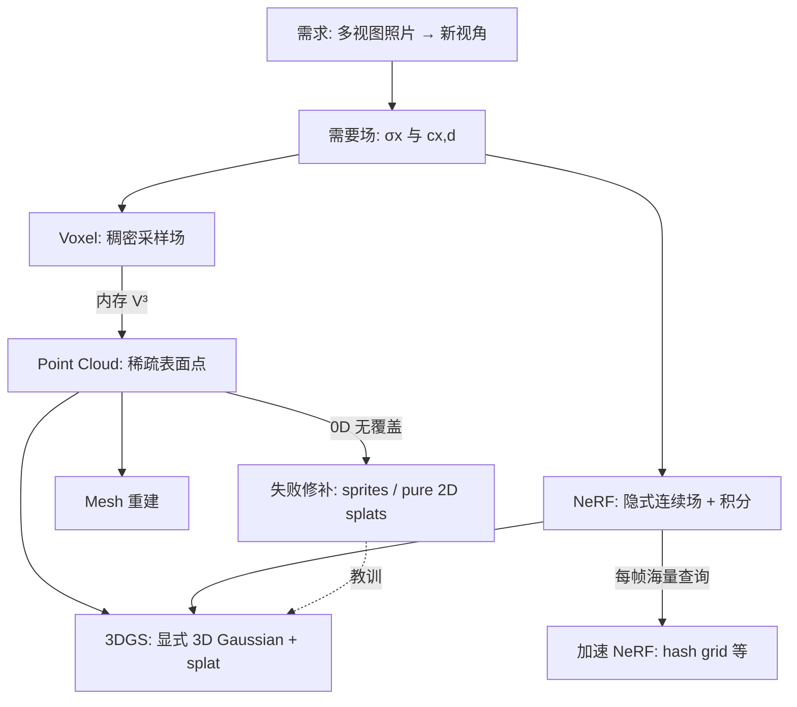

# 第 2 章：3D 表示的演化——为什么每一步都是必然的？

**本章问题**：Voxel、Point Cloud、NeRF、3DGS——这四种（其实是四代思想）是怎么一步步被「逼」出来的？如果历史重来一次，你会不会走出相似的分叉？

第 1 章已经给了故事大纲。本章做的是 **慢动作拆解**：把每个表示法放到同一把尺上量——它到底在存储什么、查询成本是什么、破坏了约束三角的哪一角、遗留了什么「不得不解决」的下一代问题。

读完你应能：

1. 用 **同一套第一性语言** 比较所有表示（不是背优缺点表）；  
2. 解释为什么「给点加 2D 斑」注定不稳，而「3D 定义再投影」才是正道；  
3. 区分 **工程慢** 与 **结构慢**；  
4. 看懂 3DGS 在演化树上的位置：它不是横空出世的魔法，是约束传递的下游解。

### 加餐怎么读：生活类比 + 失败对照

本章是第 1 章故事的「慢动作拆解」。每个表示与分叉后同样补了加餐：

1. **先读约束与 Core idea**（基石）  
2. **再读生活类比**（画面必须能说回基石）  
3. **最后读失败对照**（结构性失败长什么样）

> 隐喻可以用，但必须映射回定义与约束；不能只听故事。

总导航：

| 概念 | 一个够用的生活画面 | 基石一句话 | 做错时常见症状 |
|------|-------------------|------------|----------------|
| quality/speed/memory 三角 | 三角凳：抬一角另一角落地 | 三维互相拉扯的约束 | 只优化一角，另两角崩 |
| voxel \(V^3\) | 分辨率翻倍，泡泡纸 ×8 | \(N=V^3\) 立方定律 | OOM、细节卡死 |
| sparse/hash grid | 稀疏货架 / 哈希抽屉 | 少为空空间付钱，查询变复杂 | 当银弹，仍慢或不稳 |
| 0-D coverage | 图钉投影成针孔 | 点无面积 → 覆盖失败 | 星空感、闪烁 |
| 2D splat 失败 | 只在照片上贴纸 | 几何不在 3D → 多视图裂 | 换视角穿帮 |
| structural bottleneck | 问题单太长，不是笔慢 | 隐式 + 海量查询 | 优化 kernel 仍实时不了 |
| 表示换积木 | 换零件族，不是抛光旧件 | 显式 Gaussian + splat | 把 3DGS 当 NeRF 补丁 |

---

## 一、定界：我们到底要表示什么？

### 1.1 回到 View Synthesis 的可计算核心

手里有 \(M\) 张照片和 camera parameters，要渲染新视角。不管 UI 多炫，计算核心都是：

> 对相机发出的每条 ray（或每个像素的等效查询），场景的 density \(\sigma(\mathbf{x})\) 与 color \(c(\mathbf{x},\mathbf{d})\) 如何贡献出最终像素？

Volume rendering 形式（与第 1 章同一骨架）：

$$
C=\int_{t_n}^{t_f} T(t)\,\sigma(r(t))\,c(r(t),\mathbf{d})\,dt,
\quad
T(t)=\exp\left(-\int_{t_n}^{t}\sigma(r(s))\,ds\right)
$$

所以表示问题可以压缩成一句更狠的话：

> **怎么存这个场？怎么查这个场？怎么（最好可微地）让它解释所有训练图像？**

### 1.2 约束三角：质量 / 速度 / 内存

```text
              质量 quality
           （连续、抗锯齿、细节、
            multi-view 一致、外观）
                /        \
               /          \
              /            \
             /              \
            /                \
      速度 speed ←——————→ 内存 memory
   （训练/推理延迟）     （显存/磁盘/带宽）
```

补充第四维（现代方法几乎必问）：

- **Differentiability（可微性）**：能否用 gradient 拟合照片  
- **Editability / composability（可编辑可组合）**：是否像资产一样可操作  
- **Scalability（可扩展性）**：房间 → 街道 → 城市时规律如何变

本章比较表示时，会反复问三个问题：

1. **它破坏了三角的哪一角？**  
2. **这个破坏是实现问题还是结构性问题？**  
3. **下一代继承了什么、翻转了什么？**

#### 生活类比（必须映射回基石）

把 **quality / speed / memory** 想成一张三角凳：你把质量那条腿垫高，速度或内存那条腿往往会矮下去。

| 生活画面 | 对应基石 |
|----------|----------|
| 饭店不可能同时「米其林、出餐 30 秒、原料零库存」 | 三目标冲突是常态 |
| 只加厨子（堆算力）有时仍救不了菜单结构 | 区分工程慢 vs 结构慢 |
| 第四问：菜能不能按反馈微调（可微） | differentiability 常成隐藏约束 |
| 换菜单结构（换表示）才可能三角同时挪位 | 演化 = 约束传递，不是换皮 |

> 映射回基石：评价任何表示，先问它破坏了三角的哪一角、是实现问题还是结构性问题、下一代继承/翻转了什么。

#### 失败对照：做对 vs 做错

| 场景 | 做对 | 做错时你看到什么 |
|------|------|------------------|
| 选型 | 先写死 FPS/显存/质量底线 | 「全都要」口号 → 永远挑花眼 |
| 诊断 | 标出最痛的一角 | 在错误角上狂调参（如结构慢却只降 batch） |
| 对比论文 | 同场景同分辨率比 | 拿离线神图 vs 实时糊图互骂 |
| 叙事 | 用三角解释演化 | 背「voxel 差、3DGS 好」无因果 |


### 1.3 一张总图：演化不是换皮，是约束传递



注意：3DGS 同时吸收了两条血统——

- **点云血统**：稀疏、显式、可初始化  
- **NeRF 血统**：可微渲染、用照片当监督、追求真实感  

---

## 二、拆基石：表示方法的「坐标系」

在进入四代细节前，先定义比较用的基石词汇。它们比「好/坏」更有用。

| English | 含义 | 典型问题 |
|---------|------|----------|
| **explicit representation** | 参数直接对应空间中的结构（点、网格、Gaussian） | 分辨率/拓扑/数量怎么自适应？ |
| **implicit representation** | 结构藏在函数/网络权重里 | 查询是否昂贵？可否编辑？ |
| **discrete vs continuous** | 格子/点 vs 可任意查询的函数 | 锯齿、插值、泛化 |
| **view-dependent appearance** | 颜色是否随视线方向变 | 高光、反光材质 |
| **query cost** | 问一次「这里是什么」的代价 | O(1) 查表 vs MLP 前向 |
| **rendering model** | 如何从表示变成像素 | rasterize / ray march / splat |

第一性判断句式（建议背下来当肌肉记忆）：

```text
若表示是隐式函数：
  渲染若依赖大量空间查询 → 容易结构慢

若表示是稠密网格：
  覆盖体积 → 容易内存立方/平方爆

若表示是 0 维点：
  投影覆盖 → 容易空洞与闪烁

若表示是局部连续 primitive 且可解析投影：
  才有机会同时要稀疏、连续、快速
```

---

## 三、Voxel：第一直觉如何撞上数学墙

### 3.1 最朴素的想法为什么几乎「正确」？

你看见 2D 图像是 pixel。那么 3D 呢？

> 把世界切成小方块，每块存 \(\sigma\) 与 \(c\)。

这就是 **voxel grid**。

渲染：ray marching 沿射线步进，三线性插值读场，再 volume integrate。

当时觉得可行的理由很扎实：

- 实现 = 多维数组  
- 查询快  
- 与体积雾、医学成像同一心智模型  

### 3.2 内存墙：\(V^3\) 不是骂人，是定理

边长分辨率 \(V\)：

$$
N_{\text{voxel}} = V^{3}
$$

| \(V\) | 体素数 | 观感 |
|------|--------|------|
| 128 | ~2e6 | 轻松 |
| 256 | ~1.7e7 | 开始沉 |
| 512 | ~1.3e8 | 消费级吃力 |
| 1024 | ~1e9 | 很容易爆 |

**\(V\times2 \Rightarrow\) 内存 \(\times8\)。**

三个致命推论：

1. **分辨率硬上限**：显存有限 ⇒ 细节尺寸有下限（边缘糊、细结构丢）。  
2. **空空间税**：桌子底下、墙内部、天空盒子……很多格子存空气。  
3. **大场景绝望**：房间勉强，街区/城市直接不现实（除非换成稀疏/流式/层级，那就不再是「朴素体素」了）。

#### 生活类比（必须映射回基石）

把 **\(V^3\)** 想成「把房间切成方糖：边长切细一倍，方糖数量不是翻倍，是 ×8」。

| 生活画面 | 对应基石 |
|----------|----------|
| 边长 2 倍的魔方，小方块数 8 倍 | \(N_{voxel}=V^3\) |
| 空走廊也要占满糖块库存 | 空空间税 |
| 想看清头发丝 → 糖块极细 → 仓库爆 | 分辨率硬上限 |

> 映射回基石：均匀体积采样 ⇒ 立方增长是定理；稀疏/哈希是对策，但已改变数据结构复杂度。

#### 失败对照：做对 vs 做错

| 场景 | 做对 | 做错时你看到什么 |
|------|------|------------------|
| 提细节 | 算 \(8\times\) 账单 | 从 256 盲跳 1024 → OOM |
| 大场景 | 换稀疏/分块/别的表示 | 坚持满网格城市 → 不可能 |
| 糊边 | 承认格子尺度下限 | 只加网络层数却不改网格 |


### 3.3 自然演进方向

> 「既然大部分是空的，为什么要为空气分配满数组？」

这与稀疏矩阵思想同构：不要为了存几个非零开 \(N\times N\) 全表。

**下一代起点**：只存表面（或占有区域）附近。→ Point Cloud。

### 3.4 概念卡：Sparse Voxel / Hash Grid（作为体素的「进化支线」）

#### English name
**sparse voxel octree**, **hash grid**（Instant-NGP 等使用）

#### 中文通俗说法
稀疏体素/哈希网格：仍用「空间格子」思维，但只在有内容的位置花钱，或用哈希碰撞近似多分辨率特征。

#### Origin
被 \(V^3\) 逼出来的工程反击：octree、VDB、hash encoding…

#### Core idea
用不规则或哈希索引换「满数组」；查询仍偏「查特征 + 小网络」或插值。

#### Why not the final answer for real-time path
- 加速 NeRF 很有效，但管线往往仍含 ray sampling  
- 内存/质量/速度折中与 3DGS 不同  
- 仍不如「解析 splat 一批显式椭球」那么像传统实时图形

#### In 3DGS
对照用：说明「体素家族也能进化」，但 3DGS 走的是另一支——**particle/splat 家族**。

#### Common confusions
不要把 Instant-NGP 与 3DGS 当成同一表示；它们常被一起比速度，但表示哲学不同。

#### 生活类比（必须映射回基石）

把 **sparse voxel / hash grid** 想成「仓库不再为每个空货位建货架，只给有货的位置建索引；或用哈希抽屉近似多分辨率特征」。

| 生活画面 | 对应基石 |
|----------|----------|
| 稀疏货架：空气不占托盘 | 少付空空间内存 |
| 哈希抽屉：地址折叠，偶发撞车 | hash encoding 的近似与碰撞 |
| 找货要先查索引再取 | 查询比满数组更绕 |
| 仍可能要「沿走廊一格格问」 | 常仍含 ray sampling 管线 |

> 映射回基石：这是体素家族的进化支线——缓解 \(V^3\)，但不等于实时 splat 哲学；与 3DGS 表示不同。

#### 失败对照：做对 vs 做错

| 场景 | 做对 | 做错时你看到什么 |
|------|------|------------------|
| 定位 | 「加速 NeRF 族」很强 | 当成 3DGS 同类表示 |
| 期望 | 近实时/交互有时可达 | 默认 100+ FPS 甜区 |
| 调试 | 查哈希分辨率与碰撞 | 伪影当「学习率问题」一概而论 |


---

## 四、Point Cloud：稀疏性的胜利，零维度的困境

### 4.1 关键洞察

体素错的不是「场」这个想法，而是 **稠密采样空空间**。

真实观看经验：

- 你看见的是表面  
- 桌子内部、墙内部通常不需要以全分辨率存储  

**SfM point cloud** 正好输出表面附近的点：

$$
\{(\mathbf{x}_i, c_i)\}_{i=1}^{N},\quad N\sim 10^{5}\sim10^{7}
$$

内存对比（数量级）：

- 稠密 \(512^3\)：GB 级很常见  
- 百万点：往往几十 MB 内（取决于属性）

这是 **数量级胜利**。

### 4.2 渲染时的结构性失败：0-D coverage

把点投到屏幕：

```text
●   ●  ●     ← 投影后仍是点状命中
 ●  ●    ●
●    ●  ●    ← 大片像素没人负责
```

问题名称可以叫：

- **sampling problem**
- **coverage holes**
- **splatting 需求的起源**

本质：点知道「位置假设」，不知道「局部支撑区域（support）」——没有 extent。


#### 生活类比（必须映射回基石）

把 **0-D coverage** 想成「用针尖去盖章填色：针再多，纸上仍是麻点，不是色块」。

| 生活画面 | 对应基石 |
|----------|----------|
| 点 = 零体积、零面积 | zero-volume / zero-area primitive |
| 高清屏幕放大麻点更明显 | 分辨率↑，离散感↑ |
| 晃动头部，麻点图案在跳 | 视角变 → 命中图案变 → 闪烁 |
| 需要的是「小色块/软章」不是无限针 | 要局部 continuous support |

> 映射回基石：覆盖失败来自 **维度不匹配**（0D 图元 vs 2D 像素面积），不是单纯「点不够多」。

#### 失败对照：做对 vs 做错

| 场景 | 做对 | 做错时你看到什么 |
|------|------|------------------|
| 根治 | 换有面积/体积的 primitive | 只加点数 → 仍星空 |
| 诊断 | 先看 coverage 再看颜色网络 | 狂调 appearance 救不了洞 |
| 实时预览 | 点云当骨架可视化 | 把点云渲染当最终产品交付 |


### 4.3 修复尝试 A：Point Sprites

每点画一个面向相机的小四边形/圆，固定或近似半径。

```text
近处、远处可能「差不多大」→ 透视错误
边界硬 → 点阵感/贴纸感
法线/厚度缺失 → 侧看穿帮
```

### 4.4 修复尝试 B：Screen-space 2D Gaussian

在屏幕上画

$$
G(\mathbf{u})=\exp\big(-\|\mathbf{u}-\boldsymbol{\mu}_{2d}\|^2/(2\sigma^2)\big)
$$

进步：连续、可抗锯齿。  
致命：\(\sigma\) 从哪来？若只在 2D 调，**缺少 3D 形状约束**，换视角不知椭圆应如何变。

```text
视角 A 调得很美的 2D 椭圆
    │
    ▼ 换到视角 B
缺少 3D Σ 时：没有「唯一正确」的新椭圆
→ multi-view 不一致、闪烁、漂移
```

**关键教训（请用红笔圈住）**：

> **必须在 3D 定义体积/支撑，再投影到 2D；不能只在屏幕上长斑。**


#### 生活类比（必须映射回基石）

把 **pure 2D splat 失败** 想成「只在已经拍好的照片上贴椭圆贴纸：单张好看，一换机位贴纸不会跟着 3D 物体走」。

| 生活画面 | 对应基石 |
|----------|----------|
| 贴纸活在图像平面 | 参数在 screen space，缺 3D 形状约束 |
| 绕到侧面，贴纸对不齐桌沿 | multi-view inconsistency |
| 正确做法：在世界系捏橡皮泥再投影 | 3D 定义 \(\mu,\Sigma\) 再投影到 2D |

> 映射回基石：失败不是「高斯椭圆不好」，而是 **几何定义域错了**——必须在 3D 约束，再投到 2D。

#### 失败对照：做对 vs 做错

| 场景 | 做对 | 做错时你看到什么 |
|------|------|------------------|
| 表示 | 世界系 3D Gaussian | 每视角独立 2D 斑 → 穿帮 |
| 监督 | 多视图共用一套 3D 参数 | 单视图过拟合贴图 |
| 叙事 | 区分 2D splat 试验 vs 3DGS | 以为 3DGS = 「高级滤镜斑」 |


### 4.5 修复尝试 C：Mesh 重建

Poisson surface reconstruction 等：点 → 表面 mesh → 传统光栅化。

| 优点 | 缺点 |
|------|------|
| 真实几何、工具链成熟 | 重建重 |
| 可进游戏引擎 | 难与端到端可微优化合体 |
|  | 拓扑固定时编辑/自适应麻烦 |
|  | 细复杂外观（毛发、半透明）仍痛 |

Mesh 是伟大分支，但不是「NeRF/3DGS 那种照片可微拟合」主线的同一物种。

### 4.6 点云留给下一代的问题清单

1. 保持 **sparse O(N)**  
2. 提供 **3D local extent**（局部延展）  
3. 投影后 **连续 coverage**  
4. 最好 **differentiable**  
5. 最好 **各向异性**（薄表面不是球）

下一站有人用 MLP 绕开离散 primitive；另有人最终用 3D Gaussian 正面硬刚这份清单。

---

## 五、NeRF：另辟蹊径，却撞上结构性瓶颈

### 5.1 关键跳跃：别存格子了，存函数

2020 NeRF 的激进之处：

> 场景 = 一个可查询的连续函数 \(F_\theta(\mathbf{x},\mathbf{d})\)。

$$
F_\theta:(\mathbf{x},\mathbf{d})\rightarrow(\sigma,c)
$$

渲染仍用 volume rendering，但 \(\sigma,c\) 来自网络而不是数组。

### 5.2 为什么质量可以很高？

公理：MLP + 合适编码 ≈ 很强的连续场逼近器。

于是：

- 连续查询 → 少「格子感」  
- 输入 \(\mathbf{d}\) → view-dependent appearance  
- 分辨率更像「算力与采样」问题，而不是「数组开多大」  

在很多 benchmark 上，NeRF 族把 photo-real 新视角推到新高度，也把「可微体积渲染 + 多视图」做成范式。

### 5.3 慢：把账算到结构上

以高清帧粗算：

```text
像素 ~ 2e6
每射线采样 ~ 1e2
→ 场查询 ~ 2e8 / 帧
× 每次 MLP FLOPs 与随机内存访问
→ 原版设定下「秒级/帧」不稀奇
```

### 概念卡：Structural Bottleneck（结构性瓶颈）

#### English name
**structural bottleneck**（相对 incidental / implementation bottleneck）

#### 中文通俗说法
结构性瓶颈：慢/贵来自问题形式与表示选择的必然推论，而不是某一行代码没向量化。

#### Origin
系统性能分析一直区分：算法复杂度阶 vs 常数因子优化。

#### Core idea
NeRF 原设定下：

| 公理 | 内容 |
|------|------|
| A1 | 场景在权重里（implicit） |
| A2 | 像素颜色来自沿射线积分 |
| A3 | 积分点几乎都要查询网络 |

⇒ 每帧查询次数与「像素×采样」绑定，且访问模式不友好。

#### Why not alternatives wording
说「NeRF 写得烂所以慢」会误导；更准确是：「这种表示+渲染组合的默认订单就很贵」。加速工作改变编码/采样/烘焙，其实是在 **改结构或改订单**。

#### In 3DGS
3DGS 的实时性叙事，核心是 **换订单**：投影一批显式 primitive + 局部 blending，而不是每像素深度 MLP 积分。

#### Common confusions
Instant-NGP 证明「NeRF 族也能很快」；但这不自动取消「隐式场积分」与「显式 splat」的路线差异。


#### 生活类比（必须映射回基石）

把 **structural bottleneck** 想成「不是服务员端菜慢，而是你点了 2 亿道必须现做的菜：菜单结构决定了厨房必崩」。

| 生活画面 | 对应基石 |
|----------|----------|
| 问题单：每像素 × 百次采样 × 网络前向 | 查询订单复杂度 |
| 给厨师换更好刀（kernel 优化）有帮助 | 工程加速可提速 |
| 但订单结构不变，仍难实时 | 结构慢 ≠ 实现慢 |
| 换生意模式：预制可投影积木 | 3DGS 换表示/换渲染结构 |

> 映射回基石：结构性瓶颈来自表示与渲染算法的 **复杂度订单**；不换订单，只抛光实现，实时仍吃力。

#### 失败对照：做对 vs 做错

| 场景 | 做对 | 做错时你看到什么 |
|------|------|------------------|
| 诊断慢 | 先写 O(像素×采样×查询) | 只骂 GPU 型号 |
| 选型 | 实时需求考虑换表示 | 死磕原版 NeRF 上 VR |
| 评价加速 | 看是否改了订单结构 | 把 2× 加速当解决结构问题 |


### 5.4 训练贵：同一结构的另一张账单

训练要成千上万次迭代，每次迭代对 ray batch 做前向积分 + 反向。  
迭代成本高 → 调参反馈慢 → 研究与产品都痛苦。

### 5.5 两条出路

```text
出路 1：保留场积分思想，改造编码与采样
        → hash grid / baking / distillation / better sampling
        → 显著加速，但仍常在「交互～近实时」光谱上挪动

出路 2：换表示与渲染模型
        → 显式 primitives + splatting / rasterization style
        → 3DGS
```

3DGS 属于出路 2。它不是「把 MLP 算子写成 CUDA 就结束」，而是 **重新选择世界的积木**。

---

## 六、3DGS：识别瓶颈后换积木

### 6.1 核心命题（比口号更精确的版本）

> 在保持「多视图照片可微优化」的前提下，用 **各向异性 3D Gaussian 集合** 作为 explicit scene representation；渲染采用 **投影 + 按深度排序的 alpha blending（splatting）**，从而大幅降低 per-frame 的随机场查询。

### 6.2 为什么这正好接住点云的遗留问题？

| 点云遗留需求 | Gaussian 如何接 |
|--------------|-----------------|
| sparse | N 个 primitive，N 可自适应 |
| 3D extent | Σ 给出椭球支撑 |
| 连续 coverage | 平滑核，像素被软覆盖 |
| 可微 | 矩阵、exp、混合可反传 |
| 各向异性 | 非对角 Σ / scale+rotation |

### 6.3 为什么这又能回应 NeRF 的结构性慢？

| NeRF 成本来源 | 3DGS 的替代 |
|---------------|------------|
| 隐式查询 | 显式读参数 |
| 长射线采样 | 投影 footprint |
| 不规则访问 | 批量/分 tile 更图形管线化 |
| 黑盒权重 | 可初始化、可剪枝、可观察的粒子云 |

### 6.4 速度对比表（建立数量级，不背死数字）

| 方法 | 训练量级 | 推理量级 | 表示 |
|------|----------|----------|------|
| NeRF（原始设定） | 很长 | 很慢 | implicit MLP |
| Instant-NGP 类 | 短很多 | 快很多 | hybrid encoding |
| **3DGS** | 常较短 | **实时常见** | explicit Gaussians |

请把表理解为光谱，而不是法律。硬件、分辨率、实现差一个数量级都正常。**比较结构，不要只比较某一篇 blog 的 FPS 截图。**

### 6.5 3DGS 仍留下的问题（演化没有终点）

诚实列出，避免神话化：

1. **Densification / pruning 策略**复杂，含离散决策  
2. **大场景、超大规模**需要层级、流式、LOD  
3. **强 view-dependent / 反射**仍是热点  
4. **几何度量**（精确表面、法线）并非天然最优  
5. **动态 / 可生成 / feedforward** 引出后续章节（4D、网络直接预测 Gaussian 等）

---


#### 生活类比（必须映射回基石）

把 **3DGS「换积木」** 想成：不是给旧发动机打磨汽缸，而是换成另一套动力总成——零件（Gaussian）、装配线（splat）、质检（照片 loss 反传）整套重配。

| 生活画面 | 对应基石 |
|----------|----------|
| 继承点云：零件是稀疏可数的 | explicit、可初始化 |
| 继承 NeRF：用照片当质检标准 | 可微渲染 + multi-view 监督 |
| 不继承：每像素狂问黑盒 | 去掉海量 MLP 场查询 |
| 新装配线：投影→排序→混合 | splatting pipeline |

> 映射回基石：演化终点不是「某个分数最高」，而是在三角约束下换到更匹配实时新视角的表示族。

#### 失败对照：做对 vs 做错

| 场景 | 做对 | 做错时你看到什么 |
|------|------|------------------|
| 历史理解 | 约束传递链能复述 | 背四个名词无因果 |
| 工程 | 接受 densify/prune 等新账单 | 以为换积木后零代价 |
| 对比 Instant-NGP | 分清表示哲学 | 「都快所以一样」 |


## 七、用同一张表做「第一性对照」

### 7.1 总对照

| 维度 | Voxel | Point Cloud | NeRF | 3DGS |
|------|-------|-------------|------|------|
| 存什么 | 满网格场 | 表面点 | 网络权重 | Gaussian 参数集 |
| 稀疏性 | 差 | 优 | 权重紧但查询重 | 优 |
| 连续性 | 插值后半连续 | 差（0D） | 优 | 核连续 |
| 查询 | O(1) 索引 | 邻域？投影命中难 | 贵 | 投影+局部混合 |
| 实时 | 低分辨率还行 | 点绘可不真实 | 原版差 | 强 |
| 可微优化照片 | 可以 | 弱/需额外模型 | 强 | 强 |
| 主要死因 | memory | coverage | query cost | 工程与扩展性细节 |

### 7.2 约束传递链（得/失/遗留）

```text
┌─────────────────────────────┐
│ Voxel                       │
│ 得：直观，查表快             │
│ 失：内存 V³                  │
│ 遗留：如何不为空气付钱？      │
└──────────┬──────────────────┘
           ↓ 只存表面
┌─────────────────────────────┐
│ Point Cloud                 │
│ 得：O(N) 稀疏                │
│ 失：0D 覆盖失败              │
│ 遗留：3D extent + 连续投影？ │
└──────────┬──────────────────┘
           ↓ 连续隐式场（另一路线）
┌─────────────────────────────┐
│ NeRF                        │
│ 得：质量与可微范式           │
│ 失：结构慢                   │
│ 遗留：能否显式化还保真？      │
└──────────┬──────────────────┘
           ↓ 显式 Gaussian + splat
┌─────────────────────────────┐
│ 3DGS                        │
│ 得：实时 + 高质量 + 可训练   │
│ 失：自适应密度等复杂         │
│ 遗留：大场景/动态/生成式…    │
└─────────────────────────────┘
```

### 7.3 若你重来一遍：决策树

```text
Q1: 能否接受 GB 级满网格？
  是 → 体素也可玩（小场景/低分辨率）
  否 → Q2

Q2: 0D 点投影能否接受针孔感？
  是 → 点云预览足够
  否 → Q3

Q3: 是否必须离线最高灵活外观、可接受慢？
  是 → NeRF 族很香
  否 → Q4

Q4: 是否要实时交互新视角？
  是 → 3DGS（或后续实时显式方法）优先
```

这不是唯一真理，但是一条健康的工程决策链。

---

## 八、两个深挖专题（把「必然性」钉死）

### 8.1 专题：为什么「屏幕空间修修补补」救不了点云？

假设你在视角 \(C_1\) 给每个点学了一个漂亮的 2D \(\sigma\)。  
来到视角 \(C_2\)：

1. 遮挡关系变了  
2. 足迹的透视压缩变了  
3. 局部表面的「厚度方向」投影变了  

若没有 3D 各向异性延展，你等于要求一组 2D 补丁在所有视角自己变魔术。  
多视图一致性会变成欠约束的「每个视角各调各的」。

反之，3D \(\Sigma_w\) → camera → \(J\Sigma J^{\top}\) 给出 **由 3D 参数决定的 2D 足迹**，优化发生在 3D 参数上，所有视角共享同一组物理（软物理）实体。

这就是第 3 章要反复敲的钉子的预埋件。

### 8.2 专题：为什么说 3DGS「继承 NeRF 范式，但不继承 NeRF 表示」？

**继承的范式**：

- 图像重建 loss  
- 可微渲染  
- 从多视图自动学场景  

**不继承的表示**：

- 不把世界塞进 MLP 权重黑盒（主表示层）  
- 不把每像素成本绑死在「长射线多层感知机查询」  

类比：

```text
NeRF：世界是一个可查询的精灵球（问哪儿算哪儿）
3DGS：世界是一堆可投影的乐高软积木（先摆好再看）
```

两者都能「被照片训练」，但运行时哲学完全不同。

---

## 九、最小实验：感受「点」vs「有支撑的核」

下面实验不训练 3DGS，只帮你用眼睛记住 coverage 问题。

```python
import numpy as np
import matplotlib.pyplot as plt

rng = np.random.default_rng(0)

# 模拟：在一个倾斜「表面」附近撒点
n = 200
u = rng.uniform(-1, 1, n)
v = rng.uniform(-1, 1, n)
# 简单投影到 2D（假装已经投到屏幕）
pts = np.stack([u, 0.3 * u + v * 0.2], axis=1)

H = W = 128
img_points = np.zeros((H, W))
img_splats = np.zeros((H, W))

def to_pix(x, y):
    # [-1.2,1.2] -> pixel
    px = ((x + 1.2) / 2.4 * (W - 1)).astype(int)
    py = ((y + 1.2) / 2.4 * (H - 1)).astype(int)
    return px, py

px, py = to_pix(pts[:, 0], pts[:, 1])
valid = (px >= 0) & (px < W) & (py >= 0) & (py < H)
img_points[py[valid], px[valid]] = 1.0

# 给每个点一个各向同性 Gaussian splat（示意 2D support）
yy, xx = np.mgrid[0:H, 0:W]
for x, y in pts:
    cx = (x + 1.2) / 2.4 * (W - 1)
    cy = (y + 1.2) / 2.4 * (H - 1)
    img_splats += np.exp(-((xx - cx) ** 2 + (yy - cy) ** 2) / (2 * 2.5 ** 2))

img_splats /= img_splats.max() + 1e-8

fig, ax = plt.subplots(1, 2, figsize=(8, 4))
ax[0].imshow(img_points, cmap="gray", origin="lower")
ax[0].set_title("points only (holes)")
ax[1].imshow(img_splats, cmap="magma", origin="lower")
ax[1].set_title("with local support (splats)")
for a in ax:
    a.set_xticks([]); a.set_yticks([])
plt.tight_layout()
plt.show()
```

你应看到：左图针孔，右图成「面」。  
再提醒：右图若只有 2D 支持仍不够——真 3DGS 要把 support 的来源放在 3D Σ 上。

---

## 十、费曼摘要

> 新视角问题逼我们存储一个能被渲染的 3D 场。体素用满网格硬存，内存按立方涨，还给空气付房租。点云改交表面税，内存爽了，可是点没有面积，屏幕上全是洞。人们试过在屏幕上贴圆片、贴 2D 高斯，可没有 3D 形状约束，换个相机位姿就装不像。
>
> NeRF 说：别纠结离散积木了，让神经网络当连续场，照片一监督，画质起飞；但默认渲染订单是「每条射线采样无数次问网络」，结构上就贵。3DGS 站在两条遗产上：像点云一样稀疏显式，像 NeRF 一样可微拟合照片；积木换成 3D Gaussian，渲染改成投影混合。于是实时与高质量第一次变得经常可以一起谈。
>
> 演化的主线不是谁更时髦，而是：**上一代无法同时满足的约束，如何在下一代被重新打包。**

---

## 十一、自测题（带详解）

### Q1. 若从体素改进，你的第一反应可能是什么？它又会引入什么新代价？

<details>
<summary>详解</summary>

常见反应：octree / sparse grid / hash。内存降到更接近表面复杂度，但索引变复杂，查询从裸 O(1) 变 O(log N) 或依赖哈希冲突处理；实现与缓存行为都更绕。这是「用系统性复杂性换立方内存」。3DGS 则换了一种不按满体素思考的 primitive 集合。
</details>

### Q2. 点云的 pure 2D splatting 为什么在 multi-view 下注定不稳？

<details>
<summary>详解</summary>

2D footprint 若不上锚到 3D 各向异性几何，换视角时没有唯一正确的投影变换律，优化容易过拟合训练视角，新视角闪烁/漂/假。正确方向：3D 定义 Σ，再投影。
</details>

### Q3. 「NeRF 无法优化」是真的吗？

<details>
<summary>详解</summary>

假。NeRF 族有大量加速与质量改进。更准确的说法是：在「隐式场 + 重采样积分」默认结构下，**实时高清**曾非常难；加速工作往往通过改编码、降采样、烘焙等改变成本结构。3DGS 的贡献是另一条高性价比实时路线，不是宣布场表示研究结束。
</details>

### Q4. 3DGS 为实时付出的典型代价有哪些？

<details>
<summary>详解</summary>

例如：依赖 densify/prune 等启发式；强反射与精确几何度量不总占优；大场景管理复杂；离散拓扑变化让优化不如纯连续场「干净」。换来的是显式、可实时、易初始化的粒子资产式表示。
</details>

### Q5. 用约束三角各评价四代方法的「最痛的一角」。

<details>
<summary>详解</summary>

- Voxel：内存  
- Point：质量/覆盖（速度可以很快但假）  
- NeRF：速度（原版）  
- 3DGS：相对更均衡；痛点常在扩展性/策略复杂度/某些外观与几何任务  
</details>

### Q6. 为什么说 3DGS 同时继承了 Point 与 NeRF？

<details>
<summary>详解</summary>

从 Point：稀疏显式、SfM 初始化、粒子式世界。  
从 NeRF：图像 loss 驱动、可微渲染学习范式、追求 photo-real 新视角。  
合成结果：可训练的显式实时表示。
</details>

### Q7. Instant-NGP 与 3DGS 都「快」，能否说表示演化在 Instant-NGP 已经结束？

<details>
<summary>详解</summary>

不能。快只是指标之一。表示是否显式、是否易编辑、渲染模型是否 splat、训练动态如何、下游 4D/生成如何接，都会分叉。演化结束论通常是视角过窄。
</details>

### Q8. 若任务是「导出可编辑资产到引擎里挪家具」，你更倾向谁？

<details>
<summary>详解</summary>

更倾向显式（mesh 或 3DGS 类粒子/后续结构化表示）。纯隐式 MLP 权重不适合直接当积木挪。具体仍取决于引擎支持与质量需求。
</details>

---

## 十二、一页速览

### 一句话主线

```text
稠密体素爆内存
  → 稀疏点云有洞
    → 隐式 NeRF 太贵
      → 显式 3D Gaussian 可投影可训练可实时
```

### 决策关键词

| 若你最怕… | 小心… |
|-----------|--------|
| 显存 | 稠密 voxel |
| 针孔/闪烁 | 裸 point |
| 秒级/帧 | 原版 ray+MLP |
| 黑盒难编辑 | 纯 implicit |

### 必记英文

`explicit/implicit`, `coverage`, `ray marching`, `splatting`, `structural bottleneck`, `densification`, `view-dependent appearance`, `multi-view consistency`

### 与前后章咬合

- 第 0 章：Σ、J、Gaussian closure——解释「为什么积木能投影」  
- 第 1 章：问题动机与演出级对比  
- **第 2 章：表示演化的必然性（本章）**  
- 第 3 章：为什么积木最终是 Gaussian 这一种  

---

### 学习检查站

1. 能不看稿画出约束传递链吗？  
2. 能解释 2D splat 与 3D Gaussian splat 的本质差别吗？  
3. 能区分 structural slow 与 implementation slow 吗？  
4. 能说清 3DGS 继承了谁、拒绝了谁吗？  

若可以，进第 3 章：把「Gaussian 为什么是最终 primitive」钉死。

---

*本章定位：表示演化的逻辑必然 | 记忆负担：中（重在比较框架） | 下一章：`chapter_03_gaussian_splatting.md`*
