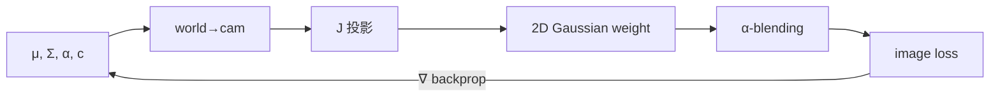

# 第 3 章：核心发明——为什么最后选了 Gaussian？

**本章核心问题**：如果你必须发明一种新的 3D **primitive**（图元/基元），让它同时满足：稀疏、连续、可各向异性、能快速投影到图像、还支持反向传播——为什么最后会落到 **Gaussian**，而不是点、方块、球，或「普通硬椭球」？

这一章要建立的不是「高斯公式长什么样」的背诵，而是：

> 为什么 3DGS 的核心发明，最后长成 \(\mu + \Sigma + \alpha + \text{color}\) 这套语言，而不是别的打包方式。

与前后章关系：

- 第 0 章：工具（Σ、J、Mahalanobis、closure）  
- 第 1–2 章：为什么需要新表示  
- **第 3 章：primitive 级答案**  
- 第 4 章：它如何变成可微图像（投影、排序、混合、反传）

### 加餐怎么读：生活类比 + 失败对照

本章回答「为什么 primitive 最后是 Gaussian」。阅读加餐时：

1. **先读五条约束与候选对比**（基石筛选）  
2. **再读生活类比**（画面必须映射回定义）  
3. **最后读失败对照**（选错 primitive 会长什么样）

> 隐喻可以用，但必须映射回定义与约束；不能只听故事。

总导航：

| 概念 | 一个够用的生活画面 | 基石一句话 | 做错时常见症状 |
|------|-------------------|------------|----------------|
| five constraints | 招聘五硬条件同时满足 | 稀疏/连续/各向异性/快投影/可微 | 只满足两三项，链路断 |
| point / cube / sphere / ellipsoid / Gaussian | 针、硬砖、糖丸、硬蛋、软印章 | 逐步放宽几何与核性质 | 圆乎乎贴不住、硬边闪 |
| Σ / Mahalanobis | 按地形尺子量远近 | \((x-\mu)^\top\Sigma^{-1}(x-\mu)\) | 椭圆变圆或轴反了 |
| scale + rotation | 三轴拉面团再旋转 | \(\Sigma = R S S R^\top\) | 裸优化 Σ 变非 SPD |
| opacity α | 印章墨水色深 | 权重/不透明度 ∈ (0,1) 逻辑 | 全黑全白、透不过去 |
| soft stamp | 中心浓边缘淡 | \(\exp(-\frac12 d_M^2)\) 局部核 | 硬切边、锯齿 |
| anisotropy | 压扁的面团贴桌面 | 主轴可扁/长 | 强制各向同性糊边 |

---

## 一、定界问题：点云之后，我们到底缺什么？

### 1.1 点为什么天然有洞

点云诱人，因为真的省：

- 每点主要是位置（+颜色）  
- 点与点解耦  
- 稀疏场景内存友好  

但有一个残酷几何事实：

> **点是 zero-volume / zero-area 的。**

投到屏幕上，它更像离散针尖，而不是连续表面。

```text
你想看到的连续物体          只投点时常见

xxxxxxxxxxxxxxxxxxxx        x .  x   . x .
xxxxxxxxxxxxxxxxxxxx        .  x  . x  .  .
xxxxxxxxxxxxxxxxxxxx        x .   .   x  .
```

后果清单：

- 点之间有空洞  
- 视角一变，空洞图案跟着变（闪烁）  
- 分辨率升高，离散感更明显  
- 遮挡边界脆，容易「撒胡椒面」

所以 novel view synthesis 里，「再多加点」常常只是止痛，不是根治。你缺的不是无限点预算，而是另一种 primitive。

### 1.2 真正缺的是：局部连续影响（local continuous support）

更精确的需求：

> **一个围绕某 3D 位置展开、对附近区域连续起作用的局部体积元。**

对比：

```text
点只能说：     「这里有一个位置假设」
好 primitive： 「这里附近有一小团可连续影响成像的局部结构」
```

3DGS 不满足于点，而要找更像「局部云团 / 软印章」的东西。

---

## 二、拆基石：发明 primitive 的五条硬约束

站在发明者角度，不是先膜拜 Gaussian，而是做工程筛选。下列五条往往 **同时** 生效：

| 约束 | English | 为什么必须 |
|------|---------|------------|
| 稀疏 | sparse | 否则退回体素式填空间 |
| 连续 | continuous support | 否则硬边、空洞、闪烁 |
| 可各向异性 | anisotropic | 真实局部表面常扁/长，不是球 |
| 投影要快 | fast projection | 否则又掉进每像素重采样深渊 |
| 可微 | differentiable | 图像误差要能回到几何与外观参数 |

所以真问题不是：

```text
能不能随便找个 3D 形状代替点？
```

而是：

```text
在这五条约束下，什么局部 primitive 最自然、最闭环？
```

---


#### 生活类比（必须映射回基石）

把 **五条硬约束** 想成招人的五条硬性条件——不是「加分项」，是缺一就会在链路某处断掉。

| 生活画面 | 对应基石 |
|----------|----------|
| 行李额有限 → 不能扛整箱空气 | sparse：躲开 \(V^3\) |
| 上色要能涂抹，不能只点墨点 | continuous support |
| 桌面薄、栏杆细 → 不能只会捏圆球 | anisotropic |
| 实时预览 → 不能每像素问一百次黑盒 | fast projection |
| 靠照片纠错 → 误差要能流回参数 | differentiable |

```text
假问题：随便找个 3D 形状代替点？
真问题：五条同时成立时，谁最自然闭环？
```

> 映射回基石：Gaussian 的「胜出」是多约束合取下的工程筛选，不是美学偏好。

#### 失败对照：做对 vs 做错

| 场景 | 做对 | 做错时你看到什么 |
|------|------|------------------|
| 选型讨论 | 五条逐条过 | 「我觉得球好看」无约束 |
| 只连续不可微 | 意识到反传断 | 能画不能训 |
| 只稀疏不连续 | 回到点云洞 | 星空感 |
| 可微但投影极慢 | 结构仍实时不了 | 又变相 ray 重采样 |


## 三、候选摆上台：为什么最后不是别的？

### 3.1 总对比表

| Primitive | 直觉优点 | 真正硬伤 |
|-----------|----------|----------|
| **point** | 最省 | 0 体积，coverage 失败 |
| **axis-aligned cube / billboard** | 好画 | 硬边、贴纸感、视角易假 |
| **sphere（各向同性球）** | 连续、参数少 | 太 isotropic，贴合薄表面笨 |
| **hard ellipsoid** | 可各向异性 | 当作硬几何时，软覆盖/可微/投影链不优雅 |
| **Gaussian ellipsoid cloud** | 连续、各向异性、局部衰减、变换友好、可微 | 你得接受它是软密度云不是 CAD 实心件 |

### 3.2 为什么固定小方块 / billboard 不够

想法：

```text
别投点了，给每个点贴一片固定小四边形
```

比点有面积，但：

- 边界硬  
- 贴片感强  
- 遮挡边缘易假  
- 旋转与透视下容易露馅  

它更像「往屏幕上贴纸」，不像「3D 里有一团局部结构」。

### 3.3 为什么 sphere 也不够

球连续、无棱角、各方向一样——最后反而成问题。

真实局部几何更常是：

- 沿表面切向更宽  
- 沿法向更薄  

叶子、桌沿、墙面片，都更像压扁的团块，不是糖丸。

> 球的致命伤不是不平滑，而是 **太各向同性（isotropic）**。

### 3.4 一般椭球已经很接近——但还差「分布/核」这一层

椭球允许：

- 三轴不同长度  
- 任意朝向  
- 表达薄片 / 细杆 / 团块  

几何表达力几乎到位。胜负手在下一问：

> **放进完整渲染链后，谁更好算、更好传、更好求导、更好做局部 footprint？**

这时 **Gaussian** 开始显著领先：它不只是「椭球壳」，而是带平滑衰减的密度核，且与线性代数、概率封闭性同构（第 0 章）。

---


#### 生活类比（必须映射回基石）

把候选 **point / cube / sphere / hard ellipsoid / Gaussian** 想成五件盖章工具的面试。

| 工具 | 生活画面 | 映射回基石 |
|------|----------|------------|
| point | 针尖 | 0 体积，coverage 失败 |
| cube / billboard | 硬纸片贴纸 | 有面积但硬边、视角易假 |
| sphere | 糖丸/圆章 | 连续但太 isotropic，贴薄表面笨 |
| hard ellipsoid | 实心蛋形积木 | 形状够，硬边界/可微与软覆盖不优雅 |
| Gaussian | 喷枪软章：中心浓、外淡、可压扁旋转 | 连续衰减 + 各向异性 + 变换封闭 + 可微 |

```text
面试淘汰顺序（直觉版）：
  针尖 → 没面积
  硬砖/贴纸 → 假、硬边
  糖丸 → 圆得不贴表面
  硬蛋 → 差一口气（核/软覆盖/闭包）
  软椭圆喷枪 → 留下
```

> 映射回基石：胜负手不只是「像不像椭球」，而是放进投影、混合、求导整条链后是否闭环。

#### 失败对照：做对 vs 做错

| 选型 | 做对用法 | 做错症状 |
|------|----------|----------|
| 坚持 point | 仅作初始化骨架 | 最终渲染星空 |
| 固定 billboard | 调试占位 | 多视图贴纸感、硬边闪 |
| 强制 sphere | 极简 demo | 叶片/墙面圆鼓鼓贴不住 |
| 硬椭球指示函数 | CAD 思维 | 边界不可微/锯齿，训练抖 |
| Gaussian | 软密度云心智 | 当成实心 CAD 件会误期望 |


## 四、重建：Gaussian 公式到底在说什么？

### 概念卡：3D Gaussian Primitive

#### English name
**3D Gaussian** / **anisotropic Gaussian primitive**

#### 中文通俗说法
三维高斯基元：用 mean \(\mu\) 与 covariance \(\Sigma\) 描述的一团软椭球云；在 3DGS 里再乘上 opacity 与 color（或 SH），成为可渲染、可优化的场景积木。

#### Origin（起源）
概率论中的 multivariate normal；图形学里作 soft particle / splat kernel；3DGS 把它提升为 **场景主表示**，并接到可微 splatting 管线。

#### Core idea（核心思想）

严格 pdf 形式：

$$
\rho(\mathbf{x})
=
\frac{1}{(2\pi)^{3/2}|\Sigma|^{1/2}}
\exp\left(
-\frac12(\mathbf{x}-\mu)^{\top}\Sigma^{-1}(\mathbf{x}-\mu)
\right)
$$

人话：

> 离 \(\mu\) 越近越大；离 \(\mu\) 越远，按椭球尺子（Mahalanobis）快速变淡。

渲染里常见未归一化核：

$$
g(\mathbf{x})
=
\exp\left(
-\frac12(\mathbf{x}-\mu)^{\top}\Sigma^{-1}(\mathbf{x}-\mu)
\right)
$$

归一化常数常被吸进 \(\alpha\) 或权重体系。工程上 **形状与相对衰减** 往往压过「是否严格概率密度」。

#### Why not alternatives
见第三节表。再强调一次：Gaussian 赢在 **闭包 + 可微 + 局部 + 各向异性** 的合取，不是单点「看起来糊得舒服」。

#### In 3DGS
场景 ≈ 成千上万（到百万）个 Gaussian 的叠加；训练改它们的 \(\mu,\Sigma,\alpha,c\)；推理投影混合。

#### Worked example / PyTorch
见本章第十节完整 footprint 实验。

#### Common confusions
1. Gaussian ≠ 实心石头椭球；等密度面才是椭球壳层。  
2. 3DGS Gaussian ≠ 必须从中采样的生成模型。  
3. 公式有无 \((2\pi)\) 系数，实现可能简化——先抓二次型。

---

#### 生活类比（必须映射回基石）

把 **3D Gaussian** 想成一团「可压扁、可旋转的面粉云/喷枪雾」：中心最浓，按椭球尺子往外变淡。

| 生活画面 | 对应基石 |
|----------|----------|
| 云团中心位置 | mean \(\mu\) |
| 云团被压成扁饼/拉成细杆 | covariance \(\Sigma\) 的各向异性 |
| 离中心「按地形」算远近 | Mahalanobis：\((x-\mu)^\top\Sigma^{-1}(x-\mu)\) |
| 雾有透明度旋钮 | opacity \(\alpha\)（与核相乘） |
| 很多小雾团叠成场景 | 显式 primitive 叠加 |

> 映射回基石：渲染核常是 \(g(x)=\exp(-\frac12 (x-\mu)^\top\Sigma^{-1}(x-\mu))\)；等密度面是椭球；它是软密度云不是实心石头。

#### 失败对照：做对 vs 做错

| 场景 | 做对 | 做错时你看到什么 |
|------|------|------------------|
| 心智 | 软云/软章 | 当 mesh 布尔运算 → 期望错误 |
| 形状 | 用 \(\Sigma\) 控轴 | 只动 \(\mu\) → 永远圆团填缝 |
| 数值 | 保持 \(\Sigma\) SPD | 非法协方差 → NaN/黑屏 |
| 归一化 | 形状优先，常数可进 \(\alpha\) | 死抠 pdf 系数与实现不一致却慌 |


### 4.1 \(\Sigma^{-1}\) 在干什么？Mahalanobis 再登场

关键二次型：

$$
(\mathbf{x}-\mu)^{\top}\Sigma^{-1}(\mathbf{x}-\mu)
$$

不是普通欧氏距离平方，而是 **椭球距离**（Mahalanobis）。

- 某方向 \(\Sigma\) 很宽：朝该方向偏一点，代价小  
- 某方向很窄：同样欧氏偏移，会被当成「很远」  

所以它描述的是：

> 在这个 Gaussian 自己的主轴与尺度定义下，一个点离中心有多远。


#### 生活类比（必须映射回基石）

把 **Mahalanobis distance** 想成「按这片地形自己的尺子量你离营地多远」：宽阔草原上走出 10 米不算远；悬崖窄道上 10 米已经掉下去。

| 生活画面 | 对应基石 |
|----------|----------|
| 普通卷尺（各向同性） | 欧氏 \(\|x-\mu\|^2\) |
| 按主轴缩放后的卷尺 | \((x-\mu)^\top\Sigma^{-1}(x-\mu)\) |
| 宽轴方向「便宜」 | \(\Sigma\) 大的特征方向衰减慢 |
| 窄轴方向「昂贵」 | 薄片法向稍偏就权重大降 |

> 映射回基石：\(\Sigma^{-1}\) 把欧氏偏移变成该 Gaussian 自己的椭球距离；形状身份证是 \(\Sigma\)，不是单独一个半径。

#### 失败对照：做对 vs 做错

| 场景 | 做对 | 做错时你看到什么 |
|------|------|------------------|
| 距离 | 用 Mahalanobis 进 \(\exp\) | 误用欧氏 → 椭圆变圆章 |
| 逆矩阵 | SPD 可逆、稳定求逆/分解 | \(\Sigma\) 奇异 → 炸 |
| 读轴 | 特征值大 = 该方向更「胖」 | 把特征值方向读反 → 压扁方向错 |


### 4.2 \(|\Sigma|\) 又在干什么？

\(|\Sigma|\) 与整体体积尺度相关。若主轴标准差为 \(s_1,s_2,s_3\)：

$$
|\Sigma|=s_1^2 s_2^2 s_3^2,\quad
|\Sigma|^{1/2}=s_1 s_2 s_3
$$

可以记：

- **二次型**：形状上的远近  
- **行列式**：整体摊开程度（在严格 pdf 里影响归一化高度）

### 4.3 等密度面：为什么说「Σ 就是在说椭球」

固定密度水平：

$$
(\mathbf{x}-\mu)^{\top}\Sigma^{-1}(\mathbf{x}-\mu)=k^{2}
$$

得到 **ellipsoid surface**。

更准确的一句话（请记住）：

> **Gaussian 不是实心硬椭球，而是一团密度云；这团云的等密度壳层是椭球。**

---

## 五、\(\Sigma\) 的几何参数化：scale + rotation

### 5.1 分解

只要 \(\Sigma\) 对称正定：

$$
\Sigma = R\;\mathrm{diag}(s_1^{2},s_2^{2},s_3^{2})\;R^{\top}
$$

- \(R\)：主轴朝向（rotation matrix）  
- \(s_i\)：各主轴 scale（标准差尺度）  

```text
局部轴对齐的椭球云
        │ R 旋转
        ▼
世界系中的斜向薄片 / 细杆 / 团块
```

### 5.2 为何与局部表面天然契合

局部表面统计上常：

- 两个切向方向较大  
- 法向很小  

例如：

$$
\Sigma = R\,\mathrm{diag}(0.03^{2},0.02^{2},0.002^{2})\,R^{\top}
$$

就像压薄的软片，很适合贴墙、贴地面、贴叶片。

### 5.3 为何实现很少裸优化 3×3 Σ

训练中更常见：

- `scaling`（经 exp 保证正）  
- `rotation`（quaternion，再归一化）  
- 重建 \(\Sigma\)

原因：

- 更容易保证 **positive definite**  
- 更容易约束尺度为正  
- 更符合旋转流形上的优化  

两层记忆：

```text
几何理解层：Σ 是椭球云形状
实现层：   存 scale + quaternion，再重建 Σ
```


#### 生活类比（必须映射回基石）

把 **scale + rotation** 想成「先把橡皮泥按三个轴拉长压扁，再整体旋转到贴齐桌面」。

| 生活画面 | 对应基石 |
|----------|----------|
| 三轴伸缩旋钮 | scale \(s=(s_1,s_2,s_3)\)，\(S=\mathrm{diag}(s)\) |
| 姿态/朝向 | rotation \(R\)（常存 quaternion） |
| 拼出合法形状身份证 | \(\Sigma = R S S R^\top = R \mathrm{diag}(s^2) R^\top\) |
| 不直接捏 3×3 对称矩阵九个数 | 参数化保证（更易）保持 SPD |

> 映射回基石：几何上 \(\Sigma\) 需要 SPD；工程上用 scale+rotation 分解，优化更稳、更贴「轴长+朝向」直觉。

#### 失败对照：做对 vs 做错

| 场景 | 做对 | 做错时你看到什么 |
|------|------|------------------|
| 参数化 | 优化 \(s,q\) 再组装 \(\Sigma\) | 裸写 \(\Sigma\) 元素 → 非对称/非 PD |
| 旋转 | 单位四元数 / 正交 \(R\) | 未归一化 → 带缩放的怪变形 |
| 尺度 | \(s>0\)（exp 参数化常见） | 负尺度/爆炸 → 巨椭球吞场景 |
| 薄表面 | 法向轴极小 scale | 三大 scale 差不多 → 圆鼓贴不住 |


### 概念卡：Opacity α 与 Appearance

#### English name
**opacity / alpha**，**view-dependent color**（常用 **spherical harmonics, SH**）

#### 中文通俗说法
不透明度 [opacity] 控制这团云有多「实」；颜色/球谐系数描述外观，并可随视角变化。

#### Origin
体积/粒子渲染长期用 alpha compositing；NeRF 强化了 view-dependent appearance 需求；3DGS 用 SH 在显式粒子上近似这一点。

#### Core idea
最小集合常写：

$$
G_i=\{\mu_i,\Sigma_i,\alpha_i,c_i\}
$$

更贴近实现：

$$
G_i=\{\mu_i,\,s_i,\,q_i,\,\rho_i,\,\mathrm{SH}_i\}
$$

- \(s_i,q_i\rightarrow\Sigma_i\)  
- \(\rho_i\) 经 sigmoid 等得到 \(\alpha_i\)  
- SH 在给定 view direction 下解码颜色  

#### Why not alternatives
没有 \(\alpha\)：无法做遮挡与半透明混合权重。  
只有 diffuse 三通道：镜面/高光弱。  
完整 BRDF 每点一份：太贵，且与实时 splat 目标冲突。

#### In 3DGS
\(\alpha\) 进 blending；SH 进颜色；二者与几何参数一起被 gradient 更新。

#### Common confusions
1. \(\alpha\) 不是 Σ。Σ 管形状，α 管强度/可见性。  
2. SH 阶数越高越能表达复杂视角变化，也越贵、越易过拟合。  

---


#### 生活类比（必须映射回基石）

把 **opacity \(\alpha\)** 想成「这枚软印章蘸墨有多浓」：核给出形状脚印，\(\alpha\) 给出深浅；颜色（或 SH）再决定墨是什么色。

| 生活画面 | 对应基石 |
|----------|----------|
| 墨水色深旋钮 | \(\alpha \in [0,1]\)（实现常 logit 无约束） |
| 淡章盖很多层也能叠实 | 小 \(\alpha\) + blending 累加覆盖 |
| 浓章一下挡住后面 | 大 \(\alpha\) 快速消耗透射率 |
| 外观另算 | color / SH 与几何 \(\mu,\Sigma\) 分离 |

> 映射回基石：像素上有效权重常是 \(\alpha \cdot g_{2d}(u)\)；\(\alpha\) 不是密度场的唯一故事，但是 splat 混合的关键旋钮。

#### 失败对照：做对 vs 做错

| 场景 | 做对 | 做错时你看到什么 |
|------|------|------------------|
| 初始化 | 合理小 \(\alpha\) 再学 | 全 1 → 不透明砖块乱挡 |
| 参数化 | sigmoid 等保持范围 | 直接加到 \(\alpha>1\) 或负 |
| 与 prune | 低 \(\alpha\) 可剪 | 从不剪 → 透明垃圾点堆积 |
| 与颜色 | 分清「看不见」是 \(\alpha\) 还是色 | 只调色救不了透/挡关系 |


## 六、迁移：Gaussian 为何特别适合整条工程链？

到这里，形状好看只是入场券。真正让它赢的是 **工程闭环**。

### 6.1 优势一：Linear / Affine 变换下极听话（closure）

若

$$
X\sim\mathcal{N}(\mu,\Sigma),\quad Y=AX+b
$$

则

$$
Y\sim\mathcal{N}(A\mu+b,\;A\Sigma A^{\top})
$$

含义：

> 旋转、平移、拉伸后，它不会变成一种陌生对象；仍是 Gaussian，只是参数更新。

接到 3DGS：

$$
\begin{aligned}
\mu_{\mathrm{cam}} &= R\mu_{\mathrm{world}}+t \\
\Sigma_{\mathrm{cam}} &= R\Sigma_{\mathrm{world}}R^{\top}
\end{aligned}
$$

### 6.2 优势二：全局透视非线性，局部用 Jacobian 拉回线性

透视：

$$
u=f_x\frac{X}{Z}+c_x,\quad
v=f_y\frac{Y}{Z}+c_y
$$

全局非线性；但 Gaussian 局部，中心附近：

$$
d\mathbf{p}\approx J\,d\mathbf{x}
\quad\Rightarrow\quad
\Sigma_{2D}\approx J\,\Sigma_{\mathrm{cam}}\,J^{\top}
$$

工程哲学：

> 不是假装世界全局线性，而是把「小范围传播」压回线性代数。

Gaussian 与此天生契合（第 0 章 Jacobian + closure）。

### 6.3 优势三：局部衰减 → 天然适合 screen-space footprint 与 culling

指数衰减 ⇒

- 影响区域局部  
- 远离中心贡献迅速变小  
- 易做 bounding box / tile culling  

实时渲染最怕：

```text
每个 primitive 污染整张图  →  O(N · H · W) 灾难
```

Gaussian 连续却局部，复杂度可降到与 footprint 面积相关。

### 6.4 优势四：主链大部分可微

从 \(\mu,\Sigma\) 到 camera 系，到 \(\Sigma_{2D}\)，到 2D Gaussian 权重，到 alpha blending——沿途大量是：

- matrix multiply  
- add  
- exp  
- quadratic form  

于是系统是 **可训练渲染器**，不是一次性几何技巧。



### 6.5 四重优势总表

| 优势 | 一句话 | 若缺失会怎样 |
|------|--------|--------------|
| closure | 变换后还是 Gaussian | 每次变换要重拟合形状族 |
| Jacobian 局部线性 | 透视下仍得 2D Σ | 只能中心点或贵采样 |
| local decay | 可裁剪 | 实时算不过来 |
| differentiable | 能学习 | 只能手调粒子 |

---


#### 生活类比（必须映射回基石）

**soft stamp（软印章）**：盖下去中心最清楚，边缘淡出，没有刀切硬边——对应 \(g=\exp(-\frac12 d_M^2)\) 的局部连续衰减。

**anisotropy（各向异性）**：印章可压成瘦长条/薄片，而不必是圆印——对应 \(\Sigma\) 三轴不等。

| 生活画面 | 对应基石 |
|----------|----------|
| 喷枪 vs 硬印章 | 连续可微核 vs 指示函数硬边 |
| 只污染附近纸面 | 局部 support → 可 culling |
| 把圆印压扁贴树叶 | 各向异性贴合局部表面 |
| 旋转门后章形仍合法 | 线性变换下 Gaussian 封闭 |

> 映射回基石：软 + 各向异性，同时服务「填洞抗锯齿」与「贴薄结构」；再叠加闭包与可微，才撑起第 4 章整条链。

#### 失败对照：做对 vs 做错

| 场景 | 做对 | 做错时你看到什么 |
|------|------|------------------|
| 核 | 软衰减 | 硬切边 → 闪烁锯齿 |
| 各向异性 | 允许扁/长 | 强制 \(\Sigma=\sigma^2 I\) → 圆乎乎、费更多球硬凑 |
| 局部性 | tile cull 吃局部性 | 核过宽 → 慢且互相污染 |
| 闭包 | 投影用 \(J\Sigma J^\top\) | 换别的核后数学整条重做 |


## 七、在 3DGS 里，一个 Gaussian 到底存什么？

### 7.1 最小完备集

$$
G_i=\{\mu_i,\Sigma_i,\alpha_i,c_i\}
$$

| 符号 | 作用 | 缺了会怎样 |
|------|------|------------|
| \(\mu\) | where：中心 | 不知在哪，无法投影 |
| \(\Sigma\) | what shape：各向异性形状 | 退回点/球，难贴表面 |
| \(\alpha\) | how strong：不透明强度 | 无法合理混合/遮挡 |
| \(c\) | what appearance：颜色/SH | 无外观 |

这是 **最小完备集**：再少则渲染目标残缺；再多可以（法线、语义、时间参数…），但是扩展而非必需核心。

### 7.2 实现向字段

| 字段 | 典型含义 |
|------|----------|
| `xyz` / `means` | \(\mu\) |
| `scales` | \(s_1,s_2,s_3\)（常 log 空间优化） |
| `rotations` | quaternion \(q\) |
| `opacities` | 逆激活前的 \(\rho\) |
| `features_dc` / `features_rest` | SH 系数 |

### 7.3 和别的表示再比一次「参数哲学」

| 表示 | 参数形态 | 问题 |
|------|----------|------|
| voxel | 每格 RGB+σ | \(V^3\) |
| point | \(\mathbf{x},c\) | 0D 空洞 |
| NeRF | MLP weights | 查询贵 |
| **3DGS** | 每粒 \(\mu,\Sigma,\alpha,c\) | 自适应数量与策略复杂，但实时闭环强 |

---

## 八、三个工程画面：它为何像局部场景结构？

### 8.1 树叶边缘

- 沿叶片展开  
- 法向很薄  
- 边缘应渐变不是砖块裁切  

各向异性扁 Gaussian 很合适。

### 8.2 桌腿 / 栏杆

- 一方向细长  
- 另两方向窄  

球会在所有方向浪费半径；各向异性 Gaussian 可直接做「软细杆」。

### 8.3 墙面 / 地面片

- 两切向大、法向小  
- 天然扁平椭球云  

结论：

> 3DGS primitive 不是硬凹造型去适配世界，而是与局部表面片的几何统计很同构。

---

## 九、一个有用的比喻：软印章，不是石头

若总把 Gaussian 想成「实心椭球零件」，会越想越别扭。

更好的比喻：

> **一枚软印章，或一小团有颜色的雾。**

性质：

- 中心压得最重  
- 向外渐淡  
- 可圆可扁可斜可长  
- 多枚叠印，混出复杂结构  

3DGS 恢复的不是一堆 CAD 零件，而是：

```text
许多局部连续 density footprint 的叠加
```

这正是后面 alpha blending 能工作的直觉底座。

---

## 十、Worked example：各向同性 vs 各向异性 footprint

目标：把「\(\Sigma\) 决定 footprint 形状」变成肉眼直觉。

```python
import numpy as np
import matplotlib.pyplot as plt


def gaussian_2d(grid_x, grid_y, mu, Sigma):
    pos = np.stack([grid_x - mu[0], grid_y - mu[1]], axis=-1)
    inv = np.linalg.inv(Sigma)
    q = np.einsum("...i,ij,...j->...", pos, inv, pos)
    return np.exp(-0.5 * q)


x = np.linspace(-3, 3, 300)
y = np.linspace(-3, 3, 300)
X, Y = np.meshgrid(x, y)

mu = np.array([0.0, 0.0])
Sigma_iso = np.array([
    [0.8 ** 2, 0.0],
    [0.0, 0.8 ** 2],
])

theta = np.deg2rad(35)
R = np.array([
    [np.cos(theta), -np.sin(theta)],
    [np.sin(theta),  np.cos(theta)],
])
S = np.diag([1.6 ** 2, 0.35 ** 2])
Sigma_aniso = R @ S @ R.T

G_iso = gaussian_2d(X, Y, mu, Sigma_iso)
G_aniso = gaussian_2d(X, Y, mu, Sigma_aniso)

fig, axes = plt.subplots(1, 2, figsize=(10, 4.5))
for ax, G, title in [
    (axes[0], G_iso, "isotropic Gaussian"),
    (axes[1], G_aniso, "anisotropic Gaussian"),
]:
    ax.contourf(X, Y, G, levels=25, cmap="viridis")
    ax.contour(X, Y, G, levels=[0.1, 0.3, 0.6], colors="white", linewidths=1)
    ax.set_aspect("equal")
    ax.set_title(title)
    ax.set_xlabel("x")
    ax.set_ylabel("y")

plt.tight_layout()
plt.show()
```

你应该看到：

- 左：等值线圆 → 各向同性  
- 右：旋转椭圆 → \(\Sigma\) 同时编码方向与轴长比  
- **这就是 2D footprint 的核心视觉**

改 `theta` 与轴长，观察胖瘦旋转如何变——这比背公式牢得多。

### 10.1 最小 PyTorch：Σ 的重建与 SPD 检查

```python
import torch
import torch.nn.functional as F

def build_sigma(scale, quat):
    """
    scale: (3,) positive scales
    quat:  (4,) quaternion (w, x, y, z) 未归一化也可
    """
    q = F.normalize(quat, dim=0)
    w, x, y, z = q.unbind()
    # rotation matrix from quaternion
    R = torch.stack([
        torch.stack([1 - 2*(y*y + z*z), 2*(x*y - z*w),     2*(x*z + y*w)]),
        torch.stack([2*(x*y + z*w),     1 - 2*(x*x + z*z), 2*(y*z - x*w)]),
        torch.stack([2*(x*z - y*w),     2*(y*z + x*w),     1 - 2*(x*x + y*y)]),
    ])
    S = torch.diag(scale ** 2)
    Sigma = R @ S @ R.T
    return Sigma, R

scale = torch.tensor([0.05, 0.04, 0.005])
quat = torch.tensor([1.0, 0.2, 0.1, 0.0])
Sigma, R = build_sigma(scale, quat)
print("Sigma=\n", Sigma)
print("eigvals=", torch.linalg.eigvalsh(0.5 * (Sigma + Sigma.T)))
```

---

## 十一、从 3D 到 2D：先建立「下一步会遇到的公式地图」

第 4 章会细讲可微渲染；这里先放地图，避免 primitive 章与渲染章脱节。

```text
1) world → camera
   μ_c = R μ_w + t
   Σ_c = R Σ_w R.T

2) project center
   μ_2d = π(μ_c; K)

3) local linearization
   J = ∂π/∂x |_{μ_c}
   Σ_2d ≈ J Σ_c J.T

4) pixel weight
   w(u) = exp(-0.5 (u-μ_2d).T Σ_2d^{-1} (u-μ_2d))

5) alpha blending front-to-back
   C = Σ_i T_i α_i' c_i
   其中 α_i' 含 α_i 与 w，T_i 为透射累积
```

你现在应能指出：第 1–3 步吃的是 **closure + Jacobian**；第 4 步吃的是 **Mahalanobis Gaussian kernel**；第 5 步吃的是 **α**。整章元素全部上岗。

---

## 十二、把整章压成最短心智模型

```text
点太稀 → 投影有洞

    ↓

需要围绕 3D 位置的局部连续影响

    ↓

primitive 必须：稀疏、连续、各向异性、投影快、可微

    ↓

Gaussian 最合适：
  像椭球云，又把形状/变换/局部投影/像素贡献压进线性代数

    ↓

于是 G_i = {μ_i, Σ_i, α_i, color_i}
```

---

## 十三、费曼摘要

> 点云省，但点没有面积，新视角全是洞。我们真正要的是：在 3D 里有一小团连续的局部影响，还能在多视图下保持一致，还能被图像误差训练。
>
> 方块太硬，球太圆，纯屏幕补丁缺 3D 约束。椭球形状对了，可若只是硬几何，未必好混、好裁、好求导。Gaussian 是「带平滑衰减的椭球云」：用 μ 说中心，用 Σ 说胖瘦朝向，用 α 说软硬，用颜色/SH 说外观。
>
> 它最狠的不是萌，而是听话——线性变换后还是 Gaussian，透视下还能用 Jacobian 局部传播 Σ，指数衰减方便裁剪，整条链可微。所以 3DGS 的发明，本质上是挑对了积木，让稀疏、真实感、实时和可学习第一次常常能坐在同一张桌子上。

---

## 十四、自测题（带详解；已去掉原文重复题堆）

### Q1. 为什么点云直接投影会有空洞？

<details>
<summary>详解</summary>

点是 0 维，无面积支撑。射线/像素很难「命中」；提高分辨率后洞更显眼。根因是维度与覆盖需求不匹配，不是单纯点不够多。
</details>

### Q2. 为什么球不够好，椭球（进而 Gaussian）才接近正确答案？

<details>
<summary>详解</summary>

球 isotropic，难表达薄片/细杆等局部表面统计。椭球允许三轴各向异性。Gaussian 在椭球几何上再加软衰减、闭包与可微核，更适渲染学习。
</details>

### Q3. 为什么 \(\Sigma^{-1}\) 对应的不是普通欧氏距离？

<details>
<summary>详解</summary>

二次型是 Mahalanobis：按该 Gaussian 自己的 Σ 重新定义远近。宽轴方向「便宜」，窄轴方向「昂贵」。这正是各向异性 footprint 的来源。
</details>

### Q4. 「线性变换下仍是 Gaussian」有多重要？

<details>
<summary>详解</summary>

保证 world→camera 等步骤后对象族不散架，参数更新有闭式：\(\mu'=A\mu+b,\ \Sigma'=A\Sigma A^{\top}\)。否则变换与反传都要另起炉灶。
</details>

### Q5. 局部衰减为何对实时关键？

<details>
<summary>详解</summary>

贡献随距离指数变小 ⇒ 可 bounding / tile cull，避免每个 primitive 全图写。复杂度从天真的 \(O(NHW)\) 降到与有效 footprint 相关。
</details>

### Q6. 为什么最终是 \(\{\mu,\Sigma,\alpha,c\}\) 四件套？

<details>
<summary>详解</summary>

位置、形状、强度、外观——渲染一个软粒子所需的最小完备信息。缺一则「在哪/多大/多实/什么颜色」链条断裂。实现可用 scale+quat 重建 Σ，用 SH 扩展 c。
</details>

### Q7. 为什么说 Gaussian 是密度云不是硬表面？这对心理模型有何影响？

<details>
<summary>详解</summary>

等密度面是椭球壳，值是连续衰减。心理上应想「软印章叠加」，而不是「一堆不透明土豆」。混合、半透明、边缘渐变才说得通。
</details>

### Q8. 硬椭球指示函数 vs Gaussian 核，工程差在哪？

<details>
<summary>详解</summary>

硬指示：边界不平滑、导数难、投影裁剪像几何布尔；Gaussian：值与梯度平滑、与协方差代数统一、天然软覆盖。对可微学习更友好。
</details>

### Q9. 若去掉各向异性（强制 Σ = σ²I），3DGS 会失去什么？

<details>
<summary>详解</summary>

失去用扁长粒子贴合表面的能力，被迫堆更多各向同性球去「砌」薄结构，效率与质量双损，边缘更易糊或更费点数。
</details>

### Q10. 下一章要回答的核心问题是什么？

<details>
<summary>详解</summary>

primitive 已选 Gaussian 后：**如何从 3D 的 μ,Σ 变成 2D footprint、像素颜色，并把 gradient 传回去？**（可微 splatting 全链）
</details>

---

## 十五、一页速览

### 约束 → 选择

```text
sparse + continuous + anisotropic + fast project + differentiable
                    ↓
            anisotropic 3D Gaussian
```

### 参数墙

```text
μ ∈ R³                 中心
Σ = R diag(s²) R.T     形状（SPD）
α ∈ (0,1)              不透明度
c / SH                 外观
```

### 公式墙

```text
Y = A X + b  ⇒  仍 Gaussian，Σ' = A Σ A.T
Σ_2D ≈ J Σ_cam J.T
g = exp(-0.5 (x-μ).T Σ^{-1} (x-μ))
```

### 比喻

**软印章叠加**，不是砖块堆砌。

### 英文词清单

`primitive`, `anisotropic`, `isotropic`, `covariance`, `opacity`, `spherical harmonics`, `splatting`, `footprint`, `tile culling`, `positive definite`, `closure`, `Mahalanobis distance`

### 前后链接

| 章 | 问题 |
|----|------|
| 0 | 数学工具从哪来 |
| 1–2 | 为何需要新表示 |
| **3** | **为何是 Gaussian 这套参数** |
| 4 | 如何变成可微图像 |

---

### 学习检查站

遮住正文自讲：

1. 点为何天然有洞？  
2. 五条约束是什么？  
3. 球与硬方块各死在哪？  
4. Σ 与 scale+rotation 关系？  
5. 四重工程优势？  
6. 为何是 μ,Σ,α,c 最小完备？  
7. 软印章比喻如何帮助理解 blending？  
8. 投影链上 closure 与 J 各出现在哪一步？  

全过关 → 第 3 章完成，可进 `chapter_04_differentiable_rendering.md`。

---

*本章定位：primitive 选择的第一性证明 | 建议配合跑 footprint 代码 | 下一章：可微渲染全链*
