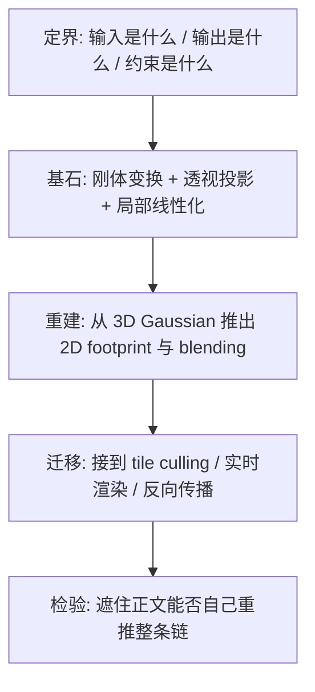
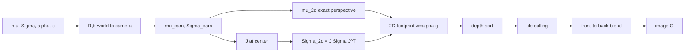

# 第 4 章：从 3D 高斯到图像——可微渲染链到底怎样成立

**本章核心问题**：第 3 章已经解释了为什么 primitive 最后选成 Gaussian。现在真正的问题变成：

> 这些 3D 高斯到底怎样一步步变成屏幕上的像素？而且，为什么这个过程**大部分**还能反向传播 [backpropagation]，让图像误差流回 `mu`、`Sigma`、`alpha` 和颜色参数？

如果上一章解决的是「为什么是高斯」，这一章解决的就是：

```text
高斯怎样真的变成一张图
并把梯度 [gradient] 传回去
```

### 加餐怎么读：生活类比 + 失败对照

本章走完「3D Gaussian → 像素」整条链。加餐读法：

1. **先读该步公式/算法在干什么**（基石）  
2. **再读生活类比**（画面必须映射回公式）  
3. **最后读失败对照**（哪一步写错会出什么图）

> 隐喻可以用，但必须映射回定义与约束；不能只听故事。

总导航：

| 概念 | 一个够用的生活画面 | 基石一句话 | 做错时常见症状 |
|------|-------------------|------------|----------------|
| differentiable rendering | 可回放的流水线质检 | 图像对参数可（大致）求导 | `grad is None`、训不动 |
| W2C | 把世界搬进相机坐标系 | \(\mu_c=R\mu+t,\;\Sigma_c=R\Sigma R^\top\) | 场景躺倒、镜像 |
| perspective | 近大远小的针孔成像 | 中心投影除以深度 | 远近尺度错 |
| Jacobian | 盘山路局部当直线 | 透视局部线性化 | footprint 透视畸变错 |
| \(\Sigma_{2d}=J\Sigma J^\top\) | 3D 云团投影成 2D 椭圆 | 协方差传播 | 圆斑、尺度不随深度 |
| 2D footprint | 屏幕上的软椭圆脚印 | \(\alpha\exp(-\frac12 d_M^2)\) | 硬方块/无覆盖 |
| depth sort | 先近后远排队 | 顺序决定遮挡 | 前景变幽灵 |
| alpha blending | 半透明叠玻璃 | \(C+=T\alpha c,\;T*=(1-\alpha)\) | 过曝相加、无遮挡 |
| tile culling | 只给相关街区送传单 | 局部性降复杂度 | 全图扫高斯 → 极慢 |
| 可微边界 | 连续段可导，离散段凑合 | 排序/分配非严格光滑 | 期望处处可微会失望 |

---

## 0. 第一性原理路线图：定界 → 基石 → 重建 → 迁移 → 检验

在展开公式之前，先把本章的推理节奏钉死。后面每一大节都可以对照这五步来读。



| 步骤 | 本章在问什么 | 你读完应能说清 |
|------|--------------|----------------|
| **定界** | 输入是一堆带参数的 Gaussian，输出是 RGB 图像；约束是**快**且**大部分可微** | 为什么不是任意体渲染积分 |
| **基石** | 世界→相机刚体变换；中心透视投影；Jacobian 局部线性化 | 为什么 $\Sigma_{2d} = J\Sigma J^\top$ 会出现 |
| **重建** | 2D footprint → 深度排序 → alpha blending | 一个像素的颜色如何被递推写出来 |
| **迁移** | tile-based culling；与 NeRF 计算结构对比；可微边界 | 为什么能实时、为什么「可微」不绝对 |
| **检验** | 费曼摘要 + 自测 + 一页速览 | 能否不看公式表自己讲回整条链 |

---

## 一、先别掉进实现细节：整条渲染链长什么样

### 1.1 先把主线写在前面

每个 3D Gaussian 最终变成像素，大致会经历下面这条链：

$$
\begin{aligned}
&\text{3D Gaussian} \\
&\to \text{世界到相机变换 [world-to-camera transform]} \\
&\to \text{局部投影成 2D 椭圆 footprint} \\
&\to \text{按深度组织 [depth sorting]} \\
&\to \text{只在局部 tile 内参与计算 [tile-based culling]} \\
&\to \text{从前到后的 alpha 混合 [front-to-back alpha blending]} \\
&\to \text{图像}
\end{aligned}
$$

图像误差再沿这条链**大部分**反向流回去。

用更「工程口语」的方式说同一件事：

```text
1. 把每个 3D 高斯从世界坐标系搬到相机坐标系
2. 把它在屏幕上变成一个 2D 椭圆脚印 (footprint)
3. 决定谁在前、谁在后
4. 不要让每个像素去看全部高斯，只看覆盖自己的那一小批
5. 按前后顺序做半透明叠层，得到最终颜色
```

### 1.2 这条链要同时满足两个目标

你要一直同时盯住两件事：

| 目标 | 如果不满足会怎样 |
|------|------------------|
| **必须快** | 会回到每像素重采样 [per-pixel resampling] 的慢渲染 |
| **必须大部分可微 [differentiable]** | 图像误差没法稳定流回 Gaussian 参数，训练失败 |

3DGS 的漂亮之处，不在于某一步特别花哨，而在于：

> 它把**表示 → 投影 → 筛选 → 混合**这四步都压成了足够规则、足够适合 GPU 的结构。

### 1.3 概念卡：Differentiable Rendering（可微渲染）

| 字段 | 内容 |
|------|------|
| **English name** | Differentiable Rendering |
| **中文** | 可微渲染 [Differentiable Rendering] |
| **Origin** | 图形学与视觉学习交叉领域：希望「渲染」这一步也能放进自动微分 [automatic differentiation] 图，使图像误差能回传几何/外观参数 |
| **Core idea** | 把「3D 参数 → 图像」这条映射写成（尽量）可对参数求导的计算图 |
| **Why not alternatives** | 传统光栅化 [rasterization] 管线大量离散决策（遮挡、深度测试、采样索引），梯度断掉；纯体渲染可微但往往太慢 |
| **In 3DGS** | 连续主链（变换、投影、Gaussian 核、blending）可微；排序、tile 分配等离散部分工程上「足够可用」 |
| **PyTorch example** | 见本章后文「最小可微 blending」；核心是 `loss.backward()` 能触及 `mu`、`scale` 等 |
| **Common confusions** | 「可微渲染」≠「每一步处处光滑」；排序与 early-stop 并不严格可微 |

---


#### 生活类比（必须映射回基石）

把 **differentiable rendering** 想成「流水线不但能出片，还能告诉你：片糊了是因为哪颗螺丝拧歪了」——误差沿计算图回传。

| 生活画面 | 对应基石 |
|----------|----------|
| 传统电影工业：很多刀切决策难追责 | 离散 raster 决策易断梯度 |
| 可微流水线：主步骤是连续算子 | 变换、投影核、blending 可导 |
| 质检分数 = loss | \(\mathcal{L}(I_{render}, I_{gt})\) |
| 拧螺丝方向 = gradient | \(\partial\mathcal{L}/\partial\mu,\Sigma,\alpha,\ldots\) |

> 映射回基石：目标是把「3D 参数 → 图像」尽量建成可对参数求导的计算图；「可微」≠「每一步处处光滑」。

#### 失败对照：做对 vs 做错

| 场景 | 做对 | 做错时你看到什么 |
|------|------|------------------|
| 实现 | 主链用可导张量算子 | 中途 `.detach()` / numpy → `grad is None` |
| 期望 | 接受排序等离散近似 | 一排序就认为整个方法「不可训」而放弃 |
| 调试 | 先查 grad 是否到达 \(\mu\) | 只看 forward 图好看却训不动 |


## 二、输入和输出到底是什么

### 2.1 输入不是「一个场景」，而是一堆带参数的 Gaussian

如果用最简化形式，一个高斯可以写成：

$$
G_i = \{\boldsymbol{\mu}_i,\, \boldsymbol{\Sigma}_i,\, \alpha_i,\, \mathbf{c}_i\}
$$

其中：

| 符号 | 英文 | 含义 |
|------|------|------|
| $\boldsymbol{\mu}_i$ | mean / center | 3D 中心位置 |
| $\boldsymbol{\Sigma}_i$ | covariance | 3D 协方差，对应一个 3D 椭球结构 |
| $\alpha_i$ | opacity | 不透明度 / 密度强度 |
| $\mathbf{c}_i$ | color | 颜色（或更一般的外观参数） |

如果写得更贴近真实实现，也常常会是：

$$
G_i = \{\boldsymbol{\mu}_i,\, \mathbf{s}_i,\, \mathbf{q}_i,\, \rho_i,\, \text{sh}_i\}
$$

| 内部参数 | 含义 |
|----------|------|
| $\mathbf{s}_i$ | scale（三个轴上的尺度） |
| $\mathbf{q}_i$ | rotation quaternion（旋转四元数） |
| $\rho_i$ | opacity 的内部 logit 等 |
| $\text{sh}_i$ | spherical harmonics 球谐外观系数 |

但无论参数化怎么换，本章真正关心的还是那条**物理主线**：

> 中心在哪？形状怎样？颜色怎样？遮挡和透射怎样发生？

### 2.2 输出是一张图像

对于给定相机 $\text{cam}_k$，渲染器最终输出的是：

$$
C(p) \in \mathbb{R}^3
$$

也就是每个像素 $p = (u, v)$ 的 RGB 颜色。

问题在于：

> 怎么从许多个 3D Gaussian，得到每个像素的最终颜色？

### 2.3 ASCII 总览：从参数到像素

```text
  世界空间里的一堆 3D Gaussian
           |
           |  R, t  (world-to-camera)
           v
  相机空间里的 3D Gaussian
           |
           |  中心: 透视投影 (精确)
           |  形状: J 局部线性化后传播协方差
           v
  屏幕上的 2D ellipse footprint
           |
           |  depth sort + tile culling
           v
  每个像素只处理相关的一小批 Gaussian
           |
           |  front-to-back alpha blending
           v
       最终 RGB 图像 C(p)
```

---

## 三、第一步：把 3D Gaussian 送到相机坐标系

这一部分是整条渲染链的数学起点。没有它，后面的投影、Jacobian、blending 全都悬空。

### 3.1 概念卡：World-to-Camera Transform（世界到相机变换）

| 字段 | 内容 |
|------|------|
| **English name** | World-to-Camera Transform / Extrinsic Transform |
| **中文** | 世界到相机变换 [World-to-Camera Transform] |
| **Origin** | 经典多视图几何 [multi-view geometry]：用外参 [extrinsics] $(R,\mathbf{t})$ 描述相机在世界中的位姿 |
| **Core idea** | 同一物理点，换一套以相机为原点的坐标系描述 |
| **Why not alternatives** | 不变换到相机系，透视投影公式无法写成统一的 $X/Z,Y/Z$ 形式 |
| **In 3DGS** | 中心与协方差都要变：$\boldsymbol{\mu}_{\text{cam}}=R\boldsymbol{\mu}+ \mathbf{t}$，$\boldsymbol{\Sigma}_{\text{cam}}=R\boldsymbol{\Sigma}R^\top$ |
| **PyTorch example** | `mu_cam = mu @ R.T + t`（注意行/列向量约定） |
| **Common confusions** | world-to-camera 与 camera-to-world 互为逆；`R` 作用在点还是作用在坐标轴，约定必须一致 |

### 3.2 世界到相机：中心怎么变

如果一个高斯中心在世界坐标里是 $\boldsymbol{\mu}_{\text{world}}$，相机外参是 $(R, \mathbf{t})$，那么相机坐标下的中心就是：

$$
\boldsymbol{\mu}_{\text{cam}} = R \cdot \boldsymbol{\mu}_{\text{world}} + \mathbf{t}
$$

这里 $R$ 是 $3\times 3$ 旋转矩阵 [rotation matrix]，$\mathbf{t}$ 是平移向量 [translation]。

这件事不神秘，就是普通的**刚体变换 [rigid transform]**：先旋转再平移（或按约定写成齐次矩阵 $T=[R|\mathbf{t}]$）。

**例子**：假设世界系里有一个高斯中心在 $(1,0,5)$，相机刚好把世界 $Z$ 轴转成「朝前看」的相机 $Z$，并沿光轴后退。变换后你会得到新的 $(X,Y,Z)_{\text{cam}}$。**深度 [depth]** 信息就藏在相机系的 $Z$ 分量里——后面排序要用它。

### 3.3 世界到相机：形状（协方差）怎么变

第 3 章已经说过，高斯最重要的几何结构是 $\boldsymbol{\Sigma}$。它在相机坐标下会变成：

$$
\boldsymbol{\Sigma}_{\text{cam}} = R \, \boldsymbol{\Sigma}_{\text{world}} \, R^\top
$$

这条式子特别值得记住，因为它意味着：

> 高斯经过坐标变换后，**还是高斯**；只是中心和协方差按线性代数规则更新。

为什么是 $R\Sigma R^\top$ 而不是 $R\Sigma$？因为协方差描述的是「偏差向量」的二阶统计。若偏差 $\mathrm{d}\mathbf{x}$ 变成 $R\,\mathrm{d}\mathbf{x}$，则：

$$
\mathbb{E}[(R\,\mathrm{d}\mathbf{x})(R\,\mathrm{d}\mathbf{x})^\top]
= R\,\mathbb{E}[\mathrm{d}\mathbf{x}\,\mathrm{d}\mathbf{x}^\top]\,R^\top
= R\Sigma R^\top
$$

这就是 Gaussian 比很多别的局部表示更「听话」的地方：线性变换下封闭。

### 3.4 到这里你已经得到了什么

到这一步，每个高斯都已经从「世界里的局部椭球云」变成「相机眼里的局部椭球云」。你已经知道：

- 它在相机前方还是后方（$Z$ 的符号）
- 它离相机有多远（$Z$ 的大小）
- 它在相机坐标系里是什么朝向和尺度（$\Sigma_{\text{cam}}$）

接下来才轮到真正的**成像 [imaging]** 问题。

### 3.5 最小 PyTorch 片段：world → camera

```python
import torch

def world_to_camera(mu_world: torch.Tensor,
                    Sigma_world: torch.Tensor,
                    R: torch.Tensor,
                    t: torch.Tensor):
    """
    mu_world:    (N, 3)
    Sigma_world: (N, 3, 3)
    R:           (3, 3)  world-to-camera rotation
    t:           (3,)
    """
    # 中心: mu_cam = R @ mu + t
    mu_cam = (R @ mu_world.T).T + t  # (N, 3)

    # 协方差: Sigma_cam = R @ Sigma @ R^T
    # einsum: 对每个 i 做 R @ Sigma_i @ R.T
    Sigma_cam = torch.einsum('ij,njk,lk->nil', R, Sigma_world, R)
    return mu_cam, Sigma_cam


# 例子：一个单位球高斯，放在世界 (0,0,5)
mu_w = torch.tensor([[0.0, 0.0, 5.0]])
Sigma_w = torch.eye(3).unsqueeze(0)
R = torch.eye(3)
t = torch.zeros(3)
mu_c, Sigma_c = world_to_camera(mu_w, Sigma_w, R, t)
print(mu_c)      # 仍在 (0,0,5)
print(Sigma_c)   # 仍是 I
```

---


#### 生活类比（必须映射回基石）

把 **world-to-camera (W2C)** 想成「请所有演员从世界舞台走到摄影机固定的摄影棚坐标系里」：位置要搬，云团朝向也要一起转。

| 生活画面 | 对应基石 |
|----------|----------|
| 点的位置换房间 | \(\mu_{cam} = R\mu_{world} + t\) |
| 云团形状一起旋转 | \(\Sigma_{cam} = R\Sigma R^\top\)（不是 \(R\Sigma\)） |
| 摄影棚约定：相机在原点朝某轴 | 后续投影公式的前提 |
| 少写一个 `.T` | 协方差被剪成非法形状 |

> 映射回基石：W2C 是刚体变换；均值按点变换，协方差按线性部分用 \(R\Sigma R^\top\) 传播。

#### 失败对照：做对 vs 做错

| 操作 | 做对 | 做错与症状 |
|------|------|------------|
| 变换均值 | \(R\mu+t\) | 忘 \(t\) → 整体偏原点 |
| 变换 Σ | \(R\Sigma R^\top\) | \(R\Sigma\) → 形状错/数值烂 |
| 约定 | 统一相机系轴方向 | 混用 OpenGL/OpenCV → 躺倒镜像 |
| 批量 | 所有 Gaussian 同一 \(R,t\) | 部分用旧 pose → 重影 |


## 四、第二步：高斯中心怎样投到屏幕上

### 4.1 概念卡：Perspective Projection（透视投影）

| 字段 | 内容 |
|------|------|
| **English name** | Perspective Projection |
| **中文** | 透视投影 [Perspective Projection] |
| **Origin** | 针孔相机模型 [pinhole camera model] |
| **Core idea** | 把 3D 点 $(X,Y,Z)$ 映射到像素 $(u,v)$：远处的点在屏幕上更挤 |
| **Why not alternatives** | 正交投影 [orthographic] 没有远小近大，不符合真实相机 |
| **In 3DGS** | **中心**用精确透视投影；**形状**不能全局精确线性投影，要用局部线性化 |
| **PyTorch example** | `u = fx * X/Z + cx` |
| **Common confusions** | 中心投影精确 ≠ 整个椭球投影精确；麻烦出在 $1/Z$ |

### 4.2 中心投影是精确的

设相机坐标中的高斯中心是 $\boldsymbol{\mu}_{\text{cam}} = [X, Y, Z]^\top$，那么它的像素坐标中心由标准透视投影给出：

$$
u = f_x \cdot \frac{X}{Z} + c_x, \qquad
v = f_y \cdot \frac{Y}{Z} + c_y
$$

其中 $f_x, f_y$ 是焦距尺度 [focal length in pixels]，$c_x, c_y$ 是主点偏移 [principal point]。

所以 2D footprint 的中心位置很好算：

$$
\boldsymbol{\mu}_{2\text{d}} = [u, v]^\top
$$

### 4.3 但中心好算，不等于整个形状也好算

麻烦在于，透视投影本身**不是线性**的：

$$
(X, Y, Z) \mapsto \Big(\frac{X}{Z},\, \frac{Y}{Z}\Big)
$$

问题就出在那个 $1/Z$ 上。这意味着：

1. 你不能拿一个固定的 $2\times 3$ 矩阵，把所有 3D 协方差都一次性「精确投」到 2D
2. 一个 3D 椭球经过透视投影后，整体形状会受深度影响而扭曲

所以真正的问题不是中心在哪，而是：

> 这个 3D 椭球在屏幕上**局部**会变成什么 footprint？

### 4.4 直觉例子

想象一根朝向相机倾斜的雪茄形高斯：

- 离相机更近的一端，在屏幕上会被「放大」得更多
- 离相机更远的一端，会被压得更小
- 投影后轮廓**不是**简单的「3D 椭球的轮廓再投影」那种严格线性像

但如果高斯本身**很小、很局部**，在中心附近 $Z$ 变化不大，那么扭曲也是「局部几乎线性」的——这就为下一节的 Jacobian 铺路。

---


#### 生活类比（必须映射回基石）

把 **perspective projection** 想成针孔成像：「近大远小」——同一物体离相机近，在成像平面占的角度大。

| 生活画面 | 对应基石 |
|----------|----------|
| 铁路轨在远方交汇 | 除以深度 \(x/z, y/z\) |
| 中心点好算 | \(\mu\) 的投影是精确中心投影 |
| 整团雾的外轮廓难精确 | 形状受非线性透视影响 |
| 内参把「角度」映到像素 | \(K\) 与焦距 |

> 映射回基石：中心可精确投影；**整个 Gaussian 形状**不能假装全局线性——这才逼出下一步 Jacobian。

#### 失败对照：做对 vs 做错

| 场景 | 做对 | 做错时你看到什么 |
|------|------|------------------|
| 中心 | 正确除 \(z\) 与乘 \(K\) | 深度反了 → 前后尺寸颠倒 |
| 近平面 | 处理 \(z\le 0\) | 相机后方点乱飞到屏上 |
| 形状 | 承认需局部线性化 | 把 3D 圆直接当 2D 圆 → 透视错 |


## 五、第三步：为什么 $\Sigma_{2d} \approx J\,\Sigma_{\text{cam}}\,J^\top$ 会出现

这一节是整章最关键的数学桥梁。请放慢速度。

### 5.1 概念卡：Jacobian Local Linearization（雅可比局部线性化）

| 字段 | 内容 |
|------|------|
| **English name** | Jacobian / Local Linearization / First-order Approximation |
| **中文** | 雅可比矩阵 / 局部线性化 [Jacobian Local Linearization] |
| **Origin** | 多元微积分：非线性映射 $f$ 在一点附近用导数（Jacobian）做一阶泰勒近似 |
| **Core idea** | $\mathrm{d}\mathbf{p} \approx J\,\mathrm{d}\mathbf{x}$：局部小扰动按线性矩阵传播 |
| **Why not alternatives** | 全局精确非线性投影对协方差没有简单闭式；蒙特卡洛采样投影形状太慢 |
| **In 3DGS** | 在高斯中心处对投影函数求 $J$，再传播协方差得到 2D 椭圆 |
| **PyTorch example** | 手写 $J$ 的解析式，或对投影函数 `autograd.functional.jacobian` |
| **Common confusions** | $J$ 不是「把 3D 变成 2D 的魔法矩阵」，它是**在当前点**的切映射 |

### 5.2 透视投影全局非线性，但高斯本来就很局部

虽然投影函数全局非线性，但每个 Gaussian 本来就只占一个局部小区域。于是我们不需要精确追踪「整个椭球被怎样非线性扭曲」，只需要关心：

> 在高斯中心附近，一个很小的 3D 扰动 $\mathrm{d}\boldsymbol{x}$ 会怎样映射成屏幕上的 2D 扰动 $\mathrm{d}\boldsymbol{p}$？

这时就可以做一阶线性化：

$$
\mathrm{d}\boldsymbol{p} \approx J \cdot \mathrm{d}\boldsymbol{x}
$$

这里 $J$ 是投影函数在当前中心处的 **Jacobian [雅可比矩阵]**。

### 5.3 把 Jacobian 明确写出来

对投影函数

$$
u = f_x \cdot \frac{X}{Z} + c_x, \qquad
v = f_y \cdot \frac{Y}{Z} + c_y
$$

在点 $(X,Y,Z)$ 处的 Jacobian 是：

$$
J = \begin{bmatrix}
\dfrac{f_x}{Z} & 0 & -\dfrac{f_x X}{Z^2} \\[1.2em]
0 & \dfrac{f_y}{Z} & -\dfrac{f_y Y}{Z^2}
\end{bmatrix}
$$

几何意义拆开看：

| 项 | 含义 |
|----|------|
| $f_x/Z,\, f_y/Z$ | 屏幕尺度随深度变化：越远，同样 3D 位移对应越少像素 |
| $-f_x X/Z^2,\, -f_y Y/Z^2$ | 深度方向扰动也会改变屏幕位置（视差感） |

### 5.4 一旦局部线性化成立，协方差自然就能传播

如果局部有 $\mathrm{d}\boldsymbol{p} \approx J\cdot\mathrm{d}\boldsymbol{x}$，那么根据协方差传播 [covariance propagation] 的标准规则：

$$
\boldsymbol{\Sigma}_{2\text{d}} \approx J \, \boldsymbol{\Sigma}_{\text{cam}} \, J^\top
$$

这条式子非常有名，但更重要的是你要理解它在说什么：

> 屏幕上的 2D 椭圆，不是随手画出来的，而是 3D 椭球在当前视点附近经过局部线性化后传播出来的 footprint。

### 5.5 为什么是 $J\Sigma J^\top$，再讲一遍「为什么」

设 3D 偏差向量 $\mathrm{d}\mathbf{x}$ 的协方差是 $\Sigma$（即 $\mathbb{E}[\mathrm{d}\mathbf{x}\,\mathrm{d}\mathbf{x}^\top]=\Sigma$）。  
线性映射后 $\mathrm{d}\mathbf{p}=J\,\mathrm{d}\mathbf{x}$，则：

$$
\mathbb{E}[\mathrm{d}\mathbf{p}\,\mathrm{d}\mathbf{p}^\top]
= J\,\mathbb{E}[\mathrm{d}\mathbf{x}\,\mathrm{d}\mathbf{x}^\top]\,J^\top
= J\Sigma J^\top
$$

**这就是全部魔法**。没有别的。只要你接受「局部用 $J$ 线性化」，$\Sigma_{2d}=J\Sigma J^\top$ 就是线性代数的必然结果。

### 5.6 这就是工程上「把非线性压回线性」的典型例子

全局是非线性的，但局部足够小，就先用 Jacobian 把传播拉回线性框架。3DGS 并没有假装透视投影是线性的，它做的是：

> 对一个足够小的局部高斯来说，一阶近似已经够用，而一阶近似恰好能把协方差传播写成线性代数最擅长的形式。

### 5.7 尺度直觉：远处高斯为什么在屏幕上变小

只看 $J$ 的主对角尺度项 $f/Z$。当深度从 $Z$ 变成 $kZ$ 时，这些项变成 $1/k$。  
因为 $\Sigma_{2d}$ 里 $J$ 出现两次（左右各一次），尺度大致按 $1/k^2$ 收缩：

$$
\Sigma_{2d}(kZ) \sim \frac{1}{k^2}\Sigma_{2d}(Z)
$$

例如 $k=4$ 时，2D 协方差大约缩到 $1/16$。这就是「远小近大」在 footprint 上的定量版。

### 5.8 PyTorch：解析 Jacobian + 协方差传播

```python
import torch

def projection_jacobian(mu_cam: torch.Tensor, fx: float, fy: float):
    """
    mu_cam: (..., 3)  camera-space center
    returns J: (..., 2, 3)
    """
    X, Y, Z = mu_cam[..., 0], mu_cam[..., 1], mu_cam[..., 2]
    Z = Z.clamp_min(1e-6)
    zeros = torch.zeros_like(Z)
    J = torch.stack([
        torch.stack([fx / Z, zeros, -fx * X / (Z * Z)], dim=-1),
        torch.stack([zeros, fy / Z, -fy * Y / (Z * Z)], dim=-1),
    ], dim=-2)
    return J


def project_covariance(Sigma_cam: torch.Tensor, J: torch.Tensor):
    """
    Sigma_cam: (..., 3, 3)
    J:         (..., 2, 3)
    returns Sigma_2d: (..., 2, 2)
    """
    # Sigma_2d = J @ Sigma @ J.T
    return J @ Sigma_cam @ J.transpose(-1, -2)


mu = torch.tensor([0.5, -0.2, 4.0])
Sigma = torch.diag(torch.tensor([0.04, 0.01, 0.002]))
J = projection_jacobian(mu, fx=800.0, fy=800.0)
Sigma2d = project_covariance(Sigma, J)
print('J =\n', J)
print('Sigma_2d =\n', Sigma2d)
```

---


#### 生活类比（必须映射回基石）

把 **Jacobian 局部线性化** 想成「盘山路整体弯，但你脚边三米可以当直线斜坡」：在 \(\mu\) 附近用一阶导数把透视当成线性地图 \(J\)。

把 **\(\Sigma_{2d} \approx J\Sigma_{cam} J^\top\)** 想成「3D 面粉云穿过这块局部直坡，在屏幕上压出一个 2D 椭圆脚印」。

| 生活画面 | 对应基石 |
|----------|----------|
| 局部直坡的坡度表 | Jacobian \(J = \partial \pi(x)/\partial x\) 在 \(\mu\) 处 |
| 云团仍近似 Gaussian | 线性变换下闭包 |
| 脚印协方差 | \(\Sigma_{2d} = J\Sigma_{cam} J^\top\) |
| 远处物体变小 | \(J\) 含 \(1/z\) 尺度，脚印缩小 |

> 映射回基石：全局透视非线性；Gaussian 局部小，一阶近似够用；协方差必须用 \(J\Sigma J^\top\) 传播（第 0 章 closure）。

#### 失败对照：做对 vs 做错

| 场景 | 做对 | 做错时你看到什么 |
|------|------|------------------|
| 公式 | \(J\Sigma J^\top\) | 写成 \(J\Sigma\) 或缺转置 → 椭圆歪/非法 |
| 深度 | \(J\) 随 \(z\) 变 | 固定屏幕圆半径 → 远近大小不对 |
| 大高斯 | 知道近似变差 | 巨大 Gaussian 透视畸变假 |
| 实现 | 解析 \(J\) 与稳定 2×2 | 数值差分配错维 → footprint 飞 |


## 六、第四步：从 2D 椭圆 footprint 到像素权重

到这里，每个高斯已经在屏幕上对应：

- 一个 2D 中心 $\boldsymbol{\mu}_{2d}$
- 一个 2D 协方差 $\boldsymbol{\Sigma}_{2d}$

也就是一个 **2D Gaussian**。

### 6.1 概念卡：2D Footprint（二维脚印 / 溅射核）

| 字段 | 内容 |
|------|------|
| **English name** | 2D Footprint / Screen-space Splat |
| **中文** | 二维脚印 / 屏幕空间溅射 [2D Footprint] |
| **Origin** | 点渲染 [point-based rendering] 与 splatting 传统：把 3D 样本「涂」到屏幕上的局部支持域 |
| **Core idea** | 每个 3D 基元在图像上只影响一小块连续区域，权重随距离衰减 |
| **Why not alternatives** | 硬方块边界假；每像素 ray-march 采样太慢 |
| **In 3DGS** | footprint 由 $\boldsymbol{\mu}_{2d}$ 与 $\boldsymbol{\Sigma}_{2d}$ 定义的 2D 椭圆高斯给出 |
| **PyTorch example** | `g = exp(-0.5 * d^T inv(Sigma) d)` |
| **Common confusions** | footprint 大小既取决于 3D 尺度，也取决于深度与焦距 |

### 6.2 单个像素离高斯中心有多远

对某个像素 $p$，定义它相对中心的偏移：

$$
\mathbf{d} = p - \boldsymbol{\mu}_{2\text{d}}
$$

然后用二次型 [quadratic form] 衡量「在这个椭圆几何下，它离中心有多远」：

$$
q = \mathbf{d}^\top \, \boldsymbol{\Sigma}_{2\text{d}}^{-1} \, \mathbf{d}
$$

这里的 $q$ 不是普通欧氏距离平方，而是：

> 按照这个椭圆自己的主轴尺度计算出来的 **Mahalanobis 距离平方 [squared Mahalanobis distance]**。

于是 Gaussian 值就是：

$$
g(p) = \exp\left(-\frac{1}{2} q\right)
$$

- 像素刚好在中心：$q=0$，$g(p)=1$
- 像素离中心越远：$g(p)$ 快速衰减

### 6.3 再把透明度乘进去

单个高斯在像素 $p$ 处的有效不透明度可以写成：

$$
w_i(p) = \alpha_i \cdot g_i(p)
$$

直觉：

- $\alpha_i$ 决定这团 Gaussian 整体「有多实」
- $g_i(p)$ 决定这个像素在它的 footprint 里离中心有多近
- 两者相乘后，才是它在这个像素上的真实贡献强度

```text
中心处: w ≈ alpha * 1
边缘处: w ≈ alpha * 很小
椭圆外: w ≈ 0（工程上还会截断）
```

### 6.4 评估 footprint 的最小代码

```python
import torch

def gaussian_weight_2d(pixel_uv, mu_2d, Sigma_2d, alpha, eps=1e-6):
    """
    pixel_uv: (..., 2)
    mu_2d:    (2,)
    Sigma_2d: (2, 2)
    """
    d = pixel_uv - mu_2d
    # 稳定求逆：加一点对角加载 [diagonal loading]
    Sigma = Sigma_2d + eps * torch.eye(2, device=Sigma_2d.device, dtype=Sigma_2d.dtype)
    inv = torch.linalg.inv(Sigma)
    # q = d^T inv d
    q = torch.einsum('...i,ij,...j->...', d, inv, d)
    g = torch.exp(-0.5 * q)
    return alpha * g
```

---


#### 生活类比（必须映射回基石）

把 **2D footprint** 想成软章盖在照片纸上的「椭圆脚印」：像素离章心越远（按 2D 椭球尺子），墨越淡。

| 生活画面 | 对应基石 |
|----------|----------|
| 脚印中心 | 投影后的 \(\mu_{2d}\) |
| 脚印形状 | \(\Sigma_{2d}\) |
| 墨淡出 | \(w = \exp(-\frac12 \Delta u^\top \Sigma_{2d}^{-1}\Delta u)\) |
| 再乘蘸墨浓度 | \(\alpha' = \alpha \cdot w\) |

> 映射回基石：footprint 是屏幕空间的局部权重核；后面 blending 吃的是这些 per-pixel 权重，不是硬方块。

#### 失败对照：做对 vs 做错

| 场景 | 做对 | 做错时你看到什么 |
|------|------|------------------|
| 权重 | Mahalanobis + exp | 欧氏圆核 → 各向异性丢失 |
| 范围 | 合理截断低权重 | 截太狠 → 硬边；不截 → 慢 |
| 逆 Σ | 2×2 稳定求逆 | 退化椭圆 → NaN |


## 七、第五步：为什么一定要关心深度顺序

一个像素通常不会只落在一个 Gaussian 的 footprint 里，而是会被多个 Gaussian 同时覆盖。

这时必须回答：

> 谁在前，谁在后？

### 7.1 概念卡：Depth Sorting & Alpha Blending

| 字段 | 内容 |
|------|------|
| **English name** | Depth Sorting / Front-to-Back Alpha Blending |
| **中文** | 深度排序 / 从前到后的 alpha 混合 [Front-to-Back Alpha Blending] |
| **Origin** | 半透明合成 [compositing] 与体渲染积分 [volume rendering] 的离散近似 |
| **Core idea** | 近处结构先占用「可见性预算 [transmittance]」，远处只能用剩下的部分 |
| **Why not alternatives** | 简单颜色求和忽略遮挡；back-to-front 也可，但 front-to-back 更利于 early-stop |
| **In 3DGS** | 按相机深度排序后递推 $T_{i+1}=T_i(1-w_i)$，$C=\sum T_i w_i c_i$ |
| **PyTorch example** | 见下文 blending 循环 |
| **Common confusions** | 排序本身离散，严格梯度对「换序」不连续；工程上仍可用 |

### 7.2 为什么不能简单相加

如果直接把所有颜色贡献求和，会忽略**遮挡 [occlusion]**。

真实成像里，近处结构应该挡住一部分远处结构。所以多个 Gaussian **不是**完全可交换的贡献源：交换前后顺序，最终颜色通常会变。

### 7.3 一个像素真正经历的是「剩余透射率」变化

front-to-back blending 的直觉是这样的：

1. 一开始，像素对背景完全透明，剩余透射率 [transmittance] $T_1(p)=1$
2. 经过第一个高斯后，透射率减少
3. 后面的高斯只能使用剩下那部分「可见性预算」

于是对按深度从近到远排序后的高斯，常见写法是：

$$
\begin{aligned}
T_1(p) &= 1 \\
C(p) &= \sum_i T_i(p) \cdot w_i(p) \cdot \mathbf{c}_i \\
T_{i+1}(p) &= T_i(p) \cdot \big(1 - w_i(p)\big)
\end{aligned}
$$

其中 $w_i(p)=\alpha_i\cdot g_i(p)$。

这就是为什么 blending 不是简单加法，而是**递推过程**。

### 7.4 递推的「动画式」理解

```text
初始:  T=1.0   C=(0,0,0)

第1个高斯 (近): w1=0.6, c1=红
  贡献 += 1.0 * 0.6 * 红
  T    *= (1-0.6) = 0.4

第2个高斯: w2=0.5, c2=蓝
  贡献 += 0.4 * 0.5 * 蓝
  T    *= (1-0.5) = 0.2

第3个高斯: w3=0.4, c3=黄
  贡献 += 0.2 * 0.4 * 黄
  T    *= (1-0.4) = 0.12

背景: 贡献 += 0.12 * 背景色
```

注意：第二个高斯即使 $w_2$ 不小，也只能乘上已经只剩 $0.4$ 的透射率。

### 7.5 为什么 3DGS 喜欢 front-to-back

因为它允许一个特别实用的优化：

> 如果某个像素的剩余透射率已经非常小了，后面的高斯几乎不可能再产生明显影响，就可以 **提前终止 [early stop / early termination]**。

这对实时渲染很重要。

---


#### 生活类比（必须映射回基石）

把 **depth sorting** 想成「叠透明玻璃纸必须从近到远（或严格约定顺序）」；把 **alpha blending** 想成「每叠一层，后面能透过来的光更少」。

| 生活画面 | 对应基石 |
|----------|----------|
| 近处红玻璃、远处蓝墙 | 顺序决定你先看到谁 |
| 剩余透过率 \(T\) | 前面吃掉的光 |
| \(C \mathrel{+}= T\alpha c\) | 本层贡献 |
| \(T \mathrel{*}= (1-\alpha)\) | 更新剩余 |
| 简单相加颜料 | 无遮挡，过曝脏污 |

```text
错误：所有颜色 alpha 直接加 → 像把颜料桶倒一起
正确：前到后，T 递减地合成
```

> 映射回基石：blending 是体积/透明度合成的离散版；**顺序是语义的一部分**，不是可有可无的优化。

#### 失败对照：做对 vs 做错

| 场景 | 做对 | 做错时你看到什么 |
|------|------|------------------|
| 排序 | 按深度稳定排序 | 反序 → 前景变透明幽灵 |
| 公式 | 更新 \(T\) 与 \(C\) | 只累加 \(\alpha c\) → 爆亮无遮挡 |
| 同深 | 稳定策略 | 闪烁 z-fighting 感 |
| early stop | \(T\) 很小时停 | 乱停 → 背景渗色 |


## 八、为什么不能让每个像素遍历所有高斯

### 8.1 最朴素复杂度会直接炸

如果图像大小是 $H\times W$，高斯数是 $N$，最朴素的做法是每个像素都遍历全部 $N$ 个高斯。复杂度大致接近：

$$
O(H \cdot W \cdot N)
$$

在高斯数量达到几十万、上百万时，这几乎不可接受。

**数量级例子**：$H=W=1024$，$N=10^6$ → 约 $10^{12}$ 次像素-高斯交互。即使每次只要 1 ns，也要约 $10^3$ 秒量级——离实时差十万八千里。

### 8.2 Gaussian 最大的工程红利之一：局部性 [locality]

Gaussian 的贡献离中心会快速衰减，所以它天然只影响一小块屏幕区域。

这带来一个非常宝贵的事实：

- 不是所有高斯都和所有像素有关
- 每个高斯通常只覆盖少数 tile
- 每个 tile 只需要处理与自己相交的那批 Gaussian

### 8.3 概念卡：Tile-based Culling

| 字段 | 内容 |
|------|------|
| **English name** | Tile-based Culling / Tiled Rasterization |
| **中文** | 基于图块的剔除 / 分块光栅化 [Tile-based Culling] |
| **Origin** | 实时图形管线（移动 GPU 的 TBDR 等）与 GPU 并行友好设计 |
| **Core idea** | 把屏幕切成小块，只让「与块相交」的高斯进入该块的 blending 列表 |
| **Why not alternatives** | 全局排序+全局遍历；BVH 射线求交（更像路径追踪结构） |
| **In 3DGS** | 按 $\Sigma_{2d}$ 算 k-sigma 包围盒 → 映射到 tiles → 每 tile 内再排序混合 |
| **PyTorch example** | 教学可用假想 grid；生产实现多为自定义 CUDA kernel |
| **Common confusions** | 这不是「小优化」，而是把 $O(HWN)$ 改写成 $O(HW\cdot k)$ 的结构重写 |

### 8.4 Tile-based culling 的核心直觉

屏幕可以被切成小块，例如 $16\times 16$ 的 tiles。然后做三件事：

1. 根据 $\boldsymbol{\Sigma}_{2d}$ 给每个 Gaussian 算一个 **k-sigma 包围盒 [bounding box]**
2. 看它覆盖哪些 tile
3. 建立 `tile → relevant gaussians` 的映射

```text
屏幕
+--------+--------+--------+
| tile00 | tile01 | tile02 |
| G1,G7  | G1     |  -     |
+--------+--------+--------+
| tile10 | tile11 | tile12 |
| G3     | G3,G5  | G5     |
+--------+--------+--------+
```

这样每个像素就不再面对全部 $N$ 个高斯，而只看自己所在 tile 里那一小批相关项。

### 8.5 这一步为什么不是「小优化」，而是结构性改变

因为它不是「把同样的事算快一点」，而是：

> 把问题从「全局所有像素 × 所有高斯」改写成「局部 tile × 局部高斯」。

这正是 Gaussian 既连续又局部所带来的巨大工程红利。

### 8.6 复杂度对比表

| 方案 | 典型复杂度 | 备注 |
|------|------------|------|
| 朴素每像素×全部高斯 | $O(HWN)$ | 百万级 $N$ 不可行 |
| Tile culling 后 | $O(HW\cdot k)$ | $k\ll N$ 为每像素有效高斯数 |
| 再加 early-stop | 实际更小 | 透射率耗尽后停止 |

---


#### 生活类比（必须映射回基石）

把 **tile-based culling** 想成「发传单只送到脚印盖到的街区，而不是全城每户都敲一次门」。

| 生活画面 | 对应基石 |
|----------|----------|
| 图像切成 tile（街区） | 规则网格分块 |
| 高斯脚印的包围盒 | 影响范围局部 |
| 只把高斯挂到重叠 tile | per-tile Gaussian 列表 |
| 全城敲门 | \(O(\text{像素}\times\text{全部高斯})\) 爆炸 |

> 映射回基石：Gaussian 的局部性把复杂度从「全局两两」降到「局部列表」；这是实时结构性条件，不是微优化。

#### 失败对照：做对 vs 做错

| 场景 | 做对 | 做错时你看到什么 |
|------|------|------------------|
| 范围 | 包围盒覆盖有效 footprint | 盒太小 → 缺角裁切；太大 → 变慢 |
| 复杂度 | 依赖局部性 | 关闭 cull → 帧率崩 |
| 边界 | tile 边界高斯进多个列表 | 漏挂 → 接缝黑线/闪 |


## 九、哪些部分严格可微，哪些部分只是工程上足够可用

这一节非常重要，因为「可微渲染」常常被误解成整个系统的每个细节都处处光滑。实际不是这样。

### 9.1 主体链路里，哪些部分天然可微

下面这些基本都很顺：

| 环节 | 是否连续可微 | 说明 |
|------|--------------|------|
| 世界→相机线性变换 | 是 | $R\mu+\mathbf{t}$，$R\Sigma R^\top$ |
| 透视中心投影 | 是（$Z$ 远离 0） | 除法连续 |
| Jacobian 线性化 | 是 | 解析 $J$ 对 $(X,Y,Z)$ 可导 |
| 协方差传播 | 是 | $J\Sigma J^\top$ |
| 2D Gaussian 核 | 是 | $\exp(-q/2)$ |
| front-to-back 连续部分 | 是 | 乘加递推 |

所以图像损失的主干梯度，的确可以大部分传回：

$$
L \to C(p) \to w_i(p) \to \boldsymbol{\mu}_{2d}, \boldsymbol{\Sigma}_{2d}
\to \boldsymbol{\mu}_{\text{cam}}, \boldsymbol{\Sigma}_{\text{cam}}
\to \boldsymbol{\mu}, \boldsymbol{\Sigma}, \alpha, \mathbf{c}
$$

### 9.2 哪些部分不是严格光滑的

真正「不那么连续」的地方主要有：

| 部分 | 问题性质 |
|------|----------|
| 深度排序 [depth sort] | 顺序是离散的；两高斯深度交叉时梯度对序不连续 |
| tile 分配 | 包围盒覆盖哪些 tile 是离散决策 |
| footprint 截断 [clamping / cutoff] | 硬截断引入非光滑边界 |
| 提前终止 [early stop] | 停不停是离散的 |

但 3DGS 仍然工作得很好，原因通常是：

- 相邻迭代里高斯不会疯狂乱跳
- 排序关系大多数时候相对稳定
- 主体梯度还是沿连续主链在流
- 离散部分主要影响计算组织，而不是完全摧毁监督信号

所以更准确的说法是：

> 3DGS 依赖的是一条**工程上足够可微**的渲染链，而不是一个在纯数学意义上每一步都处处光滑的系统。

### 9.3 数值稳定为什么也属于「可微渲染成立」的一部分

理论上可微，不等于数值上稳。实际实现里通常还要处理：

| 风险 | 常见保护 |
|------|----------|
| $Z$ 太小导致 Jacobian 爆炸 | $Z=\mathrm{clamp}(Z,\min=\varepsilon)$ |
| $\Sigma_{2d}$ 接近奇异 | $\Sigma_{2d}\leftarrow\Sigma_{2d}+\varepsilon I$ |
| 特别大的 footprint 让局部线性化变差 | footprint 截断；训练中拆大高斯 |

这不是「补丁」，而是让理论模型在数值世界真正站住脚的必要步骤。

---


#### 生活类比（必须映射回基石）

把 **可微边界** 想成「流水线大部分工位有传感器可追责；个别工位是扳道闸（排序、tile 分配），闸的离散切换不能处处求导，但整体仍够用」。

| 生活画面 | 对应基石 |
|----------|----------|
| 连续工位：搬坐标、算椭圆、算 exp、混合 | 主链可微 |
| 扳道闸：谁先谁后、进哪个街区 | sort / assign 非严格光滑 |
| 数值保险丝 | 稳定求逆、clamp、避免 0 除 |
| 「足够可用」 | 训练实践里梯度仍能改进参数 |

> 映射回基石：3DGS 的可微是 **工程上成立的主链可微**，不是数学上逐步逐步处处可微的承诺。

#### 失败对照：做对 vs 做错

| 场景 | 做对 | 做错时你看到什么 |
|------|------|------------------|
| 期望 | 知边界仍训练 | 因排序不可微就否定整法 |
| 调试 | 分清 NaN 来自数值还是断图 | 一律怪「不可微」 |
| 改算法 | 动离散步骤时谨慎 | 乱改 sort 键 → 训练震荡 |


## 十、一个具体工程画面：为什么它比 NeRF 快得多

这一节不是为了吹性能，而是为了看清「计算结构到底换了什么」。

### 10.1 NeRF 的典型结构

传统 NeRF 更像：对每条光线，沿深度采很多点，每个点都查网络，再做体渲染积分。

慢的根源不是代码写得差，而是它的计算结构天然很重：

```text
每个像素
  -> 一条射线
    -> 上百个采样点
      -> 每个点一次 MLP 查询
        -> 再积分
```

### 10.2 3DGS 的结构变化

3DGS 则是：先把 3D primitive 直接投成 2D 局部 footprint，再在屏幕空间做局部混合。

这带来三个巨大变化：

1. 不再需要每像素沿深度采很多样本
2. 不再对每个样本都跑网络查询
3. 计算天然带强局部性，特别适合 tile 和 GPU 并行

所以 3DGS 的快，不是「同样体渲染写得更快」，而是：

> 它把问题改写成了更接近图形管线、也更接近矩阵和局部 footprint 计算的结构。

### 10.3 对照表

| 维度 | 典型 NeRF | 3DGS |
|------|-----------|------|
| 场景表示 | 连续场 + MLP | 显式 Gaussian 集合 |
| 每像素计算 | 多点采样 + 网络 | 局部 splat 混合 |
| 局部性利用 | 较弱 | 强（footprint + tile） |
| 实时性 | 通常难 | 训练后可达实时 |

---

## 十一、端到端心智模型 + 梯度回流路径

### 11.1 前向整条链（再压一遍）



### 11.2 反向：误差从哪里流回

```text
L_img
  <- C(p)                 像素颜色
    <- T_i, w_i, c_i      blending 递推
      <- alpha_i, g_i     权重
        <- mu_2d, Sigma_2d
          <- J, mu_cam, Sigma_cam
            <- R,t 与 mu, Sigma
```

你不需要手推每一个 $\partial/\partial$，但你必须能指出：**图像上的一个红点误差，最终可能推动某个高斯的中心、形状、透明度或颜色**。

### 11.3 一个教学向的「几乎可微」 blending（2D）

下面这段代码不做完整 3D 投影，但把 **footprint + front-to-back + autograd** 串起来，帮助你看见梯度确实能流回参数。

```python
import torch
import torch.nn.functional as F

torch.manual_seed(0)
H, W = 64, 64
device = 'cpu'

# 像素网格
ys, xs = torch.meshgrid(
    torch.linspace(0, H - 1, H, device=device),
    torch.linspace(0, W - 1, W, device=device),
    indexing='ij',
)
pixels = torch.stack([xs, ys], dim=-1)  # (H, W, 2)

# 三个可学习 2D Gaussian（已在屏幕空间）
# 参数: mu(2), scale(2)->各向异性对角 Sigma, alpha_logit, color(3)
def make_gauss(mu, log_scale, alpha_logit, color):
    return {
        'mu': mu.clone().detach().requires_grad_(True),
        'log_scale': log_scale.clone().detach().requires_grad_(True),
        'alpha_logit': alpha_logit.clone().detach().requires_grad_(True),
        'color': color.clone().detach().requires_grad_(True),
        'depth': 0.0,  # 教学里手动指定深度顺序
    }

gaussians = [
    make_gauss(torch.tensor([22.0, 30.0]), torch.tensor([2.5, 2.2]),
               torch.tensor(1.0), torch.tensor([1.0, 0.2, 0.1])),
    make_gauss(torch.tensor([38.0, 28.0]), torch.tensor([2.3, 2.0]),
               torch.tensor(0.8), torch.tensor([0.1, 0.5, 1.0])),
    make_gauss(torch.tensor([32.0, 40.0]), torch.tensor([2.1, 1.9]),
               torch.tensor(0.5), torch.tensor([1.0, 0.9, 0.2])),
]
# 人为深度：越前 depth 越小
for i, g in enumerate(gaussians):
    g['depth'] = float(i + 1)

# 伪造一张 GT：在中心放一个柔和目标色
gt = torch.zeros(H, W, 3, device=device)
cy, cx = H // 2, W // 2
gt[cy-8:cy+8, cx-8:cx+8] = torch.tensor([0.9, 0.4, 0.2])


def render_front_to_back(gaussians, pixels):
    C = torch.zeros(H, W, 3, device=device)
    T = torch.ones(H, W, 1, device=device)
    # 教学：按 depth 排序（离散步骤；真实系统类似）
    order = sorted(range(len(gaussians)), key=lambda i: gaussians[i]['depth'])
    for i in order:
        g = gaussians[i]
        scale = torch.exp(g['log_scale'])  # 保证正
        # 对角 Sigma_2d
        Sigma = torch.diag(scale ** 2)
        inv = torch.linalg.inv(Sigma + 1e-4 * torch.eye(2, device=device))
        d = pixels - g['mu']
        q = torch.einsum('...i,ij,...j->...', d, inv, d)
        footprint = torch.exp(-0.5 * q)[..., None]
        alpha = torch.sigmoid(g['alpha_logit'])
        w = alpha * footprint
        C = C + T * w * g['color']
        T = T * (1.0 - w)
    C = C + T * 1.0  # 白背景
    return C.clamp(0, 1)


opt = torch.optim.Adam(
    [p for g in gaussians for p in (g['mu'], g['log_scale'], g['alpha_logit'], g['color'])],
    lr=0.05,
)

for step in range(80):
    opt.zero_grad()
    pred = render_front_to_back(gaussians, pixels)
    loss = F.l1_loss(pred, gt)
    loss.backward()
    opt.step()
    if step % 20 == 0:
        print(f'step {step:03d}  L1={loss.item():.4f}')

print('final mu of first gaussian:', gaussians[0]['mu'].detach())
```

你应该看到：即使没有完整 3D 投影，**loss 也能通过 blending 与 Gaussian 核流回 `mu`、`log_scale`、`alpha_logit`、`color`**。第 4 章要建立的「可微」直觉，就是这个。

---

## 十二、一个最小可运行实验：看几枚 2D Gaussian 怎样被前向混合成一张图

下面这段代码专注视觉直觉：给定几个已在屏幕上的 2D footprint，按前后顺序做 front-to-back alpha blending。

```python
import numpy as np
import matplotlib.pyplot as plt

H, W = 220, 220
xs = np.linspace(0, W - 1, W)
ys = np.linspace(0, H - 1, H)
X, Y = np.meshgrid(xs, ys)


def gaussian_map(mu, Sigma):
    pos = np.stack([X - mu[0], Y - mu[1]], axis=-1)
    inv = np.linalg.inv(Sigma)
    q = np.einsum('...i,ij,...j->...', pos, inv, pos)
    return np.exp(-0.5 * q)


gaussians = [
    {
        'depth': 1.0,
        'mu': np.array([90.0, 110.0]),
        'Sigma': np.array([[900.0, 180.0], [180.0, 500.0]]),
        'alpha': 0.70,
        'color': np.array([1.0, 0.35, 0.20]),
    },
    {
        'depth': 1.8,
        'mu': np.array([130.0, 95.0]),
        'Sigma': np.array([[650.0, -120.0], [-120.0, 420.0]]),
        'alpha': 0.65,
        'color': np.array([0.20, 0.70, 1.00]),
    },
    {
        'depth': 2.4,
        'mu': np.array([115.0, 145.0]),
        'Sigma': np.array([[500.0, 0.0], [0.0, 320.0]]),
        'alpha': 0.55,
        'color': np.array([0.95, 0.90, 0.25]),
    },
]

sorted_gaussians = sorted(gaussians, key=lambda g: g['depth'])

C = np.zeros((H, W, 3), dtype=np.float64)
T = np.ones((H, W, 1), dtype=np.float64)
alpha_maps = []

for g in sorted_gaussians:
    footprint = gaussian_map(g['mu'], g['Sigma'])[..., None]
    w = g['alpha'] * footprint
    alpha_maps.append(w[..., 0])
    C += T * w * g['color']
    T *= (1.0 - w)

background = np.ones((H, W, 3), dtype=np.float64)
C += T * background
C = np.clip(C, 0.0, 1.0)

fig, axes = plt.subplots(1, 4, figsize=(13, 3.5))
for i in range(3):
    axes[i].imshow(alpha_maps[i], cmap='magma')
    axes[i].set_title(f'footprint {i+1}')
    axes[i].axis('off')
axes[3].imshow(C)
axes[3].set_title('front-to-back blend')
axes[3].axis('off')
plt.tight_layout()
plt.show()
```

你应该看到：

- 前三个子图是各自的 2D footprint，都是平滑的椭圆分布
- 最后一张图不是简单叠加，而是按剩余透射率递推混出来的
- 如果你改动 `depth` 顺序，最终颜色叠放关系也会变

这就是 3DGS 中「screen-space splat + alpha blending」的最小视觉直觉。

---

## 十三、费曼摘要：用大白话把整章讲给别人听

假设你要在白板上给同学讲 5 分钟：

1. **我们有一堆 3D 椭圆云（Gaussian）**，每个有位置、形状、透明度和颜色。
2. **先把它们搬到相机坐标系**——就像把世界坐标换成「以相机眼睛为原点」。中心做 $R\mu+t$，形状做 $R\Sigma R^\top$。
3. **中心投到屏幕上**用透视投影：$u=f_x X/Z+c_x$。中心精确，但整个椭球不能精确线性投影，因为有 $1/Z$。
4. **解决办法：在中心附近用 Jacobian 做一阶近似**。3D 小扰动变成 2D 小扰动 $\mathrm{d}p\approx J\,\mathrm{d}x$，于是 $\Sigma_{2d}\approx J\Sigma J^\top$。屏幕上出现椭圆脚印。
5. **多个脚印叠在同一像素上时**，不能乱加，要按深度从前到后混合：先来的占用透射率，后来的只能用剩余。
6. **不能每像素看全部高斯**——用 tile 把屏幕切块，只处理相关的那一小批。这让实时成为可能。
7. **训练时**，图像误差大体能沿连续主链流回参数；排序和 tile 分配不严格光滑，但工程上够用。

如果你能不看笔记把这七句讲顺，这一章的骨架就立住了。

---

## 十四、自测详解（请先自己做，再展开答案）

### Q1：Jacobian 线性化的尺度效应

在透视投影中，Jacobian 为：

$$
J=\begin{bmatrix}
f_x/Z & 0 & -f_x X/Z^2\\
0 & f_y/Z & -f_y Y/Z^2
\end{bmatrix}
$$

**问题**：当高斯从近处（$Z=1$）移动到远处（$Z=4$），$\Sigma_{2d}\approx J\Sigma_{\text{cam}}J^\top$ 的尺度大约如何变化？请定量估计缩放因子。

<details>
<summary>提示</summary>
只看主尺度项 $f/Z$。Z 变 4 倍时这些项变多少？$\Sigma_{2d}$ 里 $J$ 出现几次？
</details>

<details>
<summary>答案</summary>

主尺度从 $f$ 变成 $f/4$，即缩小 4 倍。  
$\Sigma_{2d}=J\Sigma J^\top$ 对 $J$ 是二次的，所以尺度约变为 $1/16$。

**结论**：深度扩大 4 倍时，屏幕 2D 协方差大约缩为原来的 **1/16**。远处物体不仅中心投影变小，footprint 面积也按平方关系收缩。
</details>

### Q2：为什么 blending 必须有顺序？

**问题**：若两个高斯颜色不同、互相重叠，把 front-to-back 顺序反过来，最终像素颜色是否一定相同？用 $T$ 递推解释。

<details>
<summary>提示</summary>
看 $C=\sum T_i w_i c_i$ 与 $T_{i+1}=T_i(1-w_i)$ 是否对 $i$ 的排列交换对称。
</details>

<details>
<summary>答案</summary>

一般**不相同**。因为 $T_i$ 依赖前面所有 $w$ 的乘积，交换顺序会改变每个高斯分到的可见性预算。  
简单求和 $C=\sum w_i c_i$ 才交换对称，但它忽略遮挡，不是物理上合理的半透明合成。
</details>

### Q3：Tile-based culling 的复杂度收益

假设 $H\times W=1024\times 1024$，$N=10^6$，tile 为 $16\times 16$。  
(a) 朴素复杂度？(b) 若每像素平均只看 $k=10$ 个相关高斯，有效计算量？(c) 加速比数量级？

<details>
<summary>答案</summary>

(a) $O(HWN)\approx 10^{12}$  
(b) $O(HW\cdot k)\approx 10^7$  
(c) 约 $10^5$ 倍量级  

结论：tile culling 是**结构改写**，不是边角优化。
</details>

### Q4：可微边界

**问题**：列举至少三项「工程上可微但非处处光滑」的环节，并说明为什么训练仍能进行。

<details>
<summary>答案</summary>

深度排序、tile 分配、footprint 硬截断、early-stop。  
原因：相邻迭代排序关系大体稳定；主梯度沿连续链（投影、核、blending）流动；离散部分更多组织计算而非完全切断监督。
</details>

### Q5：$\Sigma_{\text{cam}}=R\Sigma R^\top$ 而不是 $R\Sigma$

**问题**：用「偏差向量如何变换」一句话说明原因。

<details>
<summary>答案</summary>

偏差 $\mathrm{d}x\mapsto R\,\mathrm{d}x$，协方差是 $\mathbb{E}[\mathrm{d}x\mathrm{d}x^\top]$，故变成 $R\Sigma R^\top$。只左乘 $R$ 会破坏对称性与「二阶统计」含义。
</details>

---

## 十五、一页速览

```text
【第 4 章一页纸】

目标: 3D Gaussian -> 图像，且大部分可反传

1. World -> Camera
   mu_cam = R mu + t
   Sigma_cam = R Sigma R^T

2. Center projection (exact)
   u = fx * X/Z + cx
   v = fy * Y/Z + cy

3. Shape projection (local linearization)
   dp ≈ J dx
   Sigma_2d ≈ J Sigma_cam J^T
   J = [[fx/Z, 0, -fx X/Z^2],
        [0, fy/Z, -fy Y/Z^2]]

4. Footprint weight
   q = d^T Sigma_2d^{-1} d
   w = alpha * exp(-q/2)

5. Visibility
   sort by depth
   C = sum T_i * w_i * c_i
   T_{i+1} = T_i * (1 - w_i)

6. Speed structure
   tile culling: O(H W N) -> O(H W k)

7. Differentiability
   continuous chain: yes
   sort / tile / cutoff / early-stop: discrete-ish, eng. OK
   numerical guards: clamp Z, Sigma += eps I

记一句:
「中心精确投，形状局部线性投；
 按深度叠半透明；按 tile 砍复杂度。」
```

---

## 十六、本章你真正应该能自己重建的几个问题

读完以后，遮住正文，你至少应该能自己讲清楚：

1. 为什么 $\boldsymbol{\mu}_{\text{cam}}=R\boldsymbol{\mu}+\mathbf{t}$、$\boldsymbol{\Sigma}_{\text{cam}}=R\boldsymbol{\Sigma}R^\top$ 会自然出现？
2. 为什么高斯中心投影是精确的，而整个形状投影不是？
3. 为什么 $J$ 会成为从 3D 到 2D footprint 的关键桥梁？
4. 为什么 $\boldsymbol{\Sigma}_{2d}\approx J\boldsymbol{\Sigma}_{\text{cam}}J^\top$ 不是魔法，而是局部线性化的直接结果？
5. 为什么单个像素处的权重要写成 $\alpha_i\exp(-q/2)$？
6. 为什么 blending 一定要关心顺序，而不是简单求和？
7. 为什么 tile-based culling 不是小优化，而是实时渲染成立的关键条件？
8. 为什么 3DGS 可以叫「可微渲染」，但又不等于每个细节都严格光滑？

如果这些问题你能自己从头推回来，这一章就真的进脑子了。

---

## 十七、下一章接什么

现在你已经知道：

- 高斯怎样变成图像
- 梯度为什么能（大部分）流回参数

但「梯度能流回去」不等于「模型会学对」。下一章 [chapter_05_optimization.md](chapter_05_optimization.md) 会问：

```text
我们到底在最小化什么？
哪些事该写成 loss？
哪些事该变成训练规则（densify / split / prune）？
```

也就是从：

```text
「怎么渲染、怎么反传」
```

走到：

```text
「怎么定义学对、怎么训练」
```
