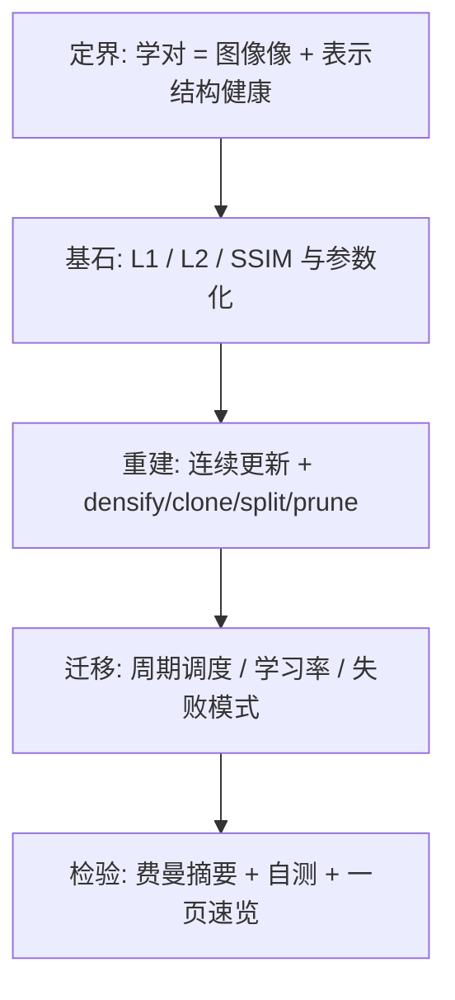
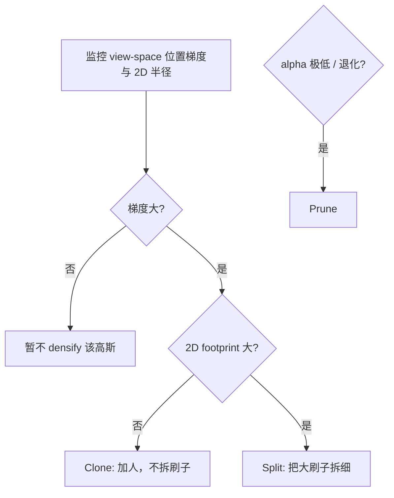

# 第 5 章：让高斯学会「正确」的事——优化目标为什么要这样设计

**本章核心问题**：第 4 章已经解释了为什么渲染链大部分可以反向传播 [backpropagation]。但「梯度能流回去」不等于「模型会学对」。真正的问题是：

> 什么叫学对？我们到底在最小化什么？哪些事情应该写成 loss，哪些事情反而不该硬塞进一个总损失，而应该变成训练过程本身的规则？

如果前两章解决的是怎样表示、怎样渲染，这一章解决的就是：

```text
怎样训练 [training / optimization design]
```

先把主线写在前面：3DGS 的训练**不是**只有一条 `loss.backward()`，而是两层同时发生：

1. **连续参数优化 [continuous parameter optimization]**：回答「这批高斯怎么改得更像」
2. **结构性编辑 [structural editing]**：回答「这批高斯够不够、太不太大、该不该删」

它们一起，才构成完整的 3DGS 训练。

### 加餐怎么读：生活类比 + 失败对照

后面每个概念卡 / 大主题都补了两块「加餐」。阅读建议：

1. **先读 Origin / Core idea**（建立基石）  
2. **再读生活类比**（用画面记住，但必须能说回基石）  
3. **最后读失败对照**（知道错会怎样，比只知道对更重要）

技能约束（第一性原理 skill）在这里仍然有效：

> 隐喻可以用，但必须映射回定义与约束；不能只听故事。

一张总导航（类比 → 基石 → 3DGS 症状）：

| 概念 | 一个够用的生活画面 | 基石一句话 | 3DGS 里做错时常见症状 |
|------|-------------------|------------|------------------------|
| continuous vs structural | 调音旋钮 vs 加人/换刷 | 连续改值 ≠ 改表示容量 | 细节永远糊、N 卡死 |
| L2 | 闯红灯按平方罚 | 大误差梯度 ∝ \|e\| 放大 | 被高光/遮挡边拖飞 |
| L1 | 闯红灯按次定额罚 | 梯度有界、更鲁棒 | 纯 L1 边缘易糊 |
| SSIM | 看图案像不像，不只比色号 | 局部结构/对比/亮度关系 | 颜色漂或结构仍塌 |
| 不全塞一个 loss | 交通灯用规则，不塞进「总罚分公式」 | 离散增删用流程规则 | 权重调疯、训练抖 |
| densify / clone / split / prune | 工位加人 / 换细刷 / 收回编制 | 梯度+footprint 触发容量重分配 | N 爆炸或永不 densify |
| scale + rotation param | 用轴长+朝向拼合法椭球，不裸改 9 个数 | $\Sigma=R\,\mathrm{diag}(s^2)\,R^\top$ 保 SPD | Σ 非法、NaN |
| opacity logit | 油门踏板映射到 0–1，不直接拧百分比 | $\alpha=\sigma(\rho)$ 软有界 | α 撞 0/1、梯度没了 |

---

## 0. 第一性原理路线图：定界 → 基石 → 重建 → 迁移 → 检验



| 步骤 | 本章在问什么 | 你读完应能说清 |
|------|--------------|----------------|
| **定界** | 优化对象是 $\Theta$；目标分图像像与结构合理两层 | 为什么只有 loss 不够 |
| **基石** | L1 vs L2 vs SSIM；$\Sigma$ 与 $\alpha$ 的参数化 | 为什么常用 $0.8 L_1+0.2(1-\mathrm{SSIM})$ |
| **重建** | 连续更新各参数含义；clone/split/prune 触发逻辑 | 两类动作如何分工 |
| **迁移** | 为何周期 densify；阶段策略 | 如何接到训练循环 |
| **检验** | 自测能否不看正文重讲 | 是否真懂而非背公式 |

---

## 一、先把「优化」拆成两类完全不同的动作

很多人一提训练，就下意识只想到：

```text
render -> compare with GT -> compute loss -> backward -> optimizer step
```

这当然是主干，但对 3DGS 来说还不够。因为训练时真正发生的事情，其实有两类。

### 1.1 第一类：连续参数更新 [Continuous Parameter Update]

这是最熟悉的那类：

| 参数 | 在学什么 |
|------|----------|
| 中心 $\boldsymbol{\mu}_i$ | 东西该在哪 |
| 形状 $\boldsymbol{\Sigma}_i$（或其 scale/rotation） | 多胖、多薄、朝哪倾斜 |
| 不透明度 $\alpha_i$ | 该遮多少 |
| 颜色 / SH | 看起来怎样 |

这些都是**连续变量 [continuous variables]**，所以非常适合交给梯度下降 [gradient descent]。

### 1.2 第二类：结构性编辑 [Structural Editing]

但 3DGS 还有另一类动作，不是「把值调小一点」，而是：

| 问题 | 动作 |
|------|------|
| 这片区域高斯太少？ | 要不要再长几个（clone / densify） |
| 这个高斯太大？ | 要不要拆成更小的（split） |
| 这个高斯几乎没贡献？ | 要不要删掉（prune） |

这类动作本质上不是微调，而是在训练过程中**重新分配表示容量 [representation capacity]**。

所以你一定要在脑子里分清这两层：

```text
第一层: 连续优化参数值
第二层: 动态优化表示结构
```

### 1.3 概念卡：Continuous Opt vs Structural Edit

| 字段 | 内容 |
|------|------|
| **English name** | Continuous Parameter Optimization vs Structural Editing |
| **中文** | 连续参数优化 vs 结构性编辑 |
| **Origin** | 经典可微学习负责连续更新；自适应表示（网格细化、点云 densify 等）负责离散容量调整 |
| **Core idea** | 图像 loss 回答「像不像」；结构规则回答「容量够不够、单元是否健康」 |
| **Why not alternatives** | 把一切塞进一个巨大加权 loss，往往不稳定且难调；只用连续更新无法凭空长出新自由度 |
| **In 3DGS** | Adam 等更新 $\mu,s,q,\alpha,\mathrm{sh}$；周期 densify/clone/split/prune |
| **PyTorch example** | `loss.backward(); opt.step()` 是第一层；`if step%100==0: densify()` 是第二层 |
| **Common confusions** | densify 不是 loss 的一项；prune 也不是「梯度把 alpha 推到 0 就会自动删除参数槽」 |

#### 生活类比（必须映射回基石）

把 **continuous parameter optimization** 和 **structural editing** 想成「装修工地的两种动作」，不要混成同一种。

| 生活画面 | 对应基石 |
|----------|----------|
| 调音旋钮：音量从 3 拧到 4 | 连续变量：$\mu, s, q, \alpha, \mathrm{sh}$ 在现有参数空间里走一步 |
| 工位任务太多 → **多派一个人** | clone / densify：增加表示单元（表示容量 [representation capacity]↑） |
| 刷子太粗 → **换成两把细刷** | split：把粗单元换成更细单元 |
| 闲人占工位 → **收回编制** | prune：删掉无贡献单元（参数槽真的消失） |
| 只拧旋钮，从不加人 | 只有 continuous update：容量固定，细结构永远装不下 |
| 只加人，从不调音 | 只有 structural edit：结构在变，但每个单元对不齐 |

```text
旋钮 = Adam / SGD 能改的连续值
加人/换刷/裁员 = 训练规则触发的离散编辑
两者一起，才是 3DGS 的 training design
```

> 映射回基石：图像 loss 回答「像不像」；结构规则回答「容量够不够、单元是否健康」。`loss.backward(); opt.step()` 是第一层；`if step%100==0: densify()` 是第二层。

#### 失败对照：做对 vs 做错

| 场景 | 做对 | 做错时你看到什么 |
|------|------|------------------|
| 树叶边缘糊 | densify：clone/split 增加局部自由度 | 只降 loss、不 densify → 永远糊、PSNR 平台很低 |
| 死高斯 | prune 真正 `remove` 参数槽 | 以为 $\alpha\to 0$ 就等于删了 → 显存/排序成本悄悄涨 |
| 大平面 | 少量较大 Gaussian 粗盖 | 到处 densify → N 爆炸，墙面被切成碎点 |
| 日志 | 分开记「连续参数」与「N 变化」 | 把 densify 当 loss 一项硬加 → 权重难调、训练抖 |

```text
症状速记：
  「loss 在降，细节永远不够」→ 多半缺 structural editing
  「N 疯涨，图没明显更好」  → densify 过激或 prune 失效
  「α≈0 但显存不掉」        → 没真正 prune 参数槽
```

---

## 二、先把优化目标写成正式一点的样子

设场景里当前有一组高斯参数：

$$
\Theta = \{\boldsymbol{\mu}_i,\, \boldsymbol{\Sigma}_i,\, \alpha_i,\, \mathrm{sh}_i\}_i
$$

更贴近实现的内部参数化也可以写成：

$$
\Theta = \{\boldsymbol{\mu}_i,\, \mathbf{s}_i,\, \mathbf{q}_i,\, \rho_i,\, \mathrm{sh}_i\}_i
$$

给定一个训练视角 $\mathrm{cam}_k$，渲染器会生成预测图像：

$$
\hat{I}^k = \mathrm{render}(\Theta,\, \mathrm{cam}_k)
$$

数据集里对应的真实图像记作 $I^k_{\mathrm{gt}}$。于是最基本的优化目标就是：

$$
\Theta^* = \arg\min_{\Theta}\,
\mathbb{E}_{k}\Big[
  L_{\mathrm{img}}\big(\mathrm{render}(\Theta,\mathrm{cam}_k),\, I^k_{\mathrm{gt}}\big)
\Big]
$$

这条式子只是在说一件非常朴素的事：

> 在不同训练视角上，让当前这组 Gaussian 渲染出来的图，尽量接近真实图像。

问题马上来了：

> $L_{\mathrm{img}}$ 到底该怎么设计？

---

## 三、为什么图像项不能无脑只用 L2

最先想到的通常是均方误差 [Mean Squared Error, MSE / L2 loss]：

$$
L_2 = \mathrm{mean}\big((I_{\mathrm{pred}} - I_{\mathrm{gt}})^2\big)
$$

它不是不能用，但对 3DGS 来说通常不是最佳主角。

### 3.1 概念卡：L2 Loss（均方误差）

| 字段 | 内容 |
|------|------|
| **English name** | L2 Loss / Mean Squared Error (MSE) |
| **中文** | L2 损失 / 均方误差 [L2 / MSE] |
| **Origin** | 最小二乘 [least squares] 传统；高斯噪声下 MLE 对应平方损失 |
| **Core idea** | 误差平方计入：大误差被强烈放大 |
| **Why not alternatives** | 数学光滑、处处可导（相对 L1 在 0 点）；但对离群点 [outliers] 极敏感 |
| **In 3DGS** | 有时作为参考或辅助，很少单独作为唯一主监督 |
| **PyTorch example** | `F.mse_loss(pred, gt)` |
| **Common confusions** | 「可微」不等于「适合当主粮」；问题不是不可微，而是梯度气质太激进 |

#### 生活类比（必须映射回基石）

把 **L2 loss / MSE** 想成「交通罚款按速度差的平方算」，不是「普通加减分」。

| 生活画面 | 对应基石 |
|----------|----------|
| 超速 1 → 罚 1；超速 10 → 罚 100 | $e^2$：大误差被强烈放大 |
| 少数「闯红灯」抢走全城交警预算 | 离群像素 [outliers] 主导梯度 |
| 路面整体还该微调，但预算被事故点吃光 | 大部分区域稳定改进不够从容 |
| 数学上处处光滑、好求导 | L2 可微好用 ≠ 梯度气质适合当主监督 |

```text
像素误差 e = pred - gt
L2 梯度气质 ≈ 「e 越大，推得越狠」
高光、遮挡边、噪声像素 → 天然大 e → 天然抢预算
```

> 映射回基石：$L_2=\mathrm{mean}(e^2)$，对 $e$ 的梯度量级 ∝ $e$。问题不是「不可微」，而是**大误差时更新过猛**。

#### 失败对照：做对 vs 做错

| 场景 | 做对 | 做错时你看到什么 |
|------|------|------------------|
| 主监督选择 | L1 主粮 + 少量 SSIM | 纯 L2 当唯一主粮 |
| 高光/遮挡边 | 梯度有界，整体颜色先稳住 | 少数亮边把 $\mu$/scale 拖飞，别处学不动 |
| 调试 | 对比 L1/L2 梯度直方图 | 只看「可微」就选 L2 → 训练气质莫名暴躁 |
| 离群帧 | 鲁棒损失或清洗数据 | L2 把坏标注像素当「最重要的事」 |

```text
症状速记：
  「边界/高光一抖，全场跟着晃」→ L2 放大离群误差的典型气质
  「平均 loss 还行，局部爆炸」  → 平方惩罚把预算送给了少数像素
```

### 3.2 L2 的真正问题：太爱放大离群误差

平方意味着：小误差还好，大误差会被非常强地放大。于是少数位置很容易拿走太多梯度预算：

- 遮挡边界 [occlusion boundaries]
- 高光或反射区域 [specular highlights]
- 高频纹理细节
- 噪声像素

这会导致一种非常典型的训练气质：

> 少数很错的地方把系统拉得过猛，而大部分区域的稳定改进反而不够从容。

### 3.3 梯度视角（务必建立这个直觉）

对单个像素误差 $e = \hat{y}-y$：

| 损失 | 形式 | 对 $e$ 的梯度（量级直觉） |
|------|------|---------------------------|
| L2 | $e^2$ | 正比于 $e$（大误差 → 大梯度） |
| L1 | $|e|$ | 大致是 $\mathrm{sign}(e)$（有界） |

所以工程训练里，很多时候更重要的是：

- 梯度方向稳定
- 别被少数离群点拖着跑
- 先把整体重建往正确方向推

---

## 四、为什么 L1 更适合作为图像项的主粮

L1 的形式很简单：

$$
L_1 = \mathrm{mean}\big(|I_{\mathrm{pred}} - I_{\mathrm{gt}}|\big)
$$

### 4.1 概念卡：L1 Loss（绝对误差）

| 字段 | 内容 |
|------|------|
| **English name** | L1 Loss / Mean Absolute Error (MAE) |
| **中文** | L1 损失 / 平均绝对误差 [L1 / MAE] |
| **Origin** | 鲁棒统计 [robust statistics]；拉普拉斯噪声下的 MLE 对应绝对误差 |
| **Core idea** | 每个像素误差线性计入，大误差不会平方爆炸 |
| **Why not alternatives** | 比 L2 更稳；比纯感知损失更直接可解释 |
| **In 3DGS** | 经典主基底：约 80% 权重 |
| **PyTorch example** | `F.l1_loss(pred, gt)` |
| **Common confusions** | L1 在 0 处不可导，但亚梯度 [subgradient] 工程上完全可用；现代框架处理没问题 |

#### 生活类比（必须映射回基石）

把 **L1 loss / MAE** 想成「每次违规定额罚，不按平方滚雪球」，是**主粮**而不是调味料。

| 生活画面 | 对应基石 |
|----------|----------|
| 超速一次罚固定额度，不因「错得很离谱」再平方 | 梯度大致 $\mathrm{sign}(e)$，有界 |
| 交警还能照顾整条马路，不被一个事故点吸干 | 鲁棒 [robust]：离群点难绑架全局 |
| 先把整城颜色调到「大致对」 | 3DGS 里约 0.8 权重推整体收敛 |
| 0 点「尖一下」但不妨碍交警上班 | 0 处亚梯度工程上完全可用 |

```text
L1: 关心方向（偏亮/偏暗），不太被幅度绑架
L2: 幅度越大推得越狠
主粮 = 先稳，再谈结构
```

> 映射回基石：$L_1=\mathrm{mean}|e|$。线性计入误差 → 大误差不会平方爆炸 → 更适合做图像项主监督。

#### 失败对照：做对 vs 做错

| 场景 | 做对 | 做错时你看到什么 |
|------|------|------------------|
| 主监督 | $0.8 L_1 + 0.2(1-\mathrm{SSIM})$ | 纯 L1：颜色准，边缘/纹理易糊 |
| 离群像素 | L1 稳住训练 | 误以为 L1「不可导不能用」而改回纯 L2 |
| 调参 | 先确认 L1 下降再谈结构项 | 一上来猛加感知损失，颜色漂、难诊断 |
| 报告 | 同时看 L1 与 PSNR/SSIM | 只报 L1 下降 → 可能「糊但 L1 还行」 |

```text
症状速记：
  「颜色差不多，边缘像涂了凡士林」→ 缺结构项（SSIM），不是 L1 本身坏了
  「训练很稳但细节软」            → 预期内：L1 是主粮，需要 SSIM 校正
```

### 4.2 关键直觉

- 每个像素误差线性计入
- 大误差不会像平方那样爆炸式放大
- 梯度整体更鲁棒 [robust]、更稳定

所以你可以把它理解成：

> 先用一种比较稳、比较不容易被离群点带偏的方式，让颜色整体往正确方向收敛。

这也是为什么很多 3DGS 讲解里会说：**L1 是主粮**。

### 4.3 但只用 L1 还不够

如果只盯逐像素绝对误差，常见问题是：

- 整体颜色差不多对了
- 平均亮度也可能对了
- 但边缘和纹理开始变糊

原因很简单：人眼并不只是看「每个像素值差多少」，还特别看：

- 边界还在不在
- 局部对比有没有被抹掉
- 纹理结构是不是塌成一片

这就是为什么还需要另一个角色：SSIM。

---

## 五、SSIM 在补什么，它为什么常常只占一小部分权重

### 5.1 概念卡：SSIM（结构相似性）

| 字段 | 内容 |
|------|------|
| **English name** | Structural Similarity Index Measure (SSIM) / DSSIM |
| **中文** | 结构相似性指数 [SSIM]；常作损失时用 $1-\mathrm{SSIM}$ 即 DSSIM |
| **Origin** | 图像质量评价 [image quality assessment]：模拟人对亮度、对比度、结构的感知 |
| **Core idea** | 不在问「值差多少」，而在问「局部图案的组织结构像不像」 |
| **Why not alternatives** | 纯像素损失易糊；纯感知网络损失更重、更黑盒 |
| **In 3DGS** | 结构校正项，常见 $\lambda_{\mathrm{dssim}}=0.2$ |
| **PyTorch example** | `l_ssim = 1 - ssim(pred, gt)` |
| **Common confusions** | SSIM 高不等于 RGB 精确；单独用 SSIM 可能颜色漂 |

#### 生活类比（必须映射回基石）

把 **SSIM / DSSIM** 想成「看照片时先看图案还在不在，而不只对色号」，是**结构校正**，不是主粮。

| 生活画面 | 对应基石 |
|----------|----------|
| 两张图色号接近，但脸轮廓糊了——你一眼觉得「不对」 | 人眼敏感边界/对比/局部结构 |
| 局部窗口里：亮度、对比度、结构关系 | luminance / contrast / structure |
| 主菜 80% 米饭（L1），20% 酱（SSIM） | $\lambda_{\mathrm{dssim}}\approx 0.2$ |
| 只吃酱：味道「像」，颜色可能怪 | 纯 SSIM：结构像但 RGB 可漂 |

```text
L1 问：每个像素值差多少？
SSIM 问：这块局部图案的组织结构像不像？
L_ssim = 1 - SSIM  （越不像越大）
```

> 映射回基石：SSIM 不是逐像素平方/绝对差，而是局部统计相似性。在 3DGS 里作结构校正项，权重通常远小于 L1。

#### 失败对照：做对 vs 做错

| 场景 | 做对 | 做错时你看到什么 |
|------|------|------------------|
| 权重 | $\lambda\approx 0.2$：L1 保色 + SSIM 保边 | $\lambda=0.8$：结构像，高光/颜色漂 |
| 纯 L1 | 知道会糊，主动加 SSIM | 抱怨「模型糊」却从不加结构项 |
| 纯 SSIM | 不单独当主监督 | 指标 SSIM 高，肉眼颜色漂、难和 GT 像素对齐 |
| 实现 | 真窗口 SSIM，不是拿 L1 冒充 | `1 - L1` 当 SSIM → 完全不是一回事 |

```text
症状速记：
  「边缘糊但 L1 还行」→ 加大一点 SSIM 或查 densify，别先怪渲染
  「结构像、色漂」    → λ_dssim 太大或缺 L1 锚定
```

### 5.2 SSIM 关心局部窗口内的什么

SSIM 关心的是局部窗口 [local window] 内的：

- 亮度关系 [luminance]
- 对比度关系 [contrast]
- 结构关系 [structure]

所以它不是逐像素罚差，而是在问：

> 这块局部图案的视觉组织结构有没有守住？

在实现里，常见会写成：

```text
L_ssim = 1 - SSIM(I_pred, I_gt)
```

### 5.3 为什么它常常不是主粮，而是结构校正

如果只用 SSIM，也不太稳。因为：

- 它更偏结构感知
- 数值解释没有 L1 那么直截了当
- 作为唯一主监督时，优化气质常常不如 L1 稳

所以 3DGS 里特别经典的组合是：

$$
L_{\mathrm{img}} = (1-\lambda_{\mathrm{dssim}})\, L_1 + \lambda_{\mathrm{dssim}}\, (1-\mathrm{SSIM})
$$

常见取值：

$$
\lambda_{\mathrm{dssim}} = 0.2
\quad\Rightarrow\quad
L_{\mathrm{img}} \approx 0.8\, L_1 + 0.2\, (1-\mathrm{SSIM})
$$

### 5.4 这组权重真正表达的工程判断

| 角色 | 权重直觉 | 负责什么 |
|------|----------|----------|
| L1 | 主粮 ~0.8 | 稳定、直接、鲁棒地推动整体颜色收敛 |
| SSIM | 调味 ~0.2 | 提醒系统：别把边缘和结构糊掉 |

也就是说：

> L1 是主粮，SSIM 是结构校正。

这个判断非常工程化，也非常符合 3DGS 整体风格：

```text
先保证训练稳，再逐步把视觉结构拉回来
```

### 5.5 权重敏感度对照表（调参直觉）

| $\lambda_{\mathrm{dssim}}$ | 可能现象 |
|---------------------------|----------|
| 0.0（纯 L1） | 颜色准，边缘/纹理易糊 |
| 0.2（默认） | 颜色与结构较平衡 |
| 0.8（SSIM 主导） | 结构像，但颜色可能漂（尤其高光） |

### 5.6 PyTorch：经典图像损失

```python
import torch
import torch.nn.functional as F

def l1_loss(pred, gt):
    return F.l1_loss(pred, gt)


def ssim_stub(pred, gt):
    """
    教学占位：真实实现应用窗口统计的 SSIM。
    这里仅演示接口形状。
    """
    # 返回 [0,1] 附近的“相似度”占位
    return 1.0 - F.l1_loss(pred, gt)  # 千万别当真 SSIM，只是接口示例


def image_loss(pred, gt, lambda_dssim=0.2):
    l1 = l1_loss(pred, gt)
    dssim = 1.0 - ssim_stub(pred, gt)
    return (1.0 - lambda_dssim) * l1 + lambda_dssim * dssim


pred = torch.rand(1, 3, 64, 64, requires_grad=True)
gt = torch.rand(1, 3, 64, 64)
loss = image_loss(pred, gt)
loss.backward()
print(float(loss), pred.grad is not None)
```

---

## 六、为什么只最小化图像 loss 还远远不够

到这里，你可能会觉得：

```text
好，图像项已经定义完了
训练不就是最小化这个 L_img 吗？
```

还不够。

因为图像 loss 只能回答：

> 当前这批高斯渲染得像不像。

但它回答不了另一个同样关键的问题：

> 当前这批高斯的结构本身，是不是合理？

### 6.1 一个区域高斯太少，loss 不会凭空长出新高斯

假设树叶边缘那块区域本来就只放了几个 Gaussian。

即使误差一直很大，连续优化也只能做这些事：

- 把这几个 Gaussian 挪一挪
- 把它们的形状拉一拉
- 改一改透明度和颜色

它做不到的是：

```text
「这里本来就表达能力不够，我自动给你再长十几个新 Gaussian」
```

这不是一个连续参数更新能自然做到的事。梯度下降只会在**现有参数空间**里走，不会 magically 增加参数维数。

### 6.2 一个 Gaussian 太大，也会让图像项产生「虚假满意」

如果某个 Gaussian 特别大，它可能会把大片区域粗糙地糊过去，让某些低频误差暂时下降。

但那不代表表示健康。因为一个过大的 Gaussian 常常意味着：

- 它在试图同时解释太多局部结构
- 高频细节被平均掉了
- 真正该被分别建模的区域被混成一团

所以「图像误差下降了」并不总等于「表示变合理了」。

### 6.3 完全没贡献的 Gaussian 也不会优雅地自动蒸发

另一边，有些 Gaussian 会慢慢变成：

- `alpha` 很低
- 几乎不参与可见颜色
- 但还在吃显存、吃排序、吃 tile 分配、吃 blending 成本

如果你什么都不做，它们不会因为「没用」就自动从参数列表里离场。

（注意：`alpha→0` 与「删除这个参数槽」是两件不同的事。）

### 6.4 压成一句话

> 图像 loss 只负责「像不像」，不负责「这套表示结构是不是健康」。

---

## 七、3DGS 的关键决定：不要把所有问题都硬塞进一个大 loss

这恰恰是 3DGS 很漂亮、也很工程的一点。

它没有走这种路：

```text
L_total = 图像项 + 尺度项 + 稀疏项 + 数量项 + 结构项 + 各种惩罚项
然后指望一个统一梯度下降把所有问题都解决
```

它更像是下面这种分工。

### 7.1 loss 负责连续监督

loss 主要回答：

- 当前图像和真实图像差多少
- 参数朝哪个连续方向改会更好

### 7.2 训练规则负责结构管理

训练过程则额外回答：

- 哪里该长新 Gaussian
- 哪里该 clone
- 哪里该 split
- 哪里该 prune
- 什么时候该减小学习率，进入更细的收敛阶段

### 7.3 这背后的思想特别重要

> 不是所有问题都应该被硬写成一个可微标量项。

有些问题如果本质上是：

- 离散增删
- 容量重分配
- 训练阶段切换

那直接把它们做成训练流程里的规则，往往比强行塞进 loss 更自然、更稳。

这和第 4 章里「排序虽然不严格可微，但工程上仍然可用」是同一种精神：

```text
该连续的连续
该离散的离散
别假装一切都能用一个光滑标量解决
```

#### 生活类比（必须映射回基石）

把「**不要把所有问题都硬塞进一个大 loss**」想成「城市治理不全靠一张总罚分表」。

| 生活画面 | 对应基石 |
|----------|----------|
| 超速用罚单（连续金额） | 图像 loss：可微标量，推连续参数 |
| 车道要不要扩建 = 市政会议决议，不塞进罚单公式 | densify/clone/split：离散容量决策 |
| 闲置岗位裁撤 = 人事规则，不是「再加一项可微惩罚」 | prune：真正删除参数槽 |
| 把「该不该修地铁」写成可微函数硬优化 | $L_{\mathrm{total}}$ 塞满尺度/稀疏/数量项 → 权重地狱 |

```text
错误幻想:
  L_total = 图像 + 尺度 + 稀疏 + 数量 + 结构 + ...
  指望一个 backward 解决离散增删

3DGS 现实:
  loss  → 连续监督（像不像）
  规则 → 结构管理（够不够、该不该删、何时降 LR）
```

> 映射回基石：不是所有问题都该写成可微标量。离散增删、容量重分配、阶段切换 → 做成**训练流程规则**往往更稳。这和第 4 章「排序不严格可微仍可用」是同一种工程精神。

#### 失败对照：做对 vs 做错

| 场景 | 做对 | 做错时你看到什么 |
|------|------|------------------|
| 缺高斯 | 周期 densify | 加「鼓励数量」的 loss 项 → 数量涨但位置乱 |
| 死高斯 | prune 删槽 | 只加 $\alpha$ 稀疏惩罚 → $\alpha$ 小了但 N 不降、算力不降 |
| 调参 | 分开调 loss 权重与 densify 阈值 | 一个 $L_{\mathrm{total}}$ 十个 λ → 此起彼伏，不可诊断 |
| 设计哲学 | 连续归连续，离散归离散 | 假装一切光滑 → 训练抖、论文公式很长但不好用 |

```text
症状速记：
  「权重一动，全身都变」→ 你把结构问题塞进了总 loss
  「α 很小但显存不掉」 → 需要 prune 规则，不是再加一项惩罚
```

---

## 八、连续优化里，参数到底在往什么方向学

这一节把最核心的连续参数直觉写清楚。

### 8.1 `mu`：学的是「东西该在哪」

如果某块结构投影总偏左，或者边缘总对不齐，位置梯度会推动 `mu` 变化。

所以 `mu` 的学习本质上是在修：

```text
这团局部密度云应该放在哪
```

### 8.2 `Sigma`：学的是「它应该多胖、多薄、朝哪倾斜」

形状参数调整的是 footprint 的几何结构。例如：

- 太胖了，边缘会糊
- 太细了，容易有洞
- 朝向不对，沿结构主方向的覆盖会失真

所以 `Sigma` 本质上是在学：

```text
这团 Gaussian 应该怎样贴合局部几何
```

### 8.3 `alpha`：学的是「它该不该遮、遮多少」

`alpha` 决定这个 Gaussian 在 blending 里拿走多少透射率预算。

- 太小：几乎看不见
- 太大：容易把后面的结构压死

所以它本质上在学：

```text
这团局部结构到底该有多「实」
```

### 8.4 `color / sh`：学的是「它该长什么样」

颜色项最直接，负责视觉外观。如果用球谐 [Spherical Harmonics, SH]，还会进一步表达视角相关外观 [view-dependent appearance]。

这里先保留最简单直觉：

```text
位置学「在哪」
形状学「长什么几何样」
透明度学「遮多少」
颜色学「看起来什么颜色」
```

这四类参数一起，才构成完整训练对象。

### 8.5 一张「参数 → 现象」对照表

| 参数 | 常见错误现象 | 梯度大致会推动什么 |
|------|--------------|--------------------|
| $\mu$ | 边缘错位、重影 | 平移中心 |
| scale | 过糊 / 过细有洞 | 缩放轴长 |
| rotation | 沿表面方向覆盖不对 | 旋转主轴 |
| $\alpha$ | 过透或过挡 | 调整不透明度 |
| SH/color | 颜色偏、高光不对 | 改外观系数 |

---

## 九、为什么真实实现常常不直接优化裸 `Sigma` 和裸 `alpha`

第 3 章已经稍微提过，这里把它和**优化稳定性**连起来。这不是边角实现细节，而是优化设计的一部分。

### 9.1 概念卡：Scale + Rotation Parameterization of $\Sigma$

| 字段 | 内容 |
|------|------|
| **English name** | Scale-Rotation Parameterization of Covariance |
| **中文** | 用尺度与旋转参数化协方差 [scale + rotation parameterization] |
| **Origin** | 需要保证 $\Sigma$ 始终对称正定 [SPD]；直接优化 $3\times 3$ 矩阵容易破坏约束 |
| **Core idea** | $\Sigma = R(q)\,\mathrm{diag}(s_1^2,s_2^2,s_3^2)\,R(q)^\top$ |
| **Why not alternatives** | 裸矩阵 9 个数冗余且不正定；Cholesky 也可，但 scale+rot 几何意义更直观 |
| **In 3DGS** | 优化 $\mathbf{s}$ 与四元数 $\mathbf{q}$，再组装 $\Sigma$ |
| **PyTorch example** | 见下 |
| **Common confusions** | 存的是 $s$ 还是 $\log s$；旋转用 quaternion 而非欧拉角（避免万向锁） |

#### 生活类比（必须映射回基石）

把 **scale + rotation parameterization** 想成「用三根轴长 + 朝向拼一个合法气球」，而不是「直接拿 9 个无约束数字乱改气球身份证」。

| 生活画面 | 对应基石 |
|----------|----------|
| 气球必须「鼓着」：不能负体积、不能扭成马鞍 | $\Sigma$ 必须对称正定 [SPD] |
| 三根轴长 $s_1,s_2,s_3$ + 旋转姿态 $q$ | $\Sigma = R(q)\,\mathrm{diag}(s^2)\,R(q)^\top$ |
| 轴长存 $\log s$，永远能 `exp` 回正数 | 保证 scale $>0$，避免负特征值 |
| 旋转用四元数并归一化 | 避免欧拉角万向锁 [gimbal lock] |
| 裸改 $3\times 3$ 九个数 | 冗余、易不对称、易不正定 → 非法协方差 |

```text
合法身份证组装线:
  log_scale --exp--> s > 0
  quaternion --normalize--> R
  Sigma = R @ diag(s^2) @ R.T   ← 天生 SPD（在 s>0 时）
```

> 映射回基石：参数化是优化设计的一部分——约束进表示，比「优化后再投影回合法集合」更稳。几何意义清晰：轴长 + 朝向。

#### 失败对照：做对 vs 做错

| 场景 | 做对 | 做错时你看到什么 |
|------|------|------------------|
| 存尺度 | `log_scale`，`s=exp(...)` | 直接优化可为负的 scale → Σ 非法 |
| 旋转 | quaternion + normalize | 欧拉角乱序 → 姿态跳变、难收敛 |
| 组装 Σ | $R\,\mathrm{diag}(s^2)\,R^\top$ | 裸改 Σ 元素 / 少写 `.T` → eig 负值、NaN |
| 调试 | `eigh(Σ)` 看轴长是否合理 | 把 Σ[0,0] 当「转角」读 → 完全误读训练状态 |

```text
症状速记：
  「loss 突然 NaN，Σ 有负特征值」→ 参数化约束被绕开了
  「椭球方向怎么转都不对」      → R 与 q 约定或未 normalize
```

### 9.2 为什么不直接优化任意 $3\times 3$ 矩阵

因为直接优化任意矩阵容易出问题：

- 可能不再对称
- 可能不再正定（不再是合法协方差）
- 数值不稳定
- 不容易约束几何意义

所以更常见的是：

$$
\boldsymbol{\Sigma}
= R(\mathbf{q})\,
\mathrm{diag}(s_1^2, s_2^2, s_3^2)\,
R(\mathbf{q})^\top
$$

优化的其实是：

- `scale = (s1, s2, s3)`（常存 `log_scale` 以保证正）
- `rotation = q`（四元数，训练中需归一化）

### 9.3 概念卡：Opacity Logit

| 字段 | 内容 |
|------|------|
| **English name** | Opacity Logit / Sigmoid Parameterization |
| **中文** | 不透明度的 logit 参数化 [opacity logit] |
| **Origin** | 概率与逻辑回归：把无约束实数映射到 $(0,1)$ |
| **Core idea** | 内部存 $\rho\in\mathbb{R}$，$\alpha=\sigma(\rho)=\frac{1}{1+e^{-\rho}}$ |
| **Why not alternatives** | 直接优化 $\alpha\in[0,1]$ 易撞边界、梯度消失或需要投影 |
| **In 3DGS** | 几乎所有实现都用某种有界映射保护 $\alpha$ |
| **PyTorch example** | `alpha = torch.sigmoid(opacity_logit)` |
| **Common confusions** | logit 很大时 sigmoid 饱和，梯度变小——这是有意的边界软保护 |

#### 生活类比（必须映射回基石）

把 **opacity logit** 想成「油门踏板行程是任意实数，但车速百分比被映射在 0–1」，不要直接拿百分比旋钮硬拧到界外。

| 生活画面 | 对应基石 |
|----------|----------|
| 踏板位置 $\rho\in\mathbb{R}$ 随便推 | 内部无约束参数 [logit] |
| 仪表显示车速比例 $\alpha=\sigma(\rho)\in(0,1)$ | sigmoid 软有界 |
| 踏板到底时再踩，速度几乎不涨 | 饱和区梯度变小 = 边界软保护 |
| 直接优化 $\alpha\in[0,1]$ 并夹紧 | 易撞墙、要投影、边界梯度怪异 |

```text
alpha = sigmoid(opacity_logit)
想要半透明起点: logit(0.5)=0
想要更透: logit 更负；更实: logit 更正
```

> 映射回基石：需要 $0<\alpha<1$。logit→sigmoid 把无约束优化变成有界不透明度，是**优化稳定性设计**，不是无关实现细节。

#### 失败对照：做对 vs 做错

| 场景 | 做对 | 做错时你看到什么 |
|------|------|------------------|
| 存储 | 存 `opacity_logit`，用时 `sigmoid` | 直接 clamp α 硬截断 → 边界梯度丢失或不稳 |
| 初始化 | 中等 $\alpha_0$（如 0.1–0.5）反推 logit | 全体 $\alpha\approx 1$ → 前排吃光透射率 |
| 饱和 | 接受极大 logit 时梯度小 | 误以为「坏了」狂加 LR → 数值抖 |
| prune | $\alpha$ 极低再删槽 | 只看 logit 数值不看 $\sigma(\cdot)$ → 阈值全错 |

```text
症状速记：
  「发白/前排挡死后排」→ α 整体偏高或初始化过实
  「全透明学不动」    → α 过低或 logit 卡在饱和负端
```

### 9.4 `alpha` 常常通过内部 logit 再映射出来

因为你通常希望：

$$
0 < \alpha < 1
$$

最常见做法是存一个内部变量 $o$（或 $\rho$），再通过 sigmoid 映射：

$$
\alpha = \sigma(o) = \frac{1}{1+e^{-o}}
$$

这样可以避免直接优化时总撞边界。

### 9.5 这不是「实现细节」，而是优化设计的一部分

因为参数化方式会直接影响：

- 梯度尺度
- 数值稳定性
- 是否容易进入奇异状态

所以更准确地说：

> 第 5 章讲的不是抽象 loss 设计，而是「哪些量值得学、怎样参数化才更好学、哪些问题不该硬交给 loss」的整体训练设计。

### 9.6 PyTorch：从内部参数组装 $\Sigma$ 与 $\alpha$

```python
import torch
import torch.nn.functional as F

def quaternion_to_rotation_matrix(q: torch.Tensor) -> torch.Tensor:
    """
    q: (..., 4)  as (w, x, y, z), will be normalized
    returns R: (..., 3, 3)
    """
    q = F.normalize(q, dim=-1)
    w, x, y, z = q.unbind(-1)
    B = q.shape[:-1]
    R = torch.empty(*B, 3, 3, device=q.device, dtype=q.dtype)
    R[..., 0, 0] = 1 - 2 * (y * y + z * z)
    R[..., 0, 1] = 2 * (x * y - z * w)
    R[..., 0, 2] = 2 * (x * z + y * w)
    R[..., 1, 0] = 2 * (x * y + z * w)
    R[..., 1, 1] = 1 - 2 * (x * x + z * z)
    R[..., 1, 2] = 2 * (y * z - x * w)
    R[..., 2, 0] = 2 * (x * z - y * w)
    R[..., 2, 1] = 2 * (y * z + x * w)
    R[..., 2, 2] = 1 - 2 * (x * x + y * y)
    return R


def build_covariance(log_scale: torch.Tensor, q: torch.Tensor) -> torch.Tensor:
    """
    log_scale: (..., 3)
    q:         (..., 4)
    """
    s = torch.exp(log_scale)
    R = quaternion_to_rotation_matrix(q)
    S = torch.diag_embed(s)          # (..., 3, 3)
    # Sigma = (R S) (R S)^T = R diag(s^2) R^T
    RS = R @ S
    return RS @ RS.transpose(-1, -2)


def opacity_from_logit(opacity_logit: torch.Tensor) -> torch.Tensor:
    return torch.sigmoid(opacity_logit)


# demo
log_s = torch.zeros(3, requires_grad=True)
q = torch.tensor([1.0, 0.0, 0.0, 0.0], requires_grad=True)
o = torch.tensor(0.0, requires_grad=True)
Sigma = build_covariance(log_s, q)
alpha = opacity_from_logit(o)
loss = Sigma.trace() + alpha  # 任意标量，演示可反传
loss.backward()
print(Sigma.detach())
print(alpha.detach(), log_s.grad is not None)
```

---

## 十、结构编辑到底靠什么信号触发

这里是 3DGS 最聪明、也最容易被讲糊的部分。

它依赖的不是神秘规则，而是两个非常朴素的信号。

### 10.1 信号一：梯度持续很大 [large positional gradient]

如果某个 Gaussian 相关的梯度长期偏大，通常说明：

```text
这片区域目前还没被解释好
```

尤其是位置相关梯度长期很大时，常常意味着：

- 这里误差还在反复出现
- 现有表示不够灵活
- 不是轻微调参就能彻底解决

所以「大梯度」可以被理解为：

> 这里还缺表达能力。

### 10.2 信号二：屏幕 footprint 太大 [large screen-space radius]

另一个信号来自屏幕空间半径或覆盖范围。

如果一个 Gaussian 在屏幕上投影得很大，通常说明：

- 它正在试图同时解释太多区域
- 局部几何可能被过度平均
- 它更适合拆成多个更小 Gaussian

所以「footprint 太大」其实是在说：

> 这里不是缺一个更努力的 Gaussian，而是缺更细粒度的几个 Gaussian。

### 10.3 必须分清的三件事

| 量 | 含义 | 不是什么 |
|----|------|----------|
| 3D 尺度 [world scale] | 世界空间里有多大 | 不等于屏幕上有多大 |
| 2D 半径 / footprint | 当前视图屏幕覆盖多大 | 不等于梯度大 |
| 梯度阈值 | 参数对 loss 多敏感 | 不等于 footprint 大 |

这三者会在训练决策里被一起使用，但它们不是同一个东西。

### 10.4 这两个信号为什么搭配得特别好

因为它们分别回答不同问题：

```text
梯度大   -> 这里没学好
footprint 大 -> 这里太粗了
```

两者合起来，就能比较稳地回答：

```text
这个位置到底该 clone，还是该 split，还是其实不用动
```



---

## 十一、三种结构动作：clone、split、prune 到底在干嘛

### 11.1 概念卡：Adaptive Density Control

| 字段 | 内容 |
|------|------|
| **English name** | Adaptive Density Control (densify / clone / split / prune) |
| **中文** | 自适应密度控制 [Adaptive Density Control] |
| **Origin** | 点基与显式表示里的容量自适应；3DGS 论文核心训练机制之一 |
| **Core idea** | 训练中动态增删高斯，把表示预算投到真正复杂的地方 |
| **Why not alternatives** | 固定数量高斯无法兼顾全场景复杂度；纯 loss 惩罚难实现离散增删 |
| **In 3DGS** | 周期执行；依赖梯度统计与屏幕半径等启发式 |
| **PyTorch example** | 伪代码见下；真实实现会重建优化器状态 |
| **Common confusions** | clone ≠ split；densify 不是每步都做 |

#### 生活类比（必须映射回基石）

把 **Adaptive Density Control（densify / clone / split / prune）** 想成「画室编制管理」，信号来自「这地方总画不对」和「这把刷子铺太开」。

| 生活画面 | 对应基石 |
|----------|----------|
| 工位任务堆积、返工不断 | 位置梯度 [positional gradient] 长期大 → 这里没学好 |
| 一把刷子盖了半面墙 | 屏幕 footprint / 2D radius 太大 → 太粗 |
| **Clone**：多派一个人，刷子尺寸差不多 | 梯度大 + 尺度不大 → 加相近单元 |
| **Split**：一把粗刷换成两把细刷 | 梯度大 + footprint 大 → 拆细 |
| **Prune**：闲人收回编制 | $\alpha$ 极低 / 退化 → 删槽省预算 |
| 每画一笔就人事大调整 | 每 step densify → 信号噪、Adam 状态狂断 |

```text
梯度大   → 这里没学好（缺能力或没对齐）
footprint 大 → 这里太粗了（一个单元解释太多）
两者合参 → clone 还是 split
几乎看不见 → prune
```

> 映射回基石：结构编辑**不是** loss 的一项；它用启发式把「误差信号」翻译成离散容量重分配。周期执行，并常需重建 optimizer state。

#### 失败对照：做对 vs 做错

| 场景 | 做对 | 做错时你看到什么 |
|------|------|------------------|
| 细结构 | 大梯度 + 大半径 → split | 一律 clone → 一堆同样粗的刷子叠罗汉 |
| 覆盖不足 | 大梯度 + 小半径 → clone | 一律 split → 把小东西劈碎，更不稳 |
| 垃圾单元 | $\alpha<$ 阈值 prune | 从不 prune → N 涨、变慢、死高斯占坑 |
| 时机 | 累计梯度，每 N step 做一次 | 每 step 做 → 抖、打断 Adam |
| 阶段 | 前期 densify，后期少增多 prune | densify 永不停止 → N 爆炸 |

```text
症状速记：
  「N 直线上升，PSNR 不涨」→ densify 过激 / prune 失效
  「永远只有粗轮廓」      → 没 split 或 grad 阈值过高从不触发
  「clone/split 分不清」    → 忘了看 footprint，只看了梯度
```

### 11.2 Clone：人不够，但当前尺度并不算粗

如果某个 Gaussian：

- 梯度大
- 但自身尺度 / footprint 不算离谱

那更可能意味着：

> 不是它太大，而是这片区域需要更多局部自由度。

这时就适合 **clone [克隆]**：

```text
把这个 Gaussian 复制出一个相近副本
让这片区域有更多「局部画笔」
```

比喻：

```text
一个工位任务太多，但每个人手里的刷子并不算太粗
那就多派一个人，而不是强迫一个人把所有活干完
```

### 11.3 Split：又大又学不好

如果某个 Gaussian：

- footprint 很大
- 误差相关信号又持续下不去

那更合理的判断通常是：

> 不是「再努力一下」就能学好，而是「一个 Gaussian 本来就不该解释这么大一块区域」。

这时就适合 **split [分裂]**：

```text
把一个大 Gaussian 拆成两个更小的
通常沿主要伸展方向分开
```

比喻：

```text
一把很大的模糊刷子画不出细边
不如换成两把更小的刷子
```

### 11.4 Prune：几乎没贡献，就别继续占位

如果某个 Gaussian 长期表现成：

- `alpha` 很低
- 几乎没有可见贡献
- 或者尺度退化得很极端

那删掉它通常比留着更好。因为它会白白增加：

- 显存占用
- 排序开销
- tile mapping 开销
- blending 开销

所以 **prune [剪枝]** 不是「惩罚失败者」，而是：

> 把预算留给真正有贡献的表示单元。

工程上常见阈值量级：$\alpha < 0.005$ 一类（具体实现会有细节差异）。

### 11.5 三者对照总表

| 动作 | 典型触发 | 在改什么 | 比喻 |
|------|----------|----------|------|
| clone | 梯度大 + 尺度不大 | 增加相近单元 | 多派人 |
| split | 梯度大 + footprint 大 | 用更细单元替换粗单元 | 换细刷 |
| prune | $\alpha$ 极低 / 退化 | 删除无用单元 | 收回编制 |

### 11.6 教学伪代码

```python
def densify_and_prune(gaussians, grad_mu_norm, radii_2d,
                      grad_th=0.0002, radius_th=20.0, alpha_th=0.005):
    """
    教学逻辑，非官方完整实现。
    grad_mu_norm: (N,) 位置梯度范数统计
    radii_2d:     (N,) 屏幕空间半径
    """
    to_clone, to_split, to_prune = [], [], []
    for i in range(len(gaussians)):
        if gaussians.opacity[i] < alpha_th:
            to_prune.append(i)
            continue
        if grad_mu_norm[i] > grad_th:
            if radii_2d[i] > radius_th:
                to_split.append(i)
            else:
                to_clone.append(i)

    gaussians.clone_indices(to_clone)
    gaussians.split_indices(to_split)
    gaussians.remove_indices(to_prune)
    return gaussians
```

---

## 十二、为什么 densify / prune 不能每一步都做

这也是一个特别常见的误解。

### 12.1 单步梯度太噪

一个训练 step 看到的常常只是：

- 当前采样到的某个视角
- 当前那一帧的局部遮挡关系
- 当前局部 footprint 的偶然状态

如果你每一步都根据瞬时梯度做结构增删，系统会非常抖。

所以工程上更常见的是：

- 缓存一段时间的梯度统计
- 每隔若干步再做一次 densify / prune

这样信号更稳。

### 12.2 参数数量变化会打断优化器状态

一旦高斯数目变了，参数张量就变了。

这会影响 Adam 一类优化器内部的：

- 一阶动量 [first moment]
- 二阶方差估计 [second moment]

所以结构编辑不是「零成本插曲」，而是真会打断连续优化节奏。实现上往往要**重建优化器状态**或小心地扩展 state。

### 12.3 训练前期和后期需要的策略根本不同

| 阶段 | 状态 | 策略倾向 |
|------|------|----------|
| 前期 | 表示不足，很多地方未覆盖 | 积极 densify |
| 中期 | 主体成形，细节仍粗 | 继续细化，降低激进度 |
| 后期 | 结构基本到位 | 更多 prune 与收敛，少做新增 |

这说明 3DGS 的训练不是一条静态公式，而是一套有**阶段感**的策略系统。

```text
前期: 积极 densify
中期: 继续细化，但降低激进度
后期: 更多 prune 和收敛，少做新增
```

---

## 十三、四个具体工程画面：为什么结构编辑真的必要

### 13.1 树叶边缘：高斯不够，边界总糊

树叶边缘这种地方常常：高频、细碎、遮挡复杂。

如果只放少量 Gaussian，优化再努力也只能糊出一个大致轮廓。这时更需要的是 densify，让边缘处有更多局部自由度。

### 13.2 薄桌腿：一个 Gaussian 太粗

桌腿这种细长结构，如果只靠一个过胖 Gaussian 来解释，结果通常是：中心对了、边缘错了、宽度不对。

这时 split 比死磕调参更自然。

### 13.3 大平面：可以用少量较大 Gaussian 粗覆盖

墙面、地面这类局部结构平滑、低频的区域，本来就不一定需要那么多小高斯。

这提醒你：

> densify 不是 everywhere 都越多越好，而是要把表示预算集中投到真正复杂的地方。

### 13.4 死 Gaussian：透明得几乎看不见

有些 Gaussian 会慢慢退化成几乎不遮挡、几乎不贡献信号，但还在系统里占位。这就是 prune 最值得出手的时候。

---

## 十四、一个最小可运行实验：L1 / L2 与结构容量不足的直觉

下面这段代码不模拟完整 3DGS，只做一件特别关键的事：

> 用一维 toy 信号看「单一宽高斯」和「两个窄高斯」拟合边缘时的差别，并顺便看看 L1 和 L2 对大误差的反应有什么不同。

```python
import numpy as np
import matplotlib.pyplot as plt

x = np.linspace(-4, 4, 800)

# 一个带明显边缘的目标信号
step_target = 0.5 * (1 + np.tanh(4.0 * x))


def gaussian_1d(x, mu, sigma, amp):
    return amp * np.exp(-0.5 * ((x - mu) / sigma) ** 2)


# 方案 A: 一个宽高斯，像「粗糊过去」
pred_one = gaussian_1d(x, mu=0.4, sigma=1.2, amp=1.0)

# 方案 B: 两个更窄的高斯，更像「有了更多局部自由度」
pred_two = (
    gaussian_1d(x, mu=-0.2, sigma=0.55, amp=0.35)
    + gaussian_1d(x, mu=0.9, sigma=0.60, amp=0.90)
)


def l1(a, b):
    return np.mean(np.abs(a - b))


def l2(a, b):
    return np.mean((a - b) ** 2)


print('single wide gaussian: L1 =', round(l1(pred_one, step_target), 4),
      'L2 =', round(l2(pred_one, step_target), 4))
print('two narrower gaussians: L1 =', round(l1(pred_two, step_target), 4),
      'L2 =', round(l2(pred_two, step_target), 4))

# L1 vs L2 对离群误差的反应（教学）
err = np.linspace(-2, 2, 401)
plt.figure(figsize=(10, 4.2))
plt.subplot(1, 2, 1)
plt.plot(x, step_target, label='target', linewidth=2)
plt.plot(x, pred_one, '--', label='one wide gaussian')
plt.plot(x, pred_two, label='two narrower gaussians')
plt.legend()
plt.title('Structure capacity matters')

plt.subplot(1, 2, 2)
plt.plot(err, np.abs(err), label='L1 |e|')
plt.plot(err, err ** 2, label='L2 e^2')
plt.legend()
plt.title('L1 vs L2 penalty growth')
plt.tight_layout()
plt.show()
```

你应该观察到：

- 一个宽 Gaussian 往往能把大轮廓糊过去，但边缘不够准
- 两个更窄 Gaussian 能更灵活地贴近结构变化
- L2 对大误差惩罚增长远快于 L1

这个实验虽然很小，但已经足够说明：

```text
图像重建项负责指出「哪里不像」
结构编辑负责决定「要不要增加表达能力」
```

### 14.1 再补一个：L1/L2 梯度有界性的 PyTorch 对照

```python
import torch

e = torch.tensor([-3.0, -0.5, 0.0, 0.5, 3.0], requires_grad=True)
l1 = e.abs().mean()
l1.backward()
g1 = e.grad.clone()
e.grad.zero_()

l2 = (e ** 2).mean()
l2.backward()
g2 = e.grad.clone()

print('L1 grads:', g1)
print('L2 grads:', g2)
# 观察: |e|=3 时 L2 梯度显著更大
```

---

## 十五、费曼摘要：用大白话把整章讲给别人听

1. **能反传 ≠ 会学对**。你还得定义「什么叫对」。
2. **图像损失**常用 $0.8 L_1 + 0.2(1-\mathrm{SSIM})$：L1 稳颜色，SSIM 保结构。
3. **L2 不是不能用**，但大误差时梯度太凶，容易被边界/高光拖着跑。
4. **只最小化图像 loss 不够**：它不会自动长出新高斯，也不会自动删掉死高斯。
5. 所以 3DGS 训练有两层：**连续调参** + **结构编辑**（clone / split / prune）。
6. **参数化很重要**：$\Sigma$ 用 scale+rotation；$\alpha$ 用 sigmoid(logit)。这是为了正定和有界。
7. **结构编辑看信号**：梯度大说明没学好；footprint 大说明太粗。周期做，别每步抖。

---

## 十六、自测详解

### Q1：为什么 L1 比 L2 更适合做主监督？

从梯度和异常值敏感度两个角度解释。

<details>
<summary>提示</summary>
L2 梯度 ~ 误差大小；L1 梯度 ~ 符号。
</details>

<details>
<summary>答案</summary>

**L2**：$L_2=\mathrm{mean}(e^2)$，梯度大致正比于 $e$，大误差时梯度爆炸，易被离群像素主导。  
**L1**：$L_1=\mathrm{mean}|e|$，梯度大致为 $\mathrm{sign}(e)$，有界更稳。  
所以 L1 更适合作为主基底。
</details>

### Q2：为什么 SSIM 通常只占约 0.2 权重？

如果设成 0.8 会发生什么？

<details>
<summary>答案</summary>

SSIM 偏结构感知，不直接保证逐像素 RGB 正确。  
$\lambda=0.8$ 时可能结构像但颜色漂；$\lambda=0.2$ 让 L1 保颜色、SSIM 做结构校正。
</details>

### Q3：自适应密度控制的本质是什么？

为什么需要 clone / split / prune？

<details>
<summary>答案</summary>

图像 loss 只回答「像不像」，不回答「容量够不够、单元是否健康」。  
clone 增加局部自由度；split 细化过粗单元；prune 回收无贡献预算。本质是**动态重分配表示容量**。
</details>

### Q4：为什么不直接优化裸 $\Sigma$ 和裸 $\alpha$？

<details>
<summary>答案</summary>

裸 $\Sigma$ 难保 SPD；裸 $\alpha$ 易撞 $[0,1]$ 边界。  
scale+rotation 保证几何合法；logit+sigmoid 把无约束优化映射到合法 $\alpha$。
</details>

### Q5：为什么 densify 不能每一步做？

<details>
<summary>答案</summary>

单步梯度噪声大；参数数量变化打断 Adam 状态；需要阶段策略。应缓存统计、周期性执行。
</details>

---

## 十七、一页速览

```text
【第 5 章一页纸】

训练 = 连续优化 + 结构编辑

图像损失（经典）:
  L_img ≈ 0.8 * L1 + 0.2 * (1 - SSIM)
  L1: 主粮，稳
  SSIM: 结构校正
  L2: 对大误差过凶，通常不当唯一主粮

连续参数:
  mu     -> 在哪
  Sigma  -> 形状（实现: scale + rotation）
  alpha  -> 遮多少（实现: sigmoid(logit)）
  sh/c   -> 外观

结构动作:
  梯度大 + 不太粗 -> clone
  梯度大 + 太粗   -> split
  alpha 极低/退化 -> prune

原则:
  不是所有问题都塞进一个大 loss
  densify/prune 周期性做，有阶段感

记一句:
「L1 保颜色，SSIM 保结构；
 调参改像，增删改容量。」
```

---

## 十八、本章你真正应该能自己重建的几个问题

1. 为什么「可微」不等于「会学对」？
2. 为什么图像项不能无脑只用 L2？
3. 为什么 L1 常常更适合作为主基底？
4. 为什么 SSIM 更像结构校正，而不是唯一主监督？
5. 为什么 $L_{\mathrm{img}}\approx 0.8 L_1 + 0.2(1-\mathrm{SSIM})$ 这组权重很工程化？
6. 为什么只最小化图像 loss，仍然解决不了「高斯数量够不够」？
7. 为什么 clone、split、prune 本质上是在重分配表示容量？
8. 为什么 densify / prune 不能每一步都做，而要周期性地做？
9. 为什么 $\Sigma$ 用 scale+rotation、$\alpha$ 用 logit？

如果这些问题你能自己从头推回来，这一章就真的进脑子了。

---

## 十九、下一章接什么

现在你已经知道：

- 什么叫「学对」
- 为什么 3DGS 的训练不只是一个 loss
- 为什么图像监督和结构编辑必须分工

但这整套东西还有一个前提：

> 你得先有第一批可以开始被优化的 Gaussian。

下一章 [chapter_06_data_preparation.md](chapter_06_data_preparation.md) 会自然接到初始化问题：

```text
这些高斯一开始从哪里来？
为什么不能随机撒？
SfM / COLMAP 扮演什么角色？
```
