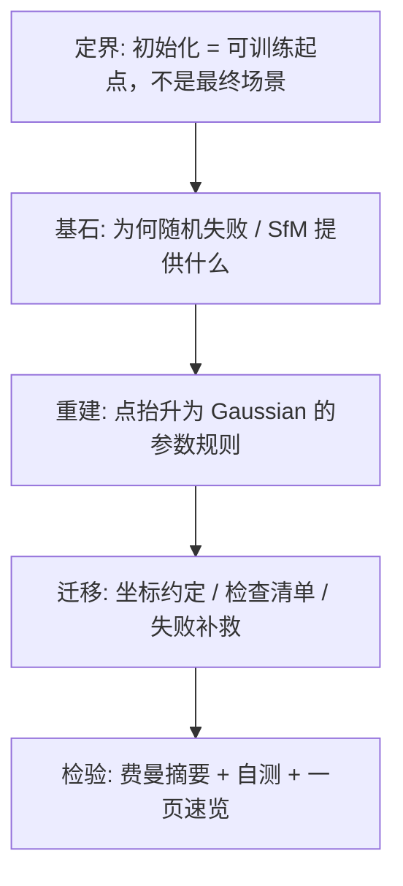
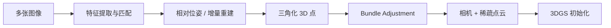

# 第 6 章：第一批高斯从哪来——初始化为什么必须借助 SfM

**本章核心问题**：第 5 章已经解释了什么叫「学对」，也解释了为什么 3DGS 的训练不只是最小化一个 loss，还要动态做 densify / split / prune。

但这整套东西还有一个更前面的前提：

> 在第 0 步，你得先有一批可以开始被优化的高斯。

问题于是变成：

- 第一批高斯的位置从哪来？
- 它们的尺度该多大？
- 为什么不能像普通神经网络那样随机初始化 [random initialization]？
- SfM 点云和高斯之间，到底差了哪一步？

如果第 5 章回答的是「什么叫学对」，这一章回答的就是：

> 训练开始前，怎样给 3DGS 搭起第一层**几何脚手架 [geometric scaffold]**。

### 加餐怎么读：生活类比 + 失败对照

后面每个概念卡 / 大主题都补了两块「加餐」。阅读建议：

1. **先读 Origin / Core idea**（建立基石）  
2. **再读生活类比**（用画面记住，但必须能说回基石）  
3. **最后读失败对照**（知道错会怎样，比只知道对更重要）

技能约束（第一性原理 skill）在这里仍然有效：

> 隐喻可以用，但必须映射回定义与约束；不能只听故事。

一张总导航（类比 → 基石 → 3DGS 症状）：

| 概念 | 一个够用的生活画面 | 基石一句话 | 3DGS 里做错时常见症状 |
|------|-------------------|------------|------------------------|
| init as scaffold | 先搭脚手架，不是一次交成品房 | 送进可训练区间，非最终答案 | 期望 init 完美 → 误判「失败」 |
| why not random | 家具随机扔进虚空再盼误差拖回 | 位置错 → 监督与支撑域错位 | 全黑/噪声、梯度纯噪声 |
| SfM / COLMAP | 多角度拍照先画出场景骨架 | 相机 + 稀疏点 = 冷启动几何 | 无先验乱训 / 位姿错全盘崩 |
| point-to-Gaussian lift | 把图钉变成可喷漆的小云团 | 点零体积 → 补 $\Sigma,\alpha$ | 当点画有洞；参数不全 |
| scale init | 邻居疏密决定第一笔笔触大小 | 尺度与局部几何相称 | 全糊 or 全黑空洞 |
| isotropic start | 先当圆球印章，形状留给训练 | $\Sigma=s^2 I$，少猜方向 | 错误 PCA 先验害训练 |
| alpha init | 半透明玻璃，别一上来实心墙 | 中等 $\alpha_0$，多层能参与 | 前排挡死 / 全透明无信号 |
| coordinate convention | 地图坐标系南北颠倒 | 约定必须与渲染器一致 | 上下颠倒、整体飞出视野 |

---

## 0. 第一性原理路线图：定界 → 基石 → 重建 → 迁移 → 检验



| 步骤 | 本章在问什么 | 你读完应能说清 |
|------|--------------|----------------|
| **定界** | 初始化输出是一批可训 Gaussian，不是最终 mesh | 成功标准是「可训练区间」 |
| **基石** | 随机位置为何失效；SfM/COLMAP 提供相机与稀疏点 | 几何先验从哪来 |
| **重建** | $\mu$/color 继承；scale 启发式；各向同性起点；opacity | 点如何变成高斯 |
| **迁移** | 坐标约定对齐；初始化检查 | 如何避免一上来就训崩 |
| **检验** | 能否自己重讲整条初始化链 | 是否真懂 |

---

## 一、先把「初始化」看成给优化搭脚手架

很多人一想到初始化，会下意识联想到神经网络里的那种场景：

```text
随机初始化参数
-> 前向
-> 算 loss
-> 反向传播
-> 慢慢学出来
```

这在 CNN、MLP 里通常能工作，因为那些随机参数虽然一开始没意义，但它们还只是网络内部的权重——计算图结构是固定的，随机的是系数。

可 3DGS 不一样。

这里你要初始化的，不是某个抽象层里的系数，而是：

| 参数 | 一上来就对应的物理含义 |
|------|------------------------|
| 高斯中心 $\mu$ | 空间里有没有东西、东西在哪 |
| 高斯形状 $\Sigma$ | 局部占多大、朝哪伸 |
| 不透明度 $\alpha$ | 一开始遮多少 |
| 颜色参数 | 一开始看起来什么颜色 |

这些东西一上来就对应着：

> 空间里到底有没有东西，以及东西大致在哪。

所以 3DGS 的初始化，不是「随便给个默认值再等梯度修正」，而是：

> 先给优化器一套至少放得差不多对的空间脚手架。

没有这层脚手架，后面的训练很可能连「从哪开始修」都不知道。

### 1.1 概念卡：Initialization as Scaffold（初始化即脚手架）

| 字段 | 内容 |
|------|------|
| **English name** | Initialization / Geometric Scaffold / Warm Start |
| **中文** | 初始化 / 几何脚手架 / 热启动 [Initialization as Scaffold] |
| **Origin** | 优化理论：非凸问题强依赖起点；三维重建里常用 SfM 作冷启动 |
| **Core idea** | 把系统送进「可训练区间」，而不是一次给出正确答案 |
| **Why not alternatives** | 随机起点在显式 3D 几何上极易不可训；从 mesh/NeRF 初始化更重 |
| **In 3DGS** | 默认从 SfM 稀疏点抬升为第一批 Gaussian |
| **PyTorch example** | `mu = points3d; log_scale = log(s); opacity_logit = logit(alpha0)` |
| **Common confusions** | 初始化好 ≠ 重建完成；脚手架 ≠ 最终表示 |

#### 生活类比（必须映射回基石）

把 **Initialization as Scaffold** 想成「盖楼前先搭脚手架」，不是「交钥匙的成品房」。

| 生活画面 | 对应基石 |
|----------|----------|
| 脚手架让工人够得着墙面 | 把优化送进**可训练区间** |
| 脚手架歪了，后面装修全白干 | 起点不在场景附近 → 梯度无用 |
| 脚手架 ≠ 精装样板间 | init 成功 ≠ 重建完成 |
| 热启动：先有骨架再细修 | warm start / geometric scaffold |

```text
成功标准（务必记住）:
  「还没对，但已经进入可训练区间」
  不是「第一张 render 就 PSNR 30」
```

> 映射回基石：非凸问题强依赖起点。3DGS 初始化输出是一批可训 Gaussian，默认从 SfM 稀疏点抬升——目标是**可训**，不是一次给正确答案。

#### 失败对照：做对 vs 做错

| 场景 | 做对 | 做错时你看到什么 |
|------|------|------------------|
| 验收 init | 有轮廓、非全黑/全白、投影盖住物体 | 要求 init 像最终结果 → 无谓返工 |
| 起点质量 | SfM 点大致在表面附近 | 随机/错坐标 → 训练像撞大运 |
| 后续训练 | 靠 loss + densify 变细 | 以为 init 完事、不训练 → 永远稀疏球 |
| 沟通 | 说「脚手架」 | 说「已经重建好了」→ 产品预期错位 |

```text
症状速记：
  「第一张图糊就说管线坏了」→ 可能只是正常脚手架
  「点云对但怎么训都不动」  → 查坐标约定 / 尺度 / α，再查是否真在可训区间
```

---

## 二、为什么不能像普通神经网络那样随机初始化位置

这是最值得先讲透的一点。

### 2.1 随机权重和随机空间位置，不是一回事

神经网络随机初始化时，虽然每层权重是乱的，但网络至少还在一个固定的计算图里。

而 3DGS 如果把高斯中心随机撒到空间里，等于是在说：

```text
我先随便猜场景在哪
再希望图像误差自己把这些东西拖回正确位置
```

这会马上遇到两个问题。

### 2.2 第一，渲染结果往往和真实图几乎不对齐

如果高斯大多不在真实场景附近，那初始渲染很可能就是：

- 大片空白
- 零散噪声
- 或者一团位置完全不对的模糊色块

这时 loss 当然会很大，但「大」不等于「有用」。

因为你真正需要的不是「哪里都错了」这种粗糙结论，而是：

> 哪个高斯应该往哪边挪，哪个区域缺表达，哪个区域只是还不够细。

如果初始几何完全乱掉，这种梯度信号会变得非常弱，甚至互相冲突——很多高斯的 footprint 根本盖不到真实物体投影区域，梯度几乎是噪声。

### 2.3 第二，3DGS 优化的是空间几何，不只是数值大小

第 5 章说过，3DGS 的训练既在调参数，也在调表示结构。

这意味着训练前期其实非常依赖一个事实：

```text
当前这批高斯至少已经在场景附近
```

只有这样，后续的：

- 位置微调
- 尺度拉伸
- 颜色修正
- clone / split / prune

才是在「修细节」。

如果初始位置是乱的，训练前期就不是在修细节，而是在问：

```text
东西到底应该出现在哪
```

这比普通参数微调难得多，也不稳定得多。

### 2.4 压成一句话

> 神经网络可以随机初始化抽象权重，但 3DGS 很难随机初始化空间几何，因为它优化的是「东西在哪」，不是只有「数值多大」。

### 2.5 概念卡：Why Not Random Init

| 字段 | 内容 |
|------|------|
| **English name** | Random Initialization Failure Modes (for explicit 3D geometry) |
| **中文** | 随机初始化失效模式 |
| **Origin** | 显式场景表示与非凸优化的交汇 |
| **Core idea** | 位置错误会让监督信号与几何支撑域错位 |
| **Why not alternatives** | 同时优化位姿+几何+外观通常更难；无先验的百万参数非凸搜索不可靠 |
| **In 3DGS** | 标准管线几乎总是依赖 SfM 点云冷启动 |
| **PyTorch example** | 对比 `mu ~ N(0,I)` vs `mu = sfm_xyz` 的初始 PSNR 差距 |
| **Common confusions** | 「网络能随机 init」不能推广到「点云也能随机 init」 |

#### 生活类比（必须映射回基石）

把 **random init 在显式 3D 上失败** 想成「把家具随机扔进宇宙虚空，再盼照片误差把它们吸回客厅」。

| 生活画面 | 对应基石 |
|----------|----------|
| MLP 随机权重：厨房图纸还在，只是调料比例乱 | 计算图固定，随机的是系数 |
| 3DGS 随机 $\mu$：连「客厅在哪」都猜错 | 优化的是空间几何位置本身 |
| 喷枪根本喷不到真实物体的投影区域 | footprint 与 GT 支撑域错位 → 梯度≈噪声 |
| 「哪里都错」≠「有用的修正方向」 | loss 大不等于可学 |

```text
网络随机 init:  结构在，系数乱  → 常可训
高斯随机 μ:    东西不在场景里 → 监督打空
```

> 映射回基石：位置错误会让图像监督与 Gaussian 的空间支撑域错位。显式 3D 几何的非凸搜索，没有先验时极不可靠。

#### 失败对照：做对 vs 做错

| 场景 | 做对 | 做错时你看到什么 |
|------|------|------------------|
| 位置 init | $\mu\leftarrow$ SfM 点 | $\mu\sim\mathcal{N}(0,I)$ 乱撒 → 覆盖率≈0 |
| 信号质量 | 初始 render 大致对上轮廓 | 全黑/噪声块，PSNR 地板且不涨 |
| densify | 在场景附近长细节 | 在虚空里 clone → N 涨、图仍空 |
| 类比迁移 | 知道「网络能随机」≠「点也能随机」 | 照搬 He init 心态到 $\mu$ |

```text
症状速记：
  「coverage 极低」→ 随机点盖不住真实结构
  「梯度到处有但图不成形」→ 信号冲突/打空，不是 LR 太小那么简单
```

### 2.6 一个对照实验（思想实验 + 可跑 toy）

```python
import torch
import torch.nn.functional as F

# 假设「真实场景」只在 z=5 附近的一小团
true_mu = torch.tensor([[0.0, 0.0, 5.0],
                        [0.2, -0.1, 5.1],
                        [-0.15, 0.1, 4.9]])

# 随机初始化：中心到处飞
rand_mu = torch.randn(200, 3) * 10.0

# SfM 风格初始化：在真实点附近加小噪声
sfm_mu = true_mu.repeat(20, 1) + 0.05 * torch.randn(60, 3)

def coverage_score(mu, true_mu, thresh=0.5):
    # 有多少个「真实点」附近至少有一个高斯
    d = torch.cdist(true_mu, mu)  # (T, N)
    return (d.min(dim=1).values < thresh).float().mean()

print('random coverage:', float(coverage_score(rand_mu, true_mu)))
print('sfm-like coverage:', float(coverage_score(sfm_mu, true_mu)))
```

你会看到：随机撒点很难「盖住」真实结构，而靠近 SfM 的点云几乎一上来就有覆盖。没有覆盖，就谈不上有效的局部梯度。

---

## 三、第一批可靠先验从哪来：SfM / COLMAP

既然随机位置不行，那就得找一个更可靠的起点。

这个起点通常不是凭空造出来的，而是来自：

```text
SfM / COLMAP 的稀疏重建结果
```

### 3.1 概念卡：SfM / COLMAP

| 字段 | 内容 |
|------|------|
| **English name** | Structure-from-Motion (SfM)；COLMAP is a popular SfM/MVS toolkit |
| **中文** | 运动恢复结构 [Structure-from-Motion]；COLMAP 是常用工具 |
| **Origin** | 多视图几何 [multi-view geometry]：从多张图像估计相机与稀疏 3D 点 |
| **Core idea** | 用特征匹配 + 三角化 + 光束法平差 [bundle adjustment] 得到一致的相机与点 |
| **Why not alternatives** | 纯深度传感器有硬件限制；纯学习 pose 仍常需几何约束 |
| **In 3DGS** | 提供相机外参/内参与稀疏点云，作为 Gaussian 初始化与训练视角 |
| **PyTorch example** | 一般先离线跑 COLMAP，再把结果读成 tensors |
| **Common confusions** | SfM 点云稀疏 ≠ 最终 dense 重建；SfM 不是 3DGS 训练本身 |

#### 生活类比（必须映射回基石）

把 **SfM / COLMAP** 想成「测绘队先用多角度照片钉出场景骨架」，不是「已经给你精模」。

| 生活画面 | 对应基石 |
|----------|----------|
| 多站拍照 → 特征匹配 → 三角定位 | multi-view geometry：位姿 + 3D 点 |
| 骨架点被多视图互相校核过 | bundle adjustment 最小化重投影误差 |
| 骨架稀，但「房子大致在哪」知道了 | 稀疏点云 = 可信冷启动，不是 dense mesh |
| COLMAP 是常用测绘工具箱 | 离线跑完，再读成相机与点 tensor |

```text
SfM 替你回答:
  相机在哪看、内参大概怎样、空间里哪些地方有东西
SfM 不替你回答:
  最终连续表面、最终外观、最终 Gaussian 数量
```

> 映射回基石：SfM 提供多视图一致的相机与稀疏点——3DGS 的几何先验与训练视角来源。点云稀疏 ≠ 失败；它是**场景骨架 [scene skeleton]**。

#### 失败对照：做对 vs 做错

| 场景 | 做对 | 做错时你看到什么 |
|------|------|------------------|
| 输入 | 用收敛的 COLMAP 相机+点 | 跳过 SfM 随机开训 → 极难收敛 |
| 期望 | 接受稀疏，靠后续 densify 补 | 抱怨「点太少=不能训 3DGS」 |
| 位姿 | 检查重投影是否贴 GT | 位姿错 → 全视角监督对不齐，训练整体崩 |
| 弱纹理 | 补拍/补光/接受局部空洞 | 硬训白墙黑洞 → 该处长期糊或洞 |

```text
症状速记：
  「所有视角都不对齐」→ 先查 SfM 位姿，别先调 3DGS LR
  「某块永远没细节」  → 可能 SfM 根本没点，densify 也难无中生有
```

### 3.2 SfM 已经替你回答了一部分最难的问题

多视角几何工具在前面已经做了非常关键的事：

1. 估计了相机位姿 [camera poses / extrinsics]
2. 估计了相机内参 [intrinsics]（或使用标定）
3. 三角化 [triangulation] 出一批 3D 点
4. 让这些点和多张真实图像相互对齐（通过重投影误差最小化）

所以 SfM 点云虽然稀疏，但它不是随机点。

它更像是：

> 被多视图几何验证过的一份**场景骨架 [scene skeleton]**。

这份骨架不等于最终表示，但它已经足够回答一个极重要的问题：

```text
场景大致在哪些地方有东西
```

### 3.3 这就是为什么 3DGS 通常从 SfM 开始，而不是从零开始

如果你已经有：

- 多视图一致的 3D 点
- 和这些点对应的相机参数

那最合理的事情就不是「忘掉它们再随机猜一遍」，而是：

> 把这些稀疏点，抬升成第一批高斯。

这就是 3DGS 初始化最核心的思想。

不是说 SfM 点云本身已经足够好，而是说：

> 它至少能给优化一个可信的冷启动位置。

### 3.4 SfM 流程（极简心智图）



你不需要在本章实现 COLMAP，但必须知道：**你喂给 3DGS 的「第一批几何」通常来自这里。**

---

## 四、但 SfM 点不是高斯

虽然 SfM 给了你一个好起点，但它给你的还不是高斯本身。

这是下一层必须分清的事。

### 4.1 概念卡：Point-to-Gaussian Lift（点抬升为高斯）

| 字段 | 内容 |
|------|------|
| **English name** | Point-to-Gaussian Lifting / Initialization Mapping |
| **中文** | 点到高斯的抬升 [Point-to-Gaussian Lift] |
| **Origin** | 点渲染与 3DGS：零体积点无法直接 splat 出连续图像 |
| **Core idea** | 给每个 SfM 点补上体积（$\Sigma$）、透明度（$\alpha$）与可优化参数化 |
| **Why not alternatives** | 直接当点画会有洞；一开始就估复杂椭球方向又不可靠 |
| **In 3DGS** | $\mu$←点坐标；color←点色；$\Sigma$←各向同性尺度；$\alpha$←中等 |
| **PyTorch example** | 见本章伪代码 |
| **Common confusions** | 「有点云」≠「已有 Gaussian 参数全集」 |

#### 生活类比（必须映射回基石）

把 **Point-to-Gaussian Lift** 想成「把地图上的图钉变成可喷漆的小云团」。

| 生活画面 | 对应基石 |
|----------|----------|
| 图钉：只有位置（+或许颜色） | SfM point ≈ 零体积 $\{x,\mathrm{rgb}\}$ |
| 喷漆云团：有大小、透明度、颜色 | Gaussian $\{\{\mu,\Sigma,\alpha,\mathrm{color}\}$ |
| 只钉图钉就拍照 → 画面全是洞 | 点无法 splat 出连续图像 |
| 抬升 = 给每个点补体积与可优化参数 | lift：继承 $\mu$/色，设计 scale 与 $\alpha$ |

```text
   *  *     *     SfM: 位置针尖
   (@) (@)  (@)   Lift: 可渲染的局部云
```

> 映射回基石：初始化本质不是「复制坐标」，而是把每个点变成初始体积合理、能参与 alpha blending 的小高斯。有点云 ≠ 已有 Gaussian 参数全集。

#### 失败对照：做对 vs 做错

| 场景 | 做对 | 做错时你看到什么 |
|------|------|------------------|
| $\mu$/color | 继承 SfM | 颜色也纯随机 → 前期更难 |
| $\Sigma$/$\alpha$ | 显式初始化 | 忘了 lift，当点画 → 有洞/不可微路径不对 |
| 参数化 | `log_scale`、`opacity_logit`、quaternion | 直接存非法 $\Sigma$ 或 $\alpha\notin(0,1)$ |
| 心理模型 | 「抬升后再训」 | 「有 COLMAP 点=已经是 3DGS」 |

```text
症状速记：
  「点云看着对，render 全是针尖/空洞」→ 没完成 lift 或 scale 过小
  「参数缺字段直接炸」              → Gaussian 状态机不完整
```

### 4.2 SfM 点和高斯表达的不是同一个东西

一个 SfM 点通常更像：

```text
point_i = {x_i, rgb_i, tracks_i, ...}
```

| 字段 | 含义 |
|------|------|
| $x_i$ | 3D 位置 |
| $\mathrm{rgb}_i$ | 颜色 |
| $\mathrm{tracks}_i$ | 在哪些视图的哪些像素被观测到 |

但一个 3D 高斯至少要有：

```text
gaussian_i = {mu_i, Sigma_i, alpha_i, color_i}
```

### 4.3 真正要做的是：把「零体积的点」抬升成「有体积的局部云」

SfM 点本身几乎可以看成零体积对象。

可第 3、4 章已经解释过，3DGS 真正渲染的是：

- 有 3D 体积的高斯
- 投到屏幕后形成 2D 椭圆 footprint
- 再通过 alpha blending 混合成图像

所以初始化的本质不是「复制一下坐标」，而是：

> 把每个点变成一个初始体积合理、能参与连续渲染的小高斯。

你也可以把这一章的任务压成一行：

```text
SfM 点云  ->  第一批可训练的高斯集合
```

```text
   *  *     *        SfM: 只有位置（几乎零体积）
      *
   *     *

   (@) (@)  (@)      Lift: 每个点变成一小团球/椭球
      (@)
   (@)   (@)
```

---

## 五、哪些东西可以直接继承，哪些东西必须补出来

到这里，最自然的问题就是：

```text
高斯的四类参数里，哪些可以直接从 SfM 拿？
哪些必须额外设计？
```

### 5.1 位置最直接：$\mu = x_{\mathrm{sfm}}$

如果 SfM 已经给出 3D 点位置 $x_i$，那高斯中心最自然的初始化就是：

$$
\boldsymbol{\mu}_i = x_i^{\mathrm{sfm}}
$$

因为中心位置本来就是 SfM 最擅长提供的东西。

### 5.2 颜色通常也能直接继承

如果 SfM 点带有颜色信息，那最常见的做法就是：

```text
color_i = rgb_i / 255
```

把颜色归一化到 $[0,1]$。

如果后续实现里颜色不是直接存 RGB，而是：

- SH 系数 [Spherical Harmonics]
- 颜色 logits
- 或者其他参数化

那也只是再做一层参数变换而已。例如：

```text
sh_i[0]  = rgb 对应的直流项
sh_i[1:] = 0     # 高阶视角项先不猜
```

初始化这一步真正想表达的仍然是：

> 先把点的外观先验带进来，而不是让颜色也从纯随机开始。

### 5.3 高层语义到内部存储的映射表

真实实现里，初始化常常要再多走半步，把 SfM 输出映到内部参数化里：

| 高层几何语义 | 常见内部存储 | 初始化直觉 |
|--------------|--------------|------------|
| $\mu_i$ | `xyz` | 直接继承 SfM 点坐标 |
| $\mathrm{color}_i$ | `sh_i` 或 RGB | SH 直流项用点颜色，高阶项先 0 |
| $\Sigma_i$ | `scale_i + rotation_i` | `scale=\log s`；旋转先单位四元数 |
| $\alpha_i$ | `opacity_logit` | 由中等 $\alpha_0$ 反推 logit |

例如：

```text
scale_i = log([s_i, s_i, s_i])
rotation_i = identity_quaternion
opacity_logit_i = log(alpha0 / (1 - alpha0))
sh_i[0] = rgb_i / 255   # 或经 SH 基转换
sh_i[1:] = 0
```

这一步很容易被误以为只是「工程实现细节」，但它其实会直接影响：

- 初始梯度尺度是否稳定
- $\Sigma$ 是否天然保持正定
- $\alpha$ 会不会一上来就撞到 0 或 1 的边界

所以更准确地说，初始化不是只决定「放哪」，也在决定：

> 这些高斯进入优化器时，是不是处在一个容易被继续训练的参数化坐标里。

### 5.4 真正难的是尺度和形状

位置和颜色都很好理解。难点几乎都集中在这里：

```text
Sigma 应该怎么来？
```

因为这件事决定的是：

- 一个点刚开始要覆盖多大空间
- 初始渲染是稀疏发黑，还是过度模糊
- 后续梯度是在修形状，还是在忙着救火

---

## 六、真正难的是尺度：点要怎样变成「有体积的东西」

### 6.1 概念卡：Scale Initialization（尺度初始化）

| 字段 | 内容 |
|------|------|
| **English name** | Scale Initialization / Initial Spatial Support |
| **中文** | 尺度初始化 / 初始空间支持域 |
| **Origin** | 点抬升为有体积 primitive 时必须补尺度；启发式来自邻域或重投影误差 |
| **Core idea** | 初始尺度要和局部几何相称：别小到看不见，也别大到糊死 |
| **Why not alternatives** | 全局固定尺度无法适应近远与疏密差异 |
| **In 3DGS** | 常用近邻距离或相关启发式；先各向同性 |
| **PyTorch example** | `s_i = beta * mean_kNN_distance(i)` |
| **Common confusions** | 像素误差 ≠ 世界尺度；必须用深度/焦距换算 |

#### 生活类比（必须映射回基石）

把 **scale initialization** 想成「第一笔笔触多大：看邻居有多密，也看你有多不确定」。

| 生活画面 | 对应基石 |
|----------|----------|
| 点很密的地方 → 细笔 | $s_i \sim \beta\cdot\mathrm{kNN\_dist}$：密→小 |
| 点很稀的地方 → 先用大笔盖住空隙 | 稀→需要更大支持域 |
| 三角化不稳 → 允许稍大信任圆 | 重投影误差大 → 不宜极小高斯 |
| 全局同一支笔 | 固定尺度：近处糊、远处空，无法适应 |

```text
过大: 重叠糊成一片，细节被抹
过小: 稀疏发黑/有洞，很多像素没人负责
目标: 可修的粗图，不是「一次精确」也不是「没法修」
```

> 映射回基石：初始尺度编码局部支持域与几何不确定性。像素误差 ≠ 世界尺度，常用 $e\cdot Z/f$ 换算。记住思想：与局部几何相称。

#### 失败对照：做对 vs 做错

| 场景 | 做对 | 做错时你看到什么 |
|------|------|------------------|
| 启发式 | kNN 或重投影（注意单位） | 全局固定 $s$ → 有的糊有的看不见 |
| 过小 | `clamp_min`、检查分位数 | 初始全黑/空洞，梯度弱 |
| 过大 | 降 $\beta$、看 scale 直方图 | 一张糊图，后期难抠细节 |
| 单位 | 像素误差 × 深度/焦距 | 把像素当米用 → 尺度差几个数量级 |

```text
症状速记：
  「scale min≈0，render 空」→ 尺度过小
  「一张大奶油糊」        → 尺度过大或 β 太大
```

### 6.2 为什么不能所有点都用同一个固定尺度

最先想到的做法通常是：

```text
每个点都给同样大的球
```

这听起来简单，但很快会出问题。

| 尺度过大 | 尺度过小 |
|----------|----------|
| 高斯过度重叠 | 初始图像非常稀疏 |
| 整张图一开始糊成一片 | 很多像素没人负责 |
| 细节被大 footprint 抹掉 | 渲染接近全黑或满是空洞 |

也就是说，尺度并不是一个无关紧要的默认值。它决定的是：

> 初始化给优化器的是「可修的粗图」，还是「一团根本没法修的东西」。

### 6.3 初始尺度本质上在编码两件事

一个比较好的初始尺度，通常同时在表达：

1. 这个点附近应该有多大局部支持域
2. 这个点当前几何有多不确定

如果某个点的几何很可靠，你就希望它从一个更小、更准的高斯开始。  
如果某个点本来就不太稳，你就允许它先用一个稍大的 footprint 去覆盖不确定性。

所以尺度并不是「随便给一个半径」，而更像：

> 给每个点分配一个合理的初始信任范围。

### 6.4 启发式一：近邻距离 [nearest-neighbor distance]

原版 3DGS 思路里非常重要的一类信号是：看这个点离它的邻居有多远。

直觉：

```text
点很密的地方 -> 局部结构可能更细 -> 初始球可以小一点
点很稀的地方 -> 需要更大支持域先盖住空隙
```

一个极简写法：

$$
s_i = \beta \cdot \mathrm{mean}\big(\mathrm{kNN\_dist}(x_i)\big)
$$

或用到最近邻距离的中位数等稳健统计。

```python
import torch

def knn_scale(points: torch.Tensor, k: int = 3, beta: float = 1.0):
    """
    points: (N, 3)
    用到 k 个近邻的平均距离作为尺度（不含自身）。
    """
    # 两两距离
    d = torch.cdist(points, points)  # (N, N)
    d.fill_diagonal_(float('inf'))
    knn_vals, _ = torch.topk(d, k=k, largest=False, dim=1)
    s = beta * knn_vals.mean(dim=1)
    return s
```

### 6.5 启发式二：重投影误差 [reprojection error]

SfM 点通常带着观测历史。于是可以算：

$$
e_{ij} = \big\| \pi(P_i;\,\mathrm{cam}_j) - p_{ij}^{\mathrm{obs}} \big\|
$$

这个误差越大，通常说明该点三角化越不稳，更不该一上来就设成极小高斯。

### 6.6 但像素误差和世界尺度不是同一个单位

重投影误差是像素单位，高斯尺度最终要落在 3D 世界坐标里。

透视投影里粗略有：

$$
x = f_x \cdot \frac{X}{Z}
\quad\Rightarrow\quad
\Delta X \approx \Delta x \cdot \frac{Z}{f_x}
$$

所以同样是 1 个像素误差，离相机近的点和离相机远的点，对应的 3D 不确定性并不一样。

一个更自然的写法是：

$$
s_{ij} \approx e_{ij}\cdot \frac{z_{ij}}{f_j},
\qquad
s_i = \beta \cdot \mathrm{median}_j(s_{ij})
$$

用中位数而不是均值，是因为坏匹配/离群观测存在时更稳。

### 6.7 常见启发式对照表

| 启发式 | 形式 | 优点 | 风险 |
|--------|------|------|------|
| 重投影误差 | $s_i\sim\mathrm{median}_j(e_{ij}z_{ij}/f_j)$ | 与多视图一致性相关 | 对异常匹配敏感 |
| 近邻距离 | $s_i\sim\beta\cdot\mathrm{nn\_dist}$ | 不依赖完整 track | 点云太稀时会过大 |
| 观测数修正 | $s_i\sim \mathrm{base}/\sqrt{n_{\mathrm{obs}}}$ | 观测多更保守 | 单独使用太粗糙 |
| 混合策略 | combine(error, nn, n_obs) | 更灵活 | 超参数更多 |

### 6.8 真正该记住的不是某一个公式，而是这个思想

> 初始尺度必须和场景局部几何相称，不能小到几乎不可见，也不能大到一开始就把细节糊掉。

只要你抓住这条主线，具体启发式就容易自己判断了。

---

## 七、为什么起点通常先用各向同性，而不是一开始就猜椭球朝向

到这里你可能会继续问：

```text
既然高斯最终是各向异性的椭球
那为什么初始化不直接给它一个方向和三个轴长？
```

答案是：

> 因为训练开始前，你通常并没有足够可靠的信息去猜这件事。

### 7.1 概念卡：Isotropic Start（各向同性起点）

| 字段 | 内容 |
|------|------|
| **English name** | Isotropic Initialization |
| **中文** | 各向同性初始化 [Isotropic Start] |
| **Origin** | 在信息不足时用最少假设起步；把各向异性留给优化 |
| **Core idea** | $\Sigma_i = s_i^2 I$，先当球，再让梯度拉成椭球 |
| **Why not alternatives** | 从稀疏点 PCA 估法线/主轴噪声大，错误先验会害训练 |
| **In 3DGS** | 常见默认：三轴相同 scale + 单位旋转 |
| **PyTorch example** | `log_scale = log(s).expand(3); q = [1,0,0,0]` |
| **Common confusions** | 各向同性起点 ≠ 最终保持各向同性 |

#### 生活类比（必须映射回基石）

把 **isotropic start** 想成「第一天先发圆印章，别假装你已知道每面墙的法线」。

| 生活画面 | 对应基石 |
|----------|----------|
| 信息不够时用最少假设 | $\Sigma_i=s_i^2 I$（球） |
| 乱猜椭圆朝向 = 用错的模具开工 | 稀疏点 PCA/法线噪声大，错误先验害训练 |
| 训练中把球拉成贴面的扁椭球 | 各向异性交给梯度，不是 init 硬猜 |
| 三轴同 scale + 单位四元数 | 实现默认：`log_s` 扩成 3 维，`q=[1,0,0,0]` |

```text
聪明但脆: 初始化就各向异性 + 法线猜测
保守但稳: 先球，尺度合理，形状后学
3DGS 选后者，是因为它本来就擅长连续改形状
```

> 映射回基石：各向同性起点 ≠ 最终保持各向同性。少猜 = 把不必要自由度推迟到有监督信号的时候。

#### 失败对照：做对 vs 做错

| 场景 | 做对 | 做错时你看到什么 |
|------|------|------------------|
| 默认 init | 各向同性球 | 错误主轴先验 → 训练先「纠正谎言」 |
| 后期形状 | 靠优化变扁/拉长 | 抱怨「一直是球」却没给足够步数/信号 |
| 调试 | 看 scale 三轴是否逐渐分化 | 把「init 是球」当成「模型不会各向异性」 |
| 邻域 PCA | 仅作实验，接受噪声 | 当真理写进主路径 → 弱纹理处乱定向 |

```text
症状速记：
  「init 方向全错，前 1k step 在拧姿态」→ 不该在 init 猜方向
  「永远圆乎乎」→ 查是否锁死了各向同性，或 LR/训练不够
```

### 7.2 一开始最缺的不是「更聪明」，而是「别乱猜」

如果你想直接初始化各向异性高斯，你通常需要知道：

- 局部表面法线 [normal]
- 主方向 [principal directions]
- 沿切平面和法线方向的大致尺度

可 SfM 稀疏点云往往没有直接给这些量。你当然可以额外估：

- 从近邻拟合法线
- 做 PCA 猜主方向
- 再人为设置长短轴比例

但这等于在初始化阶段额外引入一大堆近邻超参数、噪声放大、错误几何假设。起点看起来更聪明，但未必更稳。

### 7.3 各向同性的真正价值，是把不必要的猜测推迟给训练

所以一个特别常见的起点是：

$$
\boldsymbol{\Sigma}_i = s_i^2 I
$$

也就是先给每个点一个球形高斯。

好处：

- 不需要预先猜法线
- 不需要预先猜主轴方向
- 只要尺度合理，就已经能形成连续 footprint
- 后续训练会自己把它拉成更合适的椭球

这和第 3 章的主线一致：高斯厉害的地方，本来就是容易在优化中被连续拉伸、旋转、细化。

既然如此，初始化阶段最稳的策略往往不是「把一切都猜出来」，而是：

> 先给一个保守但可训练的球，再让梯度自己学出形状。

---

## 八、为什么不透明度也不能一上来就太极端

初始化除了位置和尺度，还有一个常被忽略但很关键的量：$\alpha$。

### 8.1 如果一开始太不透明

如果很多初始高斯都接近完全不透明，前排少数高斯会很快吃掉透射率 [transmittance]：

- 后面的高斯很难参与解释图像
- 梯度容易集中在前面几层
- 训练前期混合会变得很僵

### 8.2 如果一开始太透明

如果 $\alpha$ 太接近 0：

- 初始图像几乎什么都没有
- loss 虽然大，但有效监督弱
- 训练很像在一堆「看不见的高斯」上硬拉梯度

### 8.3 所以常见选择是中等透明度起点

工程上常见策略是让初始高斯保持：

```text
既能被看见
又不会一下子把后面的东西全挡死
```

例如中等透明度 $\alpha_0$，并映射到 opacity logit：

$$
o = \log\frac{\alpha_0}{1-\alpha_0}
$$

你应该记住的不是某个神奇常数，而是这个直觉：

> 初始化时的 $\alpha$ 不是为了「一开始就真实」，而是为了让多层高斯能同时参与早期解释和后续优化。

#### 生活类比（必须映射回基石）

把 **alpha initialization** 想成「半透明玻璃隔断，不是实心墙，也不是空气」。

| 生活画面 | 对应基石 |
|----------|----------|
| 一上来全是实心墙 | $\alpha\to 1$：前排吃光透射率 [transmittance]，后排难参与 |
| 一上来全是空气 | $\alpha\to 0$：看不见，有效监督弱 |
| 半透明：看得见，也不完全挡后排 | 中等 $\alpha_0$，映射 $o=\log\frac{\alpha_0}{1-\alpha_0}$ |
| 目的不是「一开始就真实遮挡」 | 让多层同时进入早期解释与优化 |

```text
太实 → 混合僵、梯度集中前排
太透 → 图空、像在对隐形物体求导
中等 → 可训的混合起点
```

> 映射回基石：$\alpha$ 初始化是为了**可优化的多层参与**，不是为了物理正确的第一帧。内部常用 opacity logit 存。

#### 失败对照：做对 vs 做错

| 场景 | 做对 | 做错时你看到什么 |
|------|------|------------------|
| 取值 | 中等 $\alpha_0$（实现相关，常非极端） | 全 0.99 → 发白/挡死；全 0.001 → 全黑 |
| 存储 | logit 反推 | 直接存 α 又硬 clamp → 边界怪 |
| 检查 | 看 $\alpha$ 均值与分位数 | 只看颜色，不看透明度分布 |
| 训练初期 | 允许 α 再学 | 把「不够实」当 bug 猛加 α |

```text
症状速记：
  「前排糊墙，后面学不动」→ α 初始化过高
  「有点但 render 像没点」→ α 过低或 scale 过小（两者常一起查）
```

---

## 九、还有一个隐藏前提：坐标约定必须先对齐

到这里还有一个特别容易把人坑住的问题：

```text
SfM 输出的坐标约定
和你的渲染器使用的坐标约定
不一定是同一套
```

这件事如果没处理好，后果通常非常直接：

- 图像上下颠倒
- 左右镜像
- 整个场景偏到视野外
- 明明点云是对的，渲染却完全不对

### 9.1 概念卡：Coordinate Conventions（坐标约定）

| 字段 | 内容 |
|------|------|
| **English name** | Coordinate Conventions / Camera Frame Conventions |
| **中文** | 坐标约定 / 相机坐标系约定 |
| **Origin** | 计算机视觉、计算机图形学、机器人学历史上采用了不同轴约定 |
| **Core idea** | 同一物理场景，不同系统用不同的轴方向与外参方向定义 |
| **Why not alternatives** | 「没有统一世界标准」；只能在自己的管线内强制一致 |
| **In 3DGS** | 加载 COLMAP 后常需对齐到渲染器约定，否则投影全错 |
| **PyTorch example** | `R' = R @ diag(1,-1,-1)` 一类翻转（视具体约定而定） |
| **Common confusions** | world-to-camera vs camera-to-world；OpenCV vs OpenGL 的 Y/Z 方向 |

#### 生活类比（必须映射回基石）

把 **coordinate conventions** 想成「两张地图：一张 Y 朝上，一张 Z 朝上——数字对，方向约定错就整城翻面」。

| 生活画面 | 对应基石 |
|----------|----------|
| 南北颠倒的导航 | +Y up vs +Z up；相机 -Z / +Z forward |
| 照片上下颠倒 | 图像 $y$ 轴向上/向下 |
| 同一条路写「从家到公司」vs「从公司到家」 | world-to-camera vs camera-to-world |
| 验收：把点投回照片，看是否盖住物体 | 投影叠 GT，不以「矩阵看起来眼熟」为准 |

```text
原则不是背某一个 diag(1,-1,-1)：
  而是「数据加载后的坐标系 = 渲染公式用的坐标系」
转完必须以投影是否对齐为真理
```

> 映射回基石：同一物理场景，CV/CG 历史约定不同。3DGS 管线内必须强制一致，否则几何先验在渲染器里等于错的。

#### 失败对照：做对 vs 做错

| 场景 | 做对 | 做错时你看到什么 |
|------|------|------------------|
| 加载 COLMAP | 显式对齐到渲染约定 | 点云对、render 飞出画面/镜像 |
| 排查顺序 | 先投影检查，再调 LR | 狂调学习率/ densify，坐标错一直在 |
| 外参方向 | 分清 w2c / c2w | 用反 → 场景躺倒或跑到相机后 |
| 文档 | 写明本仓库轴约定 | 复制别人翻转矩阵当宇宙真理 → 有时对有时错 |

```text
症状速记：
  「点云看着对，渲染上下颠倒」→ 坐标约定，不是 loss
  「整体偏出视野」            → 外参方向或轴翻转
  「先查投影，再谈训练」      → 铁律
```

### 9.2 真正该记住的不是某个固定翻转矩阵，而是「约定一致」

不同系统常见的差别包括：

| 差异点 | 可能选项 |
|--------|----------|
| 哪个轴朝上 | +Y up / +Z up |
| 相机朝向 | -Z forward / +Z forward |
| 图像 $y$ 轴 | 向上 / 向下 |
| 外参方向 | world-to-camera / camera-to-world |

最重要的原则不是背一个神秘公式，而是：

> 你后续渲染公式使用的坐标系，必须和数据加载后的相机/点云坐标系严格一致。

### 9.3 示例：一种常见的 Y/Z 翻转（仅作「约定转换」示范）

如果某教程的数据读取约定和后续渲染约定之间需要做 Y/Z 翻转，一个常见写法会是：

```python
import torch

def align_colmap_to_tutorial(R_colmap, t_colmap):
    """
    注意：这个矩阵不是宇宙真理，只是「某两套约定之间」的一种对齐示例。
    转完后必须以「投影是否与 GT 对齐」为验收标准。
    """
    transform = torch.diag(torch.tensor([1.0, -1.0, -1.0]))
    R_tutorial = R_colmap @ transform
    t_tutorial = transform @ t_colmap
    return R_tutorial, t_tutorial
```

这里真正重要的不是这个矩阵本身永远正确，而是：

- 你知道自己在把哪套约定转换成哪套约定
- 转完之后，点云投影和真实图像能重新对上

也就是说，这一步本质上是在做：

> 把「几何先验是对的」变成「它在我的渲染器里也是对的」。

### 9.4 验收坐标约定的最快方法

1. 取一个训练视角
2. 把所有初始化 $\mu$ 用该相机投影到像素
3. 叠在 GT 图像上看：是否覆盖物体区域

如果点整体跑出画面或上下颠倒，先查坐标约定，别先调学习率。

---

## 十、把整个初始化流程串起来

### 10.1 输入是什么

- SfM 稀疏点云
- 每个点的颜色与观测 track（若有）
- 相机内外参与图像

### 10.2 输出是什么

```text
一批能直接送进渲染器和优化器的初始高斯
```

### 10.3 一条最小初始化伪代码

```python
import torch
import math

def logit(a, eps=1e-6):
    a = min(max(a, eps), 1 - eps)
    return math.log(a / (1 - a))


def init_from_sfm(points_xyz, points_rgb, alpha0=0.5, beta=1.0, knn_k=3):
    """
    points_xyz: (N, 3) float tensor
    points_rgb: (N, 3) in 0..255 or 0..1
    """
    align_camera_convention_if_needed()  # 伪步骤：保证相机/点同一约定

    N = points_xyz.shape[0]
    mu = points_xyz.clone()

    rgb = points_rgb.float()
    if rgb.max() > 1.5:
        rgb = rgb / 255.0

    # 近邻尺度
    d = torch.cdist(mu, mu)
    d.fill_diagonal_(float('inf'))
    knn, _ = torch.topk(d, k=knn_k, largest=False, dim=1)
    s = (beta * knn.mean(dim=1)).clamp_min(1e-4)  # (N,)

    log_scale = torch.log(s).unsqueeze(1).repeat(1, 3)  # isotropic
    rotation = torch.zeros(N, 4)
    rotation[:, 0] = 1.0  # identity quaternion (w,x,y,z)

    opacity_logit = torch.full((N, 1), logit(alpha0))

    # SH DC 简化：直接存 rgb 作为外观起点（真实实现按 SH 基转换）
    sh_dc = rgb.clone()
    sh_rest = torch.zeros(N, 0)  # 占位

    gaussians = {
        'mu': mu,
        'log_scale': log_scale,
        'rotation': rotation,
        'opacity_logit': opacity_logit,
        'sh_dc': sh_dc,
        'sh_rest': sh_rest,
    }
    return gaussians
```

如果实现内部存的是：

- SH 系数而不是 RGB
- opacity logit 而不是直接 $\alpha$
- scale + rotation 而不是直接 $\Sigma$

那也只是参数化不同。初始化主线并没有变：

```text
先用 SfM 决定「放在哪」
再用局部尺度启发式决定「先放多大」
再用保守参数化让训练继续把它学细
```

### 10.4 还要记住：这不是最终场景，只是第一层几何脚手架

初始化做完后，你拿到的并不是：

- 最终高质量表示
- 完整连续表面
- 已经收敛的场景

你拿到的只是：

> 一套能让第 5 章那套优化真正开始工作的起点。

后面真正把它变好的，仍然是：

- 可微渲染提供的梯度
- 图像重建损失
- densify / split / prune
- 学习率调度和长期训练

所以第 6 章和第 5 章其实是一条连续主线：

```text
第 5 章说的是：怎么学
第 6 章说的是：从哪开始学
```

---

## 十一、怎么判断初始化没有把训练直接送进坑里

初始化不需要完美，但至少得满足「可工作」。

### 11.1 检查一：看第一张初始渲染

你真正想看到的不是「已经很清晰」，而是：

- 不是全黑
- 不是全白
- 有大致轮廓
- 颜色基本在合理区域

如果初始渲染已经完全失控，问题通常出在：坐标约定、尺度离谱、$\alpha$ 太极端、相机投影链没对齐。

### 11.2 检查二：看投影中心分布

把所有高斯中心投到某个训练视图里，你应该能看到：

- 点大致覆盖真实物体区域
- 不应该全挤在某个角落
- 也不应该整体偏出图像

这一步对排查坐标系问题特别直接。

### 11.3 检查三：看尺度统计

至少要看：

- 有没有大量极小值，导致几乎不可见
- 有没有大量极大值，导致一开始就糊死
- 尺度分布是否大致落在场景合理范围内

### 11.4 检查四：看透明度是否把系统推向两个极端

初始 $\alpha$ 太大，前排会过早吃掉透射率；太小，整张图接近空白。最好至少看一眼 $\alpha$ 的均值和分位数。

### 11.5 成功标准一句话

> 还没对，但已经进入了可训练区间。

### 11.6 一个最小可运行检查脚本

```python
import numpy as np
import matplotlib.pyplot as plt

W, H = 800, 600
# 假设这些来自初始化后的结果（示例随机）
mu_2d = np.random.normal(loc=[W * 0.5, H * 0.5], scale=[120, 90], size=(2000, 2))
scales = np.exp(np.random.normal(loc=-1.2, scale=0.4, size=2000))

inside = (
    (mu_2d[:, 0] >= 0) & (mu_2d[:, 0] < W) &
    (mu_2d[:, 1] >= 0) & (mu_2d[:, 1] < H)
)

print('projection coverage ratio =', inside.mean())
print('scale min/median/max =', np.min(scales), np.median(scales), np.max(scales))

fig, axes = plt.subplots(1, 2, figsize=(10, 4.2))
axes[0].scatter(mu_2d[:, 0], mu_2d[:, 1], s=3, alpha=0.35)
axes[0].set_xlim(0, W)
axes[0].set_ylim(H, 0)
axes[0].set_title('projected gaussian centers')
axes[0].set_xlabel('u')
axes[0].set_ylabel('v')

axes[1].hist(scales, bins=40, color='tab:blue', alpha=0.8)
axes[1].set_title('initial scale distribution')
axes[1].set_xlabel('scale')
axes[1].set_ylabel('count')
plt.tight_layout()
plt.show()
```

你应该观察到：

- 如果大部分点都落在图像外，往往是坐标约定或相机链有问题
- 如果尺度分布特别偏向极小值，初始渲染容易全黑或空洞
- 如果尺度分布拖着极长大尾巴，初始图像容易被糊成一片

---

## 十二、SfM 失败与补救：哪些洞会一直传到 3DGS

### 12.1 SfM 常见失败原因

| 原因 | 现象 |
|------|------|
| 弱纹理（白墙） | 特征点极少，空洞 |
| 反光/透明 | 三角化错误 |
| 运动模糊 | 匹配失败 |
| 重复纹理 | 误匹配，点漂 |

### 12.2 对 3DGS 的具体影响

- 某区域完全没有初始点 → 该处只能靠远处高斯硬拉或后期 densify，难度大
- 相机位姿错 → 所有监督都会对不齐，训练可能整体崩
- 尺度全局漂 → 学习率与 densify 阈值全部「刻度」失真

### 12.3 补救策略（工程菜单）

- 补拍更多视角 / 更干净曝光
- 检查 COLMAP 是否收敛、是否剔除坏图
- 对关键平面做人工或半自动补点（高级）
- 接受：3DGS 能部分修正中等误差，但修不了「完全没观测」的黑洞

---

## 十三、费曼摘要

1. **3DGS 不能像 MLP 那样随机初始化位置**——它优化的是空间里「东西在哪」。
2. **SfM/COLMAP** 先给出相机和稀疏点，这是可信的几何骨架。
3. **点不是高斯**：要 lift——补 $\Sigma$、$\alpha$、可优化参数化。
4. **$\mu$ 和颜色可继承**；**尺度必须设计**（近邻/重投影等），要不大不小。
5. **先各向同性球**，别急着猜椭球朝向；形状交给训练。
6. **$\alpha$ 取中等**，让多层都能参与早期学习。
7. **坐标约定必须对齐**，否则点对、渲染也对不上。
8. 初始化成功标准：**进入可训练区间**，不是一次做对。

---

## 十四、自测详解

### Q1：为什么 SfM/COLMAP 是 3DGS 初始化的起点？

如果跳过直接随机初始化会发生什么？

<details>
<summary>答案</summary>

SfM 提供一致的相机与稀疏 3D 点，回答「场景大致在哪」。  
随机初始化使高斯支撑域与真实投影错位，loss 大但梯度噪声强，优化极不稳定。  
3DGS 哲学：先解决「从哪来」，再解决「怎么学」。
</details>

### Q2：点抬升为高斯时，哪些继承、哪些必须造？

<details>
<summary>答案</summary>

继承：$\mu$、颜色（或 SH 直流）。  
必须造：$\Sigma$（常由尺度启发式 + 各向同性）、$\alpha$（中等 + logit）、旋转（单位）、以及内部参数化（log-scale 等）。
</details>

### Q3：为什么初始尺度不能全局固定？

<details>
<summary>答案</summary>

场景有近有远、有疏有密。固定太小→空洞；固定太大→全糊。尺度应与局部邻域或观测不确定性相称。
</details>

### Q4：为什么通常 isotropic start？

<details>
<summary>答案</summary>

稀疏点缺乏可靠法线/主轴；错误各向异性先验有害。球是最小假设，形状由后续优化学习。
</details>

### Q5：坐标约定错了，最先出现什么症状？你怎么查？

<details>
<summary>答案</summary>

上下颠倒、整体出画、点云看似对但渲染空。  
查法：投影 $\mu$ 叠 GT；核对 w2c/c2w 与轴方向；用已知棋盘或明显物体做目视对齐。
</details>

---

## 十五、一页速览

```text
【第 6 章一页纸】

目标: 搭可训练的第一批 Gaussian（脚手架，不是终局）

为什么不能随机:
  优化的是空间几何位置，不是抽象权重
  随机 -> 支撑域与监督错位 -> 梯度噪声

起点: SfM / COLMAP
  相机内外参 + 稀疏点云（场景骨架）

点 -> 高斯:
  mu     <- 点坐标
  color  <- 点颜色 / SH DC
  scale  <- 近邻距离或重投影误差启发式
  Sigma  <- s^2 I  (isotropic start)
  alpha  <- 中等透明度 (logit 参数化)
  rot    <- identity

关键坑:
  坐标约定必须对齐
  尺度太大/太小都会让训练进坑

验收:
  初始渲染有轮廓、非全黑全白
  投影中心覆盖物体
  scale / alpha 分布合理

记一句:
「SfM 给骨架，抬升成球，尺度要贴地，约定要对齐。」
```

---

## 十六、本章你真正应该能自己重建的几个问题

1. 为什么神经网络可以随机初始化，而 3DGS 很难随机初始化位置？
2. SfM/COLMAP 到底给了 3DGS 什么，又没给什么？
3. 为什么「有点云」还不等于「有高斯」？
4. $\mu$、颜色、尺度、$\Sigma$、$\alpha$ 分别怎么初始化？
5. 为什么常用各向同性起点？
6. 像素重投影误差怎样（概念上）换成世界尺度？
7. 坐标约定错误会怎样，如何快速验收？
8. 初始化成功的标准为什么是「可训练」而不是「已正确」？

如果这些问题你能自己从头推回来，这一章就真的进脑子了。

---

## 十七、下一章接什么

现在你已经知道：

- 第一批 Gaussian 从哪来
- 为什么要借助 SfM
- 点如何抬升成可训练高斯

但有了脚手架之后，真正的问题才开始：

```text
这些还很粗糙的高斯
怎样在一轮又一轮训练里收敛成高质量场景？
```

下一章 [chapter_07_training_loop.md](chapter_07_training_loop.md) 会把：

```text
采样视角 -> 渲染 -> loss -> 反向 -> 更新
+ 周期性 densify/split/prune
+ 学习率调度
+ 监控与失败模式
```

串成一条真正可运行、可诊断的训练闭环。
