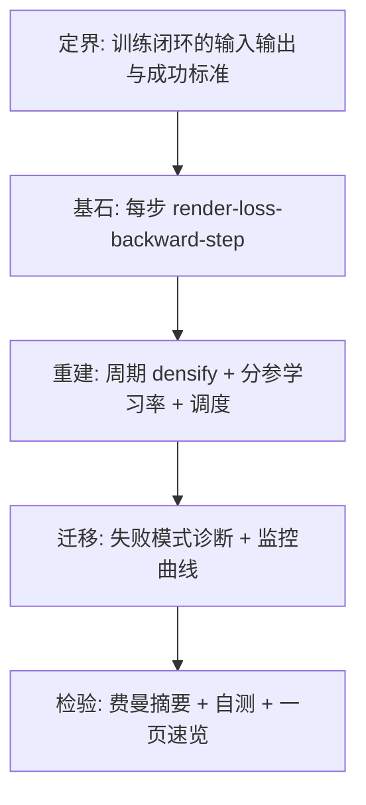
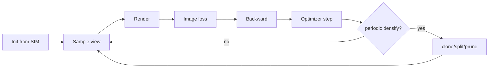
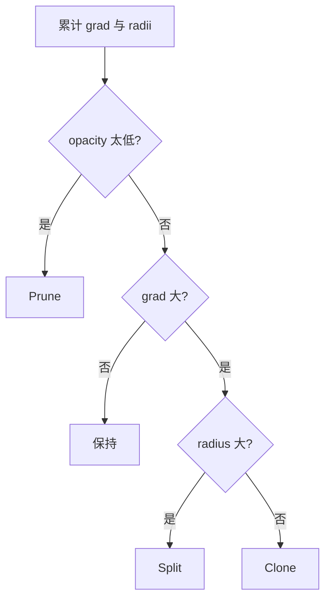

# 第 7 章：训练闭环——从第一批高斯到收敛场景，中间到底发生了什么

**本章核心问题**：第 6 章已经解释了第一批 Gaussian 从哪来。现在问题变成：

> 这些还很粗糙的 Gaussian，怎样在一轮又一轮训练里，慢慢学成正确的位置、形状、透明度和外观？又为什么 3DGS 的训练不只是「反向传播 + Adam」这么简单？

如果前面几章已经分别回答了：

| 章节 | 回答的问题 |
|------|------------|
| 第 3 章 | 为什么 primitive 选 Gaussian |
| 第 4 章 | 这些 Gaussian 怎样被渲染成图 |
| 第 5 章 | 什么叫「学对」，loss 为什么这样设计 |
| 第 6 章 | 第一批 Gaussian 从哪来 |

那么这一章要回答的就是：

```text
这些东西怎样真正被接成一条可运行、可诊断、可收敛的训练闭环 [training loop]
```

先把主线写在前面：

```text
初始化给你的是脚手架
渲染给你的是预测图
图像误差给你的是修正方向
optimizer 负责连续调参
periodic densify / split / prune 负责重分配表示容量
日志和可视化负责告诉你：系统是在收敛，还是已经开始出事
```

这就是 3DGS 训练循环最短的工程主线。

### 加餐怎么读：生活类比 + 失败对照

后面每个概念卡 / 大主题都补了两块「加餐」。阅读建议：

1. **先读 Origin / Core idea**（建立基石）  
2. **再读生活类比**（用画面记住，但必须能说回基石）  
3. **最后读失败对照**（知道错会怎样，比只知道对更重要）

技能约束（第一性原理 skill）在这里仍然有效：

> 隐喻可以用，但必须映射回定义与约束；不能只听故事。

一张总导航（类比 → 基石 → 3DGS 症状）：

| 概念 | 一个够用的生活画面 | 基石一句话 | 3DGS 里做错时常见症状 |
|------|-------------------|------------|------------------------|
| training loop | 每日巡检：看→比→改→周期扩编 | 连续更新 + 周期结构编辑闭环 | 只 Adam 不 densify / 盲飞无日志 |
| per-param LR | 方向盘与音量用不同灵敏度 | 不同参数量纲不同步长 | 一类飞掉拖垮全体 |
| densify signals | 「总画不对」+「刷子铺太开」 | 累计梯度 + 2D footprint | 误触发 clone/split |
| clone/split/prune 时机 | 周会做人事，不每画一笔改编制 | 周期决策，打断 Adam 要重建 | 每步 densify 抖；N 炸 |
| LR schedule | 前期大步搭架，后期小步精修 | 步长匹配阶段任务 | 后期抖 / 前期爬不动 |
| failure modes | 体检四项：平台、爆炸、塌陷、数值 | 分层定位崩点 | 乱吃药（调错旋钮） |
| monitoring curves | 仪表盘：油量/转速/温度一起看 | PSNR、N、α、scale 时间序列 | 只看最终图误判健康 |

---

## 0. 第一性原理路线图：定界 → 基石 → 重建 → 迁移 → 检验



| 步骤 | 本章在问什么 | 你读完应能说清 |
|------|--------------|----------------|
| **定界** | 从脚手架到收敛表示的过程定义 | 成功不是「跑完 30k step」而是指标健康 |
| **基石** | 单步训练做什么 | 伪代码级闭环 |
| **重建** | 密度控制、分参数 LR、阶段策略如何嵌入循环 | 完整训练骨架 |
| **迁移** | 如何看曲线判断崩在哪一层 | 可诊断 |
| **检验** | 能否默写训练闭环 | 是否真懂 |

---

## 一、先把训练看成一条真正闭合的回路

如果只看一帧，你会以为 3DGS 和普通可微渲染没有本质区别：

```text
输入高斯 + 相机
-> 渲染
-> 图像损失
-> 反向传播
```

但 3DGS 真正的训练不是一帧，而是一条闭环：

```text
初始化高斯
-> 采样一个训练视角
-> 渲染当前图像
-> 和 GT 比较得到损失
-> 反向传播得到梯度
-> optimizer 更新参数
-> 周期性 densify / split / prune
-> 继续采样下一个视角
-> 重复很多轮，直到收敛
```

### 1.1 概念卡：Training Loop（训练闭环）

| 字段 | 内容 |
|------|------|
| **English name** | Training Loop / Optimization Loop |
| **中文** | 训练闭环 / 训练循环 [Training Loop] |
| **Origin** | 深度学习标准迭代优化；3DGS 额外嵌入自适应密度控制 |
| **Core idea** | 用多视角图像监督，交替进行连续更新与结构编辑，直到表示收敛 |
| **Why not alternatives** | 单次全局求解不可行（非凸、海量参数）；无 densify 的纯 Adam 容量固定 |
| **In 3DGS** | 典型数万 step；中期频繁 densify；后期侧重收敛与 prune |
| **PyTorch example** | 见本章完整伪代码 |
| **Common confusions** | epoch 概念弱于 step；一个 step 常对应一个随机训练视角 |

#### 生活类比（必须映射回基石）

把 **Training Loop** 想成「工地每日闭环巡检」，不是「只拧一次螺丝」。

| 生活画面 | 对应基石 |
|----------|----------|
| 随机挑一个观察点看现场 | `sample_training_view` |
| 拍一张当前样子 | `render` |
| 和设计图比差在哪 | $L_{\mathrm{img}}$（L1 + SSIM） |
| 微调现有构件位置/形状 | `backward` + `optimizer.step()` |
| 每周例会：加人、换细工具、裁闲人 | 周期 densify / clone / split / prune |
| 记施工日志 | `log_metrics`：收敛还是出事 |

```text
初始化 = 脚手架
渲染    = 预测图
误差    = 修正方向
Adam    = 连续调参
周期结构编辑 = 重分配表示容量
日志    = 诊断，不是装饰
```

> 映射回基石：闭环 = 多视角监督下，**交替**连续更新与结构编辑直到收敛。缺一不可：只调参会「刷子不够」；只改结构会「不知道怎么调准」。

#### 失败对照：做对 vs 做错

| 场景 | 做对 | 做错时你看到什么 |
|------|------|------------------|
| 骨架 | render→loss→step→(周期)densify→log | 只有 Adam → 细节容量永远不够 |
| step 语义 | 一 step ≈ 一随机视角 | 硬套 epoch 思维，采样不均 |
| 诊断 | 边训边看曲线 | 盲飞到 30k step 才看图 → 早崩晚发现 |
| 成功标准 | 指标健康 + 新视角站得住 | 「step 数字到了」当成功 |

```text
症状速记：
  「跑完了但细节糊」→ 闭环里 densify 段可能没真正工作
  「N 在变但没 log」→ 你在盲飞结构编辑
```

### 1.2 这条链里有两件事必须同时成立

1. **连续参数**得往正确方向收敛  
2. **表示容量**得在训练过程中被持续重分配  

如果只有前者，没有后者，模型经常会「想学细节，但手里刷子不够」。  
如果只有后者，没有前者，系统又会一直长结构，却不知道怎么把每个结构调准。

所以这一章真正讲的是：

> 3DGS 的训练为什么是一条「连续优化 + 结构编辑」联合驱动的闭环。



---

## 二、把训练循环先写成最核心的伪代码

如果把所有细节先压掉，3DGS 的训练主循环可以写成：

```python
for step in range(total_steps):
    gt_image, camera = sample_training_view(dataset)

    rendered, radii = render(gaussians, camera)

    l1 = l1_loss(rendered, gt_image)
    l_ssim = 1 - ssim(rendered, gt_image)
    l_img = (1 - lambda_dssim) * l1 + lambda_dssim * l_ssim

    optimizer.zero_grad()
    l_img.backward()
    optimizer.step()

    if step % densify_interval == 0:
        update_density_control(gaussians, radii)

    log_metrics(step, l1, l_img, gaussians)
```

这段伪代码已经足够说明本章最关键的分工：

| 模块 | 职责 |
|------|------|
| `render(...)` | 把当前表示变成图像 |
| `l_img` | 告诉系统「哪里不像」 |
| `optimizer.step()` | 做连续参数更新 |
| `update_density_control(...)` | 做离散结构编辑 |
| `log_metrics(...)` | 检查系统是在学，还是在崩 |

你如果想理解一章训练循环，这就是骨架。后面所有节都是在给骨架加血肉。

---

## 三、从第 6 章接过来：初始化给的是脚手架，不是答案

第 6 章已经讲过，初始化的目标不是「一开始就真」，而是：

> 把系统送进一个可训练区间。

所以一开始的 Gaussian 虽然已经不再是随机撒的，但仍然常常有下面这些问题：

| 状态 | 说明 |
|------|------|
| 位置只是大致对 | 需要微调 $\mu$ |
| 形状还比较保守 | 往往偏各向同性 |
| 不透明度只是中等起点 | 需要学会遮挡关系 |
| 细节远远不够 | 需要 densify |
| 有些区域还没充分覆盖 | 需要 clone/split 补容量 |

你可以把初始状态想成：

```text
场景的第一层脚手架已经搭起来了
但离真正可用的高质量表示还差很远
```

所以训练前期真正要做的，不是「精修到发丝级别」，而是先把系统从「粗糙但可训」推到「结构已经成形」。

### 3.1 训练的三阶段心智模型

```text
前期 (bootstrap / 搭结构)
  - 位置快速靠拢
  - densify 积极
  - LR 相对大

中期 (refine / 细化)
  - 各向异性成形
  - 细节区域继续分裂
  - 开始更认真地管 prune

后期 (converge / 收敛清理)
  - 少增删
  - LR 更小
  - 清死高斯，稳定外观
```

这不是死板课表，而是帮你理解「为什么同一套超参在不同 step 表现不同」。

---

## 四、每一步训练里，误差到底在推动什么

### 4.1 图像误差先在屏幕上暴露问题

对某个采样视角 $\mathrm{cam}_k$，当前预测图像是：

$$
I_{\mathrm{pred}}^{k} = \mathrm{render}(\Theta,\, \mathrm{cam}_k)
$$

真实图像是 $I_{\mathrm{gt}}^{k}$。最核心图像项仍然是第 5 章那条：

$$
L_{\mathrm{img}} = (1-\lambda_{\mathrm{dssim}})\, L_1 + \lambda_{\mathrm{dssim}}\, (1-\mathrm{SSIM})
$$

常见设置：$\lambda_{\mathrm{dssim}}=0.2$，即：

$$
L_{\mathrm{img}} \approx 0.8\, L_1 + 0.2\, (1-\mathrm{SSIM})
$$

### 4.2 误差不会直接说「该加几个高斯」

这点很重要。loss 本身只能表达：

- 哪些像素颜色不对
- 哪些边缘还糊
- 哪些局部结构还没守住

它不会直接说：

```text
这里该 clone 两个高斯
那里该 split 一个
那边该 prune 掉三个
```

所以训练闭环里必须再多一层解释：

> 先让图像误差生成梯度信号，再由训练规则把这些信号翻译成「连续调参」或「结构编辑」。

这正是第 5 章里「loss 和训练规则分工」的具体落地。

### 4.3 从 loss 到参数：一条概念路径

```text
像素误差
  -> 对 C(p) 的梯度
    -> 对参与 blending 的 w_i, c_i 的梯度
      -> 对 alpha, mu_2d, Sigma_2d 的梯度
        -> 对 mu, scale, rotation, opacity_logit, sh 的梯度
          -> Adam 更新
```

你不需要手推每个偏导，但必须知道：**一个红边对不齐，最终可能推动某个高斯的中心或形状**。

---

## 五、连续参数更新：optimizer 每一步到底在改什么

设当前参数集合是：

$$
\Theta = \{\boldsymbol{\mu}_i,\, \boldsymbol{\Sigma}_i,\, \alpha_i,\, \mathrm{sh}_i\}_i
$$

更贴近真实实现时：

$$
\Theta = \{\boldsymbol{\mu}_i,\, \mathrm{scale}_i,\, \mathrm{rotation}_i,\, \mathrm{opacity}_i,\, \mathrm{sh}_i\}_i
$$

### 5.1 概念卡：Per-parameter Learning（分参数学习率）

| 字段 | 内容 |
|------|------|
| **English name** | Per-parameter Learning Rates / Parameter-group Optimizers |
| **中文** | 分参数学习率 / 参数分组优化 [Per-parameter LR] |
| **Origin** | 不同参数量纲与敏感度不同；Adam 仍常需分组 LR |
| **Core idea** | $\mu$、scale、opacity、SH 用不同步长，避免一类参数飞掉拖垮全体 |
| **Why not alternatives** | 全局单一 LR 往往顾此失彼 |
| **In 3DGS** | 位置 LR 常单独调度；外观与几何分组常见 |
| **PyTorch example** | `Adam([{'params': mu, 'lr': ...}, {'params': sh, 'lr': ...}])` |
| **Common confusions** | 分参 LR ≠ 多个互不相关的训练任务；它们仍共享同一个图像 loss |

#### 生活类比（必须映射回基石）

把 **per-parameter learning rates** 想成「方向盘很灵敏，音量旋钮可以钝一点」——同一辆车，不同控件不同增益。

| 生活画面 | 对应基石 |
|----------|----------|
| $\mu$ 差一厘米，投影就错位 | 位置往往更敏感 → 常单独较小/可调度 LR |
| 颜色差一点，人眼有时还忍得住 | SH/外观可用相对不同的步长 |
| 一个全局油门猛踩 | 单一 LR：某类参数飞，其余还在爬 |
| 分组 Adam | `param_groups` 共享同一 $L_{\mathrm{img}}$，不是多个无关任务 |

```text
同一 loss，不同步长
  = 同一考卷，不同科目用不同练习强度
不是「互不相关的训练」，而是「量纲与敏感度不同」
```

> 映射回基石：$\mu$、scale、opacity、SH 量纲与对图像的敏感度不同。分组 LR 避免一类参数拖垮全体，仍共同最小化图像重建目标。

#### 失败对照：做对 vs 做错

| 场景 | 做对 | 做错时你看到什么 |
|------|------|------------------|
| 配置 | `Adam([{'params':mu,'lr':...}, ...])` | 全局一个 LR → $\mu$ 飞或外观不动 |
| 位置 | 对 $\mu$ 单独调度/衰减 | $\mu$ LR 过大 → 场景抖、重影 |
| 外观 | 给 SH 合理步长 | SH LR 过大 → 颜色闪、高光乱 |
| 诊断 | 分组看参数更新幅度 | 只看总 loss → 不知道谁在飞 |

```text
症状速记：
  「几何抖、颜色还行」→ 先查 μ 的 LR
  「颜色闪、几何稳」  → 先查 SH / opacity LR
```

### 5.2 各参数在学什么（接到训练循环语境）

| 参数 | 在学什么 | 训练中的典型症状若学不动 |
|------|----------|--------------------------|
| $\mu$ | 东西该在哪 | 边缘长期错位 |
| scale / rotation | 局部形状如何贴合 | 过糊或过细、方向不对 |
| opacity | 该遮多少、透多少 | 发白/发透/层次塌 |
| color / SH | 外观 | 颜色漂、高光不对 |

如果你把一整个 step 的连续优化说成一句话，就是：

> optimizer 在持续修正「放哪、长什么形、遮多少、看起来怎样」。

### 5.3 PyTorch：参数分组示例

```python
import torch

def build_adam_for_gaussians(gaussians, lr_mu=1.6e-4, lr_rest=1e-3):
    """
    教学示例：真实项目的默认 LR 以所用代码库为准。
    """
    param_groups = [
        {'params': [gaussians['mu']], 'lr': lr_mu, 'name': 'mu'},
        {'params': [gaussians['log_scale']], 'lr': lr_rest, 'name': 'scale'},
        {'params': [gaussians['rotation']], 'lr': lr_rest, 'name': 'rotation'},
        {'params': [gaussians['opacity_logit']], 'lr': lr_rest, 'name': 'opacity'},
        {'params': [gaussians['sh_dc']], 'lr': lr_rest, 'name': 'sh_dc'},
    ]
    if gaussians.get('sh_rest') is not None and gaussians['sh_rest'].numel() > 0:
        param_groups.append(
            {'params': [gaussians['sh_rest']], 'lr': lr_rest, 'name': 'sh_rest'}
        )
    return torch.optim.Adam(param_groups, lr=0.0, eps=1e-15)
```

注意：这里 `Adam(..., lr=0.0)` 再用 group 内 `lr` 覆盖，是一种常见写法，具体以你框架习惯为准。

---

## 六、为什么训练里不能只靠连续调参

这一步是理解 3DGS 的真正分水岭。

假设某片细叶子区域本来只放了几个 Gaussian。你可以一直对这几个 Gaussian 做梯度下降，但它们能做的也就只有：

- 挪位置
- 改形状
- 调透明度和颜色

它们做不到的是：

```text
「这片区域其实本来就需要更多局部自由度，我自己长出更多 Gaussian 来」
```

所以训练里一定会出现这样的时刻：

> 误差已经在告诉你「这里还不够」，但当前这套表示本身没有足够容量把这个区域解释细。

这就是 densify / split / clone / prune 要登场的原因。

把它放进闭环语言里说：

```text
连续更新: 在固定参数维数内移动
结构编辑: 改变参数维数与单元集合
```

两者缺一不可。

---

## 七、密度控制到底依赖什么信号

3DGS 里最常见的结构编辑信号，核心只有两类（第 5 章已讲，这里接到循环）。

### 7.1 信号一：梯度长期偏大

如果某个 Gaussian 相关的梯度长期偏大，通常说明：

```text
这片区域持续没学好
```

含义不是「这一帧刚好有点误差」，而更像：

> 这里的表示容量可能不够，或者局部结构还没被合适拆开。

工程上会**累计/平均**多步的位置梯度范数，而不是只看当前 step。

### 7.2 信号二：屏幕空间 footprint 太大

训练里常常会记录每个 Gaussian 投影后的 2D 半径或覆盖范围，记作 $r_i$。

它反映的不是 3D 尺度本身，而是：

> 这个 Gaussian 在当前视图里到底在屏幕上铺得有多开。

### 7.3 必须分清的三件不同的东西

| 量 | 含义 |
|----|------|
| **3D 尺度** | Gaussian 在世界空间里有多大 |
| **2D 半径 / footprint** | 投到当前屏幕上覆盖多大 |
| **梯度阈值** | 损失对这个 Gaussian 参数的敏感度有多强 |

这三者不是一回事，但会在训练决策里被一起使用。

### 7.4 一个特别实用的判断逻辑

```text
梯度大 -> 这里还没学好
footprint 大 -> 这里太粗了
两者都成立 -> 倾向 split
梯度大但不粗 -> 倾向 clone
几乎不可见 -> prune
```



#### 生活类比（必须映射回基石）

把 **densify signals** 想成工长看的两块仪表：「这工位是不是一直返工」和「这把刷子是不是盖了半面墙」。

| 生活画面 | 对应基石 |
|----------|----------|
| 连续多天返工，不是偶发一次 | **累计/平均**位置梯度范数，不看单步噪声 |
| 刷子在屏幕上铺太开 | 2D radius / footprint（≠ 3D scale 本身） |
| 返工多但不粗 → 加人 | clone |
| 返工多又粗 → 换细刷 | split |
| 人在工位但不干活 | $\alpha$ 极低 → prune |

```text
必须分清三件事:
  3D 尺度     = 世界里有多大
  2D footprint = 当前视图屏幕盖多大
  梯度幅度    = 对 loss 有多敏感
三者一起决策，但不是同一个量
```

> 映射回基石：结构编辑信号来自**统计稳定后的**误差敏感度与屏幕覆盖，把「哪里不像」翻译成 clone / split / prune。

#### 失败对照：做对 vs 做错

| 场景 | 做对 | 做错时你看到什么 |
|------|------|------------------|
| 梯度 | 多步累计再决策 | 单 step 瞬时 grad → 乱 clone |
| 半径 | 用 view-space / 屏幕半径 | 用 3D scale 代替 footprint → 远近全错 |
| 阈值 | 场景相关调 grad_th / radius_th | 阈值过高永不 densify；过低 N 炸 |
| 混淆 | 大梯度≠该 split | 只看梯度一律 split → 碎一地 |

```text
症状速记：
  「远处狂 split、近处不动」→ 可能用错了 3D/2D 信号
  「阈值一改，行为翻面」    → 信号统计方式（累计 vs 瞬时）先查
```

---

## 八、clone、split、prune 在训练循环里到底怎样分工

### 8.1 Clone：当前 Gaussian 不算太粗，但人数不够

- 误差信号大
- 但 footprint 并不算大

> 不是它太大，而是这个区域需要更多相近的局部自由度。

### 8.2 Split：这个 Gaussian 太大，又一直学不好

- footprint 很大
- 误差信号又长期下不去

> 一个 Gaussian 正在试图解释太大一块区域，应该拆成更细的几个。

### 8.3 Prune：它几乎没贡献了

长期 $\alpha$ 很低、可见贡献几乎没有、或尺度退化：

删掉通常更好，因为白白增加显存、排序、tile、blending 负担。

prune 的真正作用是：

> 把表示预算收回来，交给更有用的区域。

### 8.4 在循环中的位置

```text
... backward -> optimizer.step()
                 |
                 v
        每隔 densify_interval
                 |
                 +--> 用缓存的 grad 统计 + radii
                 +--> clone / split / prune
                 +--> 重建或修补 optimizer state
                 |
                 v
              下一 step
```

---

## 九、为什么 densify / prune 不该每一步都做

### 9.1 单步梯度太噪

每个 step 常常只采一个视角。该步梯度会强烈受到：

- 当前视角
- 当前遮挡关系
- 当前局部纹理

影响。每一步都根据瞬时梯度做结构增删，系统会非常抖。

### 9.2 更稳的做法：缓存梯度统计，再周期性决策

工程上更常见：

- 连续训练若干步
- 缓存或累计梯度统计
- 每隔 `densify_interval` 才做一次结构编辑

```python
if step % densify_interval == 0:
    grads_mu = accumulated_grad_norm  # 不是只看当前 .grad 的噪声瞬时值
    radii_cache = radii.detach()
    densify_and_prune(gaussians, grads_mu, radii_cache)
```

> 结构编辑必须建立在比单步更稳的信号上。

### 9.3 参数数量一变，优化器状态就变了

高斯数目变化 → 参数张量变化 → Adam 的一阶动量、二阶统计都要对齐处理。

所以结构编辑不是免费操作，更适合作为**周期性阶段动作**。

### 9.4 常见时间表（数量级直觉，非唯一标准）

| 设置 | 常见量级直觉 |
|------|----------------|
| 总步数 | ~3e4 |
| densify 间隔 | 每百步量级 |
| densify 启动 | 前一小段 warmup 后再开始 |
| densify 停止 | 中后期停止疯狂增殖 |
| prune | 贯穿或中后期加强 |
| LR 衰减节点 | 若干 milestone（如 7.5k / 15k 一类） |

具体数字随实现与场景变化；你要记的是**阶段感**，不是死背常数。

#### 生活类比（必须映射回基石）

把 **clone / split / prune 的时机** 想成「人事周会，不是每画一笔就改编制」。

| 生活画面 | 对应基石 |
|----------|----------|
| 一天只看一个角度的吐槽 | 单 step 单视角 → 梯度噪 |
| 攒一周意见再开编委会 | `densify_interval`：累计后再结构编辑 |
| 改编制要重做考勤系统 | N 变 → 重建/修补 Adam state |
| 开工前几天先热身 | `densify_from`：warmup 后再 densify |
| 封顶后少加人、多清理 | `densify_until` 后侧重 prune 与收敛 |

```text
... backward → optimizer.step()
                 ↓
        每隔 densify_interval
                 ↓
        用缓存 grad + radii → clone/split/prune
                 ↓
              下一 step
```

> 映射回基石：结构编辑必须建立在比单步更稳的信号上；且会打断连续优化节奏。阶段感：前期积极 densify，后期少增多 prune。

#### 失败对照：做对 vs 做错

| 场景 | 做对 | 做错时你看到什么 |
|------|------|------------------|
| 频率 | 每百步量级决策 | 每 step densify → 抖、极慢、Adam 状态烂 |
| 起止 | from/until 窗口 | 永不停止 densify → N 爆炸 |
| optimizer | 增删后对齐 state | 忽略 state → 更新错乱、突然 NaN |
| prune | 中后期加强 | 只 densify 不 prune → 垃圾堆积 |

```text
症状速记：
  「N 锯齿狂抖」→ densify 太频
  「N 单调冲顶」→ until 太晚或 prune 失效
  「densify 后 loss 怪跳」→ optimizer state 没对齐
```

---

## 十、为什么学习率调度在训练闭环里也很重要

训练前期和后期，系统面临的问题并不一样。

### 10.1 概念卡：Learning Rate Schedule

| 字段 | 内容 |
|------|------|
| **English name** | Learning Rate Schedule / LR Decay |
| **中文** | 学习率调度 [Learning Rate Schedule] |
| **Origin** | 非凸优化实践：前期大步探索，后期小步收敛 |
| **Core idea** | 步长随训练进程改变，匹配「搭结构」与「精修」 |
| **Why not alternatives** | 恒定大 LR 后期抖；恒定小 LR 前期爬不动 |
| **In 3DGS** | 常对位置等关键参数做指数/阶梯衰减 |
| **PyTorch example** | `ExponentialLR` / 手动 milestone 乘因子 |
| **Common confusions** | 调 LR 不能替代 densify；两者解决不同问题 |

#### 生活类比（必须映射回基石）

把 **learning rate schedule** 想成「搭脚手架时步子可以大，贴壁纸时必须小步」。

| 生活画面 | 对应基石 |
|----------|----------|
| 前期：构件还在就位 | 较大 LR：快速把 $\mu$ 等拉到位 |
| 后期：只差毫厘精修 | 衰减 LR：减小抖动、利于收敛 |
| 一直大步 | 恒定大 LR → 在最优点附近晃 |
| 一直小步 | 恒定小 LR → 前期爬不动 |
| 步长 vs 人数 | 调 LR ≠ densify：一个改步长，一个改容量 |

```text
LR 大 + densify 积极  => 快速搭结构（也更易抖）
LR 小 + densify 收敛  => 精修（也可能卡在容量不足）
诊断先问: 步长问题，还是容量问题？
```

> 映射回基石：非凸优化实践——前期探索、后期收敛。3DGS 常对位置等关键参数做阶梯/指数衰减；**不能**用调 LR 代替结构编辑。

#### 失败对照：做对 vs 做错

| 场景 | 做对 | 做错时你看到什么 |
|------|------|------------------|
| 前期 | 相对积极 LR + densify | LR 过小 → loss 平台极低像「没在学」 |
| 后期 | decay，少增删 | LR 仍大 → 细节抖、PSNR 来回晃 |
| 混淆药 | 容量不够就 densify | 疯狂加 LR 想「逼出细节」→ 爆炸 |
| 节点 | milestone（如 7.5k/15k 量级）衰减 | 无调度一条直线 → 阶段错配 |

```text
症状速记：
  「前期纹丝不动」→ LR 过小或 init/坐标问题
  「后期 PSNR 锯齿」→ 该衰减 LR / 停 densify
  「细节永远不够但很稳」→ 可能是容量，不是 LR
```

### 10.2 前期：主要任务是把结构拉到位

这时常常：

- 位置还比较粗
- 表示容量在增长
- 很多区域还没进入细调阶段

所以通常更适合相对积极的学习率。

### 10.3 后期：主要任务是收敛和清理

到后面，场景大结构已经差不多成形，再用前期那种学习率，常见问题就是：

- 抖
- 收敛不稳
- 细节总是在最佳点附近来回晃

所以一个常见做法是阶段式衰减：

```text
step in decay_steps -> lr *= gamma
```

例如：

```text
7500 步、15000 步时各衰减一次
```

这背后的直觉很简单：

> 前期要快，后期要稳。

### 10.4 与 densify 的配合关系

```text
LR 大 + densify 积极  => 快速搭结构（也更易抖）
LR 小 + densify 收敛  => 精修外观与几何（也更易卡在容量不足）
```

诊断时要问：是步长问题，还是容量问题？别拿错药。

---

## 十一、一个更完整的训练伪代码

下面这段伪代码，把前面分散的东西串起来：

```python
config = {
    'total_steps': 30000,
    'densify_interval': 100,
    'densify_from': 500,
    'densify_until': 15000,
    'prune_alpha': 0.005,
    'lambda_dssim': 0.2,
    'lr_decay_steps': [7500, 15000],
    'lr_decay_factor': 0.1,
    'grad_accum_interval': 100,
}

gaussians = init_from_sfm(...)
optimizer = build_adam_for_gaussians(gaussians)
grad_accum = None

for step in range(config['total_steps']):
    gt_image, camera = dataset.sample()

    rendered, radii, viewspace_points = render(gaussians, camera)

    l1 = l1_loss(rendered, gt_image)
    l_ssim = 1.0 - ssim(rendered, gt_image)
    l_img = (1 - config['lambda_dssim']) * l1 + config['lambda_dssim'] * l_ssim

    optimizer.zero_grad(set_to_none=True)
    l_img.backward()

    # 累计与密度控制相关的梯度统计（教学示意）
    with torch.no_grad():
        # 真实实现常在 view-space 位置上统计
        g = viewspace_points.grad  # 可能为 None，取决于 render 实现
        if g is not None:
            gn = g.detach().norm(dim=-1)
            grad_accum = gn if grad_accum is None else grad_accum + gn

    optimizer.step()

    # 周期性密度控制
    if (step >= config['densify_from']
        and step <= config['densify_until']
        and step % config['densify_interval'] == 0):
        stats = grad_accum / max(config['densify_interval'], 1)
        gaussians, optimizer = densify_or_split_if_needed(
            gaussians, optimizer, stats, radii,
            alpha_th=config['prune_alpha'],
        )
        grad_accum = None  # 重置统计

    # 后期仍可 prune
    if step > config['densify_until'] and step % config['densify_interval'] == 0:
        gaussians, optimizer = prune_inactive_gaussians(
            gaussians, optimizer, alpha_th=config['prune_alpha']
        )

    if step in config['lr_decay_steps']:
        decay_learning_rate(optimizer, config['lr_decay_factor'])

    if step % 100 == 0:
        log_training_state(step, float(l1), float(l_img), gaussians)
```

注意这段伪代码最重要的不是具体函数名，而是结构顺序：

```text
采样
-> 渲染
-> 损失
-> 反向
-> （累计结构信号）
-> 连续更新
-> 周期性结构编辑
-> 学习率调度
-> 日志诊断
```

这就是第 7 章最想让你抓住的骨架。

### 11.1 更「PyTorch 风」的最小可运行玩具闭环

下面这个玩具不追求真实 3DGS，但把 **render 替身 + loss + Adam + 周期性“结构编辑”** 跑通，帮助你建立循环肌肉记忆。

```python
import torch
import torch.nn.functional as F

torch.manual_seed(0)

# 玩具：用一组 1D 高斯拟合一个目标曲线；N 可增删
class ToyGaussians:
    def __init__(self, n=8):
        self.mu = torch.linspace(-2, 2, n, requires_grad=True)
        self.log_s = torch.zeros(n, requires_grad=True)
        self.amp = torch.ones(n, requires_grad=True)

    def params(self):
        return [self.mu, self.log_s, self.amp]

    @property
    def n(self):
        return self.mu.numel()


def render_1d(g, x):
    s = torch.exp(g.log_s).clamp_min(1e-3)
    # (N, X)
    y = g.amp[:, None] * torch.exp(-0.5 * ((x[None, :] - g.mu[:, None]) / s[:, None]) ** 2)
    return y.sum(dim=0)


def densify_if_needed(g, grad_mu_abs, step):
    # 教学：若平均 |dL/dmu| 大，就在误差大的 mu 旁 clone 一个
    if step % 50 != 0 or g.n >= 40:
        return g
    if grad_mu_abs.mean() < 0.05:
        return g
    idx = int(torch.argmax(grad_mu_abs))
    with torch.no_grad():
        new_mu = torch.cat([g.mu.detach(), g.mu.detach()[idx:idx+1] + 0.05])
        new_ls = torch.cat([g.log_s.detach(), g.log_s.detach()[idx:idx+1] - 0.2])
        new_amp = torch.cat([g.amp.detach(), g.amp.detach()[idx:idx+1] * 0.5])
    ng = ToyGaussians(n=new_mu.numel())
    ng.mu = new_mu.clone().requires_grad_(True)
    ng.log_s = new_ls.clone().requires_grad_(True)
    ng.amp = new_amp.clone().requires_grad_(True)
    return ng


x = torch.linspace(-3, 3, 200)
# 目标：两个峰
target = (
    0.9 * torch.exp(-0.5 * ((x + 1.0) / 0.25) ** 2)
    + 1.1 * torch.exp(-0.5 * ((x - 1.2) / 0.30) ** 2)
)

g = ToyGaussians(n=6)
opt = torch.optim.Adam(g.params(), lr=0.05)

for step in range(400):
    opt.zero_grad()
    pred = render_1d(g, x)
    loss = F.l1_loss(pred, target)
    loss.backward()
    grad_mu_abs = g.mu.grad.detach().abs()
    opt.step()

    # 周期性结构编辑后必须重建 optimizer
    g2 = densify_if_needed(g, grad_mu_abs, step)
    if g2 is not g:
        g = g2
        opt = torch.optim.Adam(g.params(), lr=0.05)

    if step % 50 == 0:
        print(f'step {step:03d}  L1={loss.item():.4f}  N={g.n}')

print('done. final N =', g.n)
```

你应看到：loss 下降的同时，`N` 可能在中期增加——这就是「连续更新 + 结构编辑」的微型版。

---

## 十二、训练循环里最常见的四种失败模式

真正做训练时，最可怕的不是公式不懂，而是系统已经出事，你却不知道它是在什么层面出的问题。

### 12.1 症状一：loss 不怎么降，PSNR 很快卡住

常见原因：

- 初始化太差，脚手架本身不在可训练区间
- 学习率太小，系统根本不动
- densify 触发太少，表示容量不够
- 坐标约定错误导致监督对不齐（看起来像「学不动」）

本质：

> 系统想学，但当前自由度不够，或者根本没被推起来，或者监督指错了地方。

### 12.2 症状二：Gaussian 数量疯狂增长

常见原因：

- densify 阈值太激进
- prune 太慢或根本没起作用
- 训练一直在「补表示」，却没进入收敛阶段
- densify_until 设得太晚或不存在

本质：

> 系统一直在扩容，却没有把旧表示清理掉。

### 12.3 症状三：图像发白、发糊，或者 opacity collapse

常见原因：

- $\alpha$ 整体偏高，前排高斯吃掉太多透射率
- footprint 太大，局部结构全被糊掉
- 学习率过大导致透明度不稳定

问题更多出在：

```text
遮挡和混合层面
```

### 12.4 症状四：协方差爆炸或数值不稳

常见原因：

- scale 参数跑飞
- 极端 footprint 让局部线性近似变差
- $\Sigma_{2d}$ 变得接近奇异

提醒你：

> 第 4 章那条可微渲染链虽然成立，但它需要被数值稳定地运行。

### 12.5 失败模式速查表

| 症状 | 先查哪一层 | 可能动作 |
|------|------------|----------|
| PSNR 平台极低 | 初始化 / 坐标 / LR 过小 / 无 densify | 投影检查、加大 LR、打开 densify |
| N 爆炸 | densify 阈值 / 无 prune | 提高阈值、加强 prune、提前停止 densify |
| 发糊发白 | opacity / scale / LR 过大 | 查 $\alpha$ 分布、限制 scale、降 LR |
| NaN / 花屏 | 数值稳定 | clamp 深度、正则 $\Sigma$、降 LR |
| 细节永远不够 | 容量 | densify 更积极或更久 |
| 细节够但抖 | 调度 | 降 LR、停止 densify、多训收敛 |

#### 生活类比（必须映射回基石）

把 **四种失败模式** 想成体检四项，每项对应不同器官——别发烧就一律开抗生素。

| 生活画面 | 对应基石 / 症状 |
|----------|----------------|
| 体温不降、人没劲 | **loss plateau**：PSNR 很快卡住 |
| 编制人数失控膨胀 | **N explode**：Gaussian 数量狂涨 |
| 全身发白虚脱/层次塌 | **opacity collapse** / 发糊发白 |
| 仪器读数炸、屏幕花 | **Σ explode** / 数值不稳 NaN |

```text
分层提问（先定位再动手）:
  1. 监督指对了吗？（坐标 / init）
  2. 步长合理吗？（LR）
  3. 容量够吗？（densify）
  4. 混合与形状数值还健康吗？（α / scale / Σ）
```

> 映射回基石：失败不是「模型玄学」，而是闭环某一层坏了。平台期、扩容失控、遮挡混合崩、协方差数值崩——用药不同。

#### 失败对照：做对 vs 做错

| 症状 | 做对（先查哪一层） | 做错（乱吃药）时更糟 |
|------|-------------------|----------------------|
| loss 平台极低 | 投影检查、init、LR 过小、是否 densify | 猛加 densify 阈值却坐标错 → N 涨图仍空 |
| N 爆炸 | 提高阈值、加强 prune、提前 until | 再降 LR 假装「稳一下」→ 垃圾更多更慢 |
| 发白/opacity 问题 | 查 $\alpha$ 分布、scale、LR | 只加 SSIM 权重 → 不治本 |
| Σ/NaN | clamp、约束 scale、降 LR、查参数化 | 加大 LR「冲过去」→ 更 NaN |
| 细节不够 | 打开/延长 densify | 只堆训练步数不改容量 |
| 细节够但抖 | 降 LR、停 densify | 继续 densify → 更抖 |

```text
症状速记四件套:
  plateau  → 动不了 / 指错地方 / 刷子不够
  N explode → 只扩不收
  opacity  → 混合层病了
  Σ explode → 形状参数化或数值链炸了
```

---

## 十三、训练时最值得盯的四类曲线

如果你只看一张最终图，很容易误判系统状态。真正有用的是看过程指标。

### 13.1 概念卡：Training Monitoring

| 字段 | 内容 |
|------|------|
| **English name** | Training Curves / Diagnostics / Monitoring |
| **中文** | 训练曲线 / 诊断监控 [Training Monitoring] |
| **Origin** | 实验管理与可观测性：没有曲线等于盲飞 |
| **Core idea** | 用少数关键时间序列判断收敛、爆炸、容量病 |
| **Why not alternatives** | 只看最终 PSNR 会掩盖「N 爆炸但图还行」等隐患 |
| **In 3DGS** | PSNR/L1、N、$\alpha$ 统计、scale 统计最常用 |
| **PyTorch example** | 每 100 step log；可用 TensorBoard/W&B |
| **Common confusions** | 曲线好看 ≠ 新视角泛化一定好；还要看 validation 视角 |

#### 生活类比（必须映射回基石）

把 **training monitoring** 想成汽车仪表盘：不能只看「到没到终点」，要同时看油量、转速、水温。

| 生活画面 | 对应基石 |
|----------|----------|
| 车速/里程是否在前进 | PSNR / L1 / $L_{\mathrm{img}}$：图像质量趋势 |
| 车上人数是否失控 | $N$：densify/prune 是否健康 |
| 乘客是否「透明幽灵」或「堵死车厢」 | $\alpha$ 分布：死高斯 / 过实 |
| 零件是否大得离谱或缩成针尖 | scale 分布：过糊 / 退化 |
| 只看终点照片 | 只看最终图 → 掩盖「N 爆炸但图还行」等隐患 |

```text
健康长相（心智模型）:
  PSNR 慢慢上去
  N 前期升、中后期趋稳甚至略回落
  alpha / scale 从粗糙走向分化与收敛
  并且 validation 视角也站得住
```

> 映射回基石：用少数关键时间序列判断收敛、爆炸、容量病。没有曲线 = 盲飞。训练好看 ≠ 新视角一定好。

#### 失败对照：做对 vs 做错

| 场景 | 做对 | 做错时你看到什么 |
|------|------|------------------|
| 日志 | 每 N step 记 PSNR、N、α/scale 统计 | 只保存最后 checkpoint |
| 判读 | 对照四条曲线 + 失败模式表 | PSNR 涨就庆祝 → 可能 N 已炸显存 |
| 泛化 | 盯 train + val 视角 | 过拟合训练视角，换角塌 |
| 实验 | TensorBoard/W&B 可回放 | 终端刷屏不存 → 无法复盘 |

```text
症状速记:
  「PSNR 还行，训练越来越慢」→ 看 N 是否爆炸
  「PSNR 高，换角糊」      → 缺 val 监控 / 过拟合
  「α 均值诡异」          → 可能 opacity collapse 前兆
```

### 13.2 `PSNR / L1 / L_img`

它们告诉你：

- 图像质量是不是还在整体变好
- 收敛是在继续，还是已经平台期

### 13.3 Gaussian 数量 `N`

它告诉你：

- densify 是否真的在工作
- prune 有没有把冗余结构收回来
- 模型是不是在失控膨胀

### 13.4 `alpha` 分布

它告诉你：

- 系统是不是在大量生成几乎透明的「死 Gaussian」
- opacity 是否整体过高，导致前排压死后排

### 13.5 `scale` 分布

它告诉你：

- Gaussian 是否越来越细化
- 有没有出现一批异常大的 footprint
- 是否有大量退化到几乎不可见的结构

### 13.6 健康训练的「长相」

如果把最常见的健康图景压成一句话：

```text
PSNR 慢慢上去
N 前期上升、中后期趋稳甚至略回落
alpha 和 scale 分布逐渐从粗糙走向分化和收敛
```

ASCII 示意：

```text
PSNR  |           ________
      |       ____/
      |   ___/
      |__/
      +-------------------> step

N     |      ______
      |   __/      \___
      |__/
      +-------------------> step
           densify   prune/收敛
```

---

## 十四、一个最小可运行实验：把训练曲线直觉先画出来

下面这段代码不跑真实 3DGS，而是先把「训练闭环里最值得监控的曲线长什么样」可视化出来。

```python
import numpy as np
import matplotlib.pyplot as plt

steps = np.arange(30000)

# 造一组很像 3DGS 训练过程的 toy 曲线
psnr = 12 + 19 * (1 - np.exp(-steps / 6000))
psnr += 1.2 * (1 - np.exp(-np.maximum(steps - 12000, 0) / 5000))

loss = 0.55 * np.exp(-steps / 5000) + 0.08

N = 12000 + 90000 * (1 - np.exp(-steps / 8000))
N -= 18000 * (1 - np.exp(-np.maximum(steps - 18000, 0) / 4000))

alpha_mean = 0.45 - 0.12 * (1 - np.exp(-steps / 12000))
scale_mean = 0.35 - 0.20 * (1 - np.exp(-steps / 9000))

fig, axes = plt.subplots(2, 2, figsize=(10, 7))

axes[0, 0].plot(steps, psnr)
axes[0, 0].set_title('PSNR vs step')
axes[0, 0].set_xlabel('step')
axes[0, 0].set_ylabel('PSNR (dB)')

axes[0, 1].plot(steps, loss)
axes[0, 1].set_title('loss vs step')
axes[0, 1].set_xlabel('step')
axes[0, 1].set_ylabel('loss')

axes[1, 0].plot(steps, N)
axes[1, 0].set_title('number of gaussians')
axes[1, 0].set_xlabel('step')
axes[1, 0].set_ylabel('N')

axes[1, 1].plot(steps, alpha_mean, label='alpha mean')
axes[1, 1].plot(steps, scale_mean, label='scale mean')
axes[1, 1].set_title('alpha / scale trends')
axes[1, 1].set_xlabel('step')
axes[1, 1].legend()

plt.tight_layout()
plt.show()
```

你应该观察到：

- `PSNR` 前期上升快，后期趋缓，这是典型收敛曲线
- `loss` 应该整体下降，而不是长期剧烈震荡
- `N` 往往前期增长，后期趋稳甚至略回落，对应 densify 后再 prune
- `alpha` 和 `scale` 的统计趋势能帮助你看出系统是「越学越稳」还是「已经开始跑飞」

这段代码虽然是 toy，但它非常适合作为第 7 章的第一层直觉训练。

---

## 十五、把「完整一天」的训练叙事讲一遍

用叙事把闭环钉死——这往往比公式更难忘。

```text
第 0 步:
  你从 COLMAP 抬升出第一批球状高斯。
  渲染一张图：糊、脏，但轮廓在。

前几百步:
  主要靠 Adam 把 mu 和颜色往对的地方拽。
  densify 还没开始或刚开始，N 变化不大。

 densify 窗口打开后:
  树叶边缘、栏杆、文字这类地方梯度长期大。
  有的 clone，有的 split。
  N 明显上升，PSNR 继续爬。

中期:
  形状从球被拉成贴表面的扁椭球。
  透明度学会遮挡。
  你开始看到 validation 视角也变清晰。

停止 densify 之后:
  不再疯狂加人。
  LR 衰减，系统进入精修。
  prune 清掉透明垃圾。
  N 趋稳。

结束时:
  你要的不是「step 数字到了」，
  而是 PSNR/N/alpha/scale 故事说得通，
  并且新视角也站得住。
```

---

## 十六、费曼摘要

1. **训练闭环** = 采样视角 → 渲染 → 图像损失 → 反向 → 连续更新 →（周期）结构编辑 → 日志。
2. 初始化只是脚手架；前期搭结构，后期收敛清理。
3. **loss 只说哪里不像**；clone/split/prune 才改容量。
4. **分参数学习率**很重要：不同参数量纲不同。
5. **densify 要周期做、要有起止**；每步做会抖，且打断 Adam 状态。
6. **LR 调度**：前期快，后期稳；别拿调 LR 代替 densify。
7. **盯曲线**：PSNR、N、$\alpha$、scale；用失败模式表定位崩在哪一层。

---

## 十七、自测详解

### Q1：训练循环中，densify/split/prune 为什么要周期性执行？

<details>
<summary>答案</summary>

1. 每步做会导致 N 爆炸、决策噪声大。  
2. 需要累计更稳的梯度统计。  
3. 结构变化会打断优化器状态，成本高。  
经验：间隔执行，前有 warmup，中后期减少新增。
</details>

### Q2：L1 与 SSIM 权重在训练闭环中扮演什么角色？

<details>
<summary>答案</summary>

$$L_{\mathrm{img}}=(1-\lambda)L_1+\lambda(1-\mathrm{SSIM})$$  
默认 $\lambda\approx0.2$：L1 保颜色，SSIM 保结构。  
$\lambda$ 过大颜色易漂；过小边缘易糊。它们是**每一步**的连续监督，不负责增删高斯。
</details>

### Q3：prune 的触发条件直觉是什么？

<details>
<summary>答案</summary>

长期 $\alpha$ 极低（如 $<0.005$ 量级）或极端退化尺度 → 对图像几乎无贡献却占资源 → 删除以回收预算。阈值过大可能误伤半透明细节。
</details>

### Q4：若 PSNR 不升且 N 几乎不变，你先怀疑什么？

<details>
<summary>答案</summary>

可能 densify 没开/阈值过高；或 LR 过小；或初始化/坐标错误导致监督无效。先看初始投影对齐与 densify 日志，再调 LR。
</details>

### Q5：若 PSNR 还行但 N 疯狂涨，会有什么后果？怎么处理？

<details>
<summary>答案</summary>

显存与渲染变慢，后期不稳。提高 densify 阈值、加强 prune、提前 densify_until、检查是否错误地把所有高斯都判「梯度大」。
</details>

### Q6：为什么说 3D 尺度、2D footprint、梯度阈值不是一回事？

<details>
<summary>答案</summary>

3D 尺度是世界几何大小；2D footprint 还受深度与焦距影响；梯度阈值描述对 loss 的敏感度。密度控制常联合使用后两者（及 opacity），不能互相替代。
</details>

---

## 十八、一页速览

```text
【第 7 章一页纸】

训练闭环骨架:
  sample view
  -> render
  -> L_img = 0.8 L1 + 0.2 (1-SSIM)
  -> backward
  -> optimizer.step()   # 连续更新（可分参 LR）
  -> every K steps: densify/clone/split/prune
  -> LR schedule
  -> log PSNR / N / alpha / scale

两层动力:
  连续优化: 改 mu/scale/rot/alpha/sh
  结构编辑: 改 N 与单元集合

阶段感:
  前期搭结构（积极 densify，LR 较大）
  中期细化
  后期收敛清理（停 densify，降 LR，prune）

监控健康像:
  PSNR 升
  N 先升后稳
  alpha/scale 分布收敛且不过极端

失败速查:
  学不动 -> 初始化/坐标/LR/densify
  N 爆炸 -> 阈值/prune/停止增殖
  糊白 -> opacity/scale/LR
  NaN   -> 数值稳定

记一句:
「每步把图变像；隔阵子把笔变多或变细；
 用曲线判断是在学还是在崩。」
```

---

## 十九、本章你真正应该能自己重建的几个问题

1. 为什么 3DGS 训练循环不是「普通可微渲染 + Adam」这么简单？
2. 为什么连续参数更新和结构编辑必须同时存在？
3. 为什么图像误差只能回答「哪里不像」，却不能直接回答「该加几个 Gaussian」？
4. 为什么 3D 尺度、2D footprint 半径和梯度阈值不是一回事？
5. 为什么 densify / prune 必须建立在更稳的统计信号上，而不是单步梯度上？
6. 为什么训练前期和后期需要不同的学习率和不同的结构策略？
7. 为什么曲线和可视化在 3DGS 训练里不是附属品，而是核心诊断工具？
8. 如果 PSNR 不升、N 爆炸、图像发糊，你应该首先怀疑训练闭环的哪一层？
9. 分参数学习率解决的是什么问题？

如果这些问题你能自己讲回来，这一章就真的进入你的脑子了。

---

## 二十、下一章接什么

现在你已经知道：

- 第一批 Gaussian 怎样被放进场景
- 训练循环怎样让它们逐步收敛
- densify / split / prune 怎样在训练中重分配表示容量
- 如何用曲线诊断失败模式

下一章 [chapter_08_inference_optimization.md](chapter_08_inference_optimization.md) 会自然接到另一个工程问题：

> 训练完以后，这套 Gaussian 已经学会了场景。但为什么直接拿训练时那套前向代码去渲染，常常还是慢得没法实时用？

也就是从：

```text
「怎么学会」
```

走到：

```text
「学会之后，怎么跑快」
```
