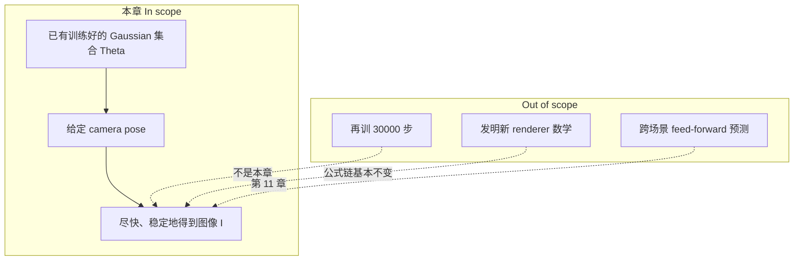
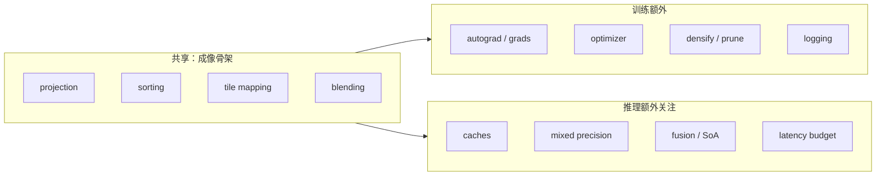
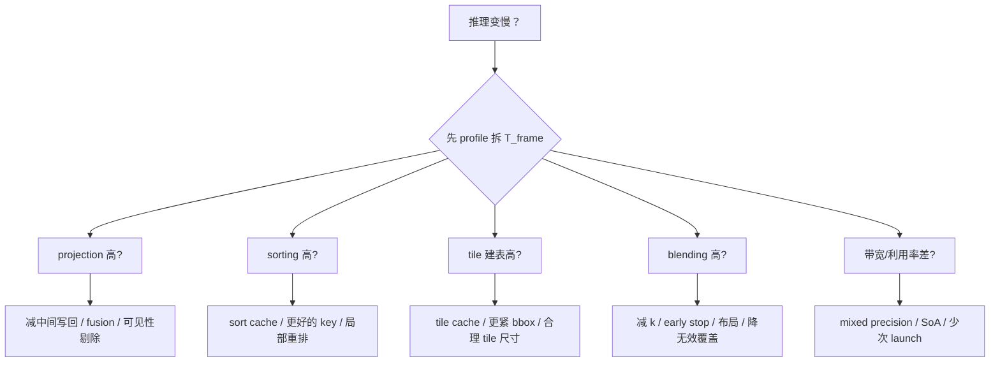
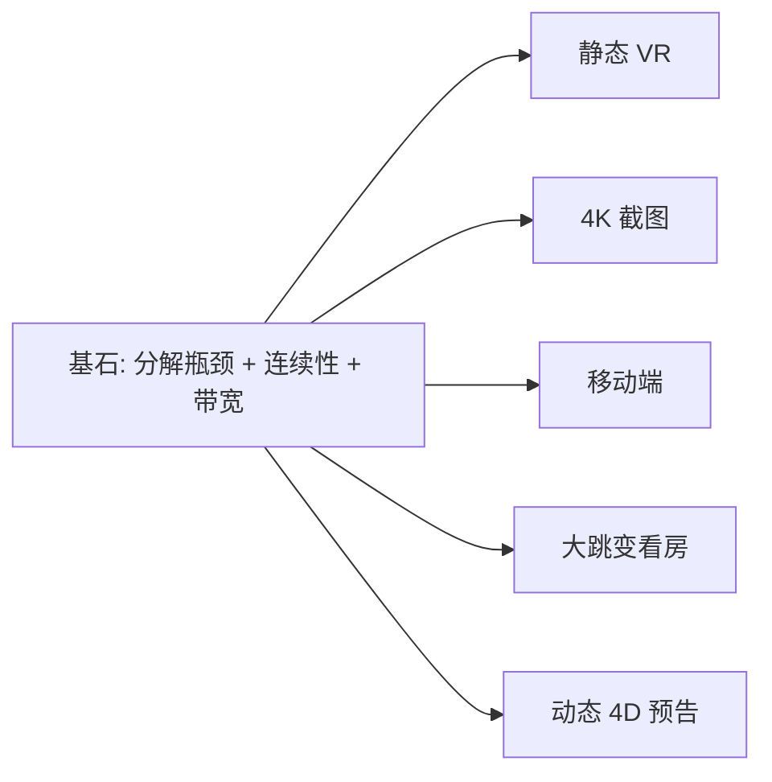
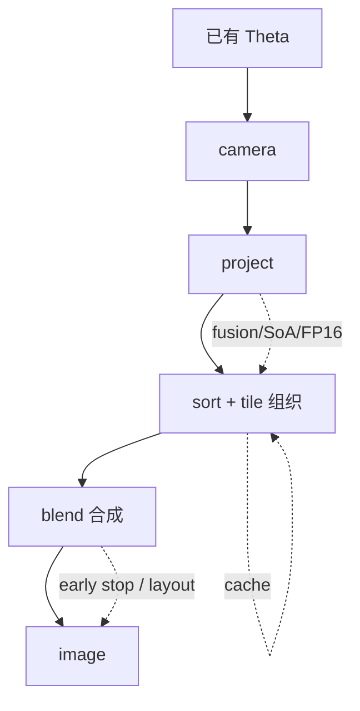
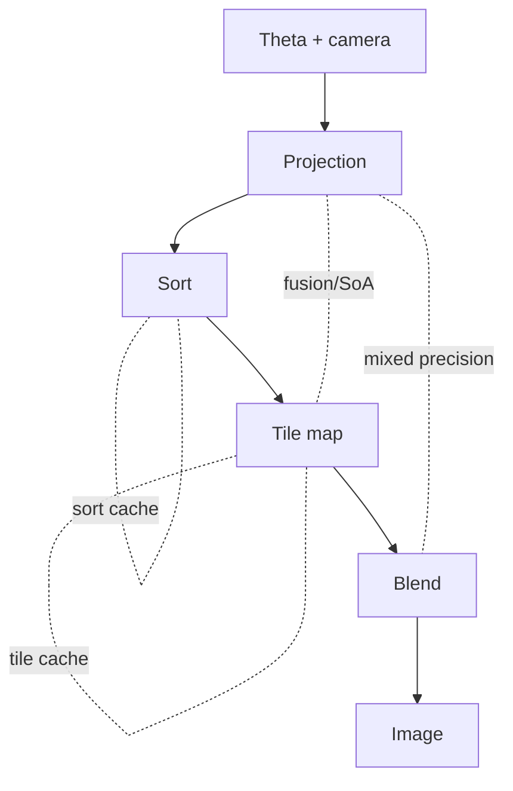

# 第 8 章：为什么训练完的模型还是跑不动——推理优化 [inference optimization] 到底在优化什么

**本章核心问题**：第 7 章已经把 3D Gaussian Splatting（3DGS）怎样被训练到收敛讲清楚了。现在问题变成：

> 为什么一套已经学会场景的 Gaussian，直接拿训练时那条 forward 再跑，常常仍然慢得没法实时使用？推理优化 [inference optimization] 到底在优化什么——是“换个 CUDA 技巧”，还是更深的计算结构问题？

如果前面几章回答的是：

- 第 3 章：为什么 primitive 选 Gaussian
- 第 4 章：Gaussian 怎样被渲染成图
- 第 5 章：优化目标为什么这样设计
- 第 6 章：第一批 Gaussian 从哪来
- 第 7 章：它们怎样被训练到收敛

那么这一章回答的就是：

```text
场景已经学会了
为什么还是跑不快
以及到底该从哪几层下手
把它变成实时推理系统 [real-time inference system]
```

先把主线写在前面，后面所有细节都围着它转：

```text
训练 forward 和推理 forward 共享同一条渲染链 [rendering pipeline]
但训练还背着 backward、结构编辑 [densify / prune] 和诊断成本

推理优化的核心不是“换个写法”
而是重新审视渲染链里真正花时间的部分：
projection / sorting / tile mapping / blending / memory bandwidth

真正的目标不是把理论公式改掉
而是让同一条渲染链以更少的数据搬运 [data movement]、
更少的重复计算、更少的无效覆盖 [overdraw] 运行
```

---

## 阶段 1 — 定界问题 [problem framing]

### 1.1 你到底在解决什么问题

很多人第一次遇到“训练完了还是慢”，会自然地以为：

```text
训练慢 = 有 optimizer 和 backward
推理应该自动就快
```

这个直觉 **几乎一定是错的**。

因为 3DGS 的“慢”可以出现在两个完全不同的时间尺度上：

| 时间尺度 | 名字 | 你在等什么 | 典型量级直觉 |
|---------|------|-----------|-------------|
| 场景级 | per-scene optimization | 得到一组 Gaussian 参数 | 分钟级到十几分钟 |
| 帧级 | real-time rendering | 给定相机位姿出一张图 | 希望 < 16.7 ms（60 FPS） |

第 7 章主要解决第一段；**本章只解决第二段**。

也就是说：

> 本章默认场景参数已经学好。你手里已经有 `Theta = {mu, Sigma, alpha, SH}`。现在只问：怎样让 `render(Theta, camera)` 尽量快、尽量稳。

### 1.2 成功标准 [success criteria]

读完并内化本章后，你至少应该能：

1. 说清 **训练 forward** 和 **推理 forward** 哪里相同、哪里不同。
2. 把一帧时间拆成 `T_project + T_sort + T_tile + T_blend + T_memory`，并能解释每一项随 `N`、分辨率怎样变。
3. 对 caching、mixed precision、kernel fusion、SoA 各自回答：**打哪个瓶颈、收益从哪来、何时失效**。
4. 在 VR、4K 预览、移动端三种场景里，判断主瓶颈可能落在哪里。

### 1.3 In scope / Out of scope

| In scope（本章必须搞懂） | Out of scope（故意先不展开） |
|--------------------------|------------------------------|
| train vs inference forward 的差异 | 从零写完整 CUDA kernel |
| 五类瓶颈：projection / sort / tile / blend / bandwidth | 具体 vendor 的 CUDA 调优手册细节 |
| caching 的时间连续性假设 | 动态 4DGS 的时序建模（第 10 章） |
| mixed precision 的带宽意义 | fully feed-forward 重建（第 11 章） |
| kernel fusion 与 SoA 布局直觉 | 编译器/PTX 级优化 |



### 1.4 一个会误导你的日常类比（先用，后拆掉）

可以把训练想成：

```text
写一本菜谱 + 反复试菜，直到味道对了
```

而推理是：

```text
菜谱已经写好了，现在要在高峰时段连续出 60 盘/秒
```

类比有用的地方：出菜速度瓶颈不一定是“你不会炒菜”，而可能是：

- 切菜台太远（**memory bandwidth**：数据搬运）
- 每道菜都重新排队洗锅（**sorting / tile mapping** 每帧重建）
- 真正下锅炒还是要时间（**blending** 硬计算）

类比危险的地方：厨房故事不会告诉你 `O(N log N)` 和 `O(P * k)` 的差别。所以后面必须回到基石。

---

## 阶段 2 — 拆到基石 [first principles]

### 2.1 先质疑一批常见假设 [assumptions]

| 常见假设 | 质疑 | 更接近真相的基石 |
|---------|------|------------------|
| 「去掉 backward 就自动实时」 | 训练 forward 本身也可能很重；推理还有排序、tile、带宽问题 | 推理是 **延迟导向的系统设计**，不是训练代码减一行 |
| 「瓶颈一定是算力 FLOPs」 | GPU 经常在等数据 | 很多时候卡在 **memory bandwidth** |
| 「优化 = 堆技巧清单」 | 不同场景主瓶颈不同 | 每个优化必须对应 **具体瓶颈 + 失效条件** |
| 「缓存永远正确」 | 相机大跳变会让深度顺序和 tile 映射失效 | caching 赌的是 **时间连续性 [temporal coherence]** |
| 「公式越简就越快」 | 数学已很简；慢在数据组织和访存 | 要改的是 **计算组织 [compute organization]**，不是改掉成像公式 |

### 2.2 不可再拆的几条基石

**基石 B1 — 成像骨架不变**  
无论训练还是推理，核心仍是：

```text
3D Gaussian
  -> world-to-camera
  -> project to 2D footprint
  -> depth ordering
  -> tile-local filtering
  -> front-to-back alpha blending
  -> image
```

也就是说：训练和推理 **共享同一条渲染链**，不是两套互不相干的 renderer。

**基石 B2 — 训练额外背着“学习税”**  
训练还要维护：

- autograd graph / gradient buffers
- optimizer state（如 Adam 的 moment）
- densify / split / prune 的结构编辑
- 日志、可视化、checkpoint

推理只需要：

```text
camera pose  ->  deterministic image  (尽量低 latency)
```

**基石 B3 — 一帧时间可以分解**  
粗略但极有用：

```text
T_frame ≈ T_project + T_sort + T_tile + T_blend + T_memory
```

更准确地说：`T_memory` 会嵌在其他四项里；但单独提出来，是为了防止你只盯 FLOPs。

**基石 B4 — 成本随规模的增长方式不同**  
设高斯数 `N`，像素数 `P = H * W`：

```text
projection:   O(N)
sorting:      O(N log N)          # 粗粒度直觉
tile mapping: O(N * avg_tiles_per_gaussian)
blending:     O(P * avg_gaussians_per_pixel)
```

因此：

> 不同分辨率、不同 `N`、不同场景局部复杂度下，**主瓶颈可以完全不同**。

**基石 B5 — 实时系统有硬延迟预算**  

- `16.7 ms` ↔ 60 FPS  
- `11.1 ms` ↔ 90 FPS  
- VR/AR 往往还希望更低，并要求 **确定性 [determinism]** 与 **帧间稳定 [temporal stability]**

训练可以接受随机视角、噪声、结构变化；推理通常不能接受“同样 pose 每次颜色乱跳”。

**基石 B6 — 相邻帧常常有时间连续性**  
相机小幅运动时：

- 深度顺序往往 **局部变化**，不是全局洗牌
- 多数 Gaussian 的 2D footprint 仍落在附近 tiles

于是 caching 才有物理依据：用 **temporal coherence** 换掉重复的组织工作。

```text
              推理优化结论
                    ↑
     少搬运 + 少重复组织 + 少无效混合
                    ↑
   B3 时间分解 + B4 复杂度 + B5 延迟预算 + B6 连续性
                    ↑
         B1 共享渲染链 + B2 去掉学习税
```

---

### 加餐怎么读：生活类比 + 失败对照

后面每张概念卡（以及「场景差异」大主题）都补了两块「加餐」。阅读建议：

1. **先读 Origin / Core idea**（建立基石）  
2. **再读生活类比**（用画面记住，但必须能说回基石）  
3. **最后读失败对照**（知道错会怎样，比只知道对更重要）

技能约束（第一性原理 skill）在这里仍然有效：

> 隐喻可以用，但必须映射回定义与约束；不能只听故事。厨房高峰、快递分拣、水管带宽——都只是脚手架；真正要钉住的是 `T_frame` 分解、时间连续性假设、数据布局与带宽。

一张总导航（类比 → 基石 → 3DGS 症状）：

| 概念 | 一个够用的生活画面 | 基石一句话 | 3DGS 里做错时常见症状 |
|------|-------------------|------------|------------------------|
| Inference optimization | 菜谱已定，高峰连出 60 盘/秒 | 不改成像语义，压 latency/带宽 | 只关 `backward` 仍掉帧 |
| Train vs inference forward | 试菜实验室 vs 流水线出餐 | 共享 render 链；推理去学习税、加缓存/精度策略 | 一套代码两用，两边都慢 |
| Projection bottleneck | 每件货贴坐标条码 | `O(N)` 几何轻，但读写中间量很贵 | `N` 大时 project 占比莫名高 |
| Sorting / depth order | 按到店先后排队 | blending 需要前后序；`O(N log N)` | 遮挡错乱 / 每帧全量 sort 爆 |
| Tile mapping | 按街区派送，不扫全城 | 空间局部性 → 本地列表 | 朴素 `O(P·N)` 卡死；建表本身也贵 |
| Alpha blend / early stop | 多层半透明贴纸叠完透不过 | `C+=T·w·c; T*=(1-w)`，`T` 小可停 | 过暗/过亮；无 early-stop 拖死 |
| Memory bandwidth | 马路车道数不够，车再快也堵 | 常 bandwidth-bound，不是 FLOPs | profiler 显示算力闲、等内存 |
| Caching | 相邻顾客点差不多的菜，复用备料 | 赌 temporal coherence；大跳变必须作废 | 闪烁、错序、跳 pose 鬼影 |
| Mixed precision | 重要标签用钢印，大批量用软标签 | 大块降精度省带宽；脆弱环节保 FP32 | `Sigma` 求逆 NaN；“全 half”崩 |
| Kernel fusion | 工序不落托盘，连做不回冷库 | 中间量留寄存器/shared，少 global 往返 | 模块清晰但 FPS 起不来 |
| SoA vs AoS | 同一字段连排放 vs 一人一袋 | 布局决定 coalesced access | 乱序读参，有效带宽利用率低 |
| 场景差异 VR/4K/移动 | 同一厨房服务堂食/外卖/街边摊 | 主瓶颈随 `N`、`P`、连续性搬家 | 一套优化到处抄，场景反变慢 |

---

## 概念卡合集：本章关键词必须先“立住”

下面这些概念卡 [concept cards] 不是装饰。它们是你后面读瓶颈分析时的词典。每个重要概念都按同一模板写：English name / 中文 [English] / Origin / Core idea / Why not alternatives / In 3DGS / PyTorch or pseudocode / Common confusions。

---

### 概念卡 1 — Inference Optimization

| 字段 | 内容 |
|------|------|
| **English name** | Inference optimization |
| **中文 [English]** | 推理优化 [inference optimization] |
| **Origin** | 实时图形学与部署工程：模型“会了”之后仍要对 latency / throughput / power 负责 |
| **Core idea** | 在 **不改（或极少改）成像语义** 的前提下，降低每帧时间与带宽压力 |
| **Why not alternatives** | 只砍训练步数解决不了帧级延迟；只换更大 GPU 掩盖结构问题，成本高且不可扩展 |
| **In 3DGS** | 针对 projection / sort / tile / blend / bandwidth 重写计算组织 |
| **PyTorch or pseudocode** | `with torch.no_grad(): image = render_fast(gaussians, camera)` |
| **Common confusions** | 把“训练加速”和“推理加速”混为一谈；以为 `no_grad` 就等于全部优化做完了 |

#### 生活类比（必须映射回基石）

把 **inference optimization** 想成：菜谱已经定稿，现在是高峰时段连出 60 盘/秒，而不是再去发明新菜。

| 生活画面 | 对应基石 |
|----------|----------|
| 试菜阶段允许慢、允许翻车 | 训练可接受分钟级与随机视角 |
| 出餐阶段每道菜必须在固定秒数内上桌 | 硬延迟预算 `T_frame < 16.7 ms`（60 FPS） |
| 瓶颈可能是洗锅排队、备料搬运，不是“不会炒” | 慢常在 sort / tile / bandwidth，不是成像公式太难 |
| 改动出餐流程，但不改菜本身味道定义 | 不改（或极少改）成像语义，只改计算组织 |

> 类比到此为止。基石是：在共享 render pipeline 上，把 `T_project + T_sort + T_tile + T_blend + T_memory` 压进延迟预算。

#### 失败对照：做对 vs 做错

| 场景 | 做对 | 做错时你看到什么 |
|------|------|------------------|
| 训练完首次部署 | profile 拆 `T_frame`，对症下药 | 只写 `no_grad()`，FPS 几乎不动 |
| 评估优化收益 | 固定 pose 路径比 latency + 图像差 | 只报峰值 FPS，隐藏卡顿与闪烁 |
| 换更大 GPU | 先确认是否 bandwidth / 结构问题 | 硬件掩盖坏布局，换机器又挂 |
| 语义一致性 | 与 slow reference 比对图像 | 为了速度偷偷改 blending 顺序却不验收 |

```text
症状速记：
  「训练完仍掉帧」→ 帧级瓶颈还在，不是场景级优化没做完
  「优化后画面飘」→ 可能动了语义（排序/精度）却没对照 reference
```

---

### 概念卡 2 — Train Forward vs Inference Forward

| 字段 | 内容 |
|------|------|
| **English name** | Training forward / Inference forward |
| **中文 [English]** | 训练前向 [training forward] / 推理前向 [inference forward] |
| **Origin** | 可微渲染系统同时承担“学习”和“展示”两种 workload |
| **Core idea** | 两者共享 render pipeline，但训练必须可微、可记中间量；推理追求确定、低延迟、高带宽效率 |
| **Why not alternatives** | 强行一套代码两用，通常两边都慢；完全两套实现又难保证数值一致 |
| **In 3DGS** | 训练保留 densify 与 grad；推理关闭 autograd，并加入 cache / tile / precision 策略 |
| **PyTorch or pseudocode** | 见下文 3.1 对照表与代码 |
| **Common confusions** | 认为“forward 一样所以性能一样”；忽略 autograd 图与 optimizer 的隐形成本 |

#### 生活类比（必须映射回基石）

**Training forward** 像开放式试菜实验室：每炒一盘还要记账、称重、改菜谱；**inference forward** 像流水线出餐：同一套锅灶流程，但关掉实验记录，加上备料缓存与节拍表。

| 生活画面 | 对应基石 |
|----------|----------|
| 同一道菜的炒制步骤相同 | 共享 projection → sort → tile → blend |
| 试菜要留样品、写笔记、改配方 | autograd graph、optimizer state、densify/prune |
| 出餐不要笔记，要稳定、可复现、低延迟 | `no_grad`、确定性、latency budget |
| 出餐可预备料、连工序；试菜更重可解释 | cache / fusion / precision 是推理侧杠杆 |

> 类比到此为止。基石是：两边共享成像骨架（B1）；训练额外背学习税（B2）；推理追求确定低延迟。

#### 失败对照：做对 vs 做错

| 场景 | 做对 | 做错时你看到什么 |
|------|------|------------------|
| 代码路径 | train / infer 共享数学，分叉工程策略 | 一套巨型 if 分支，两边都慢且难测 |
| 训练时开 densify | 仅 train loop 结构编辑 | 推理还在 clone/split，延迟抖动 |
| 一致性检查 | 同 pose 下 train-forward（关 densify）与 infer 比图 | “推理专用 kernel”悄悄改公式，回归漂 |
| 性能对比 | 去掉 backward 后再 profile | 把“没有 backward”误当成“已经实时” |

```text
症状速记：
  「forward 代码一样却慢十倍」→ 可能仍挂 autograd / 中间量保存
  「推理偶发更慢」→ densify 或日志混进了 online 路径
```

---

### 概念卡 3 — Projection Bottleneck

| 字段 | 内容 |
|------|------|
| **English name** | Projection bottleneck |
| **中文 [English]** | 投影瓶颈 [projection bottleneck] |
| **Origin** | 每个 Gaussian 都要做 world→camera→screen 的几何变换 |
| **Core idea** | 单次投影公式很轻，但 `N` 很大时，读参 + 写中间量 + 再读中间量会变成带宽税 |
| **Why not alternatives** | 不做投影无法得到 2D footprint；近似跳过大量高斯可能伤正确性 |
| **In 3DGS** | 计算 `mu_2d`、`Sigma_2d`、depth、radii 等，供 sort/tile/blend 使用 |
| **PyTorch or pseudocode** | `mu_cam = R @ mu + t; Sigma_2d = J @ (R @ Sigma @ R.T) @ J.T` |
| **Common confusions** | “公式简单所以一定便宜”；忽略中间结果反复写回 global memory |

#### 生活类比（必须映射回基石）

把 **projection** 想成：仓库里每件货都要贴一张「屏幕坐标 + 深度 + 占地半径」条码。贴条码动作本身不重，但百万件货反复取货、写标签、再读标签，搬运会先爆。

| 生活画面 | 对应基石 |
|----------|----------|
| 每件货算一次坐标 | `O(N)` 几何变换：`mu_2d, Sigma_2d, depth, radii` |
| 标签写完扔回大货架，下工序再整批取回 | 中间量写 global memory 再读 = 带宽税 |
| 公式是简单加减乘，但货架在另一头 | 数学轻 ≠ 系统便宜（B3/B4） |
| 看不见的货可以不贴 | 可见性剔除 / frustum cull 减有效 `N` |

> 类比到此为止。基石是：投影公式轻，但大规模下读参 + 写中间量会变成 bandwidth 问题。

#### 失败对照：做对 vs 做错

| 场景 | 做对 | 做错时你看到什么 |
|------|------|------------------|
| 定位瓶颈 | 计时 project 读写，不只数 FLOPs | “公式简单”就跳过 profile，其实 project 占比高 |
| 中间量 | fusion：投完直接产 key/tile 线索 | 每步写满 buffer，下一 kernel 全量再读 |
| 精度 | 几何脆弱处保 FP32 | 过早 half，`Sigma_2d` 病态 → footprint 炸 |
| 可见性 | 近平面后、屏幕外尽早丢 | 全量 `N` 全投，含大量不可见高斯 |

```text
症状速记：
  「N 上去 project 时间线性飙」→ 正常 O(N)；看是否多余写回
  「椭圆 footprint 花屏」→ 更可能是精度/雅可比，不是 sort
```

---

### 概念卡 4 — Sorting / Depth Ordering

| 字段 | 内容 |
|------|------|
| **English name** | Sorting / depth ordering |
| **中文 [English]** | 排序 / 深度排序 [sorting / depth ordering] |
| **Origin** | front-to-back alpha blending 依赖近似前后顺序 |
| **Core idea** | 常用 Gaussian 中心深度 `z` 排序；正确性需要它，大规模时 `O(N log N)` 很贵 |
| **Why not alternatives** | 完全不排序会破坏遮挡关系；精确像素级排序更贵 |
| **In 3DGS** | 全局或 per-tile 按 depth key 排序，再进 blending |
| **PyTorch or pseudocode** | `order = torch.argsort(depths); g = g[order]` |
| **Common confusions** | 以为必须每帧全局完美排序；忽略小运动下的排序缓存 [sort cache] |

#### 生活类比（必须映射回基石）

**Depth sorting** 像食堂窗口按「离你远近」排队：前面的人挡住后面的菜。不完全排队会遮挡错乱；每秒把全城人重新按身高排队，则排队本身比打饭还贵。

| 生活画面 | 对应基石 |
|----------|----------|
| 先到的贴纸盖住后到的 | front-to-back alpha blending 需要近似前后序 |
| 用中心深度当排队键 | 常用 Gaussian 中心 `z` 作 key（近似） |
| 全员重新排序很贵 | 粗粒度 `O(N log N)` 正确性税 + 规模税 |
| 队伍几乎没变时可沿用上一轮 | sort cache 赌 temporal coherence（B6） |

> 类比到此为止。基石是：排序服务正确遮挡；大规模下贵；小运动可缓存，大跳变必须 invalidate。

#### 失败对照：做对 vs 做错

| 场景 | 做对 | 做错时你看到什么 |
|------|------|------------------|
| 静态相机连帧 | 复用 / 局部更新 order | 每帧全局 `argsort`，CPU/GPU sort 占满 |
| 相机大跳变 | pose delta 超阈 → 全量重排 | 旧 order 复用 → 前后穿模、闪一下 |
| 正确性 vs 速度 | 接受中心深度近似，并文档化 | 追求像素级完美序，实时直接挂 |
| 与 blending 联调 | 固定 seed 对照 reference 图像 | 错序被当成「颜色公式 bug」乱改 |

```text
症状速记：
  「半透明层前后穿插」→ 排序失效或 cache 未作废
  「sort 时间随 N 涨得比 project 狠」→ 符合 O(N log N) 直觉
```

---

### 概念卡 5 — Tile Mapping

| 字段 | 内容 |
|------|------|
| **English name** | Tile mapping / tile-based culling |
| **中文 [English]** | 分块映射 / 基于 tile 的剔除 [tile mapping / tile-based culling] |
| **Origin** | 利用 Gaussian footprint 的 **空间局部性 [spatial locality]**，避免每像素扫全部 `N` |
| **Core idea** | 屏幕切成 tiles；每个 Gaussian 只进入它覆盖的 tiles；每像素只混合本地列表 |
| **Why not alternatives** | 朴素 `O(P * N)` 在百万级高斯下不可用；完全不规则稀疏结构对 GPU 不友好 |
| **In 3DGS** | 从 2D 协方差包围盒映射到 tile range，建立 `tile -> gaussian list` |
| **PyTorch or pseudocode** | 见第 9 章 workload 图；概念上 `for g in G: for tile in cover(g): lists[tile].append(g)` |
| **Common confusions** | 以为 tile 只是“画格子”；忘记“建映射本身也有成本”，也可以 cache |

#### 生活类比（必须映射回基石）

**Tile mapping** 像外卖按街区派送：每个骑手只进自己覆盖的街区，而不是全城每栋楼都敲门。建「街区→订单列表」也要时间，但能把 `O(全城×全单)` 打成「每街区本地列表」。

| 生活画面 | 对应基石 |
|----------|----------|
| 屏幕切成小格子 | tiles |
| 椭圆 footprint 只盖住几个街区 | 空间局部性 [spatial locality] |
| 建派送表本身要人工 | tile list 构建成本 `O(N · avg_tiles_per_g)` |
| 顾客只在附近挪动时表可微调 | tile cache 与时间连续性 |
| 扫全城每个地址×每单 | 朴素 `O(P · N)` 不可用 |

> 类比到此为止。基石是：用局部列表换掉全局扫描；建表有成本，也可缓存。

#### 失败对照：做对 vs 做错

| 场景 | 做对 | 做错时你看到什么 |
|------|------|------------------|
| 大分辨率 | tile-based culling + 合理 tile 尺寸 | 每像素扫全 `N`，分辨率一高直接冻 |
| bbox | 紧包围盒，减少虚假覆盖 | 过大 bbox → overdraw，blend 暴涨 |
| 建表缓存 | 小运动复用 lists | 大运动未 invalidate → 缺 splat / 鬼影 |
| 调试 | 画 tile 负载热图 | 只看最终图，不知热点 tile 堵死 |

```text
症状速记：
  「分辨率翻倍时间翻很多倍」→ 可能 P 侧 blend；先查 tile 是否真在工作
  「边缘高斯消失」→ tile range 算错或 cache 过期
```

---

### 概念卡 6 — Alpha Blending / Early Termination

| 字段 | 内容 |
|------|------|
| **English name** | Alpha blending / early termination |
| **中文 [English]** | Alpha 混合 / 提前终止 [alpha blending / early termination] |
| **Origin** | 体积/粒子合成：front-to-back 累加颜色与剩余透射率 [transmittance] |
| **Core idea** | `C += T * w * c; T *= (1 - w)`；当 `T` 很小时可 early stop |
| **Why not alternatives** | 简单颜色相加没有遮挡语义；back-to-front 也对，但 early-stop 习惯不同 |
| **In 3DGS** | 这是最终“逃不掉的硬活”；优化多是减少无效覆盖与访存，而不是消灭 blending |
| **PyTorch or pseudocode** | 见 3.4 节伪代码 |
| **Common confusions** | 以为 blending 可以像 sort 一样整帧缓存；忽略视角一变就要重算 |

#### 生活类比（必须映射回基石）

**Alpha blending** 像把半透明贴纸从近到远往玻璃上贴：每贴一张，透过玻璃还能看见后面的光就变少；贴到几乎不透了，后面的贴纸可以不贴了（**early termination**）。

| 生活画面 | 对应基石 |
|----------|----------|
| 贴纸颜色按「剩余透明度」掺进去 | `C += T * w * c` |
| 透明度乘上 `(1 - 本层不透明度)` | `T *= (1 - w)` |
| 已经漆黑/不透就停手 | early stop when `T` 很小 |
| 换一个角度看玻璃必须重贴 | blending 视角相关，难像 sort 整帧硬缓存 |
| 贴纸张数 × 玻璃面积 | 成本约 `O(P · avg_gaussians_per_pixel)` |

> 类比到此为止。基石是：这是最终逃不掉的硬活；优化多是减无效覆盖与访存，不是消灭 blending。

#### 失败对照：做对 vs 做错

| 场景 | 做对 | 做错时你看到什么 |
|------|------|------------------|
| 公式 | front-to-back 累加 + 合理 `T` 阈值 | 直接加颜色 → 过曝；忘 `T` → 无遮挡感 |
| 性能 | early-stop + 减 `k` + 紧 tile | 深度复杂区每像素扫超长列表 |
| 缓存预期 | 不指望整帧 blend 结果可无脑复用 | 复用上一帧颜色 → 运动拖影/错视差 |
| 4K | 认清 `P` 暴涨主导 | 还在猛优化 sort，blend 才是主犯 |

```text
症状速记：
  「近景半透明后景全没」→ T 或 w 算错 / 序错
  「early-stop 后破洞」→ 阈值过松或序不可靠
```

---

### 概念卡 7 — Memory Bandwidth

| 字段 | 内容 |
|------|------|
| **English name** | Memory bandwidth bottleneck |
| **中文 [English]** | 内存带宽瓶颈 [memory bandwidth bottleneck] |
| **Origin** | roofline 思维：算力峰值再高，数据到不了 ALUs 就白搭 |
| **Core idea** | 3DGS 推理经常是 **bandwidth-bound**：GPU 在等 Gaussian 参数与中间量 |
| **Why not alternatives** | 只加 FLOPs 优化（例如更花哨的数学）可能几乎不涨帧率 |
| **In 3DGS** | 每帧读大量 `mu/scale/rot/opacity/SH`；kernel 间反复写回再读 |
| **PyTorch or pseudocode** | 用 profiler 看 memory-bound；混合精度与 SoA 直接打这条 |
| **Common confusions** | “慢 = 算子太重”；其实是“数据布局太散 / 搬运太多次” |

#### 生活类比（必须映射回基石）

**Memory bandwidth** 像城市主干道车道数：厨房炉灶（ALU/算力）再强，食材运不过来也只能干等。3DGS 推理常是「车堵在路上」，不是「厨师算菜谱算不过来」。

| 生活画面 | 对应基石 |
|----------|----------|
| 每帧把全部调料罐搬上操作台再搬回 | 每帧读 `mu/scale/rot/opacity/SH` |
| 工序间必须回冷库落盘再取 | kernel 间 global memory 往返 |
| 马路拓宽 / 少跑冤枉路 | mixed precision、SoA、fusion 打带宽 |
| 只升级炉灶不修路 | 加 FLOPs 优化，帧率几乎不动 |

> 类比到此为止。基石是：roofline 思维——很多时候卡在带宽与数据布局，不是算术强度。

#### 失败对照：做对 vs 做错

| 场景 | 做对 | 做错时你看到什么 |
|------|------|------------------|
| 诊断 | profiler：memory-bound vs compute-bound | 盲目加更复杂数学“加速” |
| SH 阶数 | 按场景砍 view-dependent 成本 | 高阶 SH 参数墙，带宽先爆 |
| 精度 | 大块参数 FP16 存，关键算 FP32 | 全 FP32 稳但搬不动 |
| 布局 | 同属性连续读 | AoS 乱跳，有效带宽利用率低 |

```text
症状速记：
  「GPU 利用率不高却很慢」→ 高度怀疑 bandwidth
  「减 FLOPs 无感」→ 你优化的不是瓶颈那一层
```

---

### 概念卡 8 — Caching（Sort Cache / Tile Cache）

| 字段 | 内容 |
|------|------|
| **English name** | Caching (sort cache, tile cache) |
| **中文 [English]** | 缓存 [caching]（排序缓存、tile 缓存） |
| **Origin** | 实时渲染里的 temporal coherence：相邻帧重复劳动很多 |
| **Core idea** | 相机变化小时，复用上一帧 depth order 与 tile lists，或做局部更新 |
| **Why not alternatives** | 每帧全量重建正确但贵；无失效检测的盲目复用会闪烁/错序 |
| **In 3DGS** | 连续相机路径（尤其 VR）收益最大；大 pose jump 必须 invalidate |
| **PyTorch or pseudocode** | `if pose_delta < thr: order = cached_order else: order = sort(...)` |
| **Common confusions** | “缓存 = 永远正确”；其实是 **有边界条件的近似加速** |

#### 生活类比（必须映射回基石）

**Caching** 像相邻几桌点了差不多的套餐：备菜台不必每单从零切配，可复用半成品。若突然来一桌完全不同的宴席（相机大跳变），半成品必须作废重做。

| 生活画面 | 对应基石 |
|----------|----------|
| 相邻帧队伍几乎一样 | temporal coherence（B6） |
| 复用排队序号 | sort cache |
| 复用街区派送表 | tile cache |
| 宴席大变必须 invalidate | pose jump → 全量重建 order/lists |
| 盲目用昨天的备料 | 无失效检测 → 闪烁/错序/鬼影 |

> 类比到此为止。基石是：缓存用连续性换掉重复组织工作；它是有边界条件的近似加速，不是永远正确。

#### 失败对照：做对 vs 做错

| 场景 | 做对 | 做错时你看到什么 |
|------|------|------------------|
| VR 小幅转头 | cache 命中，sort/tile 成本塌缩 | 每帧全量重建，延迟打不满预算 |
| 看房 App 点击传送 | 强制 invalidate + 全量 sort/tile | 旧深度序 → 穿模一帧 |
| 阈值 | 按 pose delta / 帧差设策略 | 阈值过松闪烁；过紧等于没 cache |
| 动态场景（预告第 10 章） | 场景也在变时更谨慎 | 只看相机不动却场景在动，cache 仍错 |

```text
症状速记：
  「连续转头突然闪一下」→ cache 边界/阈值问题
  「传送后错遮挡」→ 大 jump 未 invalidate
```

---

### 概念卡 9 — Mixed Precision

| 字段 | 内容 |
|------|------|
| **English name** | Mixed precision |
| **中文 [English]** | 混合精度 [mixed precision] |
| **Origin** | 深度学习训练/推理用 FP16/BF16 换吞吐与带宽；图形里同样适用 |
| **Core idea** | **不是全链路 half**；对大块存储与带宽敏感路径降精度，对数值脆弱环节保 FP32 |
| **Why not alternatives** | 全 FP32 稳但带宽贵；全 FP16 可能在 `Sigma_2d` 求逆、小深度 Jacobian 处炸 |
| **In 3DGS** | 颜色/部分中间量/参数缓存常可 FP16；协方差求逆等更谨慎 |
| **PyTorch or pseudocode** | `mu16 = mu.half(); ...; Sigma_2d = (J @ Sigma_cam @ J.T).float()` |
| **Common confusions** | “mixed precision = 全部 half”；把训练 AMP 和推理存储压缩混为一谈 |

#### 生活类比（必须映射回基石）

**Mixed precision** 像标签体系：大批量库存用轻便软标签（FP16）省空间、好搬运；关键安全件（协方差求逆、小深度 Jacobian）仍用钢印铭牌（FP32）。不是全厂改成软标签。

| 生活画面 | 对应基石 |
|----------|----------|
| 软标签便宜、好搬 | 降精度 → 少字节 → 打 bandwidth |
| 钢印用在怕出错处 | `Sigma_2d` 求逆、数值脆弱路径保 FP32 |
| “全部 half 最省” | 全链路 half 可能 NaN / footprint 崩 |
| 训练 AMP ≠ 推理布局策略 | 目标不同：训练稳梯度 vs 推理稳图像+带宽 |

> 类比到此为止。基石是：**混合**精度——对大块存储与带宽敏感路径降精度，对脆弱环节保 FP32。

#### 失败对照：做对 vs 做错

| 场景 | 做对 | 做错时你看到什么 |
|------|------|------------------|
| 参数缓存 | 颜色/部分中间量 half | 全体 half → 偶发黑块、NaN |
| 协方差路径 | 关键 matmul/inv 用 float | 椭圆退化成线/点，或 cholesky 失败 |
| 验收 | 与 FP32 reference 比 PSNR/视觉 | 只看 FPS 涨了就上线 |
| 与 train AMP 区分 | 单独设计推理存储策略 | 照搬训练 AMP 配置，推理照样炸 |

```text
症状速记：
  「开 half 后椭圆飞了」→ 精度边界选错
  「带宽降了画质轻微差」→ 可能可接受；用 reference 定量
```

---

### 概念卡 10 — Kernel Fusion

| 字段 | 内容 |
|------|------|
| **English name** | Kernel fusion |
| **中文 [English]** | 算子融合 [kernel fusion] |
| **Origin** | GPU 编程：多次 launch + 多次 global memory 往返很贵 |
| **Core idea** | 把相邻阶段合成更大 kernel，让中间量留在寄存器/shared memory |
| **Why not alternatives** | 模块化多 kernel 好调试但带宽税高；过度融合难维护 |
| **In 3DGS** | 例如投影后直接产 tile key，减少中间 buffer 写回 |
| **PyTorch or pseudocode** | 概念上 `fused_project_and_key(...)` 替代 `project(); write(); read(); key()` |
| **Common confusions** | 以为 fusion 改变了数学；其实数学不变，变的是 **数据驻留位置** |

#### 生活类比（必须映射回基石）

**Kernel fusion** 像把「切菜 → 装盘 → 送回冷库 → 再取出下锅」改成「切完直接下锅」：菜还是那道菜，少的是来回冷库（global memory）和每次重新开工（kernel launch）。

| 生活画面 | 对应基石 |
|----------|----------|
| 工序不落大托盘 | 中间量留在寄存器 / shared memory |
| 多次开工点名 | 多次 kernel launch 开销 |
| 数学菜谱不变 | 成像公式不变，变数据驻留 |
| 融太狠难换人维护 | 过度 fusion 损可调试性 |

> 类比到此为止。基石是：相邻阶段合成更大 kernel，用驻留换带宽与 launch 税。

#### 失败对照：做对 vs 做错

| 场景 | 做对 | 做错时你看到什么 |
|------|------|------------------|
| project→key | 融合少一次写回 | 清晰多 kernel，带宽被中间 buffer 吃满 |
| 调试 | 保留 slow unfused path | 一融到底，数值错无法分层定位 |
| 期望 | 用 profiler 验证减少 memory traffic | 以为 fusion“算得更快”却 FLOPs 不变 |
| 边界 | 热路径融合，冷路径模块化 | 全融合巨型 kernel 难维护、难移植 |

```text
症状速记：
  「模块很漂亮但 FPS 起不来」→ 怀疑中间量往返
  「融合后更慢」→ 寄存器压力/占用率掉，需实测
```

---

### 概念卡 11 — SoA vs AoS

| 字段 | 内容 |
|------|------|
| **English name** | Structure of Arrays (SoA) vs Array of Structures (AoS) |
| **中文 [English]** | 结构体数组 vs 数组结构体 [SoA vs AoS] |
| **Origin** | 数据布局 [data layout] 影响 coalesced memory access |
| **Core idea** | 同类型属性连续存放（所有 `mu_x` 挨在一起），更利于 GPU 连续读 |
| **Why not alternatives** | AoS（每个 Gaussian 一个 struct）对人友好，但对某些遍历模式不友好 |
| **In 3DGS** | 推理遍历同一属性流时，SoA 常提升有效带宽利用率 |
| **PyTorch or pseudocode** | SoA: `mu: [N,3]`, `opacity: [N]`；AoS: `List[{mu, opacity, ...}]` |
| **Common confusions** | 以为 SoA 永远更快；实际取决于 access pattern；可读性也会变差 |

#### 生活类比（必须映射回基石）

**SoA vs AoS** 像仓库货架策略：SoA 把「所有苹果放一排、所有香蕉放一排」；AoS 是「每人一个购物袋，袋里有苹果+香蕉+标签」。若流水线每次只处理同一字段（例如全体读 `opacity`），连排放（SoA）更好搬。

| 生活画面 | 对应基石 |
|----------|----------|
| 同字段连成一长条 | Structure of Arrays：`mu[N,3]`, `opacity[N]` |
| 一人一袋全字段 | Array of Structures：对人友好、局部字段乱跳 |
| GPU 喜欢连续搬运 | coalesced memory access |
| 访问模式决定谁赢 | SoA 非永远更快；看 traverse pattern |

> 类比到此为止。基石是：数据布局影响有效带宽利用率；推理常遍历同属性流，SoA 常更香。

#### 失败对照：做对 vs 做错

| 场景 | 做对 | 做错时你看到什么 |
|------|------|------------------|
| 推理热路径 | 同属性批量连续读 | 指针追逐式 AoS，带宽浪费 |
| 可读性 | 训练/调试可用结构体思维，部署转布局 | 强行 SoA 却 access 模式是逐高斯全字段 |
| 验证 | 改布局后对 reference 比图 | 转置/打包错误导致参数错位花屏 |
| 与 precision 组合 | half + SoA 协同打带宽 | 只改精度不改布局，收益腰斩 |

```text
症状速记：
  「参数看起来对，渲染全错位」→ 打包/stride/SoA 转换 bug
  「换布局无收益」→ access pattern 可能本来就友好，或瓶颈不在读参
```

---

## 阶段 3 — 自底向上重建 [reconstruction]

下面只用阶段 2 的基石，把“推理优化该怎么做”搭起来。

### 3.1 相同与不同：一张表钉死



| 维度 | Training forward | Inference forward |
|------|------------------|-------------------|
| 目标 | 可学、可收敛、可诊断 | 低延迟、高吞吐、输出稳定 |
| 是否需要 grad | 是 | 否（`no_grad` / inference mode） |
| densify | 周期性执行 | 关闭 |
| 数值要求 | 可接受一定随机性 | 同 pose 应尽量确定 |
| 优化杠杆 | learning rate、loss、结构编辑 | cache、layout、precision、fusion |
| 成功指标 | PSNR / SSIM / 收敛曲线 | frame time、FPS、闪烁、功耗 |

**最小 PyTorch 骨架对比**：

```python
# ---- 训练（示意）----
optimizer.zero_grad(set_to_none=True)
image = render(gaussians, camera)          # 需要保留计算图
loss = image_loss(image, gt)
loss.backward()
optimizer.step()
maybe_densify(gaussians)

# ---- 推理（示意）----
gaussians.eval()
with torch.inference_mode():               # 比 no_grad 更贴近推理语义
    image = render_fast(gaussians, camera) # 可含 cache / FP16 / fused path
```

注意：`inference_mode()` 只是 **第一刀**。真正的帧时间大头，往往还在 `render_fast` 内部的五类瓶颈。

### 3.2 五类瓶颈：把 `T_frame` 拆开讲透

#### （1）Projection：数学轻，访存不一定轻

回顾第 4 章：

```text
mu_cam = R * mu_world + t
Sigma_cam = R * Sigma_world * R^T

u = fx * X / Z + cx
v = fy * Y / Z + cy

J = [[fx/Z, 0, -fx*X/Z^2],
     [0, fy/Z, -fy*Y/Z^2]]

Sigma_2d ≈ J * Sigma_cam * J^T
```

对单个 Gaussian，这就是几次 matmul 和除法。但对 `N = 1e5 ~ 1e6+`：

```text
读参数 -> 算中间量 -> 写回 mu_2d / Sigma_2d / depth / radii
-> 后续 sort/tile/blend 再读一遍
```

所以 projection 的真正风险常常是：

> 中间结果会不会被反复读写，导致 bandwidth 成为瓶颈。

工程上你会问：

- 这些中间量是否必须落地到 global memory？
- 能否和 key 生成、tile 覆盖计算 fused？
- 哪些字段其实 tile/blend 用不到，却被写了出来？

#### （2）Sorting：正确性税 + 规模税

front-to-back blending 需要近似深度顺序。常见做法：按 Gaussian 中心深度排序。

```text
T_sort ~ O(N log N)   # 直觉级
```

`N` 大时，这一项会明显咬预算。

**排序缓存 [sort cache] 赌什么？**

```text
如果相机只动一点点，深度顺序会完全重排吗？
很多时候：不会全局重排，只是局部扰动。
```

于是：

```python
def maybe_sort(depths, camera, cache):
    if cache.valid and pose_distance(camera, cache.camera) < thr:
        return cache.order  # 复用
    order = torch.argsort(depths)
    cache.order = order
    cache.camera = camera
    cache.valid = True
    return order
```

失效条件（必须记住）：

- 平移/旋转过大
- 遮挡关系显著变化
- 场景本身动态（静态 3DGS 推理通常假设场景固定；动态见第 10 章）

#### （3）Tile mapping：局部性红利，但建表也有成本

没有 tile 时，朴素复杂度接近：

```text
O(P * N)
```

例如 `P = 1024^2`，`N = 5e5`：

```text
~ 5e11 次“是否相关”的判断量级
```

有了 tile：

```text
每个 Gaussian 只进少数 tiles
每个像素只看本 tile 的局部列表 k << N
复杂度直觉 ~ O(P * k) 外加建表成本
```

```text
屏幕
┌────┬────┬────┬────┐
│t00 │t01 │t02 │t03 │
├────┼────┼────┼────┤
│t10 │t11█│t12█│t13 │   █ = 某 Gaussian footprint 覆盖的 tiles
├────┼────┼────┼────┤
│t20 │t21█│t22 │t23 │
└────┴────┴────┴────┘
```

但请务必记住：

> 建立 `tile -> relevant gaussians` 映射，本身也是一笔真实开销。

因此 tile mapping **同样可以**在小相机运动时 cache 或局部更新；它和 sort cache 常常共享失效逻辑。

#### （4）Blending：最终逃不掉的硬活

对每个像素：

```text
T = 1
C = 0
for g in front_to_back_list:
    w = alpha_g * gaussian_2d(pixel; mu_2d, Sigma_2d)
    C += T * w * color_g
    T *= (1 - w)
    if T < T_eps: break   # early termination
```

成本直觉：

```text
T_blend ~ O(P * avg_gaussians_per_pixel)
```

为什么 blending 不像 sort/tile 那样容易整帧缓存？

因为排序和 tile 主要是 **组织数据**；blending 是 **在当前视角下把局部贡献合成最终颜色**。视角一变、像素采样点一变，结果往往必须重算。

所以对 blending 的优化更像：

- 减少每像素有效 `k`（更好的 culling、更合理的 Gaussian 尺度）
- early stop
- 更好的局部内存布局，让 GPU 吃得饱
- 减少 blending 前后的无效搬运

而不是幻想“完全不做 blending”。

#### （5）Memory bandwidth：很多时候你卡在等数据

假设每个 Gaussian 存 center、shape、opacity、SH 等。`N` 很大时，每帧都要从显存读出庞大结构。若布局分散、重复读取、kernel 之间反复 write/read，则：

```text
GPU 不是算不动，而是在等数据。
```

这直接解释了为什么 mixed precision、SoA、fusion 常常“比再推简公式”更值钱。

### 3.3 成本随规模如何搬家：先建立判断习惯

```python
import numpy as np
import matplotlib.pyplot as plt

N_values = np.linspace(1e5, 3e6, 120)
P = 1280 * 720

# toy cost model：只看趋势，不代表真实绝对时间
T_project = 1.0e-6 * N_values
T_sort = 2.2e-7 * N_values * np.log2(N_values)
T_tile = 5.0e-7 * N_values
T_blend = np.full_like(N_values, 0.9e-8 * P * 35)  # 假设平均每像素 35 个贡献者

plt.figure(figsize=(8.5, 5.2))
plt.plot(N_values / 1e6, T_project, label='projection')
plt.plot(N_values / 1e6, T_sort, label='sorting')
plt.plot(N_values / 1e6, T_tile, label='tile mapping')
plt.plot(N_values / 1e6, T_blend, label='blending')
plt.xlabel('number of gaussians (millions)')
plt.ylabel('relative time (toy units)')
plt.title('How bottlenecks shift as Gaussian count grows')
plt.legend()
plt.tight_layout()
plt.show()
```

你应建立的判断习惯：

| 观察 | 含义 |
|------|------|
| blending 对 `N` 不敏感（在 toy 里近似常数） | 它更吃分辨率与每像素局部复杂度 |
| projection / tile 近线性随 `N` | 高斯暴涨时它们抬头 |
| sorting 带 `log N` | 超大规模时更显眼 |
| 把 `P` 改成 4K | blending 可能重新成为主瓶颈 |

### 3.4 从瓶颈反推优化动作：必须能回答四问

每个优化都应该能回答：

```text
1) 我在打哪个瓶颈？
2) 收益从哪里来？
3) 什么时候失效 / 变危险？
4) 复杂度代价值不值？
```

| 优化 | 打哪 | 收益来源 | 失效 / 风险 | 代价 |
|------|------|----------|-------------|------|
| `torch.inference_mode()` | 训练附加链 | 去掉 autograd 与多余状态 | 几乎无（推理本应如此） | 极低 |
| sort cache | sorting | temporal coherence | 大 pose jump、遮挡剧变 | 中：需失效策略 |
| tile cache / 局部更新 | tile mapping | 同上 | footprint 大范围跨 tile | 中到高 |
| mixed precision | bandwidth / 存储 | 半精度读写与吞吐 | 数值敏感点不稳 | 中：要分路径 |
| kernel fusion | 中间搬运 | 减少 global memory 往返 | 调试变难 | 高 |
| SoA layout | 有效带宽利用率 | coalesced access | 抽象变差；pattern 不匹配时收益有限 | 中 |

#### 更完整的推理侧伪代码（把杠杆装回去）

```python
class RenderCache:
    def __init__(self):
        self.valid = False
        self.camera = None
        self.order = None
        self.tile_lists = None

def pose_distance(cam_a, cam_b) -> float:
    # 实际可用平移范数 + 旋转角等复合度量
    ...

def render_fast(gaussians, camera, cache: RenderCache, thr=1e-2):
    # 1) projection（可 fused、可部分 FP16 存储）
    mu_2d, Sigma_2d, depths, radii = project(gaussians, camera)

    # 2) sort：小运动复用
    if cache.valid and pose_distance(camera, cache.camera) < thr:
        order = cache.order
    else:
        order = torch.argsort(depths)
        cache.order = order

    # 3) tile mapping：小运动复用或局部更新
    if cache.valid and pose_distance(camera, cache.camera) < thr:
        tile_lists = cache.tile_lists
    else:
        tile_lists = build_tile_lists(mu_2d, Sigma_2d, radii, order)
        cache.tile_lists = tile_lists

    cache.camera = camera
    cache.valid = True

    # 4) blending：真正合成（可 early stop；布局友好）
    image = blend_tiles(tile_lists, mu_2d, Sigma_2d, gaussians, order)
    return image
```

这段代码不是生产级实现，但它强制你看见结构：

```text
组织工作（sort/tile）可以赌连续性
合成工作（blend）仍要为当前帧负责
精度与布局是贯穿全程的带宽策略
```

### 3.5 为什么“本质还是把问题压回规则结构”

如果你退远一点，会发现推理优化不是黑魔法，而是反复把问题压进更规则、更可控的结构：

| 规则结构 | 它压住了什么 |
|----------|--------------|
| Gaussian primitive | 局部、可微、可投影的表示 |
| Jacobian 局部线性化 | 3D→2D 协方差传播 |
| tile 化 | 全局 `P×N` → 局部工作集 |
| caching | 帧间重复组织 |
| mixed precision | 带宽与存储体积 |
| fusion / SoA | 中间量与访存模式 |

一句话：

> 在不改掉核心渲染公式的前提下，把这条公式链改写得更适合真实硬件。

### 3.6 同一套优化，不同场景效果完全不同

#### 场景 A：VR 头显

特征：高频位姿更新、相邻帧变化小、延迟预算极苛刻。

```text
时间连续性很强
→ sort cache / tile cache 特别值钱
→ 任何会引入闪烁的近似都要谨慎
```

#### 场景 B：4K 离线预览

特征：分辨率极高，相机可能跳着看关键帧。

```text
P 暴涨 → blending 工作量暴涨
→ cache 命中率可能一般
→ 主瓶颈可能从 sort 转到 per-pixel blend
```

#### 场景 C：移动端

特征：带宽与功耗同时紧，算力更有限。

```text
memory bandwidth 与功耗往往先爆
→ 精度、布局、减少 overdraw 优先
→ 过大 SH 阶数、过多半透明层会很痛
```



#### 生活类比（必须映射回基石）

把 **同一套厨房服务不同业态** 想成：堂食 VR 连转小桌（相邻单很像，cache 香）、外卖 4K 大海报（面积 `P` 暴涨，贴膜/blend 才是累活）、街边摊移动端（车道与电都紧，带宽与功耗先爆）。菜谱（成像公式）几乎一样，**主瓶颈搬家**。

| 生活画面 | 对应基石 |
|----------|----------|
| 邻桌连点同款，备料复用 | VR：temporal coherence → sort/tile cache |
| 海报面积翻倍，贴膜工时暴涨 | 4K：`P`↑ → blending 主导 |
| 小店电表与巷子窄 | 移动端：bandwidth + power 先爆 |
| 把堂食 SOP 原样抄到街边 | 优化必须按 profile 与场景重排优先级 |

> 类比到此为止。基石是：B4 成本随 `N`/`P`/连续性变化；没有放之四海的“技巧清单顺序”。

#### 失败对照：做对 vs 做错

| 场景 | 做对 | 做错时你看到什么 |
|------|------|------------------|
| VR | 优先 cache + 防闪烁近似 | 只砍 SH 却每帧全量 sort，延迟仍炸 |
| 4K 预览 | 盯 per-pixel blend / overdraw | 还在猛 cache，相机跳着看命中率低 |
| 移动端 | 精度、布局、减半透明层、降 SH | 桌面最优配置直接部署，发热掉帧 |
| 通用原则 | 先拆 `T_frame` 再选杠杆 | 网上技巧清单从上抄到下 |

```text
症状速记：
  「VR 花、4K 慢、手机烫」→ 常常是三个不同主瓶颈，不是同一个 bug
```

### 3.7 关于 SH 阶数：它也是推理成本的一部分

Spherical Harmonics（SH）用于 view-dependent appearance。阶数越高，每高斯颜色参数越多：

| SH order（常见说法） | 系数规模直觉 | 能表达 | 内存/带宽压力 |
|----------------------|--------------|--------|----------------|
| 低阶（偏漫反射） | 少 | 弱视角依赖 | 低 |
| 中阶（常见默认区） | 中 | 基础 view-dependent | 中 |
| 高阶 | 多 | 更复杂高光等 | 高 |

推理时你要意识到：

```text
SH 不只是“训练更难一点”
它是每帧都可能被读出来的大块数据
```

所以在移动端或带宽紧的部署里，降低 SH 阶数有时是 **直接的带宽优化**，而不只是模型选择问题。

---

## 阶段 4 — 推广应用 [transfer]

同一组基石，换约束后怎么迁移。

### 4.1 迁移场景 1：你只有 PyTorch，没有自定义 CUDA

基石不变：仍是五类瓶颈。

可变表象：

- 先用 `torch.inference_mode()`
- 用向量化 projection，避免 Python 循环
- tile 可先做粗 bbox culling（哪怕不完美）
- 用半精度张量存大参数
- 用 profiler 证实瓶颈，再决定要不要上 CUDA extension

步骤：

1. 固定相机路径，测 baseline frame time  
2. 只关 autograd，再测  
3. 加可见性/近平面剔除  
4. 加简单 tile 列表  
5. 每一步对比图像差（`max abs diff` / PSNR）

### 4.2 迁移场景 2：相机路径是“传送式”大跳变（看房 App 点击切换）

基石中 **B6 temporal coherence** 变弱。

于是：

- sort/tile cache 命中率下降  
- 你应把工程重点挪到：单帧投影与 blending 效率、预计算可见集、LOD  

而不是死磕“缓存命中率”。

### 4.3 迁移场景 3：同一场景要同时服务 60 FPS 预览 + 偶尔 4K 截图

这是双预算系统：

| 模式 | 延迟预算 | 可接受近似 | 可能策略 |
|------|----------|------------|----------|
| 交互预览 | 紧 | 中等 | cache、较低分辨率、较低 SH、更激进 early stop |
| 4K 截图 | 松 | 低 | 关闭激进近似、全精度关键路径、完整排序 |

迁移要点：

> 不要假设“一套最优配置打天下”。推理系统可以是 **多档质量/延迟开关**。

### 4.4 迁移场景 4：动态场景（预告第 10 章）

若 `Theta` 每帧都变，则：

- 参数本身在动 → 排序与 tile 更易失效  
- caching 策略必须重估  
- 但 **renderer 骨架仍可复用**

这说明第 8 章的基石在 4D 里仍然有用，只是“连续性”要从“仅相机连续”扩展到“场景状态连续”。



---

## 阶段 5 — 检验理解 [verification]

### 5.1 费曼摘要 [Feynman technique]

用更白话复述（你可以遮住正文自己说一遍）：

1. 训练会了，只说明 **场景参数在**；不说明 **每帧能实时画出来**。  
2. 推理仍要走投影、排序、分 tile、混合；慢往往是因为 **重复组织数据** 和 **显存搬运**，不只是“公式难”。  
3. 相机动得少时，相邻帧很像，所以排序和 tile 表可以 **有条件地复用**。  
4. 真正合成颜色的 blending 很难整帧省掉，只能减少无效工作和改善访存。  
5. 混合精度、融合算子、SoA 布局，核心都是让 GPU **少等数据**。  

总图：



### 5.2 自测题（先自己答，再看详解）

#### Q1. 为什么“去掉 backward”不等于推理优化做完了？

<details>
<summary>提示</summary>
训练附加成本 vs 渲染链本身的五类瓶颈；latency 预算。
</details>

<details>
<summary>详解</summary>

去掉 backward / densify 只卸掉了 **学习税**（基石 B2）。  
但推理仍要付：

- projection 的大规模访存  
- sorting 的 `O(N log N)`  
- tile 建表  
- blending 的 `O(P * k)`  
- 全程 memory bandwidth  

若这些不加治理，一帧仍可能几十到上百毫秒，远超 16.7 ms。  
所以推理优化是 **针对渲染链的系统设计**，不是训练脚本删几行。

</details>

#### Q2. Tile-based rendering 为什么比朴素遍历快一个数量级以上（量级直觉）？

<details>
<summary>提示</summary>
比较 `O(P*N)` 与 `O(P*k)`；`k << N` 来自空间局部性。
</details>

<details>
<summary>详解</summary>

朴素：每个像素看全部高斯 → `O(H W N)`。  
以 `1024² × 5e5 ≈ 5e11` 量级，实时不现实。

Tile：高斯只进入覆盖到的少数 tiles，像素只看本地列表平均 `k` 个相关高斯 → 工作量近似 `O(H W k)` 外加建表。  
若 `k ~ 50`，则约 `5e7` 量级，数量级可差很多倍。

核心不是魔法，而是 **Gaussian footprint 的空间局部性** 允许 culling。

</details>

#### Q3. 排序缓存赌的是什么？什么时候必须作废？

<details>
<summary>提示</summary>
temporal coherence；pose jump；遮挡变化。
</details>

<details>
<summary>详解</summary>

赌的是：小相机运动下，深度前后关系 **大体稳定**，全局重排性价比低。  
必须作废：平移/旋转超阈值、遮挡结构剧变、缓存与当前帧语义不一致时。  
它是 **有边界的工程近似**，不是数学恒等式。

</details>

#### Q4. 为什么很多时候瓶颈是 bandwidth 而不是 FLOPs？

<details>
<summary>提示</summary>
每帧读大量参数；中间量写回再读；roofline。
</details>

<details>
<summary>详解</summary>

`N` 大时，参数与中间 buffer 的读写体积巨大。  
若 kernel 很“瘦”（算术强度低），GPU 算单元会空等内存。  
这时 mixed precision（减流量）、SoA（提高有效带宽利用）、fusion（减往返）往往比“再化简一个 2×2 公式”更有效。

</details>

#### Q5. Mixed precision 为什么不是“全链路 half”？

<details>
<summary>提示</summary>
带宽收益 vs 数值脆弱环节（协方差求逆、小 Z 的 Jacobian）。
</details>

<details>
<summary>详解</summary>

全 half 的带宽收益诱人，但 `Sigma_2d` 求逆、深度很小时的投影项可能不稳定，导致椭圆畸形、闪烁甚至 NaN。  
正确策略：**大块存储与带宽敏感路径降精度；数值敏感小计算保安全精度**。这才叫 mixed，而不是 blind half。

</details>

#### Q6. Kernel fusion 的收益本质是什么？

<details>
<summary>提示</summary>
不是改公式，是减少 intermediate global memory traffic。
</details>

<details>
<summary>详解</summary>

多 kernel 时：写中间结果到 global memory → 下一 kernel 再读。  
融合后：中间量留在寄存器/shared memory，launch 次数也可能减少。  
数学可以完全一样，变的是 **数据驻留与调度**。代价是实现与调试复杂度上升。

</details>

#### Q7. VR 与 4K 预览的主瓶颈为何可能不同？

<details>
<summary>提示</summary>
连续性 vs 分辨率；cache 命中 vs blending 体积。
</details>

<details>
<summary>详解</summary>

VR：小步连续运动 → sort/tile cache 红利大，延迟预算极紧。  
4K：`P` 巨大 → blending 绝对工作量暴涨；若相机还大跳，cache 更弱。  
同一套优化“神技”换场景可能失效——所以必须先 profile 再动手。

</details>

#### Q8. 若移动端部署，你最优先怀疑哪几项？

<details>
<summary>提示</summary>
带宽、功耗、SH 体积、overdraw、精度。
</details>

<details>
<summary>详解</summary>

优先：memory traffic（精度与布局）、减少每像素 `k` 与 overdraw、控制 SH/参数体积、避免无收益的高阶特效。  
然后才是更重的 fusion。永远用测量说话，但 **带宽与局部混合** 是移动端最常见的前两名嫌疑人。

</details>

### 5.3 基石 ↔ 考点对照

| 基石 | 对应考点 |
|------|----------|
| B1 共享渲染链 | train/infer 同构不同目标 |
| B2 学习税 | 为何要 `inference_mode` |
| B3 时间分解 | 为何要五段 profile |
| B4 复杂度 | tile 为何快、sort 为何随 N 抬头 |
| B5 延迟预算 | 16.7 ms 不是“略慢一点” |
| B6 连续性 | cache 何时成立 |

---

## 一页速览 [one-page sheet]

### 基石（可背）

- 训练/推理共享 render pipeline；推理卸学习税，改打延迟与带宽。  
- `T_frame ≈ project + sort + tile + blend + memory`。  
- 成本：`O(N)` / `O(N log N)` / tile 建表 / `O(P·k)`。  
- cache 依赖 temporal coherence；大跳变要 invalidate。  
- blending 是难整帧缓存的硬合成；优化靠减 `k`、early stop、布局。  
- mixed precision / fusion / SoA 主要是 **少搬运、提高有效带宽**。  

### 总图



### 迁移提示

> 先 profile 找到当前主瓶颈，再选对应武器；不要在 VR 上死磕只对 4K 有用的策略，也不要在大跳变路径上迷信帧间缓存。

### 与下一章的接口

现在你知道：

- 为什么推理不是训练减 backward  
- 瓶颈如何拆  
- cache / precision / fusion / SoA 各自在打什么  

下一章 [chapter_09_practice_path.md](chapter_09_practice_path.md) 会把第 3–8 章压成 **可执行实现顺序**：

```text
先保证对，再保证学得动，最后才保证跑得快
以及每一步用什么检查图验收
```
