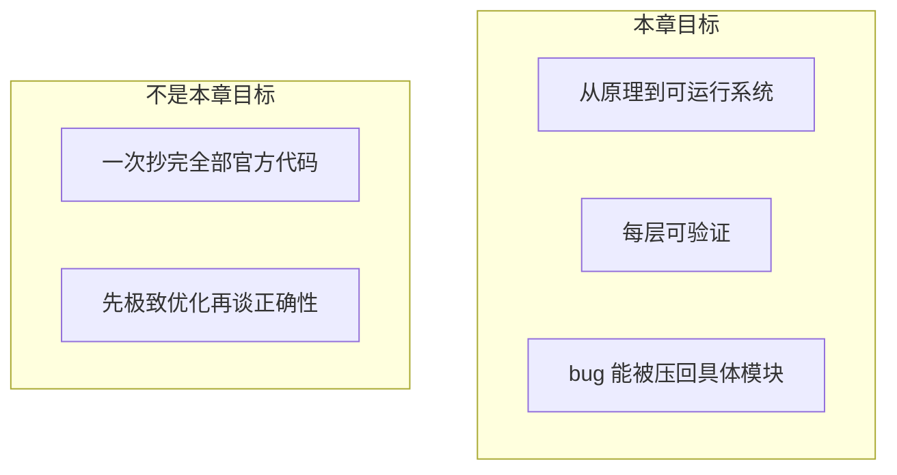
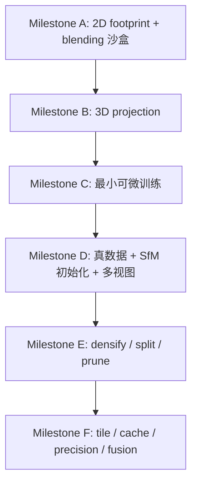
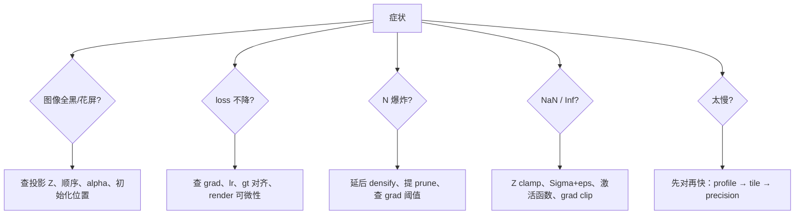
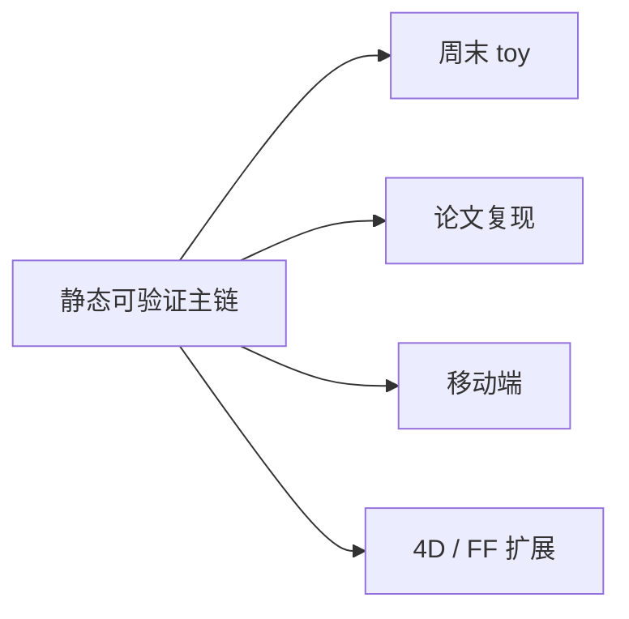
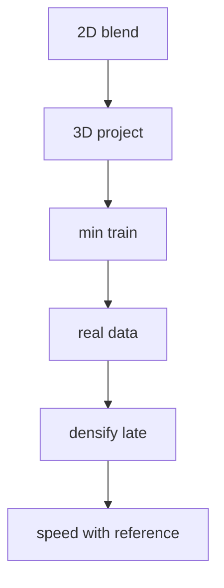

# 第 9 章：如果你要自己实现 3DGS，第一步该先写什么，怎么验证，卡住时该看哪里

**本章核心问题**：前面几章已经分别解释了表示、渲染、损失、初始化、训练闭环与推理优化。现在问题变成：

> 如果你不想只停留在“我看懂了原理”，而是想自己从零搭一版能工作的 3D Gaussian Splatting（3DGS），应该按什么顺序把这些知识落成代码？为什么 **实现顺序 [implementation order]** 本身，就是工程成败的一部分？

如果前面几章解决的是：

```text
为什么它能表示
为什么它能渲染
为什么它能训练
为什么它还能跑快
```

那么这一章解决的就是：

```text
如果我要自己实现
第一步该先写什么
每一步该怎么验
出问题时先怀疑哪一层
```

先把主线写在前面：

```text
真正好的实现路径
不是按官方仓库的文件夹顺序抄
也不是一上来就把训练、densify、CUDA 全堆上去

而是按依赖关系一层层搭：
先做一个能看见的最小 forward
再做一个能下降的最小训练
再做结构编辑 densify / split / prune
最后再做加速和变体

每一层都要有检查图 [diagnostic visualization]
和明确的验收标准 [acceptance criteria]
```

这一章本质上是在做一件事：

> 把第 3 章到第 8 章的“原理地图”，压成一条真正可执行的实现路径 [implementation roadmap]。

---

## 阶段 1 — 定界问题 [problem framing]

### 1.1 你真正要交付的是什么

成功标准不是“仓库里文件很多”，而是：

| 里程碑 | 你能证明什么 |
|--------|--------------|
| 能成像 | 给定若干 Gaussian，能稳定 render 出合理图像 |
| 能学习 | loss 下降，参数沿合理方向更新 |
| 能接真数据 | SfM / COLMAP 初始化后进入可训练区间 |
| 能自适应容量 | densify / prune 后 `N` 先升后稳，而不是爆炸 |
| 能加速 | 相对 **慢速参考实现 [slow reference]**，帧时间下降且输出几乎不变 |

### 1.2 In scope / Out of scope

| In scope | Out of scope（本章不硬推） |
|----------|----------------------------|
| 实现顺序与验证策略 | 完整生产级 CUDA 全部细节 |
| 2D sandbox → 3D → train → densify → speed | 4D / feed-forward（第 10–11 章） |
| debug checklist 与分层排错 | 刷 SOTA 指标竞赛 |
| 最小仓库骨架 | 大规模分布式训练 |



### 1.3 为什么“先跑通官方代码”≠“我会实现”

跑通官方代码当然有价值：你能看到数据长什么样、最终效果大概什么级别、常见超参怎么设。

但它更多给你：

```text
黑盒使用经验
```

而不是：

```text
如果我要自己写
我知道先搭哪块骨架
以及这块骨架该怎么验
```

第 9 章补的就是后者。

### 1.4 一个会害你的直觉

```text
功能越全越好，一次写完更有成就感
```

在 3DGS 里，这通常等价于：

```text
把所有层的 bug 同时引爆
然后无法定位
```

正确节奏是：

```text
每一层先做成一个可验证的小闭环
再往上叠下一层
```

---

## 阶段 2 — 拆到基石 [first principles]

### 2.1 质疑常见假设

| 常见假设 | 质疑 | 基石 |
|---------|------|------|
| 「按论文章节顺序写代码就行」 | 论文叙述顺序 ≠ 依赖可验证顺序 | 实现必须按 **可测试依赖** 排序 |
| 「3D 问题当然从 3D 开始」 | 3D 投影错误会被误判成 blending 错误 | 先在 2D 验证 footprint + alpha blending |
| 「densify 是 3DGS 灵魂，应最先写」 | densify 会放大上游错误 | 结构编辑必须晚于稳定训练主链 |
| 「快了就说明对了」 | 错误实现也可以很快 | 必须有 slow reference 对照 |
| 「最终 PSNR 能解释一切」 | PSNR 是结果指标，不是分层探针 | 每一层需要自己的检查图 |

### 2.2 不可再拆的基石

**B1 — 分层依赖 [layered dependency]**  
坐标系错 → 投影全错 → render 错 → loss 错 → densify 把错误结构放大。  
像搭桥，不像拼乐高：底层错了，上层“功能完整”毫无意义。

**B2 — 可见闭环优先 [visible closed loop first]**  
人最容易验证的是图像。先让系统“能看见”，再谈“能学习”“能自适应”“能加速”。

**B3 — 正确性先于性能 [correctness before performance]**  
任何加速（tile、cache、FP16、fusion）都可能 subtly 改输出。没有参考版，你无法知道快的是对的还是错的。

**B4 — 一次只引入一个复杂度源**  
COLMAP + 投影 + SSIM + densify + CUDA 同时上，等于同时引入五个独立故障源。

**B5 — 诊断要分层 [layered diagnostics]**  
全黑、loss 不降、`N` 爆炸、帧率低，是不同层的症状，应使用不同探针，而不是一锅乱改学习率。

**B6 — densify 是放大器**  
它放大的是“当前梯度与 radii 统计所认为的结构需求”。上游若在胡说，它就帮你更快地胡说到爆显存。

```text
            可维护的 3DGS 实现
                    ↑
     分层验收 + 慢速参考 + densify 后置
                    ↑
   B1 依赖 / B2 可见闭环 / B3 正确优先
   B4 单复杂度 / B5 分层诊断 / B6 densify 放大器
```

---

### 加餐怎么读：生活类比 + 失败对照

后面每张概念卡（以及「症状分层排查」大主题）都补了两块「加餐」。阅读建议：

1. **先读 Origin / Core idea**（建立基石）  
2. **再读生活类比**（用画面记住，但必须能说回基石）  
3. **最后读失败对照**（知道错会怎样，比只知道对更重要）

技能约束（第一性原理 skill）在这里仍然有效：

> 隐喻可以用，但必须映射回定义与约束；不能只听故事。搭桥、沙盘、体检分层——都只是脚手架；真正要钉住的是可测试依赖、每层检查图、slow reference、densify 后置。

一张总导航（类比 → 基石 → 3DGS 症状）：

| 概念 | 一个够用的生活画面 | 基石一句话 | 3DGS 里做错时常见症状 |
|------|-------------------|------------|------------------------|
| Implementation order | 先桥墩再桥面，不按兴趣堆功能 | 按可测试依赖排序里程碑 | 五层 bug 缠死，无从下刀 |
| 2D sandbox | 沙盘推演，不先开真飞机 | 先验证 footprint + blending | 投影错被误判成 blending 错 |
| Layer verification | 每层质检章，不只看出厂总分 | 每层输入/输出/探针/标准 | 只盯 PSNR，定位靠猜 |
| Minimal train loop | 先证明方向盘能动车 | `render→L1→backward→step` | 全配置上马，失败五因难分 |
| Densify late | 地基未稳不盖楼加层 | 固定 `N` 先稳，再结构编辑 | `N` 爆炸、显存崩、误判策略 |
| Slow reference | 保留标准尺，量每一刀加速 | 正确但慢作 oracle | 快但错；回归失锚 |
| Debug checklist | 分诊台：发烧≠骨折同一套药 | 症状→层→探针→动作 | 一律改 lr，越改越玄 |
| 症状分层排查 | 急诊分诊红色通道 | 全黑/不降/NaN/N爆/慢分路 | 多症状一锅炖 |

---

## 概念卡合集

### 概念卡 1 — Implementation Order

| 字段 | 内容 |
|------|------|
| **English name** | Implementation order / milestone roadmap |
| **中文 [English]** | 实现顺序 / 里程碑路线 [implementation order] |
| **Origin** | 复杂系统工程：按可测试依赖集成，而不是按兴趣堆功能 |
| **Core idea** | 2D sandbox → 3D projection → minimal train → real data → densify → speed |
| **Why not alternatives** | “一次写完”导致不可调试；“先抄 CUDA”导致不知对错 |
| **In 3DGS** | 与第 3–8 章模块一一映射，每层一张检查图 |
| **PyTorch or pseudocode** | 见 Milestone A–F 代码骨架 |
| **Common confusions** | 把官方目录顺序当成唯一正确实现顺序 |

#### 生活类比（必须映射回基石）

把 **implementation order** 想成造桥：先桥墩（2D 成像语义），再桥面梁（3D 投影），再通车试验（最小训练），再接真路网（SfM 数据），再加匝道（densify），最后才铺快车道（推理加速）。按「我想先铺沥青」开工，桥会塌。

| 生活画面 | 对应基石 |
|----------|----------|
| 下层错则上层“功能完整”无意义 | B1 分层依赖 |
| 先能看见车过，再谈智能调度 | B2 可见闭环优先 |
| 一次只加一种新复杂度 | B4 单复杂度源 |
| 论文目录 ≠ 施工工序 | 叙述顺序 ≠ 可测试依赖顺序 |

> 类比到此为止。基石是：里程碑按依赖可验证排序：sandbox → project → train → data → densify → speed。

#### 失败对照：做对 vs 做错

| 场景 | 做对 | 做错时你看到什么 |
|------|------|------------------|
| 周末两天计划 | 只锁 Milestone A–C | 开篇就抄 CUDA + densify，两天全花在环境 |
| 对标论文 | 先慢速正确再追指标 | 功能堆满仍全黑，不知哪层 |
| 读官方仓库 | 映射模块到你的里程碑 | 按文件夹顺序“从左写到右” |
| 加新功能 | 新层自带检查图 | 功能越多越不可调试 |

```text
症状速记：
  「什么都写了什么都不对」→ 实现顺序反了，复杂度同时爆炸
  「官方能跑我不能」→ 你可能在未验证层上叠了优化层
```

---

### 概念卡 2 — 2D Sandbox

| 字段 | 内容 |
|------|------|
| **English name** | 2D sandbox |
| **中文 [English]** | 二维沙盒 [2D sandbox] |
| **Origin** | 先在最低维验证核心 imaging 语义 |
| **Core idea** | 给定 `mu_2d, Sigma_2d, alpha, color`，验证 footprint + front-to-back blending |
| **Why not alternatives** | 直接 3D 会把相机外参错误与 blending 错误缠在一起 |
| **In 3DGS** | 是整条 render 链的地基；不过这一关，后面无权谈训练 |
| **PyTorch or pseudocode** | 见 3.2 节 |
| **Common confusions** | 觉得“太 toy 没价值”；其实它隔离了最多根因 |

#### 生活类比（必须映射回基石）

**2D sandbox** 像飞行沙盘：先在桌上推演「椭圆印章怎么叠出半透明颜色」，再上真飞机（3D 相机）。沙盘丑一点没关系，但叠法错了，真飞只会更惨，且分不清是仪表错还是空气动力学错。

| 生活画面 | 对应基石 |
|----------|----------|
| 已知印章参数盖图 | 给定 `mu_2d, Sigma_2d, alpha, color` |
| 验证软边与前后遮挡 | footprint + front-to-back blending |
| 隔离变量 | 去掉外参/投影，专治成像语义 |
| “太 toy”其实是最大滤镜 | 不过关无权谈训练（B2） |

> 类比到此为止。基石是：最低维验证核心 imaging；错误隔离比“看起来高级”更值钱。

#### 失败对照：做对 vs 做错

| 场景 | 做对 | 做错时你看到什么 |
|------|------|------------------|
| 首周目标 | 手调几个 2D 高斯叠出可预期图 | 直接 COLMAP+3D，全黑且五因纠缠 |
| 验收 | 可视化权重、前后遮挡关系 | 只 print 一个 loss 数字 |
| 遮挡测试 | 近大远小、前不透明挡后 | 颜色相加过曝，误以为是学习率 |
| 进 3D 门槛 | sandbox 图“肉眼合理” | sandbox 未过就写 densify |

```text
症状速记：
  「3D 全黑但不知道怪谁」→ 回去问 sandbox 过了没
  「椭圆是方的/硬边」→ footprint 或 covariance 路径先修
```

---

### 概念卡 3 — Layer-by-layer Verification

| 字段 | 内容 |
|------|------|
| **English name** | Layer-by-layer verification |
| **中文 [English]** | 逐层验证 [layer-by-layer verification] |
| **Origin** | 单元测试思想在可微渲染系统中的对应物 |
| **Core idea** | 每层有输入契约、输出契约、可视化探针、通过标准 |
| **Why not alternatives** | 只看最终 PSNR 无法定位；只看 loss 曲线会误判 |
| **In 3DGS** | 表示统计图、投影椭圆 overlay、pred/gt/diff、`N` 曲线、tile 热图 |
| **PyTorch or pseudocode** | `assert_layer_X(...); save_debug_image(...)` |
| **Common confusions** | 把 assert 当成“妨碍迭代的啰嗦事” |

#### 生活类比（必须映射回基石）

**Layer-by-layer verification** 像流水线每站盖质检章：原料尺寸、焊接强度、喷漆色差各有探针。只看出厂总分（最终 PSNR），坏件会流入下一站还被“调学习率”掩盖。

| 生活画面 | 对应基石 |
|----------|----------|
| 每站输入/输出契约 | 层接口断言 |
| 可视化探针 | overlay / diff / 热图 / 曲线 |
| 通过标准写死 | 可重复的 go/no-go |
| 总分不能代替分站 | PSNR 是结果指标不是分层探针（B5） |

> 类比到此为止。基石是：每层自带检查图与契约；定位靠分层，不靠最终分数玄学。

#### 失败对照：做对 vs 做错

| 场景 | 做对 | 做错时你看到什么 |
|------|------|------------------|
| 投影层 | `mu_2d` overlay 叠在 gt 上 | 直接 beauty render，投影飞了看不出来 |
| 训练层 | pred/gt/diff 三联图 | 只看 loss 平滑，图其实在抖 |
| 结构层 | `N(t)`、透明度直方图 | densify 后 silently 爆显存 |
| 性能层 | 与 reference 图像差 | 只报 FPS |

```text
症状速记：
  「PSNR 还行但结构歪」→ 缺几何层探针
  「assert 烦人」→ 省下的时间会在联调夜加倍奉还
```

---

### 概念卡 4 — Minimal Differentiable Loop

| 字段 | 内容 |
|------|------|
| **English name** | Minimal differentiable training loop |
| **中文 [English]** | 最小可微训练闭环 [minimal differentiable loop] |
| **Origin** | 先证明“误差能改参数、参数能改图” |
| **Core idea** | `render → L1 → backward → step`，暂不上全套 SSIM/densify/加速 |
| **Why not alternatives** | 一上来全配置，失败时不知道是 loss、grad 还是数据问题 |
| **In 3DGS** | 验证 grad 流入 `mu/scale/rot/opacity/SH` 且图像改进 |
| **PyTorch or pseudocode** | 见 Milestone C |
| **Common confusions** | 认为不用 SSIM 就不算 3DGS；早期 L1 是调试友好选择 |

#### 生活类比（必须映射回基石）

**Minimal differentiable loop** 像先证明方向盘能带动轮子：打一点方向，车头应转。先别上自适应悬挂、涡轮和赛道模式（SSIM/densify/CUDA）。方向盘本身断了，调轮胎气压没用。

| 生活画面 | 对应基石 |
|----------|----------|
| 最小闭环 | `render → L1 → backward → step` |
| 打方向应有反应 | grad 非 `None` 且图像改进 |
| 先 L1 后复杂 loss | 调试友好，少一个故障源 |
| 证明可学再加料 | B2 可见闭环 + B4 单复杂度 |

> 类比到此为止。基石是：先证明误差能改参数、参数能改图；全配置是后话。

#### 失败对照：做对 vs 做错

| 场景 | 做对 | 做错时你看到什么 |
|------|------|------------------|
| 首训 | 固定 `N`、L1、小数据 | 全套 loss+densify+AMP，loss 不降五因难分 |
| 梯度探针 | 打印各参数 `grad` 范数 | `grad is None` 过了很久才发现 |
| 验收 | 同视角 pred 逐渐贴 gt | loss 降但图更糟（算了错的量） |
| SSIM | 闭环通后再加 | 早期 SSIM 数值行为掩盖 L1 问题 |

```text
症状速记：
  「loss 不动」→ 先查闭环是否真可微，再谈 lr
  「没 SSIM 就不算」→ 早期调试请放下仪式感
```

---

### 概念卡 5 — Densify Late

| 字段 | 内容 |
|------|------|
| **English name** | Densify late / deferred density control |
| **中文 [English]** | 延后致密 [densify late] |
| **Origin** | 结构编辑依赖可信梯度与 radii 统计 |
| **Core idea** | 固定 `N` 的系统先能稳定下降，再引入 clone/split/prune |
| **Why not alternatives** | 早期 densify 常导致 `N` 爆炸、显存崩溃、误判策略 |
| **In 3DGS** | 典型实现会有 warm-up 步数后才开启 densify |
| **PyTorch or pseudocode** | `if step > densify_from and step % interval == 0: densify()` |
| **Common confusions** | “没有 densify 就不是 3DGS”；它是增强，不是地基 |

#### 生活类比（必须映射回基石）

**Densify late** 像地基未测稳就不要加盖楼层：clone/split 是「加房间」的结构编辑。上游梯度若在胡说，densify 会帮你**更快地胡说到爆显存**——它是放大器，不是救生圈。

| 生活画面 | 对应基石 |
|----------|----------|
| 先稳再加建 | 固定 `N` 训练主链先收敛迹象 |
| 加层放大晃动 | B6 densify 是放大器 |
| warm-up 后再 densify | `step > densify_from` |
| 加层 ≠ 房子定义本身 | densify 是增强，不是地基 |

> 类比到此为止。基石是：结构编辑必须晚于可信梯度与 radii 统计；否则 `N` 爆炸掩盖真相。

#### 失败对照：做对 vs 做错

| 场景 | 做对 | 做错时你看到什么 |
|------|------|------------------|
| 接入时机 | loss 稳定下降、投影合理后再开 | 第 0 步 densify，`N` 火箭升空 |
| 阈值/阈值 | 与 prune 配套，看 `N(t)` | 只 clone 不 prune，显存 OOM |
| 诊断 | densify 前后分层看图 | 把上游 render bug 当成“不够密” |
| 心理 | 承认无 densify 也可验主链 | “不 densify 就不算实现成功” |

```text
症状速记：
  「N 爆炸」→ 过早/过频 densify 或 grad 阈值离谱
  「越 densify 越糊」→ 放大器放大了错误梯度
```

---

### 概念卡 6 — Slow Reference Implementation

| 字段 | 内容 |
|------|------|
| **English name** | Slow reference implementation |
| **中文 [English]** | 慢速参考实现 [slow reference] |
| **Origin** | 数值软件与编译器优化的经典对照法 |
| **Core idea** | 保留正确但慢的路径；每个加速改动都与之比图像差与时间 |
| **Why not alternatives** | 只看 FPS 会把 bug 当优化；无参考则回归测试失锚 |
| **In 3DGS** | 朴素 per-pixel 或未 fusion 的清晰实现作 oracle |
| **PyTorch or pseudocode** | `assert psnr(fast, slow) > thr` |
| **Common confusions** | 优化后删掉 reference，导致后续无法回归 |

#### 生活类比（必须映射回基石）

**Slow reference** 像保留一把标准尺：机床（tile/fusion/FP16）可以越改越快，但每改一刀都要用标准尺量工件。没有尺，你会把“削错尺寸却出货快”当成工艺进步。

| 生活画面 | 对应基石 |
|----------|----------|
| 正确但慢的手算/朴素实现 | oracle 路径 |
| 每刀加速 diff 图像 | `psnr(fast, slow) > thr` |
| 删掉标准尺 | 回归失锚（B3） |
| 快 ≠ 对 | 错误实现也可以很快 |

> 类比到此为止。基石是：正确性先于性能；reference 是性能改动的锚，不是临时脚手架。

#### 失败对照：做对 vs 做错

| 场景 | 做对 | 做错时你看到什么 |
|------|------|------------------|
| 引入 tile | 同 pose 比 fast vs slow | FPS 翻倍但边缘高斯消失 |
| CI/自测 | 保留 reference 开关 | 优化后删参考，“以后靠感觉” |
| 精度改动 | FP16 与 FP32 ref 定量 | 闪一下被忽略 |
| 调试哲学 | 先对再快 | 先快再找为什么花 |

```text
症状速记：
  「优化后画面微歪但 FPS 好看」→ 缺 reference 门禁
  「后来改不动了」→ 锚已丢，每次加速都在赌
```

---

### 概念卡 7 — Debug Checklist

| 字段 | 内容 |
|------|------|
| **English name** | Debug checklist |
| **中文 [English]** | 调试清单 [debug checklist] |
| **Origin** | 故障树：症状 → 层 → 探针 → 动作 |
| **Core idea** | 全黑 / loss 不降 / NaN / N 爆炸 / 慢，分别走不同排查路径 |
| **Why not alternatives** | 无清单时人们倾向于随机改 lr |
| **In 3DGS** | 见阶段 3 末尾总表 |
| **PyTorch or pseudocode** | 打印 `mu.grad`、检查 `Z>0`、overlay 投影中心等 |
| **Common confusions** | 把所有问题都归因于“学习率不对” |

#### 生活类比（必须映射回基石）

**Debug checklist** 像急诊分诊：发烧、骨折、中毒不是同一套药。全黑偏几何/成像，loss 不降偏闭环/数据，`N` 爆炸偏 densify，NaN 偏数值，慢偏 profile——**症状分层**（B5），不是一律「把学习率拧两下」。

| 生活画面 | 对应基石 |
|----------|----------|
| 分诊台分流 | 症状 → 层 → 探针 → 动作 |
| 红标全黑 | 投影 `Z`、顺序、alpha、初始化 |
| 黄标不学习 | grad、lr、gt 对齐、可微性 |
| 紫标结构爆炸 | densify 时机/阈值/prune |
| 灰标太慢 | 先正确再 profile（第 8 章） |

> 类比到此为止。基石是：分层诊断；不同症状不同探针，禁止一锅乱改。

#### 失败对照：做对 vs 做错

| 场景 | 做对 | 做错时你看到什么 |
|------|------|------------------|
| 全黑 | overlay `mu_2d`、查 `Z>0` | 先把 lr 乘 10 |
| loss 不降 | 查 `grad` 与相机-gt 配对 | 疯狂换 SSIM 权重 |
| `N` 爆炸 | 延后 densify、查阈值 | 加更多 densify“补细节” |
| 慢 | 先与 reference 对齐再优化 | 一边错一边 fusion |
| 多症状并发 | 一次只追一条主诉 | 同时改五处，无法归因 |

```text
症状速记：
  「所有问题都怪 lr」→ 清单失踪
  「越改越玄」→ 同时引入多个复杂度源（违反 B4）
```

---

## 阶段 3 — 自底向上重建：六条里程碑

### 3.0 总路线图



| 你要解决的问题 | 核心概念 / 公式 | 建议模块 | 第一张检查图 |
|----------------|-----------------|----------|--------------|
| 一个 Gaussian 存什么 | `G={mu, Sigma, alpha, sh}` | `scene/gaussians.py` | 参数 shape 与统计 |
| 2D 如何成像 | footprint + front-to-back | `render/blend.py` | 椭圆叠放关系 |
| 世界如何进相机 | `mu_cam=R mu+t` | `render/project.py` | `z>0` 点在前方 |
| 3D 椭球→2D | `Sigma_2d≈J Sigma_cam J^T` | `render/project.py` | 椭圆 overlay |
| 如何开始学 | `L1` 再 `L1+SSIM` | `train/losses.py` | loss 下降曲线 |
| 第一批从哪来 | SfM 点云初始化 | `data/colmap_loader.py` | 初始轮廓 |
| 容量如何调 | densify/prune | `train/density_control.py` | `N` 曲线 |
| 如何跑快 | tile/cache/bandwidth | `render/tile.py`, `tools/profile.py` | 帧时间 + 与 reference 的差 |

你会发现：第 9 章 **没有引入新数学**。它只是把已有零件按依赖重新排序。

---

### 3.1 Milestone A — 2D sandbox：先让椭圆会“正确地叠”

#### 为什么这一步值钱

你暂时不需要：

- world-to-camera 还是 camera-to-world
- COLMAP 是否翻轴
- `J` 是否数值炸裂
- 多视图 loss 是否打架

你只需要确认：

> 若已有 `mu_2d, Sigma_2d, alpha, color`，你能否把它们稳定混成一张图。

#### 核心公式（再啰嗦一遍也值得）

二次型与 footprint：

```text
q(p) = (p - mu_2d)^T * Sigma_2d^{-1} * (p - mu_2d)
g(p) = exp(-1/2 * q(p))
w(p) = alpha * g(p)
```

front-to-back：

```text
T_1(p) = 1
C(p) = sum_i T_i(p) * w_i(p) * c_i
T_{i+1}(p) = T_i(p) * (1 - w_i(p))
```

#### 最小 PyTorch 沙盒

```python
import torch

def render_2d_gaussians(mus, Sigmas, alphas, colors, H=128, W=128, order=None):
    """
    mus:     [N, 2]
    Sigmas:  [N, 2, 2]
    alphas:  [N]
    colors:  [N, 3]
    """
    device = mus.device
    ys, xs = torch.meshgrid(
        torch.arange(H, device=device),
        torch.arange(W, device=device),
        indexing="ij",
    )
    pix = torch.stack([xs, ys], dim=-1).float()  # [H,W,2]

    if order is None:
        order = torch.arange(mus.shape[0], device=device)

    C = torch.zeros(H, W, 3, device=device)
    T = torch.ones(H, W, 1, device=device)

    for i in order:
        mu = mus[i]
        Sigma = Sigmas[i] + 1e-4 * torch.eye(2, device=device)
        inv = torch.linalg.inv(Sigma)
        d = pix - mu
        q = torch.einsum("...i,ij,...j->...", d, inv, d)
        g = torch.exp(-0.5 * q)[..., None]
        w = alphas[i] * g
        C = C + T * w * colors[i]
        T = T * (1.0 - w)

    C = C + T * 1.0  # 白背景
    return C.clamp(0, 1)
```

#### 验收标准（必须可视化）

1. 交换两个高斯的前后 order，遮挡关系真的改变。  
2. 把椭圆拉细、旋转，亮斑形状跟着变，而不是糊成圆。  
3. 图像不是全黑、不是全 1、没有大片 NaN。  

如果这层不过关：

```text
后面所有“3D 问题”都还没资格讨论
你只是在更复杂地犯同一个错
```

---

### 3.2 Milestone B — 接上 3D → 2D projection

#### 目标不是“画面像”，而是“投影几何对”

核心三条：

```text
mu_cam = R * mu_world + t
Sigma_cam = R * Sigma_world * R^T

u = fx * X/Z + cx
v = fy * Y/Z + cy

J = [[fx/Z, 0, -fx*X/Z^2],
     [0, fy/Z, -fy*Y/Z^2]]
Sigma_2d ≈ J * Sigma_cam * J^T
```

#### 第一张最值钱的图不是 final render，而是投影调试图

```text
把所有 mu_2d 画成散点
再把若干 Sigma_2d 椭圆 overlay 在图像上
```

一次能暴露：

| 现象 | 优先怀疑 |
|------|----------|
| 整体偏出画面 | 外参方向 / 坐标系 |
| 上下翻转或镜像 | 轴约定、像素原点 |
| 椭圆离谱地大 | `Z` 太小、scale 爆炸、`J` 错 |
| 椭圆接近退化 | `Sigma_2d` 不正定、缺 `eps*I` |
| 很多点 `Z<=0` | 可见性剔除缺失、位姿错 |

#### 常见四个坑（请当真）

**坑 1：world-to-camera 与 camera-to-world 混用**  
公式“看起来都对”，点永远落不对。

**坑 2：`Z` 接近 0 或在相机后方**  
`fx/Z` 爆炸。工程上：

```python
z = mu_cam[:, 2].clamp_min(1e-6)
valid = mu_cam[:, 2] > z_near
```

**坑 3：`Sigma_2d` 数值奇异**  

```python
Sigma_2d = Sigma_2d + eps * torch.eye(2, device=Sigma_2d.device)
```

**坑 4：把投影错误误判成“训练不收敛”**  
此时训练还没上场。你只是在验几何主链。

#### 投影层最小代码骨架

```python
def project_gaussians(mu_w, cov_w, R, t, fx, fy, cx, cy, eps=1e-6):
    # mu_w: [N,3], cov_w: [N,3,3], R: [3,3], t: [3]
    mu_c = (R @ mu_w.T).T + t
    z = mu_c[:, 2].clamp_min(eps)
    u = fx * mu_c[:, 0] / z + cx
    v = fy * mu_c[:, 1] / z + cy
    mu_2d = torch.stack([u, v], dim=-1)

    cov_c = R @ cov_w @ R.T  # 需按 batch 仔细实现
    # J: [N,2,3]
    J = mu_c.new_zeros(mu_c.shape[0], 2, 3)
    J[:, 0, 0] = fx / z
    J[:, 0, 2] = -fx * mu_c[:, 0] / (z * z)
    J[:, 1, 1] = fy / z
    J[:, 1, 2] = -fy * mu_c[:, 1] / (z * z)
    Sigma_2d = J @ cov_c @ J.transpose(-1, -2)
    Sigma_2d = Sigma_2d + eps * torch.eye(2, device=mu_w.device)
    return mu_2d, Sigma_2d, mu_c[:, 2]
```

（生产代码要对 batch 协方差乘法更严谨；这里强调结构。）

---

### 3.3 Milestone C — 最小可微训练闭环

#### 先证明这件事

```text
图像误差确实能把固定数量的高斯往更好方向推
```

#### 骨架

```python
rendered = render(gaussians, camera)
loss = (rendered - gt_image).abs().mean()  # 先 L1

optimizer.zero_grad(set_to_none=True)
loss.backward()
optimizer.step()
```

早期甚至可以不上 SSIM。不是 SSIM 不重要，而是：

> 先让系统会走，再让它走得更漂亮。

完整图像项以后再上：

```text
L_img = (1 - lambda_dssim) * L1 + lambda_dssim * (1 - SSIM)
```

#### 验收时你应该看到

- loss 稳定下降（允许噪声，但趋势向下）  
- render 从乱到有轮廓  
- `mu.grad / scale.grad / opacity.grad` 不是长期全 0  
- 手动拨参数时：  
  - 动 `mu` → 结构平移  
  - 动 scale/rot → 模糊方向与宽度变  
  - 动 opacity → 遮挡/透射变  
  - 动颜色/SH0 → 外观变  

#### 梯度探针

```python
def grad_report(named_params):
    for name, p in named_params:
        if p.grad is None:
            print(f"{name}: grad=None")
        else:
            print(f"{name}: mean={p.grad.abs().mean().item():.3e} "
                  f"max={p.grad.abs().max().item():.3e}")
```

若全部 `grad=None`：计算图断了（`detach` 过度、非可微路径、错误 `no_grad`）。  
若 grad 爆炸：检查 `Z`、协方差正定、learning rate、初始化 scale。

---

### 3.4 Milestone D — 真数据、SfM 初始化、多视图

到这里才值得接第 6、7 章的真实闭环。

#### 初始化直觉（复习式复述）

```text
mu_i ← SfM 点
color ← 观察色
scale ← 邻域距离 / 重投影启发式
opacity ← 中等起点（logit 空间）
SH 高阶 ← 0，DC 对齐颜色
```

内部参数化常见：

```text
scale = log(s)
opacity = sigmoid(logit)
rotation = quaternion normalize
```

#### 这一层先验的不是最终 PSNR，而是“是否进入可训练区间”

检查清单：

- [ ] 初始 render 非全黑非全白  
- [ ] 投影中心覆盖物体区域  
- [ ] scale 直方图无极端长尾  
- [ ] opacity 未全体贴 0 或 1  
- [ ] 多视图下位姿与图像对应正确（最常见数据坑）  

#### 多视图训练时盯的曲线

| 曲线 | 含义 |
|------|------|
| L1 / L_img / PSNR | 整体是否变好 |
| `N` | 结构是否膨胀（本阶段若固定 N，应几乎平） |
| opacity 分布 | 是否堆死高斯 |
| scale 分布 | 细化还是飞掉 |

标志性成功：

> 你拿到一条能在真实静态场景上稳定训练的主链——即使画质还没论文好看。

---

### 3.5 Milestone E — densify / split / prune 必须晚到

#### 为什么不能早

densify 依赖：

- render 对  
- loss 能降  
- 梯度方向大致可信  
- radii / footprint 统计可信  
- optimizer 状态管理稳（新增高斯怎么加 moment）  

否则你看到的是：

```text
N 疯狂增长
新高斯乱飞
显存暴涨
loss 更不稳
```

而你误以为“densify 超参错了”。其实常常是：

```text
主链未稳，densify 只是把错误更快放大
```

#### 合理接入条件

先成立：

```text
固定 N 的系统已能稳定下降并得到粗糙但正确结果
```

再启用：

```text
梯度大 + footprint 不大  -> clone
梯度大 + footprint 很大  -> split
长期几乎无贡献          -> prune
```

#### 时序伪代码

```python
for step in range(max_steps):
    img = render(gaussians, cam)
    loss = image_loss(img, gt)
    loss.backward()
    optimizer.step()
    optimizer.zero_grad(set_to_none=True)

    if step < densify_from_iter:
        continue  # warm-up：只调参，不改结构

    if step % densify_interval == 0 and step < densify_until_iter:
        densify_and_prune(gaussians, grad_stats, radii, optimizer)
```

#### 结构层验收

理想：

```text
前期 N 上升 → 中期继续细化 → 后期增速变慢并趋稳
```

危险：

```text
N 从头到尾指数爆炸
```

那是失控扩容，不是变强。

---

### 3.6 Milestone F — 性能优化建立在 slow reference 之上

现在才进入第 8 章的世界。

#### 为什么必须保留慢速参考版

加速常见副作用：

- 图像 subtly 变化  
- 边缘顺序差一点  
- 某些视角才闪  
- early stop 过激进导致“洞”  

这些不一定报错。所以：

> 每做一次加速，都拿 slow reference 做对照。

```python
with torch.inference_mode():
    img_ref = render_ref(gaussians, camera)
    img_fast = render_fast(gaussians, camera)

diff = (img_ref - img_fast).abs()
print(diff.max().item(), diff.mean().item())
# 也可报 PSNR(img_fast, img_ref)
```

验收双条件：

```text
输出几乎不变
帧时间显著下降
```

#### 建议引入顺序

1. tile-based culling / tile mapping（吃局部性，数学链不变）  
2. 更稳的可见性剔除  
3. sort/tile cache（若相机路径连续）  
4. mixed precision  
5. kernel fusion / 更激进布局  

不要一上来 fusion：你还没有对照基线。

---

### 3.7 每一层一张检查图（实现者 vs 调参员的分界）

| 层 | 检查图 / 探针 |
|----|----------------|
| 表示 | scale/opacity 直方图；3D 中心 scatter |
| 投影 | `mu_2d` 散点 + 椭圆 overlay；出界比例 |
| 渲染 | pred / gt / abs diff |
| 训练 | loss、PSNR、各参数 grad 范数 |
| 结构 | `N vs step`、radii、prune 比例 |
| 性能 | 每 tile 负载热图、frame time breakdown、cache hit |

共同作用：

```text
把“我觉得哪里不对”
变成“我知道问题先出在哪一层”
```

---

### 3.8 一个特别实用的实验：投影椭圆 + tile 负载

```python
import numpy as np
import matplotlib.pyplot as plt
from matplotlib.patches import Ellipse, Rectangle

W, H = 320, 224
tile = 32
n_tiles_x = W // tile
n_tiles_y = H // tile

gaussians = [
    {"mu": np.array([72.0, 78.0]), "Sigma": np.array([[320.0, 90.0], [90.0, 180.0]])},
    {"mu": np.array([168.0, 112.0]), "Sigma": np.array([[520.0, -140.0], [-140.0, 260.0]])},
    {"mu": np.array([248.0, 138.0]), "Sigma": np.array([[210.0, 30.0], [30.0, 120.0]])},
]

tile_load = np.zeros((n_tiles_y, n_tiles_x), dtype=np.int32)


def ellipse_axes(Sigma, nsig=2.0):
    vals, vecs = np.linalg.eigh(Sigma)
    order = np.argsort(vals)[::-1]
    vals, vecs = vals[order], vecs[:, order]
    width = 2 * nsig * np.sqrt(vals[0])
    height = 2 * nsig * np.sqrt(vals[1])
    angle = np.degrees(np.arctan2(vecs[1, 0], vecs[0, 0]))
    return width, height, angle


fig, axes = plt.subplots(1, 3, figsize=(13, 4.2))
axes[0].set_title("projected ellipses and tile boxes")
for x in range(0, W + 1, tile):
    axes[0].axvline(x, color="lightgray", lw=0.8)
for y in range(0, H + 1, tile):
    axes[0].axhline(y, color="lightgray", lw=0.8)

for g in gaussians:
    mu, Sigma = g["mu"], g["Sigma"]
    std = np.sqrt(np.diag(Sigma))
    bbox_min, bbox_max = mu - 3 * std, mu + 3 * std
    tx0 = int(np.clip(np.floor(bbox_min[0] / tile), 0, n_tiles_x - 1))
    ty0 = int(np.clip(np.floor(bbox_min[1] / tile), 0, n_tiles_y - 1))
    tx1 = int(np.clip(np.floor(bbox_max[0] / tile), 0, n_tiles_x - 1))
    ty1 = int(np.clip(np.floor(bbox_max[1] / tile), 0, n_tiles_y - 1))
    tile_load[ty0:ty1 + 1, tx0:tx1 + 1] += 1

    w, h, ang = ellipse_axes(Sigma)
    axes[0].add_patch(Ellipse(mu, w, h, angle=ang, fill=False, edgecolor="tab:blue", lw=2))
    axes[0].add_patch(Rectangle((tx0 * tile, ty0 * tile),
                                (tx1 - tx0 + 1) * tile, (ty1 - ty0 + 1) * tile,
                                fill=False, edgecolor="tab:red", lw=1.5))
    axes[0].scatter(mu[0], mu[1], c="k", s=18)

axes[0].set_xlim(0, W); axes[0].set_ylim(H, 0); axes[0].set_aspect("equal")
im = axes[1].imshow(tile_load, cmap="magma")
axes[1].set_title("gaussians per tile")
plt.colorbar(im, ax=axes[1], fraction=0.046)
nz = tile_load[tile_load > 0]
axes[2].hist(nz, bins=np.arange(1, nz.max() + 2) - 0.5, rwidth=0.8)
axes[2].set_title("tile load histogram")
plt.tight_layout(); plt.show()
```

它训练的是习惯：

```text
复杂模块拆成中间检查图
而不是把所有正确性押在最终 render
```

---

### 3.9 最小仓库骨架（职责分离）

```text
data/
    colmap_loader.py
    dataset.py
scene/
    gaussians.py
    init_from_sfm.py
render/
    project.py
    blend.py
    tile.py
train/
    losses.py
    density_control.py
    trainer.py
tools/
    diagnostics.py
    profile.py
    reference_render.py
```

职责：

| 模块 | 只负责 | 不要塞进去 |
|------|--------|------------|
| `gaussians.py` | 参数存储与激活函数 | 训练策略 |
| `project.py` | 3D→2D | blending |
| `blend.py` | screen-space 合成 | densify |
| `density_control.py` | clone/split/prune | 相机 IO |
| `reference_render.py` | 慢而清晰的 oracle | 花式加速 |

避免：

```text
为了方便把所有逻辑揉在一个 2000 行文件里
最后任何 bug 都同时牵扯几层
```

---

### 3.10 Debug checklist 总表（卡住时按症状走）



#### 症状：全黑

1. 投影是否在画面内？overlay `mu_2d`  
2. `Z` 是否 > 0？  
3. opacity 是否全体近 0？  
4. blending 是否写成了错误累加（忘了 `T * w * c`）？  
5. 颜色是否在错误空间（全 0）？  

#### 症状：loss 不降

1. `grad` 是否存在且量级合理？  
2. gt 与相机是否配对错误？  
3. learning rate 是否过大震荡或过小不动？  
4. 是否误开 `no_grad`？  
5. 初始化是否远在可训练区间外？  

#### 症状：`N` 爆炸

1. densify 是否过早、过频？  
2. grad 阈值是否过低导致疯狂 clone/split？  
3. prune 是否形同虚设？  
4. 上游 render 是否错导致 grad 长期异常大？  

#### 症状：NaN

1. `Sigma` 求逆  
2. `Z` 过小  
3. log/scale 溢出  
4. SH 或颜色无约束爆掉  

#### 症状：慢

1. **先确认正确性**  
2. `torch.profiler` / 简易计时拆 `project/sort/tile/blend`  
3. 按第 8 章对症下药  
4. 每步与 reference 比图像差  

#### 生活类比（必须映射回基石）

把上面整张 **症状分层排查** 想成医院分诊墙：同一栋楼里急诊、骨科、检验科入口不同。你不会拿着「全身不舒服」就先做脑外科。3DGS 实现也一样——**全黑 / loss 不降 / N 爆炸 / NaN / 慢** 是五张不同的分诊单，对应 B5 分层诊断，而不是「学习率万能药」。

| 生活画面 | 对应基石 |
|----------|----------|
| 分诊单分流 | 症状 → 层 → 探针 → 动作 |
| 先问主诉再开检查 | 一次只追一条主诉（B4） |
| 慢不等于病重 | 性能问题在正确性之后处理（B3） |
| 加盖楼层前先查地基 | densify 相关症状先回看主链 |

> 类比到此为止。基石是：故障树按症状分路；清单是执行层，概念卡 7 是原则层。

#### 失败对照：做对 vs 做错

| 症状并发时 | 做对 | 做错时你看到什么 |
|------------|------|------------------|
| 全黑 + 慢 | 先修黑（几何/alpha），慢往后放 | 一边 fusion 一边全黑，更不可读 |
| loss 不降 + N 爆 | 先关 densify 验证主链 | densify 掩盖 grad 断层 |
| NaN + 一切 | 先数值夹紧与 `Sigma+eps` | 继续加 loss 项，NaN 更早出现 |
| 只记得改 lr | 打开本节清单逐步勾 | 调参一周，根因是 `Z` 或配对错误 |

```text
症状速记：
  「多症状同时出现」→ 选最上游那条（几何/可微）先打穿
  「清单在文档里但手在改 lr」→ 把清单钉在终端别名/CI 里
```

---

## 阶段 4 — 推广应用 [transfer]

### 4.1 你只有周末两天

不要试图 A–F 全做完。最小有价值路径：

```text
A 2D sandbox  →  B 投影调试  →  C 单视图 toy 训练
```

成功标准：你能讲清每层检查图，而不是 PSNR 刷高。

### 4.2 你要复现论文指标

顺序仍然不变，但 Milestone D/E 要更认真：

- 完整 `L1+SSIM`  
- 官方风格 densify 日程  
- 固定随机种子与评估协议  

仍不要跳过 A/B：很多“复现失败”其实是坐标系与数据管道。

### 4.3 你要做移动端 demo

在 F 阶段更强调：

- 参数体积与 SH 阶数  
- tile 负载热图  
- 与 reference 的质量-延迟开关  

但 **仍然** 需要桌面端 slow reference 作为正确性锚。

### 4.4 你要扩展到 4D / feed-forward

迁移原则：

```text
先有正确的静态主链
再替换/扩展其中一层
```

- 4D：扩展的是 `Theta → Theta(t)`，不是重写 blending 数学（第 10 章）  
- feed-forward：扩展的是“Theta 从哪来”，renderer 仍可复用（第 11 章）  

若静态主链不稳，动态与前馈只会把调试空间变成宇宙。



---

## 阶段 5 — 检验理解 [verification]

### 5.1 费曼摘要

1. 实现 3DGS 像搭桥：底层几何与混合不对，上层再花哨也只是更快地错。  
2. 先做 2D 椭圆混合沙盒，再接 3D 投影，再做最小训练，再接真数据，再 densify，最后加速。  
3. densify 是放大器，不是地基；主链不稳时它会帮你把显存炸穿。  
4. 每个加速都要有慢速参考版对照：又快又错等于没做。  
5. 调试靠分层检查图，不靠玄学改学习率。  



### 5.2 自测详解

#### Q1. 为什么实现顺序不能“功能越多越好”？

<details>
<summary>提示</summary>
多层系统；同时引入多个故障源；验收标准。
</details>

<details>
<summary>详解</summary>

3DGS 同时包含表示、投影、混合、损失、结构编辑、性能路径。  
一次堆上后，全黑/不降/爆炸/变慢会同时出现，你无法知道先修哪一层。  
按 Milestone 前进时，每层有独立验收，bug 被压回模块。  
顺序本身就是工程设计，不是个人习惯。

</details>

#### Q2. 为什么第一步更适合 2D sandbox？

<details>
<summary>提示</summary>
隔离相机/COLMAP；先验证 footprint+blending。
</details>

<details>
<summary>详解</summary>

2D footprint 与 alpha blending 不依赖外参与 SfM。  
若这里错了（例如不会剩余透射率递推），后面所有 3D 训练都在放大同一错误。  
2D 沙盒把复杂度降到最低，让你用肉眼验证叠放与椭圆方向。

</details>

#### Q3. 接上 3D 后，为何第一张图常是投影椭圆 overlay 而不是 final beauty render？

<details>
<summary>提示</summary>
几何探针 vs 外观结果。
</details>

<details>
<summary>详解</summary>

beauty render 把几何错误、颜色错误、混合错误混在一张图里。  
`mu_2d`+椭圆 overlay 专打几何：出界、翻转、尺度爆炸、退化协方差。  
先过几何，再谈“好不好看”。

</details>

#### Q4. 为何最小训练闭环先用 L1？

<details>
<summary>提示</summary>
调试面；梯度可解释性。
</details>

<details>
<summary>详解</summary>

早期目标是验证“可微链路通、参数能动、图像向 gt 靠”。  
L1 简单、行为直观。SSIM 很重要，但会增加实现与调参面。  
先会走，再走得漂亮——这是调试策略，不是否认 SSIM。

</details>

#### Q5. 为何 densify 必须晚于稳定训练主链？

<details>
<summary>提示</summary>
放大器；可信 grad/radii。
</details>

<details>
<summary>详解</summary>

densify 用梯度与 footprint 统计决定 clone/split。  
主链不稳时这些统计不可信，系统会无脑扩容。  
固定 `N` 先收敛到粗糙正确解，再打开结构编辑，densify 才在做“容量自适应”而不是“错误倍增器”。

</details>

#### Q6. 慢速参考版到底防什么？

<details>
<summary>提示</summary>
silent correctness bugs。
</details>

<details>
<summary>详解</summary>

加速改变计算组织，不一定 crash。  
可能只在某些视角闪一下、边缘顺序差一点。  
没有 reference，你会把 bug 当成性能胜利。  
双条件验收：图像差小 + 时间下降。

</details>

#### Q7. 图像全黑、loss 不降、N 爆炸、很慢同时出现，如何拆？

<details>
<summary>提示</summary>
按层，不要同时改一切。
</details>

<details>
<summary>详解</summary>

1. 先冻结 densify 与一切加速，退回 reference 路径。  
2. 全黑 → 投影/alpha/初始化（Milestone A/B）。  
3. 有图但不降 → grad/lr/数据对齐（C/D）。  
4. 能降但 N 爆 → densify 日程与阈值（E）。  
5. 全对但慢 → profile 后按第 8 章优化（F）。  

一次只修一层，修完看对应检查图。

</details>

#### Q8. “每一层一张检查图”比只盯 PSNR 强在哪？

<details>
<summary>提示</summary>
定位 vs 结果指标。
</details>

<details>
<summary>详解</summary>

PSNR 是结果，不告诉你是投影反了还是 densify 炸了。  
分层图把故障映射到模块：椭圆 overlay 打几何，`N` 曲线打结构，tile 热图打负载。  
这是系统实现者与只会调参的人的核心差别之一。

</details>

### 5.3 基石 ↔ 考点

| 基石 | 考点 |
|------|------|
| B1 分层依赖 | 为何不能乱序堆功能 |
| B2 可见闭环 | 为何从 2D 图像开始 |
| B3 正确优先 | slow reference |
| B4 单复杂度 | 为何先 L1、后 densify |
| B5 分层诊断 | checklist |
| B6 densify 放大器 | densify late |

---

## 一页速览 [one-page sheet]

### 基石

- 按可验证依赖实现，不按抄目录实现。  
- 2D blend → 3D project → min train → real data → densify late → speed。  
- 每层检查图 + 验收标准。  
- densify 是放大器，主链稳后再开。  
- 加速必须对照 slow reference。  

### 总图

```text
A 能看见(2D) → B 投得对(3D) → C 学得动(L1)
→ D 真数据 → E 结构自适应 → F 又快又对照
```

### 迁移提示

> 扩展 4D / feed-forward / 移动端时，只替换主链中的一层，并保留该层前后的探针；不要在不稳的静态系统上堆新范式。

### 下一章接口

下一章 [chapter_10_4d_gaussian.md](chapter_10_4d_gaussian.md) 问：

```text
如果场景开始动起来
静态 3DGS 的哪条假设先失效
4D Gaussian 到底扩展的是表示还是 renderer
```
