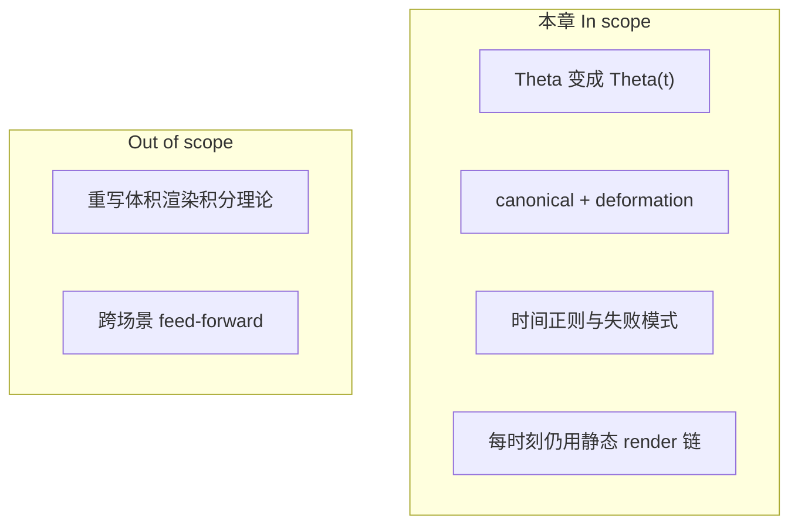
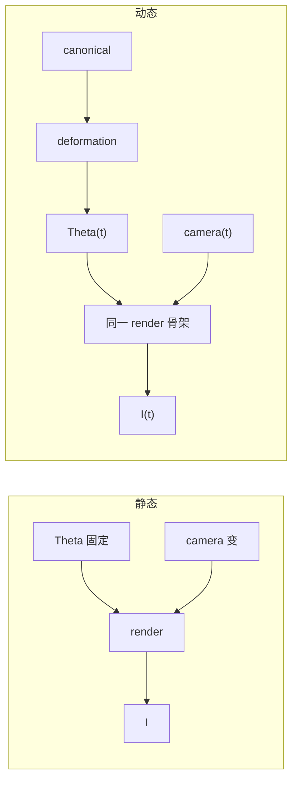
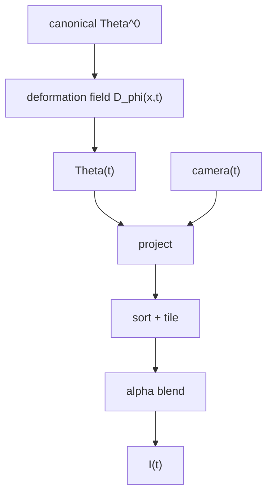
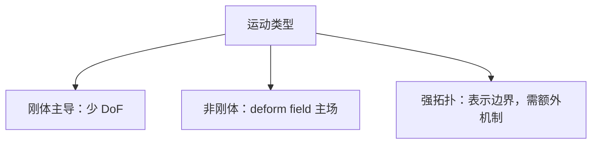
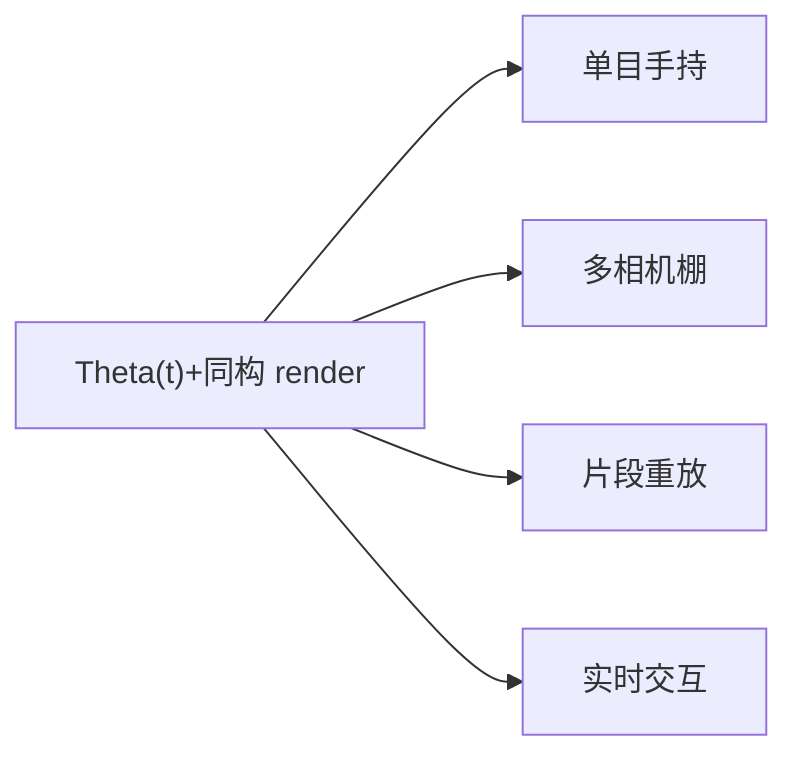
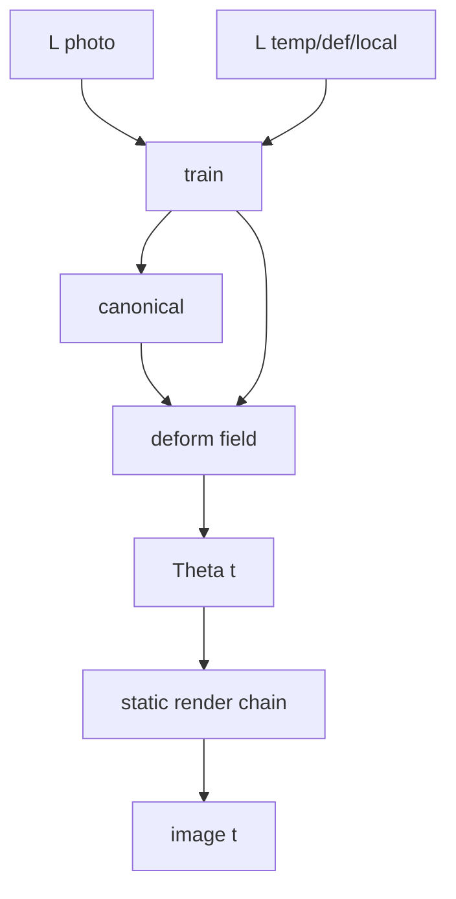

# 第 10 章：场景一旦动起来，静态 3DGS 的哪一部分先失效——4D Gaussian 到底在扩展什么

**本章核心问题**：静态 3D Gaussian Splatting（3DGS）主线已经清楚。现在问题变成：

> 如果场景本身会随时间变化，那么第 4 章那条 `Gaussian → projection → sorting → blending` 的渲染链，哪些部分仍然成立，哪些部分必须被改写？4D Gaussian Splatting（常称 4DGS / dynamic Gaussian）到底是在“加一个时间维”，还是在做更深的表示扩展？它是不是一套全新的 renderer？

如果前面几章回答的是：

- 第 3–4 章：表示与渲染  
- 第 5–7 章：目标、初始化与训练闭环  
- 第 8 章：推理为何还要优化  
- 第 9 章：如何按层实现与验证  

那么这一章回答的就是：

```text
如果场景开始动起来
静态 3DGS 为什么不够了
以及应该怎样把静态高斯系统扩展成时间相关表示
```

先把主线钉死：

```text
4DGS 的关键不是重新发明一套渲染器 [renderer]
而是把静态高斯参数改成时间函数 Theta(t)

canonical Gaussian 集合给你一个静态基底 [canonical space]
时间条件形变场 [deformation field] 告诉你它在每个时刻怎样偏移、拉伸或改变外观

到了每一个具体时刻 t
你仍然是在跑同一条 projection / sorting / blending 链
只是这条链的输入不再是固定参数，而是 Theta(t)
```

也就是说：

> 4DGS 的本质不是“把 3DGS 推翻重来”，而是“让静态高斯表示带上时间依赖，同时尽量保留原有渲染骨架”。

---

## 阶段 1 — 定界问题 [problem framing]

### 1.1 成功标准

读完本章，你应能：

1. 明确指出静态 3DGS 被动态场景打破的是哪条假设（不是投影公式本身）。  
2. 解释为何“每帧各训一套静态 3DGS”通常不是好答案。  
3. 写出 `canonical Gaussians + deformation field → Theta(t) → render` 的完整链路。  
4. 说明为何需要 temporal regularization，并列举典型 failure modes。  
5. 判断刚体、非刚体、强拓扑变化三类场景下方法边界在哪里。

### 1.2 In scope / Out of scope

| In scope | Out of scope |
|----------|--------------|
| 静态假设如何失效 | 某一个具体 4DGS 论文的全部实现细节 |
| canonical + deformation 范式 | 流体/烟雾专用物理模拟器 |
| 时间正则与自由度管理 | 完整生产级动态捕获管线 |
| 与静态 renderer 的关系 | feed-forward 跨场景（第 11 章） |



### 1.3 问题卡片

| 项 | 内容 |
|----|------|
| 输入 | 多时刻多视图图像（视频 + 相机） |
| 输出 | 可按任意时刻 `t` 查询的动态场景表示，并能渲染新视角 |
| 旧假设 | `Theta = const`，只有相机变 |
| 新现实 | 几何/外观也可能随 `t` 变 |
| 关键约束 | 单帧要像 + 时间要稳 + 参数要可负担 |

---

## 阶段 2 — 拆到基石 [first principles]

### 2.1 质疑常见假设

| 常见假设 | 质疑 | 基石 |
|---------|------|------|
| 「动态 = 需要全新 renderer」 | 固定 `t` 后成像与静态相同 | 新问题在 **表示如何随时间生成**，不在 blending 公式 |
| 「每帧一套 3DGS 最简单也最好」 | 参数 `O(T·N)`，无对应、易闪 | 需要 **跨时间共享结构** |
| 「让所有参数都随时间自由变最强」 | 过自由 → 闪烁、漂移 | 要做 **自由度管理 [DoF management]** |
| 「有图像 loss 就够」 | 逐帧可拟合但时间抖 | 需要 **temporal regularization** |
| 「canonical 必须是第 0 帧」 | 只是参考形态 | canonical 是 **共享基底**，不必等于物理第 0 帧 |

### 2.2 基石列表

**B1 — 静态 3DGS 的隐藏前提是 `Theta` 常数**  
静态系统写：

```text
G_i = {mu_i, Sigma_i, alpha_i, sh_i}
Theta = {G_i} = const
I = render(Theta, camera)
```

动态场景打破的是 `Theta = const`，不是 `render(·)` 的骨架。

**B2 — 固定时刻上，渲染退化为静态问题**  
一旦给定 `Theta(t*)`，则：

```text
I(t*) = render(Theta(t*), camera(t*))
```

与第 4 章同构。

**B3 — 跨时间需要共享结构，而非独立表格**  
视频帧之间存在对应、连续与重复模式。完全独立 `Theta_t` 不强制学习“同一物体如何运动”。

**B4 — 连续时间函数优于离散互不相干参数表（在多数可追踪运动中）**  
形变场 / 时间条件网络用更少参数表达平滑运动，并支持时间插值。

**B5 — 图像项管“像不像”，时间项管“稳不稳”**  
只有 `L_photo` 时，系统可以逐帧取巧。`L_temp / L_def / L_local` 把解压回合理轨迹。

**B6 — 表达能力与稳定性是一对张力**  
放开 `mu(t), Sigma(t), alpha(t), sh(t)` 全能变，拟合短期更强，长期更易抖。工程核心是 **哪些该变、变多少**。

**B7 — 强拓扑变化会碰到表示边界**  
撕裂、飞溅、烟雾生成/消失，不只是“同一结构移动”，固定 canonical + 平滑变形可能不够。

```text
                 4DGS 心智模型
                       ↑
        Theta(t) + 同构 render + 时间正则
                       ↑
   B1 静态假设失效 / B2 瞬时静态 / B3 共享结构
   B4 连续函数 / B5 像+稳 / B6 DoF / B7 拓扑边界
```

---

### 加餐怎么读：生活类比 + 失败对照

后面每张概念卡（以及「动态失败模式」大主题）都补了两块「加餐」。阅读建议：

1. **先读 Origin / Core idea**（建立基石）  
2. **再读生活类比**（用画面记住，但必须能说回基石）  
3. **最后读失败对照**（知道错会怎样，比只知道对更重要）

技能约束（第一性原理 skill）在这里仍然有效：

> 隐喻可以用，但必须映射回定义与约束；不能只听故事。提线木偶、标准姿势、弹性绳——都只是脚手架；真正要钉住的是 `Theta=const` 失效、`Theta(t)` + 同构 render、时间正则与自由度管理。

一张总导航（类比 → 基石 → 3DGS 症状）：

| 概念 | 一个够用的生活画面 | 基石一句话 | 3DGS 里做错时常见症状 |
|------|-------------------|------------|------------------------|
| Static assumption breaks | 静物摄影变成舞台剧 | 坏的是 `Theta` 常数，不是 render 公式 | 鬼影、糊成一条、运动解释不了 |
| Canonical Gaussians | 标准姿势人体模型 | 共享基底 `Theta^0`，各时刻由它变来 | 每帧独立、身份对不上、插值崩 |
| Deformation field | 提线/弹性场拉坐标 | `D_φ(x,t)` 产偏移，不是直接画 RGB | MLP 当图像生成器，运动不共享 |
| Temporal regularization | 电影防抖 + 动作幅度约束 | 图像项管像，时间项管稳 | 逐帧取巧闪烁；过强则动作抹平 |
| Not a new renderer | 换演员姿势，不换摄影机原理 | 瞬时仍是 project/sort/blend | 重写积分却丢掉实时链 |
| Failure modes | 舞台事故清单 | 闪/呼吸/过平滑/撕裂机制不同 | 只看单帧 PSNR，视频一播露馅 |

---

## 概念卡合集

### 概念卡 1 — Static Assumption Breaks

| 字段 | 内容 |
|------|------|
| **English name** | Breakdown of the static-scene assumption |
| **中文 [English]** | 静态场景假设失效 [static assumption breaks] |
| **Origin** | 多视图几何默认场景在采集期间固定 |
| **Core idea** | 动态时变化的不只是 camera，还有场景状态；`Theta` 必须时间化 |
| **Why not alternatives** | 假装静止会导致鬼影、模糊、无法解释运动视差 |
| **In 3DGS** | 直接否定 `mu/Sigma/...` 全局常量 |
| **PyTorch or pseudocode** | `Theta_t = deform(canonical, t)` |
| **Common confusions** | 以为坏的是投影公式；其实坏的是参数固定前提 |

#### 生活类比（必须映射回基石）

把 **static assumption breaks** 想成：你原本以为在拍静物棚，实际进了舞台剧现场——演员在走位。坏掉的不是「镜头怎么投影到底片」（render 骨架），而是「场景参数永远固定」这张合同（`Theta = const`）。

| 生活画面 | 对应基石 |
|----------|----------|
| 静物合同：东西不许动 | 静态 3DGS：`Theta` 全局常数（B1） |
| 舞台上人和道具在变 | camera 与场景状态都在变 |
| 假装没动硬拍一张长曝光 | 鬼影、糊带、错误视差 |
| 合同改为「每个时刻一份状态」 | `Theta → Theta(t)` |

> 类比到此为止。基石是：动态打破的是参数固定前提，不是投影/blending 数学本身。

#### 失败对照：做对 vs 做错

| 场景 | 做对 | 做错时你看到什么 |
|------|------|------------------|
| 诊断失败 | 先问「是否还能假设静止」 | 狂改 projection，其实该时间化 `Theta` |
| 静态模型硬训动态 | 换 4D 表示或短片段准静态 | 鬼影、四肢糊成扇形 |
| 多视图动态 | 同步时刻或显式时间戳 | 把不同时刻当同一静态场景 |
| 心智模型 | `render` 仍在，状态变了 | “4D 要换全新 renderer 课” |

```text
症状速记：
  「运动物体拖影/重影」→ 静态假设先被证伪
  「公式都抄对了仍糊」→ 可能不是公式，是 Theta 不该 const
```

---

### 概念卡 2 — Canonical Gaussians

| 字段 | 内容 |
|------|------|
| **English name** | Canonical Gaussians / canonical space |
| **中文 [English]** | 规范高斯 / 规范空间 [canonical Gaussians] |
| **Origin** | 动态重建中的标准姿势/参考空间思想 |
| **Core idea** | 一套共享的静态基底 `Theta^0`，所有时刻由它变形得到 |
| **Why not alternatives** | 每帧独立参数无共享身份、更难一致 |
| **In 3DGS** | `G_i^0=(mu_i^0, Sigma_i^0, alpha_i^0, sh_i^0)` |
| **PyTorch or pseudocode** | `canonical = ParameterDict(...);` |
| **Common confusions** | 以为 canonical 必须是 t=0 真实帧；它可以是抽象参考 |

#### 生活类比（必须映射回基石）

**Canonical Gaussians** 像动画里的「标准姿势 T-pose 网格」：角色只有一套共享骨架/蒙皮基底，各帧姿态是基底的变形，而不是每帧重新捏一个互不相干的人偶。

| 生活画面 | 对应基石 |
|----------|----------|
| T-pose / 标准体 | `Theta^0` 共享基底 |
| 各帧姿态 = 基底 + 变形 | `Theta(t) = deform(Theta^0, t)` |
| 每帧重捏一个角色 | 独立 `Theta_t`：身份对不齐（B3） |
| 标准姿势不必等于第 0 帧实拍 | canonical 可以是抽象参考 |

> 类比到此为止。基石是：跨时间共享结构，用一套基底承载运动，而不是离散互不相干参数表。

#### 失败对照：做对 vs 做错

| 场景 | 做对 | 做错时你看到什么 |
|------|------|------------------|
| 参数量 | 一份 canonical + 紧凑形变 | 每帧一套完整 3DGS，磁盘与时间炸 |
| 时间插值 | 在 canonical 上插 `t` | 邻帧无对应，中间帧鬼畜 |
| 身份 | 高斯索引/场在时间上连续 | 高光点每帧换“谁在发光” |
| 初始化 | 合理选/学 canonical | 强行 t=0 脏帧当唯一真理 |

```text
症状速记：
  「单帧还行，视频身份乱跳」→ 缺共享 canonical
  「无法做慢动作插帧」→ 离散表而非连续时间函数
```

---

### 概念卡 3 — Deformation Field

| 字段 | 内容 |
|------|------|
| **English name** | Deformation field (time-conditioned) |
| **中文 [English]** | 形变场 / 变形场 [deformation field] |
| **Origin** | 连续介质/非刚体追踪：用场描述位移 |
| **Core idea** | `D_phi(x,t)` 给出偏移；`mu(t)=mu^0 + D_phi(mu^0,t)` 等 |
| **Why not alternatives** | 逐高斯逐帧存表参数爆炸且难插值 |
| **In 3DGS** | 小网络/哈希场查询每个高斯在 `t` 的 delta |
| **PyTorch or pseudocode** | `delta = mlp(torch.cat([x, t_embed], -1))` |
| **Common confusions** | 以为 MLP 直接出整张 RGB；它只生成参数偏移，成像仍靠 renderer |

#### 生活类比（必须映射回基石）

**Deformation field** 像提线木偶上方的控制场：在空间位置 `x` 与时间 `t` 查询「该往哪拉一点」。拉的是坐标/形状参数，不是直接在幕布上画颜色——画颜色仍交给原来的灯光与合成（renderer）。

| 生活画面 | 对应基石 |
|----------|----------|
| 提线给出位移 | `D_φ(x,t)` → `Δμ` 等 |
| `μ(t)=μ⁰+Δ` | 时间条件参数偏移 |
| 场比每人每帧一本账薄 | 参数紧凑 + 可插值（B4） |
| 场不负责最终成像公式 | 偏移后仍 `render(Theta(t), cam)` |

> 类比到此为止。基石是：用时间条件场生成参数偏移；成像链同构静态。

#### 失败对照：做对 vs 做错

| 场景 | 做对 | 做错时你看到什么 |
|------|------|------------------|
| 网络职责 | MLP/哈希只出 delta | 网络直接回归 RGB，绕开 Gaussian |
| 最小 4D | 先只放 `μ(t)` | 一上来 μ/Σ/α/SH 全时变，抖成麻 |
| 自由度 | 按运动类型逐步放开 | 背景也被场全局乱推（呼吸） |
| 插值 | 任意 `t` 可查询 | 离散表只能整帧跳 |

```text
症状速记：
  「场很大但画面不动态」→ 可能学成外观投机而非几何运动
  「背景一起喘」→ 形变场缺少静止约束/掩码
```

---

### 概念卡 4 — Temporal Regularization

| 字段 | 内容 |
|------|------|
| **English name** | Temporal regularization |
| **中文 [English]** | 时间正则 [temporal regularization] |
| **Origin** | 视频稳定性：抑制高频抖动与不合理加速度 |
| **Core idea** | 惩罚轨迹不平滑、形变过大、邻域结构被撕裂 |
| **Why not alternatives** | 仅有图像 loss 会“每帧各玩各的” |
| **In 3DGS** | `L_temp, L_def, L_local` 等与 `L_photo` 加权求和 |
| **PyTorch or pseudocode** | 见 3.5 节 |
| **Common confusions** | 正则越大越好；过强会抹掉真实快速运动 |

#### 生活类比（必须映射回基石）

**Temporal regularization** 像拍戏时的「防抖云台 + 动作指导」：每张剧照可以单独修得很美（`L_photo`），但连起来若演员每帧换一张脸、背景墙在呼吸，观众会吐。时间项逼轨迹合理、形变别疯、邻域别撕裂（B5）。

| 生活画面 | 对应基石 |
|----------|----------|
| 单帧好看 | 图像项 `L_photo` |
| 连起来稳 | `L_temp` 等惩罚抖与不合理加速度 |
| 别把胳膊拉到十米外 | `L_def` 限制形变幅度 |
| 邻居零件别散架 | `L_local` 邻域结构 |
| 防抖开到死 | 真·快速动作被抹平（over-smooth） |

> 类比到此为止。基石是：像 + 稳 两套目标；权重是自由度管理的旋钮，不是越大越好。

#### 失败对照：做对 vs 做错

| 场景 | 做对 | 做错时你看到什么 |
|------|------|------------------|
| 只有 photo | 加上 temp/def/local 观察视频 | 单帧 PSNR 高，连播闪成迪斯科 |
| 权重 | 网格搜索 `λ`，看动作保留 | `λ_temp` 拉满 → 挥手变慢动作雕塑 |
| 诊断 | 看 `‖μ(t)-μ(t-1)‖` 曲线 | 只加正则不加探针 |
| 快动作场景 | 允许局部更大运动 | 全局同一强正则压死细节 |

```text
症状速记：
  「闪」→ 时间项不足或外观自由度过大
  「动作死」→ 时间项过强或容量不够
```

---

### 概念卡 5 — Not a New Renderer

| 字段 | 内容 |
|------|------|
| **English name** | Same renderer, time-varying parameters |
| **中文 [English]** | 非新渲染器，而是时间条件参数 [not a new renderer] |
| **Origin** | 把动态问题分解为“状态生成 + 静态成像” |
| **Core idea** | 4D 扩展在表示层；瞬时仍用 projection/sort/blend |
| **Why not alternatives** | 推倒重来成本高，且丢掉 3DGS 实时成像红利 |
| **In 3DGS** | `render(Theta(t), cam_t)` |
| **PyTorch or pseudocode** | `img = render(apply_deform(G0, t), cam)` |
| **Common confusions** | 把 4DGS 理解成全新积分公式课程 |

#### 生活类比（必须映射回基石）

**Not a new renderer** 像：舞台上换的是演员姿势与走位（`Theta(t)`），摄影机光学与冲印流程（projection / sort / tile / blend）仍是同一条。4D 课不是重学一门「动态积分学」，而是学「状态怎么随时间来」。

| 生活画面 | 对应基石 |
|----------|----------|
| 瞬时定格仍是静物拍摄 | B2：给定 `t*`，退化为静态 render |
| 扩展在剧本/表演 | 表示层时间化 |
| 不换摄影机原理 | 共享第 4/8 章成像与优化杠杆 |
| 推倒重来拍实验短片 | 丢掉实时链与已有工程 |

> 类比到此为止。基石是：`I(t)=render(Theta(t), cam(t))`；4D 在 `Theta(t)`，不在新 renderer。

#### 失败对照：做对 vs 做错

| 场景 | 做对 | 做错时你看到什么 |
|------|------|------------------|
| 实现复用 | 插入 `apply_deform` 再调原 render | 从零重写 blending“因为是 4D” |
| 推理优化 | 理解 cache 在动态下更脆（第 8 章接口） | 原样抄 sort cache，场景动也命中 |
| 教学重点 | 盯 canonical + 场 + 正则 | 陷入新公式符号海 |
| 调试 | 固定 `t` 当静态查 render | 动态 bug 与静态 bug 搅在一起 |

```text
症状速记：
  「4D 不会做」→ 先问会不会静态 render + 会不会出 Theta(t)
  「动态下 cache 乱」→ 不是 renderer 坏了，是连续性假设弱了
```

---

### 概念卡 6 — Failure Modes of Dynamic Gaussians

| 字段 | 内容 |
|------|------|
| **English name** | Dynamic failure modes (flicker, drift, over-smooth, tear) |
| **中文 [English]** | 动态失败模式 [failure modes] |
| **Origin** | 自由度与监督不完整时的典型退化 |
| **Core idea** | 闪烁、背景呼吸、运动被抹平、局部撕裂——各对应不同机制 |
| **Why not alternatives** | 只看单帧 PSNR 会漏掉时间维故障 |
| **In 3DGS** | 需同时看视频稳定性与轨迹合理性 |
| **PyTorch or pseudocode** | 可视化 `\|\|mu(t)-mu(t-1)\|\|` 曲线 |
| **Common confusions** | 一律加大 `lambda_temp`；可能治好闪却治死动作 |

#### 生活类比（必须映射回基石）

把 **dynamic failure modes** 想成舞台事故清单——同一场戏可以以不同方式演砸，药方不能共用一瓶：

| 事故 | 生活画面 | 机制基石 |
|------|----------|----------|
| Flicker 闪烁 | 追光每帧乱跳档 | `sh/α` 过自由、时间正则弱，逐帧取巧 |
| Background breathe 背景呼吸 | 墙和地板在喘气 | 形变场全局乱推，缺静背景约束 |
| Over-smooth 过平滑 | 武打被剪成慢瑜伽 | `λ_temp/λ_def` 过大或容量不足 |
| Tear 撕裂 | 袖子与胳膊分家 | `μ/Σ` 不协调、缺邻域项 |

> 类比到此为止。基石是：时间维故障机制不同；诊断要看视频与轨迹，不只单帧 PSNR。

#### 失败对照：做对 vs 做错

| 场景 | 做对 | 做错时你看到什么 |
|------|------|------------------|
| 闪 | 限外观时变 + 加 temp，看邻帧差分 | 盲目加大一切 `λ`，动作一起死 |
| 呼吸 | 静掩码/更小背景形变 | 全局场更强，“到处都在动更拟合” |
| 抹平 | 降 `λ` 或增容量/局部权重 | 继续加压正则“求稳” |
| 撕裂 | 协调 `μ/Σ`、加 local | 只修颜色，结构已散 |
| 验收 | 单帧 + 视频 + `‖Δμ‖` 图 | 只报平均 PSNR |

```text
症状速记：
  「PSNR 好看，成片不能看」→ 时间维故障
  「一种药治所有」→ 失败模式表没进肌肉记忆
```

---

## 阶段 3 — 自底向上重建

### 3.1 动态场景到底让哪条假设失效

静态 3DGS 默认：

```text
场景几何和外观固定
变化的只有相机位姿
```

人挥手、车移动、布料飘时：

- `mu_i` 可能随时间变  
- `Sigma_i` 可能变  
- `alpha_i` / `sh_i` 有时也变  

所以失效的是：

```text
Theta = const
```

而不是：

```text
第 4 章渲染链整体作废
```

形式对比：

| | 静态 | 动态 |
|--|------|------|
| 表示 | `Theta` | `Theta(t)` |
| 渲染 | `render(Theta, cam)` | `render(Theta(t), cam_t)` |
| 监督 | 多视图同一时刻 | 多时刻（视频）+ 可选多视图 |
| 额外难点 | 容量与收敛 | **时间一致性 [temporal consistency]** |



---

### 3.2 为什么“每帧各训一套静态 3DGS”不是好答案

朴素方案：

```text
视频 T 帧 → 训练 T 套独立 Theta_t
```

#### 问题 1：参数与成本按帧膨胀

```text
成本直觉 ~ O(T * N)
```

几百上千帧时，存储与训练都很重。

#### 问题 2：没有跨帧对应

第 100 帧的某个高斯与第 101 帧“哪个是同一个结构”，系统没有被迫建立对应。  
即使每帧都好看，也可能：

- 闪烁 [flickering]  
- 漂移 [drifting]  
- 轨迹不物理  

#### 问题 3：难以时间插值

独立表格对“两帧之间的时刻”没有自然定义。

结论：

```text
逐帧独立拟合
解决的是“每一帧像不像”
没有解决“前后帧是不是同一东西在连续运动”
```

更合理：

```text
共享一个静态基底
再用时间机制描述偏移与变形
```

---

### 3.3 Canonical Gaussians + 时间函数

#### Canonical 是什么

```text
G_i^0 = (mu_i^0, Sigma_i^0, alpha_i^0, sh_i^0)
Theta^0 = {G_i^0}
```

上标 `0` **不一定**是视频第 0 帧，更准确是：

```text
参考形态 / canonical space
```

可以理解为：

- 某一参考时刻的样子  
- 或更抽象的“标准姿态”  
- 后续所有时刻都从它变过去  

#### 最小动态：只让位置动

```text
mu_i(t) = mu_i^0 + Delta_mu_i(t)
Sigma_i(t) = Sigma_i^0
alpha_i(t) = alpha_i^0
sh_i(t) = sh_i^0
```

价值：先回答

```text
若只靠位置形变，能否追上主运动？
```

很多刚体/近似刚体场景，这一步已经走很远。

#### 更完整：更多量变成时间函数

```text
Theta(t) = {mu_i(t), Sigma_i(t), alpha_i(t), sh_i(t)}
```

工程参数化示例：

```text
s_i(t) = s_i^0 + Delta_s_i(t)
q_i(t) = normalize(q_i^0 + Delta_q_i(t))
o_i(t) = o_i^0 + Delta_o_i(t)
alpha_i(t) = sigmoid(o_i(t))
sh_i(t) = sh_i^0 + Delta_sh_i(t)

Sigma_i(t) = R(q_i(t)) * diag(s_i(t)^2) * R(q_i(t))^T
```

#### 哪些值得变：自由度管理

| 放开项 | 能力 | 风险 |
|--------|------|------|
| 仅 `mu(t)` | 主运动、平移/轨迹 | 褶皱、局部形变不够 |
| + `Sigma(t)` | 局部拉伸、各向异性变化 | 更易撕裂/闪 |
| + `alpha(t)` | 显隐、半透明变化 | 闪烁、呼吸 |
| + `sh(t)` | 外观随时间/视角更复杂 | 极易闪，需强约束 |

经验路径常常是：

```text
先 mu(t) → 再按需 Sigma(t) → alpha/sh 更谨慎
```

---

### 3.4 每个时刻仍然跑同一条投影与 blending 链

给定 `Theta(t)`：

```text
mu_cam(t) = R_t * mu(t) + t_t
Sigma_cam(t) = R_t * Sigma(t) * R_t^T

u(t) = fx * X(t)/Z(t) + cx
v(t) = fy * Y(t)/Z(t) + cy

J_t = [[fx/Z, 0, -fx*X/Z^2],
       [0, fy/Z, -fy*Y/Z^2]]
Sigma_2d(t) ≈ J_t * Sigma_cam(t) * J_t^T
```

混合：

```text
w_i^t(p) = alpha_i(t) * g_i^t(p)
C_t(p) = sum_i T_i^t(p) * w_i^t(p) * c_i^t
T 递推同静态
```

一句话：

> 第 4 章讲“给定一套 Gaussian 参数怎样出图”；第 10 章讲“动态里这套参数怎样随时间被生成”。



---

### 3.5 形变场：时间相关参数从哪来

一般形式：

```text
F_phi(x, t) = x + D_phi(x, t)
mu_i(t) = F_phi(mu_i^0, t) = mu_i^0 + D_phi(mu_i^0, t)
```

为什么用函数而不是大表格？

- 时间连续性  
- 局部平滑性  
- 可插值任意 `t`  
- 参数量通常远小于 `O(T·N)` 全表  

为什么常用小网络表达 `D_phi`？  
因为挥手、布料、表情很难手写解析式。但请记住：

> 网络不是直接输出整张 RGB 图；它只负责告诉高斯“此刻往哪去/怎么变形”。成像仍交给 renderer。

#### PyTorch 示意

```python
import torch
import torch.nn as nn

class DeformField(nn.Module):
    def __init__(self, width=64):
        super().__init__()
        self.net = nn.Sequential(
            nn.Linear(3 + 1, width), nn.ReLU(inplace=True),
            nn.Linear(width, width), nn.ReLU(inplace=True),
            nn.Linear(width, 3),  # delta mu
        )

    def forward(self, x, t):
        # x: [N,3], t: scalar or [N,1]
        if t.ndim == 0:
            t = t.expand(x.shape[0], 1)
        elif t.ndim == 1:
            t = t[:, None]
        inp = torch.cat([x, t], dim=-1)
        return self.net(inp)

def theta_at(canonical_mu, deform, t):
    delta = deform(canonical_mu, t)
    return canonical_mu + delta
```

可扩展为同时预测 `delta_s, delta_q, ...`，但 DoF 会立刻上升。

---

### 3.6 训练目标：不只是每帧像，还要时间稳

#### 图像项（仍继承第 5 章）

```text
L_photo = sum_t L_img(render(Theta(t), cam_t), I_gt^t)
L_img = (1-λ) * L1 + λ * (1-SSIM)
```

#### 为什么不够

动态系统还要回答：

```text
前后时刻是不是同一结构在连续变化
```

否则：

- 邻帧闪烁  
- 背景被无意义拉动  
- 局部抖动  
- 高斯走出不自然路径以贴单帧误差  

#### 常见正则

**时间平滑（二阶差分直觉）**

```text
L_temp = sum_{i,t} ||mu_i(t+Δt) - 2 mu_i(t) + mu_i(t-Δt)||^2
```

惩罚尖锐折点与高频抖。

**形变幅度**

```text
L_def = sum_{i,t} ||Delta_mu_i(t)||^2
```

“没有必要就别离开 canonical 太远”。

**局部结构保持**

```text
L_local = sum_{(i,j)∈N} sum_t ||(mu_i(t)-mu_j(t)) - (mu_i^0-mu_j^0)||^2
```

“邻居相对关系别无故撕裂”。

#### 总损失

```text
L_total = L_photo
        + λ_temp * L_temp
        + λ_def  * L_def
        + λ_local* L_local
```

分工：

| 项 | 管什么 |
|----|--------|
| `L_photo` | 每帧像不像 |
| `L_temp` | 时间抖不抖 |
| `L_def` | 形变是否乱跑 |
| `L_local` | 局部是否被撕开 |

这与第 5 章“图像监督 + 结构规则”一脉相承，只是多了时间结构管理。

```python
def temporal_second_diff(mu_seq):
    # mu_seq: [T, N, 3]
    return ((mu_seq[2:] - 2 * mu_seq[1:-1] + mu_seq[:-2]) ** 2).mean()

def loss_dynamic(pred_imgs, gt_imgs, mu_seq, delta_mu, lambda_temp, lambda_def):
    l_photo = (pred_imgs - gt_imgs).abs().mean()  # 简化：真实应含 SSIM 等
    l_temp = temporal_second_diff(mu_seq)
    l_def = (delta_mu ** 2).mean()
    return l_photo + lambda_temp * l_temp + lambda_def * l_def
```

---

### 3.7 最大工程难点常常不是 render，而是自由度管理

#### 太少：欠拟合运动

只动 `mu`，面对布料褶皱、手指张开、表情细节可能不够。

#### 太多：过拟合单帧、牺牲时间稳定

`mu/Sigma/alpha/sh` 全放开 → 单帧贴得很欢，视频像呼吸、闪烁。

#### 正确问题

```text
主要矛盾是位置没跟上？
还是局部形状必须变？
还是外观变化才是主因？
```

不同场景答案不同——这和第 8 章“先找瓶颈再优化”是同一类工程判断。

---

### 3.8 三类场景：同一思路，表现差很多

#### （1）刚体主导：开门、转动物体、车辆平移

- 局部相对结构稳  
- 运动接近 SE(3)  
- 较少时间 DoF 即可  

#### （2）轻度非刚体：挥手、人体关节、面部

- 可追踪对应仍在  
- 局部弯折、拉伸  
- **canonical + 平滑 deformation** 的甜蜜区  

#### （3）强拓扑变化：撕纸、液体飞溅、烟雾爆开

问题从“同一结构如何移动”变成“结构分裂/生成/消失”。  
固定一套 canonical 再平滑变形会碰到表示边界。

> 4DGS 很擅长可连续追踪的动态结构，不一定天然擅长强拓扑变化。



---

### 3.9 四种常见失败模式（时间维的坏法）

| 症状 | 常见原因 | 机制一句话 |
|------|----------|------------|
| 视频闪 | `sh/alpha` 过自由、时间正则弱 | 逐帧取巧，无稳定轨迹 |
| 背景呼吸 | 形变场全局乱推、缺静背景约束 | 不该动的也被带动 |
| 动作被抹平 | `λ_temp/λ_def` 过大、网络容量不足 | 稳定过了头 |
| 局部撕裂 | `mu/Sigma` 不协调、缺邻域项 | 动了但组织散了 |

诊断时请同时看：

- 单帧质量  
- 邻帧差分可视化  
- `||Delta_mu||` 空间分布（背景是否不该动却在动）  
- 轨迹曲线是否高频抖  

---

### 3.10 最小可运行实验：canonical + 时间位移 + 同一 blending

下面用 2D toy 演示核心直觉：**不是换 renderer，而是换输入参数的时间性**。

```python
import numpy as np
import matplotlib.pyplot as plt

H, W = 220, 220
xs = np.linspace(0, W - 1, W)
ys = np.linspace(0, H - 1, H)
X, Y = np.meshgrid(xs, ys)

canonical_gaussians = [
    {"mu0": np.array([72.0, 112.0]), "Sigma": np.array([[260.0, 40.0], [40.0, 150.0]]),
     "alpha": 0.65, "color": np.array([0.95, 0.35, 0.20]), "phase": 0.0},
    {"mu0": np.array([118.0, 100.0]), "Sigma": np.array([[220.0, -60.0], [-60.0, 130.0]]),
     "alpha": 0.62, "color": np.array([0.25, 0.75, 1.00]), "phase": 0.8},
    {"mu0": np.array([160.0, 126.0]), "Sigma": np.array([[180.0, 20.0], [20.0, 110.0]]),
     "alpha": 0.58, "color": np.array([0.96, 0.88, 0.22]), "phase": 1.6},
]


def gaussian_map(mu, Sigma):
    pos = np.stack([X - mu[0], Y - mu[1]], axis=-1)
    inv = np.linalg.inv(Sigma)
    q = np.einsum("...i,ij,...j->...", pos, inv, pos)
    return np.exp(-0.5 * q)


def deform(mu0, t, phase):
    dx = 18.0 * np.sin(2.0 * np.pi * t + phase)
    dy = 10.0 * np.sin(4.0 * np.pi * t + 0.5 * phase)
    return mu0 + np.array([dx, dy])


def render_frame(t):
    C = np.zeros((H, W, 3))
    T = np.ones((H, W, 1))
    centers = []
    for g in canonical_gaussians:
        mu_t = deform(g["mu0"], t, g["phase"])
        w = (g["alpha"] * gaussian_map(mu_t, g["Sigma"]))[..., None]
        C += T * w * g["color"]
        T *= (1.0 - w)
        centers.append(mu_t)
    C += T * 1.0
    return np.clip(C, 0, 1), np.array(centers)


times = [0.0, 0.25, 0.5, 0.75]
fig, axes = plt.subplots(2, 4, figsize=(12, 6))
for idx, t in enumerate(times):
    frame, centers = render_frame(t)
    axes[0, idx].imshow(frame)
    axes[0, idx].scatter(centers[:, 0], centers[:, 1], c="k", s=14)
    axes[0, idx].set_title(f"t={t:.2f}")
    axes[0, idx].axis("off")

traj_t = np.linspace(0, 1, 120)
for g in canonical_gaussians:
    traj = np.stack([deform(g["mu0"], t, g["phase"]) for t in traj_t], 0)
    axes[1, 0].plot(traj[:, 0], traj[:, 1], lw=2)
    axes[1, 0].scatter(*g["mu0"], s=18)
axes[1, 0].set_xlim(0, W); axes[1, 0].set_ylim(H, 0); axes[1, 0].set_aspect("equal")
axes[1, 0].set_title("canonical to trajectory")

for idx, t in enumerate(times[1:], start=1):
    d = [np.linalg.norm(deform(g["mu0"], t, g["phase"]) - g["mu0"]) for g in canonical_gaussians]
    axes[1, idx].bar(range(len(d)), d)
    axes[1, idx].set_title(f"|delta mu| t={t:.2f}")
plt.tight_layout(); plt.show()
```

你应看到：

- 上排仍是同一套 blending，只是中心随 `t` 变  
- 下排把 canonical 与轨迹、形变量连起来  

直觉固化：

```text
4DGS 不是换掉 renderer
而是让 renderer 的输入由静态参数变成时间条件参数
```

---

### 3.11 与第 8 章推理优化的接口（动态时 cache 更脆）

静态推理可赌：相机小动 → sort/tile cache。  
动态时 `Theta(t)` 自己在变：

- 深度顺序更易变  
- footprint 跨 tile 更频繁  
- cache 失效更积极  

但基石仍在：仍可 profile 五段时间；只是连续性假设要从“仅相机”扩展到“场景状态”。

---

### 3.12 实现顺序建议（建立在第 9 章之上）

```text
1. 静态主链完全可验证
2. 冻结 renderer，只让 mu(t)=mu0+delta(t) 用已知 toy 运动驱动
3. 用视频监督学 delta（先小 λ，观察闪）
4. 逐步加 L_temp / L_def / L_local
5. 再考虑放开 Sigma(t) 等
6. 最后才谈动态场景下的加速策略
```

切记第 9 章：

> 一次只引入一个复杂度源。动态已经是巨大复杂度。

---

## 阶段 4 — 推广应用 [transfer]

### 4.1 只有单目视频，相机也在动

基石不变：仍需 `Theta(t)` + render。  
更难点：运动模糊、曝光、位姿与形变耦合（运动归因歧义）。  
实践上常先尽量稳住相机/位姿估计，再谈形变，否则网络会用错误形变解释相机误差。

### 4.2 多相机同步棚拍

时间对齐更好，多视图抑制歧义。  
同一套 canonical+deform 往往更稳；仍需时间正则，因为多视图不等于时间平滑自动成立。

### 4.3 只要“某一关键动作片段”可重放

可能不需要完整物理模拟；canonical + 中等容量 deform 足够。  
若目标是特效级液体，则要承认 B7 边界，寻求专用表示。

### 4.4 动态 + 实时交互

两层延迟：

1. 得到 `Theta(t)`（查 deform）  
2. `render(Theta(t), cam)`  

第 8 章优化仍作用在第 2 层；第 1 层要控制 deform 网络成本与高斯数量。



---

## 阶段 5 — 检验理解 [verification]

### 5.1 费曼摘要

1. 场景一动，坏的是“高斯参数永远固定”，不是“不会投影混合”。  
2. 每帧各训一套又贵又容易闪，因为没有共享身份与连续运动。  
3. 更自然的是：先有一套 canonical 高斯，再用形变场问“这一刻该怎么动”。  
4. 每个时刻仍用原来的渲染流水线出图。  
5. 只靠每帧图像 loss 会抖；要用时间平滑等正则管轨迹。  
6. 不是参数动得越多越好；自由度要按场景省着放。  
7. 撕碎、飞溅这类拓扑大变，可能超出“平滑变形”假设。  



### 5.2 自测详解

#### Q1. 动态场景真正打破静态 3DGS 的哪条假设？

<details>
<summary>提示</summary>
`Theta=const` vs 渲染公式。
</details>

<details>
<summary>详解</summary>

打破的是场景状态固定、`Theta` 为常量的假设。  
投影、排序、alpha blending 在固定 `t` 上仍然适用。  
因此 4D 首先是表示时间化问题，不是重写成像积分课。

</details>

#### Q2. 为何 canonical + deformation 通常优于每帧独立训练？

<details>
<summary>提示</summary>
参数量、对应、插值、一致性。
</details>

<details>
<summary>详解</summary>

独立帧：`O(T·N)`，无强制对应，易闪，难插值。  
canonical + deform：共享基底 + 连续时间函数，参数更省，天然鼓励连续运动，可查询任意 `t`。  
代价是要设计场与正则，并处理 DoF。

</details>

#### Q3. 为何不能只靠逐帧图像项？

<details>
<summary>提示</summary>
像 vs 稳；逐帧取巧。
</details>

<details>
<summary>详解</summary>

`L_photo` 只约束“这一帧像”。  
系统可用不连续参数跳变贴图。  
`L_temp/L_def/L_local` 分别压抖动、乱形变、邻域撕裂。  
动态质量必须视频级评价，不能只报单帧 PSNR。

</details>

#### Q4. “4DGS 不是新 renderer”是什么意思？

<details>
<summary>提示</summary>
状态生成 vs 成像。
</details>

<details>
<summary>详解</summary>

新工作主要在 `Theta → Theta(t)`。  
`render(Theta(t), cam)` 仍是第 4 章骨架。  
把 4DGS 说成“全新渲染理论”会误导你去改错层。

</details>

#### Q5. 列出至少三种 failure modes 及机制。

<details>
<summary>提示</summary>
闪、呼吸、过滑、撕裂。
</details>

<details>
<summary>详解</summary>

1. 闪烁：外观/透明度过自由或时间正则不足。  
2. 背景呼吸：形变场推动静区。  
3. 动作抹平：时间/形变惩罚过强。  
4. 撕裂：邻域约束不足或 `mu/Sigma` 不协调。  

对症调 DoF 与 λ，而不是只会加大学习率。

</details>

#### Q6. 强拓扑变化为何困难？

<details>
<summary>提示</summary>
连续变形假设 vs 分裂消失。
</details>

<details>
<summary>详解</summary>

canonical + 平滑 deform 假设“同一批结构可追踪地变形”。  
撕裂/飞溅/烟雾涉及生成与消失，身份与拓扑都变。  
这是表示假设边界，不是调两下 λ 就消失的小 bug。

</details>

#### Q7. 若只能先实现一个最小 4D，你放开什么？

<details>
<summary>提示</summary>
mu(t) first。
</details>

<details>
<summary>详解</summary>

先只学 `Delta_mu(t)`，冻结 `Sigma/alpha/sh` 为 canonical。  
验证轨迹与主运动是否追上，再逐步放开。  
这符合 DoF 管理与第 9 章“一次一个复杂度”。

</details>

#### Q8. 动态场景下第 8 章的 sort cache 还一样香吗？

<details>
<summary>提示</summary>
场景状态也在变。
</details>

<details>
<summary>详解</summary>

不一定。`Theta(t)` 变化会破坏仅基于小相机运动的连续性假设。  
cache 需要更严格失效，或仅在“慢动作 + 小时段”使用。  
renderer 优化思想仍在，但命中率要重新测量。

</details>

### 5.3 基石 ↔ 考点

| 基石 | 考点 |
|------|------|
| B1 静态假设 | Q1 |
| B2 瞬时静态 render | Q4 |
| B3/B4 共享+连续 | Q2 |
| B5 时间正则 | Q3 |
| B6 DoF | Q5/Q7 |
| B7 拓扑边界 | Q6 |

---

## 一页速览 [one-page sheet]

### 基石

- 动态打破 `Theta=const`，不自动推翻 render 链。  
- 忌每帧独立硬训；要共享结构。  
- canonical + deformation → `Theta(t)` → 原 renderer。  
- `L_photo` + 时间/形变/局部正则。  
- 少即是稳：按场景放开 DoF。  
- 强拓扑可能越界。  

### 总图

```text
canonical Gaussians
        +
time-conditioned deformation field
        ↓
     Theta(t)
        ↓
projection → sort → tile → blend  （同静态）
        ↓
      image(t)
```

### 迁移提示

> 先让静态主链正确，再只加“时间状态生成器”；先动 `mu`，再谈其他；用视频稳定性而不是单帧分数验收。

### 下一章接口

下一章 [chapter_11_feedforward_gaussian.md](chapter_11_feedforward_gaussian.md) 问：

```text
为何每个新场景还要优化上万步
Feed-Forward Gaussian 想摊销的是哪一段成本
以及集合无序与病态逆问题为何让“直接回归高斯”变难
```
