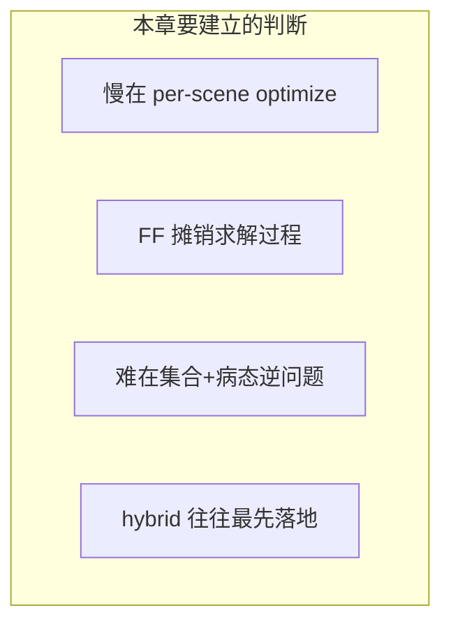
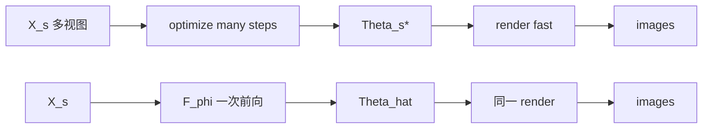
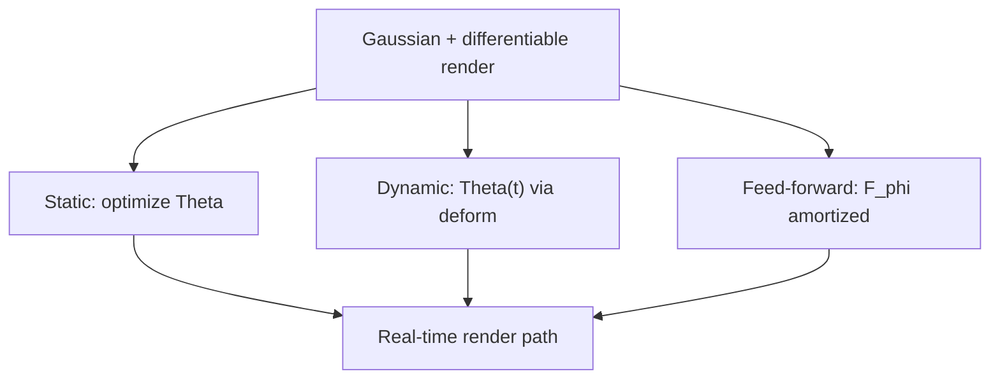
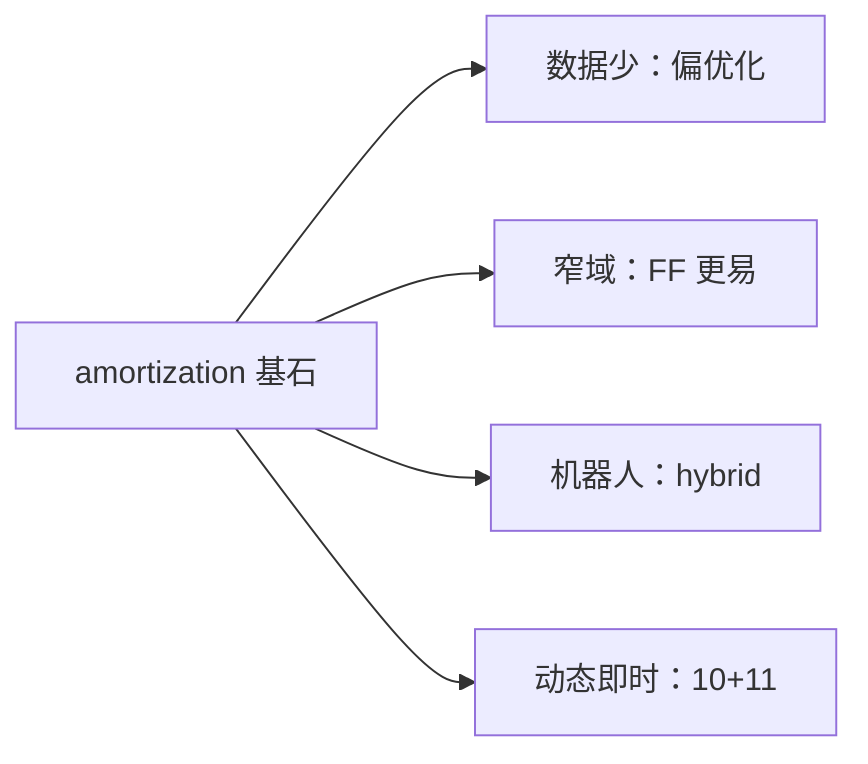
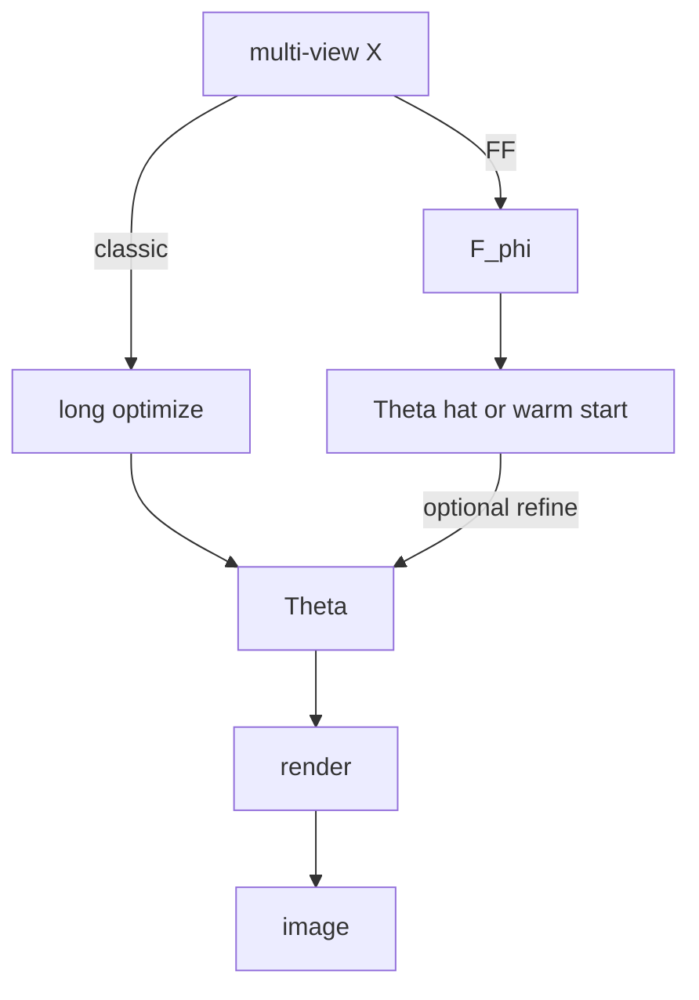

# 第 11 章：为什么还要优化 30000 步——Feed-Forward Gaussian 到底想替代哪一段过程

**本章核心问题**：无论是静态 3DGS 还是动态 4DGS，一个很现实的问题仍然没消失：

> 为什么每来一个新场景，我们通常还是要做一轮很长的 per-scene optimization？如果最终目标是得到一组 Gaussian，能不能像深度估计那样，直接一次前向 [feed-forward] 把它预测出来？Feed-Forward Gaussian 真正想替代的到底是哪一段流程？

如果前面几章回答的是：

- 第 3–4 章：表示与渲染  
- 第 5–7 章：怎样为 **一个场景** 优化出 `Theta`  
- 第 8 章：有了 `Theta` 之后如何实时画  
- 第 9 章：如何把系统实现出来  
- 第 10 章：`Theta` 如何变成 `Theta(t)`  

那么这一章回答的就是：

```text
如果连长时间的 per-scene optimization 都不想做
Gaussian 能不能被直接预测出来
以及这件事为什么比“把网络最后一层改成输出高斯参数”难得多
```

先把主线钉死：

```text
传统 3DGS 的核心范式：
给定一个场景的数据
通过很多步优化
找到一组适合这个场景的 Gaussian

Feed-forward 的核心范式：
提前在很多场景上学一个通用映射 F_phi
让它看到新场景时
直接给出一组足够好的 Gaussian

关键词是摊销 [amortization]：
把原来每个场景都要重新付一次的优化成本
尽量提前摊到一个共享模型里
```

但这里最重要的一句是：

> Feed-forward 不只是“让它更快”，而是在把“逐场景求解”改写成“跨场景摊销学习”。

---

## 阶段 1 — 定界问题 [problem framing]

### 1.1 先分清：快的是渲染，还是“得到那批 Gaussian”

很多人第一句记住的是：

```text
Gaussian Splatting 很快
```

这句话只对了一半。

| 阶段 | 输入 | 输出 | 典型体感 |
|------|------|------|----------|
| per-scene optimization | 多视图图像 + 相机 | `Theta_s` | 分钟级，常要上万步 |
| real-time rendering | 已有 `Theta` + 新相机 | 图像 | 毫秒级（第 8 章） |

**实时渲染 [real-time rendering]** ≠ **即时重建 [instant reconstruction]**。

- 前者：已知 `Theta`，快速出图（3DGS 的强项）。  
- 后者：只有图像（与相机），快速得到 `Theta`（feed-forward 想推进的方向）。

### 1.2 成功标准

1. 能指出 feed-forward 想砍掉的是哪段成本（不是 renderer）。  
2. 能形式化对比 `argmin` 与 `F_phi(X_s)`。  
3. 能解释三种路线：optimization-based / hybrid warm-start / fully feed-forward。  
4. 能说明 set-valued unordered outputs 与 ill-posed inverse problem 为何让直接回归变难。  
5. 能判断不同应用该站在谱的哪一侧。

### 1.3 In scope / Out of scope

| In scope | Out of scope |
|----------|--------------|
| amortization 思想 | 某一具体 SOTA 网络结构全抄 |
| 三种范式权衡 | 大规模预训练工程全书 |
| 集合无序与病态逆问题 | 数据集版权与采集规范细节 |
| MVP：warm-start 路线 | 保证超越充分优化的质量上限 |



### 1.4 问题形式化

场景 `s` 的多视图输入：

```text
X_s = {(I_k^s, cam_k)}_k
```

**传统优化式 [optimization-based]**：

```text
Theta_s^* = argmin_Theta  E_k [ L_img(render(Theta, cam_k), I_k^s) ]
```

第 7 章训练闭环，就是在数值上逼近这个 `argmin`。

**Feed-forward / amortized**：

```text
Theta_hat_s = F_phi(X_s)
```

其中 `phi` 在 **很多训练场景** 上习得，推理时对新场景一次（或少数次）前向给出高斯集合。

---

## 阶段 2 — 拆到基石 [first principles]

### 2.1 质疑常见假设

| 常见假设 | 质疑 | 基石 |
|---------|------|------|
| 「GS 已经实时，不必 feed-forward」 | 实时的是渲染，不是每场景重建 | 分清 rendering vs reconstruction |
| 「最后一层输出 mu/Sigma 就行」 | 输出是可变大小无序集合 | 输出结构必须匹配集合语义 |
| 「有教师高斯就可逐 index L2」 | 索引无稳定语义 | 需要 set matching 或 render-space 监督 |
| 「网络大就能一跳解逆问题」 | 多视图到 3D 本征病态 | 歧义需要数据先验 + 合适归纳偏置 |
| 「fully FF 一定全面优于优化」 | 质量/泛化/数据成本权衡 | 存在连续谱，hybrid 常最实用 |

### 2.2 基石列表

**B1 — 成本中心在“逐场景求解”，不在“已有参数后的成像”**  
（在经典 3DGS 工作流里）新场景的等待主要来自 optimization，不是 render。

**B2 — Amortization：把重复求解变成共享经验**  
多个场景反复解相似 `argmin` 时，可学 `F_phi ≈` 求解器的快速近似。

**B3 — 目标从“单场景最优”变成“跨场景泛化”**  
`phi` 必须在分布外场景仍给出合理 `Theta`，否则只是记忆训练集。

**B4 — 输出是 set-valued：可变基数 `N`，且 permutation-invariant**  
`{G1,G2,G3}` 与 `{G3,G1,G2}` 渲染等价；定长有序向量监督会错位。

**B5 — 从图像到 3D 是病态逆问题 [ill-posed inverse problem]**  
覆盖不足、弱纹理、反射等导致多解；优化用多步把解压向一致，FF 要在一次前向消化歧义。

**B6 — 范式是谱，不是二元开关**  
optimization-based ↔ hybrid warm-start ↔ fully feed-forward，按应用选点。

**B7 — 监督可以在图像空间，而不必在高斯 index 空间**  
`render` 是自然的排列无关度量接口（配合第 4–5 章）。

```text
              Feed-Forward Gaussian
                       ↑
     摊销求解 + 尊重集合结构 + 处理病态性
                       ↑
        B1 成本中心 / B2 amortization / B3 泛化
        B4 set 输出 / B5 ill-posed / B6 谱 / B7 监督接口
```

---

### 加餐怎么读：生活类比 + 失败对照

后面每张概念卡（以及「MVP 路线」大主题）都补了两块「加餐」。阅读建议：

1. **先读 Origin / Core idea**（建立基石）  
2. **再读生活类比**（用画面记住，但必须能说回基石）  
3. **最后读失败对照**（知道错会怎样，比只知道对更重要）

技能约束（第一性原理 skill）在这里仍然有效：

> 隐喻可以用，但必须映射回定义与约束；不能只听故事。会计摊销、每单现算、热启动、无序积木——都只是脚手架；真正要钉住的是成本中心在 per-scene optimize、集合输出、病态逆问题、范式谱。

一张总导航（类比 → 基石 → 3DGS 症状）：

| 概念 | 一个够用的生活画面 | 基石一句话 | 3DGS 里做错时常见症状 |
|------|-------------------|------------|------------------------|
| Amortization | 会计摊销：研发一次，每单摊薄 | 共享 `F_φ` 近似反复出现的求解 | 把 FP16 当成 amortization |
| Optimization-based | 每个客户现场定制 30000 步 | 每场景 `argmin_Θ L_s` | 把优化慢说成渲染慢 |
| Hybrid warm-start | 好草稿 + 短改稿 | `Θ⁰=F_φ(X)` 再 `K≪30000` 步 | 鄙视 hybrid 不纯，死磕 fully FF |
| Fully feed-forward | 一键出片不再返工 | 前向后尽量不再 per-scene opt | 质量幻灭；OOD 崩 |
| Unordered set output | 一袋积木无编号 | 可变 `N`、排列不变 | index L2 监督槽位打架 |
| Ill-posed inverse | 三张剪影猜雕塑 | 多解/不稳，需先验压歧义 | 三视图就过度自信 |
| MVP 路线 | 先热启动产品，再追求一键 | 保留 render+refine，先替冷启动 | 一上来大一统模型，数据与工程双爆 |

---

## 概念卡合集

### 概念卡 1 — Amortization

| 字段 | 内容 |
|------|------|
| **English name** | Amortization (amortized inference / learning) |
| **中文 [English]** | 摊销 [amortization] |
| **Origin** | 变分推断与元学习：用共享网络近似反复出现的推断/优化 |
| **Core idea** | 把每个场景重复支付的优化成本，提前摊到训练 `F_phi` 的过程中 |
| **Why not alternatives** | 永远 per-scene optimize 质量高但无法即时；纯规则初始化又不够聪明 |
| **In 3DGS** | `F_phi: multi-view → Gaussian set` |
| **PyTorch or pseudocode** | `Theta = model(images, cameras)` |
| **Common confusions** | 以为 amortization 只是“推理时用 FP16” |

#### 生活类比（必须映射回基石）

**Amortization** 像会计摊销：与其每个新客户都从零请顾问现场算 30000 步（per-scene optimize），不如先花大钱训练一个共享顾问网络 `F_φ`，把「怎么解这类问题」的经验摊到每一次前向里。摊的是**求解成本**，不是渲染时把权重存成 half。

| 生活画面 | 对应基石 |
|----------|----------|
| 重复出现的同类难题 | 多场景反复解相似 `argmin`（B2） |
| 研发期投入，使用期变便宜 | 训练 `F_φ` 贵，推断单场景便宜 |
| `X → Θ` 一次前向 | `F_φ: multi-view → Gaussian set` |
| 把半精度当摊销 | 范畴错误：那是第 8 章带宽技巧 |

> 类比到此为止。基石是：用共享模型近似反复求解；成本中心从每场景优化挪到跨场景学习。

#### 失败对照：做对 vs 做错

| 场景 | 做对 | 做错时你看到什么 |
|------|------|------------------|
| 问题定义 | 明确要摊的是 reconstruction | 优化 render FPS 却自称 feed-forward GS |
| 数据 | 多场景分布覆盖目标域 | 单场景过拟合网络，换场景崩 |
| 期望 | 质量-延迟权衡写进成功标准 | 以为摊销后一定全面碾压 30k 步 |
| 与第 8 章 | 分开「建图快」与「出图快」 | 两个“快”混谈，方案错位 |

```text
症状速记：
  「实时了但新场景仍要训半小时」→ 你优化了 render，没摊销 reconstruction
  「网络很大却仍要 30k 步」→ 可能只是更好的初始化，未定义清路线
```

---

### 概念卡 2 — Optimization-based Reconstruction

| 字段 | 内容 |
|------|------|
| **English name** | Optimization-based (per-scene) reconstruction |
| **中文 [English]** | 基于优化的逐场景重建 [optimization-based] |
| **Origin** | 经典逆渲染 / 3DGS 默认流程 |
| **Core idea** | 每个场景独立 `argmin_Theta L_s(Theta)` |
| **Why not alternatives** | 无需大规模多场景训练数据；单场景可抠到很高 |
| **In 3DGS** | 第 6–7 章：初始化 + 上万步 + densify |
| **PyTorch or pseudocode** | 训练循环 `for step in range(30000): ...` |
| **Common confusions** | 把“优化慢”误当成“渲染慢” |

#### 生活类比（必须映射回基石）

**Optimization-based** 像每个客户都请老师傅上门改 30000 稿：不需要你先有「全行业数据库」，单套房能抠到极致；但下一套房还得再来 30000 稿。贵在**逐场景求解**（B1），不在老师傅会不会快速刷漆（已有 `Θ` 后的 render）。

| 生活画面 | 对应基石 |
|----------|----------|
| 每单独立优化 | `argmin_Θ L_s(Θ)` |
| 无需跨单预训练大数据 | 经典 3DGS 友好处 |
| 单单质量天花板高 | 电影资产管线常停在这里 |
| 等稿痛 | 无法即时建图/开环秒级 |

> 类比到此为止。基石是：默认 3DGS 工作流的成本中心在 per-scene optimize。

#### 失败对照：做对 vs 做错

| 场景 | 做对 | 做错时你看到什么 |
|------|------|------------------|
| 用户抱怨“慢” | 先分清等训练还是等渲染 | 猛做第 8 章，训练仍 30 分钟 |
| 高质量资产 | 诚实用优化式 | 强上 fully FF，细节到不了验收 |
| 数据很少 | 继续 per-scene | 硬训跨场景网络，过拟合假象 |
| 沟通 | 说清两段时间尺度 | “3DGS 不实时”笼统背锅 |

```text
症状速记：
  「渲染 100FPS 仍觉得慢」→ 慢在拿到 Θ 之前
  「必须 feed-forward 才高级」→ 应用可能根本不需要
```

---

### 概念卡 3 — Hybrid Warm-Start

| 字段 | 内容 |
|------|------|
| **English name** | Hybrid / warm-start reconstruction |
| **中文 [English]** | 混合式 / 热启动 [hybrid warm-start] |
| **Origin** | 用学习初始化器缩短后续优化 |
| **Core idea** | `Theta^(0)=F_phi(X)`，再 `K` 步 refinement，`K << 30000` |
| **Why not alternatives** | fully FF 太难；纯优化太慢；warm-start 先替掉最贵冷启动 |
| **In 3DGS** | 学一个比 SfM 更聪明的初始化器 |
| **PyTorch or pseudocode** | `Theta = refine(model(X), X, steps=K)` |
| **Common confusions** | 以为 hybrid“不纯粹”就落后；工程上往往最值 |

#### 生活类比（必须映射回基石）

**Hybrid warm-start** 像写作：网络先甩出「不丢人的草稿」`Θ⁰`，再用第 7 章的优化笔触改 `K` 稿，`K` 远小于从白纸写到 30000 稿。不纯粹，但先干掉最贵的**冷启动**。

| 生活画面 | 对应基石 |
|----------|----------|
| 聪明初始化器 | `Θ⁰ = F_φ(X)`，常强于裸 SfM 点 |
| 短 refinement | `K ≪ 30000` 步压到可用 |
| 谱上的中间点 | B6：不是宗教战争的二元 |
| MVP 默认落点 | 见 3.10：今天更合理的产品路径 |

> 类比到此为止。基石是：学习负责冷启动，优化负责收尾；两者接力。

#### 失败对照：做对 vs 做错

| 场景 | 做对 | 做错时你看到什么 |
|------|------|------------------|
| MVP | 保留 render/loss/refine，只换 init | 一上来禁绝任何 per-scene 步 |
| 评价 | 比「同质量下步数/时间」 | 只比零步 fully FF 的虚荣指标 |
| 训练 init 网 | render-space 监督友好 | index L2 对齐教师高斯翻车 |
| 文化 | 承认 hybrid 工程价值 | “不端到端就发不了 paper”导致产品空窗 |

```text
症状速记：
  「网络输出已可用，仍空转 30k」→ K 没降下来，摊销没落地
  「K 很小就糊」→ init 太弱或域偏移，回到数据与架构
```

---

### 概念卡 4 — Fully Feed-Forward

| 字段 | 内容 |
|------|------|
| **English name** | Fully feed-forward / fully amortized |
| **中文 [English]** | 完全前馈 / 完全摊销 [fully feed-forward] |
| **Origin** | 端到端视觉系统的极限形态 |
| **Core idea** | `Theta_hat=F_phi(X)` 后尽量不再 per-scene optimize |
| **Why not alternatives** | 体验最好，但要吞掉几乎全部场景特异性与歧义 |
| **In 3DGS** | 即时预览、大规模自动重建的理想点 |
| **PyTorch or pseudocode** | `img = render(model(X), cam_novel)` |
| **Common confusions** | 默认 fully FF 一定全面碾压优化式质量 |

#### 生活类比（必须映射回基石）

**Fully feed-forward** 像「按快门就出片、不许回暗房」：体验上限最高（开环机器人、秒级建图），但网络必须在一次前向里吞掉场景特异性与病态歧义（B5）。暗房（per-scene opt）的纠错权被你主动交出去了。

| 生活画面 | 对应基石 |
|----------|----------|
| 一键出 `Θ` | `Θ̂ = F_φ(X)` |
| 尽量零返工 | 不再（或极少）逐场景优化 |
| 新场景分布外 | 泛化失败最痛（B3） |
| 电影级抠细节 | 常仍需优化式或长 refinement |

> 类比到此为止。基石是：谱的最左端（最快即时）；质量与鲁棒性由数据先验与归纳偏置硬抗。

#### 失败对照：做对 vs 做错

| 场景 | 做对 | 做错时你看到什么 |
|------|------|------------------|
| 应用选型 | 真需要秒级才上 fully | 内部预览也禁 refinement，无谓掉点 |
| OOD | 域随机/窄域产品 | 训练是室内，测室外直接裂 |
| 质量预期 | 接受与 30k 步有 gap | 默认 fully 全面碾压优化式 |
| 研究路径 | 可从 hybrid 蒸馏到 fully | 跳过 hybrid，调试信号极差 |

```text
症状速记：
  「演示视频完美，客户场景崩」→ 泛化/病态被低估
  「必须 fully 才算本章」→ 谱上选点，不是信仰打卡
```

---

### 概念卡 5 — Set-Valued Unordered Outputs

| 字段 | 内容 |
|------|------|
| **English name** | Set-valued unordered outputs |
| **中文 [English]** | 集合值无序输出 [set-valued unordered outputs] |
| **Origin** | 集合预测 / point set generation |
| **Core idea** | 目标是可变大小、排列不变的高斯集合，不是定长有序向量 |
| **Why not alternatives** | 硬塞固定 `N` 有序槽位会强迫网络学“槽位语义” |
| **In 3DGS** | `N` 随场景复杂度变；排列不改变 render |
| **PyTorch or pseudocode** | 用 render loss / Chamfer / Hungarian，而非 naive index L2 |
| **Common confusions** | 对教师高斯做 `||G_pred[i]-G_gt[i]||` 直接回归 |

#### 生活类比（必须映射回基石）

**Set-valued unordered outputs** 像一袋没有编号的积木：袋里有哪些块、共几块，比「第 3 号槽必须是红积木」重要。把袋倒进两个盒子再比较，只要积木集合一样就等价——`{G1,G2,G3}` 与 `{G3,G1,G2}` 渲染等价（B4）。

| 生活画面 | 对应基石 |
|----------|----------|
| 可变袋装数量 | `N` 随复杂度变 |
| 无固定槽位语义 | 排列不变 [permutation-invariant] |
| 按编号强行 L2 | 教师与学生索引错位，梯度互撕 |
| 倒出来看拼图效果 | render-space loss 天然不依赖 index（B7） |

> 类比到此为止。基石是：输出是集合；监督必须尊重无序与可变基数。

#### 失败对照：做对 vs 做错

| 场景 | 做对 | 做错时你看到什么 |
|------|------|------------------|
| 监督 | 多视图 render loss / 匹配损失 | `‖G_pred[i]-G_gt[i]‖` 直接回归 |
| `N` | 可变或可剪枝集合头 | 固定 1e5 槽位强迫填满噪声球 |
| 蒸馏 | Hungarian/Chamfer 等集合匹配 | 教师排序一变学生全崩 |
| 调试 | 看渲染与覆盖，不看“第 i 个像不像” | 日志里 index MSE 很低但图很空 |

```text
症状速记：
  「参数 MSE 降、图不升」→ 很可能在优化错误的对应
  「半空噪声球」→ 固定 N 槽位未剪枝
```

---

### 概念卡 6 — Ill-Posed Inverse Problem

| 字段 | 内容 |
|------|------|
| **English name** | Ill-posed inverse problem |
| **中文 [English]** | 病态逆问题 [ill-posed inverse problem] |
| **Origin** | 逆问题理论：存在性/唯一性/稳定性缺一 |
| **Core idea** | 多视图→场景表示常不唯一；小噪声可导致大解变化 |
| **Why not alternatives** | 忽略病态会过度自信于单次回归 |
| **In 3DGS** | 优化靠多步与多视图压歧义；FF 靠数据先验与几何归纳偏置 |
| **PyTorch or pseudocode** | 多视图 render loss + 几何预训练特征 |
| **Common confusions** | 以为“有三张图就信息充分” |

#### 生活类比（必须映射回基石）

**Ill-posed inverse** 像用三张剪影猜一座雕塑：可能的立体很多，风吹一下剪影噪声还能换成另一座。优化式靠「多步多视图把解往一致处挤」；feed-forward 必须一次前向就带着**数据先验**站队（B5）。

| 生活画面 | 对应基石 |
|----------|----------|
| 多解 | 唯一性缺 |
| 噪声大变解 | 稳定性缺 |
| 优化多步 | 迭代压歧义 |
| FF 一次前向 | 先验 + 几何归纳偏置硬抗 |
| “三张图够了吧” | 覆盖/纹理/反射仍可严重不足 |

> 类比到此为止。基石是：图像→3D 表示病态；路线选择决定你用迭代还是先验消化歧义。

#### 失败对照：做对 vs 做错

| 场景 | 做对 | 做错时你看到什么 |
|------|------|------------------|
| 少视图 | 降期望或加几何预训练 | 自信回归，新视角裂开 |
| 反光/弱纹理 | 更多视图或混合 refine | fully FF 在玻璃墙发疯 |
| 训练 | 多视图一致性损失 | 单视图 RGB 拟合捷径 |
| 产品 | 窄域 + hybrid 兜底 | 开放世界一键保证宣传 |

```text
症状速记：
  「训练视角好、绕后穿帮」→ 病态暴露，缺多视图压或先验
  「加噪声输出乱跳」→ 稳定性差，模型没学会稳健解
```

---

## 阶段 3 — 自底向上重建

### 3.1 传统流程里，到底哪一段最“贵”

经典链路：

```text
采集图像
  → SfM / COLMAP（位姿 + 稀疏点）
  → 初始化 Gaussian
  → 很长 per-scene optimization（含 densify）
  → 得到 Theta
  → 实时 render（第 8 章）
```

Feed-forward 真正想动刀子的，通常是：

```text
很长 per-scene optimization
（以及有时连带着更聪明的初始化，弱化对粗糙 SfM 脚手架的依赖）
```

而不是：

```text
丢掉 projection / blending 数学
```



类比（映射回基石后可扔掉故事）：

- 优化式：每位顾客到店，从零现场雕刻一尊像。  
- Feed-forward：先培养一位见多识广的工匠，新材料来了能很快下手。  
- Hybrid：工匠先快速塑形，再打磨几刀。  

### 3.2 目标函数层级变了

| | 优化式 3DGS | Feed-forward |
|--|-------------|--------------|
| 学什么 | 场景自己的 `Theta_s` | 跨场景的 `phi` |
| 目标 | 当前场景误差最小 | 未来新场景上期望误差小 |
| 数据 | 单场景多视图 | 多场景数据集 |
| 失败模式 | 不收敛、过拟合单场景噪声 | 泛化差、细节糊、集合结构崩 |

所以第 11 章 **不是**“加速版第 7 章”。

> 第 7 章是单场景求解；第 11 章是跨场景摊销求解。

---

### 3.3 为什么“直接回归一堆高斯参数”会立刻撞墙

最朴素想法：

```text
输入多张图像 → 输出 mu, Sigma, alpha, SH
```

听起来自然，但三座大山同时在：

#### （1）Variable `N`：集合大小不固定

- 桌面可能几万高斯够用  
- 复杂城市场景可能几十万  
- 网络天然喜欢固定输出维度  

策略直觉（不必绑死某一论文）：

- 预测过完备集合 + prune/mask  
- 分层 coarse-to-fine 逐步增密  
- token / proposal 机制动态选数量  

#### （2）Unordered：排列不变

渲染意义上：

```text
{G1,G2,G3} ≡ {G3,G1,G2}
```

若监督写成：

```python
loss = ((mu_pred - mu_gt) ** 2).mean()  # 按 index 对齐
```

则只要教师集合的排列不同，loss 就乱跳——**索引本无语义**。

可选出路：

- **render-space supervision**：渲染后比图像（排列无关）  
- **set matching**：Hungarian / Chamfer 等匹配后再比  
- **蒸馏分布统计**：比的是分布而非 index  

#### （3）Ill-posed：逆问题病态

即使集合问题都解决，几何恢复仍可能：

- 深度多解  
- 弱纹理漂  
- 高光与视角依赖搅在一起  

优化式靠“很多步 + 多视图一致性”慢慢压歧义。  
Feed-forward 要在一次前向里调用 **从大数据学到的先验**。

三座大山叠在一起：

```text
可变大小集合
+ 无序
+ 病态逆问题
= 不是“换 Transformer 就结束”的问题
```

---

### 3.4 三条路线：一条谱，不是宗教战争

```text
优化式  ----------------  混合 warm-start  ----------------  完全前向式
质量上限高 / 慢              折中                            快 / 建模难
```

#### 路线 A — Optimization-based

```text
X_s → init(SfM) → many steps → Theta_s*
```

优点：单场景极限质量、不强制多场景大数据。  
代价：每个新场景重新等。

#### 路线 B — Hybrid warm-start

```text
Theta_s^(0) = F_phi(X_s)
Theta_s* ≈ refine(Theta_s^(0), X_s, K steps)
```

核心思想：

> 不必一口气替代全部优化；只要替代最昂贵的冷启动，就已经非常值钱。

它很像第 6 章“初始化要把系统送进可训练区间”的升级版：

```text
学一个比 SfM 更聪明的初始化器
```

#### 路线 C — Fully feed-forward

```text
Theta_hat_s = F_phi(X_s)  → 直接使用
```

体验最好，挑战最大：几乎全部场景特异性要靠 `phi` 吞下。

| 维度 | Opt | Hybrid | Fully FF |
|------|-----|--------|----------|
| 新场景延迟 | 高 | 中低 | 最低 |
| 峰值质量潜力 | 很高 | 高 | 看泛化 |
| 多场景训练数据 | 不必须 | 需要 | 更需要 |
| 工程复杂度 | 中（经典） | 中高 | 高 |
| 与现有 3DGS 代码复用 | 完整 | 高（保留 refine） | 中（主要复用 render） |

---

### 3.5 为什么 warm-start 常常是最自然的第一步

把传统训练曲线想一遍：

- **前期很多步**：从粗糙脚手架走到可用盆地（冷启动、粗成形）  
- **后期很多步**：精修、磨细节  

Feed-forward 最先值得替代的，往往是前半段：

```text
别从 random / 极糙 SfM 脚手架开始
让共享模型直接给一个已经像样很多的 Theta^(0)
```

于是：

```text
X → F_phi(X) → few-step refinement → Theta*
```

验证价值也简单：

| 起点 | 到目标 PSNR 的步数 |
|------|---------------------|
| SfM init | 很多 |
| learned warm-start | 应显著更少 |

若后者成立，共享模型已创造真实价值——即使还不是 fully FF。

---

### 3.6 监督该怎么做：三种层次

#### （1）Render-space supervision（往往最稳）

```text
Theta_hat = F_phi(X_s)
L_render = E_k [ L_img(render(Theta_hat, cam_k), I_k) ]
```

优点：

- 不要求与教师高斯逐 index 对齐  
- 直接对最终任务负责  
- 与第 4–5 章天然兼容  

#### （2）Set matching / distillation

若有教师 `Theta_teacher`（例如充分优化的 3DGS）：

```text
L_set = match(Theta_hat, Theta_teacher)
```

`match` 可能是最近邻、Hungarian、局部 cluster 等。更复杂，但能传递几何结构先验。

#### （3）Trajectory / refinement distillation

对 hybrid：

```text
学“如何从当前状态走向更好状态”
```

监督对象可能是中间状态、update 方向、残差修正。

```text
最终图像像不像
预测高斯分布像不像老师
若混合式：更新方向像不像高效优化器
```

---

### 3.7 输出头必须尊重集合结构

若强行：

```text
Theta_hat = [G_1, G_2, ..., G_N_fixed]
```

网络容易学到“第 i 个槽位大致是某类东西”，而不是灵活集合。

更匹配的方向（概念级）：

- proposal + confidence / mask  
- codebook / token 再解码成高斯  
- point-set 风格输出  
- coarse-to-fine 增密（呼应 densify 思想，但是 learned）  

这与全书主线一致：

> 表示形式要和任务结构匹配——到第 11 章，输出头也要匹配“无序可变集合”。

---

### 3.8 应用场景：谁真正需要 amortization

| 场景 | 更需要 FF / hybrid？ | 原因 |
|------|----------------------|------|
| 手机拍一圈即时预览 | 很需要 | 用户不等 20 分钟 |
| 机器人 / AR / SLAM | 很需要 warm-start | 先有可用几何再在线 refine |
| 高质量离线资产 | 未必 | 愿为单场景质量付时间 |
| 海量场景批量重建 | 需要 | 总时间被 per-scene 线性放大 |

结论不是“传统 3DGS 立刻过时”，而是：

```text
不同应用对 amortization 的需求强弱不同
```

---

### 3.9 最小实验：三条范式的时间-质量玩具曲线

```python
import numpy as np
import matplotlib.pyplot as plt

steps = np.arange(0, 3001)

psnr_cold = 10.0 + 20.0 * (1 - np.exp(-steps / 800.0))
psnr_cold += 1.2 * (1 - np.exp(-np.maximum(steps - 1800, 0) / 700.0))

psnr_warm = 24.0 + 6.2 * (1 - np.exp(-steps / 260.0))
psnr_warm += 0.8 * (1 - np.exp(-np.maximum(steps - 800, 0) / 500.0))

psnr_ff = 27.8

time_cold = 0.0025 * steps
warm_forward_time = 1.2
ff_forward_time = 0.7

plt.figure(figsize=(9.2, 5.2))
plt.plot(time_cold, psnr_cold, label="cold-start optimization")
plt.plot(warm_forward_time + 0.0025 * steps, psnr_warm, label="warm-start + refinement")
plt.axhline(psnr_ff, linestyle="--", label="fully feed-forward (toy ceiling)")
plt.axvline(ff_forward_time, linestyle=":", color="gray")
plt.xlabel("relative time")
plt.ylabel("PSNR (toy dB)")
plt.title("Cold-start vs warm-start vs feed-forward")
plt.legend()
plt.tight_layout()
plt.show()
```

观察直觉：

- cold-start 爬坡慢  
- warm-start 起点高，少量步补尾部  
- fully FF 时间轴最左，但玩具上限未必最高  

真正要记住的判断框架：

```text
研究问题常常不是“绝对禁止优化”
而是：能否用共享模型替掉最贵的冷启动
```

---

### 3.10 若你今天做 MVP：更合理的是 hybrid

不建议第一步就：

```text
任意新场景单次前向直接最优 Gaussian 大一统模型
```

更稳：

#### Step 1  
保留第 7 章 renderer、loss、refinement 逻辑。

#### Step 2  
训练初始化网络：

```text
X_s → Theta_s^(0)
```

#### Step 3  
少量 refinement：

```text
Theta* ≈ refine(Theta^(0), X_s, K)
```

#### 生活类比（必须映射回基石）

把 **MVP 路线** 想成产品分期：第一版不要「全世界任意场景按快门即最终成片」，而要「比 SfM 冷启动聪明的草稿 + 短改稿」。厨房（第 7 章 renderer / loss / refine）先留着，只换「第一刀切配」（初始化器）。这是 hybrid 落在工程时间表上的样子（B6 谱上的可交付点）。

| 生活画面 | 对应基石 |
|----------|----------|
| 保留成熟后厨 | Step1：render、loss、refinement 逻辑不动 |
| 训练更好的备料员 | Step2：`X_s → Θ_s^(0)` |
| 少量精修出菜 | Step3：`refine(Θ⁰, X, K)`，`K` 可控 |
| 大一统一键神话 | 数据、集合头、病态、产品风险同时爆炸 |

> 类比到此为止。基石是：先摊销最贵冷启动；fully FF 是后续光谱移动，不是 Day-1 必达。

#### 失败对照：做对 vs 做错

| 场景 | 做对 | 做错时你看到什么 |
|------|------|------------------|
| 范围 | 窄域或固定相机配置先打穿 | 开放世界 fully 承诺，周会只能播剪辑 |
| 指标 | 同质量下墙钟时间 / 步数 | 只晒零步 demo 藏失败 case |
| 监督 | 优先 render-space | 教师 index L2，训练假收敛 |
| 演进 | hybrid 稳了再减 `K`→0 | 跳步禁 refine，无基线可回退 |

```text
症状速记：
  「MVP 三个月无物」→ 目标定成了 fully 大一统
  「有网但总链路更慢」→ 没减 K，或 init 更差拖长 refine
```

#### 伪代码骨架

```python
import torch
import torch.nn as nn

class WarmStartGaussianNet(nn.Module):
    """示意：真实系统会有多视图编码器与集合解码器。"""
    def __init__(self, n_out=10000, feat_dim=256):
        super().__init__()
        self.encoder = nn.Sequential(
            nn.Conv2d(3, 64, 3, padding=1), nn.ReLU(inplace=True),
            nn.AdaptiveAvgPool2d(1),
        )
        # 极简化：从全局特征直接解码固定 N 的参数
        # 生产中应处理多视图融合与可变集合
        self.head = nn.Linear(64, n_out * (3 + 4 + 3 + 1 + 3))  # mu, quat, scale, opac, rgb
        self.n_out = n_out

    def forward(self, image):
        # image: [B,3,H,W]  真实应是多视图 batch
        feat = self.encoder(image).flatten(1)
        raw = self.head(feat).view(-1, self.n_out, 3 + 4 + 3 + 1 + 3)
        mu = raw[..., 0:3]
        quat = raw[..., 3:7]
        quat = quat / quat.norm(dim=-1, keepdim=True).clamp_min(1e-6)
        scale = raw[..., 7:10].exp()
        opacity = torch.sigmoid(raw[..., 10:11])
        color = torch.sigmoid(raw[..., 11:14])
        return {"mu": mu, "quat": quat, "scale": scale, "opacity": opacity, "color": color}


def train_step(model, images, cameras, gts, refine_steps=0):
    pred = model(images[:, 0])  # 示意：只用第一视角特征
    # 真正训练应：多视图 encode → 集合 decode → 多视图 render loss
    # loss = render_loss(pred, cameras, gts)
    # 若 hybrid：再对 pred 做 K 步可微/不可微 refine 后监督
    ...
```

这段代码 **故意粗糙**，用来强调：

- MVP 可以先固定 `N` 换可运行性  
- 但你必须清楚这与“真集合”之间的差距（B4）  
- 监督优先走 render loss，避开 index L2  

价值验证：

```text
达到同一 PSNR，warm-start 是否显著减少步数？
固定步数预算，warm-start 是否更高？
```

---

### 3.11 把全书收束：同一框架的三种展开

| 章节簇 | 回答 |
|--------|------|
| 3–4 | 场景用什么表示、如何成像 |
| 5–8 | 怎样为单场景学好并跑快 |
| 9 | 怎样实现与验证 |
| 10 | 时间维：`Theta(t)` |
| 11 | 求解范式：`F_phi(X)→Theta` |

```text
静态 3DGS：学一个场景自己的 Theta
动态 4DGS：学一个场景自己的 Theta(t)
Feed-forward GS：学跨场景 F_phi，尽量直接产出 Theta（或好起点）
```

> 静态、动态、feed-forward 不是三套互不相干世界，而是同一 Gaussian–render–optimize 框架在“时间维”与“求解范式”上的展开。



---

### 3.12 与第 8–10 章的接口再强调一次

- 第 8 章：有了 `Theta` 如何低延迟成像。  
- 第 10 章：`Theta` 如何依赖时间。  
- 第 11 章：`Theta` 能否不靠长优化、而靠共享前向得到。  

三者正交可组合：

```text
feed-forward 预测动态场景的 canonical + deform 参数
再实时 render
```

难度当然更高，但概念上是乘法组合，不是推翻重来。

---

## 阶段 4 — 推广应用 [transfer]

### 4.1 只有极少多场景数据

基石 B2/B3 变难。更现实：

- 坚持 optimization-based  
- 或极小 hybrid（例如只学 scale/opacity 修正）  
- 不要幻想 fully FF  

### 4.2 领域很窄（只扫桌面物体）

分布窄 → amortization 更容易成功。  
同一基石，表象变成：数据同质，`F_phi` 更好学。

### 4.3 必须开环机器人秒级建图

优先 hybrid：前向给可用图，后台继续 refine。  
延迟预算拆成：前向延迟 + 允许的 refine 步数窗口。

### 4.4 动态 + 即时

组合第 10 与 11 章：摊销的是“动态参数求解”，仍非新 renderer。  
失败时分层查：是集合预测坏了，还是时间正则/形变坏了，还是 render 链坏了（第 9 章清单仍适用）。



---

## 阶段 5 — 检验理解 [verification]

### 5.1 费曼摘要

1. 3DGS“快”通常指 **画得快**；每个新场景仍可能 **优化很久** 才有可画的高斯。  
2. Feed-forward 想学一个通用函数：看见多视图，就吐出一组高斯，把反复优化的成本摊销掉。  
3. 这比改输出层难，因为吐出的是 **数量可变、顺序无所谓** 的集合，而且从照片反推 3D 本来就可能有多种答案。  
4. 实务上，先做 **热启动 + 少量精修** 往往比一步登天的完全前馈更划算。  
5. 渲染器还可以是原来那条；变的是 **高斯从哪来**。  



### 5.2 自测详解

#### Q1. Feed-forward 真正想替代哪一段成本？

<details>
<summary>提示</summary>
per-scene optimization vs render。
</details>

<details>
<summary>详解</summary>

替代的是每个新场景漫长的 `argmin_Theta`（以及昂贵冷启动），不是第 4/8 章的成像链本身。  
渲染在有 `Theta` 后已经可以很快；痛点是 **得到 Theta 的过程**。

</details>

#### Q2. 为什么“实时渲染”不等于“即时重建”？

<details>
<summary>提示</summary>
输入输出不同；前向问题 vs 逆问题。
</details>

<details>
<summary>详解</summary>

实时渲染：`Theta + camera → image`（正向，3DGS 已强）。  
即时重建：`images (+cameras) → Theta`（逆向，更难）。  
把两者混为一谈，会误以为“GS 已经实时”就不再需要 feed-forward 研究。

</details>

#### Q3. 直接回归高斯集合会碰到哪些根本困难？

<details>
<summary>提示</summary>
variable N、无序、病态。
</details>

<details>
<summary>详解</summary>

1. `N` 不固定 → 输出维度/基数问题。  
2. 集合无序 → 不能 naive index-wise L2。  
3. 逆问题病态 → 一次前向需先验消化歧义。  
三者叠加使“改最后一层”远远不够。

</details>

#### Q4. 解释 amortization 一句话。

<details>
<summary>提示</summary>
重复求解 → 共享模型。
</details>

<details>
<summary>详解</summary>

把每个场景重复支付的优化成本，提前用多场景训练摊到共享参数 `phi` 上，使新场景推断变便宜。

</details>

#### Q5. 为何 hybrid warm-start 常比 fully FF 更先落地？

<details>
<summary>提示</summary>
只替冷启动；复用 refine；问题更可控。
</details>

<details>
<summary>详解</summary>

它不要求一次前向吞掉全部场景特异性，只要求更好的 `Theta^(0)`，再用少量优化收尾。  
复用现有 render/loss/refine 代码，验收也直观（比步数/比同预算质量）。  
工程谱上它常是性价比最高的点。

</details>

#### Q6. 为何 render-space loss 对集合预测特别友好？

<details>
<summary>提示</summary>
排列不变；任务对齐。
</details>

<details>
<summary>详解</summary>

渲染结果不依赖高斯列表的排列。  
两套不同排列但等价的高斯，图像损失一致。  
从而绕开 index 对齐，同时直接优化最终使用指标。

</details>

#### Q7. 若教师高斯与预测高斯做逐 index L2，可能发生什么？

<details>
<summary>提示</summary>
排列任意；梯度噪声。
</details>

<details>
<summary>详解</summary>

同一场景的教师结果若顺序不同，监督信号完全不同，网络被迫学习虚假的槽位对应，训练不稳或学歪。  
应先 matching，或改用 render/set metric。

</details>

#### Q8. 高质量电影资产管线是否必须 fully feed-forward？

<details>
<summary>提示</summary>
时间可换质量。
</details>

<details>
<summary>详解</summary>

不必须。若可接受长优化且追求单场景极限，optimization-based 仍极有竞争力。  
FF/hybrid 的刚需更强出现在即时性、交互性、海量场景摊销场景。

</details>

### 5.3 基石 ↔ 考点

| 基石 | 考点 |
|------|------|
| B1 成本中心 | Q1/Q2 |
| B2 amortization | Q4 |
| B4 集合输出 | Q3/Q6/Q7 |
| B5 病态 | Q3 |
| B6 谱 | Q5/Q8 |
| B7 监督接口 | Q6 |

---

## 一页速览 [one-page sheet]

### 基石

- 慢在 per-scene optimize，不在“会画”。  
- Feed-forward = 摊销求解 `F_phi(X)→Theta`。  
- 输出是可变无序集合；监督慎用 index L2。  
- 图像→3D 病态，需先验与多视图一致性。  
- 路线是谱：Opt / Hybrid / Fully FF。  
- MVP 优先 warm-start + few-step refine。  
- Renderer 仍可复用；变的是 Theta 来源。  

### 总图

```text
Classic:  X → long optimize → Theta* → render
Hybrid:   X → F_phi → Theta0 → short refine → Theta* → render
Fully FF: X → F_phi → Theta_hat → render
```

### 迁移提示

> 先问应用的延迟预算与数据是否支撑跨场景学习；再在谱上选点。不要为了“端到端信仰”丢掉已经正确的 render 与 refinement 工具。

### 全书收束句

```text
用 Gaussian 表示世界
用可微渲染把世界变成图像
用优化或摊销学习找到参数
在需要时让参数随时间变化
在部署时把成像链路压到实时
```

如果你能把这句话里的每一段都指回具体章节与基石，这本 3DGS 教程的主线就已经真正长在你的方法论里了。

### 若继续往下

本教程正文主线到第 11 章收束。可选延伸（不在本章展开）：

- 更强的多视图几何先验与 feed-forward 骨干  
- 动态场景的 amortized 4D  
- 与 SLAM / 传感器融合的在线系统  

但无论延伸到哪，记得第 9 章的纪律：

```text
一次只引入一个复杂度源
每一层一张检查图
先正确，再快速，再谈范式革命
```
