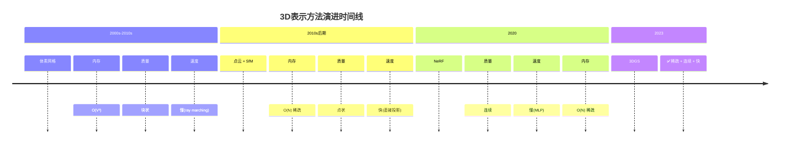
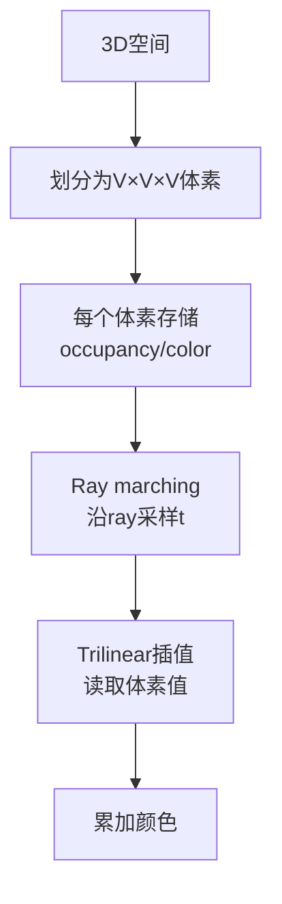
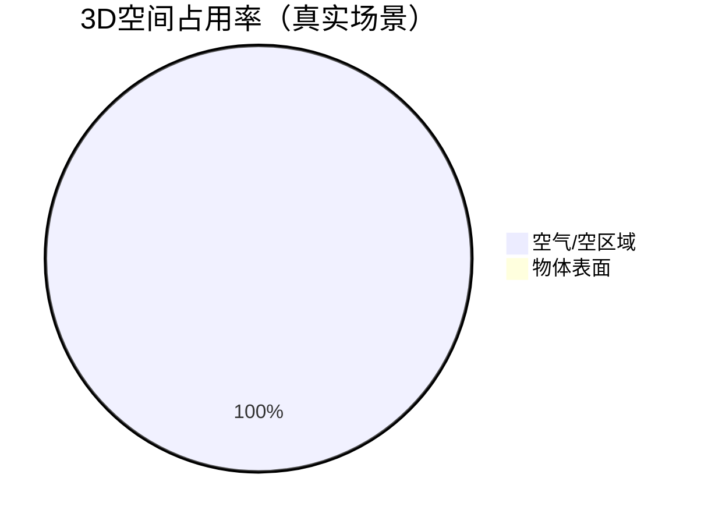
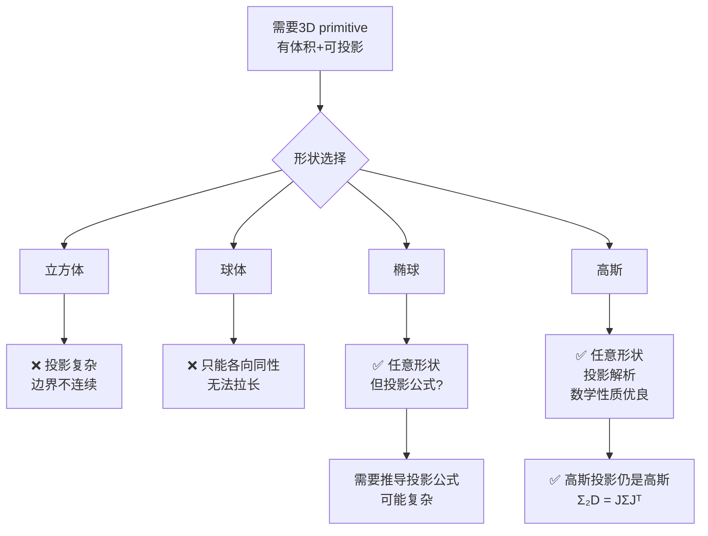

# 第2章：从体素到点云 - 表示方法的演变

**学习路径**：`starting point → invention`

**核心目标**：理解表示方法演进的历史必然性，找到3DGS的突破口

---

## 一、回顾：设计约束的演变

### 1.1 核心矛盾演进图



---

### 1.2 每代方案的"得与失"

| 世代 | 代表 | **得**（优势） | **失**（劣势） | **遗留问题** |
|------|------|----------------|----------------|--------------|
| 第1代 | 体素 | 查询快(O(1))<br/>结构规整 | 内存立方爆炸<br/>质量锯齿 | 如何减少内存？ |
| 第2代 | 点云 | 内存稀疏(O(N))<br/>SfM直接输出 | 零维度无面积<br/>渲染需后处理 | 如何给点加体积？ |
| 第3代 | NeRF | 质量连续<br/>视角依赖 | MLP查询慢<br/>ray marching慢 | 如何避免MLP？ |
| **第4代** | **3DGS** | **稀疏+连续+快** | **需要densify** | **如何动态调整？** |

---

## 二、体素时代：朴素的离散化

### 2.1 体素工作原理

**3D网格离散化**：



**数学公式**：
```
设体素网格函数: V(x,y,z) ∈ [0,1] (occupancy) 或 RGB
ray参数化: p(t) = o + t·d, t∈[t_near, t_far]
渲染:
  C = ∫_{t_near}^{t_far} T(t) · α(p(t)) · c(p(t)) dt
  其中 T(t) = exp(-∫_{t_near}^t α(s) ds)
  离散化: C ≈ Σ T_i · α_i · c_i · Δt_i
```

---

### 2.2 体素的"内存墙"

**内存需求计算**：

| 分辨率 | 体素数 | 内存(float32) | 可行性 |
|--------|--------|---------------|--------|
| 256³ | 16.7M | 64 MB | ✅ 可行 |
| 512³ | 134M | 512 MB | ✅ 可接受 |
| 1024³ | 1.07B | 4 GB | ⚠️ 边缘 |
| 2048³ | 8.59B | 32 GB | ❌ 不可行 |

**内存-分辨率关系**：
```
内存 ∝ V³
若分辨率提高2倍 (V→2V)
内存增加 2³ = 8倍
```

**结论**：体素内存**不可扩展**，无法支持高分辨率场景

---

### 2.3 体素的"质量天花板"

**边界锯齿问题**：

```
理想表面:  ~~~~~~~~  (光滑)
体素表示:  `````````  (锯齿)
```

**原因**：离散网格 + 最近邻/三线性插值 → 边界必然不光滑

---

### 2.4 体素的遗产与局限

**✅ 遗产**：
1. 证明了"预计算存储 + 快速查询"范式可行
2. 确立了"渲染 = 投影 + 累加"基本框架
3. 为后续离散表示打下基础

**❌ 局限**：
1. 内存立方增长 → 不可扩展
2. 表面不连续 → 质量天花板低
3. ray marching仍慢 → 采样点多

**历史定位**：体素是"第一反应"，但很快被证明是死胡同

---

## 三、点云革命：稀疏性的觉醒

### 3.1 点云的核心洞察

**关键洞察**：**大部分3D空间是空的！**



**推论**：为什么要存储空体素？只存表面点！

**内存对比**：
- 体素：V³（如512³ = 134M）
- 点云：N（表面点数，通常10⁵-10⁶）
- **内存减少：100-1000倍** ✅

---

### 3.2 点云渲染的"三次尝试"

#### 尝试1：点精灵（Point Sprites）

**方法**：每个点画一个面向相机的方块


**问题**：
- 点之间有空隙 → 不连续
- 方块角度固定 → 不是真3D

---

#### 尝试2：Splatting（2D高斯）

**方法**：每个点画一个高斯模糊圆

```mermaid
graph TD
    A[点P] --> B[2D高斯: exp(-|x-μ|²/2σ²)]
    B --> C[投影到屏幕]
    C --> D[多个高斯叠加]
    D --> E[连续图像]
    
    style B fill:#ffcccc
```

**问题**：
- 这个"高斯"是**2D屏幕空间**的 → 不是真3D
- 只是"贴纸"，没有3D几何约束
- 不同视角下，同一个3D点应该投影到**不同大小**的2D高斯 → 点云方法做不到

---

#### 尝试3：表面重建（Poisson → Mesh）

**方法**：
```
点云 → Poisson重建 → Mesh → 三角形渲染
```

**结果**：
- 质量提升 ✅
- 但过程复杂 ❌
- 丢失细节（Mesh简化）❌

---

### 3.3 点云的"最后一公里"问题

**点云Splatting的启发**：

```mermaid
graph TD
    A[3D点] --> B[2D高斯(屏幕空间)]
    B --> C[叠加]
    C --> D[连续图像]
    
    style B fill:#ffcccc
```

**问题诊断**：
- 2D高斯的**尺度**如何确定？
- 如果固定σ：近大远小 → 错误
- 如果根据深度调整：需要知道3D"体积" → 点云没有！

**突破口问题**：
> 如果我们在**3D空间**就定义好每个点的"影响范围"（一个3D椭球），让它**自然投影**到2D，会怎样？

---

### 3.4 点云的遗产

**✅ 遗产**：
1. 证明了**稀疏性**是必要且可行的（内存减少100倍）
2. 证明了**直接投影**可以快速（无需ray marching）
3. SfM可直接输出点云 → 数据获取方便

**❌ 遗留问题**：
1. **零维度**：点没有面积 → 无法直接渲染
2. **需要后处理**：Splatting/Mesh都是补救措施
3. **不是真3D**：2D贴纸缺乏几何约束

---

## 四、NeRF的"结构性瓶颈"

### 4.1 NeRF的核心思想

**公式化表示**：
```
场景表示为神经网络:
  F_θ(x, y, z, direction) → (color, density)

渲染 (ray marching):
  C(r) = ∫_{t_near}^{t_far} T(t) · α(t) · c(t) dt
  其中 T(t) = exp(-∫_{t_near}^t α(s) ds)
```

**训练**：
- 每张图像：采样ray，计算渲染颜色
- 损失：L2(渲染, GT)
- 反向传播：更新θ

---

### 4.2 NeRF的"三宗罪"

#### 罪1：MLP查询慢

**复杂度分析**：
```
每ray采样数: N_s ≈ 100-200
每样本MLP FLOPs: ≈ 10⁴
每ray FLOPs: N_s × 10⁴ ≈ 10⁶
图像ray数: N_p ≈ 2M (1920×1080)
总FLOPs/帧: N_p × N_s × 10⁴ ≈ 2×10¹² = 2T!

理论下限:
  即使MLP 1ns/样本 → 2ms/ray → 4000ms/帧
  实际MLP ~100ns/样本 → 400s/帧 (NeRF原始30s是优化后)
```

**为什么MLP不能缓存？**
- 每个ray采样点不同 → 无法重用
- 视角变化 → 采样点变化 → 必须重新计算

---

#### 罪2：ray marching本质离散

**采样-质量权衡**：
```
采样点N_s ↑ → 质量↑ 但 速度↓
N_s=64: 快但噪点多
N_s=128: 平衡
N_s=256: 质量好但慢2倍
```

**无法避免**：连续函数必须离散采样才能积分

---

#### 罪3：训练时间长

**原因**：
- 每样本都要MLP查询
- 每epoch所有图像都要跑完整管线
- 数据量：M=100-200张图，每图2M ray → 每epoch 200M ray查询

**时间估算**：
```
每ray 1ms (含MLP) → 每epoch 200s
30k步 ≈ 1500 epochs → 300,000s ≈ 83小时
(实际有优化，但仍需数小时-数天)
```

---

### 4.3 NeRF的遗产与局限

**✅ 遗产**：
1. 证明了**神经连续表示**可行
2. 视角依赖效果（镜面反射）建模成功
3. 端到端可微训练范式

**❌ 局限**：
1. **MLP瓶颈**：无法通过硬件线性加速
2. **离散采样**：ray marching固有缺陷
3. **无缓存**：每帧必须重新计算

---

## 五、演进逻辑总结

### 5.1 设计约束的传递与突破

```mermaid
flowchart TD
    A[需求: 实时渲染<br/>>30FPS] --> B[约束1: 快速投影]
    A --> C[约束2: 连续质量]
    A --> D[约束3: 稀疏内存]
    
    B --> E{方案选择}
    C --> E
    D --> E
    
    E --> F[体素: O(1)查询<br/>但❌内存立方]
    E --> G[点云: O(1)查询<br/>稀疏✅但❌零维]
    E --> H[NeRF: 连续✅<br/>但❌MLP慢]
    
    F --> I[淘汰: 内存不可扩展]
    G --> J[接近: 缺"体积"]
    H --> K[质量好但慢]
    
    J --> L[突破: 3D高斯椭球<br/>✅ 稀疏+连续+快]
    K --> L
```

---

### 5.2 为什么是"高斯"？决策树



**高斯的三大优势**：
1. ✅ **投影解析**：3D高斯 → 2D高斯有闭式解
2. ✅ **形状完整**：协方差矩阵描述任意椭球（尺度+旋转）
3. ✅ **数学优良**：可微、旋转不变、中心极限定理

---

### 5.3 关键概念总结

| 概念 | 定义 | 为什么重要？ |
|------|------|--------------|
| **稀疏性** | 只存可见表面，N << 空间体积 | 内存效率100-1000倍 |
| **直接投影** | 3D→2D有解析公式，无需采样 | 速度O(1) per primitive |
| **连续表示** | 概率密度函数，非离散 | 渲染质量无锯齿 |
| **可微性** | 梯度可反向传播 | 端到端优化 |
| **协方差** | 3D形状的二阶统计量 | 描述椭球（尺度+旋转） |

---

## 六、思考题（深度重推）

1. **如果重新设计3D表示**，你会从点云出发，还是从NeRF出发？为什么？
2. **投影公式的推导**：假设3D高斯Σ是各向同性的（σ²I），投影到2D后Σ₂D是什么形式？画图说明。
3. **内存-质量权衡**：体素内存V³，点云内存N，如果场景复杂度固定（表面点数固定），哪种表示的内存随分辨率增长更快？
4. **为什么其他分布不行**？尝试用均匀分布代替高斯，投影公式会怎样？

---

## 七、下一章预告

**第3章**：核心发明 - 3D高斯椭球体。从第一性原理完整推导：Axioms → Contradictions → Solution Path → Verification。

---

**关键记忆点**：
- ✅ **体素**：快但内存立方 → 不可扩展
- ✅ **点云**：稀疏+快但零维 → 缺"体积"
- ✅ **NeRF**：连续但MLP慢 → 结构性瓶颈
- 🎯 **突破口**：3D高斯椭球 = 稀疏 + 连续 + 快速投影
