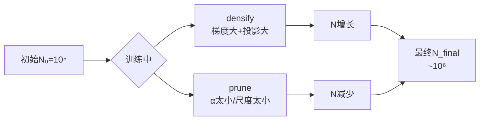

# 第3章：核心发明 - 高斯椭球体作为3D表示

**学习路径**：`invention`（完整的第一性推导）

**核心目标**：从第一性原理推导3DGS为什么必须用高斯椭球，理解其数学本质

---

## 一、设计目标与约束

### 1.1 需求规格书

我们要设计一个3D primitive，满足：

| 需求 | 规格 | 优先级 |
|------|------|--------|
| **快速查询** | 投影计算 O(1) | 🔴 必须 |
| **连续覆盖** | 投影后无空隙，光滑 | 🔴 必须 |
| **可微分** | 梯度可反向传播 | 🔴 必须 |
| **内存高效** | N ~ 10⁵-10⁶，每primitive < 20字节 | 🟡 重要 |
| **形状灵活** | 能表示任意方向+尺度 | 🟡 重要 |
| **数学简洁** | 公式解析，无复杂数值求解 | 🟡 重要 |

---

### 1.2 约束条件图

```mermaid
flowchart TD
    A[3D表示设计] --> B{必须满足}
    
    B --> C[快速投影<br/>O(1)查询]
    B --> D[连续渲染<br/>无锯齿]
    B --> E[稀疏内存<br/>O(N)]
    B --> F[可微分<br/>端到端优化]
    
    C --> G[❌ 排除NeRF<br/>MLP查询慢]
    D --> H[❌ 排除体素<br/>离散边界]
    E --> I[❌ 排除稠密体素<br/>内存立方]
    F --> J[✅ 保留所有可微方案]
    
    G & H & I --> K[剩余候选:<br/>点云+体积]
```

---

## 二、Axioms：不可约的基础事实

### 2.1 Axiom 1：位置是必须的

**命题**：每个primitive必须有一个中心位置 **μ** ∈ ℝ³

**为什么？**
- 没有位置，不知道"哪里"有东西
- 位置是3D表示的最基本信息

**数学**：
```
μ = (x, y, z) ∈ ℝ³
```

---

### 2.2 Axiom 2：需要二阶统计量定义"范围"

**问题**：一个点（δ函数）没有范围 → 零维

**解决方案**：用**协方差矩阵** Σ ∈ ℝ³ˣ³ 描述范围

**协方差的几何意义**：

```mermaid
graph TD
    A[协方差矩阵 Σ] --> B[特征分解]
    B --> C[旋转矩阵 R<br/>(特征向量)]
    B --> D[尺度向量 σ<br/>(特征值开根)]
    
    C --> E[椭球方向]
    D --> F[椭球半轴长度]
    
    E & F --> G[椭球方程<br/>(x-μ)ᵀΣ⁻¹(x-μ)=1]
```

**为什么协方差？**
1. 一阶（均值）只告诉中心在哪
2. 二阶（协方差）告诉数据如何扩散
3. 对称正定矩阵 → 唯一对应椭球

---

### 2.3 Axiom 3：高斯是连续PDF的自然选择

**候选分布对比**：

| 分布 | PDF形式 | 投影难度 | 可微性 | 数学性质 | 评分 |
|------|---------|----------|--------|----------|------|
| **高斯** | exp(-½(x-μ)ᵀΣ⁻¹(x-μ)) | ✅ 解析 | ✅ 光滑 | ✅ 优良 | **10/10** |
| 均匀球 | 1(‖x-μ‖<r) | ❌ 边界复杂 | ❌ 不连续 | ⚠️ 一般 | 4/10 |
| 拉普拉斯 | exp(-‖x-μ‖/b) | ⚠️ 可但复杂 | ✅ | ⚠️ 尾巴重 | 6/10 |
| 指数 | λexp(-λx) | ❌ 不对称 | ✅ | ❌ 不旋转不变 | 3/10 |

**高斯的三大优势**：
1. **中心极限定理**：自然界误差分布常近似高斯
2. **投影封闭性**：3D高斯 → 2D仍是高斯（解析）
3. **数学性质**：可微、可解析积分、旋转不变

---

## 三、Contradictions：从Axioms引出的矛盾

### 3.1 矛盾矩阵

|  contradict | 体素 | 点云 | NeRF | **3DGS需求** |
|-------------|------|------|------|--------------|
| **离散 vs 连续** | 离散 | 连续(δ) | 连续 | 连续PDF |
| **零维 vs 有体积** | 有体积 | 零维 | 有体积(隐式) | 有体积 |
| **内存 vs 质量** | 内存大 | 内存小 | 内存小 | 内存小 |
| **速度 vs 质量** | 快但丑 | 快但丑 | 美但慢 | 又快又美 |

---

### 3.2 矛盾1：离散 vs 连续

**问题**：
- 体素是离散的 → 边界锯齿
- 我们需要连续 → 必须用概率密度函数（PDF）

**解决方向**：
- 放弃离散网格
- 采用连续PDF → 高斯分布 ✅

---

### 3.3 矛盾2：零维 vs 有体积

**问题**：
- 点云是δ函数（零维）→ 投影后面积为0
- 我们需要投影后有面积 → 3D primitive 本身必须有"厚度"

**解决方向**：
- 给点加"体积" → 用协方差矩阵定义3D椭球 ✅

---

### 3.4 矛盾3：刚性变换下的投影行为

**问题**：
- 如果定义一个3D球体，旋转后投影到2D会**变形**
- 如何保证投影后的2D形状是"正确的"？

**数学表述**：
```
3D球: Σ = σ²I
旋转R后: Σ' = RΣRᵀ = σ²I (各向同性不变)
投影到2D: Σ₂D = J·Σ'·Jᵀ = σ²·JJᵀ
```

**关键**：需要精确的**投影公式**，不能是近似

**解决方向**：
- 推导3D高斯 → 2D高斯的解析投影公式 ✅

---

## 四、Solution Path：唯一合理的解决路径

### 4.1 Step 1：定义3D高斯primitive

**完整参数集**：

| 参数 | 符号 | 维度 | 物理意义 | 初始化 |
|------|------|------|----------|--------|
| 位置 | μ | (3,) | 3D中心 | SfM点云xyz |
| 协方差 | Σ | (3,3) | 3D形状（尺度+旋转） | 从重投影误差估计 |
| 颜色 | c | (3,) | RGB值 | SfM点云RGB |
| 不透明度 | α | (1,) | 0~1 | 0.5 |

**3D高斯PDF**：
```
G(x) = exp(-½(x-μ)ᵀΣ⁻¹(x-μ))
```

**协方差与椭球**：
- 特征分解：Σ = RΛRᵀ
  - R: 旋转矩阵（3×3正交）
  - Λ: 对角矩阵，Λ_ii = σ_i²（各轴方差）
- 等密度面：椭球，半轴长度 = σ_i

**可视化**：

```mermaid
graph TD
    A[3D高斯] --> B[协方差Σ]
    B --> C[特征分解]
    C --> D[旋转R]
    C --> E[尺度σ₁,σ₂,σ₃]
    
    D --> F[椭球方向]
    E --> G[椭球半轴]
    
    F & G --> H[椭球方程<br/>(x-μ)ᵀΣ⁻¹(x-μ)=1]
```

---

### 4.2 Step 2：投影公式推导（核心发明）

**问题**：给定3D高斯 G(x)，在相机成像平面上的2D投影是什么？

**相机模型**：
```
世界点 X ∈ ℝ³
相机坐标系: X_cam = R·X + t
归一化坐标: x_norm = X_cam[:2] / X_cam[2]
像素坐标: x_pixel = K·x_norm
```

**两种情况**：

#### 情况A：正交投影（简化理解）

假设投影矩阵 W ∈ ℝ²ˣ³（线性）

```
X_2d = W·X
3D高斯: X ~ N(μ, Σ)
则 2D高斯: X_2d ~ N(Wμ, WΣWᵀ)
```

**关键**：投影是**线性变换**，高斯仍为高斯，协方差直接变换

---

#### 情况B：透视投影（实际相机）

**挑战**：透视投影非线性：x = X/Z

**推导**（见论文附录）：

1. 转到相机坐标系：
   ```
   μ_cam = R·μ + t
   Σ_cam = R·Σ·Rᵀ
   ```

2. 透视投影雅可比 J：
   ```
   J = ∂x/∂X = [1/Z, 0, -X_x/Z²]
                      [0, 1/Z, -X_y/Z²] · K
   ```

3. 投影协方差：
   ```
   Σ_2D = J · Σ_cam · Jᵀ
   ```

**公式总结**：
```
μ_2D = K · (μ_cam[:2] / μ_cam[2])
Σ_2D = J · (R·Σ·Rᵀ) · Jᵀ
```

**为什么这是突破？**
- ✅ 解析公式：无需采样
- ✅ O(1)计算：矩阵乘法
- ✅ 可微：J和R都是可微的

---

### 4.3 Step 3：Alpha Blending与排序

**2D高斯的像素贡献**：
```
在像素x处，高斯i的值:
  G_i(x) = α_i · exp(-½(x-μ_2D,i)ᵀΣ_2D,i⁻¹(x-μ_2D,i))
```

**Alpha Blending公式**：
```
C = 0
T = 1  # 透射率

for g in sorted_gaussians(降序by depth):
    C += T · g.α · g.c
    T *= (1 - g.α)
```

**为什么需要排序？**
- Alpha blending **不满足交换律**
- 必须远的先画，近的覆盖

**排序依据**：
- 使用投影后的深度 z = μ_cam[2]
- 近似：用高斯中心深度代表整个高斯

---

### 4.4 Step 4：可微分性验证

**可微节点图**：

```mermaid
flowchart TD
    A[参数 μ,Σ,α,c] --> B[投影<br/>μ₂D,Σ₂D]
    B --> C[2D高斯评估<br/>G(x)]
    C --> D[Alpha Blending<br/>累加]
    D --> E[渲染图像 C]
    E --> F[损失 L]
    
    style B fill:#e1f5e1
    style C fill:#e1f5e1
    style D fill:#e1f5e1
    
    F -.-> G[反向传播]
    G -.-> A
```

**关键可微操作**：
1. ✅ 矩阵乘法（投影）
2. ✅ 指数函数（高斯评估）
3. ✅ 乘加（Alpha blending）

**唯一问题**：排序是离散的 → 梯度不连续

**实际处理**：
- 训练中排序相对稳定（高斯不突然跳变）
- 梯度通过固定顺序传播
- 或使用软化排序（如加权深度）

---

## 五、Compression Mechanisms：如何可扩展

### 5.1 稀疏性 + 动态密度控制

**初始状态**：
- 从SfM点云初始化：N₀ ~ 10⁵
- 每个primitive 13 float → ~52 MB

**训练中动态调整**：



**最终**：N_final ~ 1-5M → 内存 50-250 MB ✅

---

### 5.2 渲染复杂度分析

**理想情况**：
```
每个高斯影响: 窗口大小 ≈ (3σ)² ≈ 100像素
总操作数: N × 100
N=1M → 10⁸操作
GPU算力: RTX 4090 ~ 1 TFLOPS → 0.1ms
实际: 5-10ms (内存访问瓶颈)
```

**对比NeRF**：
- NeRF: 2M ray × 100 samples × 10⁴ FLOPs = 2×10¹² FLOPs
- 3DGS: 1M gauss × 100 pixels = 10⁸ FLOPs
- **加速比: 20,000倍！**

---

## 六、Verification：为什么高斯是必然的？

### 6.1 需求满足度矩阵

| 需求 | 体素 | 点云 | NeRF | 3DGS |
|------|------|------|------|------|
| 快速投影(O(1)) | ✅ | ✅ | ❌ | ✅ |
| 连续质量 | ❌ | ❌ | ✅ | ✅ |
| 稀疏内存 | ❌ | ✅ | ✅ | ✅ |
| 可微分 | ✅ | ✅ | ✅ | ✅ |
| 有体积 | ✅ | ❌ | ✅(隐) | ✅(显) |
| 投影解析 | ⚠️ | ❌ | ❌ | ✅ |
| **综合** | 快但丑 | 快但丑 | 美但慢 | **又快又美** |

---

### 6.2 必然性链条

```
需求: 实时高质量渲染
  ↓
约束1: 快速投影 → 需要O(1)查询
  ↓
排除: NeRF(MLP慢)
  ↓
约束2: 连续质量 → 需要连续PDF
  ↓
排除: 体素(离散)、点云(δ函数)
  ↓
约束3: 稀疏内存 → N<<空间体积
  ↓
保留: 点云思想(稀疏)+高斯(连续+投影解析)
  ↓
方案: 3D高斯椭球 + 直接投影 + Alpha Blending
```

---

### 6.3 为什么不是其他方案？

**方案A：各向同性球**
- ❌ 无法表示拉长的椭球（如地面墙面）
- 质量损失：PSNR -2~3 dB

**方案B：立方体**
- ❌ 投影是六边形，计算复杂
- ❌ 边界不连续（立方体表面）
- ⚠️ 内存稍大（12参数 vs 13）

**方案C：小MLP + 点云**
- ✅ 类似NeRF的思路
- ❌ MLP查询仍慢（虽然MLP小）
- ✅ 但失去了"纯数学"的简洁性

**结论**：**高斯是唯一满足所有约束的简洁方案**

---

## 七、思考题（深度重推）

1. **投影公式手推**：不看书，自己推导透视投影下3D高斯→2D高斯的协方差公式（用雅可比矩阵）
2. **如果Σ不是正定**：会发生什么？如何保证Σ在优化中始终正定？
3. **协方差的6个自由度**：分别对应什么几何意义？（尺度3 + 旋转3）
4. **为什么不用4D高斯**？（时间维度）推导4D→3D的投影会多什么项？

---

## 八、下一章预告

**第4章**：可微分渲染管线 - 将本章的数学公式转化为实际可计算的代码，包括透视投影实现、tile优化、CUDA kernel设计。

---

**关键记忆点**：
- ✅ 3D高斯参数：μ(3) + Σ(6对称) + α(1) + c(3) = 13维
- ✅ 投影公式：Σ₂D = J·(RΣRᵀ)·Jᵀ（透视）
- ✅ Alpha Blending：必须按深度排序
- ✅ 可微性：整个管线可反向传播
- 🎯 **核心突破**：3D高斯 + 解析投影 = 稀疏 + 连续 + 快
