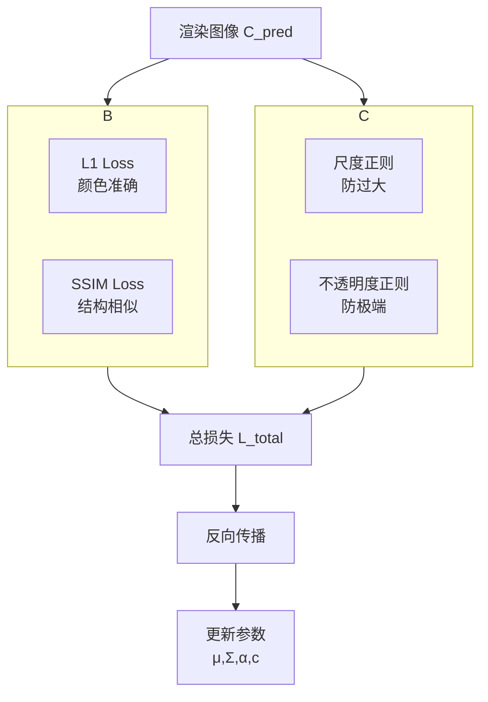
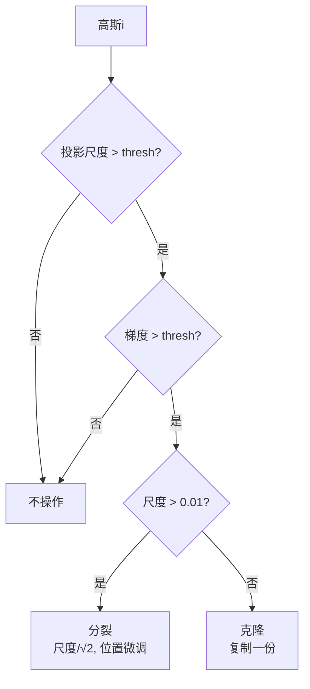

# 第5章：优化目标与损失函数

**学习路径**：`verification`

**核心目标**：理解如何设计损失函数，让高斯学习到正确的几何和外观

---

## 一、损失函数架构图



---

## 二、重建损失：L1 + SSIM

### 2.1 损失函数对比表

| 损失 | 公式 | 梯度 | 优点 | 缺点 | 3DGS权重 |
|------|------|------|------|------|----------|
| **L1** | Σ\|C_pred - C_gt\| | ±1 | 鲁棒，不漂移 | 可能模糊 | (1-λ)=0.2 |
| **L2** | Σ(C_pred - C_gt)² | 2·Δ | 数学简洁 | 敏感离群点 | 0 |
| **SSIM** | 1 - MSSIM | 感知梯度 | 结构清晰 | 计算稍慢 | λ=0.8 |

**为什么不用纯L2？**
- L2对离群点敏感（大误差惩罚过大）
- L1更鲁棒，但模糊
- SSIM补充结构信息 → 减少模糊

---

### 2.2 SSIM公式（多尺度）

**单尺度SSIM**（窗口局部）：
```
SSIM(x,y) = (2μ_xμ_y + C1)(2σ_xy + C2) / (μ_x²+μ_y²+C1)(σ_x²+σ_y²+C2)
```

**MSSIM**（多尺度）：
```
MSSIM = avg(SSIM_scale1, SSIM_scale2, SSIM_scale3, ...)
```

**3DGS配置**：
- λ_ssim = 0.8（SSIM权重）
- (1-λ) = 0.2（L1权重）

**梯度分析**：
```
L_img = 0.2·L1 + 0.8·(1-SSIM)
∂L_img/∂C_pred = 0.2·sign(Δ) - 0.8·∂SSIM/∂C_pred
```

---

## 三、正则化项

### 3.1 尺度正则

**问题**：高斯尺度Σ可以任意大或任意小

**不良情况**：
- 尺度无限大 → 高斯覆盖整个图像（严重模糊）
- 尺度无限小 → 退化为点（噪声）

**惩罚函数**：
```
L_scale = Σ_i max(0, σ_i - σ_max)
其中 σ_i = sqrt(Σ_i的特征值)
```

**为什么只惩罚过大？**
- 小尺度 → 点状，但不会模糊，且易于densify扩大
- 大尺度 → 会"污染"大范围像素，必须限制

**超参数**：
- σ_max = 1.0（世界坐标单位，需根据场景尺度调整）

---

### 3.2 不透明度正则

**问题**：α可以接近1（完全不透明）或接近0（完全透明）

**不良情况**：
- α=1且尺度大 → 不透明大斑块，遮挡后续高斯
- α=0 → 无贡献，浪费参数

**惩罚策略**（论文未明确，实践中常用）：
```python
# 惩罚过高的α（防止遮挡）
L_opacity = torch.clamp(alpha - 0.99, min=0).mean()

# 或惩罚过低的α（防止稀疏过度）
L_opacity = torch.clamp(0.01 - alpha, min=0).mean()
```

---

## 四、密度控制：Densify & Prune

### 4.1 为什么需要动态密度？

**初始点云问题**：
- SfM点云稀疏且分布不均匀
- 某些区域点少 → 重建空洞
- 某些区域点多 → 冗余

**解决方案**：训练中动态调整高斯数量

---

### 4.2 Densify条件（双条件触发）

| 条件 | 阈值 | 含义 | 为什么 |
|------|------|------|--------|
| **投影尺度大** | > 3像素 | 该高斯在屏幕上很大 | 3D尺度太大，需分裂 |
| **梯度大** | > 0.0002 | |∂L/∂μ\|或\|∂L/∂Σ\|大 | 重建误差大，需更多表示 |

**决策逻辑**：



---

### 4.3 Densify操作

**克隆（Clone）**：
```python
new_mu = mu[i].clone()
new_Sigma = Sigma[i].clone()
new_alpha = alpha[i].clone()
new_color = color[i].clone()
# 添加到列表
```

**分裂（Split）**：
```python
# 沿主特征向量方向分裂成两个
eigvals, eigvecs = torch.linalg.eigh(Sigma[i])
main_dir = eigvecs[:, -1]  # 最大特征值对应的特征向量

# 新尺度 = 原尺度 / √2
new_scale = torch.sqrt(eigvals) / np.sqrt(2)

# 新位置 = μ ± 0.01·主方向
new_mu1 = mu[i] + 0.01 * main_dir
new_mu2 = mu[i] - 0.01 * main_dir
```

---

### 4.4 Prune条件

| 条件 | 阈值 | 操作 |
|------|------|------|
| α太小 | < 0.001 | 删除 |
| 尺度太小 | < 1e-6 | 删除 |

**为什么？**：
- α≈0 → 无渲染贡献
- 尺度≈0 → 数值不稳定且无意义

---

### 4.5 密度控制调度

| 训练阶段 | 步数范围 | Densify频率 | Prune |
|----------|----------|-------------|-------|
| 快速生长 | 0-7k | 每500步 | 否 |
| 精细调整 | 7k-15k | 每1000步 | 否 |
| 稳定收敛 | 15k-30k | 无 | 每1000步 |

**为什么调度？**
- 前期：快速增加高斯数量，覆盖场景
- 中期：稳定优化，避免过度densify
- 后期：只删除，不再增加

---

## 五、训练循环（完整版）

### 5.1 伪代码

```python
# 超参数
total_steps = 30000
densify_interval = 1000
densify_from = 500
prune_from = 15000
grad_threshold = 0.0002
scale_threshold = 0.01  # 像素

# 初始化
gaussians = init_from_sfm(...)
optimizer = Adam([
    {'params': gaussians.mu, 'lr': 1.6e-4},
    {'params': gaussians.Sigma, 'lr': 1e-3},
    {'params': gaussians.alpha, 'lr': 5e-2},
    {'params': gaussians.color, 'lr': 5e-3}
])

for step in range(total_steps):
    # 1. 采样
    gt_image, camera = dataset.sample()
    
    # 2. 渲染
    rendered, radii = render(gaussians, camera)
    
    # 3. 损失
    loss, L1, L_ssim = compute_loss(rendered, gt_image, gaussians)
    
    # 4. 反向
    optimizer.zero_grad()
    loss.backward()
    optimizer.step()
    
    # 5. 缓存梯度（densify用）
    if step % densify_interval == 0:
        grads_mu = gaussians.mu.grad.detach().norm(dim=1)
        grads_Sigma = gaussians.Sigma.grad.detach().view(N,-1).norm(dim=1)
    
    # 6. 密度控制
    if step % densify_interval == 0:
        if densify_from <= step < prune_from:
            densify_and_prune(gaussians, optimizer, radii,
                              grads_mu, grads_Sigma,
                              grad_threshold, scale_threshold)
        elif step >= prune_from:
            prune_only(gaussians, optimizer, radii)
    
    # 7. 学习率调度
    if step in [7500, 15000]:
        for g in optimizer.param_groups:
            g['lr'] *= 0.1
    
    # 8. 日志
    if step % 100 == 0:
        psnr = 10 * log10(1.0 / L1.item())
        print(f"Step {step}: loss={loss:.4f}, PSNR={psnr:.2f}, #gauss={len(gaussians)}")
```

---

### 5.2 超参数总结表

| 参数 | 典型值 | 作用 | 调优方向 |
|------|--------|------|----------|
| λ_ssim | 0.8 | SSIM权重 | 质量差→↑λ |
| λ_scale | 0.01 | 尺度正则强度 | 高斯太扁→↑λ |
| λ_opacity | 0.01 | 不透明度正则 | α极端→↑λ |
| grad_threshold | 0.0002 | Densify触发梯度 | 空洞多→↓阈值 |
| scale_threshold | 0.01(像素) | Densify触发尺度 | 高斯太扁→↓阈值 |
| prune_alpha | 0.001 | 删除α阈值 | 高斯太多→↓阈值 |
| lr_mu | 1.6e-4 | 位置学习率 | 不收敛→调LR |
| lr_Sigma | 1e-3 | 协方差学习率 | 形状不调→调LR |
| lr_alpha | 5e-2 | 不透明度学习率 | α不收敛→调LR |
| lr_color | 5e-3 | 颜色学习率 | 颜色漂移→调LR |

---

## 六、思考题

1. **为什么L1+SSIM组合**？纯L1或纯SSIM各有什么问题？
2. **梯度大才densify**：如果某个高斯梯度大但尺度小（已很精细），该分裂吗？
3. **学习率分组**：为什么μ、Σ、α、c要用不同LR？估算它们的梯度量级差异
4. **如果densify太激进**（高斯爆炸到10M+），如何调整参数？

---

## 七、下一章预告

**第6章**：数据采集与初始化 - 如何从SfM点云得到高斯初始状态？详解COLMAP输出解析、尺度估计、坐标系转换。

---

**关键记忆点**：
- ✅ 总损失：L = 0.2·L1 + 0.8·(1-SSIM) + λ_scale·L_scale
- ✅ Densify：投影尺度大 + 梯度大
- ✅ Prune：α太小 或 尺度太小
- ✅ 学习率调度：7.5k和15k步 ×0.1
- 🎯 **核心创新**：自适应密度控制让稀疏性动态调整
