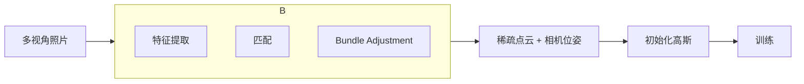

# 第6章：数据采集与初始化

**学习路径**：`example`（最小可行案例）

**核心目标**：从多视角照片和SfM输出，得到可训练的3D高斯集合

---

## 一、数据流程总览



---

## 二、SfM（Structure from Motion）详解

### 2.1 SfM能输出什么？

| 输出 | 格式 | 用途 |
|------|------|------|
| **相机内参** | K矩阵（fx,fy,cx,cy） | 投影计算 |
| **相机外参** | R(旋转), t(平移) | 世界→相机变换 |
| **稀疏点云** | (X,Y,Z,R,G,B,error,track) | 高斯初始化 |
| **重投影误差** | 每点每视角误差 | 尺度估计 |

---

### 2.2 COLMAP工作流

**命令行流程**：

```bash
# 1. 特征提取
colmap feature_extractor \
  --database_path database.db \
  --image_path images/

# 2. 特征匹配
colmap exhaustive_matcher \
  --database_path database.db

# 3. 稀疏重建（SfM）
colmap mapper \
  --database_path database.db \
  --image_path images/ \
  --output_path sparse/

# 4. 验证
colmap model_analyzer --path sparse/0/
```

**输出结构**：
```
sparse/0/
├── cameras.bin    # 相机模型 + 内参
├── images.bin     # 图像外参（四元数 + 平移）
└── points3D.bin   # 3D点云 + RGB + tracks
```

---

### 2.3 COLMAP二进制格式解析

**使用pycolmap**（推荐）：
```python
import pycolmap

recon = pycolmap.Reconstruction("sparse/0/")

# 相机
for cam_id, camera in recon.cameras.items():
    print(f"Camera {cam_id}: model={camera.model}, "
          f"params={camera.params}, width={camera.width}, height={camera.height}")

# 图像
for img_id, image in recon.images.items():
    print(f"Image {image.name}: qvec={image.qvec}, tvec={image.tvec}")

# 点云
for pt_id, point in recon.points3D.items():
    print(f"Point {pt_id}: xyz={point.xyz}, rgb={point.rgb}, error={point.error}")
    print(f"  Track: {len(point.track)} observations")
```

---

## 三、从SfM点云初始化高斯

### 3.1 初始化参数表

| 参数 | 来源 | 初始值 | 说明 |
|------|------|--------|------|
| μ | SfM点云xyz | 直接复制 | 位置 |
| c | SfM点云RGB | RGB/255 | 颜色（归一化） |
| Σ | 估计（见下） | scale²·I | 协方差（各向同性） |
| α | 固定值 | 0.5 | 不透明度（半透明） |

---

### 3.2 尺度估计（关键步骤）

**问题**：SfM点只有位置，没有尺度信息

**朴素方案**：设Σ = 0.01²·I
- ❌ 太小 → 渲染几乎不可见

**正确方案**：从**重投影误差**估计尺度

**几何关系**：

```mermaid
graph LR
    A[3D点P] --> B[投影到图像1]
    A --> C[投影到图像2]
    B --> D[观测像素p1]
    C --> E[观测像素p2]
    
    D --> F[重投影误差<br/>‖p1 - proj(P)‖]
    E --> F
    
    F --> G["误差大 → P的不确定性大<br/>→ Σ应该大"]
```

**公式**：
```
对于点P，在视角j下的重投影误差:
  e_j = ‖p_j - proj(P, camera_j)‖

尺度估计: scale = median(e_j for all j)
协方差: Σ = (scale · factor)² · I
```

**为什么用中位数？**
- 对抗离群点（某些视角误差大）
- 稳健估计

**factor选择**：
- 保守：0.5（论文建议）
- 激进：1.0-2.0（如果画面太暗）

---

### 3.3 初始化伪代码

```python
def init_gaussians_from_sfm(points3d, cameras, images, scale_factor=0.5):
    """
    points3d: SfM点云列表
    cameras: 相机参数字典
    images: 图像外参列表
    scale_factor: 保守系数（0.5-1.0）
    """
    gaussians = []
    
    for p in points3d:
        # 1. 位置和颜色
        mu = torch.tensor(p.xyz, dtype=torch.float32)
        color = torch.tensor(p.rgb / 255.0, dtype=torch.float32)
        
        # 2. 估计尺度
        reproj_errors = []
        for track in p.track:
            img = images[track.image_id]
            cam = cameras[img.camera_id]
            
            # 投影
            R = qvec2rotmat(img.qvec)
            T = img.tvec
            K = build_K(cam)
            X_cam = R @ p.xyz + T
            proj = K @ X_cam
            proj = proj[:2] / proj[2]
            
            err = np.linalg.norm(proj - track.pixel)
            reproj_errors.append(err)
        
        scale = np.median(reproj_errors) * scale_factor
        sigma = scale
        
        # 3. 协方差（各向同性）
        Sigma = torch.eye(3) * (sigma**2)
        
        # 4. 不透明度
        alpha = torch.tensor([0.5])
        
        gaussians.append(Gaussian(mu, Sigma, alpha, color))
    
    return GaussiansList(gaussians)
```

---

## 四、相机参数处理

### 4.1 坐标系转换问题

**COLMAP坐标系**（通常）：
- 右手系
- Y轴向上
- Z轴向前（相机光轴）

**NeRF/3DGS坐标系**（常用）：
- 右手系
- Z轴向上
- Y轴向下（图像坐标y向下）

**转换矩阵**：
```python
# COLMAP → NeRF
transform = np.diag([1, -1, -1])  # Y和Z翻转

R = R @ transform
T = transform @ T  # 或 T = T @ transform（根据约定）
```

**验证方法**：
1. 用初始高斯渲染一帧
2. 与GT图像并排显示
3. 如果左右/上下颠倒，调整R/T符号

---

### 4.2 内参矩阵K

**从COLMAP相机参数**：
```python
def build_K(camera):
    """camera: pycolmap.Camera对象"""
    if camera.model == "PINHOLE":
        fx, fy, cx, cy = camera.params
        K = np.array([[fx, 0, cx],
                      [0, fy, cy],
                      [0,  0,  1]])
    elif camera.model == "SIMPLE_PINHOLE":
        fx, cx, cy = camera.params
        K = np.array([[fx, 0, cx],
                      [0, fx, cy],
                      [0,  0,  1]])
    else:
        raise NotImplementedError(f"Model {camera.model}")
    return K
```

---

## 五、数据集类实现

### 5.1 Dataset类框架

```python
class SfMDataset(Dataset):
    def __init__(self, sparse_path, image_path, split='train', scale=1.0):
        self.recon = pycolmap.Reconstruction(sparse_path)
        self.image_path = Path(image_path)
        self.scale = scale
        
        # 过滤训练/测试
        all_images = list(self.recon.images.values())
        if split == 'train':
            self.images = all_images[:int(0.8*len(all_images))]
        else:
            self.images = all_images[int(0.8*len(all_images)):]
        
        self.points3d = list(self.recon.points3D.values())
    
    def __len__(self):
        return len(self.images)
    
    def __getitem__(self, idx):
        img = self.images[idx]
        camera = self.recon.cameras[img.camera_id]
        
        # 1. 加载图像
        img_file = self.image_path / img.name
        image = Image.open(img_file).convert("RGB")
        if self.scale != 1.0:
            new_size = (int(image.width*self.scale), int(image.height*self.scale))
            image = image.resize(new_size, Image.LANCZOS)
        image = torch.from_numpy(np.array(image)/255.0).float().permute(2,0,1)
        
        # 2. 相机参数
        K = build_K(camera)
        R = qvec2rotmat(img.qvec)
        T = img.tvec
        
        if self.scale != 1.0:
            K[:2] *= self.scale
        
        # 3. 坐标系转换（可选）
        # R = R @ np.diag([1, -1, -1])
        
        return image, {
            'R': torch.tensor(R, dtype=torch.float32),
            'T': torch.tensor(T, dtype=torch.float32),
            'K': torch.tensor(K, dtype=torch.float32),
            'width': int(camera.width * self.scale),
            'height': int(camera.height * self.scale)
        }
```

---

## 六、常见陷阱与诊断

### 6.1 陷阱诊断表

| 症状 | 可能原因 | 检查方法 | 解决方案 |
|------|----------|----------|----------|
| **渲染全黑** | Σ太小 | `Sigma.diag().mean()` | scale_factor ×5-10 |
| **渲染全白** | α太大 | `alpha.mean()` | α初始值调至0.3 |
| **图像偏移** | 坐标系错 | 渲染vs GT对比 | 调整R/T符号 |
| **空洞多** | 初始点云稀疏 | `len(points3d)` | SfM调参数增加点 |
| **条纹伪影** | Σ奇异 | `torch.det(Sigma)` | 添加Σ正则 |

---

### 6.2 调试可视化代码

```python
def debug_initialization(gaussians, camera, H, W):
    """检查初始化质量"""
    # 1. 渲染
    rendered = render(gaussians, camera, H, W)
    
    # 2. 统计
    print(f"高斯数量: {len(gaussians)}")
    print(f"平均尺度: {gaussians.get_scales().mean():.6f}")
    print(f"平均α: {gaussians.alpha.mean():.6f}")
    
    # 3. 可视化
    plt.figure(figsize=(12,4))
    plt.subplot(131)
    plt.imshow(rendered.permute(1,2,0).cpu().numpy().clip(0,1))
    plt.title("Initial Render")
    
    plt.subplot(132)
    mu_2d, _, _ = project_gaussian(gaussians.mu, gaussians.Sigma,
                                    camera['R'], camera['T'], camera['K'])
    plt.scatter(mu_2d[:,0].cpu(), mu_2d[:,1].cpu(), s=1, alpha=0.5)
    plt.xlim(0, W); plt.ylim(H, 0)
    plt.title(f"Projected centers ({len(gaussians)})")
    
    plt.subplot(133)
    scales = gaussians.get_scales().max(dim=1)[0].cpu()
    plt.hist(scales.numpy(), bins=50)
    plt.title("Scale distribution")
    plt.tight_layout()
    plt.show()
```

---

## 七、思考题

1. **尺度估计**：如果SfM重投影误差都很小（<1像素），说明什么？应该怎么调scale_factor？
2. **坐标系**：如果COLMAP用OpenGL坐标系（右手Y-up），而渲染用OpenCV（右手Z-up），写出完整的变换矩阵
3. **初始化策略**：为什么不直接用SfM点云作为"点"开始训练，而要加高斯？实验点精灵渲染，观察效果
4. **数据增强**：在训练时，可以对图像做哪些增强？对相机参数有什么影响？

---

## 八、下一章预告

**第7章**：完整训练流程 - 将所有组件整合成闭环，详解训练循环、学习率调度、收敛判断、常见问题诊断。

---

**关键记忆点**：
- ✅ SfM工具：COLMAP（二进制 + pycolmap API）
- ✅ 尺度估计：scale = median(重投影误差) × factor
- ✅ 初始化：μ=xyz, c=RGB/255, Σ=scale²·I, α=0.5
- ✅ 坐标系：注意COLMAP与渲染坐标系的差异（Y/Z翻转）
- 🎯 **初始化质量决定训练稳定性**
