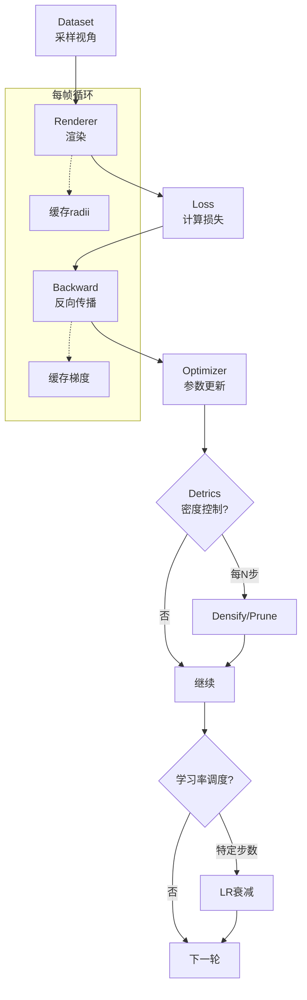
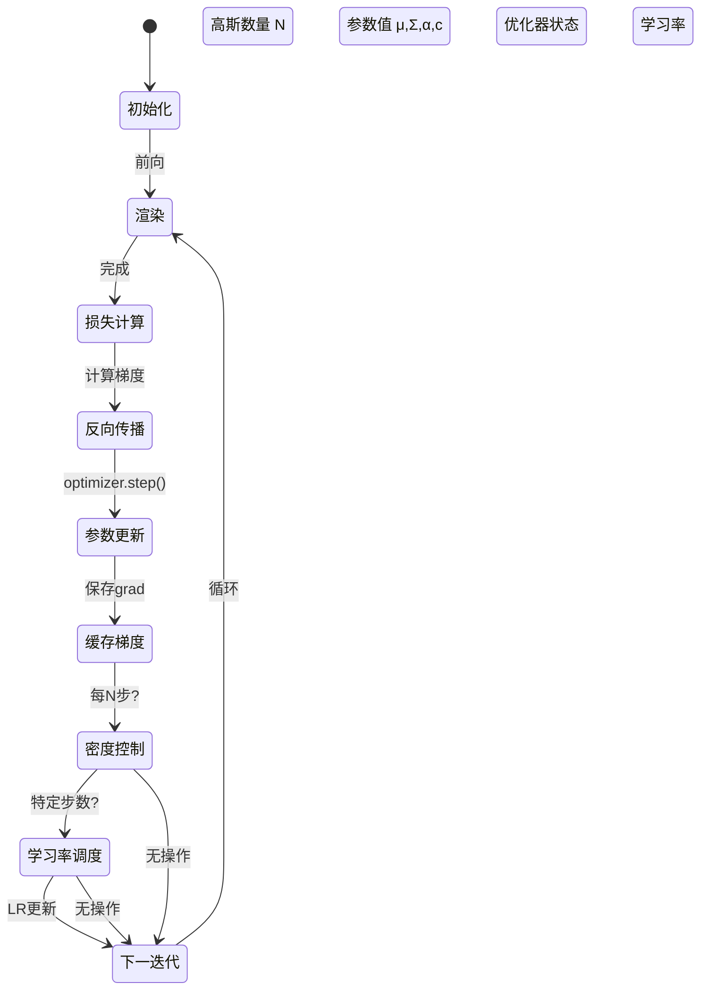
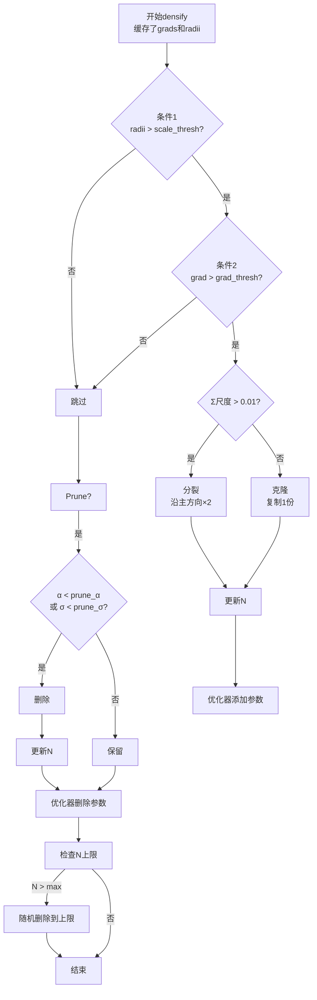

# 第7章：完整训练流程

**学习路径**：`example`

**核心目标**：将所有组件整合成可运行的训练闭环

---

## 一、训练架构全景图



---

## 二、组件接口定义

### 2.1 GaussianModel接口

```python
class GaussianModel:
    def __init__(self, points3d):
        # 参数张量
        self.mu       # (N,3) 位置
        self.Sigma    # (N,3,3) 协方差
        self.alpha    # (N,1) 不透明度
        self.color    # (N,3) 颜色
        self.N        # 高斯数量
    
    def get_scales(self):
        """从Σ提取各轴尺度 √(特征值)"""
        eigvals = torch.linalg.eigvalsh(self.Sigma)  # (N,3)
        return torch.sqrt(eigvals)  # (N,3)
    
    def to(self, device): ...
    def half(self): ...
```

---

### 2.2 Renderer接口

```python
def render(gaussians, camera, H, W):
    """
    输入:
        gaussians: GaussianModel
        camera: dict{R, T, K}
        H, W: 图像分辨率
    输出:
        image: (3,H,W) 渲染图像
        radii: (N,) 每个高斯的投影半径（用于densify）
    """
    # 1. 投影
    mu_2d, Sigma_2d, depth = project_gaussians(
        gaussians.mu, gaussians.Sigma,
        camera['R'], camera['T'], camera['K']
    )
    
    # 2. 计算投影半径
    eigvals = torch.linalg.eigvalsh(Sigma_2d)  # (N,2)
    radii = 3.0 * torch.sqrt(eigvals.max(dim=1)[0])  # (N,)
    
    # 3. 排序
    indices = torch.argsort(depth, descending=True)
    
    # 4. Tile渲染（返回image）
    image = render_tiled(gaussians, indices, mu_2d, Sigma_2d, H, W)
    
    return image, radii
```

---

### 2.3 Loss接口

```python
def compute_loss(rendered, gt, gaussians, λ_ssim=0.8, λ_scale=0.01):
    # 重建损失
    L1 = F.l1_loss(rendered, gt)
    L_ssim = 1 - ms_ssim(rendered, gt)
    L_img = (1-λ_ssim)*L1 + λ_ssim*L_ssim
    
    # 尺度正则
    scales = gaussians.get_scales()  # (N,3)
    L_scale = torch.clamp(scales - 1.0, min=0).mean()
    
    # 总损失
    L_total = L_img + λ_scale * L_scale
    
    return L_total, L1, L_ssim
```

---

## 三、训练循环状态机

### 3.1 状态转换图



---

### 3.2 关键状态变量

| 变量 | 类型 | 维度 | 更新时机 | 用途 |
|------|------|------|----------|------|
| N | int | 1 | densify/prune | 高斯数量 |
| μ | tensor | (N,3) | 每步 | 位置优化 |
| Σ | tensor | (N,3,3) | 每步 | 形状优化 |
| α | tensor | (N,1) | 每步 | 透明度优化 |
| c | tensor | (N,3) | 每步 | 颜色优化 |
| radii | tensor | (N,) | 每帧 | densify判断 |
| grads_mu | tensor | (N,) | 每N步 | densify判断 |
| grads_Sigma | tensor | (N,) | 每N步 | densify判断 |

---

## 四、密度控制算法

### 4.1 Densify & Prune流程图



---

### 4.2 密度控制参数表

| 参数 | 典型值 | 作用 | 调优 |
|------|--------|------|------|
| densify_interval | 1000 | 检查间隔 | 太小慢，太大不及时 |
| densify_from | 500 | 何时开始densify | 过早不稳定 |
| prune_from | 15000 | 何时开始prune | 太早删不够 |
| grad_threshold | 0.0002 | 梯度阈值 | 空洞多→↓ |
| scale_threshold | 0.01像素 | 投影尺度阈值 | 高斯扁→↓ |
| prune_alpha | 0.001 | α删除阈值 | 高斯多→↓ |
| max_gaussians | 2e6 | 数量上限 | 内存限制 |

---

## 五、学习率调度

### 5.1 三阶段调度图


**为什么三阶段？**
1. **阶段1**：快速覆盖场景，高斯数量快速增长
2. **阶段2**：稳定优化，避免过度densify
3. **阶段3**：微调已有高斯，防止过拟合

---

### 5.2 参数组学习率

| 参数组 | 初始LR | 调度点 | 原因 |
|--------|--------|--------|------|
| μ | 1.6e-4 | 7.5k, 15k ×0.1 | 位置需精细调整 |
| Σ | 1e-3 | 7.5k, 15k ×0.1 | 尺度变化需谨慎 |
| α | 5e-2 | 7.5k, 15k ×0.1 | α收敛快，初始LR大 |
| c | 5e-3 | 7.5k, 15k ×0.1 | 颜色易调 |

**为什么分组？**
- 不同参数量级不同（μ在world units，α∈[0,1]）
- Adam自适应但初始LR重要

---

## 六、监控指标

### 6.1 图像质量指标

| 指标 | 公式 | 范围 | 目标 | 频率 |
|------|------|------|------|------|
| PSNR | 10·log10(1/MSE) | >0 | >30优秀 | 每100步 |
| SSIM | (2μxμy+C1)(2σxy+C2)/... | [0,1] | >0.9 | 每100步 |
| 高斯数量N | len(gaussians) | 10⁵-10⁶ | 稳定 | 每N步 |

---

### 6.2 梯度监控

```python
# 每N步记录
grad_mu_norm = gaussians.mu.grad.norm().item()
grad_Sigma_norm = gaussians.Sigma.grad.norm().item()
grad_alpha_norm = gaussians.alpha.grad.norm().item()

print(f"Gradient norms: μ={grad_mu_norm:.6f}, "
      f"Σ={grad_Sigma_norm:.6f}, α={grad_alpha_norm:.6f}")
```

**诊断**：
- 梯度长期接近0 → 高斯"死"了或LR太小
- 梯度爆炸（NaN） → LR太大，降低10倍

---

## 七、收敛判断

### 7.1 定量标准

| 指标 | 收敛条件 | 检查频率 |
|------|----------|----------|
| PSNR | 连续1000步变化 < 0.1 dB | 每1000步 |
| 高斯数量N | 连续N步不变 | 每N步 |
| 损失 | 连续1000步变化 < 0.001 | 每1000步 |

---

### 7.2 视觉判断

- ✅ 渲染图与GT无明显差异
- ✅ 几何完整（无空洞、无噪点）
- ✅ 纹理清晰（不模糊）

---

### 7.3 时间预估

| 数据集 | 图像数 | 初始点云 | 预期步数 | 时间（RTX 4090） |
|--------|--------|----------|----------|------------------|
| nerf_synthetic/chair | 100 | ~10k | 30k | 30-60分钟 |
| 小型实景 | 50-100 | ~50k | 30k | 1-2小时 |
| 中型场景 | 200-500 | ~100k | 30k | 2-4小时 |

---

## 八、思考题

1. **为什么densify前要缓存梯度**？如果实时计算会怎样？
2. **学习率三阶段**：每阶段分别优化什么？为什么LR递减？
3. **梯度消失**：某个高斯梯度长期为0，可能原因？如何恢复？
4. **如果N超过内存**：除了prune，还有什么策略？（提示：梯度累积？）

---

## 九、下一章预告

**第8章**：Feed-Forward推理 - 训练完成后，如何实现实时渲染（<10ms/帧）？详解推理优化策略。

---

**关键记忆点**：
- ✅ 训练循环：渲染→损失→反向→更新→densify/prune
- ✅ 密度控制：投影尺度大 + 梯度大 → densify；α太小 → prune
- ✅ 学习率调度：三阶段衰减（1e-2→1e-3→1e-4）
- ✅ 监控：PSNR、N、梯度范数
- 🎯 **收敛时间**：30k步，30分钟-2小时
