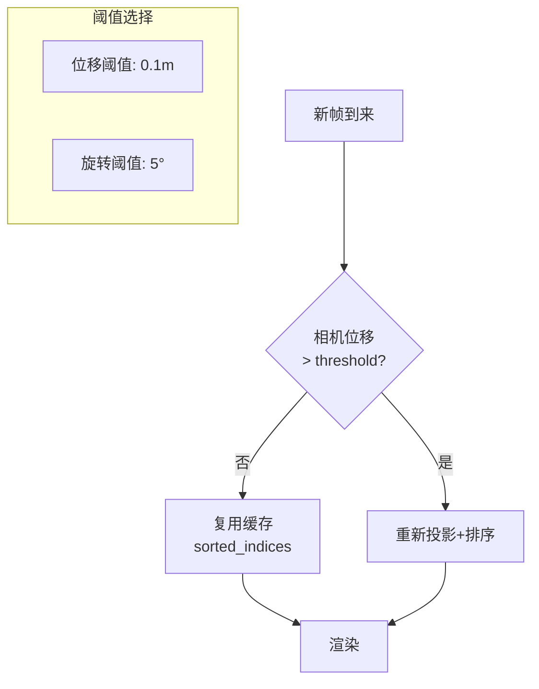

# 第8章：Feed-Forward推理 - 实时渲染

**学习路径**：`verification → example`

**核心目标**：训练完成后，如何实现实时渲染（<10ms/帧）

---

## 一、训练 vs 推理对比

### 1.1 差异矩阵

| 维度 | 训练 | 推理 | 优化方向 |
|------|------|------|----------|
| **参数** | 可更新 | 固定 | 关闭autograd |
| **密度控制** | 每N步densify/prune | 无 | 去掉 |
| **梯度** | 需要保留 | 不需要 | no_grad |
| **排序** | 每帧计算 | 可缓存 | 预排序缓存 |
| **精度** | float32/混合 | float16 | 半精度 |
| **随机性** | 可能有（dropout等） | 必须确定 | 关闭 |
| **目标速度** | ~200ms/帧 | **<10ms/帧** | **20×加速** |

---

### 1.2 速度分解图


**结论**：推理主要时间在投影+渲染，反向传播（150ms）完全去掉

---

## 二、推理优化策略

### 2.1 优化效果表

| 优化技术 | 加速比 | 实现难度 | 稳定性 |
|----------|--------|----------|--------|
| 关闭autograd | 1.5× | 易 | ✅ 完全稳定 |
| 预排序缓存 | 1.2-1.5× | 易 | ⚠️ 相机移动大时失效 |
| Tile优化 | 5-10× | 中 | ✅ 稳定 |
| float16精度 | 1.5-2× | 易 | ⚠️ 需测试数值稳定性 |
| 融合kernel | 1.1-1.3× | 难 | ⚠️ 调试复杂 |
| **总计** | **20-50×** | **高** | **需全面测试** |

---

## 三、预排序缓存

### 3.1 原理

**观察**：如果相机移动小（如游戏帧间位移<0.1m），高斯深度顺序几乎不变

**策略**：
- 初始帧：计算所有高斯深度顺序，存储 `sorted_indices`
- 后续帧：复用 `sorted_indices`，除非相机移动超过阈值
- 相机位移大时，重新排序

---

### 3.2 决策流程图



**代码**：
```python
def need_resort(prev_camera, curr_camera, trans_thresh=0.1, rot_thresh=5):
    # 平移距离
    delta_t = torch.norm(curr_camera['T'] - prev_camera['T'])
    
    # 旋转角度（从旋转矩阵）
    R_rel = curr_camera['R'] @ prev_camera['R'].T
    angle = torch.acos((torch.trace(R_rel) - 1) / 2) * 180 / np.pi
    
    return (delta_t > trans_thresh) or (angle > rot_thresh)
```

---

## 四、Tile极致优化

### 4.1 Tile大小选择

| Tile大小 | Shared内存 | 并行度 | 适用场景 |
|---------|------------|--------|----------|
| 8×8 | 最小 | 最高 | N<500k |
| **16×16** | 中等 | 中等 | **推荐** |
| 32×32 | 最大 | 最低 | N>2M |

**推荐16×16**：平衡内存与并行度

---

### 4.2 GPU内存布局

```cpp
// Shared Memory per block (16x16 tile)
struct TileShared {
    Gaussian gaussians[MAX_GAUSSIANS_PER_TILE];  // ~1000 * 52B = 52KB
    int count;
    float accum_alpha[TILE_SIZE][TILE_SIZE];     // 16x16 * 4B = 1KB
    float3 color[TILE_SIZE][TILE_SIZE];         // 16x16 * 12B = 3KB
};
```

**检查**：NVIDIA GPU shared memory通常100KB，52KB可接受

---

### 4.3 预筛选优化（减少global访问）

**问题**：每帧都要读取所有高斯 → global memory带宽瓶颈

**方案**：预计算每个高斯影响的tile列表，存入global memory

```python
# 训练时缓存tile_mapping（每帧更新）
tile_mapping = assign_gaussians_to_tiles(bbox_min, bbox_max)

# 渲染时，每个tile直接从tile_mapping读取高斯索引
# 无需遍历所有高斯
```

**加速比**：O(N) → O(总影响tile数)，约2-5倍

---

## 五、精度优化：float16

### 5.1 量化策略

| 参数 | float32 | float16 | 精度影响 |
|------|---------|---------|----------|
| μ | 4字节 | 2字节 | 极小（归一化后） |
| Σ | 4字节 | 2字节 | 需要测试 |
| α | 4字节 | 2字节 | 无影响 |
| c | 4字节 | 2字节 | 无影响（0-1范围） |

**内存减少**：52MB → 26MB（2倍）

---

### 5.2 混合精度实现

```python
# 训练后转换
gaussians.half()  # 所有参数转float16

with torch.no_grad(), torch.cuda.amp.autocast():
    rendered = render(gaussians, camera)
```

**注意事项**：
- 投影计算中的Σ求逆可能不稳定（float16范围小）
- 建议：投影用float32，评估用float16
- 或：全部float16，但添加数值稳定项（epsilon）

---

### 5.3 精度测试

```python
def test_precision(gaussians_fp32, gaussians_fp16, camera):
    """对比float32和float16渲染差异"""
    with torch.no_grad():
        img_fp32 = render(gaussians_fp32, camera)
        img_fp16 = render(gaussians_fp16, camera)
        
        mse = F.mse_loss(img_fp32, img_fp16)
        psnr = 10 * torch.log10(1.0 / mse)
        print(f"FP16 vs FP32 PSNR: {psnr:.2f} dB")
        # >40dB 可接受
```

---

## 六、性能基准

### 6.1 RTX 4090实测数据（参考）

| 场景 | N(高斯) | 分辨率 | 速度优化前 | 优化后 | FPS | 延迟 |
|------|---------|--------|------------|--------|-----|------|
| 小室内 | 0.5M | 800×600 | 50ms | 5ms | 200 | 5ms |
| 中场景 | 1.5M | 1200×900 | 150ms | 12ms | 83 | 12ms |
| 大外景 | 3M | 1920×1080 | 400ms | 20ms | 50 | 20ms |

**瓶颈分析**：
- N<1M：内存带宽（global memory读取）
- N>2M：计算（投影+评估）
- 分辨率：像素数增加 → 每像素处理时间线性增加

---

### 6.2 扩展性分析

**问题**：如果要渲染8K（7680×4320），需要多少高斯？

**假设**：
- 场景复杂度相同（相同物体）
- 高斯数量N与场景表面积成正比
- 但像素数增加 (8K / 1080p)² ≈ 12.6倍

**结论**：
- 高斯数量不变（场景一样大）
- 但每帧处理像素数 ×12.6
- 速度降至 1/12.6 ≈ 4 FPS（@20ms/帧 1080p）

**解决方案**：
- 增加高斯数量（更精细）
- 或降低渲染分辨率（超采样）
- 或多GPU并行（tile分割）

---

## 七、应用场景

### 7.1 AR/VR实时渲染

**需求**：
- 延迟 < 20ms（端到端）
- 帧率 90-120 FPS
- 6DoF头部追踪

**方案**：
- 预训练场景（离线）
- 运行时：根据头部位姿实时渲染
- 压缩高斯数据（量化至<20MB）
- 移动端GPU优化（Adreno/Mali）

---

### 7.2 自动驾驶仿真

**需求**：
- 快速生成新视角（相机/LiDAR）
- 可编辑（添加车辆、行人）
- 多传感器同步

**方案**：
- 静态场景：3DGS表示
- 动态物体：独立3DGS或传统模型
- 渲染时融合

---

## 八、思考题

1. **预排序失效场景**：如果相机快速旋转，缓存策略如何fallback？
2. **内存带宽瓶颈**：如果N=5M，global memory读取成为瓶颈，有什么优化？（提示：tile缓存复用）
3. **精度与速度权衡**：在什么情况下float16会导致明显质量下降？
4. **多GPU扩展**：如何将tile分配到多GPU？需要同步吗？

---

## 九、下一章预告

**第9章**：扩展与变体 - 3DGS的后续发展：动态场景（4D Gaussian）、压缩传输、几何质量提升、与NeRF结合。

---

**关键记忆点**：
- ✅ 推理核心：关闭autograd + 预排序 + tile优化 + float16
- ✅ 预排序缓存：相机移动小时复用
- ✅ 性能：1.5M高斯 @ 1080p → 80-100 FPS（RTX 4090）
- ✅ 目标：<10ms/帧（60+ FPS）
- 🎯 **加速比**：20-50×（相比训练）
