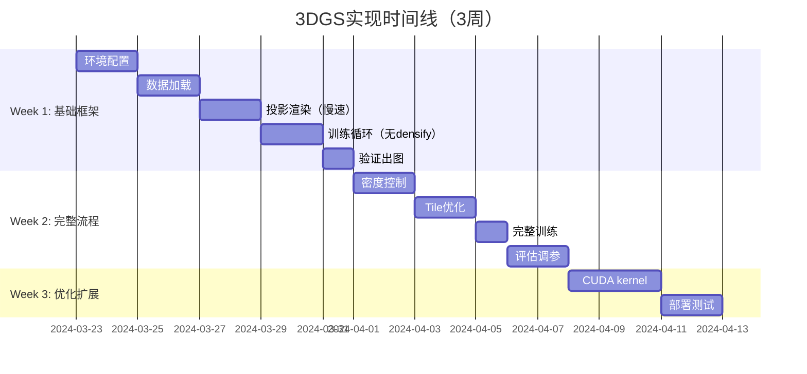

# 第10章：实践路径 - 从零到可运行的3DGS实现

**学习路径**：`example`（完整实践指南）

**核心目标**：在1-2周内，用PyTorch实现一个能跑通小数据集的简化版3DGS

---

## 一、实践路线图总览



---

## 二、阶段0：环境准备（2-4小时）

### 2.1 依赖安装清单

```bash
# 1. 创建conda环境
conda create -n 3dgs python=3.10 -y
conda activate 3dgs

# 2. 安装PyTorch（根据CUDA）
# GPU (CUDA 11.8):
conda install pytorch torchvision torchaudio pytorch-cuda=11.8 -c pytorch -c nvidia
# CPU:
conda install pytorch torchvision torchaudio cpuonly -c pytorch

# 3. 核心依赖
pip install tqdm opencv-python matplotlib numpy imageio scikit-image

# 4. 评估指标（可选）
pip install lpips torchmetrics

# 5. COLMAP Python接口（可选，用于SfM）
pip install pycolmap
```

---

### 2.2 数据集准备

**快速开始**：nerf_synthetic（100张图，适合调试）

```bash
wget https://repo-sam.inria.fr/fungraph/3d-gaussian-splatting/dataset/nerf_synthetic.zip
unzip nerf_synthetic.zip -d data/

# 结构
data/nerf_synthetic/chair/
├── train/      # 100张训练图
├── test/       # 100张测试图
└── transforms.json
```

**用自己的数据**：
```bash
# COLMAP SfM
colmap feature_extractor --database_path db/ --image_path images/
colmap exhaustive_matcher --database_path db/
colmap mapper --database_path db/ --image_path images/ --output_path sparse/
```

---

## 三、阶段1：数据加载（6-8小时）

### 3.1 模块结构

```
project/
├── utils/
│   └── colmap_loader.py   # COLMAP解析
├── data/
│   └── dataset.py         # Dataset类
└── config.yaml            # 配置文件
```

---

### 3.2 COLMAP解析器

```python
# utils/colmap_loader.py
import numpy as np
import pycolmap

def load_sfm_reconstruction(sparse_path):
    """加载COLMAP reconstruction"""
    return pycolmap.Reconstruction(str(sparse_path))

def build_K(camera):
    """从pycolmap.Camera构建K矩阵"""
    if camera.model == "PINHOLE":
        fx, fy, cx, cy = camera.params
    elif camera.model == "SIMPLE_PINHOLE":
        fx, cx, cy = camera.params
        fy = fx
    else:
        raise NotImplementedError(camera.model)
    
    return np.array([[fx, 0, cx],
                     [0, fy, cy],
                     [0,  0,  1]])

def qvec2rotmat(qvec):
    """四元数(w,x,y,z) → 旋转矩阵"""
    w, x, y, z = qvec
    return np.array([
        [1-2*y*y-2*z*z, 2*x*y-2*w*z, 2*x*z+2*w*y],
        [2*x*y+2*w*z, 1-2*x*x-2*z*z, 2*y*z-2*w*x],
        [2*x*z-2*w*y, 2*y*z+2*w*x, 1-2*x*x-2*y*y]
    ])
```

---

### 3.3 Dataset类

```python
# data/dataset.py
from torch.utils.data import Dataset
from PIL import Image
import torch

class SfMDataset(Dataset):
    def __init__(self, sparse_path, image_path, split='train', scale=1.0):
        self.recon = load_sfm_reconstruction(sparse_path)
        self.image_path = Path(image_path)
        self.scale = scale
        
        all_images = list(self.recon.images.values())
        split_idx = int(0.8 * len(all_images))
        self.images = all_images[:split_idx] if split=='train' else all_images[split_idx:]
        
        self.points3d = list(self.recon.points3D.values())
    
    def __len__(self):
        return len(self.images)
    
    def __getitem__(self, idx):
        img = self.images[idx]
        camera = self.recon.cameras[img.camera_id]
        
        # 1. 图像
        img_file = self.image_path / img.name
        image = Image.open(img_file).convert("RGB")
        if self.scale != 1.0:
            new_size = (int(image.width*self.scale), int(image.height*self.scale))
            image = image.resize(new_size, Image.LANCZOS)
        image = torch.from_numpy(np.array(image)/255.0).float().permute(2,0,1)
        
        # 2. 相机
        K = build_K(camera)
        R = qvec2rotmat(img.qvec)
        T = img.tvec
        
        if self.scale != 1.0:
            K[:2] *= self.scale
        
        return image, {
            'R': torch.tensor(R, dtype=torch.float32),
            'T': torch.tensor(T, dtype=torch.float32),
            'K': torch.tensor(K, dtype=torch.float32),
            'width': int(camera.width * self.scale),
            'height': int(camera.height * self.scale)
        }
```

---

## 四、阶段2：高斯初始化（4-6小时）

### 4.1 GaussianModel类

```python
# gaussian/gaussian.py
import torch

class GaussianModel:
    def __init__(self, points3d, cameras, images, device='cuda'):
        self.device = torch.device(device)
        self.N = len(points3d)
        
        # 初始化参数
        self.mu = torch.zeros((self.N, 3), device=self.device)
        self.Sigma = torch.zeros((self.N, 3, 3), device=self.device)
        self.alpha = torch.full((self.N, 1), 0.5, device=self.device)
        self.color = torch.zeros((self.N, 3), device=self.device)
        
        # 逐点赋值
        for i, p in enumerate(points3d):
            self.mu[i] = torch.tensor(p.xyz, device=self.device)
            self.color[i] = torch.tensor(p.rgb/255.0, device=self.device)
        
        # 尺度估计（从重投影误差）
        self._estimate_scales(points3d, cameras, images)
        
        # 初始化协方差
        scales = self.get_scales()
        for i in range(self.N):
            s = scales[i].clamp(min=1e-6)
            self.Sigma[i] = torch.diag(s**2)
    
    def _estimate_scales(self, points3d, cameras, images, factor=0.5):
        """从重投影误差估计尺度"""
        scales = []
        for p in points3d:
            errors = []
            for track in p.track:
                img = images[track.image_id]
                cam = cameras[img.camera_id]
                R = torch.from_numpy(qvec2rotmat(img.qvec)).float()
                T = torch.from_numpy(img.tvec).float()
                K = torch.from_numpy(build_K(cam)).float()
                
                X_cam = R @ torch.tensor(p.xyz) + T
                proj = K @ X_cam
                proj = proj[:2] / proj[2]
                err = torch.norm(proj - torch.tensor(track.point2D))
                errors.append(err.item())
            
            scale = np.median(errors) if errors else 0.01
            scales.append(scale * factor)
        
        self.scale_init = torch.tensor(scales, device=self.device)
    
    def get_scales(self):
        eigvals = torch.linalg.eigvalsh(self.Sigma)
        return torch.sqrt(eigvals)
```

---

## 五、阶段3：投影与渲染（8-10小时）

### 5.1 投影函数

```python
# rendering/projection.py
def project_gaussian(mu, Sigma, R, T, K):
    """3D高斯 → 2D投影"""
    # 1. 相机坐标系
    mu_cam = (R @ mu.T).T + T[None, :]
    depth = mu_cam[:, 2].clone()
    
    # 2. 投影中心
    mu_hom = (K @ mu_cam.T).T
    mu_2d = mu_hom[:, :2] / mu_hom[:, 2:3]
    
    # 3. 投影协方差
    Sigma_cam = R @ Sigma @ R.T
    
    z = mu_cam[:, 2].clamp(min=1e-6)
    J = torch.zeros((mu.shape[0], 2, 3), device=mu.device)
    J[:, 0, 0] = K[0, 0] / z
    J[:, 0, 2] = -K[0, 0] * mu_cam[:, 0] / (z**2)
    J[:, 1, 1] = K[1, 1] / z
    J[:, 1, 2] = -K[1, 1] * mu_cam[:, 1] / (z**2)
    
    Sigma_2d = J @ Sigma_cam @ J.transpose(1, 2)
    Sigma_2d = Sigma_2d + torch.eye(2, device=mu.device)[None,:,:] * 1e-8
    
    return mu_2d, Sigma_2d, depth
```

---

### 5.2 慢速渲染（调试用）

```python
def render_slow(gaussians, camera, H, W):
    """O(N·H·W)慢速版，仅调试验证"""
    mu_2d, Sigma_2d, depth = project_gaussian(
        gaussians.mu, gaussians.Sigma,
        camera['R'], camera['T'], camera['K']
    )
    
    indices = torch.argsort(depth, descending=True)
    mu_2d = mu_2d[indices]
    Sigma_2d = Sigma_2d[indices]
    alpha = gaussians.alpha[indices]
    color = gaussians.color[indices]
    
    image = torch.zeros((3, H, W), device=gaussians.mu.device)
    accum_alpha = torch.zeros((1, H, W), device=gaussians.mu.device)
    
    y, x = torch.meshgrid(torch.arange(H), torch.arange(W), indexing='ij')
    pixels = torch.stack([x.float(), y.float()], dim=-1)
    
    for i in range(len(gaussians)):
        diff = pixels - mu_2d[i]
        inv_Sigma = torch.linalg.inv(Sigma_2d[i])
        exponent = -0.5 * (diff @ inv_Sigma * diff).sum(dim=2)
        g_val = alpha[i] * torch.exp(exponent)
        
        contrib = g_val[None,:,:] * color[i][:,None,None] * (1 - accum_alpha)
        image += contrib
        accum_alpha += g_val[None,:,:]
        
        if accum_alpha.max() > 0.99:
            break
    
    return image
```

---

## 六、阶段4：训练循环（6-8小时）

### 6.1 损失函数

```python
def ms_ssim_loss(pred, target):
    C1 = 0.01**2; C2 = 0.03**2
    mu_pred = F.avg_pool2d(pred, 3, 1, 1)
    mu_target = F.avg_pool2d(target, 3, 1, 1)
    sigma_pred = F.avg_pool2d(pred**2, 3, 1, 1) - mu_pred**2
    sigma_target = F.avg_pool2d(target**2, 3, 1, 1) - mu_target**2
    sigma_cross = F.avg_pool2d(pred*target, 3, 1, 1) - mu_pred*mu_target
    ssim = ((2*mu_pred*mu_target+C1)*(2*sigma_cross+C2)) / \
           ((mu_pred**2+mu_target**2+C1)*(sigma_pred+sigma_target+C2))
    return 1 - ssim.mean()

def compute_loss(rendered, gt, gaussians, λ_ssim=0.8, λ_scale=0.01):
    L1 = F.l1_loss(rendered, gt)
    L_ssim = ms_ssim_loss(rendered, gt)
    L_img = (1-λ_ssim)*L1 + λ_ssim*L_ssim
    
    scales = gaussians.get_scales()
    L_scale = torch.clamp(scales - 1.0, min=0).mean()
    
    return L_img + λ_scale*L_scale, L1, L_ssim
```

---

## 七、阶段5：密度控制（8-10小时）

### 7.1 Densify & Prune实现

```python
def densify_and_prune(gaussians, optimizer, radii,
                      grads_mu, grads_Sigma,
                      grad_thresh=0.0002, scale_thresh=0.01,
                      prune_alpha=0.001, max_gaussians=2e6):
    with torch.no_grad():
        # Densify
        large_scale = radii > scale_thresh
        large_grad = (grads_mu > grad_thresh) | (grads_Sigma > grad_thresh)
        to_densify = large_scale & large_grad
        
        if to_densify.any():
            new_mu = gaussians.mu[to_densify].clone()
            new_Sigma = gaussians.Sigma[to_densify].clone()
            new_alpha = gaussians.alpha[to_densify].clone()
            new_color = gaussians.color[to_densify].clone()
            
            gaussians.mu = torch.cat([gaussians.mu, new_mu])
            gaussians.Sigma = torch.cat([gaussians.Sigma, new_Sigma])
            gaussians.alpha = torch.cat([gaussians.alpha, new_alpha])
            gaussians.color = torch.cat([gaussians.color, new_color])
            gaussians.N = len(gaussians)
            
            # 优化器添加参数
            optimizer.add_param_group({'params': new_mu, 'lr': 1.6e-4})
            optimizer.add_param_group({'params': new_Sigma, 'lr': 1e-3})
            optimizer.add_param_group({'params': new_alpha, 'lr': 5e-2})
            optimizer.add_param_group({'params': new_color, 'lr': 5e-3})
        
        # Prune
        scales = gaussians.get_scales().max(dim=1)[0]
        to_prune = (gaussians.alpha.squeeze() < prune_alpha) | (scales < 1e-6)
        
        if to_prune.any():
            keep = ~to_prune
            gaussians.mu = gaussians.mu[keep]
            gaussians.Sigma = gaussians.Sigma[keep]
            gaussians.alpha = gaussians.alpha[keep]
            gaussians.color = gaussians.color[keep]
            gaussians.N = len(gaussians)
        
        # 上限
        if len(gaussians) > max_gaussians:
            keep = torch.randperm(len(gaussians))[:int(max_gaussians)]
            gaussians.mu = gaussians.mu[keep]
            gaussians.Sigma = gaussians.Sigma[keep]
            gaussians.alpha = gaussians.alpha[keep]
            gaussians.color = gaussians.color[keep]
            gaussians.N = len(gaussians)
```

---

## 八、阶段6：Tile优化（8-12小时）

### 8.1 Tile渲染实现

```python
def compute_bbox(mu_2d, Sigma_2d, scale=3.0):
    eigvals = torch.linalg.eigvalsh(Sigma_2d)
    radii = scale * torch.sqrt(eigvals.max(dim=1)[0])
    bbox_min = (mu_2d - radii[:,None]).long().clamp(min=0)
    bbox_max = (mu_2d + radii[:,None]).long()
    return bbox_min, bbox_max

def assign_gaussians_to_tiles(bbox_min, bbox_max, tile_size=16, W=800, H=600):
    n_tiles_x = (W + tile_size - 1) // tile_size
    n_tiles_y = (H + tile_size - 1) // tile_size
    tile_mapping = [[] for _ in range(n_tiles_x * n_tiles_y)]
    
    for g_idx in range(len(bbox_min)):
        x0, y0 = bbox_min[g_idx]
        x1, y1 = bbox_max[g_idx]
        tile_x0, tile_x1 = x0 // tile_size, x1 // tile_size
        tile_y0, tile_y1 = y0 // tile_size, y1 // tile_size
        
        for ty in range(tile_y0, tile_y1+1):
            for tx in range(tile_x0, tile_x1+1):
                tile_id = ty * n_tiles_x + tx
                if 0 <= tile_id < len(tile_mapping):
                    tile_mapping[tile_id].append(g_idx)
    
    return tile_mapping

def render_tiled(gaussians, sorted_indices, mu_2d, Sigma_2d, tile_mapping, H, W):
    image = torch.zeros((3, H, W), device=gaussians.mu.device)
    accum_alpha = torch.zeros((1, H, W), device=gaussians.mu.device)
    tile_size = 16
    n_tiles_x = (W + tile_size - 1) // tile_size
    
    for tile_id, g_indices in enumerate(tile_mapping):
        if not g_indices:
            continue
        
        ty = tile_id // n_tiles_x
        tx = tile_id % n_tiles_x
        x0, x1 = tx*tile_size, min((tx+1)*tile_size, W)
        y0, y1 = ty*tile_size, min((ty+1)*tile_size, H)
        
        for y in range(y0, y1):
            for x in range(x0, x1):
                pixel = torch.tensor([x, y], device=gaussians.mu.device)
                for g_idx in g_indices:
                    g_idx_sorted = sorted_indices[g_idx]
                    mu_i = mu_2d[g_idx_sorted]
                    Sigma_i = Sigma_2d[g_idx_sorted]
                    alpha_i = gaussians.alpha[g_idx_sorted]
                    color_i = gaussians.color[g_idx_sorted]
                    
                    diff = pixel - mu_i
                    inv_Sigma = torch.linalg.inv(Sigma_i)
                    exponent = -0.5 * (diff @ inv_Sigma @ diff)
                    g_val = alpha_i * torch.exp(exponent)
                    
                    contrib = g_val * color_i * (1 - accum_alpha[:, y, x])
                    image[:, y, x] += contrib.squeeze()
                    accum_alpha[:, y, x] += g_val
                    
                    if accum_alpha[0, y, x] >= 0.99:
                        break
    
    return image
```

---

## 九、阶段7：完整训练与评估

### 9.1 完整训练脚本

```python
# train_full.py
total_steps = 30000
densify_interval = 1000
densify_from = 500
prune_from = 15000

optimizer = torch.optim.Adam([
    {'params': gaussians.mu, 'lr': 1.6e-4},
    {'params': gaussians.Sigma, 'lr': 1e-3},
    {'params': gaussians.alpha, 'lr': 5e-2},
    {'params': gaussians.color, 'lr': 5e-3}
])

dataloader = DataLoader(dataset, batch_size=1, shuffle=True)
data_iter = iter(dataloader)

for step in range(total_steps):
    try:
        gt_image, camera = next(data_iter)
    except StopIteration:
        data_iter = iter(dataloader)
        gt_image, camera = next(data_iter)
    
    gt_image = gt_image[0].cuda()
    camera = {k: v[0].cuda() for k, v in camera.items()}
    
    # 渲染
    rendered, radii = render_tiled(gaussians, camera, camera['height'], camera['width'])
    
    # 损失
    loss, L1, L_ssim = compute_loss(rendered, gt_image, gaussians)
    
    # 反向
    optimizer.zero_grad()
    loss.backward()
    optimizer.step()
    
    # 缓存梯度
    if step % densify_interval == 0:
        grads_mu = gaussians.mu.grad.detach().norm(dim=1)
        grads_Sigma = gaussians.Sigma.grad.detach().view(gaussians.N, -1).norm(dim=1)
    
    # 密度控制
    if step % densify_interval == 0:
        if densify_from <= step < prune_from:
            densify_and_prune(gaussians, optimizer, radii, grads_mu, grads_Sigma)
        elif step >= prune_from:
            densify_and_prune(gaussians, optimizer, radii, grads_mu, grads_Sigma, prune_alpha=0.001)
    
    # 学习率调度
    if step in [7500, 15000]:
        for g in optimizer.param_groups:
            g['lr'] *= 0.1
    
    # 日志
    if step % 100 == 0:
        psnr = 10 * np.log10(1.0 / L1.item())
        print(f"Step {step:06d}: loss={loss:.4f}, PSNR={psnr:.2f}, "
              f"#gauss={len(gaussians)}, lr={optimizer.param_groups[0]['lr']:.2e}")
    
    if step % 1000 == 0:
        save_image(rendered, f"output/step_{step:06d}.png")
```

---

## 十、调试检查清单

### 10.1 阶段性验证

| 阶段 | 检查点 | 通过标准 |
|------|--------|----------|
| 数据加载 | `dataset[0]` | 返回合理tensor |
| 初始化 | `gaussians.N` | 1k-50k |
| 慢速渲染 | `render_slow()` | 不是全黑/全白 |
| 训练100步 | loss下降 | loss从1.0→0.5 |
| Densify | N增长 | 从10k→50k |
| Tile优化 | 单帧<100ms | time.time()测量 |
| 完整训练 | PSNR>25 | 测试集评估 |

---

### 10.2 常见问题速查

| 症状 | 原因 | 检查 | 解决 |
|------|------|------|------|
| 全黑 | Σ太小 | `Sigma.diag().mean()` | scale_factor×5-10 |
| 全白 | α太大 | `alpha.mean()` | α调至0.3 |
| 梯度0 | 高斯"死" | `mu.grad.norm()` | 增大α初始值 |
| 条纹 | Σ奇异 | `torch.det(Sigma)` | Σ正则化 |
| 不收敛 | LR太高 | loss NaN | 所有LR÷10 |

---

## 十一、后续学习路径

完成基础实现后：

1. **阅读官方代码**（https://github.com/graphdeco-inria/gaussian-splatting）
   - 对比实现差异
   - 学习CUDA kernel优化

2. **尝试扩展**（第9章）
   - 动态场景
   - 压缩量化
   - 几何约束

3. **应用到自己的数据**
   - 手机拍摄场景
   - COLMAP处理 → 3DGS训练
   - 实时渲染展示

---

## 十二、最后提醒

- ✅ **先跑通，再优化**：慢速版能出图比优化但跑不通重要
- ✅ **小数据开始**：nerf_synthetic/chair（100张图）
- ✅ **可视化驱动**：每100步保存渲染图
- ✅ **梯度监控**：确保 `mu.grad.norm() > 0`
- ✅ **参考官方**：但先自己写

---

**现在，去烧起来吧！🔥**

---

**附录：文件结构**

```
3dgs_implementation/
├── config.yaml
├── train.py
├── render.py
├── eval.py
├── utils/
│   ├── colmap_loader.py
│   └── camera.py
├── data/
│   ├── dataset.py
│   └── __init__.py
├── gaussian/
│   ├── __init__.py
│   └── gaussian.py
├── rendering/
│   ├── __init__.py
│   ├── projection.py
│   ├── render_slow.py
│   ├── render_tiled.py
│   └── losses.py
└── output/
    ├── step_000000.png
    ├── step_001000.png
    └── ...
```
