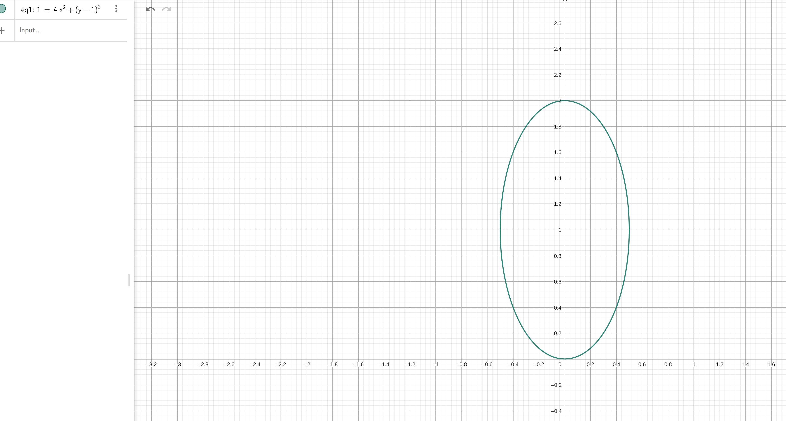

# 线性代数：从“空间里的动作”到 3DGS 的数学骨架

**本章核心问题**：当你在 3DGS、图形学或视觉代码里看到 `R @ x + t`、`R @ Sigma @ R^T`、`J @ Sigma_cam @ J^T`、`d^T @ Sigma^{-1} @ d`、`A = U @ S @ V^T` 这些式子时，为什么它们看起来像不同门类的公式，却其实都在讲同一件事？

先把答案说在前面：

> 线性代数真正研究的，不是“矩阵怎么乘”，而是“空间里的对象如何表示，以及这些对象在变换下如何变化”。

如果你把这一章只看成“向量、矩阵、特征值、SVD 的定义合集”，它很快会散成一堆名词。
但如果你把它看成一部连续电影，主角其实一直只有两个：

- 空间里的对象：点、方向、位移、椭球、数据云
- 作用在对象上的动作：旋转、缩放、投影、压扁、换坐标系

这次我们刻意讲得更慢一点。
不仅讲“它是什么”，还讲：

- 它的公式到底在说什么
- 它在工程里到底有什么用
- 你脑子里应该看到什么画面
- 如果要自己验证直觉，Python 应该怎么画出来

---

## 零、二次型：为什么所有"弯曲的边界"都能写成 $\mathbf{x}^T A \mathbf{x} = 1$

在你进入矩阵乘法之前，先问自己一个问题：

> 球、椭球、双曲面看起来完全不同，但有没有一种统一的语言能描述它们全部？

### 0.1 从"测量距离"说起

你熟悉欧氏距离：
$$\|\mathbf{x}\|^2 = x^2 + y^2 + z^2 = 1$$

这是**单位球**——所有方向上等距。

但如果我问你："从我家到超市，不同方向的'难度'不一样（上坡难、平地易），怎么描述这种'不均匀的距离'？"

普通的 $x^2 + y^2$ 不够用了，你需要**加权**：
$$\frac{x^2}{a^2} + \frac{y^2}{b^2} = 1$$

这就是**椭球**——某些方向"便宜"，某些方向"贵"。

### 0.2 矩阵形式的魔力

把上面的式子重写成矩阵形式：

$$\begin{bmatrix} x & y \end{bmatrix} \begin{bmatrix} 1/a^2 & 0 \\ 0 & 1/b^2 \end{bmatrix} \begin{bmatrix} x \\ y \end{bmatrix} = 1$$

或者简写为：
$$\mathbf{x}^T A \mathbf{x} = 1$$

**这就是二次型**——它描述的是"加权后的距离平方"。

### 0.3 同一个公式，不同的形状

现在神奇的事情发生了：只改变矩阵 $A$，你就能得到完全不同的几何形状：

```
┌─────────────────────────────────────────────────────────────┐
│                    二次型的统一语言                          │
├─────────────────────────────────────────────────────────────┤
│                                                             │
│   球：    x² + y² + z² = 1                                  │
│           A = I (单位矩阵)                                   │
│                                                             │
│            ●                                                │
│           /|\                                               │
│          / | \                                              │
│            |                                                │
│                                                             │
├─────────────────────────────────────────────────────────────┤
│                                                             │
│   椭球：  x²/4 + y²/1 + z²/1 = 1                            │
│           A = diag(1/4, 1, 1)                               │
│                                                             │
│            ████████                                         │
│          ██        ██                                       │
│         █            █                                      │
│          ██        ██                                       │
│            ████████                                         │
│                                                             │
├─────────────────────────────────────────────────────────────┤
│                                                             │
│   双曲面：x² - y² - z² = 1                                  │
│           A = diag(1, -1, -1)                               │
│                                                             │
│              /\                                             │
│             /  \                                            │
│            /    \                                           │
│           /      \                                          │
│          /        \                                         │
│                                                             │
└─────────────────────────────────────────────────────────────┘
```

**关键洞察**：
- $A$ 正定（所有特征值 > 0）→ 椭球（封闭有界）
- $A$ 不定（有正有负）→ 双曲面（开放无界）
- $A$ 半正定（有零）→ 柱面/抛物面（某一方向无限延伸）

### 0.4 变换视角：二次型是"变形的尺子"

想象你有一个标准的单位球 $\mathbf{u}^T \mathbf{u} = 1$。

现在你用矩阵 $M$ 把球变形：
$$\mathbf{x} = M \mathbf{u}$$

逆解出 $\mathbf{u} = M^{-1} \mathbf{x}$，代回原方程：
$$(M^{-1} \mathbf{x})^T (M^{-1} \mathbf{x}) = \mathbf{x}^T (M^{-T} M^{-1}) \mathbf{x} = 1$$

这就是**二次型的变换规则**！

> 只要你能把形状写成 $\mathbf{x}^T A \mathbf{x} = 1$，那么对它做变换 $M$，就对应把 $A$ 变成 $M^{-T} A M^{-1}$。

这是 3DGS 协方差矩阵的核心逻辑：
- 先在"标准坐标"里定义球（$A = I$）
- 用 $M = RS$ 缩放+旋转（$A$ 变成 $S^{-2}$ 再变成 $R S^{-2} R^T$）
- 得到世界坐标系中的椭球方程

### 0.5 一句话记住

> **二次型 $\mathbf{x}^T A \mathbf{x}$ 是描述"加权距离"的统一语言。矩阵 $A$ 决定了"在哪个方向上走要多花多少力气"。**

当你看到协方差矩阵的逆 $\Sigma^{-1}$ 出现在 $d^T \Sigma^{-1} d$ 中时，你应该想到：

**这不是复杂的矩阵运算，而是在一个"被压扁、旋转过的空间"里测量距离。**

## 一、先把整张地图摊开

先不要急着钻进定义。先看每个概念到底在回答什么问题。

| 概念 | 它在回答什么问题 | 你脑中应该看到的画面 | 常见公式 |
|------|------------------|----------------------|----------|
| 向量 | 怎样描述位移、方向、速度、法线？ | 一根有方向的箭头 | `v = [x, y, z]` |
| 矩阵 | 怎样统一描述旋转、缩放、剪切、投影？ | 整张网格被一起推了一下 | `y = A x` |
| 线性变换 | 什么样的变换最“听话”？ | 直线还是直线，原点不乱跑 | `T(ax + by) = aT(x) + bT(y)` |
| 基与坐标 | 为什么同一个向量换套尺子，数字就变了？ | 同一根箭头，用不同坐标轴去量 | `x = B c` |
| 特征值/特征向量 | 这个变换最自然的方向是什么？ | 某些方向只变长，不拐弯 | `A v = λ v` |
| 行列式 | 面积/体积被放大了多少？ | 单位方块被拉成多大 | `det(A)` |
| 秩 | 信息还剩几维？有没有方向被压没？ | 立体被压成平面或直线 | `rank(A)` |
| SVD | 任意矩阵能不能拆成更好懂的三步？ | 先转一下，再拉一下，再转一下 | `A = U S V^T` |

你可以把整章压缩成一句话：

> 线性代数是一门研究“向量空间 + 作用在向量空间上的变换 + 这些变换如何被压缩表达”的语言。

从工程视角看，它还有另一层意义：

> 一旦一个问题能被压成线性代数对象，你就突然获得了统一表示、统一求导、统一分析、统一加速的能力。

这就是为什么你一走进图形学、视觉、机器人、控制、优化，会反复看到同一批东西：

- 向量
- 矩阵
- Jacobian
- 协方差
- 特征值
- SVD
- 最小二乘

它们不是数学家塞进来的装饰，而是工程问题逼出来的最短语言。

---

## 二、如果你要重新发明 3DGS，会被迫发明哪些数学？

不要从课本出发。倒过来，从问题出发。

你想在代码里表示一个 `3D` 高斯，并把它投影到图像平面上。你很快会遇到这些问题。

### 2.1 我怎么描述“位置”和“方向”？

这会逼你发明：**向量**。

比如一个高斯中心可以写成：

$$\boldsymbol{\mu} = [x, y, z]^T$$

一个相机朝向、一个法线方向、一条光线方向，本质上也都是向量。

一句话理解：

> 只要某个东西有“方向”和“大小”的意味，它通常就会掉进向量语言里。

### 2.2 我怎么统一描述“旋转”“缩放”“换坐标系”？

这会逼你发明：**矩阵**。

比如：

$$\mathbf{x}_{\text{cam}} = R \mathbf{x}_{\text{world}} + \mathbf{t}$$

其中 `R` 负责方向变换，`t` 负责平移。

矩阵真正厉害的地方不是“能摆成表格”，而是：

> 它让一整个空间里的所有向量都按同一个规则一起变化。

### 2.3 我怎么知道同一个对象在世界坐标和相机坐标里为什么数字不同？

这会逼你发明：**基与坐标变换**。

同一个几何向量，在不同参考轴下，坐标当然可能不同：

```text
同一根箭头 v
在世界坐标下写成 [3, 1]
在另一个旋转坐标系下可能写成 [2.6, -1.8]
```

变的不是对象，变的是描述对象的尺子。

### 2.4 我怎么从一个 `3x3` 协方差矩阵里看出椭球的主轴方向和长短？

这会逼你发明：**特征值与特征向量**。

因为：

$$\Sigma = Q \Lambda Q^T$$

- `Q` 给出主轴方向
- `Λ` 给出沿这些方向的尺度

这时矩阵就不再只是数字堆，而是一个能被“解剖”成几何轴向和尺度的对象。

### 2.5 我怎么知道一个变换到底把面积/体积放大了多少？

这会逼你发明：**行列式**。

$$\det(A)$$

不是一个考试符号，而是在回答：

> 这个变换让空间体积放大、缩小、翻转，还是压塌了？

### 2.6 我怎么知道某个变换是不是把某些信息压没了？

这会逼你发明：**秩**。

如果一个 `3D -> 2D` 投影把一部分深度信息天然丢掉，那么秩就是在告诉你：

```text
原来有几维自由度
现在还剩几维能被看见
```

### 2.7 如果矩阵既不方、也不对称、也不“长得友好”，我怎么还原它的主要结构？

这会逼你发明：**SVD**。

$$A = U S V^T$$

SVD 的工程含义非常强：

- 它告诉你主方向
- 它告诉你哪些方向信息强，哪些方向信息弱
- 它让你能做压缩、降维、伪逆、低秩近似

所以你现在看到的这些概念，不是一堆并列知识点，而是被同一类工程问题一步步逼出来的工具链。

---

## 三、向量：它不是数组，它是一根箭头

### 3.1 点和向量不是一回事

这件事特别值得先分清。

- **点**：表示“在哪里”
- **向量**：表示“从哪里朝哪里移动了多少”

看这个最小图：

```text
A o ---------> o B
```
$$\mathbf{v} = B - A$$

这里：

- `A` 和 `B` 是点
- `v = B - A` 是从 A 指向 B 的位移向量

为什么这个区分重要？因为：

- `A + B` 通常没有自然几何意义
- `B - A` 非常自然，它就是位移
- `A + v` 也自然，它表示把点 A 沿着向量 v 推过去

一个很好记的比喻是：

> 点像地图上的图钉，向量像图钉之间拉出来的箭头。

在 3DGS 里也一样：

- 高斯中心 `mu` 更像一个点
- 从高斯中心到相机中心的偏移更像一个向量
- 优化时的参数更新量 `delta_mu` 也是向量

### 3.2 向量为什么必须支持“加法”和“缩放”

如果一种对象想表达位移、方向、速度、力，它至少要能做两件事：

1. 两个动作连续施加：向量加法
2. 同一个动作放大、缩小、反向：标量乘法

公式写成：

$$\mathbf{u} + \mathbf{v}, \quad c\mathbf{v}$$

比如：

```text
先向东走 3 米，再向北走 4 米
```

如果用坐标写，就是：

$$[3, 0] + [0, 4] = [3, 4]$$

这就是向量最核心的直觉：

> 它不是数字列表，而是“能相加、能缩放的有向量”。

工程上这件事非常重要，因为很多系统都默认它成立：

- 速度可以叠加
- 力可以叠加
- 参数更新量可以叠加
- 像素偏移可以叠加

### 3.3 向量的长度：你到底走了多远

向量 `v = [x, y, z]` 的欧氏长度是：

$$\|\mathbf{v}\| = \sqrt{x^2 + y^2 + z^2}$$

在矩阵记号里，也可以写成：

$$\|\mathbf{v}\| = \sqrt{\mathbf{v}^T \mathbf{v}}$$

它回答的是一个很朴素的问题：

> 不管朝哪走，总共走了多远？

在 3DGS / 图形学 / 视觉里会不断用到它：

- 相机到点的距离
- 方向向量归一化
- 法线单位化
- 高斯中心之间的距离

一个常见操作是归一化：

$$\hat{\mathbf{v}} = \frac{\mathbf{v}}{\|\mathbf{v}\|}$$

这会把向量变成单位长度，只保留方向信息。

### 3.4 点积：两个方向到底有多对齐

点积可以写成两种完全等价的形式：

$$\mathbf{a} \cdot \mathbf{b} = \mathbf{a}^T \mathbf{b}$$

和

$$\mathbf{a} \cdot \mathbf{b} = \|\mathbf{a}\| \|\mathbf{b}\| \cos\theta$$

这两个式子连起来看，意思就非常清楚了：

> 点积本质上是在测“两个方向有多对齐”。

你也可以把它理解成：

> **b** 在 **a** 方向上的投影有多长

常见判断：

- $\mathbf{a} \cdot \mathbf{b} > 0$ → 大致同向
- $\mathbf{a} \cdot \mathbf{b} = 0$ → 垂直
- $\mathbf{a} \cdot \mathbf{b} < 0$ → 反向

一个更具体的投影公式是：

$$\text{proj}_{\mathbf{a}}(\mathbf{b}) = \frac{\mathbf{a}^T \mathbf{b}}{\mathbf{a}^T \mathbf{a}} \mathbf{a}$$

工程上它几乎无处不在：

- `n · l` 判断光照强弱
- `view_dir · normal` 判断表面是否朝向相机
- 余弦相似度本质上就是归一化后的点积
- 梯度下降里也会关心“更新方向和梯度方向是否对齐”

一个很好记的比喻是：

> 点积像一个“对齐度测量器”。

### 3.5 叉积：在 `3D` 里造出一个垂直方向

叉积只在少数维度里有漂亮形式，但在 `3D` 里特别好用。

$$\mathbf{a} \times \mathbf{b}$$

它返回一个同时垂直于 `a` 和 `b` 的方向。

公式写开是：

$$\mathbf{a} \times \mathbf{b} = \begin{bmatrix} a_2b_3 - a_3b_2 \\ a_3b_1 - a_1b_3 \\ a_1b_2 - a_2b_1 \end{bmatrix}$$

还有一个极其重要的长度关系：

$$\|\mathbf{a} \times \mathbf{b}\| = \|\mathbf{a}\| \|\mathbf{b}\| \sin\theta$$

这说明叉积的模长，其实等于以 `a` 和 `b` 为边的平行四边形面积。

所以你可以把点积和叉积并排记：

> **点积问**：有多对齐？
> **叉积问**：垂直方向是谁？面积有多大？

工程上常见在：

- 三角形法线计算
- 相机构造 `right / up / forward`
- 判断朝向和面积方向

### 3.6 在 3DGS 里，哪些东西是向量？

最常见的有：

- 高斯中心 `mu`
- 世界坐标中的点 `x_world`
- 相机坐标中的点 `x_cam`
- 光线方向 `ray_dir`
- 法线 `normal`
- 参数更新量 `delta`

所以当你看到一串数字时，别先想“这是个数组”。
先问：

> 它表示的是位置？位移？方向？法线？还是参数更新量？

这个问题问对了，后面大半的理解就会顺很多。

### 3.7 一个最小 Python 可视化：向量、点积、投影

```python
import numpy as np
import matplotlib.pyplot as plt

# 两个二维向量
A = np.array([3.0, 1.0])
B = np.array([1.0, 2.5])

# B 在 A 方向上的投影
proj_B_on_A = (A @ B) / (A @ A) * A

plt.figure(figsize=(6, 6))
plt.axhline(0, color='gray', linewidth=1)
plt.axvline(0, color='gray', linewidth=1)

plt.quiver(0, 0, A[0], A[1], angles='xy', scale_units='xy', scale=1, color='tab:blue', label='A')
plt.quiver(0, 0, B[0], B[1], angles='xy', scale_units='xy', scale=1, color='tab:orange', label='B')
plt.quiver(0, 0, proj_B_on_A[0], proj_B_on_A[1], angles='xy', scale_units='xy', scale=1, color='tab:green', label='proj_A(B)')

plt.xlim(-1, 4)
plt.ylim(-1, 4)
plt.gca().set_aspect('equal')
plt.legend()
plt.title(f'dot(A, B) = {A @ B:.2f}')
plt.show()
```

你应该观察到：

- `A @ B` 越大，两个箭头越接近同向
- 绿色投影向量就是 `B` 在 `A` 方向上的“影子”
- 如果你把 `B` 调成和 `A` 垂直，标题里的点积会接近 0

---

## 四、矩阵：它不是表格，它是“把整个空间一起推一下”

### 4.1 先忘掉“行乘列”，先看“空间动作”

初学时，矩阵看起来像数字表：

$$\begin{bmatrix} a & b \\ c & d \end{bmatrix}$$

但线性代数真正关心的不是表格外形，而是：

$$\mathbf{y} = A\mathbf{x}$$

也就是：

> 把一个向量送进去，整体按某种规则变成另一个向量。

所以矩阵最重要的身份不是“表格”，而是“空间里的变换”。

一个特别有用的比喻是：

> 向量像一个演员，矩阵像导演给整片空间下的统一动作指令。

### 4.2 为什么矩阵只要知道“基向量去了哪”，就知道整个空间怎么变

这是矩阵最核心的思想。

在二维里，任何向量都可以写成：

$$\mathbf{x} = x_1 \mathbf{e}_1 + x_2 \mathbf{e}_2$$

如果 `T` 是线性变换，那么：

$$\begin{aligned} T(\mathbf{x}) &= T(x_1 \mathbf{e}_1 + x_2 \mathbf{e}_2) \\ &= x_1 T(\mathbf{e}_1) + x_2 T(\mathbf{e}_2) \end{aligned}$$

这里各个符号的角色要分清：

- `x`、`e1`、`e2`、`T(x)`、`T(e1)`、`T(e2)` 都是向量
- `x1`、`x2` 是标量，它们是向量 `x` 在基 `e1`、`e2` 下的坐标
- `T` 本身不是向量也不是标量，而是一个“把向量映到向量”的线性变换
- `x1 e1`、`x2 e2`、`x1 T(e1)`、`x2 T(e2)` 仍然都是向量，因为它们是“标量 × 向量”

这句话特别重要。它在说：

> 只要你知道 `e1` 被送到哪、`e2` 被送到哪，你就知道整个平面会怎么变。

这就是为什么矩阵的列向量那么关键：

$$A = [T(\mathbf{e}_1) \ T(\mathbf{e}_2) \ T(\mathbf{e}_3)]$$

也就是说：

- 第一列是 `e1` 变换后的样子
- 第二列是 `e2` 变换后的样子
- 第三列是 `e3` 变换后的样子

不过这里很容易产生另一个疑问：

```text
为什么有时强调“看列”
有时又强调“看行”
```

关键是先分清：本章默认采用的是**列向量约定**，也就是

$$\mathbf{y} = A\mathbf{x}$$

在这个约定下，列视角和行视角其实是在看同一个矩阵的两面。

#### 列视角：看“每个输入基方向被送到哪”

这一视角最直接对应刚才那句话：

$$A\mathbf{e}_j = A \text{ 的第 } j \text{ 列}$$

也就是说：

- 第 `j` 列告诉你：如果只打开第 `j` 个基方向，输出会朝哪里去
- 它最适合描述几何变换、坐标变换、旋转、缩放、投影这类“空间怎么被整体推动”的问题
- 所以在图形学、机器人学、3DGS 里的投影链里，**列视角通常更自然**

#### 行视角：每个输出位置有一台"扫描仪"

现在换个问法。

想象你站在输出的位置 $i$（比如第 $i$ 个像素、第 $i$ 个神经元），往回头看输入空间。你想知道：**要从输入里读什么，才能算出我的值？**

这就是行视角的来源——它不是"推"，而是"读"。

$$y_i = \sum_j a_{ij} x_j$$

写成点积形式更直观：

$$y_i = \mathbf{a}_i^T \mathbf{x}$$

这里的 $\mathbf{a}_i^T$（第 $i$ 行）就是一台**扫描仪的说明书**：

```
扫描仪 i 的操作手册
─────────────────────
步骤1: 到输入位置 1，读取 x_1，乘以权重 a_i1
步骤2: 到输入位置 2，读取 x_2，乘以权重 a_i2
... 
步骤N: 把所有读到的值加起来，输出 y_i
```

**什么情况下你被迫用这种视角？**

当你写一个**边缘检测滤波器**时：

```
输入图像（9个像素）          输出（中心像素的边缘强度）
┌───┬───┬───┐
│ 1 │ 2 │ 1 │              ┌───┐
├───┼───┼───┤      →       │ ? │  = (-1)*1 + 0*2 + 1*1 
│-1 │ 0 │ 1 │  ─────────>  └───┘    + (-1)*3 + 0*4 + 1*5
├───┼───┼───┤                        + (-1)*6 + 0*7 + 1*8
│ 3 │ 4 │ 5 │
├───┼───┼───┤
│ 6 │ 7 │ 8 │
└───┴───┴───┘
```

你站在输出位置，手里拿着一个 3×3 的核（一行权重），在输入上滑动扫描。这**逼**你发明出行视角——因为你关心的是"这个输出怎么从输入里算出来"。

神经网络的全连接层也是一样：

$$y_i = \mathbf{w}_i^T \mathbf{x} + b_i$$

第 $i$ 个神经元并不关心"整个空间怎么变换"，它只关心"我要检测什么模式"。$\mathbf{w}_i^T$ 就是它的**探测器**——权重大的位置是它在意的特征，权重为0的位置它看都不看。

**一句话记住区别：**
- 列视角 = 你推箱子（把基向量推到哪里去）
- 行视角 = 你拿探测器（从输入里读出什么模式）

#### 它们的区别不是“谁对谁错”，而是关注点不同

- **列视角**更像在问：空间中的基方向被送到哪去了？
- **行视角**更像在问：某个输出分量是怎样从输入里算出来的？

对同一个 `a_ij` 来说，在 `y = A x` 这个约定下，它表达的是：

> 输入的第 $j$ 个分量
> 对输出的第 $i$ 个分量
> 贡献了多少

所以：

- 看列时，你更像在看“一个输入方向的整体命运”
- 看行时，你更像在看“一个输出通道的组装配方”

#### 什么时候会切换成“行向量约定”

有些领域，尤其是某些统计教材、表格数据处理或工程实现里，会把样本写成行向量，于是公式可能写成：

$$\mathbf{y}^T = \mathbf{x}^T A$$

这时很多“行/列谁在表示什么”的叙述会整体转置。

所以真正稳妥的习惯不是死记：

> 列一定表示这个，行一定表示那个

而是先看作者到底写的是：

$$\mathbf{y} = A\mathbf{x} \quad \text{还是} \quad \mathbf{y}^T = \mathbf{x}^T A$$

然后再判断矩阵的行和列各自扮演什么角色。

#### 什么时候矩阵变成了一张"关系网"

现在想象一个完全不同的场景。

你不再推箱子、不再旋转空间。你面前是一张**社交网络**：

```
    张三 ◄─────► 李四
      ▲    0.8
      │
    0.5│
      │
      ▼
     王五
```

每个节点是一个人，连线上的数字表示"关系强度"。

**什么问题逼你重新发明矩阵？**

你想知道：如果每个人今天听到了一些消息，明天每个人会知道多少？

这就是**图神经网络**的核心问题——不是几何变换，而是**信息在节点间的流动**。

---

**从问题出发，重建矩阵**

假设三个人的初始消息量为 $\mathbf{x} = [x_1, x_2, x_3]^T$。

你想计算：明天每个人听到的新消息总量。

对于节点 $i$，它会从所有邻居 $j$ 那里接收信息：

$$x'_i = \sum_j a_{ij} x_j$$

**逐个拆解这个式子：**

```
节点 1 的新消息 = a_11*x_1 + a_12*x_2 + a_13*x_3
                   ↓        ↓        ↓
                自己保留   从2接收   从3接收
                的消息    的消息    的消息
```

看到没有？这里的 $a_{ij}$ 不是"把方向 $j$ 推到哪里去"，而是：

> **节点 $j$ 的信息，有多大比例能流到节点 $i$？**

```
         j 的消息
            │
            ▼
    ┌─────────────────┐
    │   连接强度      │
    │    a_ij         │──────► i 收到 a_ij * x_j
    │  (信息管道粗细)  │
    └─────────────────┘
```

---

**但是！这里有个大坑：方向约定**

不同教材对 $A_{ij}$ 的定义可能相反：

| 约定 | $A_{ij} = 1$ 表示 | 你的聚合公式必须是 |
|------|------------------|------------------|
| **来源→目标** | $j \to i$ 有边 | $\mathbf{x}' = A\mathbf{x}$ |
| **起点→终点** | $i \to j$ 有边 | $\mathbf{x}' = A^T\mathbf{x}$ |

```
错误示例：
─────────────────────────────────────
你定义: A_12 = 1 表示 1→2 有边（起点→终点）
但你用: x'_2 = Σ_j a_2j * x_j

问题：a_21 对应的是 2→1 的边，不是 1→2！
       你在用 "2发出的边" 去收 "1的信息"
       这就乱了
─────────────────────────────────────
```

**所以关键不是 $a_{ij}$ 下标怎么写，而是：**

> 你的公式 $\mathbf{x}' = A\mathbf{x}$ 假设了 $a_{ij}$ 是 **"j 对 i 的影响"**

如果你的图定义是反的，就必须转置：$\mathbf{x}' = A^T\mathbf{x}$

---

**无向图的便利**

如果关系是对称的（我是你的朋友 → 你也是我的朋友）：

$$A = A^T$$

转置等于本身，两种约定就统一了。这也是为什么很多图神经网络教程默认无向图——少了这层心智负担。

---

**一句话记住区别：**

- 几何矩阵 = 你推箱子（列视角：基向量去哪了）
- 图矩阵 = 你传消息（行视角：谁的信息流向我）

同样的 $a_{ij}$，不同的故事。


### 4.3 把它画出来：网格一起被拉了

你可以把线性变换想成“把整张坐标网格一起推一下”。

变换前：

```text
y
^
|   |   |   |
|---|---|---|--> x
|   |   |   |
|---|---|---|
|   |   |   |
```

变换后，可能变成：

```text
y'
^      /   /   /
|     /   /   /
|    /   /   /
|   /   /   /
|  /   /   /
+----------------> x'
```

注意两件事：

- 原点还在原点
- 直线仍然是直线

这就是线性变换最“听话”的地方。

### 4.4 什么叫线性变换

一个变换 `T` 是线性的，要求它同时满足：

$$\begin{aligned} 1. \& T(\mathbf{x} + \mathbf{y}) = T(\mathbf{x}) + T(\mathbf{y}) \\ 2. \& T(c\mathbf{x}) = cT(\mathbf{x}) \end{aligned}$$

合起来就是：

$$T(a\mathbf{x} + b\mathbf{y}) = aT(\mathbf{x}) + bT(\mathbf{y})$$

翻译成人话就是：

> 混合输入怎么变，等于先分别变，再按同样方式混合。

工程上为什么会如此偏爱它？因为一旦这件事成立，你就能：

- 拆开分析
- 组合设计
- 压成矩阵
- 并行计算
- 统一求导和优化

### 4.5 常见线性变换的“空间动作”是什么

#### 缩放

二维缩放矩阵：

$$S = \begin{bmatrix} s_x & 0 \\ 0 & s_y \end{bmatrix}$$

它实现的是：

$$[x, y] \to [s_x x, s_y y]$$

沿不同轴拉长或压短。

#### 旋转

二维旋转矩阵：

$$R(\theta) = \begin{bmatrix} \cos\theta & -\sin\theta \\ \sin\theta & \cos\theta \end{bmatrix}$$

它改变方向，但保持长度。

#### 剪切

$$H = \begin{bmatrix} 1 & k \\ 0 & 1 \end{bmatrix}$$

它会把矩形推成平行四边形。

#### 投影

比如投到 x 轴：

$$P = \begin{bmatrix} 1 & 0 \\ 0 & 0 \end{bmatrix}$$

它会把所有 y 方向信息直接丢掉。

### 4.6 仿射变换：为什么 `R @ x + t` 不是线性，但仍然无处不在

这是必须分清的一点。

- `A x` 是线性的
- `A x + b` 是仿射的

为什么后者不是线性？因为它把原点挪走了：

$$f(0) = b \neq 0$$

但工程里我们依然天天用它，因为真实系统里“平移/偏置”太常见：

- 相机外参变换
- 机器人位姿变换
- 神经网络里的 `W x + b`

所以你可以记住这句话：

> 线性是“保原点的空间动作”，仿射是“线性动作再加一个整体平移”。

### 4.7 为什么图形学要用齐次坐标

既然平移不是线性，为什么图形学里还喜欢统一写成矩阵乘法？

办法是：**升一维**。

$$[x, y, z] \to [x, y, z, 1]$$

这样你就能把：

$$\mathbf{x}' = R\mathbf{x} + \mathbf{t}$$

写成：

$$\begin{bmatrix} \mathbf{x}' \\ 1 \end{bmatrix} = \begin{bmatrix} R & \mathbf{t} \\ \mathbf{0}^T & 1 \end{bmatrix} \begin{bmatrix} \mathbf{x} \\ 1 \end{bmatrix}$$

也就是一个 `4x4` 矩阵乘法。

所以齐次坐标的本质不是“又多一个数学技巧”，而是：

> 把仿射变换重新打包进高一维的线性框架里。

### 4.8 工程上为什么大家都爱矩阵链

因为只要每一步都能写成矩阵或仿射形式，你就能把很多动作压成一条统一链：

$$\mathbf{x}_{\text{screen}} = PVM \mathbf{x}_{\text{local}}$$

这里：

- `M` 是模型变换
- `V` 是视图变换
- `P` 是投影变换

图形学、机器人、SLAM、控制里都特别爱这种写法，因为：

- 好组合
- 好调试
- 好做自动求导
- 好交给 GPU/BLAS 加速

### 4.9 一个最小 Python 可视化：看网格怎么被矩阵一起推走

```python
import numpy as np
import matplotlib.pyplot as plt

A = np.array([
    [1.2, 0.6],
    [0.2, 1.0],
])

xs = np.linspace(-2, 2, 9)
ys = np.linspace(-2, 2, 9)

plt.figure(figsize=(12, 5))

# 原网格
plt.subplot(1, 2, 1)
for x in xs:
    pts = np.stack([np.full_like(ys, x), ys], axis=0)
    plt.plot(pts[0], pts[1], color='lightgray')
for y in ys:
    pts = np.stack([xs, np.full_like(xs, y)], axis=0)
    plt.plot(pts[0], pts[1], color='lightgray')
plt.title('Before')
plt.axis('equal')
plt.xlim(-3, 3)
plt.ylim(-3, 3)

# 变换后网格
plt.subplot(1, 2, 2)
for x in xs:
    pts = np.stack([np.full_like(ys, x), ys], axis=0)
    pts_t = A @ pts
    plt.plot(pts_t[0], pts_t[1], color='lightgray')
for y in ys:
    pts = np.stack([xs, np.full_like(xs, y)], axis=0)
    pts_t = A @ pts
    plt.plot(pts_t[0], pts_t[1], color='lightgray')
plt.title('After y = A x')
plt.axis('equal')
plt.xlim(-4, 4)
plt.ylim(-4, 4)

plt.show()
```

你应该观察到：

- 原点没动
- 直线还是直线
- 整张网格被一起拉斜了

这就是“矩阵是空间动作”最直观的画面。

---

## 五、基与坐标：同一根箭头，为什么数字会变

这是读图形学和 3DGS 时最容易晕的地方。

### 5.1 基到底是什么

基不是抽象规定，它本质上是你拿来描述空间的一套参考箭头。

最熟悉的二维基是：

```text
e1 = 朝右
e2 = 朝上
```

有了这两根互相独立的箭头，整个平面里的任何向量都能被表示成它们的线性组合。

更正式一点说，如果把基向量排成矩阵：

$$B = [\mathbf{b}_1 \ \mathbf{b}_2 \ \cdots \ \mathbf{b}_n]$$

那么任何向量 `x` 都可以写成：

$$\mathbf{x} = B\mathbf{c}$$

其中 `c` 就是 `x` 在这组基下的坐标。

所以基回答的是：

> 我到底拿哪几根参考方向来量这个空间？

### 5.2 坐标不是向量本体，只是“在某个基下的展开系数”

这是一个必须反复提醒自己的点。

同一个几何向量，在不同坐标系里，坐标会完全不同：

```text
同一根箭头 v
在世界坐标系下： [3, 1]
在某个旋转过的坐标系下： [2.2, -2.0]
```

变的不是向量本身，变的是你量它的尺子。

如果一组基矩阵是 `B`，那坐标和几何向量之间的关系是：

$$\mathbf{x} = B\mathbf{c}, \quad \mathbf{c} = B^{-1}\mathbf{x}$$

这两个式子特别值得记住，因为它们就是：

- 从坐标还原几何向量
- 从几何向量换回坐标表示

### 5.3 一个最小视觉图

同一根箭头，换两套坐标轴去量：

```text
世界坐标系                 旋转后的坐标系

   y                            y'
   ^                           /
   |                          /
   |    v                    /   v
   |   /                    /
   |  /                    /
   | /                    /
   |/                    /
   +-------> x          +-------> x'
```

箭头没变。
变的是坐标轴的朝向，所以数字变了。

### 5.4 “转物体”和“换坐标系”为什么总让人混

因为同一个旋转矩阵 `R`，常常有两种解释：

1. **主动变换**：真的把向量转了
2. **被动变换**：没动向量，只是换了参考坐标系

这两种视角不是矛盾，而是在描述同一几何关系的两面。

也正因为如此，你会在很多推导里看到：

$$R^{-1} = R^T$$

于是“世界转相机”和“相机相对世界旋转”经常只差一个转置。

一个很好记的比喻是：

> 主动变换像你真的转了箭头，被动变换像你没转箭头，只是把尺子转了。

### 5.5 为什么这对 3DGS 特别重要

因为 3DGS 里至少有这几套空间：

- 高斯自己的局部主轴空间
- 世界空间
- 相机空间
- 屏幕空间

一条典型链路是：

```text
高斯局部空间
    -> 世界空间
    -> 相机空间
    -> 屏幕空间
```

你看到的很多“矩阵乘法”，本质上都是在做这个多坐标系之间的翻译。

### 5.6 一个最小 Python 可视化：同一根向量在两套坐标系里的数字不同

```python
import numpy as np
import matplotlib.pyplot as plt

# 同一个几何向量（在标准坐标下）
v = np.array([3.0, 1.0])

# 一套旋转了 45 度的新基
th = np.deg2rad(45)
B = np.array([
    [np.cos(th), -np.sin(th)],
    [np.sin(th),  np.cos(th)],
])

# v 在新基下的坐标
c_new = np.linalg.inv(B) @ v

print('standard coords =', v)
print('rotated-basis coords =', c_new)

plt.figure(figsize=(6, 6))
plt.axhline(0, color='gray', linewidth=1)
plt.axvline(0, color='gray', linewidth=1)

# 原坐标基
plt.quiver(0, 0, 1, 0, angles='xy', scale_units='xy', scale=1, color='tab:blue')
plt.quiver(0, 0, 0, 1, angles='xy', scale_units='xy', scale=1, color='tab:blue')

# 新基
plt.quiver(0, 0, B[0,0], B[1,0], angles='xy', scale_units='xy', scale=1, color='tab:orange')
plt.quiver(0, 0, B[0,1], B[1,1], angles='xy', scale_units='xy', scale=1, color='tab:orange')

# 同一个几何向量
plt.quiver(0, 0, v[0], v[1], angles='xy', scale_units='xy', scale=1, color='tab:green')

plt.xlim(-2, 4)
plt.ylim(-2, 4)
plt.gca().set_aspect('equal')
plt.title('Same vector, different coordinates')
plt.show()
```

---

## 六、协方差矩阵：为什么一个椭球可以被压进 `3x3` 数表里

这部分一旦想通，3DGS 会顺很多。

### 6.1 从球到椭球：你为什么被逼着发明协方差矩阵

先忘掉"统计"两个字。

想象你手里有一个**橡皮球**：


完美球体，各向同性。描述它只需要一个数字：**半径**。

**但 3DGS 里的高斯不是球，是椭球。**

想象一下你把这个橡皮球往三个方向分别拉/压，然后旋转、平移：


**三步变形：**
1. **缩放**：沿三个主轴分别拉伸/压缩（变成椭球）
2. **旋转**：整体转到空间中的某个朝向
3. **平移**：中心移到指定位置

现在问题来了：

> **怎么把这"三步变形"塞进一个 3×3 的数表里？**

---

**重建协方差矩阵：三个坐标系的变换链条**

要描述这个变形过程，我们需要追踪一个点经过的三层坐标系：

```
单位球 u ──► 缩放椭球 x ──► 世界椭球 x_world
(本地)        (本地)           (世界坐标)
    │              │                  │
    │              │                  │
   完美球体      轴对齐椭球        任意朝向椭球
   (半径=1)     (各轴独立缩放)      (旋转后)
```

| 坐标 | 含义 | 形状描述 |
|------|------|---------|
| $\mathbf{u}$ | 单位球上的点（本地）| $\mathbf{u}^T\mathbf{u} = 1$，完美球体 |
| $\mathbf{x}$ | 缩放后的点（仍在本地）| $\mathbf{x} = S\mathbf{u}$，轴对齐椭球 |
| $\mathbf{x}_{\text{world}}$ | 世界坐标中的点 | $\mathbf{x}_{\text{world}} = R\mathbf{x}$，任意朝向 |

---

**正向变换：从单位球建立世界椭球**

**Step 1: 缩放**（三个主轴方向分别拉伸 $s_x, s_y, s_z$ 倍）

$$\mathbf{x} = S\mathbf{u} \quad \text{其中} \quad S = \text{diag}(s_x, s_y, s_z)$$

此时本地坐标系中的椭球方程：

$$\left(\frac{x}{s_x}\right)^2 + \left(\frac{y}{s_y}\right)^2 + \left(\frac{z}{s_z}\right)^2 = 1$$

写成矩阵形式：$\mathbf{x}^T S^{-2} \mathbf{x} = 1$

**Step 2: 旋转**（把椭球转到世界坐标中的某个朝向）

$$\mathbf{x}_{\text{world}} = R\mathbf{x}$$

**Step 3: 平移**（把椭球中心移到指定位置）

现实世界中的高斯不会总在原点，还需要**平移**：

$$\mathbf{x}_{\text{final}} = \mathbf{x}_{\text{world}} + \boldsymbol{\mu} = RS\mathbf{u} + \boldsymbol{\mu}$$

其中 $\boldsymbol{\mu} = [\mu_x, \mu_y, \mu_z]^T$ 是高斯中心（椭球中心）。

**完整变换链条：**

$$\mathbf{x}_{\text{final}} = \underbrace{RS}_{\text{形状变换}}\mathbf{u} + \underbrace{\boldsymbol{\mu}}_{\text{位置}}$$

> **关键观察**：形状（旋转+缩放）是线性变换，平移是加法。这导致了协方差矩阵只编码**形状**，而**位置**由中心点 $\boldsymbol{\mu}$ 单独存储。

**用齐次坐标统一表达**

如果你喜欢用矩阵一把抓，可以用 4×4 齐次矩阵：

$$\begin{bmatrix} \mathbf{x}_{\text{final}} \\ 1 \end{bmatrix} = \begin{bmatrix} RS & \boldsymbol{\mu} \\ \mathbf{0}^T & 1 \end{bmatrix} \begin{bmatrix} \mathbf{u} \\ 1 \end{bmatrix}$$

但在 3DGS 实际实现中，通常**分开存储**：

```
高斯完整描述 = {
    μ: [μ_x, μ_y, μ_z],     // 中心位置（3个数）——管"在哪"
    Σ: 3×3 矩阵              // 协方差（形状，6个数）——管"长啥样"
}
```

分开存更高效：计算时先"去中心化"，再用 $\Sigma$ 检查形状。

---

**逆向推导：在世界坐标系中定义椭球并判断点**

现在有一个**任意点** $\mathbf{p}$（比如屏幕上的像素位置），你想知道它在椭球内还是外。

**Step 1: 去中心化（消除平移）**

先把坐标原点移到椭球中心，消除位置影响：

$$\mathbf{d} = \mathbf{p} - \boldsymbol{\mu}$$

现在 $\mathbf{d}$ 是**相对于中心的偏移**。

**Step 2: 逆旋转**

把 $\mathbf{d}$ 逆旋转回本地坐标系：

$$\mathbf{x} = R^T \mathbf{d}$$

**Step 3: 逆缩放（回到单位球）**

$$\mathbf{u} = S^{-1}\mathbf{x} = S^{-1}R^T \mathbf{d}$$

**Step 4: 检查是否在单位球内**

判断 $\mathbf{u}$ 是否满足单位球方程：

$$\mathbf{u}^T\mathbf{u} = (S^{-1}R^T \mathbf{d})^T (S^{-1}R^T \mathbf{d}) = \mathbf{d}^T (R S^{-2} R^T) \mathbf{d}$$

**定义协方差矩阵的逆：**

$$\boxed{\Sigma^{-1} = R S^{-2} R^T}$$

代入得世界坐标系中的判断公式：

$$q = \mathbf{d}^T \Sigma^{-1} \mathbf{d}$$

| $q$ 的值 | 几何含义 | 含义 |
|---------|---------|------|
| $q = 1$ | 逆变换后 $\|\mathbf{u}\|^2 = 1$ | 点在椭球**表面**（定义边界） |
| $q < 1$ | 逆变换后 $\|\mathbf{u}\|^2 < 1$ | 点在椭球**内部** |
| $q > 1$ | 逆变换后 $\|\mathbf{u}\|^2 > 1$ | 点在椭球**外部** |

**协方差矩阵本身：**

$$\Sigma = R \cdot \text{diag}(s_x^2, s_y^2, s_z^2) \cdot R^T$$

---

**实际应用：3DGS 中计算高斯权重**

有了 $q = \mathbf{d}^T \Sigma^{-1} \mathbf{d}$，高斯权重为：

$$g(\mathbf{p}) = \exp\left(-\frac{1}{2} q\right) = \exp\left(-\frac{1}{2} (\mathbf{p} - \boldsymbol{\mu})^T \Sigma^{-1} (\mathbf{p} - \boldsymbol{\mu})\right)$$

- 在中心（$\mathbf{p} = \boldsymbol{\mu}$，$q=0$）：$g = 1$（最大权重）
- 在表面（$q=1$）：$g = e^{-0.5} \approx 0.6$
- 在 3σ 处（$q=9$）：$g \approx 0.01$（可忽略，通常裁剪掉）

---

**所以协方差矩阵到底在存什么？**

```
┌─────────────────────────────────────────┐
│  Σ = R · diag(sx², sy², sz²) · Rᵀ      │
│                                         │
│  分解一下：                              │
│  • R 的列 = 椭球的三个主轴方向           │
│  • diag(...) = 沿各主轴的方差（半轴长度²）│
│  • 整体 = "先把球压成椭球，再转过去"     │
└─────────────────────────────────────────┘
```

**从几何直觉反推统计定义**

既然 $\Sigma$ 描述了椭球的形状，那它自然能描述**高斯分布**的形状。

多元高斯的概率密度：

$$p(\mathbf{x}) \propto \exp\left(-\frac{1}{2}(\mathbf{x}-\boldsymbol{\mu})^T \Sigma^{-1} (\mathbf{x}-\boldsymbol{\mu})\right)$$

注意到指数上的二次型：

$$(\mathbf{x}-\boldsymbol{\mu})^T \Sigma^{-1} (\mathbf{x}-\boldsymbol{\mu}) = \text{常数}$$

这正是**椭球方程**！

- $\Sigma^{-1}$ 决定椭球的形状（长短轴、方向）
- $\boldsymbol{\mu}$ 决定椭球的中心位置
- 指数让这个椭球变成了"概率云"——中心密，边缘稀

---

**一句话记住协方差矩阵**

> 它是"把一个单位球先按三个方向拉伸，再整体旋转"的几何描述。

统计里的方差、协方差，不过是这个几何物体在坐标轴上的投影：

- 对角线 = 各轴方向的"胖瘦程度"（方差）
- 非对角线 = 不同轴之间的"倾斜关联"（协方差）

当你看到 $\Sigma$ 时，脑中应该浮现一个椭球，而不是一张数表。

---

**用具体例子验证**

看这张图里的椭球：


$$1 = \left(\frac{x-1}{2}\right)^2 + (2y)^2 + z^2$$

这正是我们刚推导的**球 → 缩放 → 平移**的实例（$R = I$，即无额外旋转）：

| 变换 | 方程中的体现 | 参数 |
|------|-------------|------|
| 单位球 | $u_1^2 + u_2^2 + u_3^2 = 1$ | 半径 = 1 |
| 缩放 | $\frac{x}{2}$ 和 $2y$ | $S = \text{diag}(2, \frac{1}{2}, 1)$ |
| 平移 | $x-1$ | $\boldsymbol{\mu} = [1, 0, 0]^T$ |

这里没有旋转（$R = I$），所以椭球主轴还与坐标轴对齐。一旦加入旋转矩阵 $R$，主轴就会倾斜，方程中出现交叉项（如 $xy, yz$）——这正是 $\Sigma$ 非对角元不为零的表现。

完整链条回顾：

$$(\mathbf{x} - \boldsymbol{\mu})^T \underbrace{(R S^{-2} R^T)}_{\Sigma^{-1}} (\mathbf{x} - \boldsymbol{\mu}) = 1$$


### 6.2 先看画面，不急着看定义

想象二维里的一个椭圆：



这个椭圆里有三类信息：

- 中心在哪里
- 朝哪两个主方向展开
- 沿每个方向展开得多宽

中心通常由 `mu` 表示。
而“方向 + 宽度”一起，交给 `Sigma`。

### 6.3 高斯密度公式到底在说什么

二维或三维高斯常见写法是：

$$p(\mathbf{x}) = \frac{1}{\sqrt{(2\pi)^n \det(\Sigma)}} \exp\left(-\frac{1}{2}(\mathbf{x}-\boldsymbol{\mu})^T\Sigma^{-1}(\mathbf{x}-\boldsymbol{\mu})\right)$$

这里最值得盯住的不是归一化常数，而是指数里的二次型：

$$(\mathbf{x} - \boldsymbol{\mu})^T \Sigma^{-1} (\mathbf{x} - \boldsymbol{\mu})$$

它在做的事是：

> 按照椭球自己的尺度体系，测量点 `x` 离中心 `mu` 有多远。

如果某个方向很宽，那么沿这个方向偏一点不算远。
如果某个方向很窄，那么同样的偏移就已经很远了。

### 6.4 协方差最值得记住的几何含义

对 3DGS 来说，协方差矩阵最值得记的不是统计学定义，而是：

> 它是一个椭球的方向和尺度的压缩表达。

如果 `Sigma` 是对称正定矩阵，那么它一定能被分解成：

$$\Sigma = Q \Lambda Q^T$$

这里：

- `Q` 的列向量给出主轴方向
- `Λ` 的对角元素给出沿主轴的方差大小

于是你立刻得到：

- **特征向量** → 椭球主轴方向
- **特征值** → 沿主轴的扩张强度
- $\sqrt{	ext{特征值}}$ → 半轴长度尺度

如果你更想从“旋转 + 尺度”角度理解，也可以写成：

$$\Sigma = R \cdot \text{diag}(s_x^2, s_y^2, s_z^2) \cdot R^T$$

这在 3DGS 里尤其自然。

### 6.5 为什么正定特别重要

协方差矩阵通常要求：

- 对称：`Sigma = Sigma^T`
- 正定：`v^T Sigma v > 0` for any nonzero `v`

几何意义是：

- 对称保证主轴结构能被干净分解
- 正定保证每个方向的“距离度量”都合理，不会出现负方差

如果 `Sigma` 不正定，会发生什么？

- 椭球可能退化
- 逆矩阵可能不稳定
- 高斯密度公式里的归一化会出问题

所以很多实现会特别注意数值稳定性，比如加一点小正则：

$$\Sigma \leftarrow \Sigma + \epsilon I$$

### 6.6 为什么旋转椭球时要写成 `R @ Sigma @ R^T`

这一步千万别背公式，先看逻辑。

如果某个向量经过线性变换：

$$\mathbf{y} = A\mathbf{x}$$

那么它的协方差会按下面这个规则传播：

$$\text{Cov}(\mathbf{y}) = A \text{Cov}(\mathbf{x}) A^T$$

所以如果你把一个高斯椭球旋转了，协方差自然就会变成：

$$\Sigma' = R \Sigma R^T$$

这在说什么？

> 椭球整体被转过去了，所以它的主轴方向和尺度都要一起被正确带过去。

这就是为什么协方差这么适合 3DGS：它对线性变换特别“配合”。

### 6.7 工程上协方差不仅出现在高斯，还出现在“不确定性”里

协方差不仅能表示“一个椭球形的高斯”，也能表示：

- 定位估计的不确定性椭圆
- Kalman Filter 里的状态不确定性
- 多变量数据云的散布方向
- 视觉跟踪中的误差传播

所以一个很重要的统一视角是：

> 协方差一边可以被看成“高斯的形状”，另一边也可以被看成“误差或不确定性的方向性”。

### 6.8 一个最小 Python 可视化：把协方差画成椭圆

```python
import numpy as np
import matplotlib.pyplot as plt

mu = np.array([0.0, 0.0])
Sigma = np.array([
    [4.0, 1.5],
    [1.5, 1.0],
])

eigvals, eigvecs = np.linalg.eigh(Sigma)
order = eigvals.argsort()[::-1]
eigvals = eigvals[order]
eigvecs = eigvecs[:, order]

t = np.linspace(0, 2*np.pi, 200)
circle = np.stack([np.cos(t), np.sin(t)])

# 1-sigma 椭圆
ellipse = eigvecs @ np.diag(np.sqrt(eigvals)) @ circle + mu[:, None]

plt.figure(figsize=(6, 6))
plt.plot(ellipse[0], ellipse[1], color='tab:blue')
plt.scatter(mu[0], mu[1], color='red')

for i in range(2):
    axis = eigvecs[:, i] * np.sqrt(eigvals[i])
    plt.plot([mu[0], mu[0] + axis[0]], [mu[1], mu[1] + axis[1]], linewidth=3)

plt.gca().set_aspect('equal')
plt.title('Covariance ellipse and eigen-directions')
plt.show()
```

你应该观察到：

- 椭圆的长短轴来自特征值
- 椭圆的朝向来自特征向量
- 这说明 `Sigma` 真的是“方向 + 尺度”的压缩表达

---

## 七、特征值与特征向量：变换最“自然”的方向

### 7.1 先别急着背定义，先问一个问题

如果一个变换很复杂，普通向量送进去后通常会：

- 转方向
- 改长度
- 和别的方向混起来

那有没有一些特殊方向，经过它之后：

- 方向不变
- 只是长度变了

这就是特征向量。

### 7.2 最小图像

普通向量：

```text
v   ->   A v
\        \
 \        \
  \        \
方向变了
```

特征向量：

```text
v*  ->  λ v*
---->      -------->
方向不变，只是变长或变短
```

数学上写作：

$$A\mathbf{v} = \lambda \mathbf{v}$$

### 7.3 为什么这个公式这么值钱

因为它在说：

> 对某些特别自然的方向，这个复杂变换突然变得简单，只剩“乘一个数”。

而这个数 `λ` 就是特征值。

- `λ > 1`：这个方向被拉长
- `0 < λ < 1`：这个方向被压短
- `λ < 0`：除了缩放，还翻转方向
- `λ = 0`：这个方向被彻底压没

### 7.4 特征值怎么求出来

把 `A v = λ v` 改写一下：

$$(A - \lambda I)\mathbf{v} = 0$$

如果想让这个方程有非零解 `v != 0`，就必须有：

$$\det(A - \lambda I) = 0$$

这就是特征方程。

所以特征值不是“拍脑袋定义的神秘数”，而是从“什么时候某个方向能只缩放不转弯”这个问题里被逼出来的。

### 7.5 为什么它这么重要

因为它给了你一套“最自然”的方向。

如果一个矩阵有足够多线性无关的特征向量，你就能把它拆成：

$$A = P \Lambda P^{-1}$$

读法不是“背公式”，而是：

```text
先换到最自然的方向坐标系
-> 在这些方向上分别缩放
-> 再换回原坐标系
```

所以特征分解真正做的事是：

> 找到一个让复杂变换变简单的坐标系。

### 7.6 为什么这在 3DGS 里直接等于“看懂椭球”

对于协方差矩阵来说，特征分解直接把椭球拆开了：

- 特征向量告诉你主轴朝哪
- 特征值告诉你每条主轴有多宽

所以特征分解不是额外技巧，而是在把抽象矩阵重新翻译回几何图像。

### 7.7 一个最小 Python 可视化：看特征方向为什么特殊

```python
import numpy as np
import matplotlib.pyplot as plt

A = np.array([
    [3.0, 1.0],
    [0.5, 2.0],
])

eigvals, eigvecs = np.linalg.eig(A)

# 一般向量
v = np.array([1.0, 1.5])
Av = A @ v

# 特征向量
ve = eigvecs[:, 0].real
Ave = A @ ve

plt.figure(figsize=(6, 6))
plt.axhline(0, color='gray', linewidth=1)
plt.axvline(0, color='gray', linewidth=1)
plt.quiver(0, 0, v[0], v[1], angles='xy', scale_units='xy', scale=1, color='tab:blue', label='v')
plt.quiver(0, 0, Av[0], Av[1], angles='xy', scale_units='xy', scale=1, color='tab:orange', label='A v')
plt.quiver(0, 0, ve[0], ve[1], angles='xy', scale_units='xy', scale=1, color='tab:green', label='eigenvector')
plt.quiver(0, 0, Ave[0], Ave[1], angles='xy', scale_units='xy', scale=1, color='tab:red', label='A eigenvector')
plt.legend()
plt.xlim(-4, 4)
plt.ylim(-4, 4)
plt.gca().set_aspect('equal')
plt.show()
```

---

## 八、行列式：面积和体积到底被放大了多少

很多人第一次接触行列式时，脑子里只有展开式。

但它最值得先记住的不是“怎么算”，而是：

> 一个线性变换把面积/体积放大了多少。

### 8.1 二维里的最小画面

单位正方形经过矩阵变换，会变成一个平行四边形。

```text
变换前：                 变换后：

+----+                   /----/
|    |                  /    /
|    |       ---->     /    /
+----+                /----/

面积 = 1               面积 = |det(A)|
```

二维情况下，

$$A = \begin{bmatrix} a & b \\ c & d \end{bmatrix}, \quad \det(A) = ad - bc$$

所以：

- `|det(A)| > 1`：面积被放大了
- `0 < |det(A)| < 1`：面积被压小了
- `det(A) = 0`：面积塌了，变成一条线
- `det(A) < 0`：除了缩放，还翻了方向

### 8.2 三维里同理：看体积有没有塌

在 `3D` 里，`det(A)` 对应的是体积缩放因子。

所以 `det(A) = 0` 的几何意义极强：

> 这个变换把三维体积压塌了，至少有一个方向的信息丢了。

这也是为什么：

$$\det(A) \neq 0 \iff A \text{ 可逆}$$

可逆性和“体积没有塌”本质上是同一个现象的两种说法。

### 8.3 一些非常值得记住的性质

$$\det(AB) = \det(A)\det(B), \quad \det(A^{-1}) = \frac{1}{\det(A)}, \quad \det(R) = \pm 1 \text{ （旋转/反射矩阵）}$$

其中 `det(R) = 1` 对应真正旋转，`det(R) = -1` 通常意味着带了镜像翻转。

### 8.4 为什么高斯里也会出现行列式

多元高斯的归一化系数里会出现 `det(Sigma)`：

$$\frac{1}{\sqrt{(2\pi)^n \det(\Sigma)}}$$

你可以把它理解成：

- `det(Sigma)` 大：这个高斯占的体积尺度更大，更分散
- `det(Sigma)` 小：这个高斯更集中、更尖

所以在高斯语境里，行列式仍然在回答同一个问题：

> 这个椭球整体有多“胖”或多“瘦”？

### 8.5 一个最小工程例子：为什么 `det(Sigma)` 和 footprint 大小有关

如果一个高斯在两个方向上都更宽，它不仅看起来更大，而且归一化后峰值会更低。

这和“同样一团质量，摊得越开，中心越不尖”是同一件事。

所以 `det(Sigma)` 不是纯数学量，它会直接影响：

- 高斯的总体体积尺度
- 归一化常数
- 数值稳定性

---

## 九、秩：这个变换到底还剩几维信息

如果说行列式在问“整体体积塌没塌”，那秩在问更细的问题：

> 这个变换最后还能产生多少个独立方向？

### 9.1 一个最小图像

三维物体经过不同秩的变换：

- $	ext{rank} = 3$：立体还是立体
- $	ext{rank} = 2$：立体被压成平面
- $	ext{rank} = 1$：立体被压成直线
- $	ext{rank} = 0$：全部压到原点

所以秩最直观的意义是：

> 输出里真正还保留着多少维独立信息。

### 9.2 为什么秩和“丢信息”是同一件事

如果不同输入最后变成同一个输出，你就不可能把原输入唯一找回。

这说明某些方向已经被压没了。
而这恰好就是秩下降在几何上的意思。

### 9.3 零空间：哪些方向被彻底“看不见”了

如果有些非零向量满足：

$$A\mathbf{x} = 0$$

那说明这些方向经过变换后完全消失。
这叫零空间（null space）。

你可以把它理解成：

> 这个变换的盲区。

### 9.4 一个必须一起记住的公式：rank-nullity

如果 `A` 是一个 `m x n` 矩阵，那么：

$$\text{rank}(A) + \text{nullity}(A) = n$$

翻译成人话就是：

> 输入空间一共 `n` 维，要么还保留下来，要么掉进零空间里。

这公式特别有力量，因为它把“还能看见几维”和“已经完全看不见几维”绑在了一起。

### 9.5 为什么这在视觉里特别重要

视觉问题经常就是在和“信息丢失”打交道。

比如：

- `3D -> 2D` 投影，本质上就丢了一部分深度信息
- 设计矩阵如果秩不满，参数就不可辨识
- 点云或特征矩阵如果近似低秩，说明数据主要活在少数主方向上

所以秩不是考试题，它直接告诉你：

- 这个问题有没有唯一解
- 哪些方向信息不够
- 哪些方向已经被压没了

### 9.6 一个最小 Python 实验：看 rank 降低意味着什么

```python
import numpy as np

A_full = np.array([
    [1.0, 0.0, 0.0],
    [0.0, 1.0, 0.0],
    [0.0, 0.0, 1.0],
])

A_rank2 = np.array([
    [1.0, 0.0, 0.0],
    [0.0, 1.0, 0.0],
    [0.0, 0.0, 0.0],
])

A_rank1 = np.array([
    [1.0, 1.0, 1.0],
    [0.0, 0.0, 0.0],
    [0.0, 0.0, 0.0],
])

for name, A in [('rank3', A_full), ('rank2', A_rank2), ('rank1', A_rank1)]:
    print(name, 'rank =', np.linalg.matrix_rank(A))
```

运行时你可以配合脑内画面去理解：

- `rank3`：三维都还在
- `rank2`：有一个方向完全消失
- `rank1`：只剩一条主方向

---

## 十、SVD：任意矩阵的“三步拆解”

到这里你已经看到：

- 特征分解很好，但更适合方阵，尤其是对称矩阵
- 可现实里的矩阵经常不是方阵

这时你最想要一个更通用的拆解方法。
这就是 SVD。

### 10.1 别先看公式，先看动作

SVD 说，任意矩阵都可以理解成三步：

```text
先转一下
再沿若干主方向拉伸/压缩
再转一下
```

这句话比公式更重要。

### 10.2 一个经典画面：单位圆变椭圆

把单位圆送进一个一般矩阵，最后通常会变成椭圆。

```text
单位圆
   O

  --矩阵 A-->

倾斜的椭圆
  /----
 /    \
 \    /
  ----/
```

SVD 说，这整个过程可以拆成：

```text
圆
-> 先旋转到合适方向
-> 再沿主轴分别拉伸
-> 再旋转到最终朝向
```

### 10.3 公式只是这个动作的压缩写法

$$A = U S V^T$$

其中：

- `V^T`：先把输入坐标转到最自然的输入主轴
- `S`：沿这些主轴分别拉伸/压缩
- `U`：把结果再转到输出空间的方向上

### 10.4 奇异值到底在告诉你什么

奇异值最值得记住的含义是：

> 在某些特殊输入方向上，这个矩阵会把长度放大多少。

所以：

- 大奇异值：重要主方向
- 很小的奇异值：这个方向几乎没有信息贡献
- 接近 0 的奇异值：这个方向几乎被压没了

### 10.5 SVD 和特征分解是什么关系

SVD 的一个关键来源是：

$$A^T A = V S^2 V^T, \quad AA^T = US^2U^T$$

也就是说：

- `V` 是输入空间主方向
- `U` 是输出空间主方向
- `S^2` 跟 `A^T A` 或 `A A^T` 的特征值相关

所以你可以把 SVD 理解成：

> 把“任意矩阵”的结构，也尽量拉回特征分解能理解的地盘。

### 10.6 为什么工程里这么爱 SVD

因为它能直接暴露：

- 主方向
- 低秩结构
- 噪声与信号的大致分离
- 伪逆和最小二乘的几何本质

比如伪逆可以写成：

$$A^+ = VS^+U^T$$

这对最小二乘求解、病态系统分析、降维都特别重要。

### 10.7 一个最小 Python 可视化：看单位圆如何被变成椭圆

```python
import numpy as np
import matplotlib.pyplot as plt

A = np.array([
    [2.0, 1.0],
    [0.5, 1.5],
])

U, S, Vt = np.linalg.svd(A)

t = np.linspace(0, 2*np.pi, 200)
circle = np.stack([np.cos(t), np.sin(t)])
ellipse = A @ circle

plt.figure(figsize=(6, 6))
plt.plot(circle[0], circle[1], label='unit circle')
plt.plot(ellipse[0], ellipse[1], label='A @ circle')
plt.axis('equal')
plt.legend()
plt.title(f'singular values = {S}')
plt.show()
```

你应该观察到：

- 单位圆经过 `A` 后变成椭圆
- 椭圆的两条半轴长度由奇异值决定
- 椭圆的方向由 `U`、`V` 决定

---

## 十一、现在回到 3DGS：这些数学到底在代码里干了什么

终于可以回到开头那些式子了。

### 11.1 一条总流程先看清

```text
高斯局部参数
    -> 放到世界空间
    -> 送到相机空间
    -> 在投影点附近线性化
    -> 传播成 `2D` 椭圆 footprint
    -> 用二次型算像素权重
```

这几乎就是一条线性代数流水线。

### 11.2 `x_cam = R @ x_world + t` 在干什么

它做了两件事：

1. 用 `R` 把方向和坐标轴对齐到相机基
2. 用 `t` 处理相机位置带来的平移

所以这是一个**仿射变换**，不是纯线性。

工程上它对应的就是：

- 世界空间的点，换到相机自己的参考系里
- 之后你才能谈投影、深度、遮挡

### 11.3 `Sigma_cam = R @ Sigma_world @ R^T` 在干什么

它在把世界空间里的椭球，正确旋转到相机空间里。

这不是单纯“把数字乘一下”，而是在传播椭球的：

- 主轴方向
- 沿主轴的尺度

所以你可以把这一步读成：

> 把高斯的几何形状一起转到相机眼里去。

### 11.4 透视投影为什么不是线性的

如果相机坐标中的点是：

$$\mathbf{x}_{\text{cam}} = [X, Y, Z]^T$$

那图像坐标通常是：

$$\begin{aligned} u &= \frac{f_x X}{Z} + c_x \\ v &= \frac{f_y Y}{Z} + c_y \end{aligned}$$

这里有除法 `1 / Z`，所以它不是全局线性的。

这很重要，因为它解释了为什么：

- 世界到相机可以直接用矩阵处理
- 相机到屏幕不能直接靠一个固定矩阵精确搞定全部局部几何

### 11.5 `Sigma_2d ≈ J @ Sigma_cam @ J^T` 为什么成立

虽然透视投影全局不是线性的，但在某个高斯中心附近，你可以只看很小的局部扰动：

$$\delta \mathbf{p} \approx J \delta \mathbf{x}$$

这里 `J` 是投影函数在当前点处的 Jacobian。

对于上面的投影公式，`J` 可以写成一个 `2x3` 矩阵：

$$J = \begin{bmatrix} f_x/Z & 0 & -f_x X/Z^2 \\ 0 & f_y/Z & -f_y Y/Z^2 \end{bmatrix}$$

一旦局部近似成线性，协方差就能按线性规则传播：

$$\Sigma_{\text{2d}} \approx J \Sigma_{\text{cam}} J^T$$

这一步特别重要，因为它说明：

> 即使原问题是非线性的，只要局部足够小，工程师仍然会尽量把它拉回线性代数能处理的地盘。

### 11.6 `d^T @ Sigma^{-1} @ d` 在干什么

这里的 `d` 是像素点相对高斯中心的偏移：

$$\mathbf{d} = \mathbf{p} - \boldsymbol{\mu}_{\text{2d}}$$

如果只用普通欧氏距离，你默认每个方向都一视同仁。
但椭球不是球。它在不同方向上宽窄不同。

所以这里真正做的是：

> 按照椭球自己的主轴尺度，重新定义“离中心有多远”。

然后高斯权重就可以写成：

$$g(\mathbf{d}) = \exp\left(-\frac{1}{2} \mathbf{d}^T \Sigma_{\text{2d}}^{-1} \mathbf{d}\right)$$

这里的指数衰减就是 `2D` footprint 的核心。

### 11.7 `det(Sigma)`、`Sigma^{-1}`、`J @ Sigma @ J^T` 为什么老一起出现

在 3DGS 的高斯里，这几样东西其实是在描述同一个几何对象的不同侧面：

- `Sigma`：椭球本体
- 特征值/特征向量：椭球的主轴与尺度
- `det(Sigma)`：椭球的整体体积尺度
- `Sigma^{-1}`：按椭球几何定义的距离度量
- `J @ Sigma_cam @ J^T`：把椭球从 `3D` 局部传播到 `2D` 局部

你可以把它们理解成看同一个对象的不同镜头，而不是几套互不相干的公式。

### 11.8 一个最小 Python 例子：从 `3D` 协方差到 `2D` footprint

```python
import numpy as np

# 假设高斯中心在相机坐标里
X, Y, Z = 0.3, 0.1, 2.0
fx, fy = 800.0, 800.0

Sigma_cam = np.array([
    [0.02, 0.00, 0.00],
    [0.00, 0.01, 0.00],
    [0.00, 0.00, 0.03],
])

J = np.array([
    [fx / Z, 0.0, -fx * X / (Z**2)],
    [0.0, fy / Z, -fy * Y / (Z**2)],
])

Sigma_2d = J @ Sigma_cam @ J.T
print('Sigma_2d =\n', Sigma_2d)
print('eigenvalues =', np.linalg.eigvalsh(Sigma_2d))
```

你可以继续把 `Sigma_2d` 喂给前面“画协方差椭圆”的代码，就能直接看到屏幕上的 footprint。

---

## 十二、这章最容易混淆的五个点

### 12.1 “线性”不是“图像看起来是一条直线”

`y = 2x + 3` 在中学解析几何里是一条直线。
但作为变换，它不是线性的，因为它不保原点。

所以工程里说“线性”，真正指的是：

$$T(a\mathbf{x} + b\mathbf{y}) = aT(\mathbf{x}) + bT(\mathbf{y})$$

而不是“图像长得像直线”。

### 12.2 “坐标变了”不一定表示“物体动了”

很可能只是你换了一套坐标系去看同一个对象。

这也是为什么相机外参推导里经常让人晕：

- 你到底是在转点？
- 还是在换参考系？

两种表述常常描述的是同一几何事实。

### 12.3 协方差不只是“噪声表”

在 3DGS 里，它最重要的身份是：

> 椭球的方向和尺度编码。

也就是说，别只把它看成统计课上的表格；在图形学里，它是一个几何对象。

### 12.4 投影不是线性的，但局部可以线性化

这就是 Jacobian 在图形学和优化里如此重要的根源。

一句话记忆：

> 全局上很弯，不代表局部不能近似成一块平面。

### 12.5 行列式和秩不是两个孤立概念

它们都在问：

> 这个变换有没有把空间压塌？

只不过：

- 行列式更像问“整体体积还在不在”
- 秩更像问“到底还剩几维”

所以两者最好一起记，不要拆开孤立背。

---

## 十三、五个可以直接跑的 Python / Matplotlib 实验

如果你想把这一章真的变成自己的直觉，下面这五类实验比背定义更有用。

### 13.1 实验一：向量、投影、点积

目标：看懂“对齐度”和“投影长度”。

- 改变两个向量的夹角
- 看点积怎么变化
- 看投影向量怎么变化

你可以直接复用第 3.7 节代码。

### 13.2 实验二：矩阵如何推整张网格

目标：看懂矩阵是空间动作。

- 把 `A` 改成缩放矩阵
- 改成旋转矩阵
- 改成剪切矩阵
- 观察网格如何整体变化

你可以直接复用第 4.9 节代码。

### 13.3 实验三：协方差如何定义椭圆

目标：看懂 `Sigma`、特征值、特征向量之间的关系。

- 改 `Sigma[0,0]`、`Sigma[1,1]`
- 改相关项 `Sigma[0,1]`
- 看椭圆如何变宽、变窄、旋转

你可以直接复用第 6.8 节代码。

### 13.4 实验四：特征方向为什么特殊

目标：看懂“某些方向只会缩放不会拐弯”。

- 换一个不同的 `A`
- 比较普通向量和特征向量经过 `A` 后的变化

你可以直接复用第 7.7 节代码。

### 13.5 实验五：SVD 如何把圆变成椭圆

目标：看懂“先转、再拉、再转”的结构。

- 改变 `A`
- 看奇异值怎么变化
- 看椭圆主轴怎么变化

你可以直接复用第 10.7 节代码。

如果这些实验你都跑过一遍，再回来看公式，感觉会完全不一样。
因为这时你脑子里已经不只是符号，而是画面。

---

## 十四、最后把整章压成一页卡片

### 14.1 一句话版

> 向量描述空间中的对象，矩阵描述对象的线性动作，特征分解/行列式/秩/SVD 描述这个动作到底保留了什么、拉伸了什么、压扁了什么。

### 14.2 3DGS 版

> 3DGS 用向量表示中心，用协方差表示椭球，用矩阵传播坐标变换，用 Jacobian 做局部线性化，用二次型和行列式刻画高斯在屏幕上的 footprint 与权重。

### 14.3 你真正应该会的，不是背定义，而是重建能力

把答案遮住后，你至少应该能重新回答这些问题：

1. 为什么位置差自然是一根向量？
2. 为什么矩阵的列向量决定了整个空间怎么变？
3. 为什么线性变换一定保原点，而平移不保？
4. 为什么同一个向量换套坐标系，数字会变？
5. 为什么协方差矩阵能表示椭球？
6. 为什么 `R @ Sigma @ R^T` 是正确的椭球旋转方式？
7. 为什么 `J @ Sigma_cam @ J^T` 是局部投影后的协方差？
8. 为什么行列式和秩都在问“有没有压塌”？
9. 为什么 SVD 能把任意矩阵拆成“转一下，拉一下，再转一下”？

如果这些问题你都能自己推回来，那你已经真正进入线性代数的视角了。

---

## 十五、接下来怎么接 3DGS 主线

如果你是为了继续理解 3DGS，最顺的路径是：

1. 回头再看 `chapters/chapter_00_math_foundation.md`，把“数学是怎么被问题逼出来的”这条主线再过一遍
2. 接着读 `chapters/chapter_03_gaussian_splatting.md`，重点把协方差矩阵和高斯椭球真正连起来
3. 再看 `chapters/chapter_04_differentiable_rendering.md`，重点盯住 `J @ Sigma_cam @ J^T`、屏幕 footprint、局部线性化这几件事
4. 然后再回来重看这章，你会发现它不再像“前置知识清单”，而像一份读代码的词典

到这里，线性代数就不再是门外的抽象课，而会变成你读懂 3DGS 的母语。
