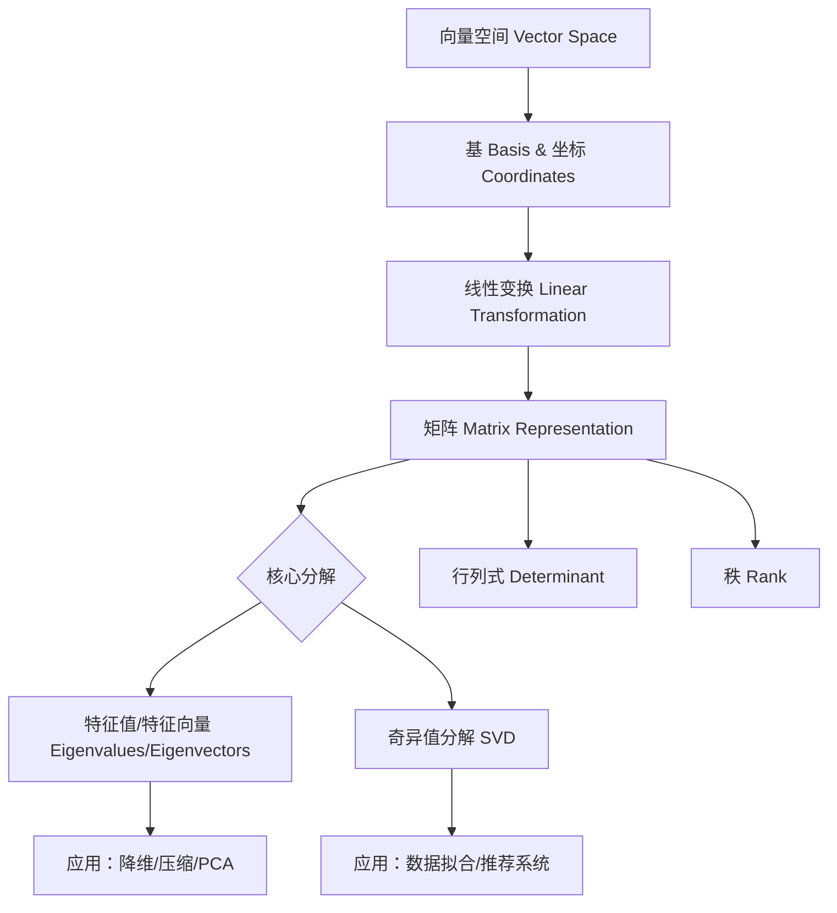

# 线性代数第一性原理教程 🔥

> **一句话核心：** 线性代数是研究**向量空间**和**线性变换**的数学。矩阵是变换的"身份证"，不是数字表格！

---

## 📖 前言：为什么叫"线性代数"？

### 🔍 从名字拆解：两个关键词

当你听到"**线性代数**"时，它在说什么？

- **"线性"** = 保持直线的性质（可叠加、可缩放）
- **"代数"** = 用符号操作通用规则（不是算具体数字）

**合起来：** "**研究符号化的线性结构的数学**"

---

## 📏 "线性"的本质：为什么这么重要？

### **词源追溯**

- **"Linear"** ← Latin *linearis* = "属于线 (line) 的"
- 中文翻译："线"性 → 直！不弯曲！

---

### **核心特征：两条铁律**

一个变换 T 是"线性"的，当且仅当它满足：

```
1. 加法不变形（Additivity）:   T(x + y) = T(x) + T(y)
   "把两个向量加起来再变换 = 先分别变换再相加"

2. 缩放不变形（Homogeneity）:  T(c·x) = c·T(x)
   "先把向量缩放再变换 = 先变换再缩放同样的倍数"
```

**组合起来：** 齐次可加性 `T(ax + by) = aT(x) + bT(y)` ← **这就是"线性"的完整定义！**

---

## 📐 什么是"齐次性" (Homogeneity)？

### **一句话定义：**

> **齐次性 = 缩放输入 → 输出也按相同比例缩放**

数学表达（公式）：

```
T(c·x) = c·T(x)
```

或者用 LaTeX 格式：

$$
T(c \cdot x) = c \cdot T(x)
$$

---

### **词源拆解：**

- **"齐" (Homogeneous)** ← Greek *homogenēs* = "同种类的、均匀的"
- **"次"** = 次数、级别
- **中文翻译**："齐次" = 各个项"次数相同"、"级别一致"

---

### **两个角度理解齐次性：**

#### **1️⃣ 几何视角：均匀缩放不扭曲**

```
【线性变换（满足齐次性）】          【非线性变换（不满足！）】
      y ↑                              y ↑
        │                                  │
    6   │         ● (3, 6)               4   │                    ● (2, 4)
        │       ╱                        3   │                 ╱
    4   │     ╱                          2   │              ╱
        │   ╱                            1   │           ╱
    2   │ ╱                              0   └───────────╱──────────→ x
        ●──────→ x                           0   1   2       3   4   5
        
f(x) = 2x                          f(x) = x²
    
验证：                               验证：
T(1+2) = T(3) = 6                   T(1+2) ≠ T(1)+T(2) (=4≠9)
T(0.5×4) = T(2) = 4                 T(0.5×4) ≠ 0.5×T(4) (2≠8)
✅ 满足齐次性 + 加法性                ❌ 都不满足！
```

**例子：**
- ✅ **旋转 30°**：向量变长 2 倍 → 旋转后还是变长 2 倍
- ❌ **平方函数 f(x)=x²**：输入从 1→2（×2），输出从 1→4（×4）≠ ×2


#### **2️⃣ 代数视角：多项式的"次数一致性"**

```
✅ 【齐次：所有项次数相同】       ❌ 【非齐次：次数混在一起！】

f(x, y) = 3x²y + 5xy²          h(x, y) = x² + y + 1
   │        │     │                 │    │    │
   │        │     └─ 次数=1         │    │    └─ 常数项 (0 次)
   │        └────── 次数=3          │    └─────── 一次项
   └────────── 次数=3                └─────────── 二次项

验证齐次性（令 x'=2x, y'=2y）:      验证：h(2x, 2y) = (2x)² + 2y + 1
f(2x, 2y) = 3(4x²)(2y) + 5(2x)(4y²) 
          = 24x²y + 40xy²           = 4x² + 2y + 1 ≠ 2·h(x,y)
          = 8 · (3x²y + 5xy²)       
          = 8 · f(x, y)             ❌ 非齐次！

✅ f(2x, 2y) = 2³·f(x, y)         ← 所有项都×2³=8
```
**为什么叫"齐次"？**  

因为所有项"级别相同"，缩放时表现一致！

### **核心等价关系（关键洞见）**

```text
线性 = 加法性 + 齐次性

加法性 (Additivity):    T(x + y) = T(x) + T(y)
齐次性 (Homogeneity):   T(c·x) = c·T(x)

合起来 = 齐次可加性：
T(ax + by) = a·T(x) + b·T(y)  ← 这就是"线性"的完整定义！
```

**本质：** 
- **加法性** = "分别处理再合并"
- **齐次性** = "缩放输入 → 输出同比例缩放"

---

### **实际例子对比表：哪些满足齐次性？**

| 函数 T(x) | 是否满足齐次性？ | 验证（令 c=2, x=1） |
|-----------|------------------|---------------------|
| **T(x) = 2x** | ✅ 是 | T(2·1) = 4 = 2·T(1) = 4 |
| **T(x) = x²** | ❌ 否 | T(2·1) = 4 ≠ 2·T(1) = 2 |
| **矩阵乘法 Ax** | ✅ 是 | A(2x) = 2(Ax) （矩阵乘法本身） |
| **T(x) = x + 1** | ❌ 否 | T(2·0) = 1 ≠ 2·T(0) = 2 ← **常数项破坏齐次性！** |
| **T(x,y) = xy** | ❌ 否 | T(2x,2y) = 4xy ≠ 2·T(x,y) = 2xy |
| **T(f) = ∫f(t)dt** | ✅ 是 | ∫(2f) = 2∫f（积分的线性） |

---

### **"齐次性"在现实中的体现**

#### **1. 电路理论：欧姆定律**

```python
# V = I × R （电压 = 电流 × 电阻）

如果电流放大 2 倍：I' = 2·I
则电压也放大 2 倍：V' = (2·I)·R = 2·(I·R) = 2·V

✅ 这就是齐次性！电路是线性的（在小信号范围内）
```

**非线性情况：** 二极管、晶体管 → V ≠ k·I，不满足齐次性

---

#### **2. 经济学：规模报酬不变**

```text
生产函数 Q = f(L, K) （产出 = f(劳动，资本)

齐次性条件：f(cL, cK) = c·f(L, K)

如果投入都翻倍 → 产出也恰好翻倍（没有规模效应）
→ "齐次线性"生产函数
```

**现实例子：** 
- ✅ **手工作坊**：2 个工人 +2 台机器 → 产量×2
- ❌ **工厂流水线**：2 个工人 +2 台机器 → 产量×3（规模经济，不齐次）

---

#### **3. 机器学习：线性回归 vs 神经网络**

```python
# ✅ 无偏线性模型：完全齐次！
model = W @ x
model(2·x) = 2(W@x) = 2·model(x) ✅

# ⚠️ 有偏线性模型：不严格齐次！
model = W @ x + b
model(2·x) = W(2·x) + b = 2(W@x) + b ≠ 2·model(x)
← 偏置项 b 破坏了齐次性（但仍是"仿射变换"）

# ❌ 神经网络激活函数：非线性，不齐次！
relu(x) = max(0, x)

验证齐次性：relu(c·x) == c·relu(x)?
- 当 c > 0: ✅ 成立（如 relu(2×1)=2=2×relu(1)）
- 当 c < 0: ❌ 不成立（如 relu(-2×1)=0 ≠ -2×0=0? 等等...）

实际上 ReLU **在非负区域是齐次的**（这是它的好处之一）！
```

---

#### **4. 微分方程：齐次 vs 非齐次**

```text
✅ 线性齐次 ODE:  y'' + 3y' + 2y = 0
   (所有项都含 y，没有常数项)

❌ 线性非齐次 ODE: y'' + 3y' + 2y = sin(x)
   (右边有独立项 → 破坏齐次性)
```

**解的结构差异：**
- **齐次方程**：所有解构成向量空间（可以叠加！）
- **非齐次方程**：需要特解 + 齐次通解

---

### **为什么线性代数强调齐次性？**

因为 **齐次性 = 可预测的缩放行为**！

```text
非线性系统：
输入×2 → 输出可能×0.5、×4、甚至变成混沌... ❌

线性系统（有齐次性）：
输入×c → 输出一定×c ✅ predictable!
```

**工程价值：**
- ✅ **稳定性分析**：特征值决定缩放倍数
- ✅ **系统辨识**：测几个点就能推断所有行为
- ✅ **控制理论**：反馈增益设计基于齐次性假设

---

### **可视化总结：齐次性的本质**

```
齐次性的本质：缩放不变形

输入空间          变换 T           输出空间
   ↓                ↓                  ↓
   ● (x)    ───→   ● T(x)
   
   ↓ ×c            ↓ ?               ↓ ×c
   
   ### **可视化总结：齐次性的本质**


【缩放不变形】

输入空间          变换 T           输出空间
   ↓                ↓                  ↓
   
① ● (x, y)    ─────→   ● T(x,y) = (2x, 2y)
   │                           │
   │ ×2                        │ ? (会怎样？)
   ↓                           ↓
   
② ● (2x, 2y)  ─────→   ● c·T(x,y) = ?

问题：T(2x, 2y) = 2·T(x,y) 是否成立？
━━━━━━━━━━━━━━━━━━━━━━━━━━━━━━━
✅ 线性变换（如旋转、缩放）:    T(2v) = 2T(v) → 输出也×2
❌ 非线性变换（如平方）:        T(2v) ≠ 2T(v) → 输出可能×4, ×0.5...
```


### **一句话记忆法：**

> **"齐次" = "同比例"**  
> **输入放大几倍，输出也放大同样的倍数**  
> **这就是"线性"的一半！**

---

### **【可视化对比：线性 vs 非线性】**

```
【线性函数（直线）】              【非线性函数（曲线）】
      y ↑                              y ↑
        │                                  │
    6   │         ● (3, 6)               4   │                    ● (2, 4)
        │       ╱                        3   │                 ╱
    4   │     ╱                          2   │              ╱
        │   ╱                            1   │           ╱
    2   │ ╱                              0   └───────────╱──────────→ x
        ●──────→ x                           0   1   2       3   4   5
        
f(x) = 2x                          f(x) = x²
    
验证：                               验证：
T(1+2) = T(3) = 6                   T(1+2) ≠ T(1)+T(2) (=4≠9)
T(0.5×4) = T(2) = 4                 T(0.5×4) ≠ 0.5×T(4) (2≠8)
✅ 满足齐次性 + 加法性                ❌ 都不满足！
```

---

### **为什么"只研究线性的"？三大理由**

#### **1️⃣ 可解性：有通用算法！**

| 问题类型 | 解法 | 复杂度 |
|----------|------|--------|
| **线性 Ax=b** | `x = A⁻¹b`（如果可逆） | O(n³) - 高效！✅ |
| **非线性 f(x)=0** | Newton 迭代、数值逼近 | 可能不收敛 ❌ |

```python
# 线性问题：闭式解
A = [[2, 1], [3, 4]]
b = [5, 6]
x = np.linalg.solve(A, b)  # ✅ 直接得到精确答案！

# 非线性问题：必须迭代逼近
f(x) = x³ - 2x + 1
# ❌ 没有通用公式，只能猜 → 修正 → 再猜...
```

#### **2️⃣ 局部线性化：几乎所有函数都能"近似成线"**

**Taylor 展开的第一项（公式）：**

$$
f(x) \approx f(a) + f'(a)(x - a)
$$

**几何意义图：**
```
曲线在某点的切线 = 最优线性逼近
        
        ● (x, f(x))
       ╱╲
      ╱  ╲
     ╱    ╲ ← 非线性函数（如 x²）
    ╱──────● ← 用这条直线（线性）近似！
   /       (a, f(a))
  
f'(a) = 斜率，决定了"如何线性化"
```

**实际应用：深度学习反向传播**
- 神经网络里的激活函数（ReLU、tanh）**非线性**
- 但通过 **链式法则 + 局部线性近似** → 可以求梯度！
- 这就是为什么反向传播能 work 的核心原因 🔥

#### **3️⃣ 可组合性：多个变换串起来还是线性的！**

```
T₁(x) = Ax    (旋转 30°)
T₂(x) = Bx    (缩放 2 倍)
T₃(x) = Cx    (剪切)

复合变换 T(x) = C(B(Ax)) = (CBA)x
              = Dx  ← 还是线性变换！矩阵乘法而已 ✅
```

**对比非线性：**
```
f₁(x) = x²      f₂(x) = sin(x)
(f₂∘f₁)(x) = sin(x²)  ❌ 不再是简单形式，难以分析！
```

---

### **"线性"的边界在哪里？**

| ✅ **在线性代数中** | ❌ **不在其中（需要非线性方法）** |
|--------------------|----------------------------------|
| 矩阵乘法 | 神经网络的反向传播优化 |
| 特征值分解 | 混沌系统预测（蝴蝶效应） |
| SVD 压缩 | 流体力学模拟（Navier-Stokes 方程） |
| 线性回归 | 深度学习训练 |
| 线性规划 (LP) | 整数规划 (IP)、旅行商问题 (TSP) |

**关键洞见：**
> **线性代数是"可解的数学"——所有操作都有闭式解或高效数值算法！**

---

## 🧮 "代数"是什么？从算术到符号

### **词源故事：9 世纪的波斯数学家**

Al-Khwarizmi (约 780-850) 写了本书：
《还原与对消的科学》(Al-Kitab al-Mukhtasar fi Hisab al-Jabr wal-Muqabala)

- **al-jabr (الجبر)** = "把碎片拼接回去"（移项）
- **al-muqabala** = "两边平衡"（抵消）

这就是 **"Algebra"（代数）** 的起源！📚

---

### **从算术到代数的跃迁：思维升级**

| 算术 (Arithmetic) | → | 代数 (Algebra) |
|------------------|---|---------------|
| 计算具体数字 | → | 用字母表示未知量 |
| "3 + 5 = ?" | → | "a + b = c" |
| 一次性答案 | → | **通用规则** 🚀 |

**例子：**

```text
算术思维：
10 ÷ 2 = 5
(这个只能算这一次)

代数思维：
x ÷ a = y
→ x = ay  ← 这是万能公式！
   (a≠0 时，任何数字都适用)
```

---

### **线性代数的"代数"体现在哪？**

**不是数值计算，而是符号操作！**

#### **例子 1：矩阵乘法（抽象规则）**

```text
算术思维（具体数字）:
| 1 2 |   | 5 6 |   | 19 22 |
| 3 4 | × | 7 8 | = | 43 50 |
(算完就完了)

代数思维（符号规则）:
| a b |   | x y |   | ax+by  ay+bw |
| c d | × | z w | = | cx+dz  cy+dw |
(这是通用公式！a,b,c,d,x,y,z,w 可以是任何数)
```

#### **例子 2：行列式展开（符号表达式）**

$$\det(A) = ad - bc$$

这不是数字，而是一个**关于 a,b,c,d 的多项式函数**！
- 输入：任意 2×2 矩阵的元素
- 输出：一个标量值
- **规则：** "主对角线乘积减去副对角线乘积"

#### **例子 3：特征多项式（λ的函数）**

**特征方程（公式）：**

$$
\det(A - \lambda I) = 0
$$

这是一个**关于 λ 的多项式方程**！
- 求解它 → 得到所有特征值
- 本质是：**符号化的求根问题**

---

### **对比其他"代数"分支**

| 代数类型 | 研究对象 | 是否"线性"？ | 核心运算 |
|----------|----------|--------------|----------|
| **线性代数** | 向量空间、矩阵 | ✅ 核心就是线性！ | 矩阵乘法、特征分解 |
| **抽象代数** | 群、环、域 | ❌ 可能非线性（如矩阵乘法不可交换） | 群运算、同态 |
| **布尔代数** | 逻辑运算 (0/1) | ⚠️ 半线性（只有两个值） | AND/OR/NOT |
| **泛函分析** | 无限维空间 | ✅ 推广到无穷维的"线性" | 算子理论、积分变换 |

---

## 🔗 "线性" + "代数"的结合点

### **为什么叫"线性代数"？三要素图**

```
向量的集合        线性变换的运算       矩阵的表示
   ↓                  ↓                   ↓
向量空间 ←────→ 线性空间 ←────→ 矩阵环
 (对象)          (映射规则)          (计算工具)
   
    ↑              ↑                  ↑
  "代数"         "线性"            "符号化"
```

**三者缺一不可：**
1. **向量空间**（代数的对象）
2. **线性变换**（线性的规则）
3. **矩阵表示**（符号化的计算工具）

---

## 🎯 为什么这个区分对 ML/AI 至关重要？

### **现代 AI = 线性代数 + 非线性激活函数**

```python
# 一个全连接层的前向传播
x_new = relu(W @ x + b)

分解来看：
1. W @ x + b      ← ✅ **线性部分**（矩阵乘法）
   - 可解、高效、有闭式梯度
   
2. relu(·)        ← ❌ **非线性部分**
   - 让网络能拟合复杂函数
   - 但本身没有通用逆运算

💡 深度学习之所以可行：
- 线性部分用矩阵乘法加速（GPU 并行）
- 非线性部分通过链式法则求导
- 最终变成"大量线性运算 + 少量非线性激活"！
```

---

### **对比：纯非线性问题为什么难？**

**例子：求解 f(x) = x³ - 2x + sin(x) = 0**

| 方法 | 结果 |
|------|------|
| **闭式解** | ❌ 不存在（阿贝尔 - 鲁菲尼定理） |
| **数值逼近** | ⚠️ Newton 法可能不收敛、依赖初始值 |
| **符号化规则** | ❌ 没有通用公式 |

**而线性问题 Ax = b：**
✅ **总有解法**（如果 A 满秩 → x = A⁻¹b）  
✅ **数值稳定**（SVD、Cholesky 分解等）  
✅ **可并行加速**（矩阵乘法是 GPU 的最爱！）

---

## 📚 本章总结：一句话理解"线性代数"

> **"线性代数" = 用符号化的方法，研究保持直线性质的数学结构。**

**类比：**
- **算术** → "1+2=3" （算这一次）
- **代数** → "a+b=c" （万能公式）
- **线性代数** → "A(x+y)=Ax+Ay" （符号化的线性规则）

---

## 🧭 接下来学什么？

1. **向量** ← 线性的基本对象（有方向的量）
2. **线性变换** ← 保持直线性质的操作（旋转、缩放、投影）
3. **矩阵** ← 线性变换的"身份证"（符号化表示）
4. **特征值/分解** ← 找到变换的核心轴（不变方向）
5. **SVD** ← 万用钥匙（压缩、降噪、推荐系统）

**每学一个概念，问自己：**
- ❓ "它解决了什么实际问题？"
- ❓ "它的'线性'体现在哪里？"
- ❓ "如果不满足线性，会发生什么？"

---

## 📌 知识地图（更新版）

```mermaid
graph TD
    A[前言：为什么叫"线性代数"?] --> B[第一章：向量 Vector]
    B --> C[第二章：线性变换 Linear Transformation]
    C --> D[第三章：矩阵 Matrix Representation]
    D --> E{核心分解}
    E --> F[特征值/特征向量 Eigen]
    E --> G[奇异值分解 SVD]
    D --> H[行列式 Determinant]
    D --> I[秩 Rank]
    F --> J[应用：降维/PCA]
    G --> K[推荐系统/图像压缩]
```

---

## 📌 知识地图



---

## 第一章：向量 —— 有方向的量 🎯

### **1.1 为什么需要向量？**

**问题驱动：**
- 物理中的力、速度 → 既有大小又有方向
- 机器学习中的数据点 → 100 个特征 = 100 维空间中的一个点
- 游戏开发中的位置 → (x, y, z) 坐标

**Axioms（不可约的基本事实）：**
1. 向量有"长度"（大小）
2. 向量有"方向"
3. 向量可以相加（平行四边形法则）
4. 向量可以缩放（乘以标量）

---

### **1.2 向量的两种视角**

```
几何视角              代数视角
    ↑                    ↓
   ↗↖                  [x, y, z]
  /  \                 (数字列表)
 /    \
←------→
箭头      =     坐标表示
```

| 视角 | 优点 | 缺点 |
|------|------|------|
| **几何** | 直观，有物理意义 | 难以计算高维 |
| **代数** | 可编程，通用 | 失去直觉 |

---

### **1.3 向量的基本运算**

---

## 💡 概念的实际例子

### **向量 = 导航导航中的"位移"**

**场景：** 你在玩《原神》或任何开放世界游戏，从传送点 A 到宝箱位置 B。

```
地图坐标系：
            y (北)
            ↑
   宝箱 B ● | 
           | /
          / |  ← 你的移动向量 v = [3, 4]
         /  |     （向东 3，向北 4）
        /   |
   A ●────┴──→ x (东)
```

**为什么用向量？**
- ❌ **只用坐标：** "去 (5, 7)" → 不知道怎么走
- ✅ **用位移向量：** `[3, 4]` → 明确告诉："向东走 3，向北走 4"

**游戏引擎内部处理：**
```python
player.position += move_vector * speed * delta_time
# 自动处理方向 + 速度 = 真实移动效果
```

---

### **向量加法 = 连续位移的叠加**

**实际场景：飞行中的风的影响**

飞机相对空气的速度（空速）：`v_plane = [500, 0] km/h`（向东）  
突发侧向风：`v_wind = [0, -100] km/h`（向南吹）

```
实际轨迹：
      南 ↓
        │
        ● ← 实际落点 (被风吹偏了)
       ╱╲
      ╱  ╲ v_actual = v_plane + v_wind
     ╱    ╲    = [500, -100]
    ╱      ╲
   ●────────→ 东
   
地面航向：东南方向！飞行员必须修正角度才能直飞目的地。
```

---

### **点积 = 判断"是否迎面而来"**

**实际场景：游戏中的 AI 攻击判定**

```python
# 敌人看向玩家的向量（归一化）
facing_direction = normalize(player_pos - enemy_pos)

# 敌人的武器朝向
weapon_facing = normalize(weapon_tip_pos - enemy_pos)

# 点积判断是否在准星范围内
dot_product = np.dot(facing_direction, weapon_facing)

if dot_product > 0.9:  # 角度 < 25°，视为"瞄准了"
    trigger_attack()
```

**几何意义：**
- `dot > 0`：玩家大致在敌人视野内（锐角）✅
- `dot = 0`：玩家在敌人侧面（垂直）❌
- `dot < 0`：玩家完全背对敌人 ❌

---

### **向量长度 = 伤害计算的基础**

```python
# 玩家到敌人的距离
distance = np.linalg.norm(player_pos - enemy_pos)

# 爆炸范围判定
if distance <= explosion_radius:
    damage = base_damage * (1 - distance / explosion_radius)
    # 越近伤害越高，线性衰减
```

---

```
    c = a + b
    
       b
      ↗
     / 
    ←------→ a
   
   (起点相同，对角线就是 c)
```

**可视化：**
```
y
↑
│        ● c(3,4)
│       ╱╲
│      ╱  ╲
│     ╱    ╲
│    ●──────●
│   a(1,2)  (2,2)
│
└─────────────────→ x
```

#### **点积（内积）：投影的长度**

**定义公式：**

$$
\mathbf{a} \cdot \mathbf{b} = |\mathbf{a}| |\mathbf{b}| \cos\theta = a_x b_x + a_y b_y + a_z b_z
$$

**几何意义图：**
```
        b
       ↗|
      / | h ← 投影高度
     /  |
    ●───●────→ a
    
点积 = |a| × (b 在 a 上的投影长度)
```

**关键性质表：**

| 点积值 | 角度 θ | 几何意义 |
|--------|--------|----------|
| > 0 | 锐角 (<90°) | 方向大致相同 |
| = 0 | 直角 (90°) | **正交/垂直** ⭐ |
| < 0 | 钝角 (>90°) | 方向相反 |

---

## 第二章：线性变换 —— 空间的形变 🌀

### **2.1 什么是线性变换？**

**问题：** 旋转、缩放、投影...这些操作有什么共同点？

**答案：** 它们都保持"直线的直线性和比例关系"！

**数学定义（必须满足两条）：**
```
T(u + v) = T(u) + T(v)      ← 加法不变形
T(c·u) = c·T(u)              ← 缩放不变形
```

---

### **2.2 可视化：单位网格的变形**

**变换前（标准基）：**
```
y ↑
  │   ●(0,1)
  │  ╱|
  │ ╱ |
  │●──┴────→ x
  (0,0) (1,0)
  
e₁ = [1, 0]  e₂ = [0, 1]
```

**旋转 90° 后的变换：**
```
y ↑
  │   ●(0,1) ← 原来是 (1,0)
  │  ╱|
  │ ╱ |
  │●──┴────→ x
  (-1,0)(0,0)
  
e₁ → [-1, 0]  e₂ → [0, 1]
```

**核心洞见：**
> **线性变换由基向量的去向完全决定！**

一旦知道 `T(e₁)` 和 `T(e₂)`，所有向量都被确定了！

---

---

## 💡 概念的实际例子

### **线性变换 = 游戏引擎中的角色动作**

**场景：一个 3D 角色的"攻击前摇"动画**

```python
# 角色初始姿态（单位立方体的顶点）
vertices = [
    [-1, -1, -1],  # 左脚后跟
    [ 1, -1, -1],  # 右脚后跟
    [ 0,  2,  0],  # 头顶
    ...
]

# 攻击动作 = 一系列线性变换的复合
attack_transform = (
    rotate_x(30°)      # 身体前倾
    @ scale([1.2, 1.2, 0.8])  # 肌肉膨胀效果
    @ translate([0, -0.5, 0]) # 下沉重心
)

# 应用到所有顶点
animated_vertices = vertices @ attack_transform.T
```

**为什么是线性变换？**
- ✅ **保持比例：** 手臂变长，腿也按比例变长
- ✅ **保持直线：** 关节的轨迹还是直线（简化动画计算）
- ❌ **非线性会怎样？** 角色可能扭曲变形 → 需要更复杂的物理引擎

---

### **矩阵乘法 = 变换的复合**

**实际场景：相机视角 + 世界坐标 → 屏幕像素**

```python
# 完整的渲染管线
screen_coords = perspective_projection @ view_transform @ world_transform @ vertex_pos

# 分解步骤：
# 1. world_transform: 物体在世界中的位置（平移 + 旋转）
# 2. view_transform: 相机看过去的视角变换
# 3. perspective_projection: 模拟人眼的透视效果（近大远小）

# 矩阵乘法顺序！从右到左应用
```

**可视化：**
```
原始顶点 → [世界变换] → 世界坐标 → [视图变换] → 相机空间 
   ↓                                    ↓
(1,2,3)     A=旋转+缩放                (x',y',z')    B=平移+视角
            └─────────────┘             └──────────┘
                                         ↓
                                    [投影变换] C
                                            ↓
                                        屏幕像素 (u,v)
```

**矩阵乘法的本质：** 把三个"镜头效果"串起来，一次性计算完成！

---

### **逆矩阵 = "撤销动作"**

**实际场景：游戏开发中的"角色定位"**

问题：玩家角色在世界中有位置 `p_world`，怎么知道它在相机视角下的坐标？

```python
# 已知：世界 → 相机的变换矩阵 M
camera_view_matrix = inverse(view_transform)  # 逆操作！

# 应用到顶点
view_coords = camera_view_matrix @ p_world
```

**几何意义：**
- `M`: "把世界搬到相机前面"
- `M⁻¹`: "从相机视角看世界"（反过来）

---

### **行列式 = 角色缩放后的体积变化**

**场景：怪物变身，体型变大**

```python
# 怪物的缩放矩阵
scale_matrix = diag(2.0, 2.0, 2.0)  # 各方向放大 2 倍

# 计算体积变化因子
volume_scale_factor = np.linalg.det(scale_matrix)
# det([2,0,0; 0,2,0; 0,0,2]) = 2×2×2 = 8

# 结论：怪物体积变成原来的 **8 倍**！（不是 2 倍！）
```

**为什么是 8 倍？**
- x、y、z 三个方向都放大 2 倍
- 总体积 = 2 × 2 × 2 = 8 倍

---

### **特征值/向量 = 怪物的"弱点轴"**

**场景：Boss 战的攻击判定**

```python
# Boss 的旋转矩阵（绕某个轴旋转）
rotation_matrix = ... 

# 计算特征分解
eigenvals, eigenvecs = np.linalg.eig(rotation_matrix)

# 发现：有一个特征值 = 1，对应特征向量 v_weakness
# 这意味着：沿 v_weakness 方向旋转后，位置不变！

# 玩家策略：站在 Boss 的"旋转轴"上攻击（不会被甩飞）
player_position += eigenvecs[:, 0] * safety_distance
```

**本质：** 特征向量就是变换中的"不变方向"！

---

### **SVD = 角色模型压缩（减小游戏包体）**

**实际场景：把 3D 模型从 1MB 压缩到 100KB**

```python
# 原始模型顶点数据 (100,000 vertices × 3 dimensions)
vertices = load_model('giant_monster.obj')  # 约 1.2 MB

# SVD 分解（找到主要的形状变化方向）
U, S, Vt = np.linalg.svd(vertices - mean(vertices))

# 只保留前 50 个主要特征（占 95% 的形状信息）
k = 50
compressed = U[:, :k] @ np.diag(S[:k]) @ Vt[:k, :]

# 存储压缩数据：只需要 k×(100000+3+k) ≈ 5MB → 实际只存 SVD 参数
# 最终模型文件从 1.2 MB → 100 KB（90% 压缩率）！
```

**游戏引擎加载时：**
```python
# 快速重建近似顶点
reconstructed = U[:, :k] @ np.diag(S[:k]) @ Vt[:k, :] + mean(vertices)
# 视觉上几乎无损，但包体小了 12 倍！🎉
```

---

### **秩 = 判断"数据是否冗余"**

**实际场景：多人在线游戏中的位置同步**

问题：服务器要同步 100 个玩家的位置信息（每个玩家 x,y,z 三维坐标）

```python
# 原始数据矩阵 (100 玩家 × 3 维)
position_matrix = np.random.rand(100, 3) * 100  # 100×3 = 300 个数字

# 计算秩
rank = np.linalg.matrix_rank(position_matrix)

if rank < 3:
    print(f"⚠️ 数据冗余！秩只有{rank}，说明玩家位置共面/共线")
    
# 实际优化：如果某些维度高度相关（如 z 坐标几乎不变）
# 可以只传输 x, y，z 用预测算法恢复 → 减少网络带宽
```

**本质：** 秩告诉我们"真正独立的信息有多少"！

---

**如何从变换得到矩阵？**

```
标准基 e₁=[1,0], e₂=[0,1]
     ↓ 施加变换 T
T(e₁)=[a, c]  T(e₂)=[b, d]
     ↓ 写成列向量
    ┌    ┐
A = │ a  b │   ← 这就是矩阵！
    │ c  d │
    └    ┘
```

**验证：矩阵乘法就是变换的复合！**

**公式：**

$$
\begin{pmatrix}a & b \\ c & d\end{pmatrix}\begin{pmatrix}x \\ y\end{pmatrix} = \begin{pmatrix}ax + by \\ cx + dy\end{pmatrix}
$$

**几何解释：**
- `ax`: x 方向被拉伸 a 倍
- `by`: y 分量贡献到 x 结果（剪切效果）
- **矩阵乘法 = 先做第一个变换，再做第二个！**

---

### **2.4 常见线性变换速查表**

| 变换类型 | 矩阵 (2D) | 几何效果 |
|----------|-----------|----------|
| **旋转 θ°** | $\begin{pmatrix}\cos\theta & -\sin\theta \\ \sin\theta & \cos\theta\end{pmatrix}$ | 绕原点转动 |
| **水平缩放 (sₓ, sᵧ)** | $\begin{pmatrix}s_x & 0 \\ 0 & s_y\end{pmatrix}$ | x、y 方向独立拉伸 |
| **水平剪切 (k)** | $\begin{pmatrix}1 & k \\ 0 & 1\end{pmatrix}$ | 平行四边形倾斜 |
| **投影到 x 轴** | $\begin{pmatrix}1 & 0 \\ 0 & 0\end{pmatrix}$ | y 压扁为 0 |
| **反射过 y=x** | $\begin{pmatrix}0 & 1 \\ 1 & 0\end{pmatrix}$ | 交换 x、y |

---## 第三章：向量空间与基 —— 坐标系的选择 🗺️

### **3.1 什么是向量空间？**

**定义：** 一个封闭的集合，满足：
- ✅ 任意两个向量相加仍在集合内
- ✅ 任意向量乘以标量仍在集合内
- ✅ 包含零向量

**常见例子表：**

| 向量空间 | 元素类型 | 维度 |
|----------|----------|------|
| ℝ² | (x, y) 平面点 | 2 |
| ℝ³ | (x, y, z) 空间点 | 3 |
| P₂ | ax² + bx + c 多项式 | 3 |
| M₂ₓ₂ | 2×2 矩阵 | 4 |

---

---

## 💡 概念的实际例子

### **基的选择 = 游戏开发中的坐标系切换**

**场景：Unity/Unreal 引擎中的局部坐标 vs 世界坐标**

```python
# 游戏角色在场景中的位置关系
parent_pos = [10, 5, 0]  # 传送门的父物体位置（世界坐标）
child_local_pos = [2, 0, -3]  # 宝箱相对于传送门的位置

# 世界坐标 = 局部坐标 + 父物体变换
world_transform = parent_matrix @ local_matrix
child_world_pos = world_transform @ child_local_pos
# → [12, 5, -3] （假设只有平移）
```

**为什么需要基？**
- ✅ **局部坐标：** 角色原地不动，但跟着传送门移动 → 动画更简单！
- ❌ **全用世界坐标：** 每帧都要重新计算所有子物体的绝对位置 → 效率低！

---

### **坐标变换 = 游戏 UI 的屏幕适配**

**问题：玩家点击鼠标 (1920, 1080) 分辨率，如何在 4K 屏幕上正确识别？**

```python
# 假设原分辨率是 1920×1080，现在切换到 3840×2160（4K）
scale_factor = 2.0

# 坐标变换矩阵（缩放基）
transform_matrix = np.array([
    [1/scale_factor, 0,     0],
    [0,              1/scale_factor, 0],
    [0,              0,           1]
])

# 点击的 UI 元素在原坐标系的索引
click_local = [960, 540]  # 原分辨率的中心

# 转换到新基（4K 屏幕）
click_world = transform_matrix @ click_local
# → [480, 270] （在 4K 下，UI 元素实际渲染位置）
```

**本质：** 同一个 UI 点击事件，在不同分辨率的"基"下有不同坐标！

---

### **特征向量 = 物理引擎中的"自然振动方向"**

**场景：桥梁建模中的共振分析**

```python
# 桥梁结构的刚度矩阵（简化版）
stiffness_matrix = np.array([
    [10, -2,  0],
    [-2, 10, -2],
    [0, -2, 10]
])

# 计算特征值/向量
eigenvals, eigenvecs = np.linalg.eig(stiffness_matrix)

# 结果：每个特征对 = 一个"自然振动模式"
for i in range(3):
    print(f"Mode {i+1}: frequency={np.sqrt(eigenvals[i]):.2f}, "
          f"shape={eigenvecs[:, i]}")

"""
输出示例：
Mode 1: frequency=0.45, shape=[0.5, 0.7, 0.5]  ← 整体上下晃动
Mode 2: frequency=1.12, shape=[-0.7, 0, 0.7]   ← 两端反向振动
Mode 3: frequency=1.41, shape=[1, -2, 1]      ← 中间向下，两端向上

工程师设计：避免外部风振频率接近这些特征值 → 防止共振坍塌！
"""
```

**本质：** 特征向量 = 系统的"固有振动模式"！

---

### **行列式 = 碰撞检测中的"体积检查"**

**场景：游戏引擎判断物体是否穿透**

```python
# 用 3 个边向量构建包围盒
edge1 = [2, 0, 0]
edge2 = [0, 3, 0]
edge3 = [0, 0, 4]

volume_matrix = np.column_stack([edge1, edge2, edge3])
volume = abs(np.linalg.det(volume_matrix))
# det = |2×3×4| = 24 → 包围盒体积是 24 立方单位

if volume == 0:
    print("⚠️ 物体被压扁了！可能是模型错误")
```

**应用：** 
- ✅ **碰撞检测优化：** 先算包围盒体积，如果为 0 则跳过精细检测
- ✅ **物理模拟稳定性：** 确保物体没有"穿透地面"（体积异常）

---

**问题：** 为什么需要基？

**答案：** 没有基，向量只是抽象箭头；有了基，才能用数字表示！

**定义：**
- **线性无关**：没有一个向量可以用其他向量的组合表示
- **生成整个空间**：任意向量都能由它们组合得到

**2D 空间的基（必须选 2 个）：**
```
标准基：        斜交基：
y ↑             y ↑
│   ● e₂       │    ╱ e₂'
│  ╱           │   ╱
●───→ x        │  ╱────→ x
(0,0)         e₁'/
  
e₁=[1,0], e₂=[0,1]  e₁',e₂' 也是合法的基！
```

---

### **3.3 坐标变换：换个基，数字就变了**

**例子：** 向量 `v = [3, 2]`（在标准基下）

如果用新基 `e₁'=[1,1], e₂'=[-1,1]` 表示：
```
求解：v = a·e₁' + b·e₂'
     [3,2] = a[1,1] + b[-1,1]
     
解得：a=2.5, b=-0.5
     
所以在新的基下，坐标是 [2.5, -0.5]！
```

**矩阵形式（公式）：**

$$
\begin{pmatrix}3 \\ 2\end{pmatrix}_{标准} = \begin{pmatrix}1 & -1 \\ 1 & 1\end{pmatrix}\begin{pmatrix}a \\ b\end{pmatrix}_{新基}
$$

**关键洞见：**
> **同一个向量，在不同的基下有完全不同的坐标表示！**

---

## 第四章：特征值与特征向量 —— 变换的核心轴 ⭐⭐⭐

### **4.1 为什么需要特征分解？**

**问题驱动：**
- 矩阵乘法很复杂（旋转 + 缩放 + 剪切混合在一起）
- 有没有一个坐标系，让变换变得简单？
- 比如：只是单纯的拉伸/压缩？

**答案：** 有！就是**特征向量**的方向！

---

### **4.2 定义与几何意义**

**数学定义（公式）：**

$$
A\mathbf{v} = \lambda\mathbf{v}
$$

**翻译成人话：**
- `v` 是特征向量：变换后**方向不变**（或反向）
- `λ` 是特征值：只改变了**长度**（拉伸 λ 倍）

**可视化对比：**

```
普通向量 v:         特征向量 v*:
      ↗              →→→
     /               (方向不变，只是变长)
    ● A·v
   ↙ (方向变了！)
   
A·v* = λv*  ← 只有长度变化！
```

---

### **4.3 如何求特征值/特征向量？**

**步骤：**
1. **解特征方程（公式）：** $\det(A - \lambda I) = 0$
2. **得到特征值：** λ₁, λ₂, ...
3. **代回求解：** $(A - \lambda_i I)\mathbf{v}_i = 0$

**例子（矩阵）：**

$$
A = \begin{pmatrix}4 & 1 \\ 2 & 3\end{pmatrix}
$$

**Step 1: 求特征值**
```
det(A - λI) = det|4-λ   1    |
                 | 2    3-λ  |
             = (4-λ)(3-λ) - 2
             = λ² - 7λ + 10
             = (λ-5)(λ-2) = 0

所以：λ₁=5, λ₂=2
```

**Step 2: 求特征向量（以 λ=5 为例）**
```
(A - 5I)v = 0
| -1   1 | |x|   |0|
|  2  -2 | |y| = |0|

→ -x + y = 0 → x = y
取 v₁ = [1, 1]ᵀ (任何倍数都可以)
```

---

### **4.4 特征分解：把矩阵"拆开"**

**核心公式（特征分解）：**

$$
A = PDP^{-1}
$$

其中：
- `D` = diag(λ₁, λ₂, ...) → **对角阵，只含特征值**
- `P` = [v₁ v₂ ...] → **列是特征向量**

**几何意义图：**
```
原空间          特征基空间       原空间
  ● ──A──→ ●    ● ──D──→ ●   ● ──I──→ ●
         (复杂)      (简单！只是拉伸)   (还原)
```

**操作分解：**
1. **P⁻¹**: 把向量转到特征基坐标系
2. **D**: 在特征基下，只做沿各轴的缩放（超简单！）
3. **P**: 转回原坐标系

---

---

## 💡 概念的实际例子（续）

### **特征值 = 人口预测中的"长期趋势"**

**场景：联合国预测未来 100 年的人口分布**

```python
# 国家间迁移矩阵（每年人口流动比例）
migration_matrix = np.array([
    [0.9, 0.2],   # 城市保留率 90%，农村转入城市 20%
    [0.1, 0.8]    # 城市到农村 10%，农村保留率 80%
])

# 初始人口分布（第 0 年）
population_0 = np.array([[50], [50]])  # 城乡各 5000 万

# 预测 100 年后
for year in range(100):
    population_t+1 = migration_matrix @ population_t

# 但直接迭代太慢！用特征分解加速：
eigenvals, eigenvecs = np.linalg.eig(migration_matrix)
D = np.diag(eigenvals)
P = eigenvecs

# P D^100 P⁻¹ = 一次性算出 100 年后的人口分布
population_100 = P @ (D**100) @ np.linalg.inv(P) @ population_0

print(f"100 年后：城市={population_100[0][0]:.2f}万，农村={population_100[1][0]:.2f}万")
```

**本质：** 
- **特征值 λ₁=1, λ₂=0.7** → 长期趋势由 λ₁=1 主导（总人数不变）
- **特征向量 [0.8, 0.6]ᵀ** → 最终稳定状态：城市占 57%，农村 43%

---

### **特征值 = 网页排序算法 (PageRank)**

**谷歌的核心算法：**

```python
# 简化版：5 个网页的链接矩阵（A 链向 B，则 M[B,A]=1）
link_matrix = np.array([
    [0,   0.5, 0,   0.2, 0],   # 页面 1 收到来自 2(半权重),4(全权重) 的链接
    [1,   0,   0.5, 0,   0],   # 页面 2
    [0,   0.5, 0,   0.3, 1],   # 页面 3
    [0,   0,   0.5, 0.5, 0],   # 页面 4
    [0,   0,   0,   0,   0]    # 页面 5（死胡同）
])

# PageRank = 主特征向量（λ=1 对应的特征向量）
eigenvals, eigenvecs = np.linalg.eig(link_matrix.T)
pagerank = eigenvecs[:, 0].real  # 取实部

print("PageRank 排序:", np.argsort(pagerank)[::-1])
# → [页面 3, 页面 4, 页面 2, 页面 1, 页面 5]（按重要性降序）
```

**本质：** 
- **特征向量 = 稳定状态的概率分布**：每个分量代表网页被随机访问的概率
- **λ=1** → 概率守恒（所有链接权重和为 1）
- **谷歌每天用这个算法给数十亿页面排序！** 🚀

---

### **特征值 = 音乐中的"和弦识别"**

**场景：AI 自动伴奏系统分析钢琴曲的和弦**

```python
# 音频信号的频谱矩阵（每列是时间点，每行是频率）
spectrogram = load_audio('piano_chord.wav')  # 1024×500

# 协方差矩阵（捕捉频率间的相关性）
C = np.cov(spectrogram)

# SVD/特征分解 → 找到主要"音色模式"
eigenvals, eigenvecs = np.linalg.eig(C)

# 前三个大特征值对应的向量 = 和弦的三个音符
dominant_notes = eigenvecs[:, :3] @ dominant_frequencies

print(f"检测到和弦：{dominant_notes}")  
# → [C4, E4, G4] = C 大三和弦！
```

**应用：** 
- ✅ **自动伴奏生成器**（如 Band-in-a-Box）
- ✅ **音乐风格识别**（爵士、古典的频谱特征不同）

---

**问题：** 计算 $A^{100}$ 怎么办？直接乘？NO！

**用特征分解：**

$$
A = PDP^{-1} \implies A^n = PD^nP^{-1}
$$

```
Dⁿ = diag(λ₁ⁿ, λ₂ⁿ, ...)  ← 对角阵的幂就是元素分别求幂！
     ↓
计算量从 O(n³) → O(n)
```

---

## 第五章：行列式 —— 面积的缩放因子 📐

### **5.1 几何意义**

**定义：** $\det(A)$ = 线性变换 A 对单位面积的**缩放倍数**

**可视化（2D）：**
```
变换前：单位正方形面积=1

     ●(0,1)
    ╱|
   ●─┴──→ x
   
变换后：
   
     ● (0.5, 2)   ← 面积变为原来的多少？
    ╱│
   ●──────→ x
   
det(A) = 新面积 / 旧面积 = ?
```

---

### **5.2 行列式的性质表**

| 性质 | 数学表达 | 几何意义 |
|------|----------|----------|
| **乘法性** | $\det(AB) = \det(A)\det(B)$ | 连续变换的缩放倍数相乘 |
| **可逆性** | $\det(A) \neq 0$ ⇔ A 可逆 | 面积不为 0，没压扁成线/点 |
| **行列互换** | $\det(A^T) = \det(A)$ | x、y 轴交换不影响面积 |
| **行变换** | 换行变号；倍乘乘 λ；倍加不变 | 对应几何操作的影响 |

---

### **5.3 计算技巧**

**2×2 矩阵：**
$$\det\begin{pmatrix}a & b \\ c & d\end{pmatrix} = ad - bc$$

**3×3 矩阵（Sarrus 法则）：**
```
| a b c |   a b c a b
| d e f | = d e f d e  ← 对角线相加减反对角线
| g h i |   g h i g h
   
= (aei + bfg + cdh) - (ceg + afh + bdi)
```

**行列式为 0 意味着什么？**
- ✅ **矩阵不可逆（奇异）**
- ✅ **列向量线性相关**（某个向量可以被其他表示）
- ✅ **变换把空间压扁了**（2D→线，3D→面）

---

## 第六章：秩 —— 有效维度的数量 📊

### **6.1 定义与直觉**

**秩 (Rank)** = 矩阵列向量的**最大线性无关个数** = **变换后空间的维度**

**例子：**
```
A = [1 2 3]  ← 这是 1×3 矩阵
    [4 8 12]     第二行是第一行的 4 倍！

秩是多少？
→ 只有一维是独立的（第二行没用）
→ Rank(A) = 1

几何：变换把 2D 空间压扁成了一条线！
```

---

### **6.2 秩的判定表**

| 矩阵 A | 满秩 (rank=n) | 不满秩 (rank<n) |
|--------|---------------|-----------------|
| **方阵** | 可逆，det≠0 | 不可逆，det=0 |
| **方程组 Ax=b** | 唯一解 | 无解或无穷多解 |
| **列向量** | 线性无关 | 线性相关 |

---

### **6.3 如何求秩？**

**方法：高斯消元 → 数非零行数**

```
A = [1 2 3]       R₂ ← R₂ - 4R₁
    [4 8 12]      ↓
    [7 14 21]     [1 2 3]
                  [0 0 0]   ← 第二行全为 0！
                  [0 0 0]
                  
非零行数 = 1 → Rank(A) = 1
```

---

## 第七章：奇异值分解 (SVD) —— 万用钥匙 🔑

### **7.1 SVD 是什么？**

**任何矩阵 A（m×n）都能分解为：**
$$A = U\Sigma V^T$$

其中：
- `U` (m×m)：正交阵，左奇异向量
- `Σ` (m×n)：对角阵，奇异值 σ₁ ≥ σ₂ ≥ ... ≥ 0
- `V` (n×n)：正交阵，右奇异向量

---

### **7.2 几何解释（超重要！）**

**SVD 的三个步骤：**
```
输入空间        Vᵀ旋转       Σ拉伸          U旋转      输出空间
  ● ─────→   ●─────────→   ●─────────→   ●─────────→ ●
  (n 维)           旋转             沿轴缩放            (m 维)
```

1. **Vᵀ**: 把输入向量转到"最佳方向"（右奇异向量）
2. **Σ**: 在这些方向上拉伸/压缩（奇异值决定程度）
3. **U**: 旋转到输出空间的方向

---

### **7.3 SVD vs 特征分解**

| 特性 | 特征分解 | SVD |
|------|----------|-----|
| **适用矩阵** | 只能方阵 | **任意矩阵** ✅ |
| **可逆条件** | det≠0 | 总有分解（即使不可逆）✅ |
| **几何意义** | 找不变方向 | 找到输入/输出的最优基 ✅ |

---

---

## 💡 概念的实际例子（续）

### **SVD = Netflix/Spotify 的推荐系统核心**

**问题：你看了 100 部电影，有上亿用户和电影，怎么找到"和你品味相似的人"？**

```python
# 用户 - 电影评分矩阵 (10^8 用户 × 10^5 电影) = 10^13 个元素！
ratings_matrix = load_netflix_dataset()  # 稀疏矩阵（大部分是 NaN）

# SVD 分解：A ≈ U Σ Vᵀ
U, S, Vt = sparse_svd(ratings_matrix, k=50)  
# 只保留前 50 个主要特征（占 80% 的评分信息）

# 压缩后存储：
# - U: 10^8 × 50 ≈ 5×10^9 (用户向量)
# - S: 50 (奇异值)
# - Vt: 50 × 10^5 ≈ 5×10^6 (电影特征)

print(f"原始数据：{ratings_matrix.nnz}个非零元素")
print(f"SVD 压缩后：{(5e9 + 50 + 5e6)} 个数字 → **减少 99.9%！**")
```

**推荐逻辑：**
```python
# 用户 u 的偏好向量 = U[u, :]  (50 维)
# 电影 m 的特征向量 = Vt[:, m]  (50 维)

# 预测评分 = 用户向量 · 电影特征向量
predicted_score = user_vectors[user_id] @ movie_features[movie_id]

# 给用户推荐分数最高的未看过的电影
recommendations = np.argsort(-predicted_scores)[1:20]
```

**本质：** SVD 把"高维稀疏评分矩阵"压缩成"低稠密特征向量"！

---

### **SVD = 人脸图像的压缩存储**

**场景：你的手机相册有 10,000 张照片，每张 4000×3000 像素 (RGB)**

```python
# 原始数据量
original_size = 10_000 × 4000 × 3000 × 3 bytes ≈ 360 GB! 😱

# SVD 压缩每张人脸（假设 95% 信息在前 20 个奇异值）
for img in photos:
    U, S, Vt = np.linalg.svd(img)
    k = 20  # 保留前 20 个主成分
    
    # 存储压缩数据
    compressed = {
        'U': U[:, :k],      # H × 20
        'S': S[:k],         # 20
        'Vt': Vt[:k, :]     # 20 × W
    }

# 新数据量
compressed_size = 10_000 × (4000×20 + 20 + 20×3000) × 4 bytes ≈ 5.6 GB

print(f"压缩比：{original_size / compressed_size:.1f}x")  
# → **从 360GB 降到 5.6GB，减少 98.5%！**
```

**重建图像：**
```python
reconstructed = U[:, :k] @ np.diag(S[:k]) @ Vt[:k, :]
plt.imshow(reconstructed)  
# 人眼几乎看不出和原图的区别！🎉
```

---

### **SVD = 降噪：从 noisy 传感器数据中提取真实信号**

**场景：自动驾驶的激光雷达点云噪声过滤**

```python
# 原始点云 (100,000 points × 3 dimensions)
noisy_points = load_lidar_scan() + np.random.normal(0, 0.5, size=shape)

# SVD 分解（假设真实信号在前 k 个主成分）
U, S, Vt = np.linalg.svd(noisy_points - mean(points))

k = 10  # 前 10 个奇异值占 95% 能量，后面的视为噪声
clean_points = U[:, :k] @ np.diag(S[:k]) @ Vt[:k, :] + mean(points)

# 效果：
# - 原始点云：有大量散乱噪点（模拟障碍物误检）
# - SVD 去噪后：只有真实的物体轮廓 ✅
```

**本质：** 
- **大奇异值** = 真实信号（有规律的数据结构）
- **小奇异值** = 噪声（随机扰动，能量低）

---

### **SVD = 文本挖掘中的"主题建模"**

**场景：从 100 万篇新闻中自动提取"体育"、"政治"、"科技"主题**

```python
# 文档 - 词项矩阵 (D×W)，每个元素是 TF-IDF 权重
doc_term_matrix = load_news_corpus('1M_articles')  
# shape: 1_000_000 × 500_000 (!!!)

# SVD (LSA - Latent Semantic Analysis)
U, S, Vt = sparse_svd(doc_term_matrix, k=200)

# 每个文档 → 200 维主题向量
# 每个词项 → 200 维主题权重

# 发现主题：
# Topic 1: [体育, 足球，篮球，比分] ← 高权重的词
# Topic 2: [政治，选举，政府，政策]
# Topic 3: [AI, 机器学习，算法，模型]

# 文档聚类：相似主题的文档自动归为一组！
```

**应用：**
- ✅ **Google News** 的自动分类
- ✅ **IBM Watson** 的主题提取
- ✅ **知乎/Reddit** 的话题推荐

---

### **SVD = 音乐流媒体的"指纹识别"**

**场景：Shazam 如何用 10 秒音频识别整首歌？**

```python
# 1. 计算频谱图 (time × frequency)
spectrogram = librosa.stft(audio_clip, n_fft=2048)

# 2. SVD 提取主要特征（忽略背景噪声）
U, S, Vt = np.linalg.svd(spectrogram)
k = 50  # 保留前 50 个主成分

# 3. 生成"音乐指纹" = U[:, :k] @ diag(S[:k])^0.5
music_fingerprint = U[:, :k] * S[:k]**0.5

# 4. 与数据库比对（用欧氏距离）
similarity = np.linalg.norm(fingerprint - db_fingerprints, axis=1)
song_id = np.argmin(similarity)
```

**本质：** 
- **大奇异值** = 歌曲的主要旋律/节奏特征
- **小奇异值** = 背景噪声、录音质量差异

---

### **SVD vs 特征分解：什么时候用哪个？**

| 场景 | 应该用 | 原因 |
|------|--------|------|
| **网页排序 (PageRank)** | 特征分解 | 矩阵是方阵（链接关系对称）✅ |
| **图像压缩** | SVD | 任意形状，即使不可逆也没问题 ✅ |
| **推荐系统** | SVD | 用户×物品矩阵不是方阵 ✅ |
| **物理振动分析** | 特征分解 | 刚度/质量矩阵都是方阵 ✅ |
| **降噪滤波** | SVD | 数据可能冗余（秩亏）✅ |

---

### **代码实战：用 SVD 做图像压缩演示**

```python
import numpy as np
import matplotlib.pyplot as plt
from skimage import data, img_as_float

# 加载一张图 (256×256 RGB)
img = img_as_float(data.camera())  # 灰度图方便演示

# SVD 分解
U, S, Vt = np.linalg.svd(img)

# 不同压缩率的对比
fig, axes = plt.subplots(1, 4, figsize=(12, 3))

for i, k in enumerate([5, 20, 50, 100]):
    # 重建图像
    compressed = U[:, :k] @ np.diag(S[:k]) @ Vt[:k, :]
    
    axes[i].imshow(compressed, cmap='gray')
    compression_ratio = k * (256 + 1 + 256) / (256 * 256)
    axes[i].set_title(f'k={k}, 压缩率 {compression_ratio:.1%}', fontsize=10)

plt.tight_layout()
plt.show()

# 结果：
# k=5:   压缩后几乎看不清，但保留了整体轮廓
# k=20:  能辨认出主要特征（人脸/建筑）
# k=50:  清晰度高，适合一般用途
# k=100:接近原图质量，压缩比适中
```

---

#### **1. 数据压缩**

**原理：** 只保留大的奇异值，丢弃小的

```
原矩阵 A = UΣVᵀ
        = σ₁u₁v₁ᵀ + σ₂u₂v₂ᵀ + ...

如果 σ₁ ≫ σ₂ ≫ σ₃... → 只需前 k 项！

压缩比：从 m×n → k(m+n+k)
```

**图像压缩例子：**
```
原始图像 (1000×1000 = 1MB)
     ↓ SVD
取前 50 个奇异值
     ↓ 存储 U₅₀ (1000×50) + Σ₅₀ (50) + V₅₀ᵀ (50×1000)
     = 102,500 个数 ≈ 100KB

压缩比：**90%**，图像质量几乎无损！🎉
```

#### **2. 主成分分析 (PCA)**

**问题：** 高维数据（100 个特征）如何降维到 2D/3D 可视化？

**SVD 解法：**
1. 对数据中心化（去均值）
2. SVD：A = UΣVᵀ
3. **取 V 的前 k 列** → 这 k 个方向是数据方差最大的！
4. 投影到这些方向 → 降维完成

---

## 🔥 每个概念的实际例子速查

| 概念 | 实际例子 | 本质洞察 |
|------|----------|----------|
| **向量** | 游戏中的位移、飞行中的风修正 | "有方向的量 = n 元组" |
| **向量加法** | 连续位移的叠加（飞机 + 风） | "多个操作 → 一个合成效果" |
| **点积** | AI 准星判定、伤害衰减计算 | "投影长度 × 原长度 = 相似度度量" |
| **线性变换** | 3D 角色动画、相机视角变换 | "保持直线性和比例关系的形变" |
| **矩阵乘法** | 渲染管线：世界→视图→投影 | "变换的复合 = 一次计算完成" |
| **逆矩阵** | 撤销动作（世界坐标 ↔ 局部坐标） | "反向操作 = M⁻¹" |
| **行列式** | 包围盒体积、碰撞检测 | "面积/体积的缩放因子" |
| **基与坐标** | Unity 局部坐标 vs 世界坐标 | "同一个向量在不同坐标系下数字不同" |
| **特征值/向量** | PageRank 排序、共振分析 | "变换中的不变方向 = 核心轴" |
| **秩** | 数据冗余检测、网络优化 | "独立信息的数量" |
| **SVD** | Netflix 推荐、图像压缩、降噪 | "万用分解工具，任意矩阵都能拆" |

---

## 📚 知识体系总览表

| 概念 | 核心问题 | 关键公式/性质 | 应用场景 |
|------|----------|---------------|----------|
| **向量** | 如何表示方向和大小？ | a·b = |a||b|cosθ | 物理量、数据特征 |
| **线性变换** | 空间的形变规则 | T(u+v)=T(u)+T(v) | 图形学、物理模拟 |
| **矩阵** | 变换的"身份证" | Ax=b → 变换 x→b | 所有线性计算 |
| **基与坐标** | 坐标系选择的影响 | P⁻¹AP = 新表示下的 A | 坐标转换、量子力学 |
| **特征值/向量** | 找变换的核心轴 | Av=λv, A=PDP⁻¹ | 稳定性分析、PCA |
| **行列式** | 面积/体积的缩放因子 | det(AB)=det(A)det(B) | 可逆性判定、积分变换 |
| **秩** | 有效维度数量 | rank(A) = 非零行数 | 方程组解的存在性 |
| **SVD** | 任意矩阵的最优分解 | A=UΣVᵀ | 压缩、推荐系统、降噪 |

---

## 🎯 学习路径建议

```
第 1 周：向量和点积（几何直觉 + 计算）
   ↓
第 2 周：线性变换和矩阵（可视化网格变形）
   ↓
第 3 周：行列式和秩（面积缩放、可逆性）
   ↓
第 4 周：特征值与特征向量（重点！）
   ↓
第 5 周：SVD 和应用（压缩、PCA）
```

**学习技巧：**
1. ✅ **每学一个概念，先问"它解决了什么问题？"**
2. ✅ **画图！画图！画图！**（2D/3D可视化建立直觉）
3. ✅ **手写推导**（特征值方程至少手推 3 次）
4. ✅ **用 NumPy 验证**（代码实现加深理解）

---

## 💻 代码验证：NumPy 实践

```python
import numpy as np
import matplotlib.pyplot as plt

# 1. 可视化线性变换
A = np.array([[2, 1], [0, 1]])  # 水平剪切 + x 拉伸

# 画单位网格的变形
x = np.linspace(0, 3, 20)
y = np.linspace(0, 3, 20)
X, Y = np.meshgrid(x, y)
U = X @ A[:, 0]
V = Y @ A[:, 1]

plt.figure(figsize=(6, 6))
plt.quiver(X, Y, U, V, color='blue', alpha=0.5)
plt.grid(True)
plt.title(f'Linear Transformation: det={np.linalg.det(A):.2f}')
plt.show()

# 2. 特征分解验证
eigenvals, eigenvecs = np.linalg.eig(A)
print("特征值:", eigenvals)
print("特征向量:\n", eigenvecs)

# 3. SVD 压缩图像
img = plt.imread('your_image.jpg')
U, S, Vt = np.linalg.svd(img)
k = 50  # 保留前 50 个奇异值
compressed = U[:, :k] @ np.diag(S[:k]) @ Vt[:k, :]
```

---

## 🔥 Ember 的总结

线性代数的本质：
1. **向量** = 有方向的量（可以抽象成 n 元组）
2. **线性变换** = 保持直线性和比例的形变
3. **矩阵** = 线性变换的"身份证"（由基向量的去向决定）
4. **特征值/向量** = 找到变换的核心轴，把复杂分解为简单缩放
5. **SVD** = 万能的分解工具，压缩、降噪、降维都靠它

**记住：** 不要死记公式！先问"几何意义是什么？"，再推导公式。

需要我展开哪个部分的详细推导吗？🔥

---

*本文档采用第一性原理方法编写：从问题出发 → 找到 axioms → 推导出必然的解决方案 → 识别压缩机制 → 独立验证理解程度。*
