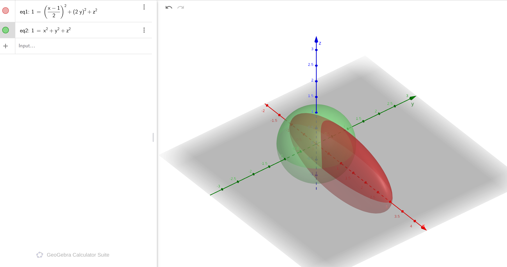

## 零、二次型：为什么所有"弯曲的边界"都能写成 $\mathbf{x}^T A \mathbf{x} = 1$

> **本章目标**：理解为什么球、椭球、双曲面可以用同一个数学公式描述，以及这如何成为 3DGS 协方差矩阵的基础。  
> **预期收获**：看到 $d^T \Sigma^{-1} d$ 时不再感到恐惧，而是直观理解它在"变形空间"里测量距离。

---

## 0.1 Problem: 我们为什么要发明二次型？

### ❓ 你面临的问题

想象一下：

> "如果我想描述一个高斯分布（比如 3DGS 里的每个高斯球），我需要知道它的**中心在哪里**，以及它在**不同方向上有多'胖'**。"

但问题来了：**如何数学化地表达"不同方向的宽度不一样"？**

### 🧭 从你已知的东西出发

你已经熟悉欧氏距离：
$$\|\mathbf{x}\|^2 = x^2 + y^2 + z^2 = 1$$

这个方程描述的是什么？是**单位球**——所有方向上距离都是 1。

但现实世界往往不是等距的。比如：
- 你从家到超市，上坡比平地难走
- 3DGS 里的一个高斯，x 方向可能很"胖"（标准差大），y 方向却很"瘦"（标准差小）

**问题出现了**：如何用数学描述这种"不均匀的距离"？

### 💡 直觉猜测：加权！

如果某个方向更难走（更"瘦"），我们应该给它的平方项更大的系数。比如：
$$\frac{x^2}{a^2} + \frac{y^2}{b^2} = 1$$

这个方程描述的是什么？是**椭球**——x 方向的半轴长 $a$，y 方向的半轴长 $b$。

> **关键问题**：为什么分母是平方？为什么这种形式能描述"不均匀的宽度"？
> 
> *需要我展开解释一下椭圆/椭球的几何性质吗？*

---

## 0.2 Starting Point: 把加权距离写成矩阵形式

### 🔍 先做点什么？

我们已经有：
$$\frac{x^2}{a^2} + \frac{y^2}{b^2} = 1$$

现在，让我问你一个问题：**这个式子能写成更紧凑的矩阵形式吗？**

试着把每一项拆开看：
- $x^2/a^2 = x \cdot \frac{1}{a^2} \cdot x$
- $y^2/b^2 = y \cdot \frac{1}{b^2} \cdot y$

**发现了吗？** 每个变量都被"夹"在中间，两边是系数！这暗示我们可以用矩阵乘法。

### 🧩 拼凑出矩阵形式

让我们构造一个向量 $\mathbf{x} = [x, y]^T$，然后看看：
$$\begin{bmatrix} x & y \end{bmatrix} \begin{bmatrix} 1/a^2 & 0 \\ 0 & 1/b^2 \end{bmatrix} \begin{bmatrix} x \\ y \end{bmatrix} = \frac{x^2}{a^2} + \frac{y^2}{b^2}$$

**验证一下**（从左到右逐步计算）：

```text
第一步：[x y] × [1/a²  0   ] = [$x/a^2$  $y/b^2$]
       └───[0    1/b²]───┘

第二步：[$x/a^2$  $y/b^2$] × [x] = $x^2/a^2 + y^2/b^2$
                               └──[y]──┘
```

**成功了！** 现在我们有了：
$$\mathbf{x}^T A \mathbf{x} = 1, \quad A = \begin{bmatrix} 1/a^2 & 0 \\ 0 & 1/b^2 \end{bmatrix}$$

### 🎯 这就是二次型！

**定义**：形式为 $\mathbf{x}^T A \mathbf{x}$ 的表达式称为**二次型**，其中 $A$ 是对称矩阵。

> **你的直觉对了吗？** 是的！矩阵 $A$ 的对角元素就是各个方向的"权重倒数平方"。
> 
> *如果这里需要更详细的矩阵乘法演示，告诉我！*

---

## 0.3 Invention: 一个公式，三个形状

### 🤔 现在问个大胆的问题

如果我们只改变矩阵 $A$，但不改变 $\mathbf{x}^T A \mathbf{x} = 1$ 这个形式，会得到什么？

让我们尝试三种情况：

---

**情况 1: $A = I$（单位矩阵）**

$$\begin{bmatrix} x & y \end{bmatrix} \begin{bmatrix} 1 & 0 \\ 0 & 1 \end{bmatrix} \begin{bmatrix} x \\ y \end{bmatrix} = x^2 + y^2 = 1$$

这是**单位圆**！所有方向等距。

---

**情况 2: $A = \text{diag}(1/4, 1)$**

$$\frac{x^2}{4} + y^2 = 1$$

x 方向的半轴长是 2（因为 $x^2/4$），y 方向是 1。这是**椭球**！

---

**情况 3: $A = \text{diag}(1, -1)$**

$$x^2 - y^2 = 1$$

这不再是封闭曲线，而是**双曲线**（三维中是双曲面）！



---

### 📊 统一视图：二次型分类表

| 矩阵 $A$ | 特征值符号 | 形状 | 几何解释 |
|----------|-----------|------|----------|
| $\text{diag}(1, 1, 1)$ | 全正 | 球 | 各向同性 |
| $\text{diag}(1/4, 1, 1)$ | 全正但不等 | 椭球 | x 方向拉长 |
| $\text{diag}(1, -1, -1)$ | 有正有负 | 双曲面 | 开放无界 |
| $\text{diag}(1, 0, 1)$ | 有零 | 柱面 | y 方向无限延伸 |

**关键洞察**：
- **全正（正定）** → 封闭形状（球、椭球）
- **有正有负（不定）** → 开放形状（双曲面）
- **有零（半正定）** → 退化形状（柱面）

> **可视化建议**：这里应该配一张图，展示同一个公式 $\mathbf{x}^T A \mathbf{x}=1$ 在不同 $A$ 下生成的三种形状。你现在看到的是文字描述，如果需要我帮你生成对应的 Matplotlib 代码来可视化这三种情况吗？

---

## 0.4 Compression: 变换视角——二次型是"变形的尺子"

### 🔄 现在我们来玩个游戏

假设你有一个标准的单位球：
$$\mathbf{u}^T \mathbf{u} = 1$$

现在你用矩阵 $M$ 对这个球做**线性变换**（缩放 + 旋转）：
$$\mathbf{x} = M \mathbf{u}$$

**问题**：变形后的 $\mathbf{x}$ 满足什么方程？

### 🧮 推导过程（第一步一歩来）

1. **从 $\mathbf{x} = M \mathbf{u}$ 反解出 $\mathbf{u}$**：
   $$\mathbf{u} = M^{-1} \mathbf{x}$$

2. **代回原方程 $\mathbf{u}^T \mathbf{u} = 1$**：
   $$(M^{-1} \mathbf{x})^T (M^{-1} \mathbf{x}) = 1$$

3. **展开转置 $(AB)^T = B^T A^T$**：
   $$\mathbf{x}^T (M^{-1})^T M^{-1} \mathbf{x} = 1$$

4. **简化 $(M^{-1})^T = M^{-T}$**：
   $$\mathbf{x}^T (M^{-T} M^{-1}) \mathbf{x} = 1$$

### 🎉 得到变换规则！

原方程是 $\mathbf{u}^T I \mathbf{u} = 1$，变形后变成：
$$\mathbf{x}^T (M^{-T} M^{-1}) \mathbf{x} = 1$$

**新矩阵 $A' = M^{-T} M^{-1}$**。

---

### 🔗 连接 3DGS！

现在你知道 3DGS 的协方差矩阵是怎么来的了：

1. **定义标准球**：在"局部坐标"里，高斯是单位球 $\mathbf{u}^T \mathbf{u}=1$
2. **缩放**：用对角矩阵 $S = \text{diag}(\sigma_x, \sigma_y, \sigma_z)$ 控制各方向宽度
3. **旋转**：用旋转矩阵 $R$ 控制朝向
4. **组合变换**：$\mathbf{x} = R S \mathbf{u}$

那么变形后的方程是：
$$\mathbf{x}^T (S^{-1} R^T) (R S^{-1}) \mathbf{x} = \mathbf{x}^T S^{-2} \mathbf{x} = 1$$

**等等，这里有个细节**：如果 $R$ 不是单位矩阵（有旋转），则：
$$A' = (RS)^{-T} (RS)^{-1} = S^{-1} R^T R S^{-1} = S^{-2} \quad (\text{因为 } R^T R = I)$$

但这是**无平移**的情况。如果还有平移 $\boldsymbol{\mu}$（高斯中心），则：
$$(\mathbf{x} - \boldsymbol{\mu})^T S^{-2} (\mathbf{x} - \boldsymbol{\mu}) = 1$$

### 📝 3DGS 协方差矩阵的最终形式

在 3DGS 论文中，这个 $S^{-2}$ 被记作 $\Sigma^{-1}$（协方差矩阵的逆）：
$$(\mathbf{x} - \boldsymbol{\mu})^T \Sigma^{-1} (\mathbf{x} - \boldsymbol{\mu}) = 1$$

**这就是你看到的 Mahalanobis distance（马氏距离）**！

> **需要我详细解释一下为什么 $S^{-2}$ 对应协方差矩阵，以及 $\Sigma$ 和标准差 $\sigma$ 的关系吗？**

---

## 0.5 Verification: 独立重推检验

### ✅ 现在轮到你来验证了

**任务**：假设有一个椭球，x 方向半轴长 $a=2$，y 方向半轴长 $b=1/2$。请推导它的二次型矩阵 $A$。

<details>
<summary>点击查看答案（先自己试试！）</summary>

1. **从标准椭圆方程出发**：
   $$\frac{x^2}{a^2} + \frac{y^2}{b^2} = 1$$

2. **代入 $a=2, b=1/2$**：
   $$\frac{x^2}{4} + \frac{y^2}{(1/2)^2} = \frac{x^2}{4} + 4y^2 = 1$$

3. **写成矩阵形式 $\mathbf{x}^T A \mathbf{x}$**：
   $$A = \begin{bmatrix} 1/4 & 0 \\ 0 & 4 \end{bmatrix}$$

**验证直觉**：x 方向半轴长（胖）→ 系数小（$1/4$）；y 方向半轴短（瘦）→ 系数大（$4$）。符合"加权距离"的直觉！
</details>

---

## 0.6 Example: 一个完整的 3DGS 高斯示例

### 🎬 看这个具体的椭球


方程：
$$1 = \left(\frac{x-1}{2}\right)^2 + (2y)^2 + z^2$$

**分解**：
- **平移**：中心在 $(1, 0, 0)$
- **缩放**：
  - x 方向：$(x-1)/2$ → 半轴长 = 2（拉长）
  - y 方向：$2y$ → 半轴长 = $1/2$（压扁）
  - z 方向：$z$ → 半轴长 = 1（不变）

**二次型形式**：
$$(\mathbf{x} - \boldsymbol{\mu})^T A (\mathbf{x} - \boldsymbol{\mu}) = 1$$

其中：
- $\boldsymbol{\mu} = [1, 0, 0]^T$（中心）
- $A = \text{diag}(1/4, 4, 1)$ → `$\text{diag}(1/4, 4, 1)$`（形状矩阵，即 $\Sigma^{-1}$）

**对应标准差**：
- $\sigma_x = 2$（x 方向很"胖"）
- $\sigma_y = 0.5$（y 方向很"瘦"）
- $\sigma_z = 1$（z 方向正常）

---

## 📌 总结卡片

### 🔑 核心公式

$$\boxed{\mathbf{x}^T A \mathbf{x} = 1}$$

**一句话理解**：二次型是描述"加权距离"的统一语言，矩阵 $A$ 决定了"在哪个方向上走要多花多少力气"。

---

### 🎯 关键要点

| 概念 | 公式/性质 | 直观解释 |
|------|----------|----------|
| **单位球** | $\mathbf{x}^T I \mathbf{x} = 1$ | 各向同性，所有方向等距 |
| **椭球** | $A$ 正定（特征值全 > 0） | 封闭有界，半轴长 = `$1/\sqrt{\lambda_i}$` |
| **双曲面** | $A$ 不定（有正有负） | 开放无界 |
| **变换规则** | $A' = M^{-T} A M^{-1}$ | 对形状做变换 $M$，矩阵按此规则更新 |

---

### 🔗 与 3DGS 的连接

- **二次型** $\mathbf{x}^T A \mathbf{x}=1$ → **高斯等值面** $(\mathbf{x}-\boldsymbol{\mu})^T \Sigma^{-1} (\mathbf{x}-\boldsymbol{\mu}) = 1$
- **矩阵 $A$** → **协方差逆 $\Sigma^{-1}$**
- **特征值** → **标准差倒数平方**（$\lambda_i = 1/\sigma_i^2$）

---

### 🧠 一句话记住

> 当你看到 $d^T \Sigma^{-1} d$ 时，不要把它当作复杂的矩阵运算，而是理解成：**在一个被压扁、旋转过的空间里测量距离**。

---

## ➡️ 下一章预告

**第 01 章：先把整张地图摊开**  
我们将把向量、矩阵、基变换等所有概念放在一张总览表里，让你看到"整个森林"而不是"单个树木"。

*需要我展开某个部分吗？或者准备进入第 01 章了？*
