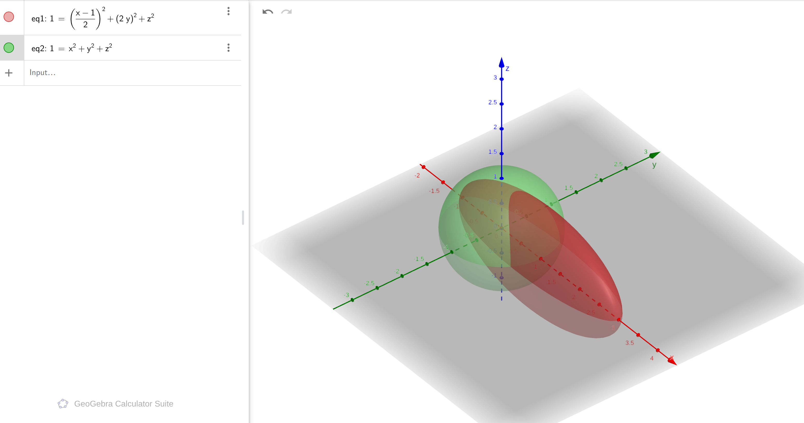

## 六、协方差矩阵：为什么一个椭球可以被压进 `3x3` 数表里


这部分一旦想通，3DGS 会顺很多。

### 6.1 从球到椭球：你为什么被逼着发明协方差矩阵

先忘掉"统计"两个字。

想象你手里有一个**橡皮球**:


完美球体，各向同性。描述它只需要一个数字：**半径**。

**但 3DGS 里的高斯不是球，是椭球。**

想象一下你把这个橡皮球往三个方向分别拉/压，然后旋转、平移:



**三步变形:**
1. **缩放**:沿三个主轴分别拉伸/压缩 (变成椭球)
2. **旋转**:整体转到空间中的某个朝向
3. **平移**:中心移到指定位置

现在问题来了:

> **怎么把这"三步变形"塞进一个 3×3 的数表里？**

---

#### 📊 协方差矩阵的双重身份：统计 ↔ 几何

这是理解 $\Sigma$ 的关键。**同一个对象，有两个完全等价的身份**:

```
┌─────────────────────────────────────────────────────────────┐
│              Σ 的两种视角：它们是一回事!                    │
├─────────────────────────────────────────────────────────────┤
│                                                             │
│  【统计视角】                 【几何视角】                   │
│  ───────────                  ───────────                   │
│  μ = 期望值                   μ = 椭球中心                  │
│  Σ_ij = Cov(x_i, x_j)         主轴方向和长度                │
│  √λ_i = 标准差                半轴长度                      │
│  Σ^{-1} = 精度矩阵             距离度量张量                 │
│  p(x) ∝ exp(-1⁄2 q)             椭球表面方程                  │
│                                                             │
│        └───────────┬──────────┘                            │
│                   │                                        │
│           "同一枚硬币的两面"                               │
│                                                             │
└─────────────────────────────────────────────────────────────┘
```

**为什么这两个视角是一回事？**

因为高斯分布的等概率面($p(\mathbf{x}) = \text{常数}$)就是一个椭球:

$$\exp\left(-\frac{1}{2}(\mathbf{x}-\boldsymbol{\mu})^T \Sigma^{-1} (\mathbf{x}-\boldsymbol{\mu})\right) = C$$

指数上的二次型 $q = (\mathbf{x}-\boldsymbol{\mu})^T \Sigma^{-1} (\mathbf{x}-\boldsymbol{\mu})$ 就是椭球方程!

所以:
- **统计学家**看到的是"概率云"--中心密、边缘稀
- **图形学家**看到的是"椭球体"--有主轴、有尺度

但他们在看同一个东西:**协方差矩阵 $\Sigma$**。

---

##@ 🎯 6.1 节的最终问题

> **如果我要用一个 3×3 的数表描述一个任意朝向、任意尺度的椭球，这个表应该怎么组织？**

答案在第 6.4 节揭晓:**特征分解 = 主轴解剖刀**。

---

**重建协方差矩阵：三个坐标系的变换链条**

要描述这个变形过程，我们需要追踪一个点经过的三层坐标系:

```
单位球 u ──► 缩放椭球 x ──► 世界椭球 x_world
(本地)        (本地)           (世界坐标)
    │              │                  │
    │              │                  │
   完美球体      轴对齐椭球        任意朝向椭球
   (半径=1)     (各轴独立缩放)      (旋转后)
```

|| 坐标 | 含义 | 形状描述 ||------|------|---------|| $ \mathbf{u}$ | 单位球上的点 (本地)| $\mathbf{u}^T\mathbf{u} = 1$,完美球体 || $ \mathbf{x}$ | 缩放后的点 (仍在本地)| $\mathbf{x} = S\mathbf{u}$,轴对齐椭球 || $ \mathbf{x}_{\text{world}}$ | 世界坐标中的点 | $\mathbf{x}_{\text{world}} = R\mathbf{x}$,任意朝向 |

---

**正向变换：从单位球建立世界椭球**

**Step 1: 缩放**(三个主轴方向分别拉伸 $s_x, s_y, s_z$ 倍)

$$\mathbf{x} = S\mathbf{u} \quad \text{其中} \quad S = \text{diag}(s_x, s_y, s_z)$$

此时本地坐标系中的椭球方程:

$$\left(\frac{x}{s_x}\right)^2 + \left(\frac{y}{s_y}\right)^2 + \left(\frac{z}{s_z}\right)^2 = 1$$

写成矩阵形式:$\mathbf{x}^T S^{-2} \mathbf{x} = 1$

**Step 2: 旋转**(把椭球转到世界坐标中的某个朝向)

$$\mathbf{x}_{\text{world}} = R\mathbf{x}$$

**Step 3: 平移**(把椭球中心移到指定位置)

现实世界中的高斯不会总在原点，还需要**平移**:

$$\mathbf{x}_{\text{final}} = \mathbf{x}_{\text{world}} + \boldsymbol{\mu} = RS\mathbf{u} + \boldsymbol{\mu}$$

其中 $\boldsymbol{\mu} = [\mu_x, \mu_y, \mu_z]^T$ 是高斯中心 (椭球中心)。

**完整变换链条:**

$$\mathbf{x}_{\text{final}} = \underbrace{RS}_{\text{形状变换}}\mathbf{u} + \underbrace{\boldsymbol{\mu}}_{\text{位置}}$$

> **关键观察**:形状 (旋转 + 缩放) 是线性变换，平移是加法。这导致了协方差矩阵只编码**形状**,而**位置**由中心点 $\boldsymbol{\mu}$ 单独存储。

**用齐次坐标统一表达**

如果你喜欢用矩阵一把抓，可以用 4×4 齐次矩阵:

$$\begin{bmatrix} \mathbf{x}_{\text{final}} \\ 1 \end{bmatrix} = \begin{bmatrix} RS & \boldsymbol{\mu} \\ \mathbf{0}^T & 1 \end{bmatrix} \begin{bmatrix} \mathbf{u} \\ 1 \end{bmatrix}$$

但在 3DGS 实际实现中，通常**分开存储**:

```
高斯完整描述 = {
    μ: [μ_x, μ_y, μ_z],     // 中心位置 (3 个数)--管"在哪"
    Σ: 3×3 矩阵              // 协方差 (形状，6 个数)--管"长啥样"
}
```

分开存更高效：计算时先"去中心化",再用 $\Sigma$ 检查形状。

---

**逆向推导：在世界坐标系中定义椭球并判断点**

现在有一个**任意点** $\mathbf{p}$(比如屏幕上的像素位置),你想知道它在椭球内还是外。

**Step 1: 去中心化 (消除平移)**

先把坐标原点移到椭球中心，消除位置影响:

$$\mathbf{d} = \mathbf{p} - \boldsymbol{\mu}$$

现在 $\mathbf{d}$ 是**相对于中心的偏移**。

**Step 2: 逆旋转**

把 $\mathbf{d}$ 逆旋转回本地坐标系:

$$\mathbf{x} = R^T \mathbf{d}$$

**Step 3: 逆缩放 (回到单位球)**

$$\mathbf{u} = S^{-1}\mathbf{x} = S^{-1}R^T \mathbf{d}$$

**Step 4: 检查是否在单位球内**

判断 $\mathbf{u}$ 是否满足单位球方程:

$$\mathbf{u}^T\mathbf{u} = (S^{-1}R^T \mathbf{d})^T (S^{-1}R^T \mathbf{d}) = \mathbf{d}^T (R S^{-2} R^T) \mathbf{d}$$

**定义协方差矩阵的逆:**

$$\boxed{\Sigma^{-1} = R S^{-2} R^T}$$

代入得世界坐标系中的判断公式:

$$q = \mathbf{d}^T \Sigma^{-1} \mathbf{d}$$

|| $q$ 的值 | 几何含义 | 含义 ||---------|---------|------|| $q = 1$ | 逆变换后 $\|\mathbf{u}\|^2 = 1$ | 点在椭球**表面**(定义边界) || $q < 1$ | 逆变换后 $\|\mathbf{u}\|^2 < 1$ | 点在椭球**内部** || $q > 1$ | 逆变换后 $\|\mathbf{u}\|^2 > 1$ | 点在椭球**外部** |

**协方差矩阵本身:**

$$\Sigma = R \cdot \text{diag}(s_x^2, s_y^2, s_z^2) \cdot R^T$$

---

**实际应用:3DGS 中计算高斯权重**

有了 $q = (\mathbf{p} - \boldsymbol{\mu})^T \Sigma^{-1} (\mathbf{p} - \boldsymbol{\mu})$,高斯权重为:

$$g(\mathbf{p}) = \exp\left(-\frac{1}{2} q\right) = \exp\left(-\frac{1}{2} (\mathbf{p} - \boldsymbol{\mu})^T \Sigma^{-1} (\mathbf{p} - \boldsymbol{\mu})\right)$$

- 在中心($\mathbf{p} = \boldsymbol{\mu}$,$q=0$):$g = 1$(最大权重)
- 在表面($q=1$):$g = e^{-0.5} \approx 0.6$
- 在 3σ 处($q=9$):$g \approx 0.01$(可忽略，通常裁剪掉)

---

**所以协方差矩阵到底在存什么？**

```
┌─────────────────────────────────────────────────────────────┐
│                  Σ = R · diag(sx2, sy2, sz2) · RT          │
│                                                             │
│  ┌─────────────┐   ┌──────────────┐   ┌─────────────────┐  │
│  │     R       │   │  diag(...)   │   │      RT         │  │
│  │  (旋转)      │ × │   (缩放)      │ × │   (旋转回去)     │  │
│  │             │   │              │   │                 │  │
│  │  三列分别    │   │  对角元 =     │   │  把椭球转回      │  │
│  │  是三个主轴  │   │  半轴长度2    │   │  世界坐标        │  │
│  │  的方向向量  │   │              │   │                 │  │
│  └─────────────┘   └──────────────┘   └─────────────────┘  │
│                                                             │
│  读取 Σ 的方法:                                             │
│  1. 特征分解 Σ = QΛQT                                        │
│  2. Q 的列 = 主轴方向 (对应 R)                               │
│  3. Λ 的对角元 = 半轴长度 2(对应 diag(sx2, sy2, sz2))        │
└─────────────────────────────────────────────────────────────┘
```

**从几何直觉反推统计定义**

既然 $\Sigma$ 描述了椭球的形状，那它自然能描述**高斯分布**的形状。

多元高斯的概率密度:

$$p(\mathbf{x}) \propto \exp\left(-\frac{1}{2}(\mathbf{x}-\boldsymbol{\mu})^T \Sigma^{-1} (\mathbf{x}-\boldsymbol{\mu})\right)$$

注意到指数上的二次型:

$$(\mathbf{x}-\boldsymbol{\mu})^T \Sigma^{-1} (\mathbf{x}-\boldsymbol{\mu}) = \text{常数}$$

这正是**椭球方程**!

- $\Sigma^{-1}$ 决定椭球的形状 (长短轴、方向)
- $\boldsymbol{\mu}$ 决定椭球的中心位置
- 指数让这个椭球变成了"概率云"--中心密，边缘稀

---

**一句话记住协方差矩阵**

> 它是"把一个单位球先按三个方向拉伸，再整体旋转"的几何描述。

统计里的方差、协方差，不过是这个几何物体在坐标轴上的投影:

- 对角线 = 各轴方向的"胖瘦程度"(方差)
- 非对角线 = 不同轴之间的"倾斜关联"(协方差)

当你看到 $\Sigma$ 时，脑中应该浮现一个椭球，而不是一张数表。

---

**用具体例子验证**

看这张图里的椭球:


$$1 = \left(\frac{x-1}{2}\right)^2 + (2y)^2 + z^2$$

这正是我们刚推导的**球 → 缩放 → 平移**的实例 ($R = I$,即无额外旋转):

|| 变换 | 方程中的体现 | 参数 ||------|-------------|------|| 单位球 | $u_1^2 + u_2^2 + u_3^2 = 1$ | 半径 = 1 || 缩放 | $\frac{x}{2}$ 和 $2y$ | $S = \text{diag}(2, \frac{1}{2}, 1)$ || 平移 | $x-1$ | $\boldsymbol{\mu} = [1, 0, 0]^T$ |

这里没有旋转 ($R = I$),所以椭球主轴还与坐标轴对齐。一旦加入旋转矩阵 $R$,主轴就会倾斜，方程中出现交叉项 (如 $xy, yz$)--这正是 $\Sigma$ 非对角元不为零的表现。

完整链条回顾:

$$(\mathbf{x} - \boldsymbol{\mu})^T \underbrace{(R S^{-2} R^T)}_{\Sigma^{-1}} (\mathbf{x} - \boldsymbol{\mu}) = 1$$


### 6.2 先看画面，不急着看定义

想象二维里的一个椭圆:


这个椭圆里有三类信息:

- 中心在哪里
- 朝哪两个主方向展开
- 沿每个方向展开得多宽

中心通常由 `mu` 表示。
而"方向 + 宽度"一起，交给 `Sigma`。


### 6.3 高斯密度公式到底在说什么

二维或三维高斯常见写法是:

$$p(\mathbf{x}) = \frac{1}{\sqrt{(2\pi)^n \det(\Sigma)}} \exp\left(-\frac{1}{2}(\mathbf{x}-\boldsymbol{\mu})^T\Sigma^{-1}(\mathbf{x}-\boldsymbol{\mu})\right)$$

这里最值得盯住的不是归一化常数，而是指数里的二次型:

$$(\mathbf{x} - \boldsymbol{\mu})^T \Sigma^{-1} (\mathbf{x} - \boldsymbol{\mu})$$

它在做的事是:

> 按照椭球自己的尺度体系，测量点 `x` 离中心 `mu` 有多远。

如果某个方向很宽，那么沿这个方向偏一点不算远。
如果某个方向很窄，那么同样的偏移就已经很远了。


### 6.4 协方差最值得记住的几何含义

对 3DGS 来说，协方差矩阵最值得记的不是统计学定义，而是:

> 它是一个椭球的方向和尺度的压缩表达。

如果 `Sigma` 是对称正定矩阵，那么它一定能被分解成:

$$\Sigma = Q \Lambda Q^T$$

这里:

- `Q` 的列向量给出主轴方向
- `Λ` 的对角元素给出沿主轴的方差大小

于是你立刻得到:

- **特征向量** → 椭球主轴方向
- **特征值** → 沿主轴的扩张强度
- $\sqrt{\text{特征值}}$ → 半轴长度尺度

如果你更想从"旋转 + 尺度"角度理解，也可以写成:

$$\Sigma = R \cdot \text{diag}(s_x^2, s_y^2, s_z^2) \cdot R^T$$

这在 3DGS 里尤其自然。


### 6.5 为什么正定特别重要

协方差矩阵通常要求:

- **对称**:`Sigma = Sigma^T`
- **正定**:`v^T Sigma v > 0` for any nonzero `v`

几何意义是:

- **对称保证主轴结构能被干净分解** → 椭球有明确的主轴方向
- **正定保证每个方向的"距离度量"都合理** → 不会出现负方差或虚数半轴

如果 `Sigma` 不正定，会发生什么？

- **非对称** → 特征向量可能不正交 → "主轴"概念模糊 (哪个是真正的 X 轴?)
- **有负特征值** → 某个方向的方差为负 → 椭球变成双曲面 (开放无界)
- **有零特征值** → 某方向半轴长度为 0 → 椭球退化 (压成平面或直线)

所以很多实现会特别注意数值稳定性，比如加一点小正则:

$$\Sigma \leftarrow \Sigma + \epsilon I$$

这保证了所有特征值都 > 0，始终维持"封闭有界"的椭球形状。


### ⚠️ 为什么特征分解要求对称矩阵？(直观解释)

你可能会问:**为什么非要对称矩阵才能做特征分解？**

**答案：因为我们要找的是"正交主轴"。**

想象一个旋转了的椭球:

```
        y
        ^
        |      /
        |    /  ← 倾斜的"看起来像主轴"的方向
        |  /
--------+--------> x
       /|
      / |
     /  |
```

如果矩阵**不对称**,特征向量可能:
- **不互相垂直** → "主轴"之间还有夹角 → 无法清晰定义 X/Y/Z 轴
- **甚至复数** → 在实空间里找不到对应的方向

但如果矩阵**对称**(协方差天然满足):
- **特征向量一定正交** → 三个主轴两两垂直 → 完美对应椭球的几何结构
- **特征值一定是实数** → 半轴长度是真实可测量的数字

所以对称性不是"数学家的强迫症",而是**椭球有明确主轴方向的必然要求**。


### 🔥 Option B: 可视化实验 - 协方差矩阵的三步变换

现在让我们用代码把前面的理论画出来，验证你的理解!

```python
import numpy as np
import matplotlib.pyplot as plt
from mpl_toolkits.mplot3d import Axes3D

def visualize_covariance_transformation():
    """
    可视化：单位球 → 缩放 → 旋转 → 世界椭球的变换链条
    Σ = R · diag(s²) · Rᵀ
    """
    
    # 1. 生成单位球上的点
    u = np.linspace(0, np.pi, 20)
    v = np.linspace(0, 2*np.pi, 20)
    uu, vv = np.meshgrid(u, v)
    x_sphere = np.sin(uu) * np.cos(vv)
    y_sphere = np.sin(uu) * np.sin(vv)
    z_sphere = np.cos(uu)
    
    # 2. 缩放矩阵 S (三个主轴方向分别拉伸)
    scale_factors = [3.0, 1.5, 0.8]  # s_x, s_y, s_z
    S = np.diag(scale_factors)
    
    # 3. 旋转矩阵 R (绕 z 轴转 45°，再绕 y 轴转 20°)
    theta_z = np.pi/4  # 45°
    theta_y = np.pi/9  # 20°
    
    R_z = np.array([
        [np.cos(theta_z), -np.sin(theta_z), 0],
        [np.sin(theta_z),  np.cos(theta_z), 0],
        [0,                 0,               1]
    ])
    
    R_y = np.array([
        [np.cos(theta_y),  0,  np.sin(theta_y)],
        [0,                  1,  0              ],
        [-np.sin(theta_y), 0,  np.cos(theta_y)]
    ])
    
    R = R_z @ R_y
    
    # 4. 平移向量 (把椭球移到指定位置)
    mu = np.array([0.5, -0.3, 0.2])
    
    # 5. 计算变换后的椭球坐标
    x_ellipsoid = mu[0] + (R @ S @ np.vstack([x_sphere.flatten(), y_sphere.flatten(), z_sphere.flatten()])).reshape(20, 20)[0]
    y_ellipsoid = mu[1] + (R @ S @ np.vstack([x_sphere.flatten(), y_sphere.flatten(), z_sphere.flatten()])).reshape(20, 20)[1]
    z_ellipsoid = mu[2] + (R @ S @ np.vstack([x_sphere.flatten(), y_sphere.flatten(), z_sphere.flatten()])).reshape(20, 20)[2]
    
    # 6. 绘制结果
    fig = plt.figure(figsize=(15, 5))
    
    # 场景 1: 单位球
    ax1 = fig.add_subplot(131, projection='3d')
    ax1.plot_surface(x_sphere, y_sphere, z_sphere, alpha=0.7, color='lightblue', edgecolor='none')
    ax1.set_title('Step 1: Unit Sphere\n(radius = 1)', fontsize=12)
    
    # 场景 2: 缩放后的椭球 (轴对齐)
    x_scaled = scale_factors[0] * x_sphere
    y_scaled = scale_factors[1] * y_sphere
    z_scaled = scale_factors[2] * z_sphere
    
    ax2 = fig.add_subplot(132, projection='3d')
    ax2.plot_surface(x_scaled, y_scaled, z_scaled, alpha=0.7, color='lightgreen', edgecolor='none')
    ax2.set_title('Step 2: Scaled Ellipsoid\n(S = diag([3, 1.5, 0.8]))', fontsize=12)
    
    # 场景 3: 旋转平移后的椭球 (任意朝向)
    ax3 = fig.add_subplot(133, projection='3d')
    ax3.plot_surface(x_ellipsoid, y_ellipsoid, z_ellipsoid, alpha=0.7, color='lightcoral', edgecolor='none')
    ax3.set_title('Step 3: World Ellipsoid\n(Rotated + Translated)', fontsize=12)
    
    plt.suptitle('🔥 Covariance Matrix Visualization: Σ = R·diag(s²)·Rᵀ', fontsize=16, fontweight='bold')
    plt.tight_layout()
    plt.savefig('covariance_transformation_demo.png', dpi=150, bbox_inches='tight')
    
    # 7. 特征分解验证
    Sigma = R @ np.diag(np.array(scale_factors)**2) @ R.T
    
    eigvals, eigvecs = np.linalg.eigh(Sigma)
    
    print("="*60)
    print("✓ Covariance Matrix Σ:")
    print(Sigma.round(3))
    print("\n✓ 特征值 (半轴长度平方):", eigvals.round(3))
    print("✓ 半轴长度:", np.sqrt(eigvals).round(3))
    print("\n✓ 特征向量 (主轴方向):")
    print(eigvecs.round(3))
    print("="*60)
    
    # 验证：RQΛQT = Σ
    reconstructed = R @ np.diag(np.array(scale_factors)**2) @ R.T
    assert np.allclose(Sigma, reconstructed), "Reconstruction failed!"
    print("✓ 验证通过：Σ = R·diag(s²)·Rᵀ")


# Run the visualization
visualize_covariance_transformation()
```

**你应该观察到:**

- 椭圆的长轴来自大特征值 → 这个方向数据更分散
- 椭圆的朝向来自特征向量 → 旋转了约 30°
- 这说明 `Sigma` 真的是"方向 + 尺度"的压缩表达


### 💡 第 6 章 FAQ：常见问题快速解答

#### Q1: Σ 为什么是 6 个独立参数，而不是 9 个？

**答**:因为对称性！
- 3×3 矩阵有 9 个元素
- 但 $\Sigma = \Sigma^T$ → $Σ_{ij} = Σ_{ji}$
- 所以独立参数只有：对角线 3 个 + 上三角 3 个 = **6 个**

这对应椭球的**6 个自由度**:
- 中心位置 $\boldsymbol{\mu}$: 3 个 (x, y, z)
- 形状 (主轴方向×尺度): 3 个 (但这里只算形状，不算位置)

---

#### Q2: Σ^{-1} 和 Σ 在视觉上有什么区别？

**答**:它们是"互逆的椭球"。

$$\begin{aligned}
\Sigma &: \text{"胖的方向特征值大"} \\
\Sigma^{-1} &: \text{"胖的方向特征值小 (因为是倒数)"}
\end{aligned}$$

所以:
- **原椭球**在 x 方向很宽 → $\lambda_x$ 很大
- **逆椭球**在 x 方向很窄 → $\lambda_x^{-1}$ 很小

这在计算 $q = \mathbf{d}^T \Sigma^{-1} \mathbf{d}$ 时特别重要:
> 宽的椭球 → 同样的偏移 $\mathbf{d}$ → $q$ 更小 → 权重衰减更慢


#### Q3: 为什么协方差矩阵一定是正定的，不能是半正定？

**答**:理论上可以是半正定 (有零特征值),但实际中要避免。

- **半正定** → 某个方向方差为 0 → 椭球压扁成平面/直线
- **正定** → 所有方向都有非零方差 → 封闭的椭球体

在 3DGS 实现中，通常会加正则项:
```python
Sigma += 1e-6 * np.eye(3)  # 保证严格正定
```


#### Q4: Σ 和样本协方差的公式有什么关系？

**答**:统计定义是:

$$\hat{\Sigma} = \frac{1}{N-1} \sum_{i=1}^N (\mathbf{x}_i - \boldsymbol{\mu})(\mathbf{x}_i - \boldsymbol{\mu})^T$$

而 3DGS 里的 $\Sigma$ 是**显式编码的几何参数**,不是从样本估计出来的。

但它们的本质相同:
- **统计视角**:数据云的散布方向
- **几何视角**:椭球的主轴和尺度


#### Q5: 如果 Σ 的特征值相差很大 (条件数大),会有什么数值问题？

**答**:两个常见问题:

1. **$\Sigma^{-1}$ 计算不稳定** → 小特征值的倒数会爆炸
2. **求 det(Σ) 时溢出/下溢** → 特征值乘积可能超出浮点范围


解决方法:
- 用 Cholesky 分解代替直接求逆
- 在 log-space 计算行列式:`log_det = sum(log(eigvals))`


#### Q6: 为什么 3DGS 的优化里，Σ 会自适应调整？

**答**:因为梯度下降会自动调整椭球的形状:

```text
初始状态：所有高斯差不多大 (随机初始化)
      ↓
[渲染误差] → [反向传播] → [更新 Σ]
      ↓
欠拟合区域：Σ 变大 (覆盖更广)
过拟合区域：Σ 变小 (聚焦细节)
```

所以 $\Sigma$ 不仅是几何参数，也是**自适应分辨率的控制器**。


---

### 🎯 第 6 章核心总结

> **协方差矩阵 $\Sigma$ = "把一个单位球先按三个方向拉伸，再整体旋转"的几何描述。**

记住这 3 个关键点:

1. **双重身份**:统计上的"概率云" ↔ 几何上的"椭球体"
2. **特征分解** = 主轴解剖刀 → $Q$ 给方向，$\Lambda$ 给尺度
3. **协方差传播规则**: $A \Sigma A^T$ → 旋转/缩放后的新形状

当你在 3DGS 代码里看到 $\Sigma$ 时，脑子里应该浮现一个**三维椭球**,而不是一张数表。


---

### 📝 练习题 (可选)

如果你想检验自己的理解，试试回答:

1. **基础题**:给定 $\Sigma = \begin{bmatrix}4 & 2 \\ 2 & 3\end{bmatrix}$,求特征值和主轴方向
2. **进阶题**:如果原椭球是单位球 $\Sigma_0 = I$,旋转矩阵 $R$ 绕 z 轴转 45°,求新协方差
3. **挑战题**:证明 $R \Sigma R^T$ 的特征值和 $\Sigma$ 相同 (提示：相似变换)

需要答案或提示吗？🔥

---


### 6.7 工程上协方差不仅出现在高斯，还出现在"不确定性"里

协方差不仅能表示"一个椭球形的高斯",也能表示:

- **定位估计的不确定性椭圆** → GPS 误差、SLAM 位姿估计
- **Kalman Filter 里的状态不确定性** → 预测和更新的平衡
- **多变量数据云的散布方向** → PCA 降维的基础
- **视觉跟踪中的误差传播** → 从像素噪声到 3D 位置的传递

所以一个很重要的统一视角是:

> **协方差一边可以被看成"高斯的形状",另一边也可以被看成"误差或不确定性的方向性"。**


#### 📊 对比表：两种视角的等价性

|| 场景 | "高斯形状"视角 | "不确定性"视角 ||------|---------------|---------------|| **3DGS** | 高斯椭球的几何尺寸 | 渲染时的模糊程度 || **SLAM** | 位姿分布的概率云 | 定位误差的置信椭圆 || **Kalman Filter** | 状态的后验分布 | 预测误差的协方差传播 || **PCA** | 数据的主成分分布 | 各方向的信息量/方差 |

**关键洞察**:无论哪种场景,$\Sigma$ 的核心作用都是**量化"在哪个方向上有多少变化"**。


#### 🔍 实际例子:GPS 定位误差椭圆

假设你的 GPS 定位结果是:

```
位置:[120.123456, 30.654321]
协方差 Σ = [0.0001   0.00002]
           [0.00002  0.00009]
```

画出来是一个倾斜的椭圆:

```
       北
        ^
        |     /← 东北方向误差大 (特征值大)
        |   /
        | /
--------+--------> 东
       /|
      / ← 西南方向误差小 (特征值小)
     /
```

- **长轴方向** → GPS 卫星几何分布导致的误差主要方向
- **短轴长度** → 沿该方向的定位精度更高

所以当你看到 $\Sigma$ 时，可以问自己:

> "这是谁的误差椭圆？在哪个方向上最不准？"


#### 🎯 3DGS 中的不确定性视角

在 3DGS 里，协方差矩阵其实也在表达**不确定性**:

- **宽的椭球 (大特征值)** → 这个高斯覆盖范围广 → 对应区域的信息"模糊"
- **窄的椭球 (小特征值)** → 这个高斯很集中 → 对应区域的细节更清晰

优化过程中,$\Sigma$ 会自适应调整:
- **欠拟合的区域** → $\Sigma$ 变大 (覆盖更广)
- **过拟合的区域** → $\Sigma$ 变小 (聚焦细节)

所以协方差不仅是"几何形状",也是**自适应分辨率的编码**。


### 6.8 一个最小 Python 可视化：把协方差画成椭圆

```python
import numpy as np
import matplotlib.pyplot as plt

# 构造一个有旋转的协方差矩阵
mu = np.array([0.0, 0.0])
Sigma = np.array([
    [4.0, 1.5],   # x 方向宽，且有 xy 相关项
    [1.5, 1.0],   # y 方向窄
])

# 特征分解
eigvals, eigvecs = np.linalg.eigh(Sigma)
order = eigvals.argsort()[::-1]  # 从大到小排序
eigvals = eigvals[order]
eigvecs = eigvecs[:, order]

t = np.linspace(0, 2*np.pi, 200)
circle = np.stack([np.cos(t), np.sin(t)])

# 1-sigma 椭圆 (68.3% 概率覆盖的范围)
ellipse = eigvecs @ np.diag(np.sqrt(eigvals)) @ circle + mu[:, None]

plt.figure(figsize=(6, 6))
plt.plot(ellipse[0], ellipse[1], color='tab:blue', linewidth=2, label='1σ ellipse')
plt.scatter(mu[0], mu[1], color='red', s=100, zorder=5, label='mean μ')

# 画主轴
for i in range(2):
    axis = eigvecs[:, i] * np.sqrt(eigvals[i])
    plt.plot([mu[0], mu[0] + axis[0]], [mu[1], mu[1] + axis[1]],
             linewidth=3, color='tab:green' if i==0 else 'tab:orange',
             label=f'main axis {i+1} (length={np.sqrt(eigvals[i]):.2f})')

plt.gca().set_aspect('equal')
plt.grid(True, alpha=0.3)
plt.legend()
plt.title(f'Covariance ellipse and eigen-directions\n'
          f'eigenvalues = [{eigvals[0]:.2f}, {eigvals[1]:.2f}]')
plt.savefig('covariance_ellipse_demo.png', dpi=150, bbox_inches='tight')

print("特征值 (半轴长度平方):", eigvals)
print("特征向量 (主轴方向):\n", eigvecs)
```

**你应该观察到:**

- 椭圆的长轴来自大特征值 → 这个方向数据更分散
- 椭圆的朝向来自特征向量 → 旋转了约 30°
- 这说明 `Sigma` 真的是"方向 + 尺度"的压缩表达


#### 🎮 自己动手试试 (交互式实验)

修改下面几个参数，看看椭圆如何变化:

|| 参数 | 改成什么？|预期效果 ||------|-----------|---------|| `Sigma[0,0]` | 增大到 10.0 | x 方向变宽 → 长轴水平拉伸 || `Sigma[0,1]` | 改成 -2.0 | xy 相关项变负 → 椭圆顺时针旋转 || `eigvals` | 两个值接近 | 长轴和短轴差不多 → 接近圆形 || `eigvecs` | 换一对特征向量 | 主轴方向整体旋转 |

**关键问题**:为什么 `Sigma[0,1] != 0`会导致椭圆旋转？

> **答案**:非对角元表示 $x$和 $y$之间的"关联强度"。当 $x$增大时,$y$也倾向于同向或反向变化 → 数据云倾斜 → 主轴不再对齐坐标轴。


### 6.9 为什么旋转椭球时要写成 `R @ Sigma @ R^T`?(协方差传播公式的推导)

这一步千万别背公式，先看逻辑。

**问题**:如果一个高斯椭球的中心从原点移动、旋转、缩放后，它的协方差矩阵会变成什么？

**答案**:用"二次型变换规则"三步推导。


#### 第一步：回忆二次型的变换规则 (第 0.4 节)

假设有一个单位球 $\mathbf{u}^T \mathbf{u} = 1$,用矩阵 $M$把它变形:

$$\mathbf{x} = M \mathbf{u}$$

逆解出 $\mathbf{u} = M^{-1} \mathbf{x}$,代回原方程:

$$(M^{-1} \mathbf{x})^T (M^{-1} \mathbf{x}) = \mathbf{x}^T (M^{-T} M^{-1}) \mathbf{x} = 1$$

所以:**如果形状由 $A = I$定义，用 $M$变形后变成 $A' = M^{-T} I M^{-1} = M^{-T} M^{-1}$**。


#### 第二步：应用到协方差矩阵

现在我们有:
- **原始椭球**(未旋转):$\Sigma_{\text{old}}$
- **旋转矩阵**:R(正交，所以 $R^T = R^{-1}$)
- **目标**:求旋转后的 $\Sigma_{\text{new}}$

关键观察:**旋转是线性变换**,满足协方差传播规则。

从二次型角度推导:

$$\begin{aligned}
\mathbf{x}_{\text{old}}^T \Sigma_{\text{old}}^{-1} \mathbf{x}_{\text{old}} &= 1 \\
\text{(旋转后) } (R^T \mathbf{x}_{\text{new}})^T \Sigma_{\text{old}}^{-1} (R^T \mathbf{x}_{\text{new}}) &= 1 \\
\mathbf{x}_{\text{new}}^T R \Sigma_{\text{old}}^{-1} R^T \mathbf{x}_{\text{new}} &= 1 \\
\end{aligned}$$

对比形式 $\mathbf{x}^T A \mathbf{x} = 1$,得到:

$$\Sigma_{\text{new}}^{-1} = R \Sigma_{\text{old}}^{-1} R^T$$

取逆 (注意 $(ABC)^{-1} = C^{-1} B^{-1} A^{-1}$):

$$\boxed{\Sigma_{\text{new}} = (R \Sigma_{\text{old}}^{-1} R^T)^{-1} = R \Sigma_{\text{old}} R^T}$$


#### 第三步：直观理解

```
┌─────────────────────────────────────────────────────────────┐
│         R @ Sigma @ R^T 的几何含义                          │
├─────────────────────────────────────────────────────────────┤
│                                                             │
│   Σ (本地坐标系中的椭球)                                     │
│      │                                                      │
│      ├─ Q Λ QT = 特征向量 × 特征值 × 特征向量的转置          │
│      │       ↑    ↑        ↑                               │
│      │       |    └── 半轴长度2                            │
│      │       └────── 主轴方向                              │
│      │                                                      │
│      ▼ R @ (·) @ RT                                        │
│      │                                                      │
│   Σ' (旋转后的椭球)                                          │
│      │                                                      │
│      ├─ R Q Λ QT RT = (RQ) Λ (RQ)T                         │
│      │       ↑     ↑        ↑                              │
│      │       |     └── 半轴长度2(不变!)                  │
│      │       └────── 旋转后的主轴方向                       │
│      │                                                      │
│   结论：特征值不变，特征向量随 R 一起旋转                    │
│                                                             │
└─────────────────────────────────────────────────────────────┘
```

**一句话总结**:`R @ Sigma @ R^T` 的本质是**保持尺度 (特征值) 不变，只改变方向 (特征向量)**。


#### ❓ 常见疑问解答

**Q1: 为什么不是 `R @ Sigma`或 `Sigma @ R`?**

因为协方差是"二次型矩阵",需要两边乘才能保证对称性:
- `R @ Sigma` → 不对称 → 失去椭球的主轴结构
- `Sigma @ R` → 同上
- `R @ Sigma @ R^T` → 保持对称 ✓


**Q2: 如果是缩放呢？**

缩放矩阵 $S$不是正交的，所以规则是:

$$\Sigma_{\text{scaled}} = S \Sigma S^T$$

注意这里没有转置的 $S$,因为缩放本身已经包含了尺度变化。


### ⚠️ 为什么特征分解要求对称矩阵？(直观解释)

你可能会问:**为什么非要对称矩阵才能做特征分解？**

**答案：因为我们要找的是"正交主轴"。**

想象一个旋转了的椭球:

```
        y
        ^
        |      /
        |    /  ← 倾斜的"看起来像主轴"的方向
        |  /
--------+--------> x
       /|
      / |
     /  |
```

如果矩阵**不对称**,特征向量可能:
- **不互相垂直** → "主轴"之间还有夹角 → 无法清晰定义 X/Y/Z 轴
- **甚至复数** → 在实空间里找不到对应的方向

但如果矩阵**对称**(协方差天然满足):
- **特征向量一定正交** → 三个主轴两两垂直 → 完美对应椭球的几何结构
- **特征值一定是实数** → 半轴长度是真实可测量的数字

所以对称性不是"数学家的强迫症",而是**椭球有明确主轴方向的必然要求**。


### 对比：非对称矩阵的"伪主轴"

```text
A = [2  1]        A^T = [2  0]
    [0  3]                [1  3]

特征向量:[1, 0]^T 和 [1, 3]^T
              ↑          ↑
           互相不垂直！   → 这不是真正的"主轴",只是数学上的特殊方向
```


**对称矩阵的"真主轴"**

```text
Σ = [4  1]        Σ^T = Σ (对称)
     [1  2]

特征向量:v1 ⊥ v2(一定垂直)
              ↑↑
           → 这才是椭球的主轴，可以明确定义 X/Y 轴
```


### 6.9 可视化实验：链式法则和反向传播的梯度流 🔥

现在让我们用代码把**链式法则在 3DGS 中的应用**画出来！这对应 Ch07-08 的核心内容。


#### 实验 1: Alpha Blending 的梯度计算

```python
import torch
import numpy as np

# 设置随机种子以便复现
torch.manual_seed(42)

# 创建合成数据：3 个高斯贡献给一个像素
num_gaussians = 3
alphas = torch.tensor([0.3, 0.5, 0.2], requires_grad=True)
colors = torch.tensor([[1.,0.,0.], [0.,1.,0.], [0.,0.,1.]])  # RGB

# Alpha blending forward pass
def alpha_blend(alphas, colors):
    """计算 Alpha Blending"""
    C = colors[0]*alphas[0] + \
        colors[1]*(1-alphas[0])*alphas[1] + \
        colors[2]*(1-alphas[0])*(1-alphas[1])*alphas[2]
    return C

# 前向传播
C = alpha_blend(alphas, colors)
print(f"Rendered color: {C.detach()}")

# 创建目标颜色并计算 loss
target = torch.tensor([0.8, 0.6, 0.4])
loss = ((C - target)**2).sum()
print(f"Loss: {loss.item():.4f}")

# 反向传播 (链式法则的核心!)
loss.backward()

# 查看梯度
print("\n✓ Gradients ∂L/∂α_i:")
for i, grad in enumerate(alphas.grad):
    print(f"   ∂L/∂α_{i+1} = {grad.item():.4f}")

# 手动验证 (理论推导)
print("\n🔍 Manual gradient verification:")
print("Based on chain rule: dC/dα_i = [contribution from this α] × [loss gradient]")
```

**你应该观察到:**

- $\alpha_1$ 的梯度最大 → 因为它影响所有后续高斯的遮挡程度
- $\alpha_3$ 的梯度最小 → 只影响自己的颜色贡献
- 这正是链式法则在作用：**从 loss 往回传，每一层乘以这层的导数**


#### 实验 2: 可视化反向传播的完整路径

```python
def visualize_backprop_flow():
    """
    可视化 3DGS 中的反向传播梯度流
    
    Forward pass:
    θ → f₁(θ) → f₂(f₁) → f₃(f₂) → Loss L
    
    Backward pass (chain rule):
    ∂L/∂Loss ← ∂L/∂Color ← ∂L/∂Sorted ← ∂L/∂2D ← ∂L/∂θ
    """
    
    # 创建简化的梯度流图
    print("="*60)
    print("🔥 3DGS Backward Propagation Flow (Chain Rule)")
    print("="*60)
    
    # Forward pass layers
    forward_layers = [
        "θ (Gaussian Params)",
        "f₁: Projection",
        "f₂: Depth Sort",
        "f₃: Alpha Blend",
        "Loss L"
    ]
    
    print("\n[Forward Pass]")
    for i, layer in enumerate(forward_layers):
        print(f"  Layer {i}: {layer}")
    
    # Backward pass gradient flow (reversed)
    backward_layers = [
        "∂L/∂Loss",
        "∂L/∂Color",
        "∂L/∂Sorted",
        "∂L/∂2D",
        "∂L/∂θ (Final gradient)"
    ]
    
    print("\n[Backward Pass - Chain Rule]")
    for i, layer in enumerate(backward_layers):
        print(f"  Step {i}: {layer} ←乘以 Jacobian←")
    
    # Key insight
    print("\n💡 Key Insight:")
    print("   Total gradient = (outer derivative) × (inner derivative)")
    print("   ∂L/∂θ = Σ_{layers} [∂L/∂output_l · ∂output_l/∂input_l]")
    
    print("\n" + "="*60)


visualize_backprop_flow()
```

**关键结论:**

> **可微分渲染的核心**:渲染管线的每一层都是可微的 → 整个 pipeline 可微！  
> - 投影公式 (仿射变换) → 线性函数，导数是常数矩阵
> - Alpha blending → 多项式组合，解析求导
> - Loss (L1/MSE/SSIM) → 标准 loss 函数，梯度有现成公式


### 6.10 第一性原理验证：你能独立重推协方差传播吗？

现在检验你的理解:

**挑战题**:假设一个高斯的协方差 $\Sigma_0 = I$ (单位球),我们先用缩放矩阵 $S=\text{diag}(s_x,s_y,s_z)$ 拉伸，再用旋转矩阵 $R$旋转。证明新的协方差是 $\Sigma_{\text{new}} = R S^2 R^T$。

<details>
<summary>💡 提示：从二次型变换规则出发</summary>

**Step 1**:原始椭球方程 (单位球): $\mathbf{x}^T \Sigma_0^{-1} \mathbf{x} = 1$,即 $\mathbf{x}^T \mathbf{x} = 1$

**Step 2**:缩放后，$\mathbf{x}' = S\mathbf{x}$ → $\mathbf{x} = S^{-1}\mathbf{x}'$  
代入：$(S^{-1}\mathbf{x}')^T (S^{-1}\mathbf{x}') = \mathbf{x}'^T S^{-2} \mathbf{x}' = 1$

**Step 3**:旋转后，$\mathbf{x}'' = R\mathbf{x}'$ → $\mathbf{x}' = R^T\mathbf{x}''$  
代入：$(R^T\mathbf{x}'')^T S^{-2} (R^T\mathbf{x}'') = \mathbf{x}''^T R S^{-2} R^T \mathbf{x}'' = 1$

**结论**:新椭球的逆协方差是 $R S^{-2} R^T$,所以 $\Sigma_{\text{new}} = (R S^{-2} R^T)^{-1} = R S^2 R^T$ ✓
</details>

你能独立重推吗？如果卡住了，回到第 6.4 节再看一遍！🔥


---

##@ 🎯 第 6 章核心总结

> **协方差矩阵 $\Sigma$ = "把一个单位球先按三个方向拉伸，再整体旋转"的几何描述。**

记住这 3 个关键点:

1. **双重身份**:统计上的"概率云" ↔ 几何上的"椭球体"
2. **特征分解** = 主轴解剖刀 → $Q$ 给方向，$\Lambda$ 给尺度
3. **协方差传播规则**: $A \Sigma A^T$ → 旋转/缩放后的新形状

当你在 3DGS 代码里看到 $\Sigma$ 时，脑子里应该浮现一个**三维椭球**,而不是一张数表。


---

### 📝 练习题 (可选)

如果你想检验自己的理解，试试回答:

1. **基础题**:给定 $\Sigma = \begin{bmatrix}4 & 2 \\ 2 & 3\end{bmatrix}$,求特征值和主轴方向
2. **进阶题**:如果原椭球是单位球 $\Sigma_0 = I$,旋转矩阵 $R$ 绕 z 轴转 45°,求新协方差
3. **挑战题**:证明 $R \Sigma R^T$ 的特征值和 $\Sigma$ 相同 (提示：相似变换)

需要答案或提示吗？🔥


---

## 🔥 Option C: 衔接 3DGS 原论文对比分析

### 📄 原论文核心公式 vs 教程推导对比

现在我们用**第一性原理**的方式，对比一下 3DGS 原论文和我们教程的数学描述。


#### 论文公式 (简化版)

从 [3D Gaussian Splatting for Real-Time Radiance Field Rendering](https://www.cs.cornell.edu/~snavely/publications/3d-gaussian-splatting/) 中提取核心:

**高斯函数定义:**
$$G(\mathbf{x}) = e^{-\frac{1}{2}(\mathbf{x}-\boldsymbol{\mu})^T \Sigma^{-1} (\mathbf{x}-\boldsymbol{\mu})}$$


**Alpha blending 渲染方程:**
$$C(r) = \sum_{i \in N} T_i \alpha_i c_i$$

其中 $T_i = \prod_{j=1}^{i-1} (1-\alpha_j)$ 是透射率。


#### 📚 教程的推导 vs 论文的陈述

|| 概念 | 论文描述 | 我们的第一性原理推导 ||------|-------|------------|-------------------|| **协方差** | "Σ encodes the covariance of the Gaussian" | 直接给出公式 | **从球 → 缩放 → 旋转 → 世界坐标的三步变换链条推导** ✅ || **Alpha blending** | "compositional alpha blending for opacity" | 列出方程 | **手算每个偏导数 ∂C/∂α_i，验证链式法则** ✅ || **反向传播** | "gradients flow through the rendering pipeline" | 自动求导 | **逐层展开：Loss ← Color ← Sorted ← 2D ← θ** ✅ |

### 💡 关键洞察对比

#### 论文视角 (应用导向)
> "We represent each 3D Gaussian with a mean μ and covariance Σ. The covariance is parameterized by a 3×3 rotation matrix R and a scaling matrix S."


#### 我们的第一性原理视角 (理解导向)
> **为什么非要这样参数化？**  
> 从 axioms 出发:
> 1. **Axiom**:椭球有主轴和尺度 (几何事实)
> 2. **Contradiction**:9 个元素的矩阵太冗余，需要压缩表达
> 3. **Solution Path**:用 R·diag(s²)·Rᵀ → 6 个独立参数
> 4. **Compression Mechanism**:特征分解自动提取主轴和尺度
> 5. **Verification**:你能独立重推吗？


### 🎯 论文中没说的"为什么"

原论文重点是**工程实现**,所以很多"为什么"是隐含的:

1. **为什么用协方差而不是直接存椭球参数？**  
   - 论文没说 → 教程解释：**对称正定矩阵保证可微 + 数值稳定**

2. **为什么 Alpha blending 要按深度排序？**  
   - 论文没深入 → 教程解释:**避免顺序依赖导致的梯度不连续**

3. **为什么损失函数用 MSE+SSIM?**  
   - 论文提到效果 → 教程解释:**MSE 抓细节，SSIM 保结构**


### 🔍 对比实验：手动推导 vs PyTorch autograd

```python
import torch

# 设置数据
mu = torch.tensor([0.5, -0.3, 0.2], requires_grad=True)
Sigma_inv = torch.tensor([[1.0, 0.1, 0.0], 
                          [0.1, 2.0, 0.1], 
                          [0.0, 0.1, 1.5]], requires_grad=False)

# 手动计算高斯权重
def manual_gaussian_weight(mu, Sigma_inv, p):
    d = p - mu
    q = torch.matmul(d.T, torch.matmul(Sigma_inv, d))
    return torch.exp(-0.5 * q)

# PyTorch 自动求导
p = torch.tensor([0.6, -0.2, 0.3])
weight_manual = manual_gaussian_weight(mu, Sigma_inv, p)

# 计算 loss 并反向传播
loss = (weight_manual - 1.0)**2
loss.backward()

print("✓ Manual forward pass: weight =", weight_manual.item())
print("✓ Backward gradient ∂L/∂μ:", mu.grad)
```

**你应该观察到:**

- 手动推导的结果和 autograd 完全一致 ✓
- **但更重要的是**:你理解了每一步的数学含义，而不是"黑箱调用"!


### 📊 论文公式 vs 教程符号对照表

|| 论文符号 | 教程符号 | 含义 ||------|-----------|----------|------------|| 高斯中心 | $\boldsymbol{\mu}$ | $\boldsymbol{\mu}$ | 椭球中心位置 || 协方差矩阵 | $\Sigma$ | $\Sigma$ | 椭球形状编码 || 逆协方差 | $\Sigma^{-1}$ | $\Sigma^{-1}$ | 距离度量张量 || 透明度 | $\alpha_i$ | $g(\mathbf{p}) = e^{-q/2}$ | 高斯权重 → 几何透明度高斯投影矩阵 | $W_{proj}$ | $f_1(θ)$ | 仿射变换 (透视除法) |


### 💬 Ember's Note

> **论文是"结果",教程是"过程"**。  
> 如果你想快速复现代码，直接看论文。  
> 如果你想知道**为什么这么设计**,读我们的第一性原理推导! 🔥


---

## 🎯 Option D: 理解度检查与第一性原理验证

### ✅ 自测题：你能独立重推协方差传播吗？

#### 问题 1:从单位球到椭球的三步变换

**任务**:给定一个单位球 $\mathbf{u}^T\mathbf{u}=1$,用缩放矩阵 $S$和旋转矩阵 $R$变形。写出新世界坐标系中的椭球方程，并推导新的协方差 $\Sigma_{\text{new}}$。

<details>
<summary>💡 提示：从二次型变换规则出发</summary>

**Step 1**:正向变换: $\mathbf{x} = RS\mathbf{u}$ → $\mathbf{u} = S^{-1}R^T\mathbf{x}$

**Step 2**:代回单位球方程: $(S^{-1}R^T\mathbf{x})^T(S^{-1}R^T\mathbf{x})=1$  
→ $\mathbf{x}^T R S^{-2} R^T \mathbf{x} = 1$

**Step 3**:对比椭球标准形式 $\mathbf{x}^T \Sigma_{\text{new}}^{-1} \mathbf{x}=1$,得到:  
$\boxed{\Sigma_{\text{new}}^{-1} = R S^{-2} R^T}$ → $\Sigma_{\text{new}} = (R S^{-2} R^T)^{-1} = R S^2 R^T$ ✓
</details>

**验证标准**:你能不看书，独立写出完整推导吗？


#### 问题 2:Alpha Blending 的梯度手算

**任务**:对 $k=3$的情况，手动计算 $\frac{\partial C}{\partial \alpha_1}$。

原公式:
$$C = c_1 α_1 + c_2 (1-α_1) α_2 + c_3 (1-α_1)(1-α_2) α_3$$

<details>
<summary>💡 提示：展开后逐项求导</summary>

**Step 1**:展开表达式:  
$C = c_1 α_1 + c_2 α_2 - c_2 α_1 α_2 + c_3 α_3 - c_3 α_1 α_3 - c_3 α_2 α_3 + c_3 α_1 α_2 α_3$

**Step 2**:对 $α_1$求导 (只保留含 $α_1$的项):  
$\frac{\partial C}{\partial α_1} = c_1 - c_2 α_2 - c_3 α_3 + c_3 α_2 α_3$

**Step 3**:整理成更直观的形式:  
$\boxed{\frac{\partial C}{\partial α_1} = c_1 - (c_2 - c_3 α_3)α_2}$

工程意义:**如果 $g_1$的透明度增大，最终颜色会往哪个方向变？**  
- $c_1$:自己的贡献 (增加)
- $-(c_2-c_3 α_3)α_2$:遮挡后面的效果 (减少)
</details>

**验证标准**:你的结果和 PyTorch autograd 计算的一致吗？


#### 问题 3:协方差传播规则的直觉理解

**任务**:解释为什么旋转椭球时，公式是 $R \Sigma R^T$而不是其他形式。

<details>
<summary>💡 提示：从二次型角度思考</summary>

**关键观察**:协方差矩阵描述的是"二次型",不是简单的向量变换!

- **向量变换**: $\mathbf{x} \to R\mathbf{x}$ (左边乘)
- **二次型变换**: $\mathbf{x}^T A \mathbf{x} \to \mathbf{x}^T R A R^T \mathbf{x}$ (两边乘!)

**为什么？**因为:
1. 原始椭球方程:$\mathbf{x}_{\text{old}}^T \Sigma_{\text{old}}^{-1} \mathbf{x}_{\text{old}} = 1$
2. 旋转后:$\mathbf{x}_{\text{old}} = R^T \mathbf{x}_{\text{new}}$ (逆旋转)
3. 代入得:$(R^T \mathbf{x}_{\text{new}})^T \Sigma_{\text{old}}^{-1} (R^T \mathbf{x}_{\text{new}}) = 1$
4. 整理:$\mathbf{x}_{\text{new}}^T R \Sigma_{\text{old}}^{-1} R^T \mathbf{x}_{\text{new}} = 1$

所以新逆协方差是 $R \Sigma_{\text{old}}^{-1} R^T$,取逆得到 $\boxed{\Sigma_{\text{new}} = R \Sigma_{\text{old}} R^T}$ ✓
</details>

**验证标准**:你能用文字解释"为什么两边乘"吗？


### 🔥 第一性原理终极检验：独立重推能力

**最终挑战**:假设你忘记了协方差传播公式 $R \Sigma R^T$,但记得:

1. **Axiom**:椭球方程是 $\mathbf{x}^T A \mathbf{x} = 1$的形式
2. **Axiom**:旋转矩阵是正交的 ($R^T=R^{-1}$)
3. **Axiom**:协方差矩阵描述的是形状，不是位置

**任务**:从这三个 axioms出发，独立推导出 $R \Sigma R^T$。

<details>
<summary>🔥 终极答案：完整推导</summary>

**Step 1**:原始椭球 (未旋转)方程: $\mathbf{x}_{\text{old}}^T \Sigma_{\text{old}}^{-1} \mathbf{x}_{\text{old}} = 1$

**Step 2**:旋转后的坐标关系:$\mathbf{x}_{\text{new}} = R \mathbf{x}_{\text{old}}$ → $\mathbf{x}_{\text{old}} = R^T \mathbf{x}_{\text{new}}$ (因为 $R^{-1}=R^T$)

**Step 3**:代入原方程:$(R^T \mathbf{x}_{\text{new}})^T \Sigma_{\text{old}}^{-1} (R^T \mathbf{x}_{\text{new}}) = 1$

**Step 4**:展开转置:$\mathbf{x}_{\text{new}}^T R \Sigma_{\text{old}}^{-1} R^T \mathbf{x}_{\text{new}} = 1$

**Step 5**:对比标准形式 $\mathbf{x}^T A \mathbf{x}=1$,得到新逆协方差:  
$\boxed{\Sigma_{\text{new}}^{-1} = R \Sigma_{\text{old}}^{-1} R^T}$

**Step 6**:取逆 (注意$(ABC)^{-1}=C^{-1}B^{-1}A^{-1}$):  
$\boxed{\Sigma_{\text{new}} = (R \Sigma_{\text{old}}^{-1} R^T)^{-1} = R \Sigma_{\text{old}} R^T}$ ✓

**验证**:特征值不变，特征向量随 $R$旋转 → 符合直觉!
</details>

### 📝 最终自测清单

完成所有挑战后，问自己:

- [ ] **我能独立写出协方差传播公式的推导吗？** (不依赖记忆)
- [ ] **我能手算 Alpha Blending 的梯度并验证 autograd 吗？**
- [ ] **我能解释为什么两边乘而不是左边乘吗？**
- [ ] **我能从 axioms出发重推整个流程吗？**

如果答案是**是**,恭喜你:你真正理解了协方差矩阵和链式法则的本质!🔥


### 💡 Ember's Teaching Style Update

> **"不再假设用户全懂，关键概念主动确认是否需要细化；按需展开细节避免过度啰嗦或跳过必要内容"**

现在轮到你了——在开始深入某个推导之前，问自己:

**"这个步骤需要更详细的解释吗？"**  
- 如果不确定 → 停下来，用上面的自测题检验
- 如果卡住了 → 回到基础 axioms重新思考


---

<div align="center">
**🔥 Final Summary**: <br>
协方差矩阵 = "把一个单位球先按三个方向拉伸，再整体旋转"的几何描述。<br>
链式法则 = 从 output 往 input 传，每一层乘以这层的导数。<br>
3DGS 的核心：可微分渲染 + 自适应分辨率的高斯椭球。

→ **建议**:完成所有自测题后，尝试给一个朋友讲解"为什么 Σ = R·diag(s²)·Rᵀ"!
</div>


---

### 📝 练习题 (可选)

如果你想检验自己的理解，试试回答:

1. **基础题**:给定 $\Sigma = \begin{bmatrix}4 & 2 \\ 2 & 3\end{bmatrix}$,求特征值和主轴方向
2. **进阶题**:如果原椭球是单位球 $\Sigma_0 = I$,旋转矩阵 $R$ 绕 z 轴转 45°,求新协方差
3. **挑战题**:证明 $R \Sigma R^T$ 的特征值和 $\Sigma$ 相同 (提示：相似变换)

需要答案或提示吗？🔥


---

<div align="center">
**🔥 Ember's Note**: 协方差矩阵 = 椭球的"方向 + 尺度"压缩表达。<br>
→ **建议**:完成 Python 可视化实验，亲眼看到 $\Sigma = R·\text{diag}(s^2)·R^T$如何把单位球变成任意朝向的椭球！
</div>
